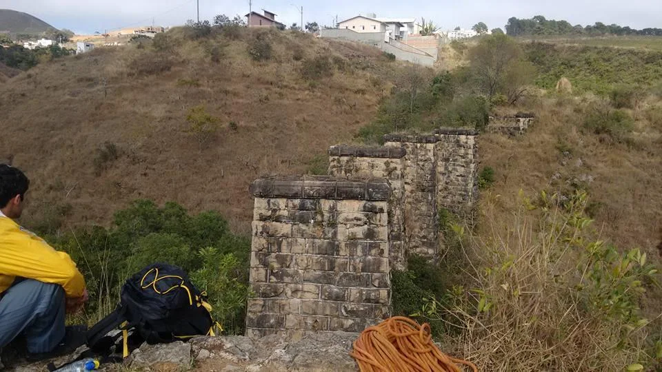

# Croqui Pilastras + Pedreira – Poços de Caldas - MG

## Importante:

* Você é responsável pelos seus atos;
* Esteja consciente que a escalada é um esporte de risco;
* Este guia não tem como base o ensinamento de técnicas de escalada, nem das boas práticas do esporte, apenas orientar praticantes já experientes a se localizar nas linhas dos setores;
* Use Capacete, eventuais pedras soltas podem rolar do cume, assim como agarras se soltarem;
* Cuidado com animais peçonhentos;
* Seja responsável pelo seu LIXO;
* Contribua para a preservação do Meio Ambiente.
* Cuidado com Abelha, evite fazer barulho e escalar em horários de muito sol, elas estão localizadas na segunda pilastra de todos os lados; 
* Por se tratar de uma área Urbana e em constante crescimento evite algazarras e seja cordial com a vizinhança;
* Está é uma área muito frágil, cuide para que as próximas gerações possam também usufruir deste belo local que é tão belo e conta um pouco da história de Poços de Caldas.