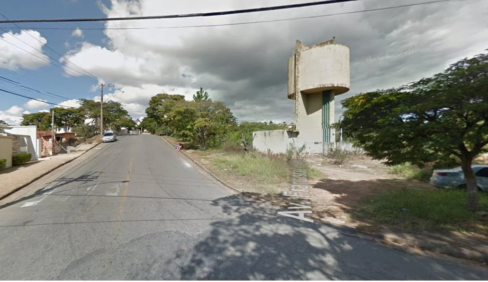

# Como chegar:

## Coordenadas Pilastras
-21.796521, -46.591156

## Coordenadas Estacionamento
Av. Buenos Aires, 452 - Jardim Novo Mundo
Poços de Caldas - MG, 37701-367 - -21.793883, -46.589829

## Mapa saindo do Parque Municipal de Poços de Caldas

Suba a rua a esquerda do parque Country Club (Rua Francisco Jesualdi) ao final dela encontrará a caixa d´água do bairro como da foto a seguir:

Vire a primeira a direita logo após o reservatório (Av. Buenos Aires) e estacione próximo ao número 452 quase ao final da rua:

A trilha é toda de cascalho sem dificuldades de acesso e locomoção. Após descer o primeiro trecho, vire à esquerda e siga reto, na próxima bifurcação vire à esquerda novamente e já encontrara o primeiro setor, o Vale.