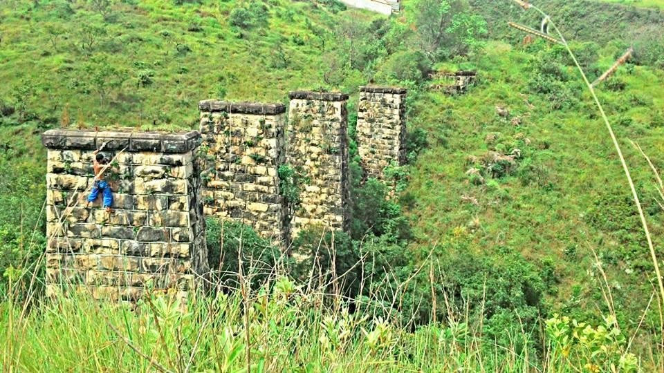

---
nome: As Pilastras
mapas:
- caminho_imagem_mapa: imagens/setor_as_pilastras_p1_i1.webp
  referencias:
  - escalada: Pela raiz
    ids:
    - '1'
  - escalada: Buraco de cobra
    ids:
    - '2'
  - escalada: Normal
    ids:
    - '3'
  - escalada: Bromélia
    ids:
    - '4'
  - escalada: Pur musgo
    ids:
    - '5'
  - escalada: Vai cabeça
    ids:
    - '6'
  - escalada: Silas and Tubarrão
    ids:
    - '7'
  - escalada: Projeto 8
    ids:
    - '8'
  - escalada: Projeto 9
    ids:
    - '9'
  - escalada: Projeto 10
    ids:
    - '10'
  - escalada: Madame satã
    ids:
    - '11'
  - escalada: Dançando com a Chuva
    ids:
    - '12'
  - escalada: Gambá xereta
    ids:
    - '13'
  - escalada: Top Rope
    ids:
    - '14'
  - escalada: Facinha
    ids:
    - '15'
  - escalada: Stuart Little
    ids:
    - '16'
escaladas:
- via_esportiva:
    nome: Pela raiz
    dificuldade: BR_5
- via_esportiva:
    nome: Buraco de cobra
    dificuldade: BR_6SUP
- via_esportiva:
    nome: Normal
    dificuldade: BR_6
- via_movel:
    nome: Bromélia
    dificuldade: BR_5SUP
    descricao: Base em móvel ou fazer uma travessia até a base ao lado.
- via_esportiva:
    nome: Pur musgo
    dificuldade: BR_5
- via_esportiva:
    nome: Vai cabeça
    dificuldade: BR_7A
- via_esportiva:
    nome: Silas and Tubarrão
    dificuldade: BR_7A
- via_esportiva:
    nome: Projeto 8
- via_esportiva:
    nome: Projeto 9
- via_esportiva:
    nome: Projeto 10
- via_movel:
    nome: Madame satã
    dificuldade: BR_5SUP
    descricao: Via mista.
- via_esportiva:
    nome: Dançando com a Chuva
    dificuldade: BR_6SUP
- via_esportiva:
    nome: Gambá xereta
    dificuldade: BR_6SUP
- via_esportiva:
    nome: Top Rope
- via_esportiva:
    nome: Facinha
    dificuldade: BR_4
- via_esportiva:
    nome: Stuart Little
    dificuldade: BR_5
---

Setor clássico com escalada em pilastras de pedra.
Atenção: Abelhas em todas as faces da Segunda Pilastra.
Terceira Pilastra possui projetos inacabados devido às abelhas.
