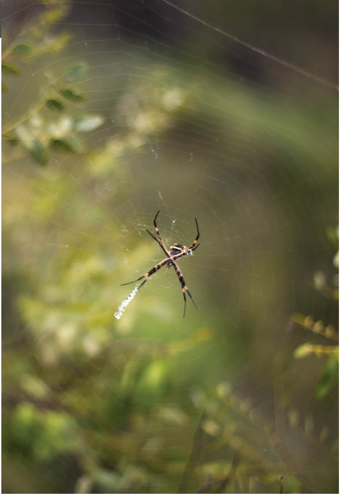

# Ecossistema

O Brasil é considerado como um dos países de maior biodiversidade no mundo, pois segundo Mittermeier e colaboradores (1997), calcula-se que nada menos do que 10% de toda a biota terrestre encontram-se no país.

O município de Sabará localiza-se na região denominada Quadrilátero Ferrífero de Minas Gerais, levantada, sob o ponto de vista zoogeográfico, como uma área de transição entre os biomas Cerrado e Mata Atlântica, compondo um ecótono, ou seja, uma região de grande diversidade de espécies da flora e da fauna, uma vez que há o contato de diferentes comunidades que habitam ambos os biomas e seus hábitats associados (RICKLEFS, 2003; BEGON et al, 2007). Cabe ressaltar, que a vegetação típica do bioma Cerrado, predominante na paisagem, já é composta por um mosaico de diferentes tipos fisionômicos, propiciando por si só, uma grande diversidade de espécies faunísticas associadas com a expressiva diversidade de hábitats por ela oferecida. Estas características ecológicas lhes conferem uma heterogeneidade espacial ímpar, responsável pela expressiva diversidade biológica e alto número de endemismos já catalogados para o bioma (MACHADO, 2004; MACHADO, 2008; BOCCHINGLIERI et al., 2010; PAGLIA, 2012). O Quadrilátero Ferrífero destaca-se no contexto estadual, sobretudo, pela presença de campos rupestres hematíticos e por abrigar muitas espécies endêmicas assim como espécies ameaçadas de extinção, já identificadas em alguns estudos, sendo por isso, definida como prioritária para a conservação em Minas Gerais (DRUMMOND et al., 2005).

## Fauna

A fauna do Cerrado brasileiro é pouco conhecida, sendo recentes os estudos mais consistentes sobre o tema. O Cerrado abriga um grande número de espécies animais, mamíferos, aves, répteis, anfíbios e peixes fazem parte das cerca de 2.500 espécies de vertebrados que utilizam o bioma como hábitat. Isso sem contar os insetos que possuem papel fundamental na ecologia e dinâmica energética dos ecossistemas terrestres.

Entre os vertebrados de maior porte comumente encontrados em suas diferentes fitofisionomias, citamos a cascavel (*Crotalus durissus*), a jararaca (*Bothrops* sp.), o lagarto teiú (*Tupinambis merianae*), a siriema (*Cariama cristata*), a águia cinzenta (*Urubitinga coronata*), o carcará (*Caracara plancus*), o urubu-de-cabeça-preta (*Coragyps atratus*), tucanos (*Ramphastos* sp.), maritacas e araras, o tatu-peba (*Euphractus sexcinctus*), o tatu-galinha (*Dasypus novemcinctus*), o tatu-canastra (*Priodontes maximus*), o tatu-de-rabo-mole (*Cabassous unicinctus*), o tamanduá-bandeira (*Myrmecophaga tridactyla*), o tamanduá-mirim (*Tamandua tetradactyla*), o veado catingueiro (*Mazama gouazoubira*), a raposinha (*Lycalopex vetulus*), o cachorro-do-mato (*Cerdocyon thous*), o lobo-guará (*Chrysocyon brachyurus*), a jeritataca (*Conepatus semistriatus*), o tapeti (*Silvilagus brasiliensis*), o gato-do-mato (*Leopardus tigrinus*), a jaguatirica (*Leopardus pardalis*), o gato mourisco (*Leopardus yagouaroundi*) e as onças parda (*Puma concolor*) e pintada (*Panthera onca*). Na Pedra Rachada, escaladores já visualizaram na estrada, na “volta do nightclimb” uma onça parda atravessando-a, e também há registros de visualizações de tapetis, carcarás e raposinhas, o que não exclui a possibilidade das demais espécies, com exceção da onça pintada, também estarem presentes na região.

Com relação aos invertebrados, os cupins, insetos da Ordem Isoptera, Família Termitidae, são de grande importância, sobretudo pelo seu papel no fluxo de energia no ecossistema, atuando como herbívoros vorazes e servindo de alimentos para um grande número de espécies, tais como o tamanduá-bandeira, as diversas espécies de tatus, a cobra-de-duas-cabeças, dentre outras. Outra ordem de grande importância é a das formigas e abelhas, Ordem Hymenoptera, sobretudo pelo importante papel das abelhas na polinização das flores.

Com isso escaladores, devemos estar atentos a deixar sempre o ambiente da forma na qual o encontramos, para que este sempre nos surpreenda com sua riqueza e belezas naturais. Devemos nos atentar a preservá-lo sempre, mantendo-o limpo e evitando deixar restos de alimentos industrializados na base das pedras e curso das trilhas, pois estes podem ser ingeridos pelos animais silvestres lhes causando danos ao seu bem estar.

Além disso:
- Cuidado redobrado deve ser tomado com relação às abelhas, pois pessoas alérgicas podem ter fortes reações às suas picadas, portanto, evitem ao máximo estar em locais com colmeias ou na presença de enxames em voo.
- Cascavéis e jararacas se “simpatizam” muito à ambientes como o da Pedra Rachada, então esteja sempre atento ao caminhar nas trilhas e aos locais nos quais colocará sua mochila ou se sentará para lanchar.
- A mesma atenção dada à presença das cobras, também deve ser dada à aranhas e escorpiões, que também estão sempre presentes em ambientes de pedreiras e em campos abertos.

## Vegetação

A fitofisionomia se configura em um mosaico formado por Savana Arbórea ou Cerrado senso stricto, Savana graminho-lenhosa associada à Campos Rupestres geralmente com ocorrência para altitudes superiores à 1500 metros nas cristas das serras, e Campos Rupestres que aparecem nos afloramentos e solos litólicos de itabirito característicos da Pedra Rachada.

## Clima

O período ideal para a prática da escalada na Pedra Rachada é durante o outono e o inverno, do início de maio até o início de setembro, quando as temperaturas tornam-se mais amenas e a umidade relativa do ar é mais baixa. Nessa época, como dizem os escaladores locais, a pedra fica “colando”, perfeita para encadear seus projetos. De outubro a abril, as temperaturas são mais elevadas e as chances de chuva aumentam, especialmente no período de dezembro a março. Esta não é a melhor época para uma escalada forte durante o dia e muita atenção para fortes tempestades deve ser tomada, mas durante a noite o tempo está sempre fresco, perfeito para o night climb, tradicional no setor.