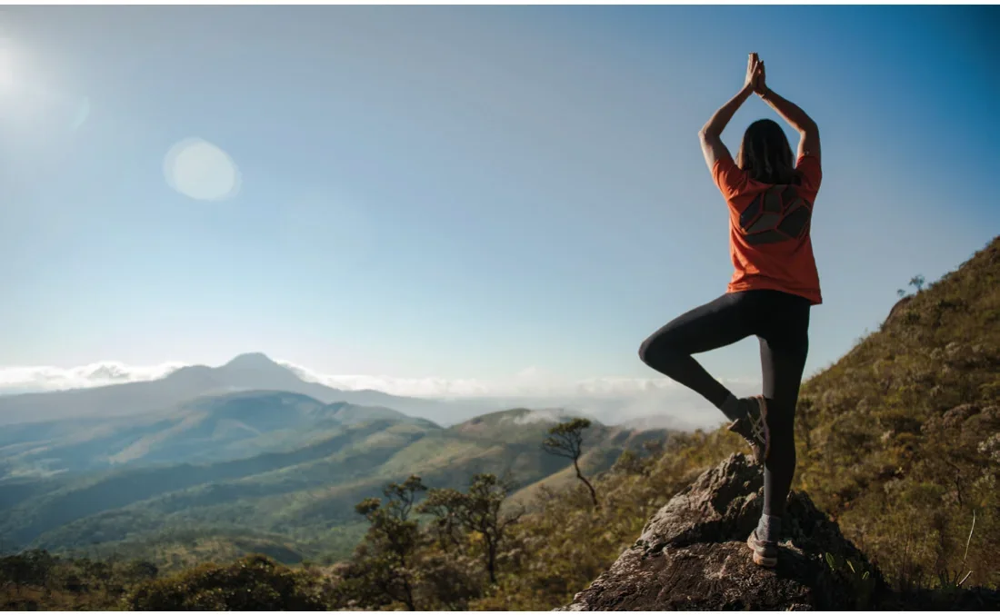

# Ecoturismo

Em Sabará, o ecoturismo pode ser praticado principalmente no Arraial Velho e no Pompéu, pequenos vilarejos às margens da Estrada Real. Além disso, a cidade acolhe a bela Área de Proteção Ambiental da Serra da Piedade, da qual a Pedra Rachada faz parte. Com vegetação de campos ferruginosos, esta APA possui grande riqueza e diversidade de espécies. Por lá, é possível realizar vários passeios pelas suas trilhas de mata Atlântica.

Nessas regiões, o visitante tem contato singular com o ambiente natural. Lá, muitos esportistas já praticam caminhadas na natureza, mountain bike e boulder. Passeios a cavalo também podem ser realizados em determinadas áreas.

Além de promover o bem-estar da população envolvida, o ecoturismo propicia um maior contato do homem com o meio natural e cria um novo tipo de relação, incentivando-o a preservar os recursos naturais e a valorizar da vida. É um dos principais meios de educação sustentável e formação de uma consciência ambientalista através da interpretação do ambiente.

Em Sabará é possível, também, visitar parques ecológicos gratuitamente:

## Parque Eco Pedagógico Quinta dos Cristais

O Parque possui uma grande área verde, situada na porção sul da cidade, na estrada para Olaria no bairro Adelmolândia. Possui ainda diversas atrações como o Museu Temático da Escravidão, Museu de Antiguidades, Museu da Nanoescultura, trilhas, belas vistas panorâmicas da região, nascentes e riachos. O Parque está aberto ao público aos fins de semana e feriados, das 11 às 19 horas. A visitação ao parque é gratuita.

- **Endereço:** Rua Gavião, 1 - Adelmolândia
- **Informações:** www.quintadoscristais.com.br / (31) 3671-3241.

## Parque Natural Municipal Chácara do Lessa

A poucos metros do centro histórico, o visitante pode contemplar a natureza, visitar ruínas e minas remanescentes do século XVIII e XIX. No mirante, está disponível uma belíssima vista panorâmica da região. Oferece opções para trilhas interpretativas e pequenas caminhadas. O parque está aberto de terça-feira a domingo, das 08 às 16 horas e a entrada é gratuita.

- **Endereço:** Rua Arthur Lima Júnior, s/nº - Terra Santa
- **Informações:** semma@sabara.mg.gov.br / (31) 3671-2282 / (31) 3672-7694

## Bosque Alfredo Machado

Localizado no centro histórico, possui área verde, viveiro de mudas, cascata, pequenas trilhas, área de descanso e pista para caminhada. Também sedia atualmente a Secretaria Municipal de Meio Ambiente. O parque está aberto de terça-feira a domingo, das 08 às 16 horas e a entrada é gratuita.

- **Endereço:** Av. Serafim Mota Barros s/n – Centro
- **Informações:** semma@sabara.mg.gov.br / (31) 3671-2282 / (31) 3672-7694