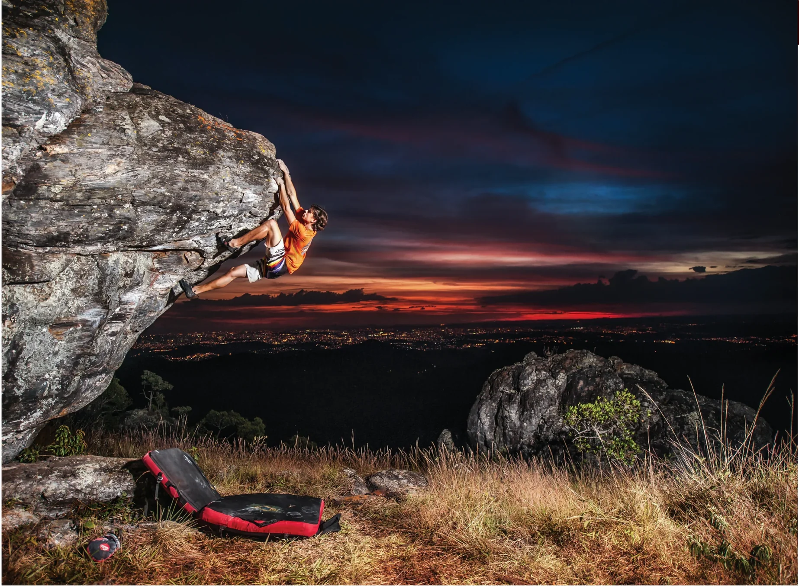
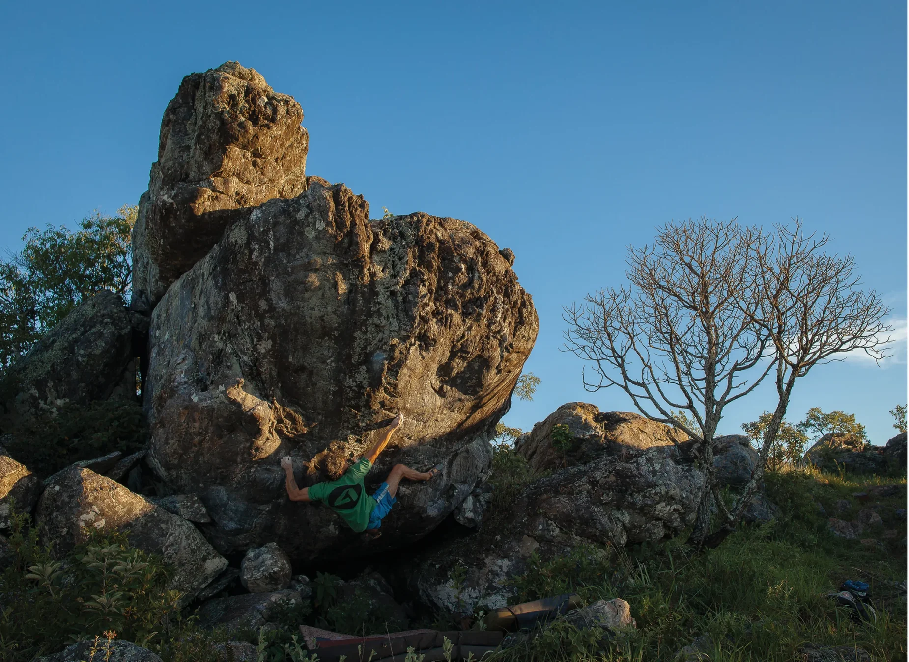

# Cume

Além de algumas das melhores escaladas de toda a Pedra Rachada em todos os circuitos de grau, o setor “Cume” impressiona também pelo visual de tirar o fôlego. São quase 1500m de altitude que proporcionam 360º de uma vista estonteante de toda a região metropolitana de Belo Horizonte e seus arredores, com um pôr do sol digno de filme. Difícil aqui é decidir qual linha escalar, mas, independente do seu grau de escalada, não saia de lá sem ao menos conhecer o mega-clássico “Blood América”.

## Acesso (30 min)

A partir do “Estacionamento 2”, siga a trilha principal que passa à esquerda do “Bloco 1”, à direita do bloco “Lua cheia” e chega ao bloco “Rolling Stones”. Contorne-o pela direita e siga a trilha pegando a segunda trilha que sobe à esquerda, em direção à grande pedra com uma rachadura no meio (em forma de boca). O setor “Cume” consiste em um grande platô com um aglomerado de blocos no cume do morro.

## Boulders Clássicos

- **4. Mosquitos** – V2
- **19. Sai do teto** – V3
- **28. Seriema** – V3
- **8. Blood América** – V4
- **12. Mistral** – V7
- **11. The summit** – V7
- **21. Laranja mecânica** – V8
- **14. Testarossa** – V10

> "Superar o fácil não tem mérito, é obrigação; vencer o difícil é glorificante; ultrapassar o outrora impossível é esplendoroso."  
> — *Alexandre Fonteles*

> "É melhor viver dez anos a mil do que mil anos a dez."  
> — *Lobão*

