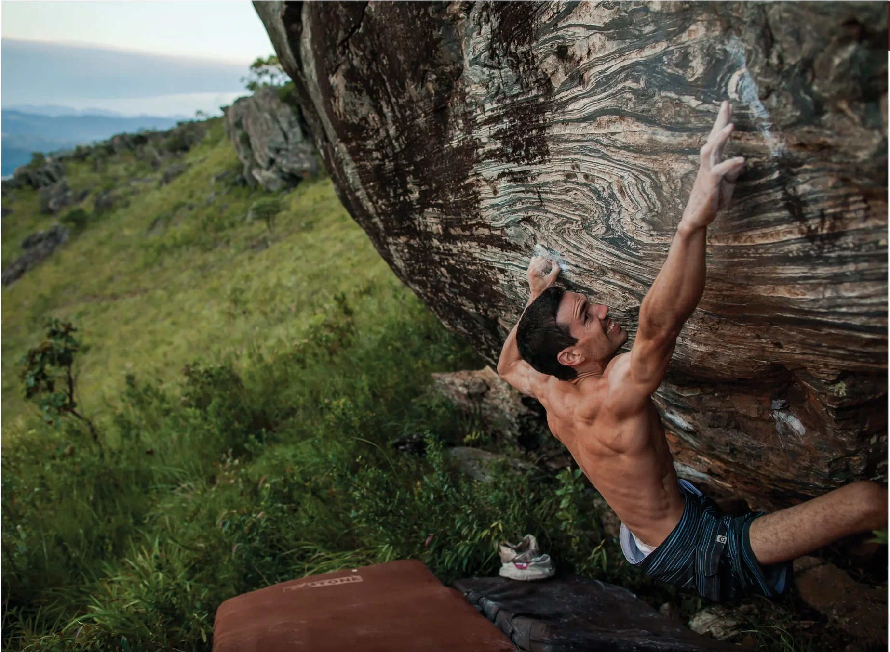

# Daqui a 20 Anos

Último setor antes do cume da Pedra Rachada que, apesar de possuir poucos blocos, guarda algumas das escaladas mais desafiadoras mentalmente de todo o complexo. Dois clássicos highball fazem deste setor um dos preferidos de muitos viciados em adrenalina. Se você gosta de apertar, não deixe de tentar o único “Amanita” v11.

## Acesso (25 min)

Este é o último setor antes do cume. Para acessá-lo, a partir do “Estacionamento 2”, siga a trilha principal que sobe passando à esquerda do “Bloco 1” e à direita do bloco “Lua cheia”, chegando ao bloco “Rolling Stones”. Contorne-o pela direita e siga a trilha pegando a segunda trilha que sobe à esquerda, em direção à grande pedra com uma rachadura no meio (em forma de boca). O primeiro bloco, o “Análise crítica” estará logo acima, uns 100m, à sua direita.

## Boulders Clássicos

- 4 Surpresa v3
- 1 Análise crítica v6
- 2 Daqui a 20 anos v7
- 3 Amanita v11

> "No que diz respeito ao empenho, ao compromisso, ao esforço, à dedicação, não existe meio termo. Ou você faz uma coisa bem feita ou não faz."  
> — *Airton Senna*

### 4Climb

Os melhores produtos para as melhores experiências. Experimente essa vibe.  
*Foto: Murilo Vargas*
