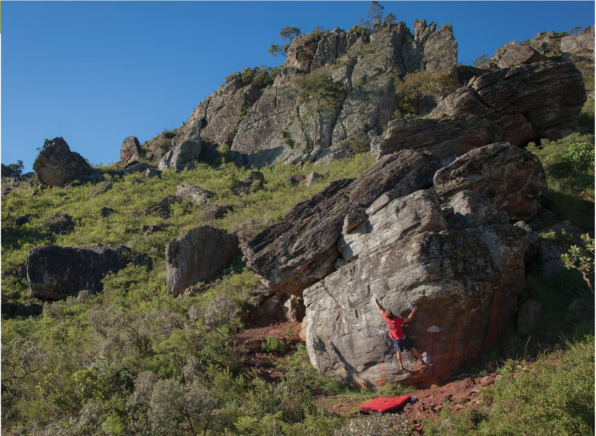
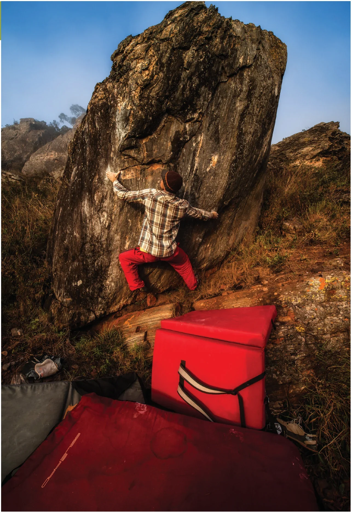
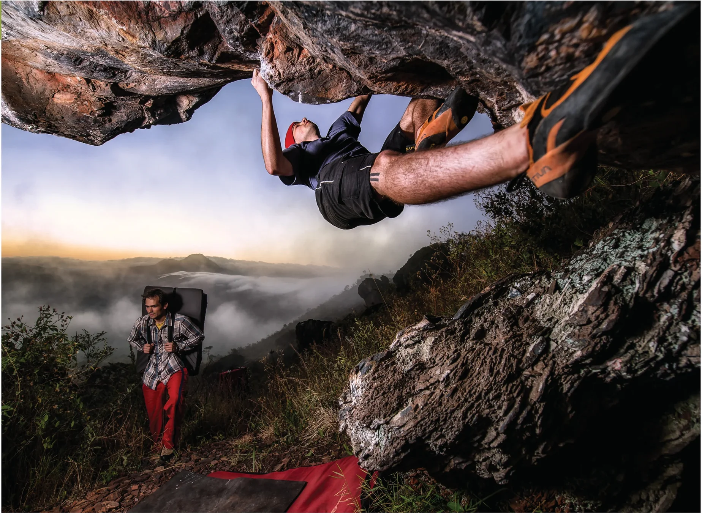
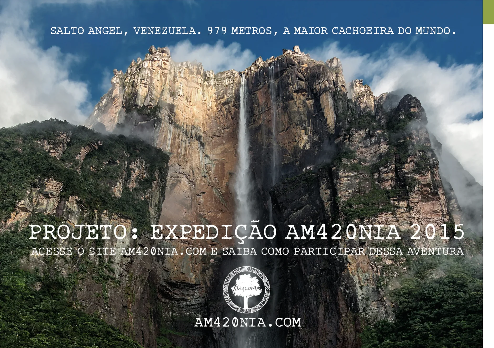
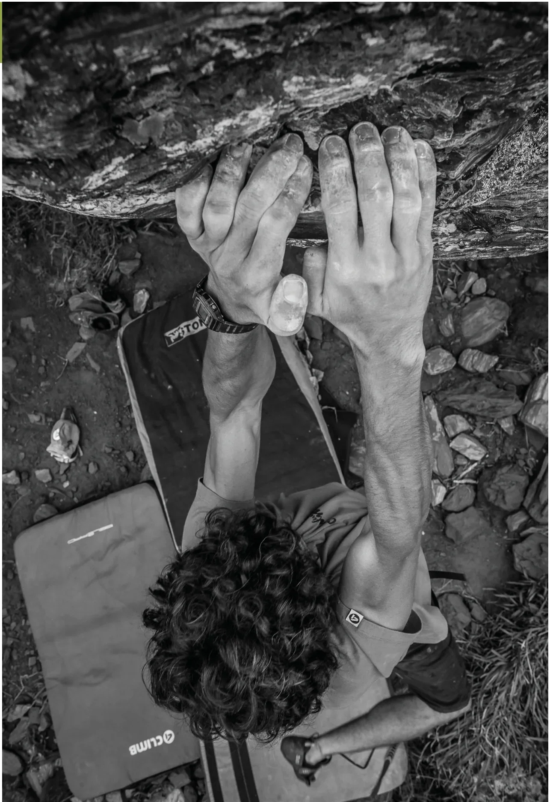

Setor com uma grande concentração de boulders, principalmente do circuito amarelo, o Deslize é também berço do boulder com o maior registro de cadenas no site 8a.nu, o mega-clássico “Lua cheia” v5. Neste setor também está o primeiro boulder aberto em um teto na Pedra Rachada, o incrível “Terceira entrada” v7 além de muitas outras escaladas clássicas, como o bote do “Carne moída” v6, o “Deslize” v8 e o “Hey Fred”, um v10 no melhor estilo compressão da Pedra Rachada!

## Acesso (15 min)

Para acessar este setor, a partir do “Estacionamento 2”, pegue a trilha principal logo em frente e siga reto. Ao passar o “Bloco 1”, à sua direita, siga pela trilha que sobe ao lado dela por mais 2min e chegará ao primeiro bloco deste setor, o “Lua cheia”. Todos os outros blocos estão a menos de 50m daí.

## Mapa de Blocos

### Blocos
- **A** – Lua Cheia
- **B** – Deslize
- **C** – Pequenino
- **D** – Bagagem
- **E** – Hey Fred
- **F** – Bom Boulder
- **G** – Rei Leão
- **H** – Musgo Centenário
- **I** – Zafar

### Conexões de Trilhas
- Trilha a noroeste para o **Setor Yin Yang**
- Trilha a oeste para o **Setor Rolling Stones**
- Trilha a leste vindo do **Setor Entrada**
- Trilha a sudeste para o **Setor Sono do Calango**

## Boulders Clássicos

- **42. Musgo centenário** – V1
- **1. Rala peito** – V2
- **6. Lua cheia** – V5
- **15. Terceira entrada** – V7
- **21. Bagagem** – V6
- **11. Deslize** – V8
- **26. Hey Fred** – V10

> "O mais importante não é chegar ao cume, mas tentar e aprender algo ao longo do caminho."  
> — *Ester Sabadell*

> "O tempo dura bastante para aqueles que sabem aproveitá-lo."  
> — *Leonardo Da Vinci*

*Salto Angel, Venezuela. 979 metros, a maior cachoeira do mundo. Projeto: Expedição Am420nia 2015. Acesse o site am420nia.com e saiba como participar dessa aventura.*

