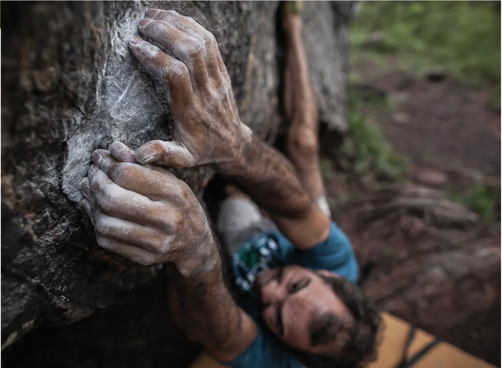
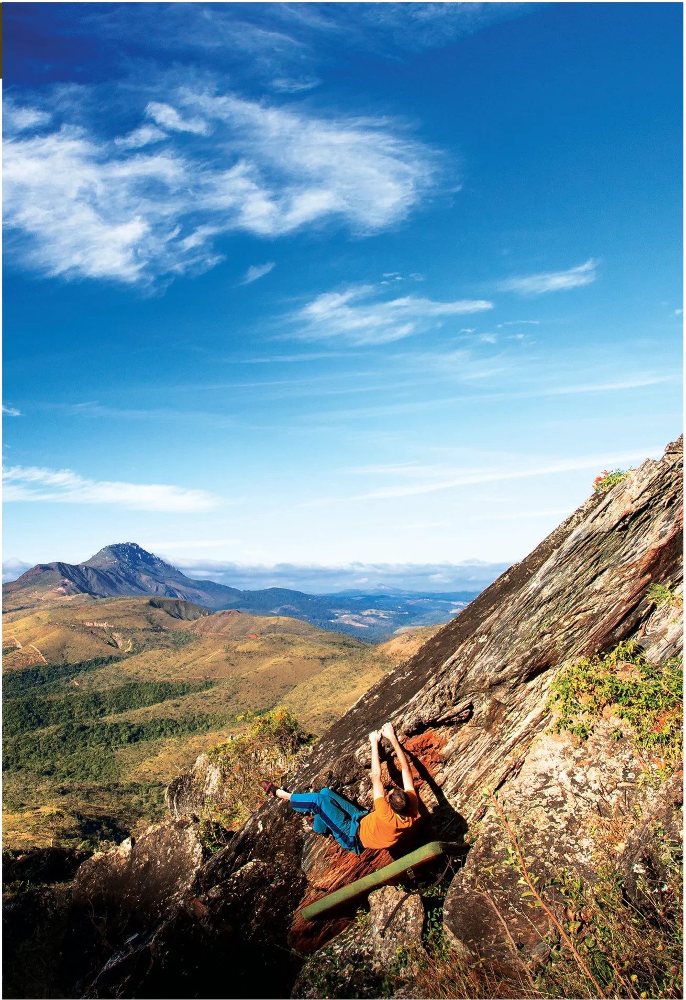

# Entrada

O mais frequentado setor da Pedra Rachada dá as boas vindas aos seus visitantes com dois grandes blocos, conhecidos por “Bloco 1” e “Bloco 2”. São quase 60 escaladas com os mais variados estilos e diversos clássicos de todos os graus. Neste setor também encontra-se a escalada mais difícil já encadenada em toda Pedra Rachada, o incrível “Projeto Sabará”. Não deixe de checar este boulder único, nem que seja para apreciar sua imponente linha!

## Acesso (15 min)

Do estacionamento, pegue a estrada que sobe em direção às pedras até chegar a um plano onde se encontra o primeiro bloco, o “Libélula”. De lá, continue reto pela trilha principal que segue por mais 1min para acessar os gigantes “Bloco 1” e “Bloco 2”. Os outros blocos estão há menos de 1min deles.

## Boulders Clássicos

- **8. Easy** – V1 (listado como V0 nos destaques)
- **13. Pipe line** – V2
- **42. Ziglyn** – V4
- **46. Cadê minha força?** – V5
- **36. Rala frek lek** – V7
- **30. Projeto Sabará** – V12

> "A felicidade só é real quando compartilhada."
> 
> — *Christopher McCandless*

> "Quanto mais eu me elevo, menor eu pareço aos olhos de quem não sabe voar."
> 
> — *Friedrich Nietzsche*

## Blocos do Setor

- **Bloco A – Libélula**: boulders 1 a 3.
- **Bloco B – Bloco 1**: boulders 4 a 23.
- **Bloco C – Bloco 2**: boulders 24 a 48 (incluindo o clássico Projeto Sabará V12).
- **Bloco D – Chupa Lombriga**: boulders 49 a 51.
- **Bloco E – Abraço do Calango**: boulders 52 a 54.
- **Bloco F – Nave**: boulders 55 e 56.

### Esquema dos Blocos e Conexões
- A trilha de subida passa inicialmente pelo **Bloco A (Libélula)**.
- Seguindo pela trilha principal chega-se aos grandes blocos centrais: **Bloco B (Bloco 1)** e **Bloco C (Bloco 2)**.
- A partir da área dos blocos Libélula e Bloco 1 ramificam-se as trilhas secundárias para o **Setor Lua Cheia** (à esquerda) e para o **Setor Sono do Calango** (à direita).
- Próximos ao Bloco 2 encontram-se os blocos **D (Chupa Lombriga)**, **E (Abraço do Calango)** e, mais acima na crista, o **F (Nave)**.
