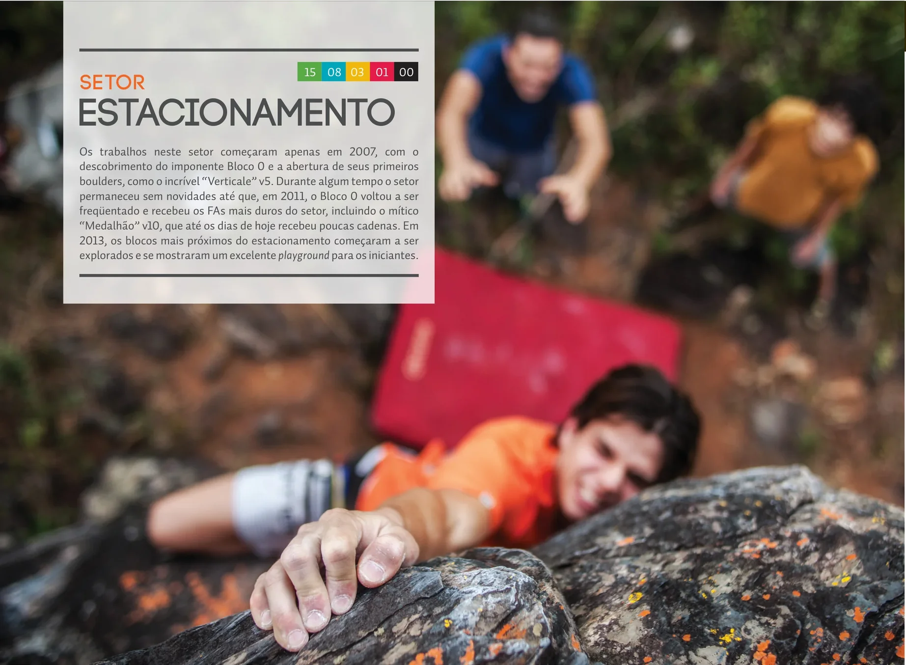
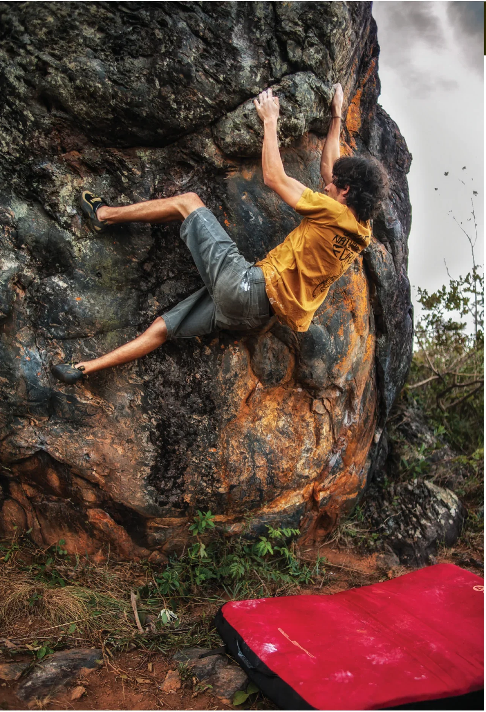

# Estacionamento

Os trabalhos neste setor começaram apenas em 2007, com o descobrimento do imponente Bloco 0 e a abertura de seus primeiros boulders, como o incrível “Verticale” v5. Durante algum tempo o setor permaneceu sem novidades até que, em 2011, o Bloco 0 voltou a ser freqüentado e recebeu os FAs mais duros do setor, incluindo o mítico “Medalhão” v10, que até os dias de hoje recebeu poucas cadenas. Em 2013, os blocos mais próximos do estacionamento começaram a ser explorados e se mostraram um excelente playground para os iniciantes.

## Acesso (10 min)

Ao estacionar o carro é possível avistar, a cerca de 100m, os 03 primeiros blocos. Para acessá-los basta pegar a trilha óbvia que vai em direção a eles por cerca de 1min. Já para os outros blocos, siga a estrada que sobe em direção ao setor “Entrada” e, pouco antes da forte curva à direita, você verá duas trilhas: a da direita te leva ao bloco “Psicotrópicos” e a da esquerda ao “Bloco 0”.

## Boulders Clássicos

- 13 Davy Jones v0
- 16 Aresta v3
- 20 Verticale v5
- 21 Obina v7
- 23 Medalhão v10

> "O melhor escalador do mundo é aquele que mais se diverte."  
> — *Alex Lowe*

*Fotos e vídeos de escalada: [www.facebook.com/vivapedra](https://www.facebook.com/vivapedra)*
