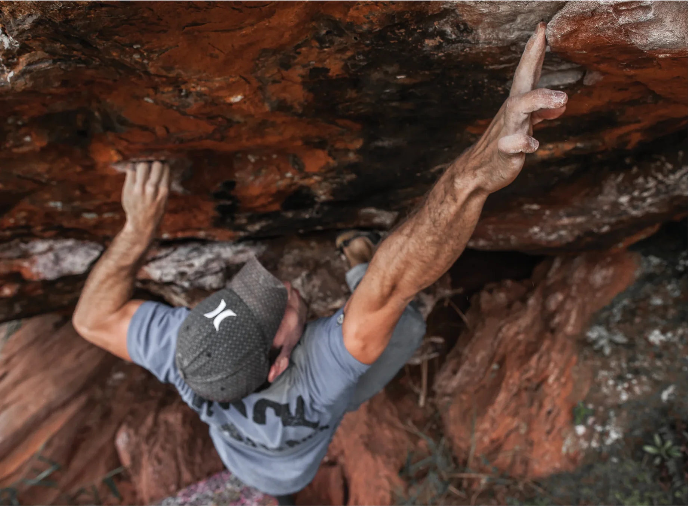

Em 2013, os trabalhos no bloco “Pantaloneta” proporcionaram o surgimento de vários novos boulders que confirmaram este setor como um dos melhores da Pedra Rachada. Os blocos “Rolling Stones” e “Pantaloneta”, que juntos somam a maior concentração de clássicos do local, são obrigatórios a qualquer visitante do local. Aproveite também para conhecer os blocos “Gaston a la meson” e as escaladas do bloco “Universo Paralello”.

## Acesso (20 min)

Este setor fica logo acima do setor “Deslize”. Para acessá-lo, basta seguir a trilha principal que sobe passando pelo setor Entrada (à esquerda do “Bloco 1”) e pelo setor “Deslize”, contornando o bloco Lua cheia pela direita. Logo após o bloco “Zafar”, a primeira trilha à esquerda dá acesso aos blocos “Gaston a la meson”, “Casulo” e “Marrento”. Continuando reto estará bloco “Rolling Stones” e o bloco “Eject”. Um pouco mais a direita está o bloco “Universo Paralello” e, acima dele, o complexo das aranhas, com os blocos “Pantaloneta”, “Octopus”, “Protons” e “Aranha albina”.

### Blocos
- **A** – Gastón a la Mesón
- **B** – Casulo
- **C** – Marrento
- **D** – Rolling Stones
- **E** – Eject
- **F** – Universo Paralelo
- **G** – Pantaloneta
- **H** – Octopus
- **I** – Protóns
- **J** – Aranha Albina

## Boulders Clássicos

- **28. The Doors** – V5
- **7. Gastón a la meson** – V6
- **24. Rolling Stones** – V8
- **26. Amanhã vai ser outro dia** – V9
- **36. Universo Paralello** – V9
- **47. Pantaloneta** – V7
- **45. Tapete mágico** – V10
- **61. Aladim** – V11
- **64. Vaqueros** – V10

> "Quando tudo o que existe entre você e o chão é uma coisa chamada segurança."  
> — *Alto Estilo*

*Alto Estilo. Apoiando suas aventuras desde 1988. Acesse o site altoestilo.com.*

> "Linha Stretch Limits: Alta performance para esportes outdoor."  
> — *4Climb*
