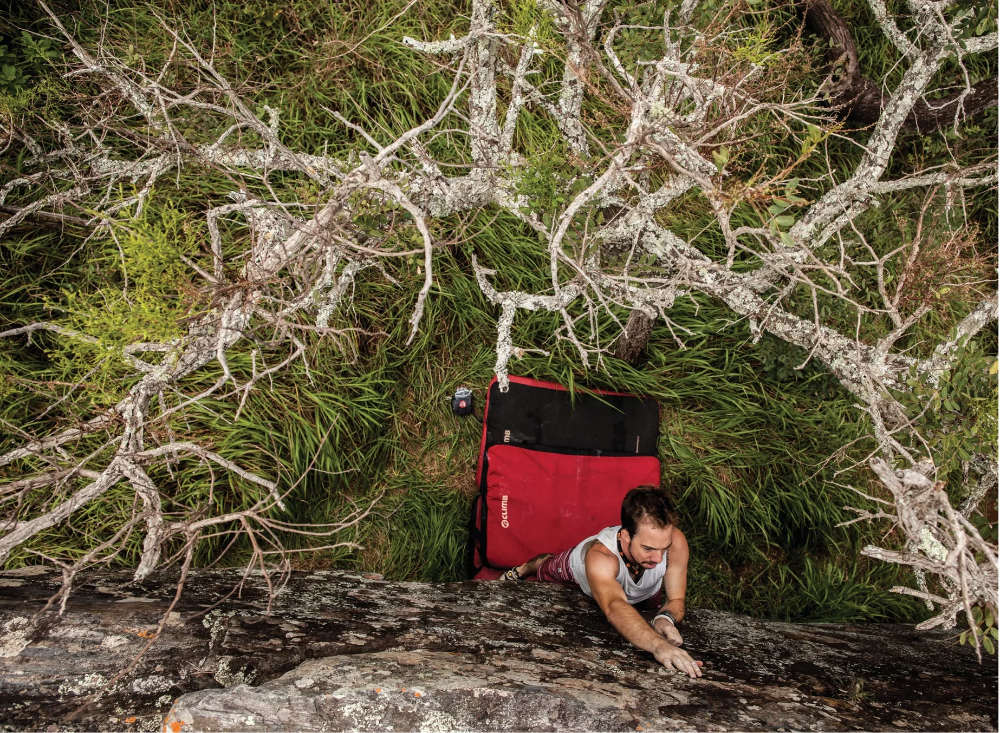

# Sono do Calango

Setor com uma grande concentração de boulders do circuito verde e muitas linhas clássicas. Apesar de estar ao lado do Setor Entrada, é muito pouco conhecido e freqüentado. É também lugar das duas únicas vias de toda a Rachada, que valem muito a pena serem escaladas! O destaque para este setor fica por conta dos blocos “High vibe”, “Das vias” e “Sono do calango”, que possuem escaladas incríveis dos mais variados graus de dificuldade.

## Acesso (15 min)

O melhor acesso para este setor, a partir do “Estacionamento 2” é pegar a trilha principal até o “Bloco 2” e continuar pela trilha que sobe à direita dele por 1min, chegando ao gigante bloco “Das vias”. Chegando a ele, o bloco “Sono do calango”, que da nome ao setor, está à direita, poucos metros mais acima. Para acessar os outros blocos, basta seguir a trilha à esquerda do bloco “Das vias”.

## Boulders Clássicos

- **12. Vendo a vó pela greta** – V0
- **28. Chaparam os bago** – V1
- **24. Sono do calango** – V3
- **20. Bromélia** – V4
- **19. Módulo SDS** – V7

> "As montanhas são uma espécie de reino mágico onde, por meio de algum encantamento, eu me sinto a pessoa mais feliz do mundo."
> 
> — *Bernardo Collares*

## Blocos do Setor

- **Bloco A – High Vibe**: boulders 1 e 2.
- **Bloco B – Batentes**: boulders 3 e 4.
- **Bloco C – Rala Bucho**: boulders 5 e 6.
- **Bloco D – Varejeira**: boulder 7.
- **Bloco E – Tótem**: boulder 8.
- **Bloco F – Pinça**: boulders 9 a 11.
- **Bloco G – Das Vias**: boulders e vias 12 a 16.
- **Bloco H – Sono do Calango**: boulders 17 a 34.
