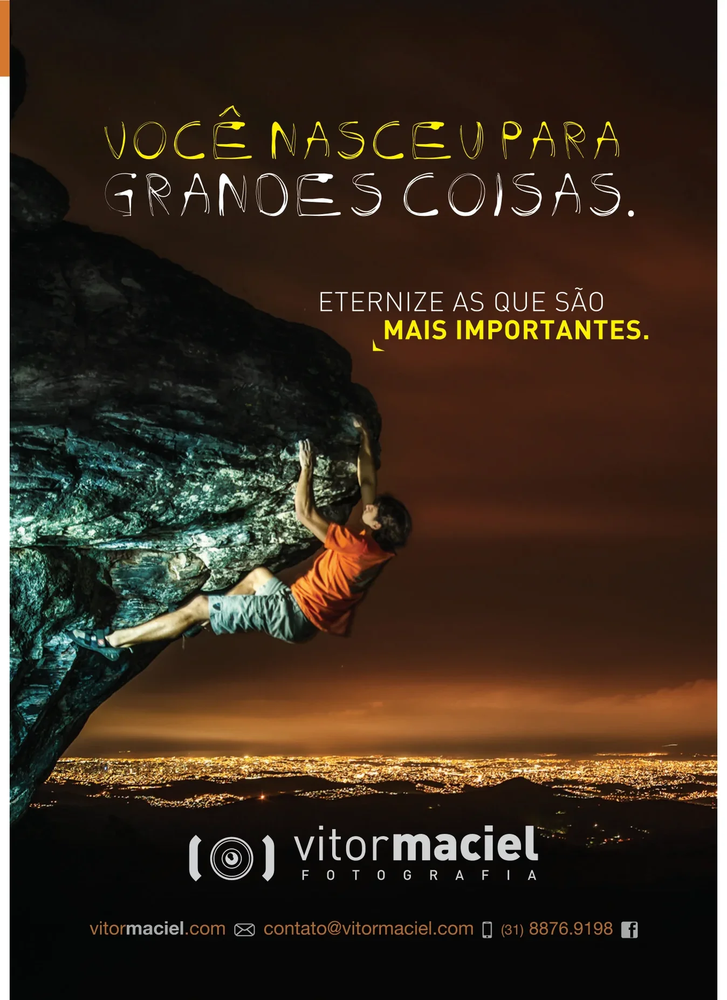
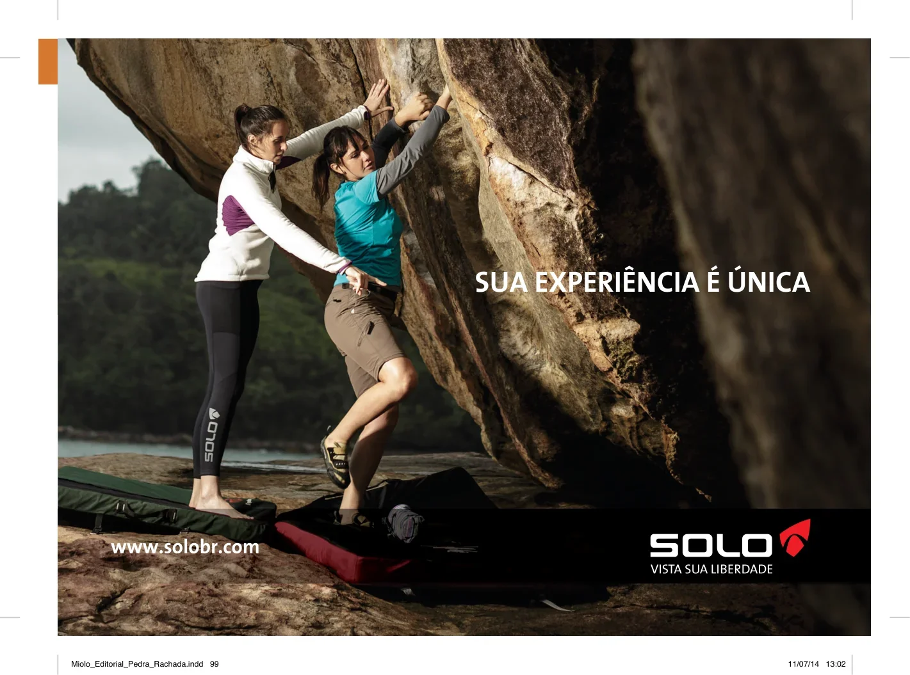
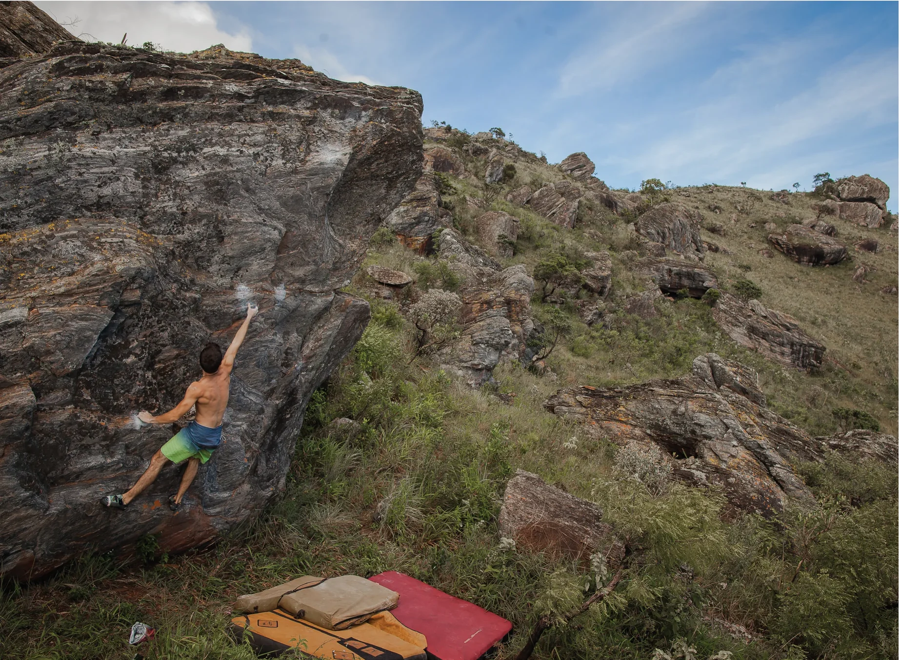

# Tosco

Setor que abriga uma grande quantidade de boulders do circuito verde e azul, com destaque para o clássico “Aresta visual” v3. Por outro lado, se você escala boulders do circuito amarelo ou vermelho e gosta de dinâmicos, este será um de seus setores preferidos, com escaladas incríveis deste estilo nos blocos “Aresta visual”, “Tosco” e “Motricidade”. Mas não pense que a diversão acaba por aí, se você curte aderência não deixe de visitar o mítico “Frita pé” e quebrar a cabeça desvendando seus betas!

## Acesso (25 min)

A partir do “Estacionamento 2” siga a trilha principal, passando à esquerda do “Bloco 1” e à direita do bloco “Lua cheia” até chegar ao bloco “Rolling Stones”. De lá, siga pela trilha que segue para a esquerda do bloco por 1min até os blocos “Boliche”, o “Amarelão” e o “Lajinha”. Logo acima dele, encontra-se o bloco “Aresta visual” e o acesso para todos os outros blocos.

## Boulders Clássicos

- **9. Aresta visual** – V3
- **15. Frita pé** – V6
- **22. Tosco** – V8
- **36. Potencial de ação** – V11
- **38. Motricidade fina** – V11

## Blocos

- **Bloco A** – Boliche (boulders 1 a 3)
- **Bloco B** – Amarelão (boulders 4 e 5)
- **Bloco C** – Aresta Visual (boulders 6 a 11)
- **Bloco D** – Lajinha (boulders 12 e 13)
- **Bloco E** – Viradinha Nacional (boulder 14)
- **Bloco F** – Frita Pé (boulders 15 e 16)
- **Bloco G** – Rolezinho (boulders 17 e 18)
- **Bloco H** – Cor do Bicho (boulders 19 e 20)
- **Bloco I** – Tosco (boulders 21 a 25)
- **Bloco J** – Tô Partindo (boulders 26 a 28)
- **Bloco K** – Oval (boulders 29 a 34)
- **Bloco L** – Motricidade (boulders 35 a 44)
- **Bloco M** – Night Climb (boulders 45 a 47)
- **Bloco N** – Piolho de Cobra (boulders 48 a 50)
- **Bloco O** – Democrático (boulders 51 a 54)
- **Bloco P** – Ferrugem (boulders 55 a 58)

> "Você nasceu para grandes coisas. Eternize as que são mais importantes."  
> — *Vitor Maciel Fotografia*

*Sua experiência é única. Solo – Vista sua liberdade. www.solobr.com*

> "A cadena é o resultado do treino!"  
> — *www.sapoagarras.com*

> "Se você encontrar um caminho sem obstáculos, ele provavelmente não leva a lugar nenhum."  
> — *Frank Clark*

> "Não existe um caminho para a felicidade. A felicidade é o caminho."  
> — *Mahatma Gandhi*
