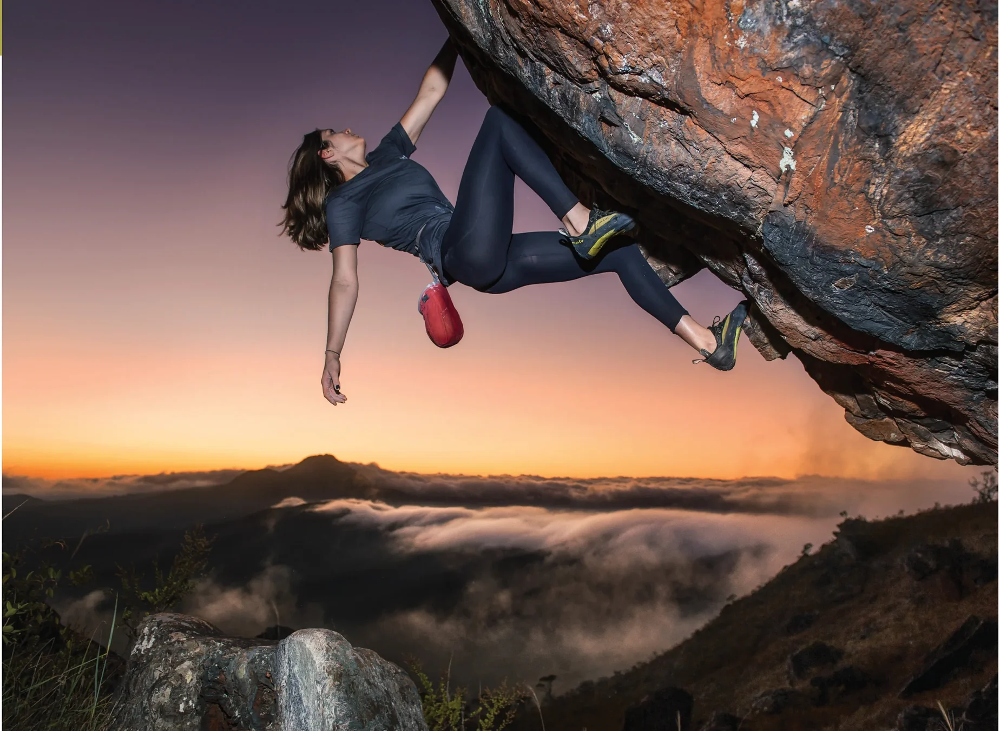

# Yin Yang

Esse pequeno aglomerado de blocos, à direita do setor do Deslize, começou a ser explorado em 2006, com a abertura do clássico “Bicicletinha 2000”. Permaneceu sem novidades expressivas por alguns anos até que, em 2011, o escalador Mahavir Jneesh realizou a primeira ascensão do boulder “Yang” e, logo após, sua saída sentada denominada “Yin Yang”, dois mega clássicos da Pedra Rachada!

## Acesso (15 min)

A partir do “Estacionamento 2”, siga pela trilha principal e, após passar à esquerda do “Bloco 1”, continue subindo até o bloco “Lua Cheia” e contorne-o pela direita, de onde será possível avistar o setor “Yin Yang” à sua direita. Para acessá-lo, basta tomar a trilha à direita em frente ao bloco “Bagagem” que vai em direção ao setor.

## Boulders Clássicos

- 19 Fenda Cega v0
- 7 Bicicletinha 2000 v5
- 15 Yin Yang v10/11

> "A felicidade não está na estrada que leva a algum lugar. A felicidade é a própria estrada."  
> — *Bob Dylan*

### Revista PQN (Pão de Queijo Notícias)

O nosso PÃO DE QUEIJO É MUITO MELHOR que o dos outros!

A revista Pão de Queijo Notícias é uma publicação de variedades, moderna com foco no profissional da Comunicação. Publicidade, Marketing, Jornalismo, Economia, Sustentabilidade, Moda, Cultura, Esporte, Turismo, Automóveis, Franchising, Relações Públicas e muito, muito mais para você!

- **Assine:** (31) 2127 4651 | assinar@pqn.com.br | [www.pqn.com.br](http://www.pqn.com.br)
- **Finalista do Prêmio Sebrae de Jornalismo**

*Destaques da Edição:*
- **Capa:** Érika Januza, a mineira que faz sucesso na novela das nove – *Eu caio na rede!*
  O comportamento da nova Classe C, que entrou de vez na onda tecnológica e terminou o ano de 2013 com 17% de alcance na rede - mais que o dobro dos 8% registrados em 2012 - reflete um pouco do modo de ser da atriz mineira Érika Januza. Sucesso na novela das 9, da Rede Globo, “Em Família”, a mineira de Contagem vive a personagem Alice, uma estudante de música, fruto de um estupro coletivo sofrido por sua mãe. Com o sucesso, ela mostra-se consciente de seu papel de “Relações Públicas” para a cidade mineira e não abre mão de suas raízes e de sua interação nas redes sociais. Érika, que adora postar suas fotos no Facebook – seja com os amigos, família ou elenco da novela – é fã das novas tecnologias do mundo moderno e não liga para essa grande exposição virtual. Vale tudo para se aproximar ainda mais de sua legião de fãs e ainda humanizar o seu trabalho na telinha.
- **Entrevista:** Márcio Lacerda e suas duas novas conquistas: Carnaval 2014 e o BRT Move.
- **Negócios:** BH Fala a Sua Língua oferece 2300 títulos de jornais de 150 países.
- **Empreendedor:** Carioca edita revista voltada aos imigrantes brasileiros em Portugal.
- **Carnaval:** Revista PQN cai na folia, lança o bloco “Quem não se comunica, se trumbica!” e arrasta multidão.
- **Turismo:** Você já fez a sua reserva de hotel para assistir aos jogos da Copa do Mundo?

