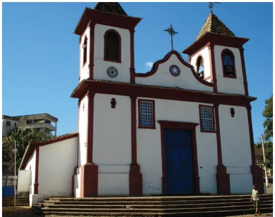
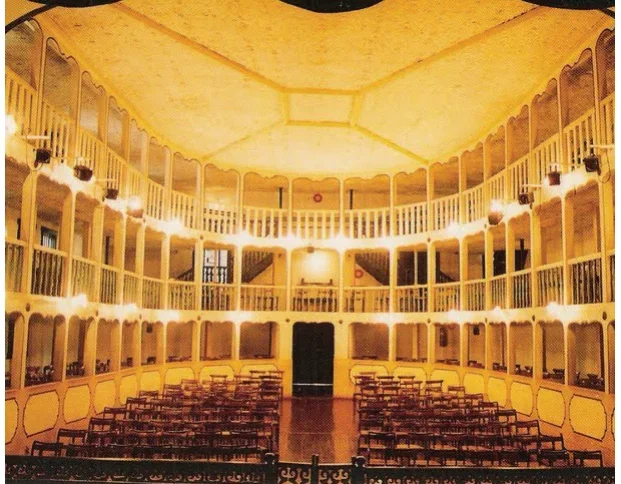

# Turismo Histórico e Religioso

Uma seleção de alguns dos melhores pontos turísticos da cidade de Sabará:

## Igreja Nossa Senhora do Ó, de 1717

Uma das mais representativas do barroco mineiro, possui influência chinesa em sua arquitetura externa e na decoração interna. O seu nome é devido às ladainhas de Nossa Senhora que sempre começam com o Ó e seguem com algum louvor.

- **Localização:** Largo Nossa Senhora do Ó
- **Funcionamento:** Diário, das 08h às 17h.

## Igreja Matriz Nossa Senhora da Conceição, de 1710

É uma das mais antigas de Minas Gerais e uma das mais ricas matrizes mineiras. Representa um período em que o ouro era abundante na região. Nela se encontram influência das três fases do Barroco Brasileiro e também fortes influências orientais.

- **Localização:** Praça Getúlio Vargas.
- **Funcionamento:** Diário, das 08h às 17h.

## Igreja Nossa Senhora do Carmo, de 1763

A igreja é um dos palcos mais espetaculares da arte e da genialidade do Mestre Aleijadinho, ao lado de outros artistas. Templo característico da terceira fase do Barroco Mineiro e do estilo Rococó, é tombada como Patrimônio Histórico.

- **Localização:** Rua do Carmo
- **Funcionamento:** Diário, das 09h às 17h.

## Conjunto arquitetônico da Rua Dom Pedro II

A antiga Rua Direita possui um conjunto arquitetônico tombado como Patrimônio Histórico e Artístico Nacional. Destacam-se entre as edificações, o Solar do Padre Correia, a Casa Azul, o Sobrado de Dona Sofia e a Casa da Ópera (Teatro Municipal).

- **Localização:** Rua Dom Pedro II
- **Funcionamento:** Varia em função ponto turístico.