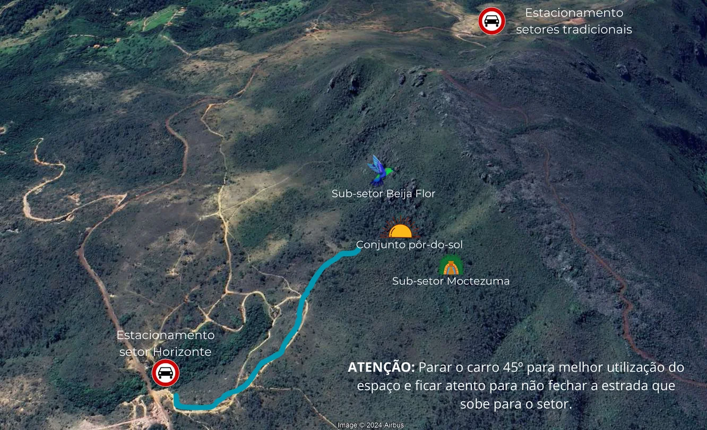

---
---
# MAPAS GERAIS

**Estacionamento setor Horizonte**
ATENÇÃO: Parar o carro 45º para melhor utilização do espaço e ficar atento para não fechar a estrada que sobe para o setor.

**Estacionamento setores tradicionais**

- Sub-setor Beija Flor
- Conjunto pôr-do-sol
- Sub-setor Moctezuma