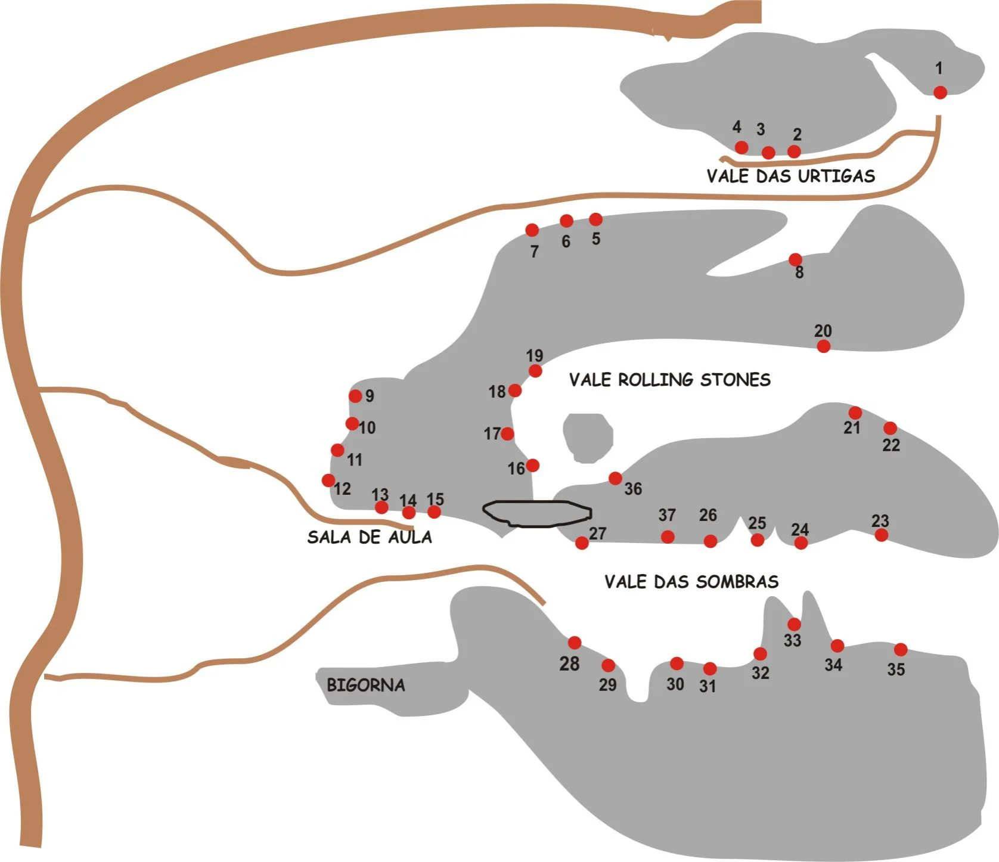

---
escaladas:
- via_esportiva:
    nome: Xeque Mate
    dificuldade: BR_6_BARRA_6SUP
- via_esportiva:
    nome: Caminho das Formigas
    dificuldade: BR_5
- via_esportiva:
    nome: Camelos Hidrofóbicos
    dificuldade: BR_4
- via_esportiva:
    nome: Urtigas Assassinas
    dificuldade: BR_4
- via_esportiva:
    nome: Só as Cachorras
    dificuldade: BR_7B
- via_esportiva:
    nome: Lança Chamas
    dificuldade: BR_8A
- via_esportiva:
    nome: Ataque das Cachorras
    dificuldade: BR_6SUP
- via_esportiva:
    nome: Wilham Thor
    dificuldade: BR_6
- via_esportiva:
    nome: Linha do Tempo
    dificuldade: BR_7A
- via_esportiva:
    nome: Ilusão de Ótica
    dificuldade: BR_6SUP
- via_movel:
    nome: Fendazinha
    dificuldade: BR_7A
- via_esportiva:
    nome: Complicada e Perfeitinha
    dificuldade: BR_7A
- via_esportiva:
    nome: Cabana do Pai Tomaz
    dificuldade: BR_6
- via_esportiva:
    nome: Davi e Golias
    dificuldade: BR_5
- via_esportiva:
    nome: De Olho no Buraco
    dificuldade: BR_5
- via_esportiva:
    nome: Meu Casamento é um Perrengue
    dificuldade: BR_7A
- via_esportiva:
    nome: Canaleta Mãe Diná
    dificuldade: BR_6
- via_movel:
    nome: Só o Zói
    dificuldade: BR_4
- via_esportiva:
    nome: O Susto
    dificuldade: BR_7A
- via_esportiva:
    nome: Tortuosa Sempre
    dificuldade: BR_7A
- via_esportiva:
    nome: Tensão do Cliff
    dificuldade: BR_6SUP
- via_esportiva:
    nome: Tira o Pé Daí
    dificuldade: BR_7A
- via_esportiva:
    nome: A Procura de Pai Mei
    dificuldade: BR_6SUP
- via_esportiva:
    nome: Encontro com Pai Mei
    dificuldade: BR_6
- via_movel:
    nome: Movimentos Fluidos
    dificuldade: BR_5SUP
- via_movel:
    nome: Lechimeiafobia
    dificuldade: BR_5
- via_esportiva:
    nome: Taxidermia Hipofágica
    dificuldade: BR_6
- via_esportiva:
    nome: Amarra a Gaia
    dificuldade: BR_5SUP
- via_esportiva:
    nome: Disova Bernéstica
    dificuldade: BR_5SUP
- via_esportiva:
    nome: Diga não ao Braz
    dificuldade: BR_5
- via_esportiva:
    nome: 21 Tec Tec
    dificuldade: BR_5
- via_esportiva:
    nome: Kill Bill
    dificuldade: BR_6SUP
- via_esportiva:
    nome: É Assim que se Faz
    dificuldade: BR_5
- via_esportiva:
    nome: Despedida de um Amigo
    dificuldade: BR_6_BARRA_6SUP
- via_esportiva:
    nome: Tricam é o Cara
    dificuldade: BR_7A
- via_esportiva:
    nome: Não Puxa Não
    dificuldade: BR_5
- via_movel:
    nome: HellBoy
    dificuldade: BR_6_BARRA_6SUP
mapas:
- caminho_imagem_mapa: imagens/setor_bigorna_ou_lapa_da_zumba_p0_i0.webp
  referencias:
  - escalada: Xeque Mate
    ids:
    - '1'
  - escalada: Caminho das Formigas
    ids:
    - '2'
  - escalada: Camelos Hidrofóbicos
    ids:
    - '3'
  - escalada: Urtigas Assassinas
    ids:
    - '4'
  - escalada: Só as Cachorras
    ids:
    - '5'
  - escalada: Lança Chamas
    ids:
    - '6'
  - escalada: Ataque das Cachorras
    ids:
    - '7'
  - escalada: Wilham Thor
    ids:
    - '8'
  - escalada: Linha do Tempo
    ids:
    - '9'
  - escalada: Ilusão de Ótica
    ids:
    - '10'
  - escalada: Fendazinha
    ids:
    - '11'
  - escalada: Complicada e Perfeitinha
    ids:
    - '12'
  - escalada: Cabana do Pai Tomaz
    ids:
    - '13'
  - escalada: Davi e Golias
    ids:
    - '14'
  - escalada: De Olho no Buraco
    ids:
    - '15'
  - escalada: Meu Casamento é um Perrengue
    ids:
    - '16'
  - escalada: Canaleta Mãe Diná
    ids:
    - '17'
  - escalada: Só o Zói
    ids:
    - '18'
  - escalada: O Susto
    ids:
    - '19'
  - escalada: Tortuosa Sempre
    ids:
    - '20'
  - escalada: Tensão do Cliff
    ids:
    - '21'
  - escalada: Tira o Pé Daí
    ids:
    - '22'
  - escalada: A Procura de Pai Mei
    ids:
    - '23'
  - escalada: Encontro com Pai Mei
    ids:
    - '24'
  - escalada: Movimentos Fluidos
    ids:
    - '25'
  - escalada: Lechimeiafobia
    ids:
    - '26'
  - escalada: Taxidermia Hipofágica
    ids:
    - '27'
  - escalada: Amarra a Gaia
    ids:
    - '28'
  - escalada: Disova Bernéstica
    ids:
    - '29'
  - escalada: Diga não ao Braz
    ids:
    - '30'
  - escalada: 21 Tec Tec
    ids:
    - '31'
  - escalada: Kill Bill
    ids:
    - '32'
  - escalada: É Assim que se Faz
    ids:
    - '33'
  - escalada: Despedida de um Amigo
    ids:
    - '34'
  - escalada: Tricam é o Cara
    ids:
    - '35'
  - escalada: Não Puxa Não
    ids:
    - '36'
  - escalada: HellBoy
    ids:
    - '37'
---

# Setor Bigorna ou Lapa da Zumba

