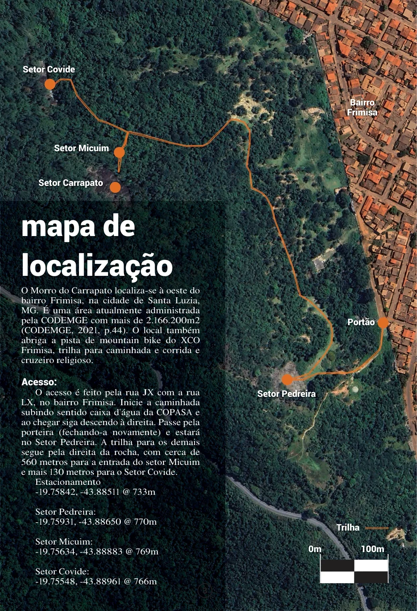

# Mapa de localização

O Morro do Carrapato localiza-se à oeste do bairro Frimisa, na cidade de Santa Luzia, MG. É uma área atualmente administrada pela CODEMGE com mais de 2.166.200m2 (CODEMGE, 2021, p.44). O local também abriga a pista de mountain bike do XCO Frimisa, trilha para caminhada e corrida e cruzeiro religioso.

## Acesso

O acesso é feito pela rua JX com a rua LX, no bairro Frimisa. Inicie a caminhada subindo sentido caixa d’água da COPASA e ao chegar siga descendo à direita. Passe pela porteira (fechando-a novamente) e estará no Setor Pedreira. A trilha para os demais segue pela direita da rocha, com cerca de 560 metros para a entrada do setor Micuim e mais 130 metros para o Setor Covide.

### Coordenadas

- **Estacionamento:** -19.75842, -43.88511 @ 733m
- **Setor Pedreira:** -19.75931, -43.88650 @ 770m
- **Setor Micuim:** -19.75634, -43.88883 @ 769m
- **Setor Covide:** -19.75548, -43.88961 @ 766m

