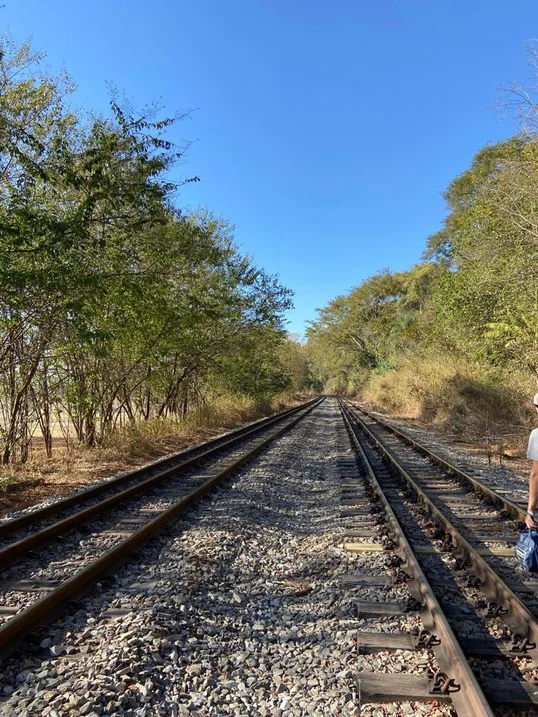

# Como Chegar

## Coordenadas
- **Bar do Sr. João:** [R. Santo Antônio - Ribeirão da Mata, Santa Luzia - MG](https://www.google.com.br/maps/place/Bar+do+Sr.+Jo%C3%A3o/@-19.7032219,-43.8773559,15z/data=!4m15!1m8!3m7!1s0xa67d2f3991c267:0x7ba831ba35ec1a3b!2sBar+do+Sr.+Jo%C3%A3o!8m2!3d-19.7032219!4d-43.8773559!10e5!16s%2Fg%2F11jkp0_0jc!3m5!1s0xa67d2f3991c267:0x7ba831ba35ec1a3b!8m2!3d-19.7032219!4d-43.8773559!16s%2Fg%2F11jkp0_0jc?entry=ttu)
- **Santuário:** [19°42'25.0"S, 43°52'17.3"W](https://www.google.com.br/maps/place/C%C3%A2nion+Ribeir%C3%A3o+da+Mata/@-19.7047782,-43.8847028,15.09z/data=!4m14!1m7!3m6!1s0xa67d2f3991c267:0x7ba831ba35ec1a3b!2sBar+do+Sr.+Jo%C3%A3o!8m2!3d-19.7032219!4d-43.8773559!16s%2Fg%2F11jkp0_0jc!3m5!1s0xa6874a22e9ebd5:0x9b1dc0f7515349e0!8m2!3d-19.7069444!4d-43.871488!16s%2Fg%2F11hzhqzrz1?entry=ttu)

## Distâncias
- Belo Horizonte (centro) - 33 km
- Confins - 24 km

## Descrição do Acesso
Estacione o carro perto do **Bar do Sr. João**, e faça o restante da trilha a pé. Desça a rua principal até encontrar a linha de trem, e comece uma trilha rápida de 900 m. O Santuário encontra-se à direita da linha de trem.

