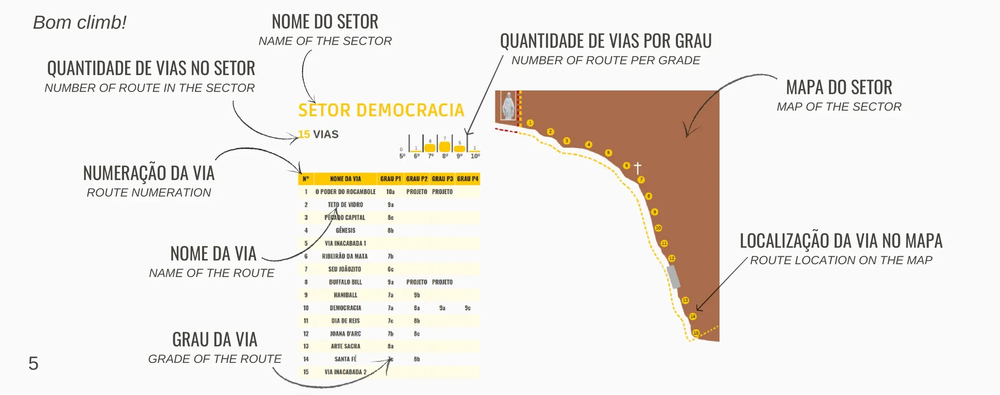

# Como Usar Este Guia

Este Guia tem a função de informar, facilitar e divulgar as vias de escalada do Santuário.

Todas as vias possuem placas de identificação em sua base. As vias são divididas em partes (P1, P2, P3, P4, P5), cada uma tem um grau que é cumulativo com a parte anterior.

