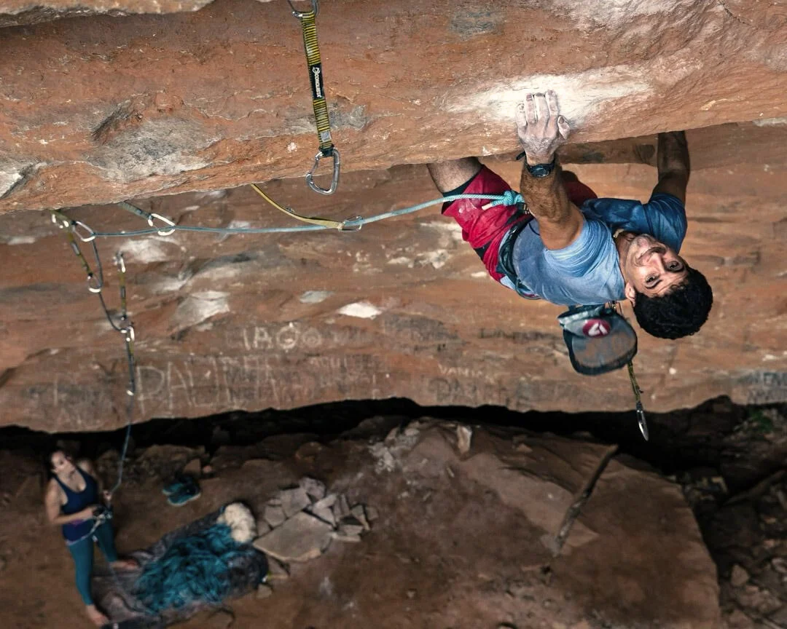

# Setor Santa Línea

## Conexões e Variantes

Este setor possui diversas conexões entre as vias, permitindo combinar diferentes partes (P1, P2, P3...) de vias adjacentes.

| N° | De (Via / Segmento) | Para (Via / Segmento) | Grau |
|---|---|---|---|
| 7.1 | ÓPANGARÉ P1 | SANTA KLAUSS P2 | PROJETO |
| 7.2 | ÓPANGARÉ P1 | SANTA KLAUSS P3 | PROJETO |
| 11.1 | SANTO GRAU P2 | TIRANOS DE PLANTÃO P3 | PROJETO |
| 11.2 | SANTO GRAU P2 | TIRANOS DE PLANTÃO P4 | PROJETO |
| 11.3 | SANTO GRAU P2 | TIRANOS DE PLANTÃO P5 | PROJETO |
| 13.1 | SÓ OS LOUCOS SABEM P2 | AVE MARIA P3 | PROJETO |
| 13.2 | SÓ OS LOUCOS SABEM P2 | CHÁ NA CARTOLINA P3 | 9c |
| 13.3 | SÓ OS LOUCOS SABEM P2 | SANTA LINEA P2 | PROJETO |
| 13.4 | SÓ OS LOUCOS SABEM P2 | SANTA LINEA P3 | PROJETO |
| 14.1 | CHÁ NA CARTOLINA P2 | AVE MARIA P3 | 9c |
| 14.2 | CHÁ NA CARTOLINA P2 | SANTA LINEA P2 | 10b |
| 14.3 | CHÁ NA CARTOLINA P2 | SANTA LINEA P3 | PROJETO |
| 15.1 | AVE MARIA P2 | CHÁ NA CARTOLINA P3 | 9b |