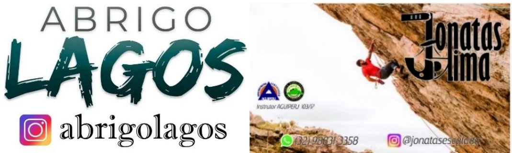
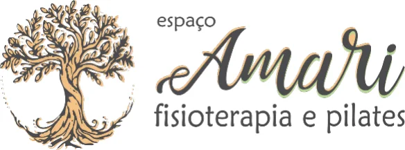

# Apresentação

## O Guia

Este guia foi feito através de um trabalho colaborativo de alguns escaladores com o intuito de servir como orientação para os praticantes que desejam escalar na Serra do Lenheiro, assim como organizar e eternizar as informações que estavam espalhadas em arquivos antigos e na cabeça dos escaladores, correndo o risco de se perderem no tempo.

Este trabalho teve início com uma grande catalogação de vias feito pelo então capitão do 11BIMth Douglas Oliveira, que serviu de base para tudo. Partindo desse levantamento, em 2015 o próprio Douglas se juntou com o instrutor de escalada Jonatas Lima que além de seu conhecimento, veio a somar com repetição de várias vias, fotos e outros materiais que foram digitalizados pelo atual presidente da FEMERJ Pedro Bugim que também contribuiu com material próprio. Após uma paralisação de alguns anos, em 2020 foi dado continuidade no trabalho pelos escaladores sanjoanenses Pedro Naves e Michel Rodrigues que levantaram mais informações faltantes para então finalizar o trabalho, contando com grande ajuda de Luiz Cláudio e Leonardo Rodrigues que compartilharam conhecimentos.

Por se tratar de um guia voltado mais pra escalada recreativa, também não foram incluídas muitas das rotas de treinamento do exército.

Por possuir vias com quase 40 anos conquistadas por escaladores de várias regiões, catalogá-las não foi tarefa fácil e por isso podem haver erros. Qualquer observação será sempre bem-vinda para que correções possam ser feitas ao longo do tempo. Para isso, favor fazer contato com Pedro Naves no (32) 9 9945-7715 ou Michel (32) 9 9932-5359.

A escalada é um esporte de risco e este guia não capacita o leitor a praticar o esporte de forma segura. Para isso, procure por instrutores/guias capacitados. Além de ser um esporte de alta intensidade que requer uma boa preparação e cuidados com o corpo.

Portanto, pratique de forma responsável, seguindo a ética local e não tome nenhuma atitude sem comunicar com escaladores locais. Boas escaladas!

