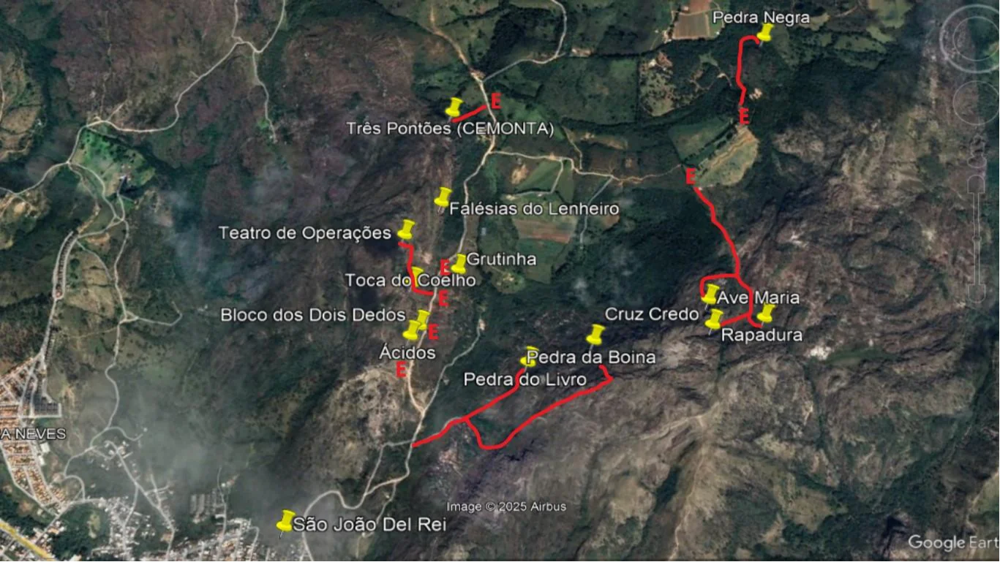

# Áreas de Escalada

Atualmente a cidade conta com aproximadamente 200 vias de escalada, divididas em 18 setores com uma grande variedade de estilos, todos no afloramento rochoso da Serra do Lenheiro, portanto em rocha de quartzito. Devido ao comprimento de mais de 10km desta serra, eles foram divididos em 3 grupos para melhor visualização na imagem abaixo:

Obs: Os alfinetes são localizações aproximadas de cada grupo de setores para uma visão geral da Serra do Lenheiro, não reflete o local exato de cada setor, este detalhe estará nos capítulos específicos de cada um.

## Setores do Lenheiro

Esta é a área mais antiga e com maior quantidade de setores e vias. É a mais próxima de São João em termos de estrada (máximo 2km), porém as trilhas para cada setor variam de alguns metros da estrada até 30 minutos de caminhada. Consequentemente com menos de 10 minutos da saída da cidade é possível estar na base de algumas vias.

Para acessar estes setores basta pegar a estrada de terra que dá acesso ao povoado da Trindade, que tem início na **Rua Geraldo Batista Alves** no bairro **Tejuco**, pode-se perguntar pela área do exército (**Cemonta**). As trilhas para os setores estão ao longo desta estrada. Portanto a descrição de cada setor vai partir da saída do Tejuco (início da estrada de terra).

**QR Code Google Maps início estrada**  
<https://www.google.com.br/maps/@-21.1397043,-44.2836832,334m/data=!3m1!1e3?hl=pt-BR>

