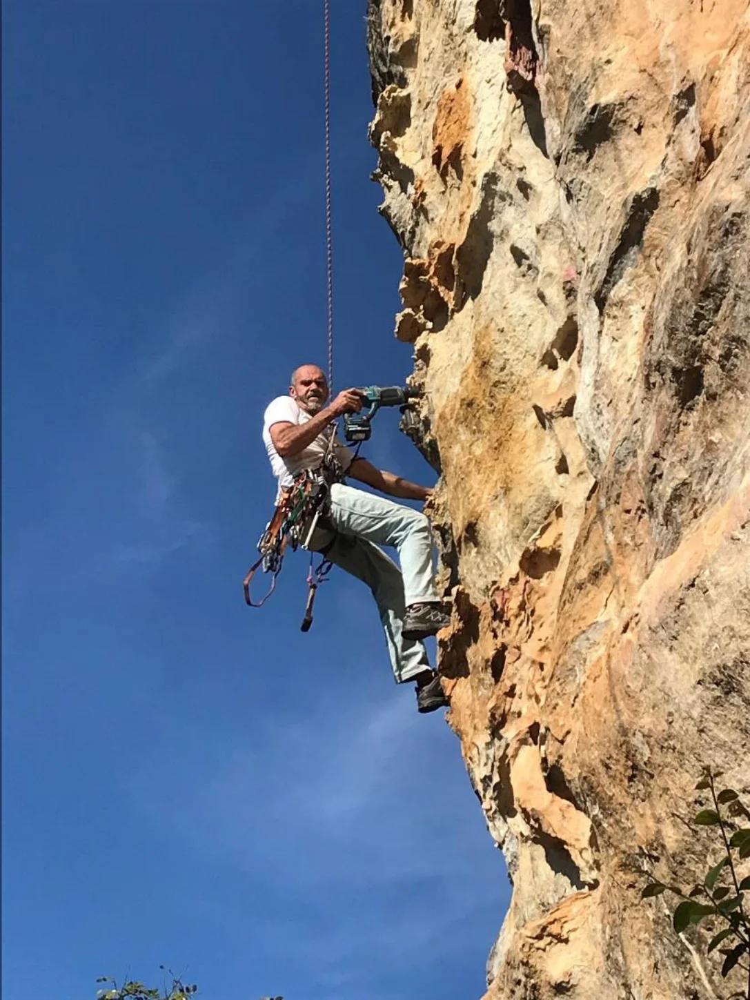

## Setores do Caburu

Esta área de escalada conta com 2 setores que se dividem em 2 blocos. Eles estão localizados na parte de trás da serra que fica do outro lado do vale do Cemonta.

## Apresentação

Setor formado por um belo Quartzito de boa qualidade e vias que variam de 10 a 25 metros. Possui vias fixas e móveis. Point democrático, pois possui graus variados. Local arborizado, fazendo com que todas as bases tenham sombra o dia todo, já as vias pegam sol à tarde.

Existem dois acessos, um chega por baixo do setor vindo do povoado do Cunha e outro por cima vindo pelo Lenheiro usando a trilha do setor Campina do Caburu, cruzando o topo da serra e descendo a trilha até o sopé, este último tem menos estrada mas caminha bem mais.

## Acesso e Trilha

### Trilha do Cunha (mais curta)

Em São João Del Rei pegar rodovia BR494 sentido Ritápolis, zerar o odômetro no posto de gasolina que tem à direita bem no início da rodovia. Andar 3Km e sair à esquerda onde tem placas para Pousada Flor de Iris e Caburu/Fé/Cunha. Um pouco depois que sair da rodovia haverá um cruzamento, seguir reto. Andar mais 3Km até uma bifurcação em um ponto de ónibus onde deverá entrar à esquerda seguindo a placa para Povoado do Cunha. Ir pela principal mais 3Km até uma porteira de ferro, estacionar antes da porteira. O início da trilha está em uma matinha logo ao lado esquerdo da porteira onde há uma passagem por baixo da cerca. Subir o pasto em direção aos eucaliptos, cruzar por dentro do eucaliptal e sair pela tronqueira. No pasto seguir a cerca até encontrar outra tronqueira e atravessá-la, andar alguns metros procurando a outra cerca, em uma baixada há uma passagem por baixo da cerca em um corte d’agua. Após a cerca subir o pasto para a esquerda até encontrar uma trilha, seguir a trilha até entrar na mata, dentro da mata andar cerca de 50 metros e pegar uma trilha à esquerda beirando um pequeno bloco de pedra retangular e chegará no setor. Foram amarrados plásticos nas arvores em pontos de dúvida.

## Fotos

