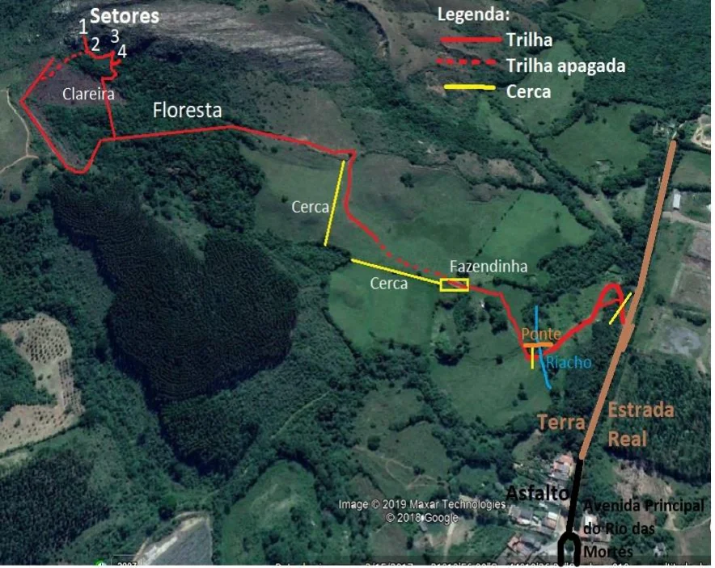

# Setores do Rio das Mortes

Mais recente área de escalada da cidade, descoberta em 2017, vem se tornando muito popular pelo fato de ter vias bastante variadas em grau, altura e estilo, além de ter sombra o dia inteiro devido à uma agradável floresta. Outro fato positivo é o fácil acesso (são 10min de carro apenas em asfalto e mais 20min de trilha leve). Seus setores ficam muito próximos.

## Como Chegar

Saindo de São João pegar a BR 265 sentido Lavras. Do último trevo (Tejuco) são exatos 5km até o trevo do Rio das Mortes, entrar no trevo. Ao entrar na “cidade” virar à direita após a escola e depois virar novamente à direita na avenida principal. Seguir sempre reto na avenida até acabar o canteiro central, onde começa estrada de terra. A trilha começa à esquerda 150 metros após o início da terra, pode-se estacionar veículos nesse ponto no canto da estrada.

**Legenda do mapa:**
- **Linha vermelha contínua:** Trilha
- **Linha vermelha tracejada:** Trilha apagada
- **Linha amarela:** Cerca
- **Setores indicados:**
  - **1:** Setor De Cima
  - **2:** Setor Thundercats
  - **3:** Setor Salão
  - **4:** Setor Namata
- **Pontos de referência:** Avenida Principal do Rio das Mortes, Asfalto, Terra (Estrada Real), Ponte, Riacho, Fazendinha, Cerca, Floresta, Clareira.

## Trilha de Acesso aos Setores

**Atenção:** Uns 50m após a fazendinha vá se afastando da cerca para pegar a trilha que sobe o morro mais forte mais pro meio do pasto e depois contorna a cerca de cima. Já na floresta, depois de 200m que adentrar nela, haverá uma trilha subindo à direita ao lado de um atoleiro com cipós grossos, que leva direto para os setores Namata(4) e Salão(3). Ou pode-se seguir reto caso queira ir primeiro nos setores De Cima(1) e Thundercats(2). Para essa segunda opção, quando estiver no pasto próximo ao setor, pegar uma trilha mais apagada pra direita.

Existe uma trilha que liga direto o Setor Salão (3) ao setor Thundercats(2).
