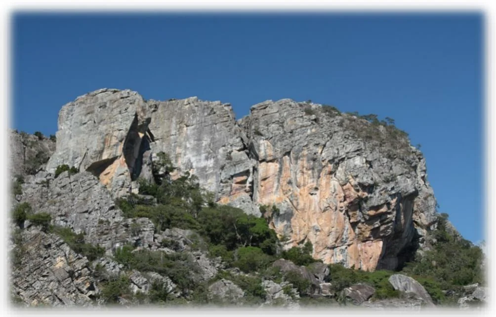

# Três Pontões (CEMONTA)

Setor mais antigo, teve suas primeiras conquistas no final da década de 70 por militares e no início dos anos 80 através de escaladores cariocas como André Ilha e Tonico Magalhães.

Os Três Pontões concentram a maior quantidade de vias clássicas da região, seja por sua imponência, beleza, qualidade ou valor histórico à nível nacional e mundial.

As vias, em sua grande maioria são feitas com proteções móveis, haja vista a grande quantidade de fendas perfeitas nos setores desta formação. Boa parte das vias possui proteção fixa no topo para a descida e para aquelas que não possuem, pode-se descer por vias adjacentes ou por caminhada e cabos de aço (vide imagem setor Rota Interna).

A rocha é um quartzito de qualidade impressionante, com boas fendas e agarras sólidas.

**Atenção:** este setor é um Campo Escola do Exército Brasileiro e por isso possui regras específicas. Deste modo, para escalar lá é obrigatório que se faça um pedido de autorização com alguns dias de antecedência, seguindo as orientações e regras contidas no Anexo 1 e as fichas para preenchimento nos Anexos 2 e 3 ao final deste guia ou no link: https://drive.google.com/drive/folders/1ErE5HCYTzF5a017DwEURxrmlK9QOe2cS?usp=sharing

## Acesso

Para se chegar ao setor deve-se percorrer 2km pela estrada de terra e entrar no portão de ferro com placa do Exército ou seguir mais 150m pela estrada e pegar a trilha à esquerda.

Dentro do Cemonta, abaixo dos Três Pontões existem inúmeros blocos menores com uma infinidade de vias mais curtas abertas pelo exército para treinamentos e não serão tratadas neste guia, mas a maioria possui indicações através de placas e pinturas na pedra e podem ser interessantes para quem quer fazer um Top-rope prático e treinar algumas técnicas.

## Pinturas Rupestres

O local conta ainda com um sítio arqueológico com pinturas rupestres bem interessantes, próximo à base de algumas vias no Pontão Maior. Essas pinturas são datadas com idade de 6 a 10 mil anos e foram feitas por tribos nômades que habitaram essa serra e viviam nas cavidades da rocha.