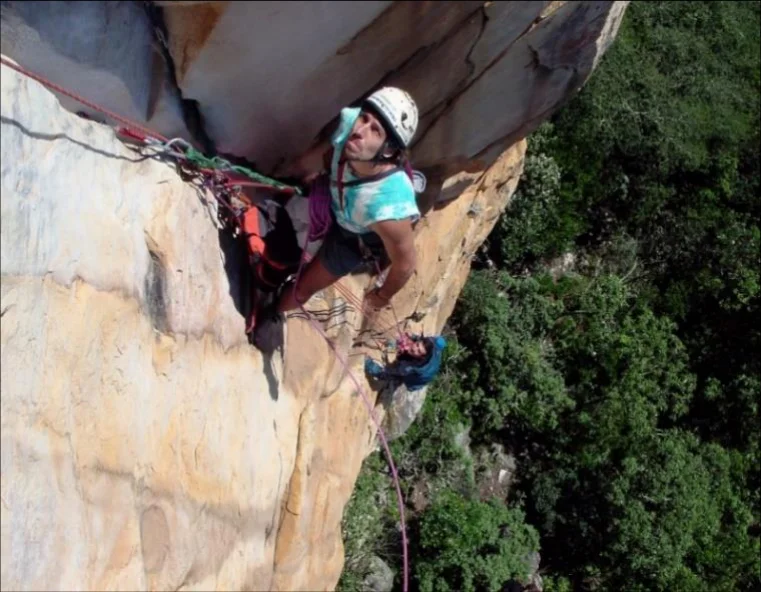

# Pontão Maior

É o maior bloco do Cemonta, por isso este nome. Além disso possui as vias mais difíceis, muito em função de sua negatividade. Nele se encontram algumas das vias mais clássicas como a Lúcifer, O Grande Encontro e Profecia. Para acessá-lo basta pegar a trilha principal descrita no Pontão Menor, a trilha atinge primeiro a base da via Variante da Lúcifer.

Para as vias de cume, a forma de descida mais usual é uma trilha que se inicia na parte de trás à direita. Essas trilhas podem ser visualizadas no mapa de trilhas acima.

É nesse bloco que estão as Pinturas Rupestres, elas ficam à direita da via Lúcifer. Vale a visita, independente de onde vai escalar, pois são de fácil acesso e tem valor histórico importante.

