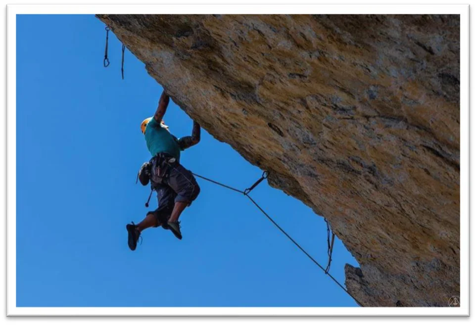

# Ave Maria

Este setor se tornou famoso entre escaladores esportivos que buscam por uma escalada mais atlética. Suas vias, em geral, são bem negativas e exigentes fisicamente. A área no entorno também possui uma grande quantidade de Boulders, que são tratados num guia independente que pode ser acessado no link disponibilizado no início deste guia.

### Acesso e Estacionamento

> **Atenção:** Houve uma mudança no local do estacionamento para este setor! Vindo pela estrada principal, virar à direita alguns metros antes do CEMONTA, passar pela torre e deslocar-se em direção a uma porteira onde antes se deixava os veículos, agora deve-se adentrar nessa porteira e seguir pela principal até a próxima porteira onde haverá um estacionamento.

A trilha se inicia no próprio estacionamento acompanhando a cerca com eucaliptos ao lado. Logo à frente encontrará a antiga trilha, nessa bifurcação deve-se subir a trilha íngreme de cascalho. Lá pra cima, após um muro de pedra, deve-se sair da trilha principal e pegar uma trilha à direita, em uma matinha. Em seguida o percurso segue em uma leve subida em meio as lajes de pedras. No final da subida já é possível avistar o setor à esquerda da trilha. No mapa do início deste guia pode-se visualizar essas trilhas, mas uma dica é que no geral deve-se sempre subir, já que este setor encontra-se no topo da serra.

## Bloco 1

Este é o principal bloco do setor, onde se concentram a maioria das vias. Por possuir uma inclinação acentuada, ele se difere de todos os outros encontrados na cidade. Suas vias exigem força e resistência, tendo como vantagens na maioria das situações agarras grandes e bons descansos. Um outro fator positivo é, sem dúvida, o privilégio de poder escalar em dias chuvosos. Por possuir uma negatividade considerável, a rocha permanece seca mesmo durante uma chuva. Seus melhores registros fotográficos são obtidos ao entardecer.

## Bloco 2

Este bloco encontra-se ao lado esquerdo do bloco 1, possuindo uma única via de escalada e alguns boulders em sua lateral. Quando se chega pela trilha principal, é possível avistar os dois blocos, um ao lado do outro.

## Bloco 3

Parede lateral localizada à esquerda do bloco 1. Para uma fácil aproximação segue-se uma trilha descendo entre o bloco 1 e o bloco 2. Neste bloco é possível visualizar ao fundo as elevações a Pedra da Rapadura.

Este setor se tornou famoso entre escaladores esportivos que buscam por uma escalada mais atlética. Suas vias, em geral, são bem negativas e exigentes fisicamente. A área no entorno também possui uma grande quantidade de Boulders, que são tratados num guia independente que pode ser acessado no link disponibilizado no início deste guia.

