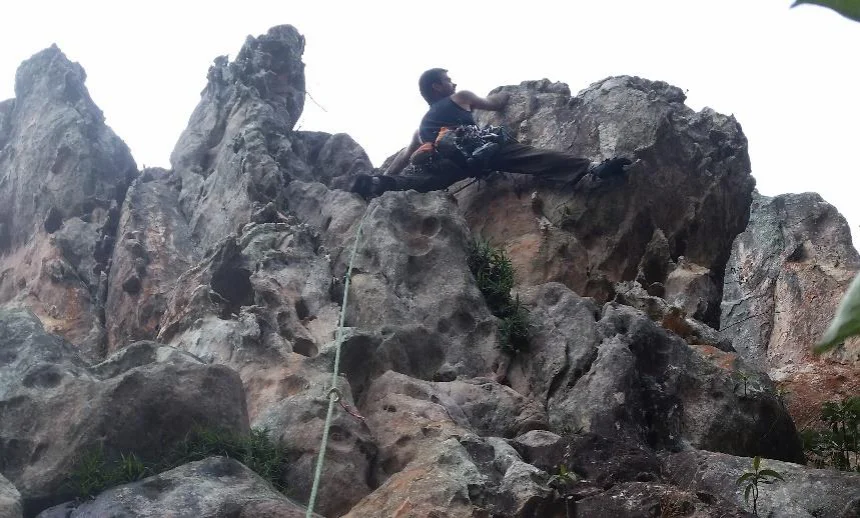

# Setor Cruz Credo

Setor localizado atrás do setor da Ave Maria, ainda com boas possibilidades de novas vias. Atualmente, possui cinco vias e uma variante, quase todas mistas e apenas uma fixa.

Tem como característica os grandes buracos que conferem às vias, agarras impressionantes, tornando a graduação não muito elevada, apesar dos lances levemente negativos. As proteções nem sempre são óbvias, obrigando o escalador e “garimpar” fendas e buracos. Importante ficar atento à agarras quebrando, por se tratar de um setor relativamente novo. Todas as vias possuem grampo no topo, para segurança, top-rope e rapel.

## Acesso

Para acessar o setor do Cruz Credo, deve-se passar pela trilha que segue adiante do setor da Ave Maria, pela esquerda. Deste ponto já será possível avistar as paredes do Cruz Credo. Antes da trilha tornar a subir, deve-se seguir um pequeno rio (em geral, seco), para a direita, para chegar ao setor frontal. Deste rio, pegar para a esquerda, para chegar ao setor oculto.

## Sub-setores e Paredes

### Setor Principal

Paredão frontal onde estão localizadas as vias:
1. **Quinto dos Infernos** (5º – 20m - Fixa)
2. **Deus me Livre** (IV – 15m - Mista)
3. **Cruz Credo** (V – 25m - Mista)

### Setor Oculto do Cruz Credo

Setor localizado à esquerda seguindo o pequeno leito de rio seco:
4. **Jesus Humilha o Satanás** (V – 20m - Mista)
5. **Praga Divina** (V – 15m - Mista)
6. **Variante Pedra na Cruz** (III – 8m - Móvel)

Setor localizado atrás do setor da Ave Maria, ainda com boas possibilidades de novas vias. Atualmente, possui cinco vias e uma variante, quase todas mistas e apenas uma fixa.

Tem como característica os grandes buracos que conferem às vias, agarras impressionantes, tornando a graduação não muito elevada, apesar dos lances levemente negativos. As proteções nem sempre são óbvias, obrigando o escalador e “garimpar” fendas e buracos. Importante ficar atento à agarras quebrando, por se tratar de um setor relativamente novo. Todas as vias possuem grampo no topo, para segurança, top-rope e rapel.