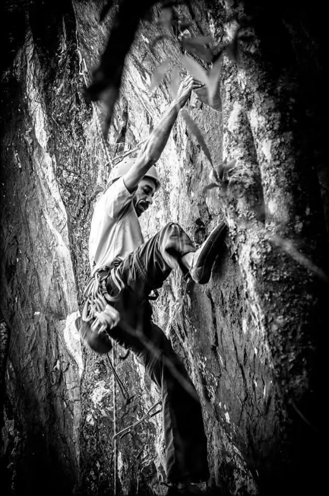

# Pedra Negra

Este setor encontra-se na frente do Cemonta, no fundo do vale, mas sua face é voltada para o lado oposto, portanto não pode ser vista de nenhum ponto até que se chegue lá. Sua formação é diferente de todas as rochas do restante da Serra do Lenheiro, é um Gnaisse, porém bem menos abrasivo que outros.

## Acesso

Seu acesso se dá pela estrada que passa ao lado da antena em frente ao Cemonta (mesmo acesso da Ave Maria). Logo após a antena haverá uma porteira onde antes se parava os veículos, porém isso mudou, agora deve-se entrar nessa porteira e seguir pela principal até o final da estrada onde haverá um estacionamento. Haverá placas indicando o caminho, leva-se cerca de 10 minutos até o setor em trilha leve.

## Características

O setor é bem agradável, com base boa e sombreada por árvores. Mas o melhor período pra se escalar é pela manhã, quando todas as vias estão na sombra, de tarde o sol pega de frente. Porém, tem algumas vias na sombra das árvores, portanto é possível escalar o dia todo.

Sua graduação é bem diversificada com vias dos mais variados estilos, agradando a todos os tipos de escaladores. As vias em geral são bem protegidas, mas quase todas tem como característica a primeira chapeleta alta, portanto é obrigatório sair com a primeira costurada!

Há clip-stick no local, favor usar, pois já houveram acidentes com quem não usou!!

