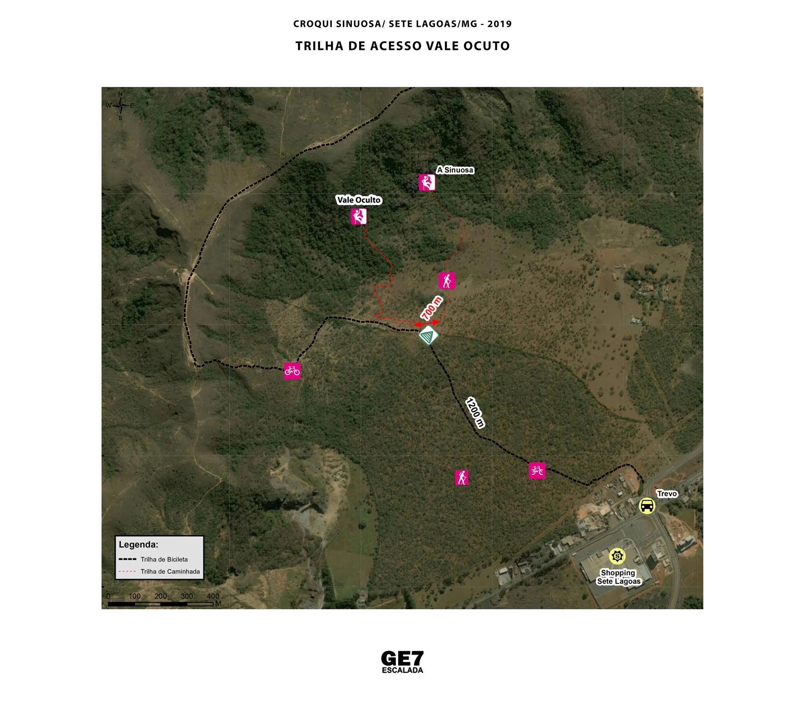

# Vale Oculto Sinuosa

A área recém descoberta por escaladores locais em 2018, o local deu origem a três sub-setores, chamados: **"De Cara"**, **"Laranja"** e **"Anfiteatro"**.

O Local tem acesso diferente da parte já conhecida dos escaladores. O acesso está ilustrado neste croqui.

Já foram conquistadas **33 vias** e ainda existem algumas possibilidades.

Os três sub-setores tem características bem diferentes: negativos constantes e arestas, vias como **"Face Oculta 7a"**, **"Negativos 6º SUP"**, **"Quebrando o Silêncio 8b"**, **"Recepção Venenosa 7a"** e **"Dono do Pico 7c"** já são a candidatas a vias clássicas da Sinuosa.

# Trilha de Acesso Vale Oculto

O mapa acima ilustra a trilha de acesso para o Vale Oculto, partindo das proximidades do Shopping Sete Lagoas.