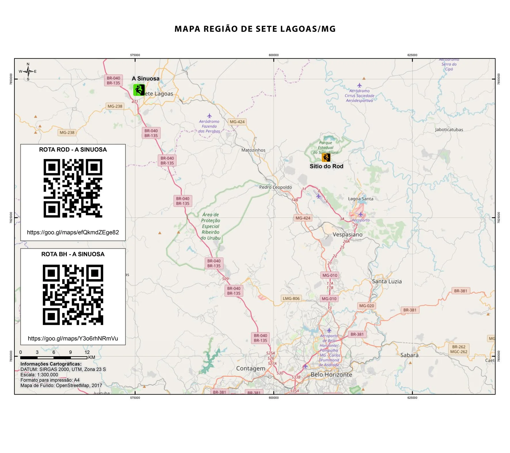
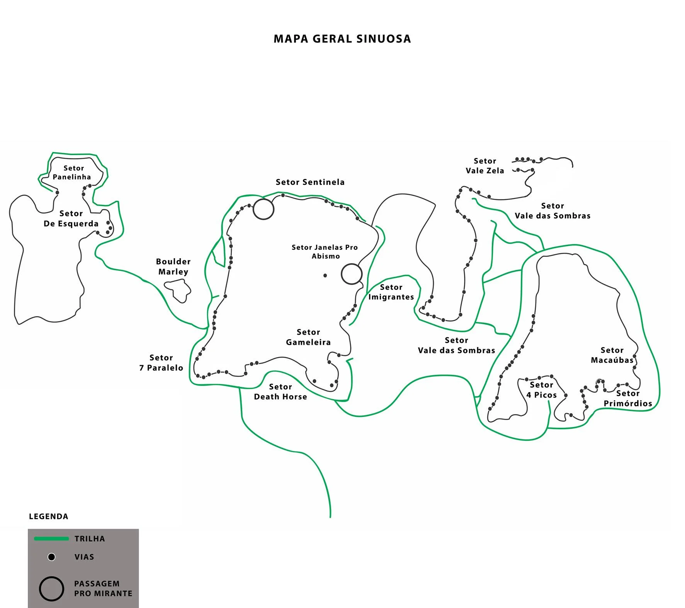

# Mapas Gerais

## Mapa Região de Sete Lagoas/MG

**Rotas de Acesso:**
- **Rota Rod - A Sinuosa:** [https://goo.gl/maps/efQkmdZEge82](https://goo.gl/maps/efQkmdZEge82)
- **Rota BH - A Sinuosa:** [https://goo.gl/maps/Y3o6rhNRmVu](https://goo.gl/maps/Y3o6rhNRmVu)

---

## Trilha de Acesso

A trilha inicia no Shopping Sete Lagoas. Segue por uma trilha de bicicleta (1200m) e depois uma trilha de caminhada (700m) após uma bifurcação onde se deve seguir à direita.

---

## Mapa Geral Sinuosa

O mapa mostra a disposição dos setores:
- Setor Panelinha
- Setor De Esquerda
- Boulder Marley
- Setor 7 Paralelo
- Setor Sentinela
- Setor Janelas Pro Abismo (localizado próximo ao Sentinela)
- Setor Gameleira
- Setor Death Horse
- Setor Imigrantes
- Setor Vale das Sombras
- Setor Vale Zela
- Setor 4 Picos
- Setor Macaúbas
- Setor Primórdios