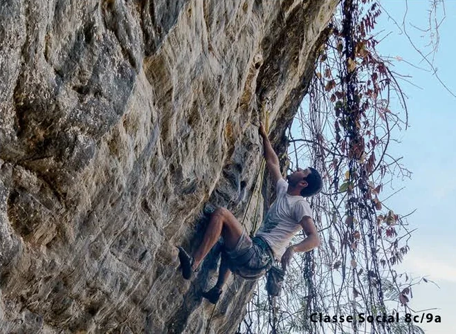
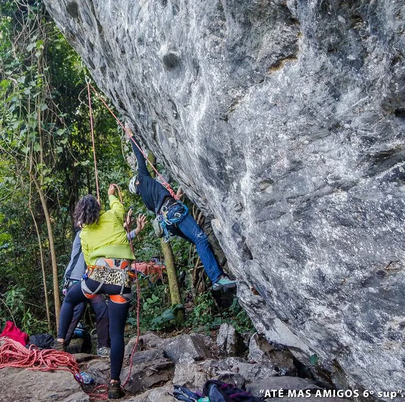

# Setor 7 Paralelo

Setor com grande concentração de vias, predomínio de vias de sétimo grau,
com altura média entre 15 e 25 metros.

Vias fortes com possibilidades de escalada
bem variada, que exigem bom repertório de movimentos e resistência. O início do
setor é mais amplo e tem bases limpas, mas em direção às escadas que dão acesso
ao setor "Sentinela" deve-se tomar cuidado para evitar acidentes, pois este trecho
é bastante íngreme.

Atenção para a base de algumas vias no final do setor.

Também no final do setor, a maioria das vias é indicado sair com a primeira proteção clipada.

