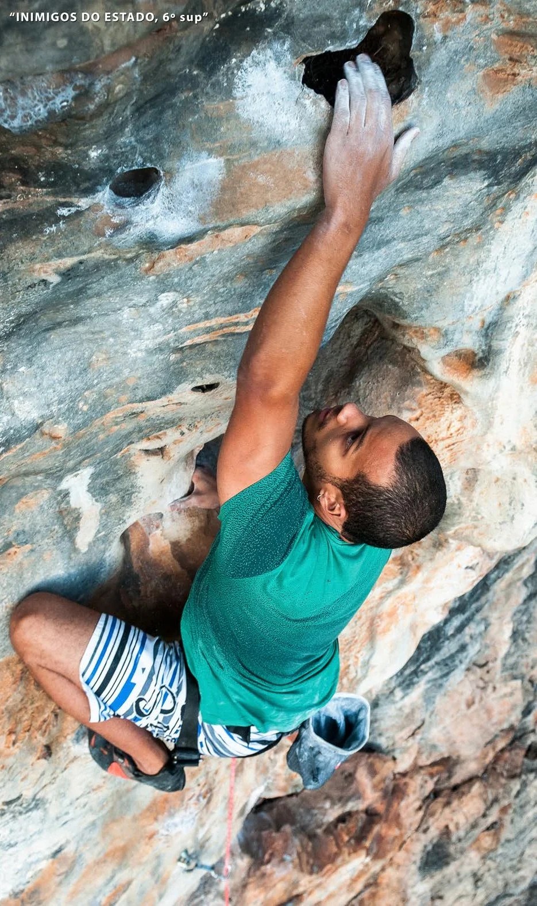

# Setor de Esquerda

Um dos mais novos setores a ser desenvolvidos no pico, o "Setor de Esquerda"
é composto por uma bela parede de coloração clara, amarela e avermelhada que se
caracteriza com concreções e cristais coloridos, a parede é relativamente baixa
com vias até 15 metros. Destaque para a via "Inimigos do Estado, 6º sup", a primeira
via do setor.

O sol tem maior incidência no setor, então dê preferência para escalar
nele nas horas mais amenas do dia.

O setor é ideal para grupos de até 8 pessoas.

Por ser um setor com vias de graduação baixa e estar ao lado do setor "Panelinhas"
é ideal para os iniciantes.

