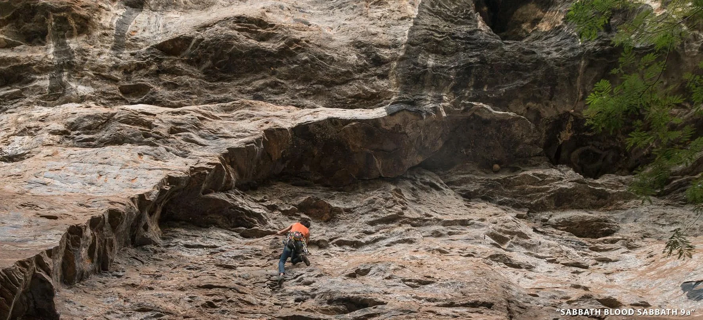

# Setor Death Horse

Setor que fica logo na entrada. Parede extensa, alta e com trechos muito
negativos. A beleza da formação da parede impressiona pelas cores, formas curiosas
e pela magnitude do teto. A base do setor é limpa, ampla e comporta grupos maiores,
também é ótimo para colocação de redes por estar na sombra durante o dia inteiro,
local bem arejado.

Na chuva é possível escalar algumas vias. Setor ainda pouco explorado,
apesar do enorme potencial para vias de alta graduação.

