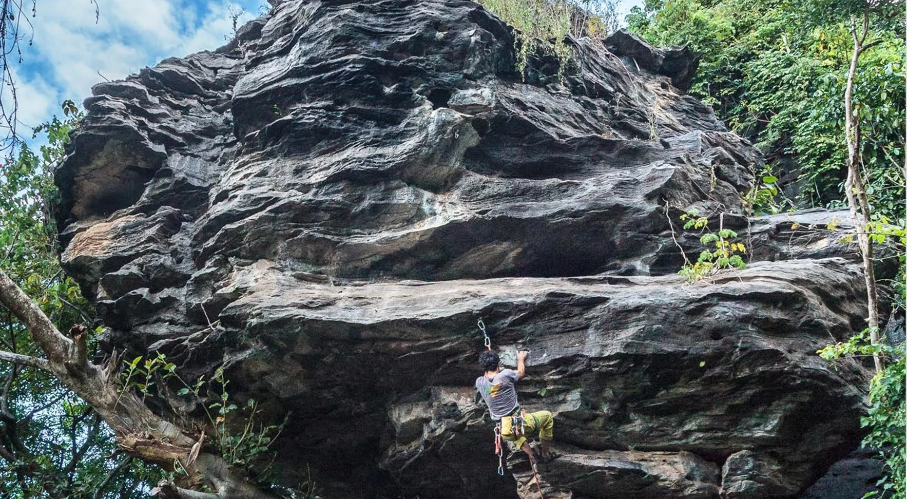

# Setor Gameleira

Conta com poucas vias e mesmo assim abriga um dos maiores desafios do pico
até o momento, a "Sou Fria 9a". Via em uma aresta muito negativa, de encaixe e técnica.
Impressiona pela beleza da linha e pelo crux que é uma problema de boulder especulado
em V4/5.

A via "Mordida de Égua 5º" é muito repetida por iniciantes e faz parte
das vias mais elogiadas da Sinuosa.

