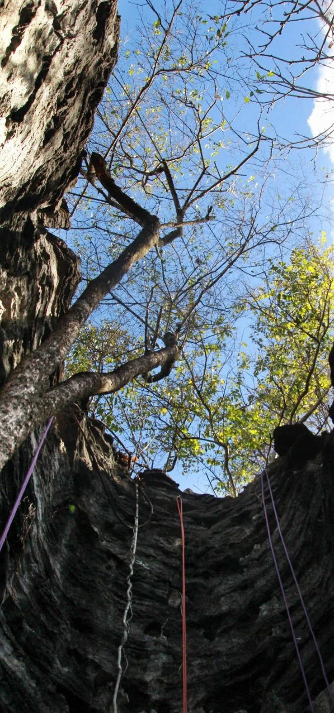
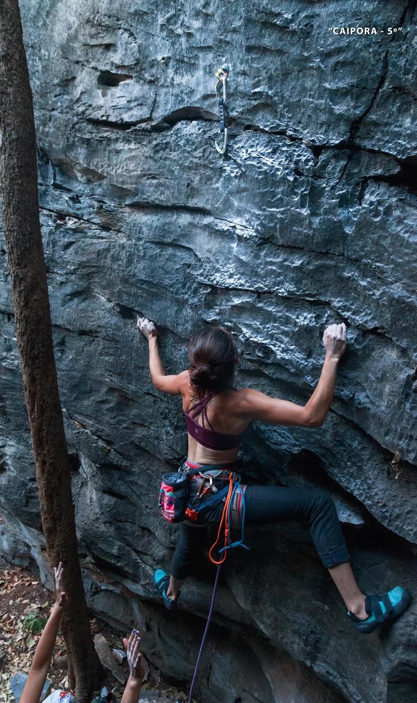
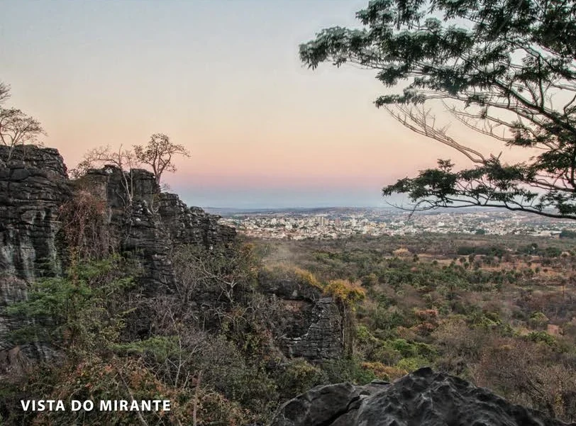

---
nome: Setor Panelinha
mapas:
- caminho_imagem_mapa: imagens/setor_panelinha_p0_i0.webp
  largura_mapa: 806
  altura_mapa: 757
  pontos_de_interesse:
  - id: '1'
    label: '1'
    box:
      x: 530
      y: 396
      comprimento: 45
      largura: 47
  - id: '2'
    label: '2'
    box:
      x: 578
      y: 318
      comprimento: 35
      largura: 35
  - id: '3'
    label: '3'
    box:
      x: 608
      y: 398
      comprimento: 35
      largura: 35
  - id: '4'
    label: '4'
    box:
      x: 234
      y: 478
      comprimento: 51
      largura: 51
  - id: Setor_de_Esquerda
    label: ↑ SETOR DE ESQUERDA
    box:
      x: 560
      y: 597
      comprimento: 43
      largura: 250
      angulo_graus_x100: 666
  referencias:
  - escalada: Caipora
    ids:
    - '1'
  - escalada: Tap-Flap
    ids:
    - '2'
  - escalada: Rá-Tim-Bum
    ids:
    - '3'
  - escalada: Corda de Violão
    ids:
    - '4'
escaladas:
- via_esportiva:
    nome: Caipora
    dificuldade: BR_5
    quantidade_protecoes_intermediarias: 4
- via_movel:
    nome: Tap-Flap
    dificuldade: BR_4
    descricao: Via em móvel.
- via_esportiva:
    nome: Rá-Tim-Bum
    dificuldade: BR_5
    quantidade_protecoes_intermediarias: 5
- via_esportiva:
    nome: Corda de Violão
    dificuldade: BR_5
    quantidade_protecoes_intermediarias: 4
---
# Setor Panelinha

O "Panelinha" é composto por paredes escuras em formas circulares que lembram
"panelas" e teve como objetivo principal nas conquistas, aumentar a possibilidade
para os iniciantes por serem paredes curtas, verticais e com grande variedades de
agarras mas que exigem movimentos de escalada bem interessantes.

O setor tem ótima ventilação e tem mais sombra durante as horas fortes do sol que
o setor abaixo (Setor de Esquerda).

É possível dar a volta na pedra e ter acesso ao top das vias, para
alguns instrutores esta é uma facilidade na aplicação de ensino de procedimentos
de ancoragem e desmontagem de vias.

Vista panorâmica do pico e da cidade.

