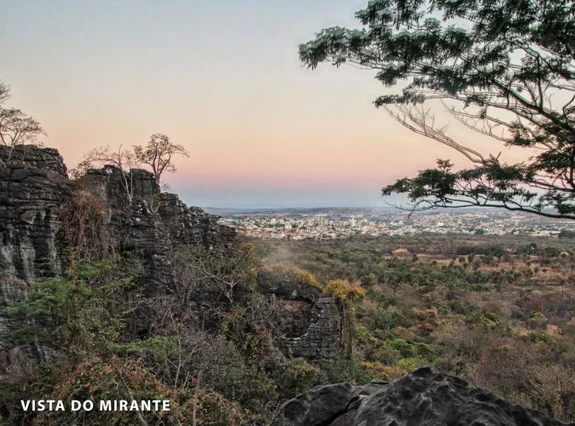

O "Panelinha" é composto por paredes escuras em formas circulares que lembram
"panelas" e teve como objetivo principal nas conquistas, aumentar a possibilidade
para os iniciantes por serem paredes curtas, verticais e com grande variedades de
agarras mas que exigem movimentos de escalada bem interessantes.

O setor tem ótima ventilação e tem mais sombra durante as horas fortes do sol que
o setor abaixo (Setor de Esquerda).

É possível dar a volta na pedra e ter acesso ao top das vias, para
alguns instrutores esta é uma facilidade na aplicação de ensino de procedimentos
de ancoragem e desmontagem de vias.

Vista panorâmica do pico e da cidade.

