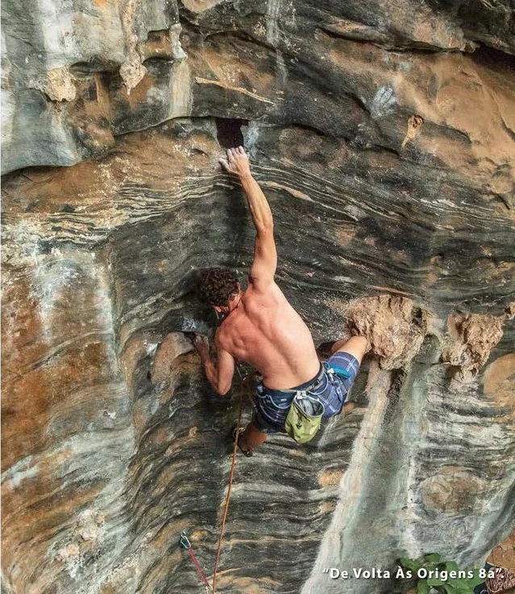
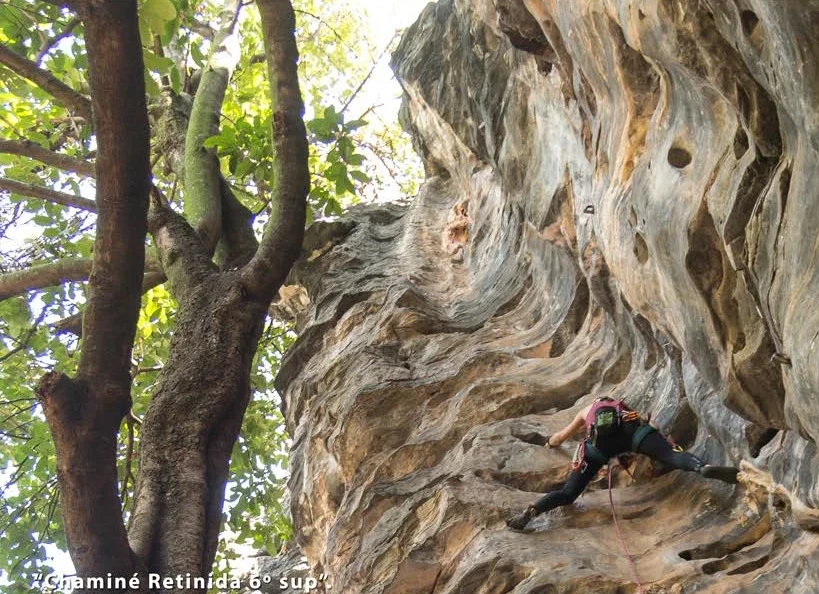

# Setor Primórdios

Setor onde tudo começou na década de 90, parede com grande concentração
de vias e de características bem diferentes. As vias possuem ótimas base e bastante
espaço para grupos, bom para armar redes e descansar, pois o setor possui sombra
o dia todo.

