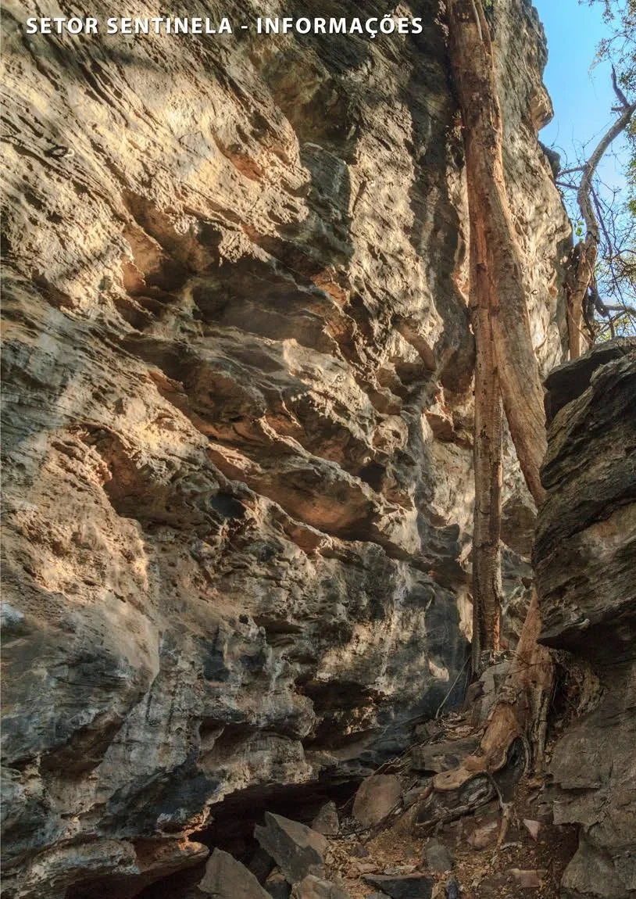

# Setor Sentinela

Setor um pouco mais afastado, localizado após subir as escadas do setor
"7 Paralelo". Setor com grande incidência do sol entre 11:00 e 15:00 hrs.

Do setor é possível acessar a passagem para o mirante do cume da Sinuosa.

Parede bonita, de
cor amarelada, com excelente variação de agarras e característica esportiva. Apesar
de serem mais baixas, as vias deste setor são exigentes devido a leve negatividade
da pedra.

