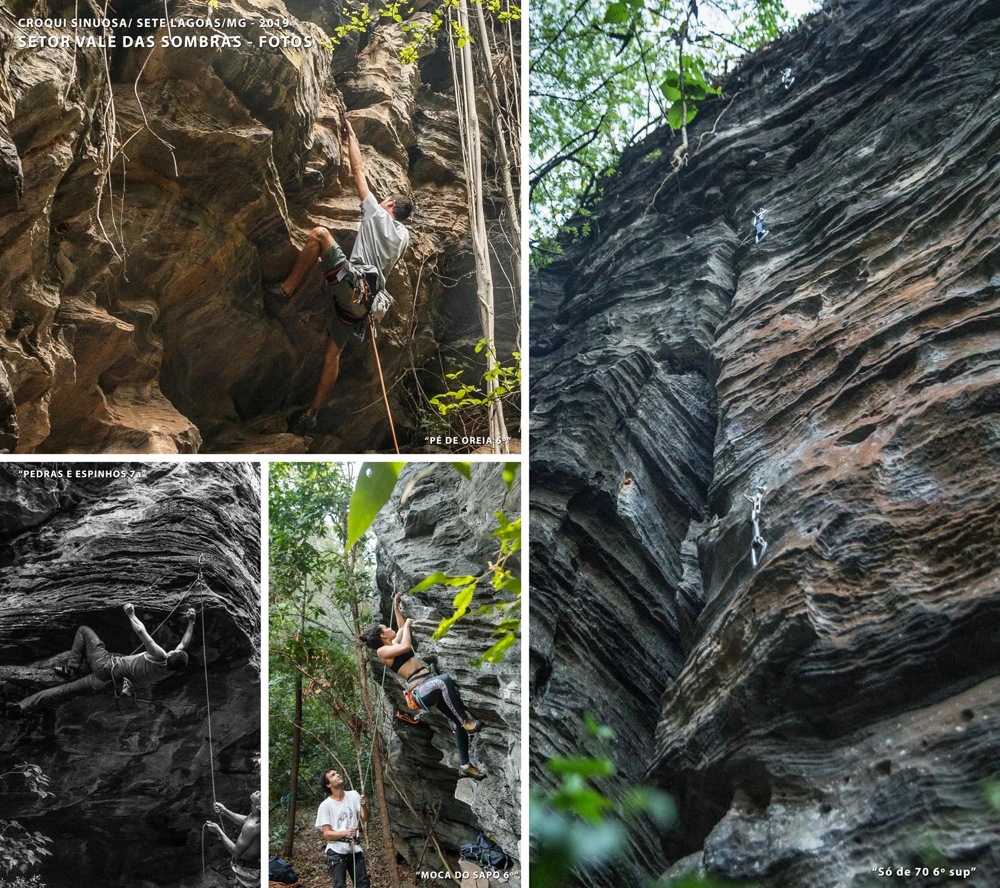

---
nome: Setor Vale das Sombras
mapas:
- caminho_imagem_mapa: imagens/setor_vale_das_sombras_p0_i0.webp
  largura_mapa: 745
  altura_mapa: 1078
  pontos_de_interesse:
  - id: '1'
    label: '1'
    box:
      x: 64
      y: 788
      comprimento: 26
      largura: 26
  - id: '2'
    label: '2'
    box:
      x: 119
      y: 800
      comprimento: 24
      largura: 29
  - id: '3'
    label: '3'
    box:
      x: 189
      y: 818
      comprimento: 28
      largura: 27
  - id: '4'
    label: '4'
    box:
      x: 258
      y: 748
      comprimento: 35
      largura: 35
  - id: '5'
    label: '5'
    box:
      x: 270
      y: 654
      comprimento: 35
      largura: 35
  - id: '6'
    label: '6'
    box:
      x: 282
      y: 504
      comprimento: 21
      largura: 25
  - id: '7'
    label: '7'
    box:
      x: 300
      y: 468
      comprimento: 21
      largura: 23
  - id: '8'
    label: '8'
    box:
      x: 314
      y: 354
      comprimento: 30
      largura: 30
  - id: '9'
    label: '9'
    box:
      x: 203
      y: 210
      comprimento: 30
      largura: 30
  - id: '10'
    label: '10'
    box:
      x: 196
      y: 169
      comprimento: 30
      largura: 30
  - id: '11'
    label: '11'
    box:
      x: 212
      y: 125
      comprimento: 30
      largura: 30
  - id: '12'
    label: '12'
    box:
      x: 330
      y: 114
      comprimento: 30
      largura: 30
  - id: '13'
    label: '13'
    box:
      x: 404
      y: 112
      comprimento: 30
      largura: 30
  - id: '14'
    label: '14'
    box:
      x: 474
      y: 89
      comprimento: 30
      largura: 30
  - id: '15'
    label: '15'
    box:
      x: 510
      y: 79
      comprimento: 30
      largura: 30
  - id: '16'
    label: '16'
    box:
      x: 551
      y: 70
      comprimento: 30
      largura: 30
  - id: '17'
    label: '17'
    box:
      x: 592
      y: 52
      comprimento: 30
      largura: 30
  referencias:
  - escalada: Curta e Grossa
    ids:
    - '1'
  - escalada: Trabalhosa
    ids:
    - '2'
  - escalada: Revolução dos Insetos
    ids:
    - '3'
  - escalada: Frango com Quiabo
    ids:
    - '4'
  - escalada: É Proibido Furar
    ids:
    - '5'
  - escalada: Bafin de Leite
    ids:
    - '6'
  - escalada: '?'
    ids:
    - '7'
  - escalada: Sujismunda
    ids:
    - '8'
  - escalada: Samurai
    ids:
    - '9'
  - escalada: Ninja
    ids:
    - '10'
  - escalada: Fly Monkeys
    ids:
    - '11'
  - escalada: Lado A Lado B
    ids:
    - '12'
  - escalada: Meu Nome Não é Lero
    ids:
    - '13'
  - escalada: Nosso Mestre
    ids:
    - '14'
  - escalada: Segunda Já Tá í
    ids:
    - '15'
  - escalada: Brincadeira de Criança
    ids:
    - '16'
  - escalada: Peripécias do Climb
    ids:
    - '17'
  - escalada: Lelê Café
    ids:
    - '17'
- caminho_imagem_mapa: imagens/setor_vale_das_sombras_p1_i0.webp
  largura_mapa: 729
  altura_mapa: 1311
  pontos_de_interesse:
  - id: '17'
    label: '17'
    box:
      x: 341
      y: 1211
      comprimento: 42
      largura: 42
  - id: '18'
    label: '18'
    box:
      x: 359
      y: 1146
      comprimento: 40
      largura: 43
  - id: '19'
    label: '19'
    box:
      x: 401
      y: 1083
      comprimento: 38
      largura: 42
  - id: '20'
    label: '20'
    box:
      x: 415
      y: 1003
      comprimento: 40
      largura: 40
  - id: '21'
    label: '21'
    box:
      x: 442
      y: 917
      comprimento: 40
      largura: 40
  - id: '22'
    label: '22'
    box:
      x: 505
      y: 841
      comprimento: 42
      largura: 40
  - id: '23'
    label: '23'
    box:
      x: 562
      y: 756
      comprimento: 42
      largura: 41
  - id: '24'
    label: '24'
    box:
      x: 602
      y: 683
      comprimento: 41
      largura: 42
  - id: '25'
    label: '25'
    box:
      x: 634
      y: 568
      comprimento: 49
      largura: 41
  - id: '26'
    label: '26'
    box:
      x: 642
      y: 483
      comprimento: 45
      largura: 40
  - id: '27'
    label: '27'
    box:
      x: 660
      y: 382
      comprimento: 47
      largura: 47
  - id: '28'
    label: '28'
    box:
      x: 654
      y: 311
      comprimento: 47
      largura: 40
  - id: '29'
    label: '29'
    box:
      x: 660
      y: 243
      comprimento: 43
      largura: 36
  - id: Setor_Gameleira
    label: ← SETOR GAMELEIRA
    box:
      x: 76
      y: 976
      comprimento: 31
      largura: 201
      angulo_graus_x100: -3625
  - id: Setor_4_Picos
    label: ← SETOR 4 PICOS
    box:
      x: 100
      y: 1198
      comprimento: 45
      largura: 161
      angulo_graus_x100: 1843
  referencias:
  - escalada: Peripécias do Climb
    ids:
    - '17'
  - escalada: Lelê Café
    ids:
    - '17'
  - escalada: Tiu Marreteiro
    ids:
    - '18'
  - escalada: Animáquina
    ids:
    - '19'
  - escalada: Moça do Sapo
    ids:
    - '20'
  - escalada: Over Tênis
    ids:
    - '21'
  - escalada: Fita No Calcário
    ids:
    - '22'
  - escalada: Só de 70
    ids:
    - '23'
  - escalada: Black Dog
    ids:
    - '24'
  - escalada: Variante Mum-hhazinha
    ids:
    - '25'
  - escalada: Pedras e Espinhos
    ids:
    - '26'
  - escalada: Pé de Oreia
    ids:
    - '27'
  - escalada: Perdidos
    ids:
    - '28'
  - escalada: Velhos Novatos
    ids:
    - '29'
escaladas:
- via_esportiva:
    nome: Curta e Grossa
    dificuldade: BR_7A
    quantidade_protecoes_intermediarias: 6
- via_esportiva:
    nome: Trabalhosa
    dificuldade: BR_6SUP
    quantidade_protecoes_intermediarias: 7
- via_esportiva:
    nome: Revolução dos Insetos
    dificuldade: BR_7A
    quantidade_protecoes_intermediarias: 5
- via_esportiva:
    nome: Frango com Quiabo
    dificuldade: BR_7A
    quantidade_protecoes_intermediarias: 6
- via_esportiva:
    nome: É Proibido Furar
    dificuldade: BR_7C
    quantidade_protecoes_intermediarias: 7
- via_esportiva:
    nome: Bafin de Leite
    descricao: Inacabada.
- via_esportiva:
    nome: '?'
    descricao: Inacabada.
- via_esportiva:
    nome: Sujismunda
    descricao: Inacabada.
- via_esportiva:
    nome: Samurai
    dificuldade: BR_6SUP
    quantidade_protecoes_intermediarias: 13
- via_esportiva:
    nome: Ninja
    dificuldade: BR_7A
    quantidade_protecoes_intermediarias: 16
- via_esportiva:
    nome: Fly Monkeys
    dificuldade: BR_6SUP
    quantidade_protecoes_intermediarias: 10
- via_esportiva:
    nome: Lado A Lado B
    dificuldade: BR_7A_BARRA_7B
    quantidade_protecoes_intermediarias: 7
- via_esportiva:
    nome: Meu Nome Não é Lero
    dificuldade: BR_7B
    quantidade_protecoes_intermediarias: 8
- via_esportiva:
    nome: Nosso Mestre
    dificuldade: BR_5
    quantidade_protecoes_intermediarias: 6
- via_esportiva:
    nome: Segunda Já Tá í
    dificuldade: BR_7A
    quantidade_protecoes_intermediarias: 6
- via_esportiva:
    nome: Brincadeira de Criança
    dificuldade: BR_6SUP
    quantidade_protecoes_intermediarias: 6
- via_esportiva:
    nome: Peripécias do Climb
    dificuldade: BR_6
    quantidade_protecoes_intermediarias: 4
- via_esportiva:
    nome: Lelê Café
    dificuldade: BR_7A
    quantidade_protecoes_intermediarias: 10
    descricao: Número 17 no segundo mapa do setor.
- via_esportiva:
    nome: Tiu Marreteiro
    dificuldade: BR_8A
    quantidade_protecoes_intermediarias: 9
- via_esportiva:
    nome: Animáquina
    dificuldade: BR_6SUP
    quantidade_protecoes_intermediarias: 10
- via_esportiva:
    nome: Moça do Sapo
    dificuldade: BR_6
    quantidade_protecoes_intermediarias: 10
- via_movel:
    nome: Over Tênis
    dificuldade: BR_6
    protecoes_moveis: Móvel / Top Duplo.
- via_movel:
    nome: Fita No Calcário
    dificuldade: BR_6
    protecoes_moveis: Móvel, Top da "Só de 70".
- via_esportiva:
    nome: Só de 70
    dificuldade: BR_6SUP
    quantidade_protecoes_intermediarias: 13
- via_esportiva:
    nome: Black Dog
    dificuldade: BR_6SUP
    descricao: Mista / 4 Fixas + Top Duplo.
- via_esportiva:
    nome: Variante Mum-hhazinha
    dificuldade: BR_6SUP
    quantidade_protecoes_intermediarias: 10
- via_esportiva:
    nome: Pedras e Espinhos
    dificuldade: BR_7A
    quantidade_protecoes_intermediarias: 10
- via_esportiva:
    nome: Pé de Oreia
    dificuldade: BR_6
    quantidade_protecoes_intermediarias: 5
- via_esportiva:
    nome: Perdidos
    dificuldade: BR_6
    quantidade_protecoes_intermediarias: 5
- via_esportiva:
    nome: Velhos Novatos
    dificuldade: BR_4
    quantidade_protecoes_intermediarias: 5
---
# Setor Vale das Sombras

Setor com maior concentração de vias, predominância de vias mais altas e verticais
com saídas ou lances curtos em negativo, algumas vias de resistência e outras de
crux, ou seja, garantia de escalada diferenciada o dia todo.

O vale é o setor com
maior espaço para vários grupos, bom para armar redes e dar aquela pausa no climb.

Pela manhã é bom para escalar até as 10h e após as 15h o sol é mais brando na parte
mais alta das vias.

O setor é o segundo a ser aberto pelos precursores da Sinuosa
na década de 90.

