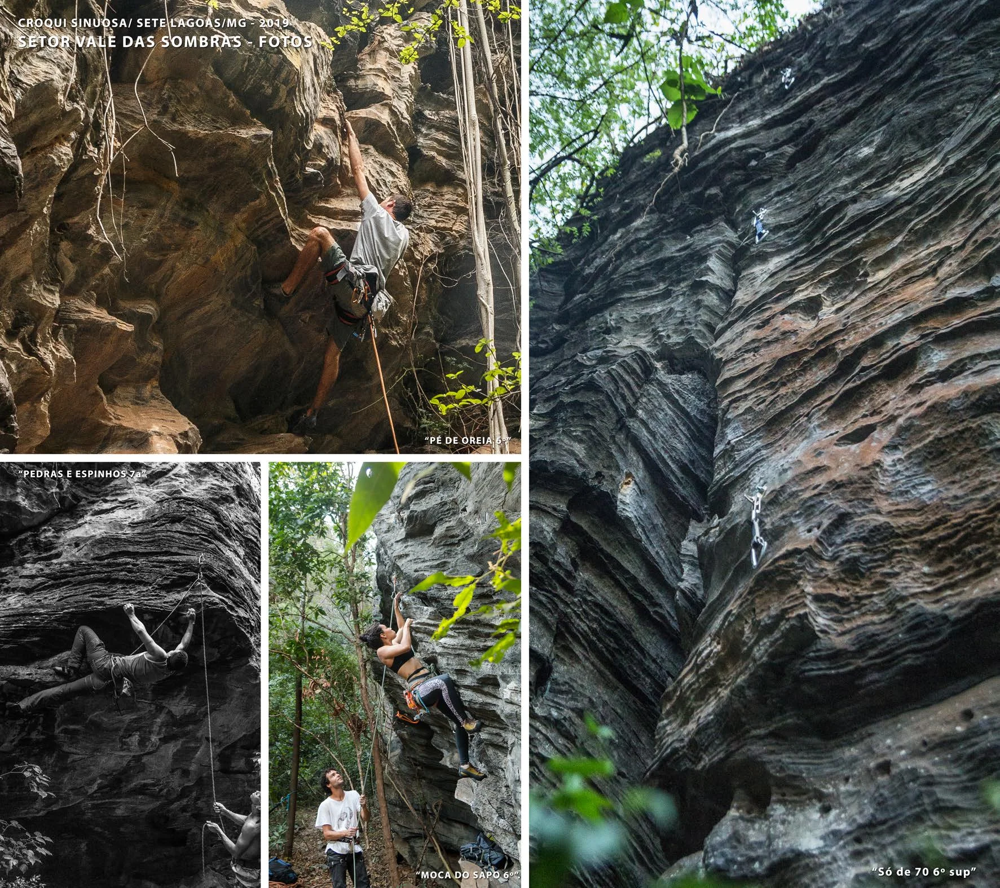

# Setor Vale das Sombras

Setor com maior concentração de vias, predominância de vias mais altas e verticais
com saídas ou lances curtos em negativo, algumas vias de resistência e outras de
crux, ou seja, garantia de escalada diferenciada o dia todo.

O vale é o setor com
maior espaço para vários grupos, bom para armar redes e dar aquela pausa no climb.

Pela manhã é bom para escalar até as 10h e após as 15h o sol é mais brando na parte
mais alta das vias.

O setor é o segundo a ser aberto pelos precursores da Sinuosa
na década de 90.

