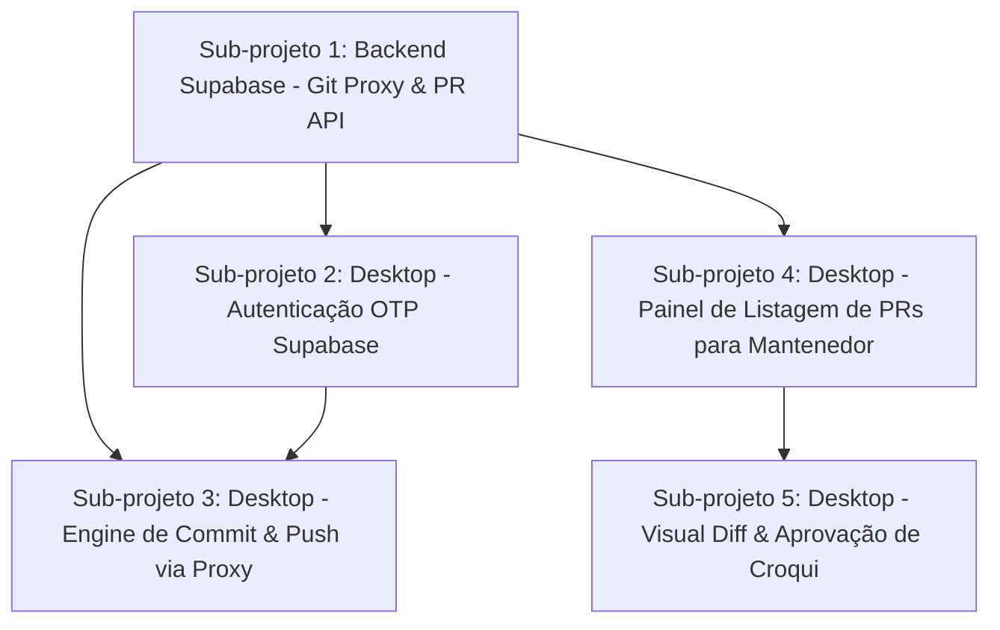

# Plano de Implementação: Sistema de Colaboração Aresta

Este documento define o roteiro de execução para implementação do novo sistema de colaboração assíncrona do **Aresta Editor**. O plano foi dividido em **5 sub-projetos autocontidos e sequenciais**, projetados para serem executados por agentes de IA de forma isolada, minimizando sobrecarga de contexto e riscos de regressão.

---

## 🗺️ Visão Geral da Arquitetura

O sistema implementa uma camada de colaboração de baixa fricção sobre o GitHub:
1. **Comunidade (Contribuidores):** Autenticam via Supabase (E-mail OTP), fazem commits locais com `pygit2`, enviam alterações pesadas (50MB+) através de uma Edge Function atuando como **Git Proxy Firewall** e abrem Pull Requests automaticamente.
2. **Mantenedores:** Autenticam via GitHub no Editor, visualizam a lista de sugestões pendentes, analisam as diferenças em um **Diff Visual** sobreposto na tela de desenho e executam aprovação (Merge) ou rejeição com um clique.



---

## 📋 Instruções de Execução para Agentes de IA

Para cada sub-projeto, siga o seguinte fluxo com o agente:
1. **Início com Exploração:** Inicie a sessão invocando `/opsx-explore` com o prompt base do sub-projeto para alinhar o contexto e analisar os arquivos existentes.
2. **Proposta OpenSpec:** Quando a abordagem estiver clara, avance para `/opsx-propose` para criar os artefatos de especificação e tarefas.
3. **Aplicação e Testes:** Execute com `/opsx-apply`, implementando código e **obrigatoriamente** escrevendo testes automatizados (unitários ou de integração).
4. **Validação:** Verifique a suite de testes antes de passar para o próximo sub-projeto.

---

## 📦 Sub-projeto 1: Backend Supabase (Git Proxy & PR API)

* **Objetivo:** Criar a infraestrutura Serverless no Supabase para validar tráfego Git, atuar como Firewall de branch e automatizar abertura de Pull Requests no GitHub.
* **Tecnologias:** Supabase Edge Functions (Deno / TypeScript), GitHub REST API / Octokit.
* **Escopo:**
  * Função `git-proxy`:
    * Interceptar endpoints do Git Smart HTTP (`/info/refs` e `/git-receive-pack`).
    * Validar cabeçalho `Authorization: Bearer <Supabase_JWT>`.
    * **Git Firewall:** Inspecionar os primeiros bytes (`pkt-line`) do payload de push para validar se o ref alvo obedece à regex `^refs/heads/sugestao-[a-zA-Z0-9_-]+$`. Rejeitar tentativas para `refs/heads/main` com HTTP 403.
    * Injetar o Token do Bot do GitHub e redirecionar o stream bidirecionalmente para `github.com/aresta-climb/aresta_db.git`.
  * Função `create-pr`:
    * Endpoint REST autenticado via JWT.
    * Recebe `{"branch": "sugestao-xxx", "title": "...", "description": "...", "author_email": "..."}`.
    * Abre a Pull Request no repositório via API do GitHub com o token do Bot.
* **Critérios de Aceite:**
  * Teste automatizado / script de teste disparando `git push` via proxy com JWT simulado.
  * Tentativas de push para branch não autorizada retornam 403 Forbidden.
  * Chamada ao endpoint `create-pr` cria com sucesso uma PR no repositório alvo.

### 📝 Prompt para a IA (Sub-projeto 1):
```text
/opsx-explore Quero implementar o Sub-projeto 1: Backend Supabase (Git Proxy e Criação de PR).

Contexto:
Precisamos criar duas Supabase Edge Functions (Deno/TypeScript):
1. `git-proxy`: Um proxy transparente para Git Smart HTTP que valida JWT de usuário do Supabase Auth, inspeciona o packet-line do payload do git-receive-pack para garantir que a branch alvo comece com `refs/heads/sugestao-` (bloqueando `main`), injeta o Token de Bot do GitHub e faz stream do tráfego para o GitHub.
2. `create-pr`: Endpoint REST que valida JWT do Supabase e abre uma Pull Request no GitHub a partir da branch informada.

Por favor, investigue como estruturar essas Edge Functions, como fazer streaming de request/response em Deno e como inspecionar o pkt-line do protocolo Git.
```

---

## 📦 Sub-projeto 2: Cliente Desktop - Autenticação OTP Supabase

* **Objetivo:** Adicionar fluxo de login amigável por E-mail (Magic Code de 6 dígitos) usando Supabase Auth no Aresta Editor (PyQt6).
* **Tecnologias:** Python, PyQt6, Supabase Python Client (ou `requests`), `keyring`.
* **Escopo:**
  * Serviço de Autenticação (`editor/core/auth_service.py` ou equivalente MVC):
    * Solicitar envio de OTP para um e-mail (`signInWithOtp`).
    * Verificar código digitado pelo usuário (`verifyOtp`) e obter access token (JWT).
    * Armazenar a sessão localmente de forma segura (para reuso entre sessões).
  * Interface Gráfica (PyQt6 Dialog/View):
    * Modal em português: "Entrar / Contribuir".
    * Etapa 1: Inserir e-mail -> Botão "Enviar Código".
    * Etapa 2: Inserir código de 6 dígitos -> Botão "Validar".
    * Indicadores visuais de carregamento e mensagens de erro amigáveis.
* **Critérios de Aceite:**
  * Testes unitários com mock da API do Supabase cobrindo sucesso, código inválido e erro de rede.
  * Interface funcional exibindo estados de transição corretamente.
  * Token JWT retornado salvo e recuperável para as próximas requisições.

### 📝 Prompt para a IA (Sub-projeto 2):
```text
/opsx-explore Quero implementar o Sub-projeto 2: Autenticação por E-mail (OTP) do Supabase no Editor Desktop.

Contexto:
O Aresta Editor (PyQt6) precisa permitir que usuários da comunidade se autentiquem apenas digitando seu e-mail e um código de 6 dígitos enviado pelo Supabase Auth.
Precisamos de:
1. Um serviço de autenticação Python para interagir com o Supabase Auth (solicitar e verificar OTP).
2. Um diálogo/modal PyQt6 intuitivo e em português para coletar o e-mail e o código.
3. Persistência segura do token de sessão.

Por favor, analise a arquitetura MVC existente na pasta `editor/` e proponha a melhor integração seguindo os padrões do projeto.
```

---

## 📦 Sub-projeto 3: Cliente Desktop - Engine de Commit e Push via Proxy

* **Objetivo:** Conectar o botão "Enviar Sugestão" do Editor ao `pygit2`, criando branch local, commitando arquivos modificados e fazendo push através do Supabase Git Proxy.
* **Tecnologias:** Python, `pygit2`, PyQt6.
* **Dependências:** Sub-projetos 1 e 2.
* **Escopo:**
  * Serviço de Submissão (`SubmissionService`):
    * Identificar arquivos modificados (YAMLs, imagens adicionadas/alteradas).
    * Criar branch local nomeada `sugestao-<uuid>`.
    * Criar commit local com mensagem descritiva, definindo o autor como o e-mail validado no Sub-projeto 2.
    * Configurar remote temporário apontando para a Edge Function `git-proxy` com cabeçalho de autorização contendo o JWT do Supabase.
    * Executar `git push` via `pygit2`.
    * Ao finalizar o push, disparar chamada para a Edge Function `create-pr`.
  * Feedback na UI:
    * Barra de progresso de upload no PyQt6.
    * Diálogo de sucesso exibindo o link da sugestão e orientações pós-envio.
* **Critérios de Aceite:**
  * Testes automatizados com repositório git local simulando a criação de branch, commit e chamada de push.
  * Tratamento de falhas de rede com mensagens claras em português.

### 📝 Prompt para a IA (Sub-projeto 3):
```text
/opsx-explore Quero implementar o Sub-projeto 3: Engine de Submissão de Sugestões com pygit2 e Push via Proxy.

Contexto:
Temos o Git Proxy (Sub-projeto 1) e a Autenticação OTP (Sub-projeto 2). Agora precisamos que o Editor Desktop:
1. Isole as alterações do croqui em uma nova branch local `sugestao-<uuid>`.
2. Faça commit usando `pygit2` atribuindo a autoria ao e-mail autenticado.
3. Faça o `git push` apontando para a Edge Function do Git Proxy com o JWT da sessão.
4. Chame a Edge Function `create-pr` para formalizar a Pull Request no GitHub.
5. Exiba progresso e feedback de sucesso no PyQt6.

Por favor, analise como o `pygit2` está configurado no editor atual e proponha o fluxo de submissão.
```

---

## 📦 Sub-projeto 4: Cliente Desktop - Painel de Listagem de PRs para Mantenedores

* **Objetivo:** Permitir que mantenedores visualizem e baixem sugestões da comunidade diretamente pelo Editor.
* **Tecnologias:** Python, `PyGithub` (ou GitHub REST API), PyQt6.
* **Escopo:**
  * Verificação de Perfil:
    * Identificar se o usuário atual está autenticado com credenciais de mantenedor (GitHub).
    * Habilitar aba ou janela **"Sugestões da Comunidade"**.
  * Serviço de Listagem de Sugestões:
    * Consultar Pull Requests abertas no repositório com o prefixo `sugestao-`.
    * Exibir metadados: Título, Autor (E-mail), Data de criação, Lista de arquivos modificados.
  * Serviço de Download de Artefatos:
    * Fazer download em memória ou diretório temporário dos arquivos alterados na branch da PR selecionada (YAML + Imagens).
* **Critérios de Aceite:**
  * Testes unitários com mocks da API do GitHub para listagem e download de arquivos de PR.
  * Tabela/Lista PyQt6 responsiva com ordenação e filtro.

### 📝 Prompt para a IA (Sub-projeto 4):
```text
/opsx-explore Quero implementar o Sub-projeto 4: Painel de Listagem e Download de Sugestões para Mantenedores.

Contexto:
Mantenedores logados via GitHub no Aresta Editor precisam de uma aba/painel para listar as sugestões enviadas pela comunidade (Pull Requests abertas com prefixo `sugestao-`).
Ao selecionar uma sugestão, o Editor deve buscar os arquivos modificados daquela branch no GitHub para preparação do diff.

Por favor, examine as views e controllers atuais do editor para propor onde encaixar a interface de listagem e o cliente da API do GitHub.
```

---

## 📦 Sub-projeto 5: Cliente Desktop - Visual Diff & Moderação

* **Objetivo:** Implementar o diferencial visual do Aresta Editor, permitindo sobrepor o croqui original e o sugerido na tela de desenho e aprovar/rejeitar com um clique.
* **Tecnologias:** Python, PyQt6 (QGraphicsView / QPainter / Canvas), GitHub REST API.
* **Dependências:** Sub-projeto 4.
* **Escopo:**
  * Motor de Visual Diff:
    * Carregar o croqui base (`main`) e o croqui da sugestão selecionada (baixado no Sub-projeto 4).
    * Renderização comparativa:
      * Elementos originais em transparência / tom vermelho suave.
      * Elementos propostos em destaque / tom verde.
      * Painel lateral listando alterações textuais (ex: mudanças de graduação, nomes, contagem de chapeletas).
  * Ações de Moderação:
    * Botão **"Aprovar Sugestão"**: Executa o Merge da PR via API do GitHub e atualiza a base local.
    * Botão **"Rejeitar"**: Permite inserir comentário opcional de justificativa e fecha a PR no GitHub.
* **Critérios de Aceite:**
  * Renderização correta de testes com croquis contendo adições, remoções e deslocamento de coordenadas.
  * Aprovação e rejeição refletidas com sucesso no GitHub.

### 📝 Prompt para a IA (Sub-projeto 5):
```text
/opsx-explore Quero implementar o Sub-projeto 5: Visual Diff de Croquis e Ações de Moderação (Merge/Rejeição).

Contexto:
Com os arquivos da PR baixados (Sub-projeto 4), precisamos implementar o Diff Visual no canvas do Editor:
1. Sobrepor os traçados e proteções da versão original vs nova (destacando diferenças em cores distintas).
2. Exibir painel com resumo das alterações textuais/técnicas.
3. Disponibilizar botões de "Aprovar (Merge)" e "Rejeitar", executando as respectivas ações na API do GitHub.

Por favor, analise a engine de renderização gráfica do editor (views/canvas) e proponha a implementação do modo de comparação.
```
