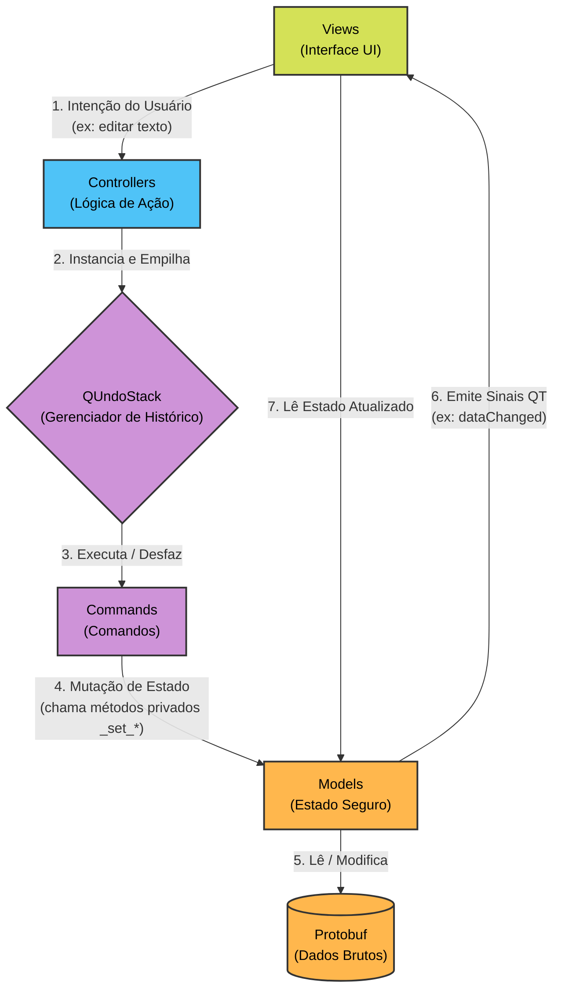

# Aresta Editor

O módulo `editor` implementa a interface gráfica principal do Aresta Editor.
Para garantir estabilidade, testabilidade e separação de responsabilidades (evitando loops infinitos e bugs de estado na UI), adotamos uma arquitetura MVC (Model-View-Controller) rigorosa orientada a comandos de histórico.

## Estrutura de Diretórios
- **`models/`**: O estado real da aplicação. Encapsula o Protobuf e expõe sinais e métodos públicos apenas para leitura. Métodos que mutam o Model são protegidos (`_set_*`) e exclusivos da camada `commands/`.
- **`views/`**: Componentes da interface visual. São "Views burras". Não mutam o Model. Apenas leem do Model para se renderizar e disparam intenções para os Controllers ao sofrer interação do usuário.
- **`controllers/`**: Orquestradores. Recebem intenções das Views, instanciam `QUndoCommand`s e os enviam para o Gerenciador de Histórico.
- **`commands/`**: Único lugar permitido a alterar o estado do Model e do Protobuf através dos métodos `_set_*`. Garantem que cada mudança é rastreável e passível de Undo/Redo.
- **`legacy_views/`**: Componentes de interface que ainda não foram migrados para o padrão MVC. Não devem ser tomados como exemplo para novos desenvolvimentos.

## Arquitetura de Fluxo de Dados (MVC)

O diagrama abaixo ilustra como os componentes do editor interagem em um fluxo de dados unidirecional:

