# Croqui: Guia de Boulders - Bocaina Park

## Informações Gerais

- **descricao**: O Bocaina Park é um parque particular de esportes, lazer e bem estar localizado a 30 km do de Araxá aos pés da serra da Bocaina.
- **id**: br_mg_araxa_bocaina_boulders
- **nome**: Guia de Boulders - Bocaina Park
- **caminho_thumbnail**: 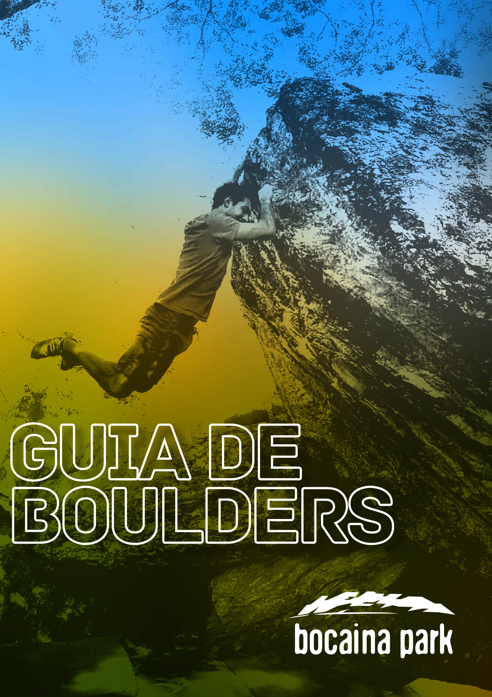
- **revisado_manualmente**: True
- **status_desenho_extraivel**: TEM_DESENHO_MAS_NAO_EXTRAIDO
- **botoes**:
  - **[0]**:
    - **texto**: Capa
    - **destino**:
      - **secao_textual**:
        - **conteudo**:
            ---
            ---
            # Guia de Boulders - Bocaina Park
            
            |  |
            | :--: |
            | *Capa* |
  - **[1]**:
    - **texto**: Patrocinadores
    - **destino**:
      - **secao_textual**:
        - **conteudo**:
            ---
            ---
            # Patrocínio e Apoio
            
            | 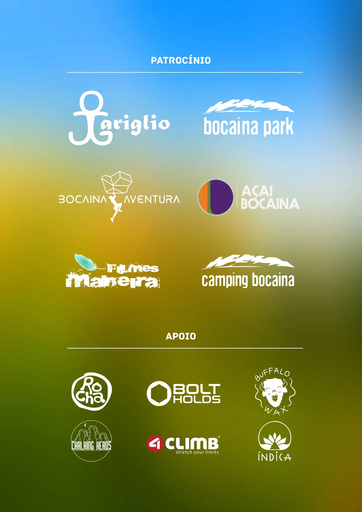 |
            | :--: |
            | *Patrocinadores* |
  - **[2]**:
    - **texto**: Introdução
    - **destino**:
      - **secao_textual**:
        - **conteudo**:
            ---
            ---
            # Introdução
            
            O **Bocaina Park** é um parque particular de esportes, lazer e bem estar que esta localizado a 30 km do centro de Araxá aos pés da serra da Bocaina. Ele nasceu de um sonho e da união de amigos escaladores locais que começaram o desenvolvimento do lugar há cerca de 15 anos conquistando as primeiras vias e setores de escalada, e viabilizando o acesso através de trilhas de acesso e uma boa convivência com a comunidade local, e ao mesmo tempo realizando um trabalho de reflorestamento e preservação da fauna e flora em conjunto com uma conscientização dos visitantes.
            
            Foi criado para atuar no desenvolvimento de esportes de montanha na serra da Bocaina com a pratica de atividades conscientes nos meios naturais e fortalecendo o turismo de esportes de montanha na cidade através com eventos de qualidade, canais de comunicação eficientes, promovendo saúde e sustentabilidade, que após um trabalho de estruturação e viabilização podem ser praticados diversos esportes e atividades de montanha como: Escalada, Highline, corrida, caminhadas, montain bike, voo livre, meditação e descanso, tudo isso em contato pleno com a natureza.
            
            Atualmente no **Bocaina Park** oferecemos serviços de hospedagem com o **Camping Bocaina** com uma estrutura adequada e confortável para os visitantes, praça de alimentação com o **Açaí Bocaina** que funciona de Quarta a Domingo com, lanches, açaís, bebidas, almoços e jantas, a casa dos guardiões que é um local destinado para as pessoas que ajudam a cuidar do Bocaina Park e serra da Bocaina.
            
            **Bocaina Park** está localizado em um ambiente natural e preservado. Nossa intenção é deixar para as futuras gerações um local ainda melhor e mais preservado do que quando chegamos aqui. Para isso, solicitamos a todos que sejam conscientes em cada ato, economizem água, respeitem todo e qualquer animal que encontrar e preservem as formas de vida que temos ao nosso redor.
            
            | 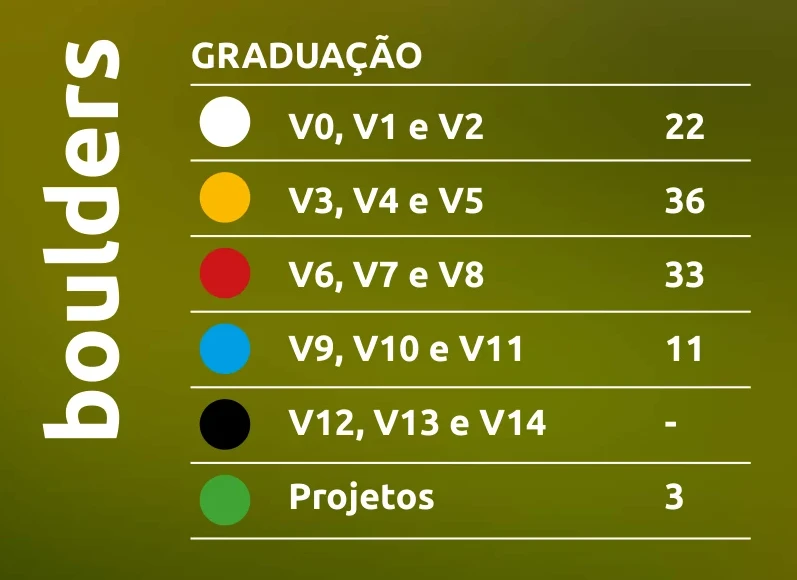 |
            | :--: |
            | *Graduações de boulders no croqui* |
  - **[3]**:
    - **texto**: Índice e Graduação
    - **destino**:
      - **secao_textual**:
        - **conteudo**:
            ---
            ---
            # Índice geral 
            
            | 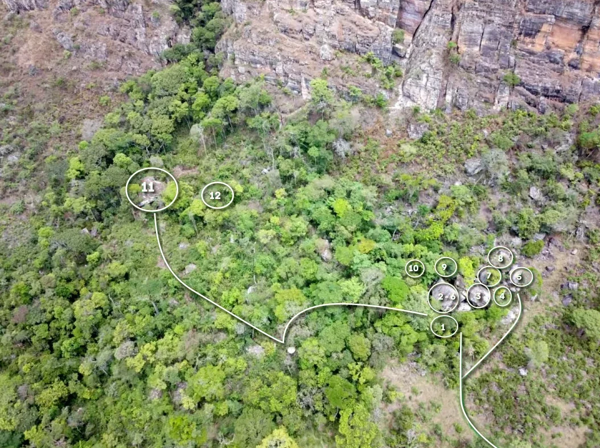 |
            | :--: |
            | *Índice Geral* |
            
            ## Blocos
            
            | Número | Nome do Bloco |
            | :--- | :--- |
            | 1 | Pressão Enrustida |
            | 2 | Caverninha |
            | 3 | Exquadrilha |
            | 4 | Canil |
            | 5 | Bloco do Guerreiro |
            | 6 | Bloco do Cabelin |
            | 7 | Consciência Limpa |
            | 8 | Haiti |
            | 9 | Achados e Perdidos |
            | 10 | Bloco do Rock Bocaina |
            | 11 | Bloco 45º |
            | 12 | Essência |
- **ultima_migracao**: 2
- **publicar_croqui**: True

## Parte: setor_pressao_enrustida

### Setor (Pico: Bocaina Park)

- **descricao**: # Setor Pressão Enrustida
- **nome**: Pressão Enrustida
- **mapas**:
  - **[0]**:
    - **caminho_imagem_mapa**: 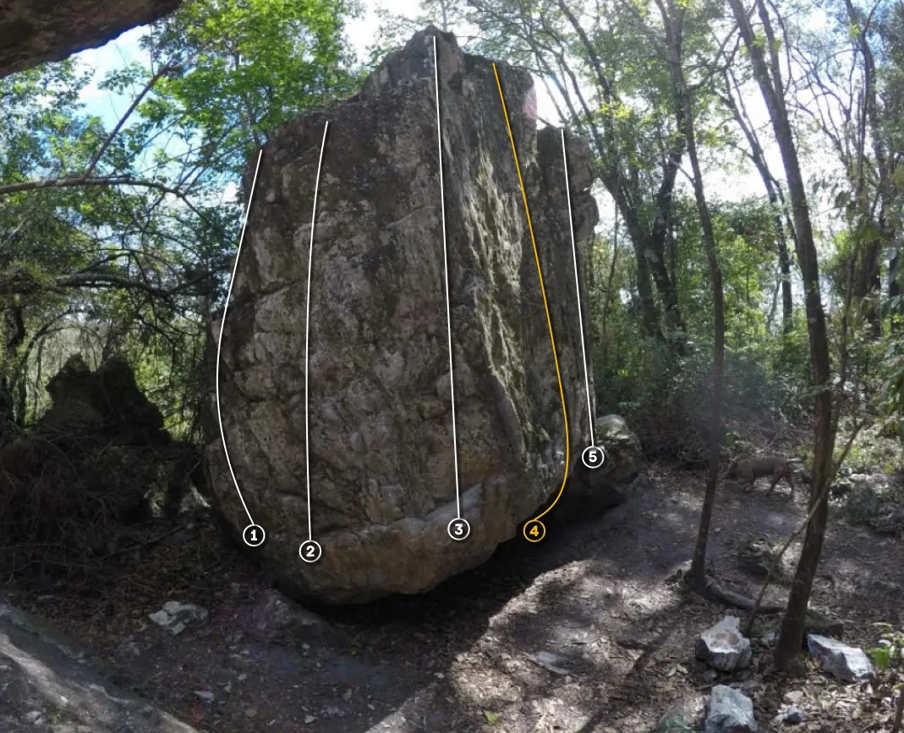
    - **largura_mapa**: 1069
    - **altura_mapa**: 868
    - **pontos_de_interesse**:
      - **[0]**:
        - **id**: 01
        - **label**: 01
        - **box**:
          - **x**: 299
          - **y**: 634
          - **comprimento**: 20
          - **largura**: 20
      - **[1]**:
        - **id**: 02
        - **label**: 02
        - **box**:
          - **x**: 366
          - **y**: 652
          - **comprimento**: 20
          - **largura**: 20
      - **[2]**:
        - **id**: 03
        - **label**: 03
        - **box**:
          - **x**: 542
          - **y**: 626
          - **comprimento**: 20
          - **largura**: 20
      - **[3]**:
        - **id**: 04
        - **label**: 04
        - **box**:
          - **x**: 631
          - **y**: 628
          - **comprimento**: 20
          - **largura**: 20
      - **[4]**:
        - **id**: 05
        - **label**: 05
        - **box**:
          - **x**: 701
          - **y**: 540
          - **comprimento**: 20
          - **largura**: 20
    - **referencias**:
      - **[0]**:
        - **escalada**: Café com Leite
        - **ids**:
          - 01
      - **[1]**:
        - **escalada**: Maltodextrina
        - **ids**:
          - 02
      - **[2]**:
        - **escalada**: Maltodextrina SDS
        - **ids**:
          - 03
      - **[3]**:
        - **escalada**: Pinga Preta
        - **ids**:
          - 04
      - **[4]**:
        - **escalada**: Pressão Enrustida
        - **ids**:
          - 05
- **escaladas**:
  - **[0]**:
    - **boulder**:
      - **nome**: Café com Leite
      - **dificuldade**: V0
  - **[1]**:
    - **boulder**:
      - **descricao**: Saída agachado com as mãos juntas em agarrão, virando reto no bloco.
      - **nome**: Maltodextrina
      - **dificuldade**: V0
  - **[2]**:
    - **boulder**:
      - **descricao**: Saída sentado com as mãos em regletes abaixo do agarrão do Maltodextrina, e virando reto.
      - **nome**: Maltodextrina SDS
      - **dificuldade**: V2
  - **[3]**:
    - **boulder**:
      - **descricao**: Saída do Maltodextrina e vira no Não contava com minhas astúcia.
      - **nome**: Pinga Preta
      - **dificuldade**: V3
  - **[4]**:
    - **boulder**:
      - **descricao**: Saída sentado com as mãos juntas em agarrão investido no teto.
      - **nome**: Pressão Enrustida
      - **dificuldade**: V4
  - **[5]**:
    - **boulder**:
      - **descricao**: Saída agachado com as duas mãos juntas em agarrão em bloco pequeno passando para Pressão inrrustida no bloco da esquerda.
      - **nome**: Não Contava com Minha Astúcia
      - **dificuldade**: V1
  - **[6]**:
    - **boulder**:
      - **descricao**: Saída do Não Contava com minha astúcia fazendo travessia para esquerda virando no Maltodextrina.
      - **nome**: Rapé
      - **dificuldade**: V3

## Parte: setor_caverninha

### Setor (Pico: Bocaina Park)

- **descricao**: # Setor Caverninha
- **nome**: Caverninha
- **mapas**:
  - **[0]**:
    - **caminho_imagem_mapa**: 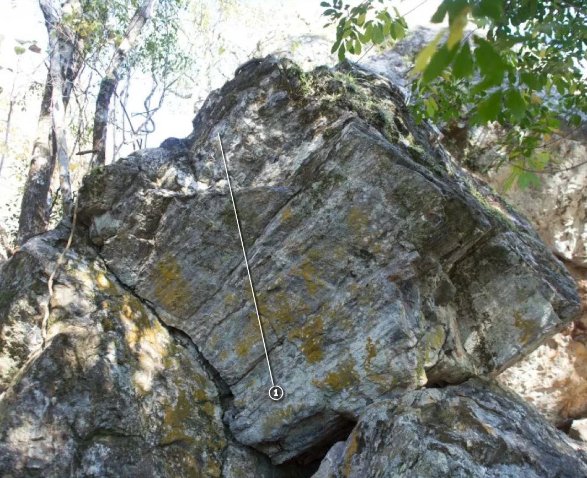
    - **largura_mapa**: 1064
    - **altura_mapa**: 868
    - **pontos_de_interesse**:
      - **[0]**:
        - **id**: 01
        - **label**: 01
        - **box**:
          - **x**: 500
          - **y**: 712
          - **comprimento**: 20
          - **largura**: 20
    - **referencias**:
      - **[0]**:
        - **escalada**: Mingau
        - **ids**:
          - 01
  - **[1]**:
    - **caminho_imagem_mapa**: 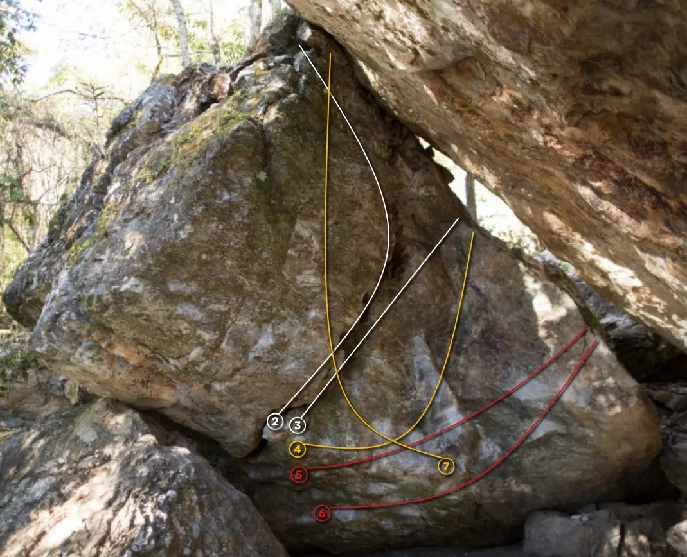
    - **largura_mapa**: 1069
    - **altura_mapa**: 868
    - **pontos_de_interesse**:
      - **[0]**:
        - **id**: 02
        - **label**: 02
        - **box**:
          - **x**: 428
          - **y**: 657
          - **comprimento**: 20
          - **largura**: 20
      - **[1]**:
        - **id**: 03
        - **label**: 03
        - **box**:
          - **x**: 462
          - **y**: 662
          - **comprimento**: 20
          - **largura**: 20
      - **[2]**:
        - **id**: 04
        - **label**: 04
        - **box**:
          - **x**: 462
          - **y**: 698
          - **comprimento**: 19
          - **largura**: 17
      - **[3]**:
        - **id**: 05
        - **label**: 05
        - **box**:
          - **x**: 466
          - **y**: 740
          - **comprimento**: 19
          - **largura**: 19
      - **[4]**:
        - **id**: 06
        - **label**: 06
        - **box**:
          - **x**: 500
          - **y**: 800
          - **comprimento**: 19
          - **largura**: 19
      - **[5]**:
        - **id**: 07
        - **label**: 07
        - **box**:
          - **x**: 694
          - **y**: 726
          - **comprimento**: 20
          - **largura**: 20
    - **referencias**:
      - **[0]**:
        - **escalada**: Pretinho Irlandês
        - **ids**:
          - 02
      - **[1]**:
        - **escalada**: Ratos e Raízes
        - **ids**:
          - 03
      - **[2]**:
        - **escalada**: Tripa Eterna
        - **ids**:
          - 04
      - **[3]**:
        - **escalada**: Trip Eterna
        - **ids**:
          - 05
      - **[4]**:
        - **escalada**: Mecanismo
        - **ids**:
          - 06
      - **[5]**:
        - **escalada**: Pedrada
        - **ids**:
          - 07
  - **[2]**:
    - **caminho_imagem_mapa**: 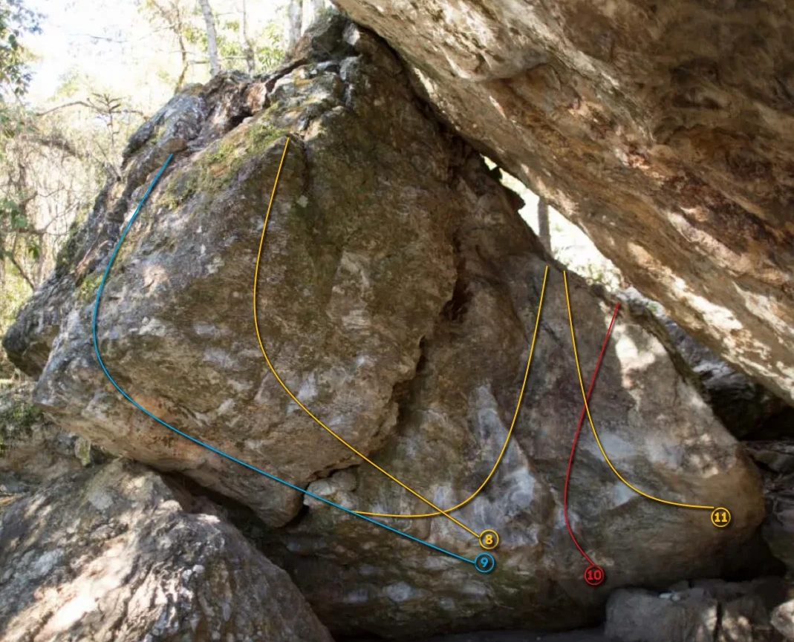
    - **largura_mapa**: 1069
    - **altura_mapa**: 865
    - **pontos_de_interesse**:
      - **[0]**:
        - **id**: 08
        - **label**: 08
        - **box**:
          - **x**: 659
          - **y**: 726
          - **comprimento**: 20
          - **largura**: 20
      - **[1]**:
        - **id**: 09
        - **label**: 09
        - **box**:
          - **x**: 652
          - **y**: 757
          - **comprimento**: 18
          - **largura**: 18
      - **[2]**:
        - **id**: 10
        - **label**: 10
        - **box**:
          - **x**: 799
          - **y**: 774
          - **comprimento**: 24
          - **largura**: 22
      - **[3]**:
        - **id**: 11
        - **label**: 11
        - **box**:
          - **x**: 970
          - **y**: 696
          - **comprimento**: 22
          - **largura**: 17
    - **referencias**:
      - **[0]**:
        - **escalada**: Aedes Egipse
        - **ids**:
          - 08
      - **[1]**:
        - **escalada**: V9 do Rafinha
        - **ids**:
          - 09
      - **[2]**:
        - **escalada**: Os Trabalhos Não Param
        - **ids**:
          - 10
      - **[3]**:
        - **escalada**: Trabalho em Equipe
        - **ids**:
          - 11
- **escaladas**:
  - **[0]**:
    - **boulder**:
      - **descricao**: Saída com as mãos juntas em reglete bom, seguindo para sequencia de reglete e agarrão virando no meio do bloco.
      - **nome**: Mingau
      - **dificuldade**: V2
  - **[1]**:
    - **boulder**:
      - **descricao**: Saída agaixado com as duas mãos em agarrão, seguindo reto por batente lateral virando a esquerda do bloco na parte de cima.
      - **nome**: Pretinho Irlandês
      - **dificuldade**: V2
  - **[2]**:
    - **boulder**:
      - **descricao**: Saída do pretinho Irlandes seguindo primeiros movimentos na fenda reta virando na direita.
      - **nome**: Ratos e Raízes
      - **dificuldade**: V1
  - **[3]**:
    - **boulder**:
      - **descricao**: Saída do Pretinho Irlandes indo para pinçá a direita da agarra de saída seguindo para batentes escorridos e virando no centro do bloco
      - **nome**: Tripa Eterna
      - **dificuldade**: V4
  - **[4]**:
    - **boulder**:
      - **descricao**: Saída do Pretinho Irlandes indo para pinça a direita da agarra de saída, seguindo para batentes escorridos virando a direita do bloco.
      - **nome**: Trip Eterna
      - **dificuldade**: V6
  - **[5]**:
    - **boulder**:
      - **descricao**: Saída sentado com a mao esquerda em batentee mao direita em reglete e calchanhar equerdo na altura da mão esquerda, passando por buracos no teto, seguindo para agarra triangular e virando no Trip Eterna.
      - **nome**: Mecanismo
      - **dificuldade**: V7
  - **[6]**:
    - **boulder**:
      - **descricao**: Saida sentado com as mãos em dois batentes escorridos, virando no Pretinho Irlandês.
      - **nome**: Pedrada
      - **dificuldade**: V3
  - **[7]**:
    - **boulder**:
      - **descricao**: Saída sentado em batentes escorridos seguindo para esquerda em sequencia de regletes no meio do bloco virando em abaulado grande.
      - **nome**: Aedes Egipse
      - **dificuldade**: V5
  - **[8]**:
    - **boulder**:
      - **descricao**: Saída do pedrada, e seguir sequencia de batentes e regletes pela parte debaixo do bloco virando na aresta esquerda.
      - **nome**: V9 do Rafinha
      - **dificuldade**: V9
  - **[9]**:
    - **boulder**:
      - **descricao**: Saída sentado com as duas mãos em reglete grande baixo e calcanhar esquerdo mais alto que as mãos, virando no Trip Eterna.
      - **nome**: Os Trabalhos Não Param
      - **dificuldade**: V6
  - **[10]**:
    - **boulder**:
      - **descricao**: Saída sentado com a mão esquerda em batente de compressão e direita em reglete aberto acima da cabeça.
      - **nome**: Trabalho em Equipe
      - **dificuldade**: V5

## Parte: setor_exquadrilha

### Setor (Pico: Bocaina Park)

- **descricao**: # Setor Exquadrilha
- **nome**: Exquadrilha
- **mapas**:
  - **[0]**:
    - **caminho_imagem_mapa**: 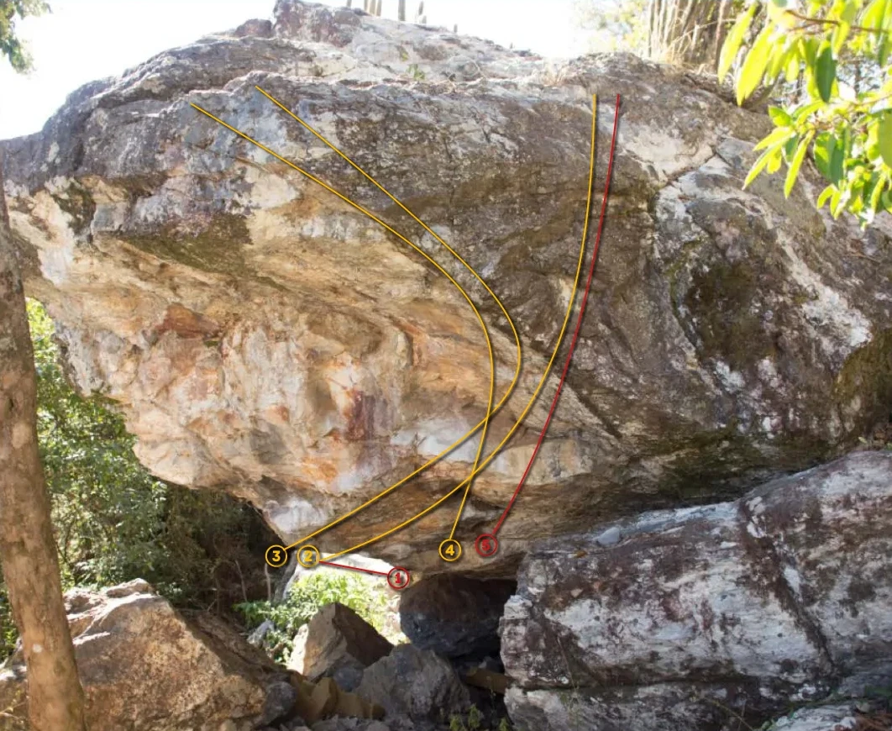
    - **largura_mapa**: 1062
    - **altura_mapa**: 870
    - **pontos_de_interesse**:
      - **[0]**:
        - **id**: 01
        - **label**: 01
        - **box**:
          - **x**: 472
          - **y**: 688
          - **comprimento**: 20
          - **largura**: 20
      - **[1]**:
        - **id**: 02
        - **label**: 02
        - **box**:
          - **x**: 366
          - **y**: 661
          - **comprimento**: 20
          - **largura**: 20
      - **[2]**:
        - **id**: 03
        - **label**: 03
        - **box**:
          - **x**: 327
          - **y**: 662
          - **comprimento**: 20
          - **largura**: 20
      - **[3]**:
        - **id**: 04
        - **label**: 04
        - **box**:
          - **x**: 535
          - **y**: 654
          - **comprimento**: 20
          - **largura**: 20
      - **[4]**:
        - **id**: 05
        - **label**: 05
        - **box**:
          - **x**: 578
          - **y**: 649
          - **comprimento**: 20
          - **largura**: 20
    - **referencias**:
      - **[0]**:
        - **escalada**: Fumaça Sagrada
        - **ids**:
          - 01
      - **[1]**:
        - **escalada**: Exquadrilha da Fumaça
        - **ids**:
          - 02
      - **[2]**:
        - **escalada**: Quadrilha da Fumaça
        - **ids**:
          - 03
      - **[3]**:
        - **escalada**: Planet Hemp
        - **ids**:
          - 04
      - **[4]**:
        - **escalada**: Cypress Hill
        - **ids**:
          - 05
- **escaladas**:
  - **[0]**:
    - **boulder**:
      - **descricao**: Saída com as mãos em regletes invertidos e pés com tail em batente grande e segue pelo Exquadrilha da Fumaça.
      - **nome**: Fumaça Sagrada
      - **dificuldade**: V7
  - **[1]**:
    - **boulder**:
      - **descricao**: Saída com as mãos e calcanhar esquerdo em batente grande, e segue para direita em agarrão virando na lateral no bloco.
      - **nome**: Exquadrilha da Fumaça
      - **dificuldade**: V5
  - **[2]**:
    - **boulder**:
      - **descricao**: Saída com as mãos em buracos na laca, seguindo para agarrão e virando a direita do bloco.
      - **nome**: Quadrilha da Fumaça
      - **dificuldade**: V4
  - **[3]**:
    - **boulder**:
      - **descricao**: Saída com as mãos buracos na laca, seguindo para agarrão e virando reto proa.
      - **nome**: Planet Hemp
      - **dificuldade**: V5
  - **[4]**:
    - **boulder**:
      - **descricao**: Saída do exquadrilha e virando no Planet Hemp.
      - **nome**: Cypress Hill
      - **dificuldade**: V6

## Parte: setor_canil

### Setor (Pico: Bocaina Park)

- **descricao**: # Setor Canil
- **nome**: Canil
- **mapas**:
  - **[0]**:
    - **caminho_imagem_mapa**: 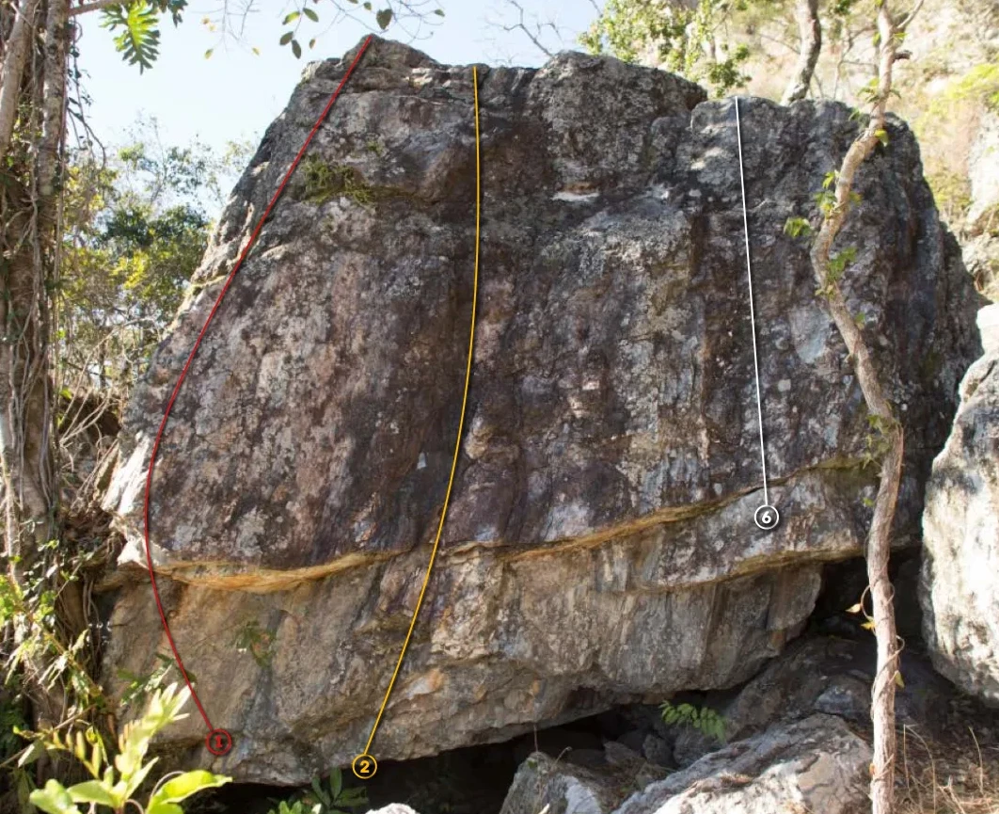
    - **largura_mapa**: 1062
    - **altura_mapa**: 865
    - **pontos_de_interesse**:
      - **[0]**:
        - **id**: 01
        - **label**: 01
        - **box**:
          - **x**: 231
          - **y**: 789
          - **comprimento**: 24
          - **largura**: 24
      - **[1]**:
        - **id**: 02
        - **label**: 02
        - **box**:
          - **x**: 388
          - **y**: 814
          - **comprimento**: 23
          - **largura**: 24
      - **[2]**:
        - **id**: 06
        - **label**: 06
        - **box**:
          - **x**: 814
          - **y**: 548
          - **comprimento**: 24
          - **largura**: 24
    - **referencias**:
      - **[0]**:
        - **escalada**: Sucrilhos no Prato
        - **ids**:
          - 01
      - **[1]**:
        - **escalada**: Titan
        - **ids**:
          - 02
      - **[2]**:
        - **escalada**: Loboulder
        - **ids**:
          - 06
- **escaladas**:
  - **[0]**:
    - **boulder**:
      - **descricao**: Saída deitado com mão esquerda em pinça e direita na mesma agarra em reglete lateral.
      - **nome**: Sucrilhos no Prato
      - **dificuldade**: V7
  - **[1]**:
    - **boulder**:
      - **descricao**: Saída deitado com mao esquerda em pinça na borda e direita batente investido.
      - **nome**: Titan
      - **dificuldade**: V4
  - **[2]**:
    - **boulder**:
      - **descricao**: Saida do Sucrilhos no Prato fazendo travessia para direita virando no Loboulder.
      - **nome**: Lobão
      - **dificuldade**: V7
  - **[3]**:
    - **boulder**:
      - **descricao**: Saída do Sucrilhos no Prato e virando no Titan.
      - **nome**: Tião Macalé
      - **dificuldade**: V5
  - **[4]**:
    - **boulder**:
      - **nome**: Zac
      - **dificuldade**: V6
  - **[5]**:
    - **boulder**:
      - **descricao**: Sai agachado com as mãos juntas em agarrão.
      - **nome**: Loboulder
      - **dificuldade**: V2
  - **[6]**:
    - **boulder**:
      - **descricao**: Saída do loboulder em travessia para esquerda virando no Sucrilhos no Prato.
      - **nome**: Savana
      - **dificuldade**: V6

## Parte: setor_bloco_do_guerreiro

### Setor (Pico: Bocaina Park)

- **descricao**: # Setor Bloco do Guerreiro
- **nome**: Bloco do Guerreiro
- **mapas**:
  - **[0]**:
    - **caminho_imagem_mapa**: 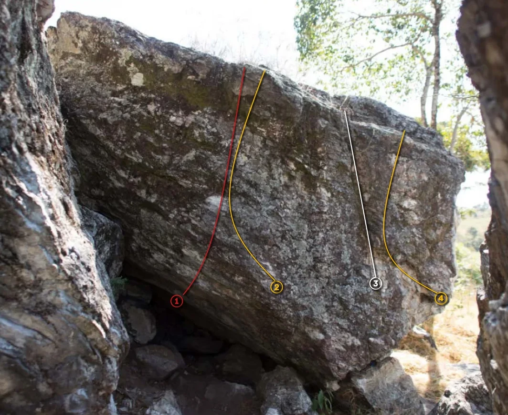
    - **largura_mapa**: 1064
    - **altura_mapa**: 871
    - **pontos_de_interesse**:
      - **[0]**:
        - **id**: 01
        - **label**: 01
        - **box**:
          - **x**: 370
          - **y**: 631
          - **comprimento**: 19
          - **largura**: 20
      - **[1]**:
        - **id**: 02
        - **label**: 02
        - **box**:
          - **x**: 578
          - **y**: 602
          - **comprimento**: 23
          - **largura**: 23
      - **[2]**:
        - **id**: 03
        - **label**: 03
        - **box**:
          - **x**: 786
          - **y**: 594
          - **comprimento**: 19
          - **largura**: 19
      - **[3]**:
        - **id**: 04
        - **label**: 04
        - **box**:
          - **x**: 924
          - **y**: 625
          - **comprimento**: 17
          - **largura**: 18
    - **referencias**:
      - **[0]**:
        - **escalada**: Strike
        - **ids**:
          - 01
      - **[1]**:
        - **escalada**: Chove e Não Molha
        - **ids**:
          - 02
      - **[2]**:
        - **escalada**: Palhaço Pirulito
        - **ids**:
          - 03
      - **[3]**:
        - **escalada**: Marreteiro
        - **ids**:
          - 04
  - **[1]**:
    - **caminho_imagem_mapa**: 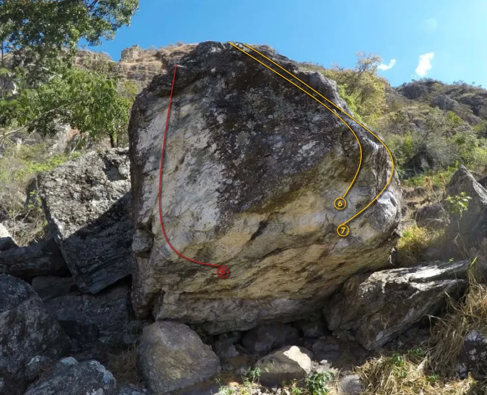
    - **largura_mapa**: 1084
    - **altura_mapa**: 881
    - **pontos_de_interesse**:
      - **[0]**:
        - **id**: 05
        - **label**: 05
        - **box**:
          - **x**: 496
          - **y**: 605
          - **comprimento**: 20
          - **largura**: 20
      - **[1]**:
        - **id**: 06
        - **label**: 06
        - **box**:
          - **x**: 756
          - **y**: 454
          - **comprimento**: 19
          - **largura**: 20
      - **[2]**:
        - **id**: 07
        - **label**: 07
        - **box**:
          - **x**: 764
          - **y**: 512
          - **comprimento**: 21
          - **largura**: 21
    - **referencias**:
      - **[0]**:
        - **escalada**: Guerreiro da Bocaina
        - **ids**:
          - 05
      - **[1]**:
        - **escalada**: High Line
        - **ids**:
          - 06
      - **[2]**:
        - **escalada**: Colchão de Mola
        - **ids**:
          - 07
- **escaladas**:
  - **[0]**:
    - **boulder**:
      - **descricao**: Saída sentado com mão esquerda em reglete e direita em pinça pequena seguindo para abaulado virando reto.
      - **nome**: Strike
      - **dificuldade**: V7_BARRA_V8
  - **[1]**:
    - **boulder**:
      - **descricao**: Saída em pé em regletes na aresta indo para abaulado e virando reto.
      - **nome**: Chove e Não Molha
      - **dificuldade**: V3
  - **[2]**:
    - **boulder**:
      - **descricao**: Saída em pé com as mãos em abaulado virando reto.
      - **nome**: Palhaço Pirulito
      - **dificuldade**: V1
  - **[3]**:
    - **boulder**:
      - **descricao**: Saida agachado, com a mão esquerda em reglete escorrido e direita em reglete de meia falange com calcanhar na mão direita e segue a linha reta.
      - **nome**: Marreteiro
      - **dificuldade**: V5
  - **[4]**:
    - **boulder**:
      - **descricao**: Saída agachado com mão esquerda em abaulado com calcanhar esquerdo ao lado da mão e direita em reglete no teto.
      - **nome**: Guerreiro da Bocaina
      - **dificuldade**: V6
  - **[5]**:
    - **boulder**:
      - **descricao**: Saída em pé com as mãos em regletes no batentão.
      - **nome**: High Line
      - **dificuldade**: V5
  - **[6]**:
    - **boulder**:
      - **descricao**: Saída em pé com as mãos em regletes investidos.
      - **nome**: Colchão de Mola
      - **dificuldade**: V4

## Parte: setor_bloco_do_cabelin

### Setor (Pico: Bocaina Park)

- **descricao**: # Setor Bloco do Cabelin
- **nome**: Bloco do Cabelin
- **mapas**:
  - **[0]**:
    - **caminho_imagem_mapa**: 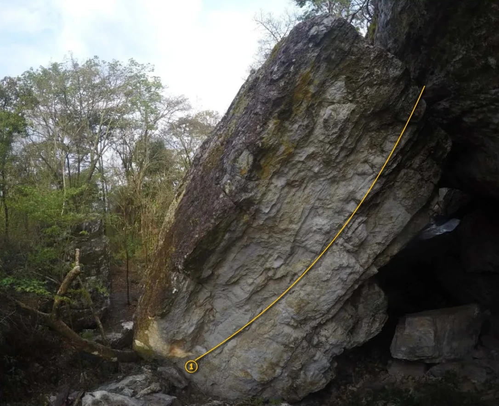
    - **largura_mapa**: 1086
    - **altura_mapa**: 885
    - **pontos_de_interesse**:
      - **[0]**:
        - **id**: 01
        - **label**: 01
        - **box**:
          - **x**: 415
          - **y**: 797
          - **comprimento**: 20
          - **largura**: 20
    - **referencias**:
      - **[0]**:
        - **escalada**: Sexto Sentido
        - **ids**:
          - 01
  - **[1]**:
    - **caminho_imagem_mapa**: 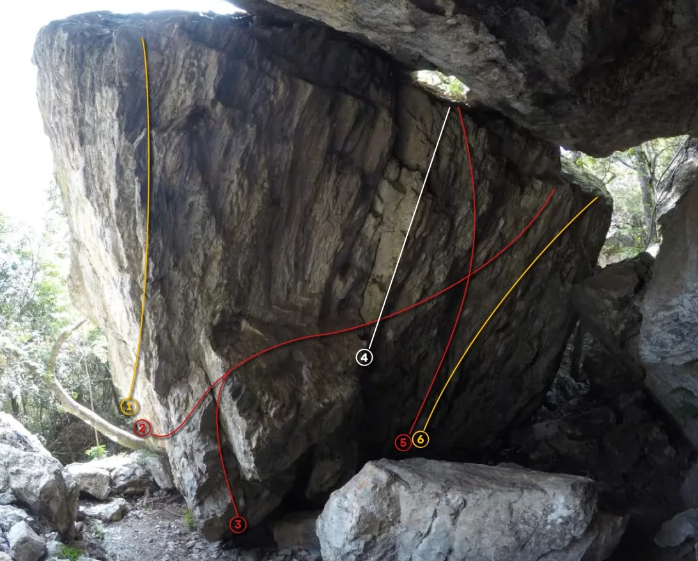
    - **largura_mapa**: 1092
    - **altura_mapa**: 878
    - **pontos_de_interesse**:
      - **[0]**:
        - **id**: 01
        - **label**: 01
        - **box**:
          - **x**: 202
          - **y**: 637
          - **comprimento**: 20
          - **largura**: 20
      - **[1]**:
        - **id**: 02
        - **label**: 02
        - **box**:
          - **x**: 222
          - **y**: 670
          - **comprimento**: 20
          - **largura**: 20
      - **[2]**:
        - **id**: 03
        - **label**: 03
        - **box**:
          - **x**: 372
          - **y**: 820
          - **comprimento**: 21
          - **largura**: 21
      - **[3]**:
        - **id**: 04
        - **label**: 04
        - **box**:
          - **x**: 569
          - **y**: 558
          - **comprimento**: 20
          - **largura**: 20
      - **[4]**:
        - **id**: 05
        - **label**: 05
        - **box**:
          - **x**: 632
          - **y**: 692
          - **comprimento**: 23
          - **largura**: 25
      - **[5]**:
        - **id**: 06
        - **label**: 06
        - **box**:
          - **x**: 658
          - **y**: 688
          - **comprimento**: 20
          - **largura**: 20
    - **referencias**:
      - **[0]**:
        - **escalada**: Sexto Sentido
        - **ids**:
          - 01
      - **[1]**:
        - **escalada**: Dread Lock
        - **ids**:
          - 02
      - **[2]**:
        - **escalada**: Cabeludo
        - **ids**:
          - 03
      - **[3]**:
        - **escalada**: Jacinto Barriguinha
        - **ids**:
          - 04
      - **[4]**:
        - **escalada**: Compressor
        - **ids**:
          - 05
      - **[5]**:
        - **escalada**: Cabelinho
        - **ids**:
          - 06
  - **[2]**:
    - **caminho_imagem_mapa**: 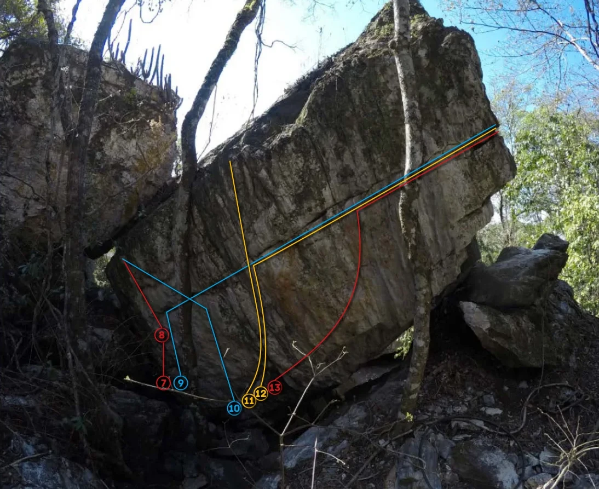
    - **largura_mapa**: 1094
    - **altura_mapa**: 893
    - **pontos_de_interesse**:
      - **[0]**:
        - **id**: 07
        - **label**: 07
        - **box**:
          - **x**: 299
          - **y**: 698
          - **comprimento**: 20
          - **largura**: 20
      - **[1]**:
        - **id**: 08
        - **label**: 08
        - **box**:
          - **x**: 296
          - **y**: 612
          - **comprimento**: 20
          - **largura**: 20
      - **[2]**:
        - **id**: 09
        - **label**: 09
        - **box**:
          - **x**: 330
          - **y**: 698
          - **comprimento**: 20
          - **largura**: 20
      - **[3]**:
        - **id**: 10
        - **label**: 10
        - **box**:
          - **x**: 425
          - **y**: 746
          - **comprimento**: 20
          - **largura**: 20
      - **[4]**:
        - **id**: 11
        - **label**: 11
        - **box**:
          - **x**: 453
          - **y**: 733
          - **comprimento**: 20
          - **largura**: 20
      - **[5]**:
        - **id**: 12
        - **label**: 12
        - **box**:
          - **x**: 476
          - **y**: 718
          - **comprimento**: 20
          - **largura**: 20
      - **[6]**:
        - **id**: 13
        - **label**: 13
        - **box**:
          - **x**: 502
          - **y**: 707
          - **comprimento**: 20
          - **largura**: 20
    - **referencias**:
      - **[0]**:
        - **escalada**: Mágico de Oz
        - **ids**:
          - 07
      - **[1]**:
        - **escalada**: Mágico de Oz SDS
        - **ids**:
          - 08
      - **[2]**:
        - **escalada**: Mr. Gordura
        - **ids**:
          - 09
      - **[3]**:
        - **escalada**: País das Maravilhas
        - **ids**:
          - 10
      - **[4]**:
        - **escalada**: Capim Louco
        - **ids**:
          - 11
      - **[5]**:
        - **escalada**: Capim Gordura
        - **ids**:
          - 12
      - **[6]**:
        - **escalada**: Roleta Russa
        - **ids**:
          - 13
- **escaladas**:
  - **[0]**:
    - **boulder**:
      - **descricao**: Saída agachado com as mãos juntas em batente bom a direita do bloco e segue pela fenda diagonal para direita e vira na proa.
      - **nome**: Sexto Sentido
      - **dificuldade**: V4
  - **[1]**:
    - **boulder**:
      - **descricao**: Mesma saída do sexto sentido, travessia horizontal por baixo e entra no cabeludo.
      - **nome**: Dread Lock
      - **dificuldade**: V7
  - **[2]**:
    - **boulder**:
      - **descricao**: Saída sentado abrançando a aresta no meio do bloco, faz o primeiro movimento para cima da pedra e sai pra direita e vira no cabelinho.
      - **nome**: Cabeludo
      - **dificuldade**: V7
  - **[3]**:
    - **boulder**:
      - **descricao**: Saída em pé com as mãos em agarrões e vira no buraco, no meio do bloco.
      - **nome**: Jacinto Barriguinha
      - **dificuldade**: V2
  - **[4]**:
    - **boulder**:
      - **descricao**: Mesma saída do Cabelinho virando reto no buraco.
      - **nome**: Compressor
      - **dificuldade**: V8
  - **[5]**:
    - **boulder**:
      - **descricao**: Saída sentado com mão esquerda em pinça e direita em reglete pequeno, virando a direita do bloco.
      - **nome**: Cabelinho
      - **dificuldade**: V5
  - **[6]**:
    - **boulder**:
      - **descricao**: Saída em pé com mão esquerda em reglete pequeno de gaston ou biquinho, e mão direita em pequeno reglete abaulado.
      - **nome**: Mágico de Oz
      - **dificuldade**: V7
  - **[7]**:
    - **boulder**:
      - **descricao**: Saída em pé com mão esquerda em reglete investido e mão direita em pinça investida.
      - **nome**: Mágico de Oz SDS
      - **dificuldade**: V8
  - **[8]**:
    - **boulder**:
      - **descricao**: Saída do Mágico de Oz SDS, e segue para direita pela fenda virando no Capim Gordura.
      - **nome**: Mr. Gordura
      - **dificuldade**: V9
  - **[9]**:
    - **boulder**:
      - **descricao**: Saída deitado em agarrão, seguindo para esquerda passando por traz da árvore e virando no Mágico de Oz.
      - **nome**: País das Maravilhas
      - **dificuldade**: V10
  - **[10]**:
    - **boulder**:
      - **descricao**: Saída do País das Maravilhas e vira reto no bloco.
      - **nome**: Capim Louco
      - **dificuldade**: V3
  - **[11]**:
    - **boulder**:
      - **descricao**: Saída do País das Maravilhas e segue para direita pela fenda.
      - **nome**: Capim Gordura
      - **dificuldade**: V5
  - **[12]**:
    - **boulder**:
      - **nome**: Roleta Russa
      - **dificuldade**: V6
  - **[13]**:
    - **boulder**:
      - **descricao**: Saída em pé com mão esquerda no bico e mão direita em pinça pequena na altura no quadril, virando reto e seguindo até o final do bloco.
      - **nome**: La Qualitê
      - **dificuldade**: V10

## Parte: setor_consciencia_limpa

### Setor (Pico: Bocaina Park)

- **descricao**: # Setor Consciência Limpa
- **nome**: Consciência Limpa
- **mapas**:
  - **[0]**:
    - **caminho_imagem_mapa**: 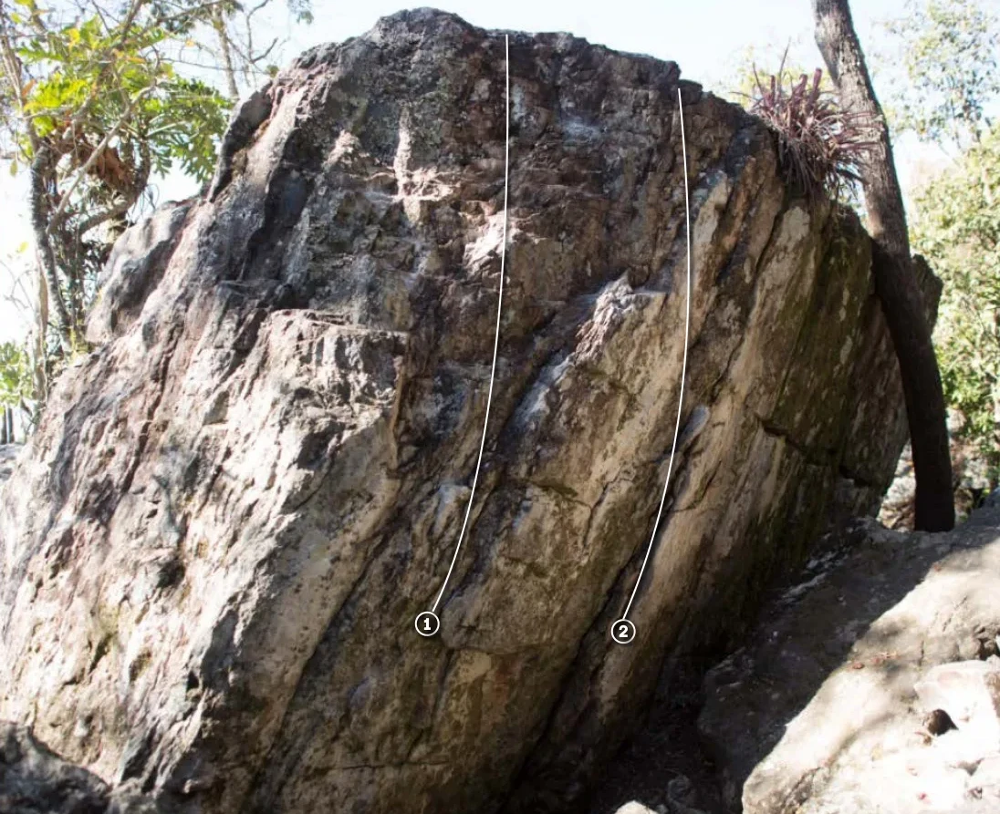
    - **largura_mapa**: 1096
    - **altura_mapa**: 893
    - **pontos_de_interesse**:
      - **[0]**:
        - **id**: 01
        - **label**: 01
        - **box**:
          - **x**: 467
          - **y**: 684
          - **comprimento**: 20
          - **largura**: 20
      - **[1]**:
        - **id**: 02
        - **label**: 02
        - **box**:
          - **x**: 682
          - **y**: 692
          - **comprimento**: 27
          - **largura**: 29
    - **referencias**:
      - **[0]**:
        - **escalada**: Canarim
        - **ids**:
          - 01
      - **[1]**:
        - **escalada**: Sabiá
        - **ids**:
          - 02
  - **[1]**:
    - **caminho_imagem_mapa**: 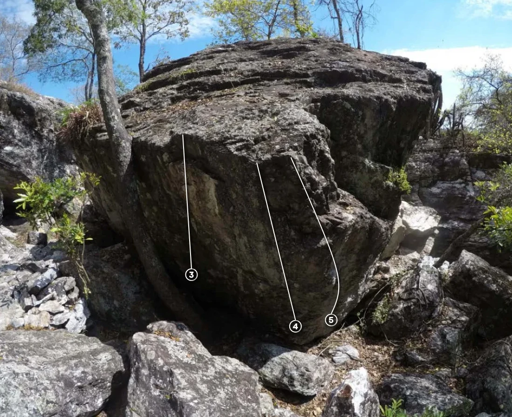
    - **largura_mapa**: 1099
    - **altura_mapa**: 895
    - **pontos_de_interesse**:
      - **[0]**:
        - **id**: 03
        - **label**: 03
        - **box**:
          - **x**: 410
          - **y**: 589
          - **comprimento**: 20
          - **largura**: 20
      - **[1]**:
        - **id**: 04
        - **label**: 04
        - **box**:
          - **x**: 635
          - **y**: 700
          - **comprimento**: 20
          - **largura**: 20
      - **[2]**:
        - **id**: 05
        - **label**: 05
        - **box**:
          - **x**: 710
          - **y**: 687
          - **comprimento**: 20
          - **largura**: 20
    - **referencias**:
      - **[0]**:
        - **escalada**: Consciência Limpa
        - **ids**:
          - 03
      - **[1]**:
        - **escalada**: Consciência
        - **ids**:
          - 04
      - **[2]**:
        - **escalada**: Mulheres Poderosas
        - **ids**:
          - 05
- **escaladas**:
  - **[0]**:
    - **boulder**:
      - **descricao**: Saída agachado em regletes bons e segue reto.
      - **nome**: Canarim
      - **dificuldade**: V2
  - **[1]**:
    - **boulder**:
      - **descricao**: Saída agachado com as duas mãos em agarras boas laterais e vira a esquerda da planta.
      - **nome**: Sabiá
      - **dificuldade**: V1
  - **[2]**:
    - **boulder**:
      - **descricao**: Saída sentado com mão direita em reglete lateral branco e esquerda proximo as pedras .
      - **nome**: Consciência Limpa
      - **dificuldade**: V2
  - **[3]**:
    - **boulder**:
      - **descricao**: Saída agachado com as mãos juntas em batente baixo e segue reto pela aresta.
      - **nome**: Consciência
      - **dificuldade**: V1
  - **[4]**:
    - **boulder**:
      - **descricao**: Saída agachado com mão direita em agarra lateral e esquerda na aresta.
      - **nome**: Mulheres Poderosas
      - **dificuldade**: V2

## Parte: setor_haiti

### Setor (Pico: Bocaina Park)

- **descricao**: # Setor Haiti
- **nome**: Haiti
- **mapas**:
  - **[0]**:
    - **caminho_imagem_mapa**: 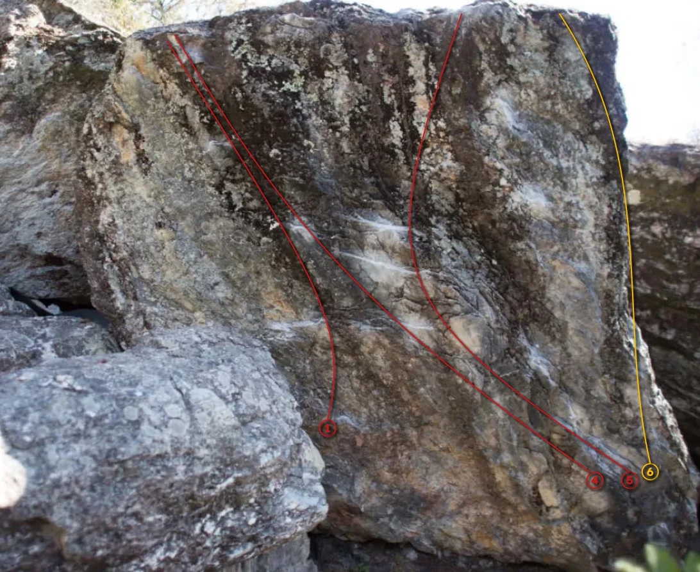
    - **largura_mapa**: 1092
    - **altura_mapa**: 893
    - **pontos_de_interesse**:
      - **[0]**:
        - **id**: 01
        - **label**: 01
        - **box**:
          - **x**: 511
          - **y**: 668
          - **comprimento**: 20
          - **largura**: 20
      - **[1]**:
        - **id**: 04
        - **label**: 04
        - **box**:
          - **x**: 928
          - **y**: 750
          - **comprimento**: 20
          - **largura**: 20
      - **[2]**:
        - **id**: 05
        - **label**: 05
        - **box**:
          - **x**: 982
          - **y**: 750
          - **comprimento**: 20
          - **largura**: 20
      - **[3]**:
        - **id**: 06
        - **label**: 06
        - **box**:
          - **x**: 1015
          - **y**: 735
          - **comprimento**: 20
          - **largura**: 20
    - **referencias**:
      - **[0]**:
        - **escalada**: Jamaica Abaixo de Zero
        - **ids**:
          - 01
      - **[1]**:
        - **escalada**: Taiti
        - **ids**:
          - 04
      - **[2]**:
        - **escalada**: Haiti
        - **ids**:
          - 05
      - **[3]**:
        - **escalada**: Nem Lá, Nem Cá
        - **ids**:
          - 06
- **escaladas**:
  - **[0]**:
    - **boulder**:
      - **descricao**: Saída sentado com a mão esquerda em reglete e direita em batente pequeno, seguindo reto virando no Taiti.
      - **nome**: Jamaica Abaixo de Zero
      - **dificuldade**: V7
  - **[1]**:
    - **boulder**:
      - **descricao**: Saída do Jamaica Abaixo de Zero seguindo para direita virando no Haiti.
      - **nome**: Jamaica
      - **dificuldade**: V6
  - **[2]**:
    - **boulder**:
      - **descricao**: Saída do Jamaica Abaixo de Zero, virando à esquerda do Taiti.
      - **nome**: Kuaiti
      - **dificuldade**: V8
  - **[3]**:
    - **boulder**:
      - **descricao**: Saída sentado com as mãos juntas em batente grande seguindo para batentes lisos e virando a esquerda no bloco.
      - **nome**: Taiti
      - **dificuldade**: V7
  - **[4]**:
    - **boulder**:
      - **descricao**: Mesma saída do Taíti seguindo a esquerda até batentes escorrido e virando reto.
      - **nome**: Haiti
      - **dificuldade**: V7
  - **[5]**:
    - **boulder**:
      - **descricao**: Mesma saída do Haíti seguindo pela aresta em regletes laterais e virando reto.
      - **nome**: Nem Lá, Nem Cá
      - **dificuldade**: V5

## Parte: setor_achados_e_perdidos

### Setor (Pico: Bocaina Park)

- **descricao**: # Setor Achados e Perdidos
- **nome**: Achados e Perdidos
- **mapas**:
  - **[0]**:
    - **caminho_imagem_mapa**: 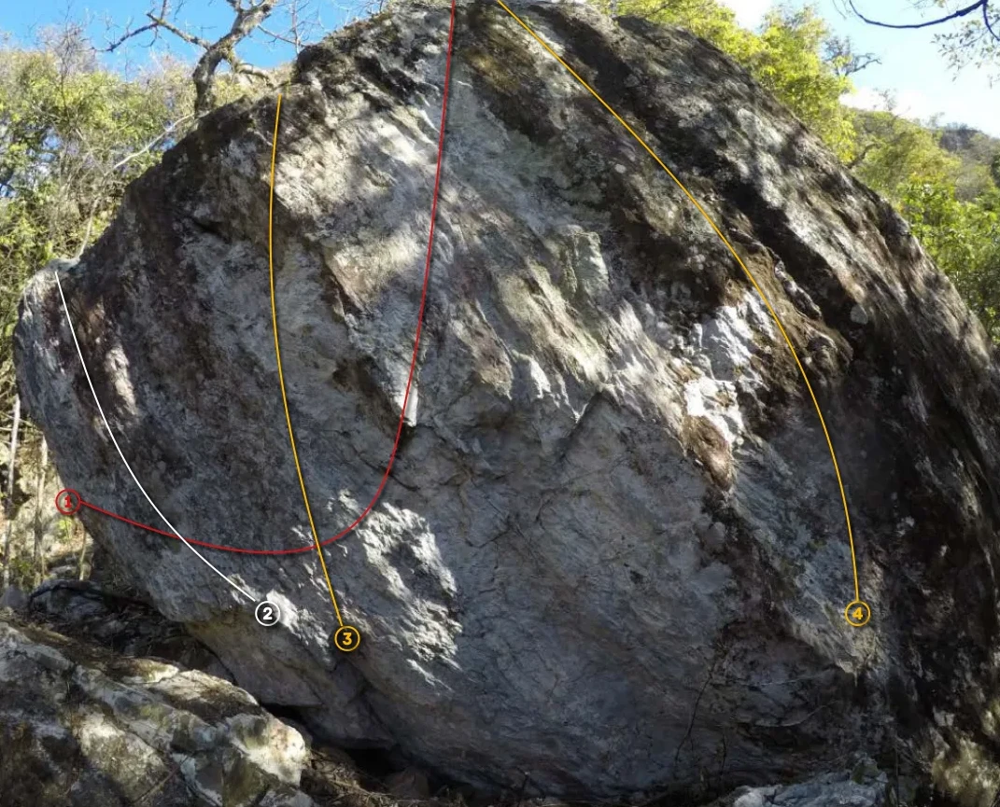
    - **largura_mapa**: 1071
    - **altura_mapa**: 865
    - **pontos_de_interesse**:
      - **[0]**:
        - **id**: 01
        - **label**: 01
        - **box**:
          - **x**: 71
          - **y**: 537
          - **comprimento**: 24
          - **largura**: 24
      - **[1]**:
        - **id**: 02
        - **label**: 02
        - **box**:
          - **x**: 286
          - **y**: 656
          - **comprimento**: 28
          - **largura**: 32
      - **[2]**:
        - **id**: 03
        - **label**: 03
        - **box**:
          - **x**: 370
          - **y**: 686
          - **comprimento**: 28
          - **largura**: 32
      - **[3]**:
        - **id**: 04
        - **label**: 04
        - **box**:
          - **x**: 919
          - **y**: 659
          - **comprimento**: 30
          - **largura**: 30
    - **referencias**:
      - **[0]**:
        - **escalada**: Fala Comigo
        - **ids**:
          - 01
      - **[1]**:
        - **escalada**: Tendinite No More
        - **ids**:
          - 02
      - **[2]**:
        - **escalada**: Atitude no Trecho
        - **ids**:
          - 03
      - **[3]**:
        - **escalada**: Achados e Perdidos
        - **ids**:
          - 04
- **escaladas**:
  - **[0]**:
    - **boulder**:
      - **descricao**: saida agachado com as mãos em agarrao a esquerda do bloco e faz uma travessia para direita e vira no centro do bloco no boulder atitude no trecho.
      - **nome**: Fala Comigo
      - **dificuldade**: V6
  - **[1]**:
    - **boulder**:
      - **descricao**: Saida do atitude no trecho e segue para esquerda.
      - **nome**: Tendinite No More
      - **dificuldade**: V2
  - **[2]**:
    - **boulder**:
      - **descricao**: saida agachado com as duas maos juntas em um cristal e segue reto (no meio do bloco).
      - **nome**: Atitude no Trecho
      - **dificuldade**: V3
  - **[3]**:
    - **boulder**:
      - **descricao**: Saida em pé a direita do bloco com mão direita em pinça escorrida e esquerda de balcão no equilibrio e segue pela esquerda.
      - **nome**: Achados e Perdidos
      - **dificuldade**: V3

## Parte: setor_bloco_do_rock_bocaina

### Setor (Pico: Bocaina Park)

- **descricao**: # Setor Bloco do Rock Bocaina
- **nome**: Bloco do Rock Bocaina
- **mapas**:
  - **[0]**:
    - **caminho_imagem_mapa**: 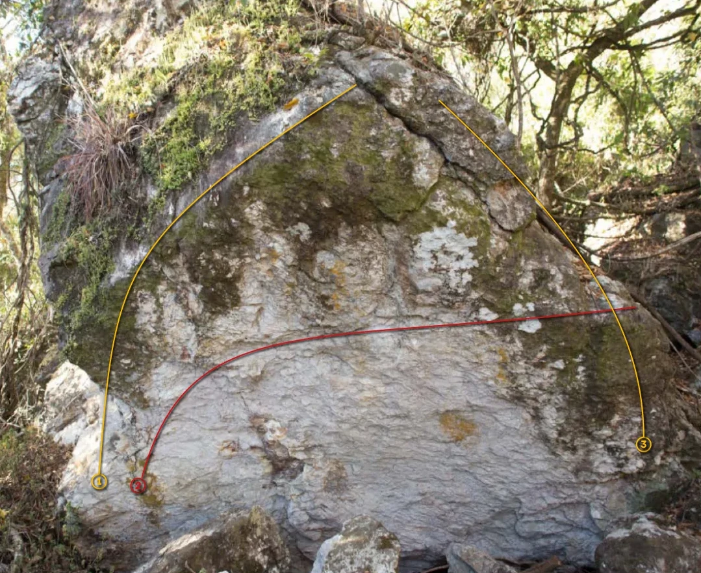
    - **largura_mapa**: 1079
    - **altura_mapa**: 883
    - **pontos_de_interesse**:
      - **[0]**:
        - **id**: 01
        - **label**: 01
        - **box**:
          - **x**: 151
          - **y**: 742
          - **comprimento**: 20
          - **largura**: 20
      - **[1]**:
        - **id**: 02
        - **label**: 02
        - **box**:
          - **x**: 212
          - **y**: 748
          - **comprimento**: 20
          - **largura**: 20
      - **[2]**:
        - **id**: 03
        - **label**: 03
        - **box**:
          - **x**: 991
          - **y**: 684
          - **comprimento**: 20
          - **largura**: 20
    - **referencias**:
      - **[0]**:
        - **escalada**: Açaí Bocaina
        - **ids**:
          - 01
      - **[1]**:
        - **escalada**: Rock Bocaina
        - **ids**:
          - 02
      - **[2]**:
        - **escalada**: Dedão de Aquiles
        - **ids**:
          - 03
- **escaladas**:
  - **[0]**:
    - **boulder**:
      - **descricao**: Saida em pé a esquerda do bloco com as mãos em agarrões e segue a aresta por cima virando no centro do bloco.
      - **nome**: Açaí Bocaina
      - **dificuldade**: V5
  - **[1]**:
    - **boulder**:
      - **descricao**: Saida do acai bocaina, e segue travessia para direita por baixo dominando no final .
      - **nome**: Rock Bocaina
      - **dificuldade**: V8
  - **[2]**:
    - **boulder**:
      - **descricao**: Saída da aresta a direita do bloco e vai arestando até o topo.
      - **nome**: Dedão de Aquiles
      - **dificuldade**: V3

## Parte: setor_bloco_45

### Setor (Pico: Bocaina Park)

- **descricao**: # Setor Bloco 45º
- **nome**: Bloco 45º
- **mapas**:
  - **[0]**:
    - **caminho_imagem_mapa**: 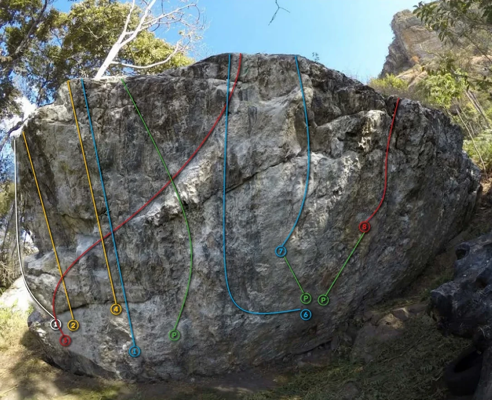
    - **largura_mapa**: 1084
    - **altura_mapa**: 883
    - **pontos_de_interesse**:
      - **[0]**:
        - **id**: 01
        - **label**: 01
        - **box**:
          - **x**: 122
          - **y**: 717
          - **comprimento**: 20
          - **largura**: 20
      - **[1]**:
        - **id**: 02
        - **label**: 02
        - **box**:
          - **x**: 161
          - **y**: 718
          - **comprimento**: 20
          - **largura**: 20
      - **[2]**:
        - **id**: 03
        - **label**: 03
        - **box**:
          - **x**: 141
          - **y**: 752
          - **comprimento**: 20
          - **largura**: 20
      - **[3]**:
        - **id**: 04
        - **label**: 04
        - **box**:
          - **x**: 254
          - **y**: 682
          - **comprimento**: 20
          - **largura**: 20
      - **[4]**:
        - **id**: 05
        - **label**: 05
        - **box**:
          - **x**: 296
          - **y**: 775
          - **comprimento**: 20
          - **largura**: 20
      - **[5]**:
        - **id**: 06
        - **label**: 06
        - **box**:
          - **x**: 682
          - **y**: 580
          - **comprimento**: 20
          - **largura**: 20
      - **[6]**:
        - **id**: 07
        - **label**: 07
        - **box**:
          - **x**: 618
          - **y**: 554
          - **comprimento**: 20
          - **largura**: 20
      - **[7]**:
        - **id**: 08
        - **label**: 08
        - **box**:
          - **x**: 803
          - **y**: 501
          - **comprimento**: 20
          - **largura**: 20
      - **[8]**:
        - **id**: P1
        - **label**: P
        - **box**:
          - **x**: 384
          - **y**: 740
          - **comprimento**: 20
          - **largura**: 20
      - **[9]**:
        - **id**: P2
        - **label**: P
        - **box**:
          - **x**: 675
          - **y**: 659
          - **comprimento**: 20
          - **largura**: 20
      - **[10]**:
        - **id**: P3
        - **label**: P
        - **box**:
          - **x**: 714
          - **y**: 662
          - **comprimento**: 20
          - **largura**: 20
      - **[11]**:
        - **id**: 06
        - **label**: 06
        - **box**:
          - **x**: 674
          - **y**: 693
          - **comprimento**: 23
          - **largura**: 26
    - **referencias**:
      - **[0]**:
        - **escalada**: Esquina do Gueto
        - **ids**:
          - 01
      - **[1]**:
        - **escalada**: Bem-Vindo
        - **ids**:
          - 02
      - **[2]**:
        - **escalada**: Siri Cascudo
        - **ids**:
          - 03
      - **[3]**:
        - **escalada**: Índios
        - **ids**:
          - 04
      - **[4]**:
        - **escalada**: Índios SDS
        - **ids**:
          - 05
      - **[5]**:
        - **escalada**: Família Bocaina
        - **ids**:
          - 06
      - **[6]**:
        - **escalada**: Sananga
        - **ids**:
          - 07
      - **[7]**:
        - **escalada**: Espírito San
        - **ids**:
          - 08
  - **[1]**:
    - **caminho_imagem_mapa**: 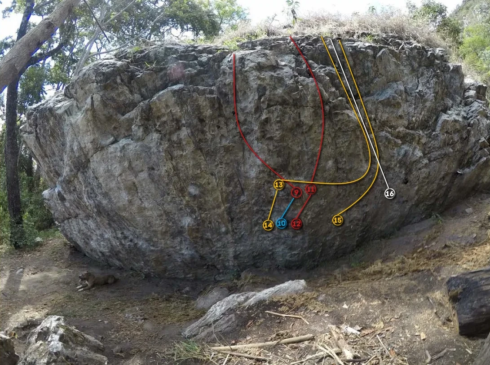
    - **largura_mapa**: 1091
    - **altura_mapa**: 813
    - **pontos_de_interesse**:
      - **[0]**:
        - **id**: 09
        - **label**: 09
        - **box**:
          - **x**: 660
          - **y**: 428
          - **comprimento**: 20
          - **largura**: 20
      - **[1]**:
        - **id**: 10
        - **label**: 10
        - **box**:
          - **x**: 626
          - **y**: 497
          - **comprimento**: 20
          - **largura**: 20
      - **[2]**:
        - **id**: 11
        - **label**: 11
        - **box**:
          - **x**: 691
          - **y**: 420
          - **comprimento**: 20
          - **largura**: 20
      - **[3]**:
        - **id**: 12
        - **label**: 12
        - **box**:
          - **x**: 659
          - **y**: 498
          - **comprimento**: 20
          - **largura**: 20
      - **[4]**:
        - **id**: 13
        - **label**: 13
        - **box**:
          - **x**: 619
          - **y**: 410
          - **comprimento**: 20
          - **largura**: 20
      - **[5]**:
        - **id**: 14
        - **label**: 14
        - **box**:
          - **x**: 597
          - **y**: 501
          - **comprimento**: 20
          - **largura**: 20
      - **[6]**:
        - **id**: 15
        - **label**: 15
        - **box**:
          - **x**: 751
          - **y**: 491
          - **comprimento**: 20
          - **largura**: 20
      - **[7]**:
        - **id**: 16
        - **label**: 16
        - **box**:
          - **x**: 867
          - **y**: 430
          - **comprimento**: 20
          - **largura**: 20
    - **referencias**:
      - **[0]**:
        - **escalada**: Tiro ao Alvo
        - **ids**:
          - 09
      - **[1]**:
        - **escalada**: Tiro ao Alvo SDS
        - **ids**:
          - 10
      - **[2]**:
        - **escalada**: Mão na Massa
        - **ids**:
          - 11
      - **[3]**:
        - **escalada**: Mão na Massa SDS
        - **ids**:
          - 12
      - **[4]**:
        - **escalada**: Bicho de Pé
        - **ids**:
          - 13
      - **[5]**:
        - **escalada**: Bicho de Pé SDS
        - **ids**:
          - 14
      - **[6]**:
        - **escalada**: Curto e Gross
        - **ids**:
          - 15
      - **[7]**:
        - **escalada**: Carvoeiro
        - **ids**:
          - 16
  - **[2]**:
    - **caminho_imagem_mapa**: 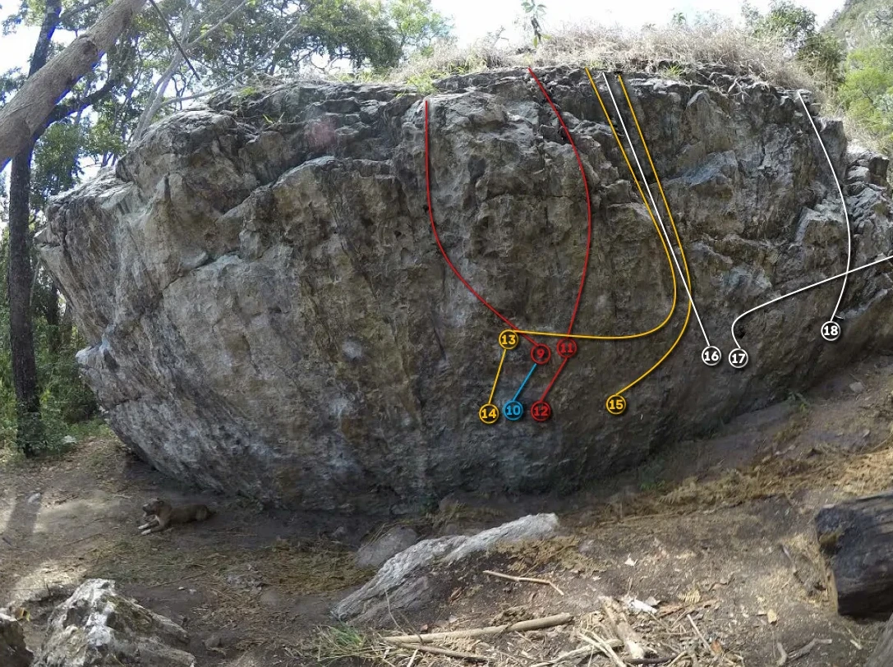
    - **largura_mapa**: 1087
    - **altura_mapa**: 812
    - **pontos_de_interesse**:
      - **[0]**:
        - **id**: 09
        - **label**: 09
        - **box**:
          - **x**: 656
          - **y**: 430
          - **comprimento**: 20
          - **largura**: 20
      - **[1]**:
        - **id**: 10
        - **label**: 10
        - **box**:
          - **x**: 623
          - **y**: 498
          - **comprimento**: 20
          - **largura**: 20
      - **[2]**:
        - **id**: 11
        - **label**: 11
        - **box**:
          - **x**: 689
          - **y**: 422
          - **comprimento**: 20
          - **largura**: 20
      - **[3]**:
        - **id**: 12
        - **label**: 12
        - **box**:
          - **x**: 656
          - **y**: 500
          - **comprimento**: 20
          - **largura**: 20
      - **[4]**:
        - **id**: 13
        - **label**: 13
        - **box**:
          - **x**: 618
          - **y**: 414
          - **comprimento**: 20
          - **largura**: 20
      - **[5]**:
        - **id**: 14
        - **label**: 14
        - **box**:
          - **x**: 594
          - **y**: 503
          - **comprimento**: 20
          - **largura**: 20
      - **[6]**:
        - **id**: 15
        - **label**: 15
        - **box**:
          - **x**: 748
          - **y**: 492
          - **comprimento**: 20
          - **largura**: 20
      - **[7]**:
        - **id**: 16
        - **label**: 16
        - **box**:
          - **x**: 865
          - **y**: 432
          - **comprimento**: 20
          - **largura**: 20
      - **[8]**:
        - **id**: 17
        - **label**: 17
        - **box**:
          - **x**: 899
          - **y**: 435
          - **comprimento**: 20
          - **largura**: 20
      - **[9]**:
        - **id**: 18
        - **label**: 18
        - **box**:
          - **x**: 1012
          - **y**: 402
          - **comprimento**: 20
          - **largura**: 20
    - **referencias**:
      - **[0]**:
        - **escalada**: Tiro ao Alvo
        - **ids**:
          - 09
      - **[1]**:
        - **escalada**: Tiro ao Alvo SDS
        - **ids**:
          - 10
      - **[2]**:
        - **escalada**: Mão na Massa
        - **ids**:
          - 11
      - **[3]**:
        - **escalada**: Mão na Massa SDS
        - **ids**:
          - 12
      - **[4]**:
        - **escalada**: Bicho de Pé
        - **ids**:
          - 13
      - **[5]**:
        - **escalada**: Bicho de Pé SDS
        - **ids**:
          - 14
      - **[6]**:
        - **escalada**: Curto e Gross
        - **ids**:
          - 15
      - **[7]**:
        - **escalada**: Carvoeiro
        - **ids**:
          - 16
      - **[8]**:
        - **escalada**: Kadron
        - **ids**:
          - 17
      - **[9]**:
        - **escalada**: Saída pela Culatra
        - **ids**:
          - 18
- **escaladas**:
  - **[0]**:
    - **boulder**:
      - **descricao**: Saída do bem vindo e entra para a face da esquerda da pedra, virando por ela.
      - **nome**: Esquina do Gueto
      - **dificuldade**: V2
  - **[1]**:
    - **boulder**:
      - **descricao**: Saída sentado com as mãos em dois bicos baixos, a esquerda do bloco, segue reto.
      - **nome**: Bem-Vindo
      - **dificuldade**: V4
  - **[2]**:
    - **boulder**:
      - **descricao**: Saída do bem vindo, virando no Família Bocaina.
      - **nome**: Siri Cascudo
      - **dificuldade**: V6
  - **[3]**:
    - **boulder**:
      - **descricao**: Saída do bem vindo,seguindo batente ou fenda horizontal bem marcada, virando no tiro ao alvo.
      - **nome**: Índios
      - **dificuldade**: V5
  - **[4]**:
    - **boulder**:
      - **descricao**: Saída sentado com mão direita em reglete pequeno e calcanhar esquerdo na mão esquerda em agarrao, segue reto, passando pelo reglete da fenda vertical.
      - **nome**: Índios SDS
      - **dificuldade**: V9
  - **[5]**:
    - **boulder**:
      - **descricao**: Saída sentado com a mão direita em reglete bom e esquerda junta na mesma agarra, saindo para uma agarra de ombro de esquerda.
      - **nome**: Família Bocaina
      - **dificuldade**: V10
  - **[6]**:
    - **boulder**:
      - **descricao**: Saída em pé com as mãos em regletes invertidos.
      - **nome**: Sananga
      - **dificuldade**: V9
  - **[7]**:
    - **boulder**:
      - **descricao**: Saída em pé com a mão esquerda em reglete pequeno e mão direita em mono dedo.
      - **nome**: Espírito San
      - **dificuldade**: V8_BARRA_V9
  - **[8]**:
    - **boulder**:
      - **descricao**: Saída agachado com mão esquerda em um buraco abaulado e mão esquerda em reglete ruim.
      - **nome**: Tiro ao Alvo
      - **dificuldade**: V8
  - **[9]**:
    - **boulder**:
      - **descricao**: Saída sentado com mão esquerda em reglete pequeno e direita em reglete liso com o pÉ esquerdo alto.
      - **nome**: Tiro ao Alvo SDS
      - **dificuldade**: V10
  - **[10]**:
    - **boulder**:
      - **descricao**: Mesma agarra de saida do tiro ao alvo e vai pra direita.
      - **nome**: Mão na Massa
      - **dificuldade**: V7
  - **[11]**:
    - **boulder**:
      - **descricao**: Saida do tiro ao alvo SDS e vai pra direita.
      - **nome**: Mão na Massa SDS
      - **dificuldade**: V8
  - **[12]**:
    - **boulder**:
      - **descricao**: Mesma saida do tiro ao alvo a vai pra direita por baixo e vira no carvoeiro.
      - **nome**: Bicho de Pé
      - **dificuldade**: V5
  - **[13]**:
    - **boulder**:
      - **descricao**: Saida do tiro ao alvo SDS e vira no carvoeiro.
      - **nome**: Bicho de Pé SDS
      - **dificuldade**: V6
  - **[14]**:
    - **boulder**:
      - **descricao**: SaÍdA sentado com as duas mãos juntas em reglete batente ruim e pés ruins.
      - **nome**: Curto e Gross
      - **dificuldade**: V4
  - **[15]**:
    - **boulder**:
      - **descricao**: SaÍda agachado com as mãos em dois agarroes e segue em fenda diagonal pra esquerda em agarroes.
      - **nome**: Carvoeiro
      - **dificuldade**: V1
  - **[16]**:
    - **boulder**:
      - **descricao**: Saída do carvoeiro e faz travessia para direita contornando o bloco.
      - **nome**: Kadron
      - **dificuldade**: V3
  - **[17]**:
    - **boulder**:
      - **descricao**: Sai sentado com as mãos em agarrao a direita do bloco e segue reto.
      - **nome**: Saída pela Culatra
      - **dificuldade**: V2
  - **[18]**:
    - **boulder**:
      - **descricao**: Saída do bem vindo e virando no índios.
      - **nome**: Siri sem Casca
      - **dificuldade**: V6
  - **[19]**:
    - **boulder**:
      - **descricao**: Saída do bem vindo,seguindo batente ou fenda horizontal bem marcada, virando no tiro ao alvo.
      - **nome**: Siri Queijo
      - **dificuldade**: V7
  - **[20]**:
    - **boulder**:
      - **descricao**: Saída com a mão esquerda em escama na fenda, mão direita em agarrão baixo com calcanhar esquerdo na altura da mão esquerda, virando no Siri queijo.
      - **nome**: Problema Legal
      - **dificuldade**: V7
  - **[21]**:
    - **boulder**:
      - **descricao**: Saída do sananga virando no Família Bocaina.
      - **nome**: Pecado de Chó
      - **dificuldade**: V10_BARRA_V11
  - **[22]**:
    - **boulder**:
      - **descricao**: Saída do sananga virando no indios.
      - **nome**: Ayuaska
      - **dificuldade**: V11

## Parte: setor_essencia

### Setor (Pico: Bocaina Park)

- **descricao**: # Setor Essência
- **nome**: Essência
- **mapas**:
  - **[0]**:
    - **caminho_imagem_mapa**: 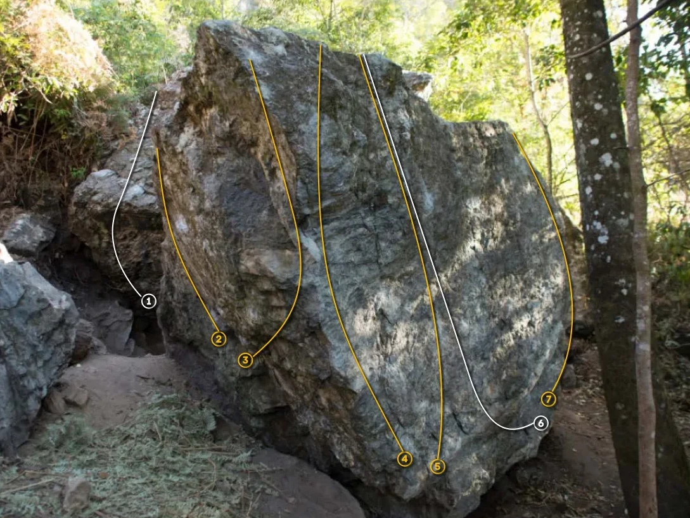
    - **largura_mapa**: 1089
    - **altura_mapa**: 818
    - **pontos_de_interesse**:
      - **[0]**:
        - **id**: 01
        - **label**: 01
        - **box**:
          - **x**: 234
          - **y**: 475
          - **comprimento**: 20
          - **largura**: 20
      - **[1]**:
        - **id**: 02
        - **label**: 02
        - **box**:
          - **x**: 345
          - **y**: 535
          - **comprimento**: 20
          - **largura**: 20
      - **[2]**:
        - **id**: 03
        - **label**: 03
        - **box**:
          - **x**: 387
          - **y**: 567
          - **comprimento**: 20
          - **largura**: 20
      - **[3]**:
        - **id**: 04
        - **label**: 04
        - **box**:
          - **x**: 638
          - **y**: 724
          - **comprimento**: 20
          - **largura**: 20
      - **[4]**:
        - **id**: 05
        - **label**: 05
        - **box**:
          - **x**: 689
          - **y**: 737
          - **comprimento**: 20
          - **largura**: 20
      - **[5]**:
        - **id**: 06
        - **label**: 06
        - **box**:
          - **x**: 853
          - **y**: 668
          - **comprimento**: 20
          - **largura**: 20
      - **[6]**:
        - **id**: 07
        - **label**: 07
        - **box**:
          - **x**: 866
          - **y**: 630
          - **comprimento**: 20
          - **largura**: 20
    - **referencias**:
      - **[0]**:
        - **escalada**: Agricultor
        - **ids**:
          - 01
      - **[1]**:
        - **escalada**: Garimpeiro
        - **ids**:
          - 02
      - **[2]**:
        - **escalada**: A Regra é Clara
        - **ids**:
          - 03
      - **[3]**:
        - **escalada**: Essência
        - **ids**:
          - 04
      - **[4]**:
        - **escalada**: Indecência
        - **ids**:
          - 05
      - **[5]**:
        - **escalada**: Regra do Jogo
        - **ids**:
          - 06
      - **[6]**:
        - **escalada**: Carta de Euforia
        - **ids**:
          - 07
  - **[1]**:
    - **caminho_imagem_mapa**: 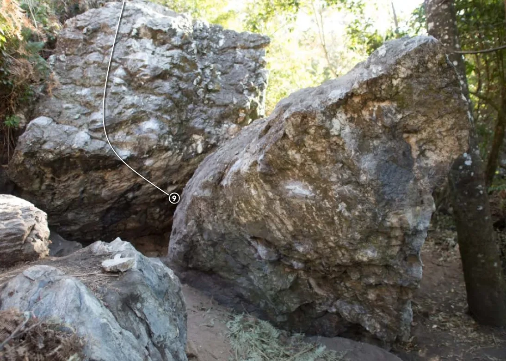
    - **largura_mapa**: 1094
    - **altura_mapa**: 782
    - **pontos_de_interesse**:
      - **[0]**:
        - **id**: 09
        - **label**: 09
        - **box**:
          - **x**: 376
          - **y**: 428
          - **comprimento**: 20
          - **largura**: 20
    - **referencias**:
      - **[0]**:
        - **escalada**: Jardim de Infância
        - **ids**:
          - 09
- **escaladas**:
  - **[0]**:
    - **boulder**:
      - **nome**: Agricultor
      - **dificuldade**: V2
  - **[1]**:
    - **boulder**:
      - **nome**: Garimpeiro
      - **dificuldade**: V4
  - **[2]**:
    - **boulder**:
      - **nome**: A Regra é Clara
      - **dificuldade**: V5
  - **[3]**:
    - **boulder**:
      - **nome**: Essência
      - **dificuldade**: V4
  - **[4]**:
    - **boulder**:
      - **nome**: Indecência
      - **dificuldade**: V3
  - **[5]**:
    - **boulder**:
      - **nome**: Regra do Jogo
      - **dificuldade**: V1
  - **[6]**:
    - **boulder**:
      - **nome**: Carta de Euforia
      - **dificuldade**: V5
  - **[7]**:
    - **boulder**:
      - **nome**: Escravos de Chó
      - **dificuldade**: V5
  - **[8]**:
    - **boulder**:
      - **nome**: Jardim de Infância
      - **dificuldade**: V0

## Arquivos Externos

- **arquivos_externos**:
  - **[0]**:
    - **caminho**: 
    - **checksum_sha256**: 876d52af193b9aadf5833b3a748c7c6ac3f4f57631f39749daaa47d5a8e71ef2
  - **[1]**:
    - **caminho**: 
    - **checksum_sha256**: e9ac224fda1d7cf8e792bc1859fc9aba4ee721d71398d9c1792ed86c7b142b7c
  - **[2]**:
    - **caminho**: 
    - **checksum_sha256**: d333f58ec0010a57de784baa91d231833de81323abedec2c54bf4f9566e1de24
  - **[3]**:
    - **caminho**: 
    - **checksum_sha256**: 3b8752d7f0ee00f80c90f83a576799315400d96996f4b464402e1e1c938f79fa
  - **[4]**:
    - **caminho**: 
    - **checksum_sha256**: 41d74ca78c31aa861890c4104f7f65c988a1cb3061f72d678358e348e70bcb51
  - **[5]**:
    - **caminho**: 
    - **checksum_sha256**: 4e9ccc5d0b2792720981d62ea3c1dbd5f5840a915c1fea933edd9e84a9243c3e
  - **[6]**:
    - **caminho**: 
    - **checksum_sha256**: b30c59fd4667ea8792d1f11c7108d9ea6c04b76ab2ea22c6d1b7e289b6b13bb3
  - **[7]**:
    - **caminho**: 
    - **checksum_sha256**: ae675d48b1ea8f4953b0fe6067d624b890450ee2e981a1c504c1b639da319883
  - **[8]**:
    - **caminho**: 
    - **checksum_sha256**: 77ee9abe8f0628e9bf29a1f06474591bf38f4da5996ccb44d55067a9d3f6ba1f
  - **[9]**:
    - **caminho**: 
    - **checksum_sha256**: 4c6ad1be7e6da9820a0639a6076dddcbd9268e20c1c7b38cea3ef513943c930e
  - **[10]**:
    - **caminho**: 
    - **checksum_sha256**: 0d05e6dc8dd0e2980afd81c9a33f841784ee4398e13beec6c0d66dfbea68643f
  - **[11]**:
    - **caminho**: 
    - **checksum_sha256**: c20cf1f1d2d2588dbf97275ff4a4e5d3e07f5dcf1220f9a6e15464eefe552648
  - **[12]**:
    - **caminho**: 
    - **checksum_sha256**: 2caf89fe141b601c6a869c904738e11f5e6761656dc734c6b8c47b05813db1cf
  - **[13]**:
    - **caminho**: 
    - **checksum_sha256**: 4645a2f03197c1930d162791e335452609908fa445d148f80e77be93a50e2a8b
  - **[14]**:
    - **caminho**: 
    - **checksum_sha256**: c8cb23c9f352ed1dbcebbd73524d972b33678daf4faf7b399e0947528183ca84
  - **[15]**:
    - **caminho**: 
    - **checksum_sha256**: 4d6f5dc5c2f89c3e80a563f9e1b5b16c3aa1a2eb4c646e89c834a2617ea28293
  - **[16]**:
    - **caminho**: 
    - **checksum_sha256**: f2002f3bc7c8585ac0058a407a1fe47acda677a3ec8befe85607c11a328ec3e2
  - **[17]**:
    - **caminho**: 
    - **checksum_sha256**: bd9a055e34d2ca2385289bd1b1a4ffff6b44386d3ba90710f3a700eac77a250f
  - **[18]**:
    - **caminho**: 
    - **checksum_sha256**: 182f574fc1e74ae824650f715e1a04cb2f1c414b0352908b2682499a91d913a3
  - **[19]**:
    - **caminho**: 
    - **checksum_sha256**: e2257b4c10d50b1a11f52024bbb8bcb393c9549ba95012b866992cc52ff33017
  - **[20]**:
    - **caminho**: 
    - **checksum_sha256**: d8cbf304004986d81ba7d05ddd4f1003e5a0672ea73bb53fdfc47bbbb29a7909
  - **[21]**:
    - **caminho**: 
    - **checksum_sha256**: b2284df0aa2a3f5ec344615ac5b1ebefc6f9c8a355ca51d1797b18336577ebd7
  - **[22]**:
    - **caminho**: 
    - **checksum_sha256**: 644a501a99b3fced3f941daf092b1563140823295109f7a2a157bfe7ec8ac93d
  - **[23]**:
    - **caminho**: 
    - **checksum_sha256**: 344fa4b4172f51c3778b6a8bb3ef82849e5b7a6f4a62e7299c0661217e64d752
  - **[24]**:
    - **caminho**: 
    - **checksum_sha256**: c894c3ad16831449a17c6e2481b7ba12b7b751abe7cff82f1b0fa483bcb2f837

