# Croqui: Guia de Boulders - Bocaina Park

## Informações Gerais

- **descricao**: O Bocaina Park é um parque particular de esportes, lazer e bem estar localizado a 30 km do de Araxá aos pés da serra da Bocaina.
- **id**: br_mg_araxa_bocaina_boulders
- **nome**: Guia de Boulders - Bocaina Park
- **uid**: oyCb72FtUENKNi
- **caminho_thumbnail**: 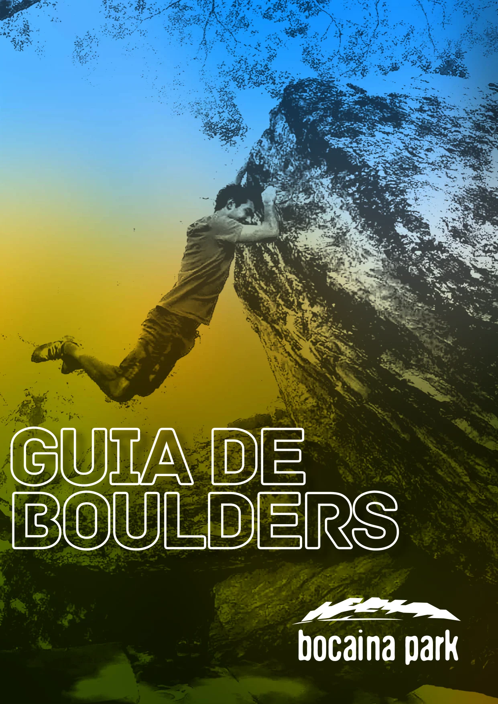
- **revisado_manualmente**: True
- **status_desenho_extraivel**: DESENHO_EXTRAIDO
- **botoes**:
  - **[0]**:
    - **uid**: jipETxRq7lw3JK
    - **texto**: Capa
    - **destino**:
      - **secao_textual**:
        - **conteudo**:
            # Guia de Boulders - Bocaina Park
            
            |  |
            | :--: |
            | *Capa* |
  - **[1]**:
    - **uid**: V5bQX9wsAGCEVP
    - **texto**: Patrocinadores
    - **destino**:
      - **secao_textual**:
        - **conteudo**:
            # Patrocínio e Apoio
            
            | 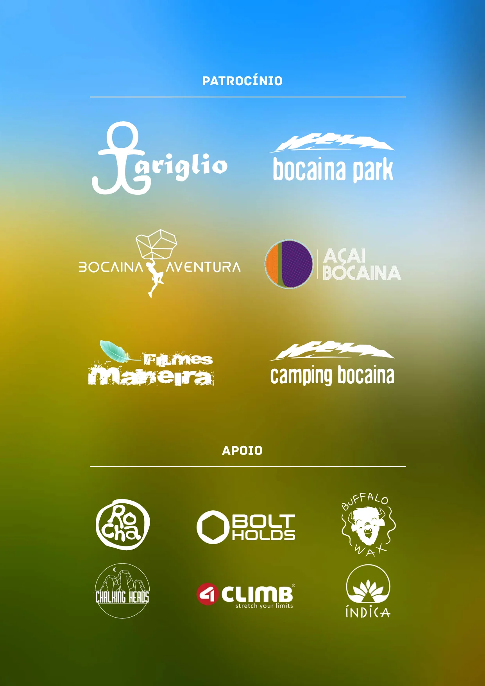 |
            | :--: |
            | *Patrocinadores* |
  - **[2]**:
    - **uid**: 6yo0LWv0gVeMFC
    - **texto**: Introdução
    - **destino**:
      - **secao_textual**:
        - **conteudo**:
            # Introdução
            
            O **Bocaina Park** é um parque particular de esportes, lazer e bem estar que esta localizado a 30 km do centro de Araxá aos pés da serra da Bocaina. Ele nasceu de um sonho e da união de amigos escaladores locais que começaram o desenvolvimento do lugar há cerca de 15 anos conquistando as primeiras vias e setores de escalada, e viabilizando o acesso através de trilhas de acesso e uma boa convivência com a comunidade local, e ao mesmo tempo realizando um trabalho de reflorestamento e preservação da fauna e flora em conjunto com uma conscientização dos visitantes.
            
            Foi criado para atuar no desenvolvimento de esportes de montanha na serra da Bocaina com a pratica de atividades conscientes nos meios naturais e fortalecendo o turismo de esportes de montanha na cidade através com eventos de qualidade, canais de comunicação eficientes, promovendo saúde e sustentabilidade, que após um trabalho de estruturação e viabilização podem ser praticados diversos esportes e atividades de montanha como: Escalada, Highline, corrida, caminhadas, montain bike, voo livre, meditação e descanso, tudo isso em contato pleno com a natureza.
            
            Atualmente no **Bocaina Park** oferecemos serviços de hospedagem com o **Camping Bocaina** com uma estrutura adequada e confortável para os visitantes, praça de alimentação com o **Açaí Bocaina** que funciona de Quarta a Domingo com, lanches, açaís, bebidas, almoços e jantas, a casa dos guardiões que é um local destinado para as pessoas que ajudam a cuidar do Bocaina Park e serra da Bocaina.
            
            **Bocaina Park** está localizado em um ambiente natural e preservado. Nossa intenção é deixar para as futuras gerações um local ainda melhor e mais preservado do que quando chegamos aqui. Para isso, solicitamos a todos que sejam conscientes em cada ato, economizem água, respeitem todo e qualquer animal que encontrar e preservem as formas de vida que temos ao nosso redor.
            
            | 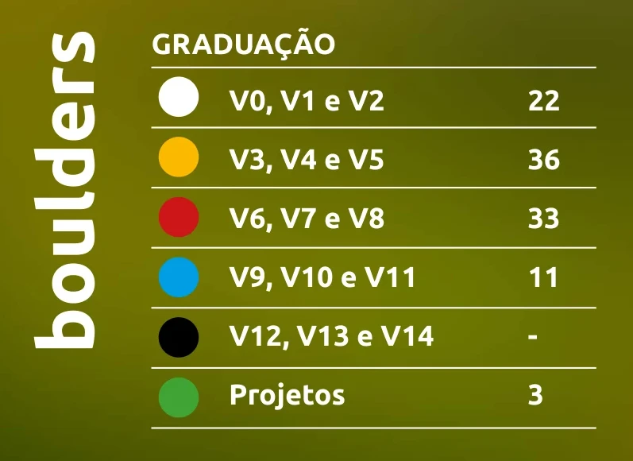 |
            | :--: |
            | *Graduações de boulders no croqui* |
- **ultima_migracao**: 5
- **publicar_croqui**: True
- **revisado_bounding_circle**: True

## Parte: setor_pressao_enrustida

### Setor (Pico: Bocaina Park)

- **descricao**: # Setor Pressão Enrustida
- **nome**: Pressão Enrustida
- **uid**: 2r0UOQl5lu5YVV
- **mapas**:
  - **[0]**:
    - **caminho_imagem_mapa**: 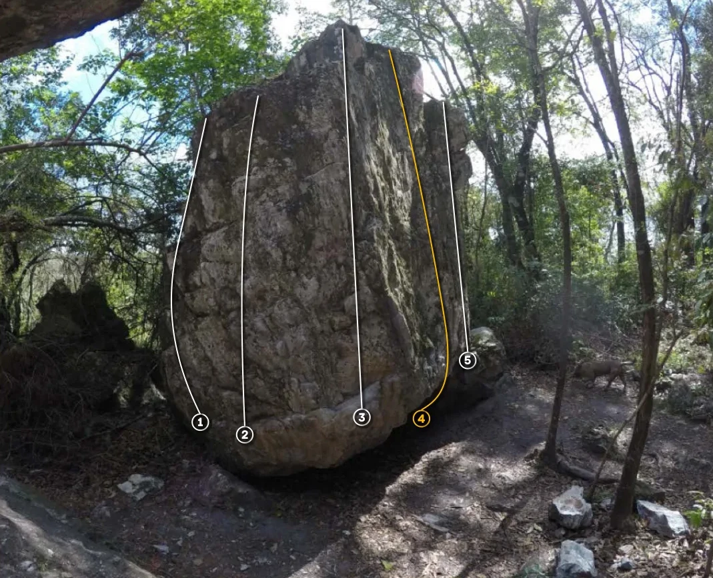
    - **largura_mapa**: 1069
    - **altura_mapa**: 868
    - **pontos_de_interesse**:
      - **[0]**:
        - **id**: rKMJJmrWUVHXgy
        - **uid**: rKMJJmrWUVHXgy
        - **rotulo**: 01
        - **circulo**:
          - **x**: 300
          - **y**: 634
          - **raio**: 12
        - **label**: 01
      - **[1]**:
        - **id**: fkdH2eilteODT5
        - **uid**: fkdH2eilteODT5
        - **rotulo**: 02
        - **circulo**:
          - **x**: 367
          - **y**: 653
          - **raio**: 12
        - **label**: 02
      - **[2]**:
        - **id**: Yfle4mbz4R3d7n
        - **uid**: Yfle4mbz4R3d7n
        - **rotulo**: 03
        - **circulo**:
          - **x**: 542
          - **y**: 627
          - **raio**: 12
        - **label**: 03
      - **[3]**:
        - **id**: 2lFJawiGO8EIkd
        - **uid**: 2lFJawiGO8EIkd
        - **rotulo**: 04
        - **circulo**:
          - **x**: 632
          - **y**: 629
          - **raio**: 12
        - **label**: 04
      - **[4]**:
        - **id**: nLNFaB2Z6kczhc
        - **uid**: nLNFaB2Z6kczhc
        - **rotulo**: 05
        - **circulo**:
          - **x**: 701
          - **y**: 541
          - **raio**: 12
        - **label**: 05
    - **referencias**:
      - **[0]**:
        - **alvo_uid**: 9RqPyjGpUDYV5J
        - **pontos_uids**:
          - rKMJJmrWUVHXgy
        - **escalada**: Café com Leite
        - **ids**:
          - rKMJJmrWUVHXgy
      - **[1]**:
        - **alvo_uid**: IwY9w2QhEZzvh9
        - **pontos_uids**:
          - fkdH2eilteODT5
        - **escalada**: Maltodextrina
        - **ids**:
          - fkdH2eilteODT5
      - **[2]**:
        - **alvo_uid**: by58o53yonMjhI
        - **pontos_uids**:
          - Yfle4mbz4R3d7n
        - **escalada**: Maltodextrina SDS
        - **ids**:
          - Yfle4mbz4R3d7n
      - **[3]**:
        - **alvo_uid**: x3ZGinJzvhJ6jZ
        - **pontos_uids**:
          - 2lFJawiGO8EIkd
        - **escalada**: Pinga Preta
        - **ids**:
          - 2lFJawiGO8EIkd
      - **[4]**:
        - **alvo_uid**: wlNV7GJit7OnuN
        - **pontos_uids**:
          - nLNFaB2Z6kczhc
        - **escalada**: Pressão Enrustida
        - **ids**:
          - nLNFaB2Z6kczhc
      - **[5]**:
        - **alvo_uid**: eRcNyzQkVgSLH2
        - **pontos_uids**:
          - 2lFJawiGO8EIkd
        - **escalada**: Não Contava com Minha Astúcia
        - **ids**:
          - 2lFJawiGO8EIkd
      - **[6]**:
        - **alvo_uid**: Xww11j8447XPSm
        - **pontos_uids**:
          - nLNFaB2Z6kczhc
        - **escalada**: Rapé
        - **ids**:
          - nLNFaB2Z6kczhc
- **escaladas**:
  - **[0]**:
    - **uid**: 9RqPyjGpUDYV5J
    - **boulder**:
      - **nome**: Café com Leite
      - **dificuldade**: V0
  - **[1]**:
    - **uid**: IwY9w2QhEZzvh9
    - **boulder**:
      - **descricao**: Saída agachado com as mãos juntas em agarrão, virando reto no bloco.
      - **nome**: Maltodextrina
      - **dificuldade**: V0
  - **[2]**:
    - **uid**: by58o53yonMjhI
    - **boulder**:
      - **descricao**: Saída sentado com as mãos em regletes abaixo do agarrão do Maltodextrina, e virando reto.
      - **nome**: Maltodextrina SDS
      - **dificuldade**: V2
  - **[3]**:
    - **uid**: x3ZGinJzvhJ6jZ
    - **boulder**:
      - **descricao**: Saída do Maltodextrina e vira no Não contava com minhas astúcia.
      - **nome**: Pinga Preta
      - **dificuldade**: V3
  - **[4]**:
    - **uid**: wlNV7GJit7OnuN
    - **boulder**:
      - **descricao**: Saída sentado com as mãos juntas em agarrão investido no teto.
      - **nome**: Pressão Enrustida
      - **dificuldade**: V4
  - **[5]**:
    - **uid**: eRcNyzQkVgSLH2
    - **boulder**:
      - **descricao**: Saída agachado com as duas mãos juntas em agarrão em bloco pequeno passando para Pressão inrrustida no bloco da esquerda.
      - **nome**: Não Contava com Minha Astúcia
      - **dificuldade**: V1
  - **[6]**:
    - **uid**: Xww11j8447XPSm
    - **boulder**:
      - **descricao**: Saída do Não Contava com minha astúcia fazendo travessia para esquerda virando no Maltodextrina.
      - **nome**: Rapé
      - **dificuldade**: V3
- **precomputados**:
  - **total_escaladas**: 7
  - **total_boulders**: 7

## Parte: setor_caverninha

### Setor (Pico: Bocaina Park)

- **descricao**: # Setor Caverninha
- **nome**: Caverninha
- **uid**: D6jFNzrZdEYFsk
- **mapas**:
  - **[0]**:
    - **caminho_imagem_mapa**: 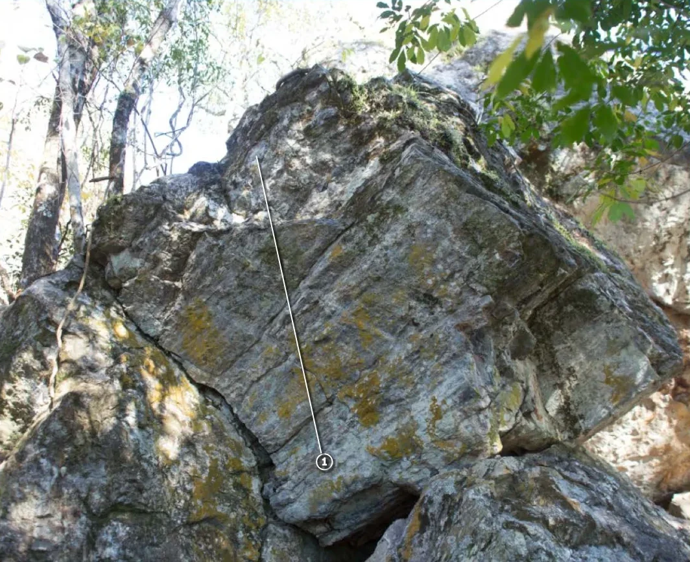
    - **largura_mapa**: 1064
    - **altura_mapa**: 868
    - **pontos_de_interesse**:
      - **[0]**:
        - **id**: XVaT7pyPSHbPjq
        - **uid**: XVaT7pyPSHbPjq
        - **rotulo**: 01
        - **circulo**:
          - **x**: 500
          - **y**: 713
          - **raio**: 12
        - **label**: 01
    - **referencias**:
      - **[0]**:
        - **alvo_uid**: sxhUDsLNV6XgFD
        - **pontos_uids**:
          - XVaT7pyPSHbPjq
        - **escalada**: Mingau
        - **ids**:
          - XVaT7pyPSHbPjq
  - **[1]**:
    - **caminho_imagem_mapa**: 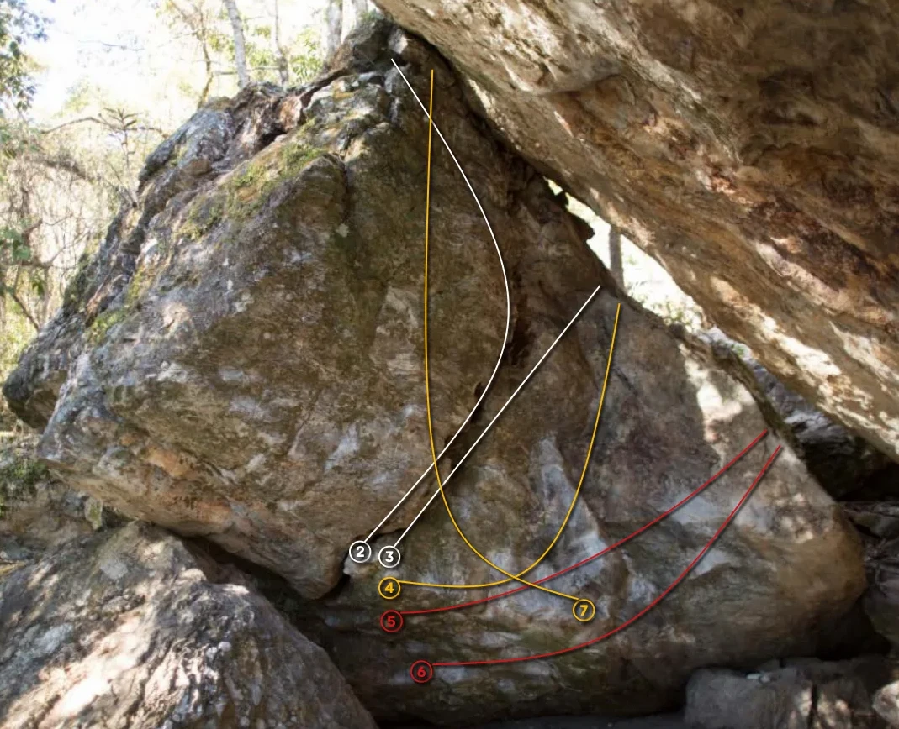
    - **largura_mapa**: 1069
    - **altura_mapa**: 868
    - **pontos_de_interesse**:
      - **[0]**:
        - **id**: ZgSf5R8XflLxsB
        - **uid**: ZgSf5R8XflLxsB
        - **rotulo**: 02
        - **circulo**:
          - **x**: 428
          - **y**: 657
          - **raio**: 12
        - **label**: 02
      - **[1]**:
        - **id**: 4EUs1hDTtLchRw
        - **uid**: 4EUs1hDTtLchRw
        - **rotulo**: 03
        - **circulo**:
          - **x**: 463
          - **y**: 663
          - **raio**: 12
        - **label**: 03
      - **[2]**:
        - **id**: fAzFUmZvFInF25
        - **uid**: fAzFUmZvFInF25
        - **rotulo**: 04
        - **circulo**:
          - **x**: 463
          - **y**: 700
          - **raio**: 12
        - **label**: 04
      - **[3]**:
        - **id**: r5NArP60WjlwJW
        - **uid**: r5NArP60WjlwJW
        - **rotulo**: 05
        - **circulo**:
          - **x**: 466
          - **y**: 740
          - **raio**: 12
        - **label**: 05
      - **[4]**:
        - **id**: 3BdhVKpRqMdR08
        - **uid**: 3BdhVKpRqMdR08
        - **rotulo**: 06
        - **circulo**:
          - **x**: 501
          - **y**: 800
          - **raio**: 12
        - **label**: 06
      - **[5]**:
        - **id**: EFIoOUsLAsP1U1
        - **uid**: EFIoOUsLAsP1U1
        - **rotulo**: 07
        - **circulo**:
          - **x**: 694
          - **y**: 726
          - **raio**: 12
        - **label**: 07
    - **referencias**:
      - **[0]**:
        - **alvo_uid**: 8UHJ6PhNPy64mY
        - **pontos_uids**:
          - ZgSf5R8XflLxsB
        - **escalada**: Pretinho Irlandês
        - **ids**:
          - ZgSf5R8XflLxsB
      - **[1]**:
        - **alvo_uid**: sfuUfKtINgLQAG
        - **pontos_uids**:
          - 4EUs1hDTtLchRw
        - **escalada**: Ratos e Raízes
        - **ids**:
          - 4EUs1hDTtLchRw
      - **[2]**:
        - **alvo_uid**: 8515Gc96pebpim
        - **pontos_uids**:
          - fAzFUmZvFInF25
        - **escalada**: Tripa Eterna
        - **ids**:
          - fAzFUmZvFInF25
      - **[3]**:
        - **alvo_uid**: pFT4K0gXcVlXqx
        - **pontos_uids**:
          - r5NArP60WjlwJW
        - **escalada**: Trip Eterna
        - **ids**:
          - r5NArP60WjlwJW
      - **[4]**:
        - **alvo_uid**: VqmaFZ1yRS22vT
        - **pontos_uids**:
          - 3BdhVKpRqMdR08
        - **escalada**: Mecanismo
        - **ids**:
          - 3BdhVKpRqMdR08
      - **[5]**:
        - **alvo_uid**: TjFAiTenlAVwZH
        - **pontos_uids**:
          - EFIoOUsLAsP1U1
        - **escalada**: Pedrada
        - **ids**:
          - EFIoOUsLAsP1U1
  - **[2]**:
    - **caminho_imagem_mapa**: 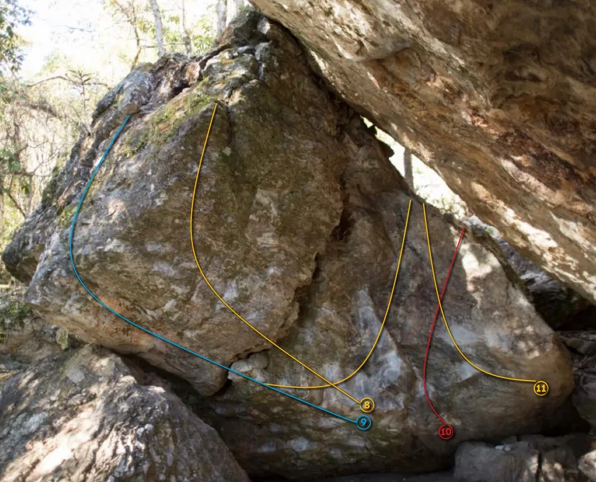
    - **largura_mapa**: 1069
    - **altura_mapa**: 865
    - **pontos_de_interesse**:
      - **[0]**:
        - **id**: xVOPZ1JtXAUZYq
        - **uid**: xVOPZ1JtXAUZYq
        - **rotulo**: 08
        - **circulo**:
          - **x**: 658
          - **y**: 726
          - **raio**: 12
        - **label**: 08
      - **[1]**:
        - **id**: 7ixoFHbszCPhz8
        - **uid**: 7ixoFHbszCPhz8
        - **rotulo**: 09
        - **circulo**:
          - **x**: 652
          - **y**: 758
          - **raio**: 12
        - **label**: 09
      - **[2]**:
        - **id**: DK0YxXwJl7DdLp
        - **uid**: DK0YxXwJl7DdLp
        - **rotulo**: 10
        - **circulo**:
          - **x**: 800
          - **y**: 775
          - **raio**: 12
        - **label**: 10
      - **[3]**:
        - **id**: oD7erE67hsArH2
        - **uid**: oD7erE67hsArH2
        - **rotulo**: 11
        - **circulo**:
          - **x**: 971
          - **y**: 697
          - **raio**: 12
        - **label**: 11
    - **referencias**:
      - **[0]**:
        - **alvo_uid**: NAPbrgh5a6Ud79
        - **pontos_uids**:
          - xVOPZ1JtXAUZYq
        - **escalada**: Aedes Egipse
        - **ids**:
          - xVOPZ1JtXAUZYq
      - **[1]**:
        - **alvo_uid**: V70c8EexH7sQPh
        - **pontos_uids**:
          - 7ixoFHbszCPhz8
        - **escalada**: V9 do Rafinha
        - **ids**:
          - 7ixoFHbszCPhz8
      - **[2]**:
        - **alvo_uid**: gzZh0ZCP9laU76
        - **pontos_uids**:
          - DK0YxXwJl7DdLp
        - **escalada**: Os Trabalhos Não Param
        - **ids**:
          - DK0YxXwJl7DdLp
      - **[3]**:
        - **alvo_uid**: G3zhgcl1o5S4XO
        - **pontos_uids**:
          - oD7erE67hsArH2
        - **escalada**: Trabalho em Equipe
        - **ids**:
          - oD7erE67hsArH2
- **escaladas**:
  - **[0]**:
    - **uid**: sxhUDsLNV6XgFD
    - **boulder**:
      - **descricao**: Saída com as mãos juntas em reglete bom, seguindo para sequencia de reglete e agarrão virando no meio do bloco.
      - **nome**: Mingau
      - **dificuldade**: V2
  - **[1]**:
    - **uid**: 8UHJ6PhNPy64mY
    - **boulder**:
      - **descricao**: Saída agaixado com as duas mãos em agarrão, seguindo reto por batente lateral virando a esquerda do bloco na parte de cima.
      - **nome**: Pretinho Irlandês
      - **dificuldade**: V2
  - **[2]**:
    - **uid**: sfuUfKtINgLQAG
    - **boulder**:
      - **descricao**: Saída do pretinho Irlandes seguindo primeiros movimentos na fenda reta virando na direita.
      - **nome**: Ratos e Raízes
      - **dificuldade**: V1
  - **[3]**:
    - **uid**: 8515Gc96pebpim
    - **boulder**:
      - **descricao**: Saída do Pretinho Irlandes indo para pinçá a direita da agarra de saída seguindo para batentes escorridos e virando no centro do bloco
      - **nome**: Tripa Eterna
      - **dificuldade**: V4
  - **[4]**:
    - **uid**: pFT4K0gXcVlXqx
    - **boulder**:
      - **descricao**: Saída do Pretinho Irlandes indo para pinça a direita da agarra de saída, seguindo para batentes escorridos virando a direita do bloco.
      - **nome**: Trip Eterna
      - **dificuldade**: V6
  - **[5]**:
    - **uid**: VqmaFZ1yRS22vT
    - **boulder**:
      - **descricao**: Saída sentado com a mao esquerda em batentee mao direita em reglete e calchanhar equerdo na altura da mão esquerda, passando por buracos no teto, seguindo para agarra triangular e virando no Trip Eterna.
      - **nome**: Mecanismo
      - **dificuldade**: V7
  - **[6]**:
    - **uid**: TjFAiTenlAVwZH
    - **boulder**:
      - **descricao**: Saida sentado com as mãos em dois batentes escorridos, virando no Pretinho Irlandês.
      - **nome**: Pedrada
      - **dificuldade**: V3
  - **[7]**:
    - **uid**: NAPbrgh5a6Ud79
    - **boulder**:
      - **descricao**: Saída sentado em batentes escorridos seguindo para esquerda em sequencia de regletes no meio do bloco virando em abaulado grande.
      - **nome**: Aedes Egipse
      - **dificuldade**: V5
  - **[8]**:
    - **uid**: V70c8EexH7sQPh
    - **boulder**:
      - **descricao**: Saída do pedrada, e seguir sequencia de batentes e regletes pela parte debaixo do bloco virando na aresta esquerda.
      - **nome**: V9 do Rafinha
      - **dificuldade**: V9
  - **[9]**:
    - **uid**: gzZh0ZCP9laU76
    - **boulder**:
      - **descricao**: Saída sentado com as duas mãos em reglete grande baixo e calcanhar esquerdo mais alto que as mãos, virando no Trip Eterna.
      - **nome**: Os Trabalhos Não Param
      - **dificuldade**: V6
  - **[10]**:
    - **uid**: G3zhgcl1o5S4XO
    - **boulder**:
      - **descricao**: Saída sentado com a mão esquerda em batente de compressão e direita em reglete aberto acima da cabeça.
      - **nome**: Trabalho em Equipe
      - **dificuldade**: V5
- **precomputados**:
  - **total_escaladas**: 11
  - **total_boulders**: 11

## Parte: setor_exquadrilha

### Setor (Pico: Bocaina Park)

- **descricao**: # Setor Exquadrilha
- **nome**: Exquadrilha
- **uid**: 5KSqaLJ9K1rbfi
- **mapas**:
  - **[0]**:
    - **caminho_imagem_mapa**: 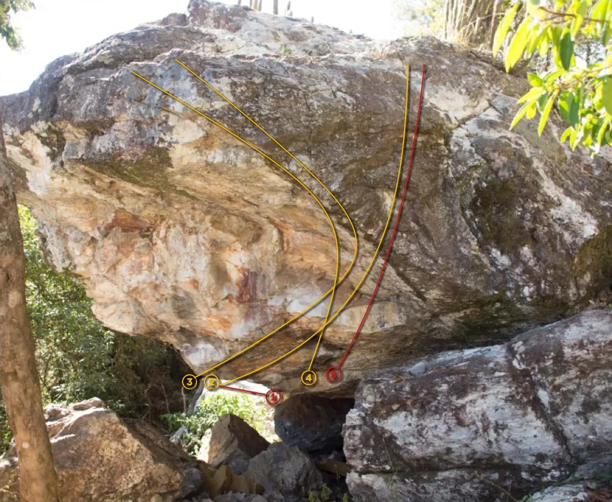
    - **largura_mapa**: 1062
    - **altura_mapa**: 870
    - **pontos_de_interesse**:
      - **[0]**:
        - **id**: IRlJm5BkGXJMFY
        - **uid**: IRlJm5BkGXJMFY
        - **rotulo**: 01
        - **circulo**:
          - **x**: 474
          - **y**: 688
          - **raio**: 12
        - **label**: 01
      - **[1]**:
        - **id**: E0BXGPVvU6ZICJ
        - **uid**: E0BXGPVvU6ZICJ
        - **rotulo**: 02
        - **circulo**:
          - **x**: 367
          - **y**: 662
          - **raio**: 12
        - **label**: 02
      - **[2]**:
        - **id**: D82ZhbuM3ZbE6n
        - **uid**: D82ZhbuM3ZbE6n
        - **rotulo**: 03
        - **circulo**:
          - **x**: 329
          - **y**: 662
          - **raio**: 12
        - **label**: 03
      - **[3]**:
        - **id**: cVm4TyFRgSVoIG
        - **uid**: cVm4TyFRgSVoIG
        - **rotulo**: 04
        - **circulo**:
          - **x**: 536
          - **y**: 655
          - **raio**: 12
        - **label**: 04
      - **[4]**:
        - **id**: OP6wCIqiilPKqE
        - **uid**: OP6wCIqiilPKqE
        - **rotulo**: 05
        - **circulo**:
          - **x**: 579
          - **y**: 649
          - **raio**: 12
        - **label**: 05
    - **referencias**:
      - **[0]**:
        - **alvo_uid**: QYL7kqYr4eEYYo
        - **pontos_uids**:
          - IRlJm5BkGXJMFY
        - **escalada**: Fumaça Sagrada
        - **ids**:
          - IRlJm5BkGXJMFY
      - **[1]**:
        - **alvo_uid**: IiN1qRHwQtfZVL
        - **pontos_uids**:
          - E0BXGPVvU6ZICJ
        - **escalada**: Exquadrilha da Fumaça
        - **ids**:
          - E0BXGPVvU6ZICJ
      - **[2]**:
        - **alvo_uid**: yVtsgImLqEpT3L
        - **pontos_uids**:
          - D82ZhbuM3ZbE6n
        - **escalada**: Quadrilha da Fumaça
        - **ids**:
          - D82ZhbuM3ZbE6n
      - **[3]**:
        - **alvo_uid**: uZFuQjlORYOybS
        - **pontos_uids**:
          - cVm4TyFRgSVoIG
        - **escalada**: Planet Hemp
        - **ids**:
          - cVm4TyFRgSVoIG
      - **[4]**:
        - **alvo_uid**: uOVZG4RDG9ESRh
        - **pontos_uids**:
          - OP6wCIqiilPKqE
        - **escalada**: Cypress Hill
        - **ids**:
          - OP6wCIqiilPKqE
- **escaladas**:
  - **[0]**:
    - **uid**: QYL7kqYr4eEYYo
    - **boulder**:
      - **descricao**: Saída com as mãos em regletes invertidos e pés com tail em batente grande e segue pelo Exquadrilha da Fumaça.
      - **nome**: Fumaça Sagrada
      - **dificuldade**: V7
  - **[1]**:
    - **uid**: IiN1qRHwQtfZVL
    - **boulder**:
      - **descricao**: Saída com as mãos e calcanhar esquerdo em batente grande, e segue para direita em agarrão virando na lateral no bloco.
      - **nome**: Exquadrilha da Fumaça
      - **dificuldade**: V5
  - **[2]**:
    - **uid**: yVtsgImLqEpT3L
    - **boulder**:
      - **descricao**: Saída com as mãos em buracos na laca, seguindo para agarrão e virando a direita do bloco.
      - **nome**: Quadrilha da Fumaça
      - **dificuldade**: V4
  - **[3]**:
    - **uid**: uZFuQjlORYOybS
    - **boulder**:
      - **descricao**: Saída com as mãos buracos na laca, seguindo para agarrão e virando reto proa.
      - **nome**: Planet Hemp
      - **dificuldade**: V5
  - **[4]**:
    - **uid**: uOVZG4RDG9ESRh
    - **boulder**:
      - **descricao**: Saída do exquadrilha e virando no Planet Hemp.
      - **nome**: Cypress Hill
      - **dificuldade**: V6
- **precomputados**:
  - **total_escaladas**: 5
  - **total_boulders**: 5

## Parte: setor_canil

### Setor (Pico: Bocaina Park)

- **descricao**: # Setor Canil
- **nome**: Canil
- **uid**: z7vQKwVnhjN7dQ
- **mapas**:
  - **[0]**:
    - **caminho_imagem_mapa**: 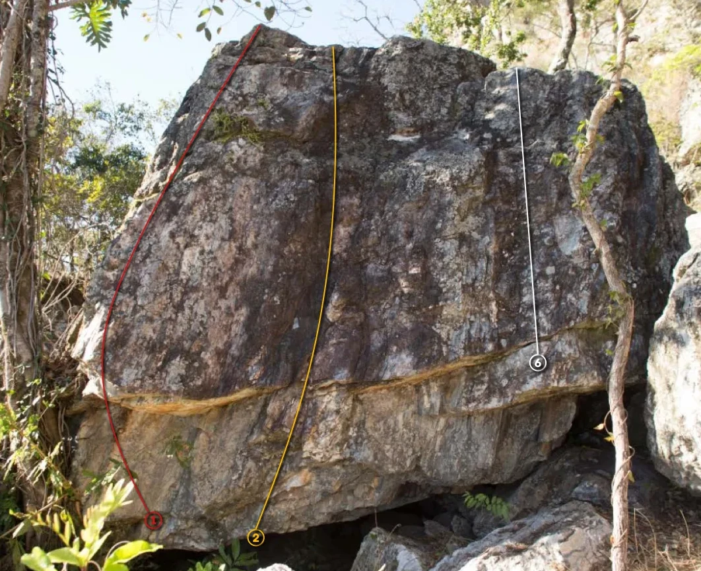
    - **largura_mapa**: 1062
    - **altura_mapa**: 865
    - **pontos_de_interesse**:
      - **[0]**:
        - **id**: mJFW3aUybhnK2C
        - **uid**: mJFW3aUybhnK2C
        - **rotulo**: 01
        - **circulo**:
          - **x**: 232
          - **y**: 789
          - **raio**: 13
        - **label**: 01
      - **[1]**:
        - **id**: eITS1eBerhq2LR
        - **uid**: eITS1eBerhq2LR
        - **rotulo**: 02
        - **circulo**:
          - **x**: 388
          - **y**: 814
          - **raio**: 12
        - **label**: 02
      - **[2]**:
        - **id**: Lf7S9mhmTRvqXu
        - **uid**: Lf7S9mhmTRvqXu
        - **rotulo**: 06
        - **circulo**:
          - **x**: 815
          - **y**: 549
          - **raio**: 12
        - **label**: 06
      - **[3]**:
        - **id**: Y4ugeCjjra3IiH
        - **uid**: Y4ugeCjjra3IiH
        - **rotulo**: 4
        - **circulo**:
          - **x**: 783
          - **y**: 104
          - **raio**: 12
        - **label**: 4
      - **[4]**:
        - **id**: 5IsLXHzfCKl5f3
        - **uid**: 5IsLXHzfCKl5f3
        - **rotulo**: 4
        - **circulo**:
          - **x**: 505
          - **y**: 70
          - **raio**: 12
        - **label**: 4
      - **[5]**:
        - **id**: VmxOI8diLzDhIL
        - **uid**: VmxOI8diLzDhIL
        - **rotulo**: 7
        - **circulo**:
          - **x**: 393
          - **y**: 38
          - **raio**: 12
        - **label**: 7
    - **referencias**:
      - **[0]**:
        - **alvo_uid**: kaJQu4BSLLt921
        - **pontos_uids**:
          - mJFW3aUybhnK2C
        - **escalada**: Sucrilhos no Prato
        - **ids**:
          - mJFW3aUybhnK2C
      - **[1]**:
        - **alvo_uid**: QfQqepKuxSJctO
        - **pontos_uids**:
          - eITS1eBerhq2LR
        - **escalada**: Titan
        - **ids**:
          - eITS1eBerhq2LR
      - **[2]**:
        - **alvo_uid**: Y3BeD4xfjXO9RJ
        - **pontos_uids**:
          - Lf7S9mhmTRvqXu
        - **escalada**: Loboulder
        - **ids**:
          - Lf7S9mhmTRvqXu
      - **[3]**:
        - **alvo_uid**: BOIeQZAXjE3hh3
        - **pontos_uids**:
          - mJFW3aUybhnK2C
          - Y4ugeCjjra3IiH
        - **escalada**: Lobão
        - **ids**:
          - mJFW3aUybhnK2C
          - Y4ugeCjjra3IiH
      - **[4]**:
        - **alvo_uid**: Qi1Q0PDMpfliDb
        - **pontos_uids**:
          - mJFW3aUybhnK2C
          - 5IsLXHzfCKl5f3
        - **escalada**: Tião Macalé
        - **ids**:
          - mJFW3aUybhnK2C
          - 5IsLXHzfCKl5f3
      - **[5]**:
        - **alvo_uid**: oBeEnbJK7Ff3ln
        - **pontos_uids**:
          - Lf7S9mhmTRvqXu
          - VmxOI8diLzDhIL
        - **escalada**: Savana
        - **ids**:
          - Lf7S9mhmTRvqXu
          - VmxOI8diLzDhIL
- **escaladas**:
  - **[0]**:
    - **uid**: kaJQu4BSLLt921
    - **boulder**:
      - **descricao**: Saída deitado com mão esquerda em pinça e direita na mesma agarra em reglete lateral.
      - **nome**: Sucrilhos no Prato
      - **dificuldade**: V7
  - **[1]**:
    - **uid**: QfQqepKuxSJctO
    - **boulder**:
      - **descricao**: Saída deitado com mao esquerda em pinça na borda e direita batente investido.
      - **nome**: Titan
      - **dificuldade**: V4
  - **[2]**:
    - **uid**: BOIeQZAXjE3hh3
    - **boulder**:
      - **descricao**: Saida do Sucrilhos no Prato fazendo travessia para direita virando no Loboulder.
      - **nome**: Lobão
      - **dificuldade**: V7
  - **[3]**:
    - **uid**: Qi1Q0PDMpfliDb
    - **boulder**:
      - **descricao**: Saída do Sucrilhos no Prato e virando no Titan.
      - **nome**: Tião Macalé
      - **dificuldade**: V5
  - **[4]**:
    - **uid**: ihKW9OgcsBCIo8
    - **boulder**:
      - **nome**: Zac
      - **dificuldade**: V6
  - **[5]**:
    - **uid**: Y3BeD4xfjXO9RJ
    - **boulder**:
      - **descricao**: Sai agachado com as mãos juntas em agarrão.
      - **nome**: Loboulder
      - **dificuldade**: V2
  - **[6]**:
    - **uid**: oBeEnbJK7Ff3ln
    - **boulder**:
      - **descricao**: Saída do loboulder em travessia para esquerda virando no Sucrilhos no Prato.
      - **nome**: Savana
      - **dificuldade**: V6
- **precomputados**:
  - **total_escaladas**: 7
  - **total_boulders**: 7

## Parte: setor_bloco_do_guerreiro

### Setor (Pico: Bocaina Park)

- **descricao**: # Setor Bloco do Guerreiro
- **nome**: Bloco do Guerreiro
- **uid**: KbM68ZX0V5vtaT
- **mapas**:
  - **[0]**:
    - **caminho_imagem_mapa**: 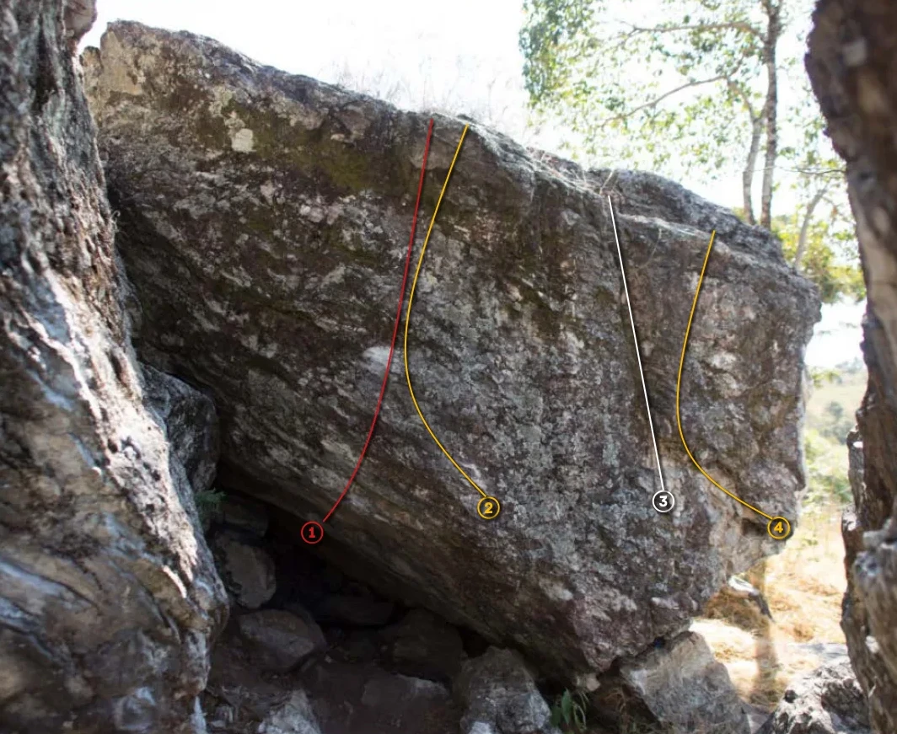
    - **largura_mapa**: 1064
    - **altura_mapa**: 871
    - **pontos_de_interesse**:
      - **[0]**:
        - **id**: iglmoq77n7lfET
        - **uid**: iglmoq77n7lfET
        - **rotulo**: 01
        - **circulo**:
          - **x**: 370
          - **y**: 632
          - **raio**: 12
        - **label**: 01
      - **[1]**:
        - **id**: ysorxHlnDk8ilJ
        - **uid**: ysorxHlnDk8ilJ
        - **rotulo**: 02
        - **circulo**:
          - **x**: 579
          - **y**: 603
          - **raio**: 12
        - **label**: 02
      - **[2]**:
        - **id**: xhHdMPWz8YqyM2
        - **uid**: xhHdMPWz8YqyM2
        - **rotulo**: 03
        - **circulo**:
          - **x**: 787
          - **y**: 595
          - **raio**: 12
        - **label**: 03
      - **[3]**:
        - **id**: MXsak3aovU0t9g
        - **uid**: MXsak3aovU0t9g
        - **rotulo**: 04
        - **circulo**:
          - **x**: 924
          - **y**: 626
          - **raio**: 12
        - **label**: 04
    - **referencias**:
      - **[0]**:
        - **alvo_uid**: 7IQF5461NCjoKE
        - **pontos_uids**:
          - iglmoq77n7lfET
        - **escalada**: Strike
        - **ids**:
          - iglmoq77n7lfET
      - **[1]**:
        - **alvo_uid**: RTN0rNb2gB7IHF
        - **pontos_uids**:
          - ysorxHlnDk8ilJ
        - **escalada**: Chove e Não Molha
        - **ids**:
          - ysorxHlnDk8ilJ
      - **[2]**:
        - **alvo_uid**: oBDvmaSNCEMWU2
        - **pontos_uids**:
          - xhHdMPWz8YqyM2
        - **escalada**: Palhaço Pirulito
        - **ids**:
          - xhHdMPWz8YqyM2
      - **[3]**:
        - **alvo_uid**: 5ycigquFoRkj5h
        - **pontos_uids**:
          - MXsak3aovU0t9g
        - **escalada**: Marreteiro
        - **ids**:
          - MXsak3aovU0t9g
  - **[1]**:
    - **caminho_imagem_mapa**: 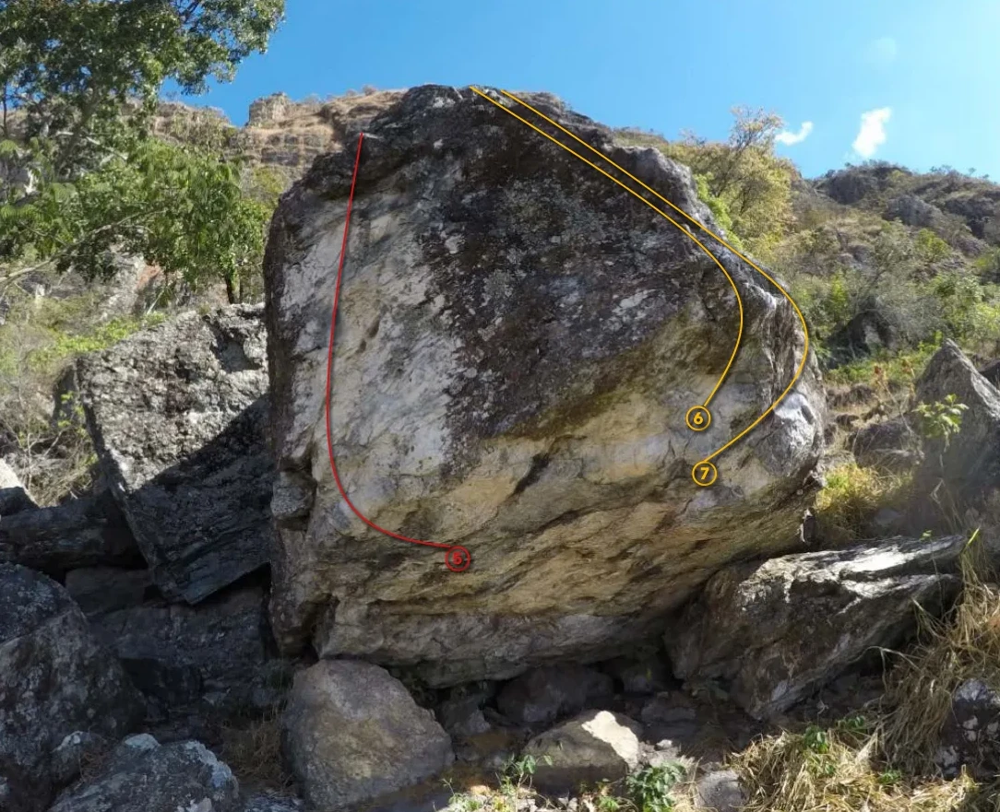
    - **largura_mapa**: 1084
    - **altura_mapa**: 881
    - **pontos_de_interesse**:
      - **[0]**:
        - **id**: bChhIBYHkOqe81
        - **uid**: bChhIBYHkOqe81
        - **rotulo**: 05
        - **circulo**:
          - **x**: 496
          - **y**: 606
          - **raio**: 13
        - **label**: 05
      - **[1]**:
        - **id**: Ds1zNd4r0BOE3N
        - **uid**: Ds1zNd4r0BOE3N
        - **rotulo**: 06
        - **circulo**:
          - **x**: 757
          - **y**: 454
          - **raio**: 13
        - **label**: 06
      - **[2]**:
        - **id**: UmqIT9j592jMAA
        - **uid**: UmqIT9j592jMAA
        - **rotulo**: 07
        - **circulo**:
          - **x**: 764
          - **y**: 514
          - **raio**: 13
        - **label**: 07
    - **referencias**:
      - **[0]**:
        - **alvo_uid**: X1QTk7WvgkT0M3
        - **pontos_uids**:
          - bChhIBYHkOqe81
        - **escalada**: Guerreiro da Bocaina
        - **ids**:
          - bChhIBYHkOqe81
      - **[1]**:
        - **alvo_uid**: ts4kATktgPOmh1
        - **pontos_uids**:
          - Ds1zNd4r0BOE3N
        - **escalada**: High Line
        - **ids**:
          - Ds1zNd4r0BOE3N
      - **[2]**:
        - **alvo_uid**: O66zZHjt63eW4R
        - **pontos_uids**:
          - UmqIT9j592jMAA
        - **escalada**: Colchão de Mola
        - **ids**:
          - UmqIT9j592jMAA
- **escaladas**:
  - **[0]**:
    - **uid**: 7IQF5461NCjoKE
    - **boulder**:
      - **descricao**: Saída sentado com mão esquerda em reglete e direita em pinça pequena seguindo para abaulado virando reto.
      - **nome**: Strike
      - **dificuldade**: V7_BARRA_V8
  - **[1]**:
    - **uid**: RTN0rNb2gB7IHF
    - **boulder**:
      - **descricao**: Saída em pé em regletes na aresta indo para abaulado e virando reto.
      - **nome**: Chove e Não Molha
      - **dificuldade**: V3
  - **[2]**:
    - **uid**: oBDvmaSNCEMWU2
    - **boulder**:
      - **descricao**: Saída em pé com as mãos em abaulado virando reto.
      - **nome**: Palhaço Pirulito
      - **dificuldade**: V1
  - **[3]**:
    - **uid**: 5ycigquFoRkj5h
    - **boulder**:
      - **descricao**: Saida agachado, com a mão esquerda em reglete escorrido e direita em reglete de meia falange com calcanhar na mão direita e segue a linha reta.
      - **nome**: Marreteiro
      - **dificuldade**: V5
  - **[4]**:
    - **uid**: X1QTk7WvgkT0M3
    - **boulder**:
      - **descricao**: Saída agachado com mão esquerda em abaulado com calcanhar esquerdo ao lado da mão e direita em reglete no teto.
      - **nome**: Guerreiro da Bocaina
      - **dificuldade**: V6
  - **[5]**:
    - **uid**: ts4kATktgPOmh1
    - **boulder**:
      - **descricao**: Saída em pé com as mãos em regletes no batentão.
      - **nome**: High Line
      - **dificuldade**: V5
  - **[6]**:
    - **uid**: O66zZHjt63eW4R
    - **boulder**:
      - **descricao**: Saída em pé com as mãos em regletes investidos.
      - **nome**: Colchão de Mola
      - **dificuldade**: V4
- **precomputados**:
  - **total_escaladas**: 7
  - **total_boulders**: 7

## Parte: setor_bloco_do_cabelin

### Setor (Pico: Bocaina Park)

- **descricao**: # Setor Bloco do Cabelin
- **nome**: Bloco do Cabelin
- **uid**: OSyxvPq2xEupwz
- **mapas**:
  - **[0]**:
    - **caminho_imagem_mapa**: 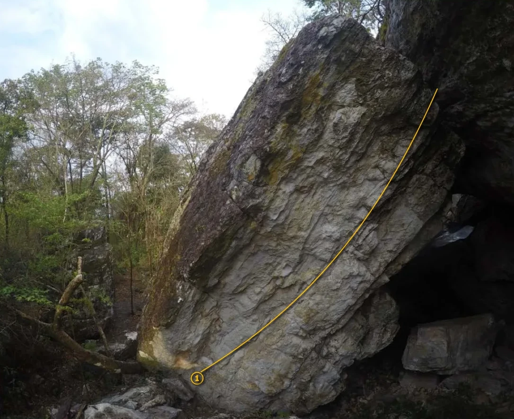
    - **largura_mapa**: 1086
    - **altura_mapa**: 885
    - **pontos_de_interesse**:
      - **[0]**:
        - **id**: Ss1XKgxRfIr8Iw
        - **uid**: Ss1XKgxRfIr8Iw
        - **rotulo**: 01
        - **circulo**:
          - **x**: 416
          - **y**: 799
          - **raio**: 12
        - **label**: 01
    - **referencias**:
      - **[0]**:
        - **alvo_uid**: MGBLQ4vEOLrN9U
        - **pontos_uids**:
          - Ss1XKgxRfIr8Iw
        - **escalada**: Sexto Sentido
        - **ids**:
          - Ss1XKgxRfIr8Iw
  - **[1]**:
    - **caminho_imagem_mapa**: 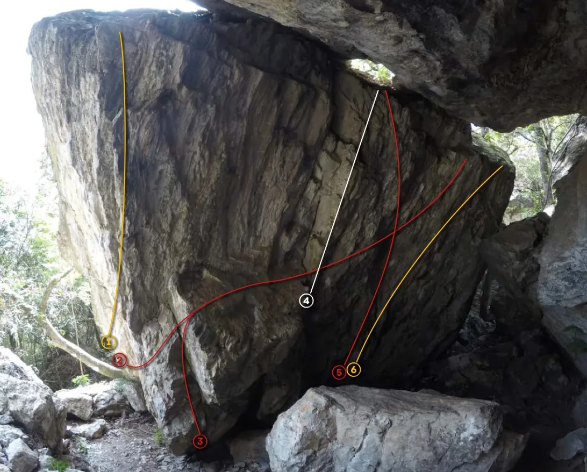
    - **largura_mapa**: 1092
    - **altura_mapa**: 878
    - **pontos_de_interesse**:
      - **[0]**:
        - **id**: tJV8Lm602Y2i39
        - **uid**: tJV8Lm602Y2i39
        - **rotulo**: 01
        - **circulo**:
          - **x**: 202
          - **y**: 636
          - **raio**: 13
        - **label**: 01
      - **[1]**:
        - **id**: o51qO4D4BIowb8
        - **uid**: o51qO4D4BIowb8
        - **rotulo**: 02
        - **circulo**:
          - **x**: 222
          - **y**: 670
          - **raio**: 13
        - **label**: 02
      - **[2]**:
        - **id**: 8UJKw35wtnjjsk
        - **uid**: 8UJKw35wtnjjsk
        - **rotulo**: 03
        - **circulo**:
          - **x**: 372
          - **y**: 821
          - **raio**: 13
        - **label**: 03
      - **[3]**:
        - **id**: oU2GvGXJDwWXlA
        - **uid**: oU2GvGXJDwWXlA
        - **rotulo**: 04
        - **circulo**:
          - **x**: 570
          - **y**: 559
          - **raio**: 13
        - **label**: 04
      - **[4]**:
        - **id**: oJiZ373URE7Cm1
        - **uid**: oJiZ373URE7Cm1
        - **rotulo**: 05
        - **circulo**:
          - **x**: 631
          - **y**: 693
          - **raio**: 12
        - **label**: 05
      - **[5]**:
        - **id**: VQQJCLPjepyqD4
        - **uid**: VQQJCLPjepyqD4
        - **rotulo**: 06
        - **circulo**:
          - **x**: 658
          - **y**: 688
          - **raio**: 12
        - **label**: 06
    - **referencias**:
      - **[0]**:
        - **alvo_uid**: MGBLQ4vEOLrN9U
        - **pontos_uids**:
          - tJV8Lm602Y2i39
        - **escalada**: Sexto Sentido
        - **ids**:
          - tJV8Lm602Y2i39
      - **[1]**:
        - **alvo_uid**: RRwb7eFUdX7AXb
        - **pontos_uids**:
          - o51qO4D4BIowb8
        - **escalada**: Dread Lock
        - **ids**:
          - o51qO4D4BIowb8
      - **[2]**:
        - **alvo_uid**: HLaAx8pUzCP1HW
        - **pontos_uids**:
          - 8UJKw35wtnjjsk
        - **escalada**: Cabeludo
        - **ids**:
          - 8UJKw35wtnjjsk
      - **[3]**:
        - **alvo_uid**: TJILQg2IZpx8hu
        - **pontos_uids**:
          - oU2GvGXJDwWXlA
        - **escalada**: Jacinto Barriguinha
        - **ids**:
          - oU2GvGXJDwWXlA
      - **[4]**:
        - **alvo_uid**: 0ZG7GOwDmItMMC
        - **pontos_uids**:
          - oJiZ373URE7Cm1
        - **escalada**: Compressor
        - **ids**:
          - oJiZ373URE7Cm1
      - **[5]**:
        - **alvo_uid**: SSurNg0H2HrJVd
        - **pontos_uids**:
          - VQQJCLPjepyqD4
        - **escalada**: Cabelinho
        - **ids**:
          - VQQJCLPjepyqD4
  - **[2]**:
    - **caminho_imagem_mapa**: 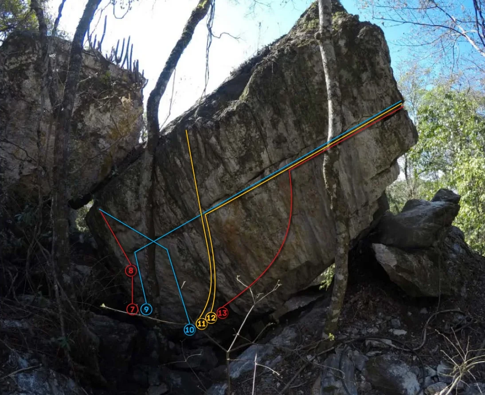
    - **largura_mapa**: 1094
    - **altura_mapa**: 893
    - **pontos_de_interesse**:
      - **[0]**:
        - **id**: ykeTJbVDZmSG1R
        - **uid**: ykeTJbVDZmSG1R
        - **rotulo**: 07
        - **circulo**:
          - **x**: 299
          - **y**: 700
          - **raio**: 12
        - **label**: 07
      - **[1]**:
        - **id**: ZxYyz9gxp00rbV
        - **uid**: ZxYyz9gxp00rbV
        - **rotulo**: 08
        - **circulo**:
          - **x**: 296
          - **y**: 612
          - **raio**: 12
        - **label**: 08
      - **[2]**:
        - **id**: fO2h52R9rxdKIQ
        - **uid**: fO2h52R9rxdKIQ
        - **rotulo**: 09
        - **circulo**:
          - **x**: 330
          - **y**: 699
          - **raio**: 12
        - **label**: 09
      - **[3]**:
        - **id**: XTT9NWQ0NBMmQa
        - **uid**: XTT9NWQ0NBMmQa
        - **rotulo**: 10
        - **circulo**:
          - **x**: 428
          - **y**: 746
          - **raio**: 12
        - **label**: 10
      - **[4]**:
        - **id**: 0kgoTcOvsfEIFK
        - **uid**: 0kgoTcOvsfEIFK
        - **rotulo**: 11
        - **circulo**:
          - **x**: 455
          - **y**: 732
          - **raio**: 12
        - **label**: 11
      - **[5]**:
        - **id**: KHeLNLki0mHXvJ
        - **uid**: KHeLNLki0mHXvJ
        - **rotulo**: 12
        - **circulo**:
          - **x**: 476
          - **y**: 719
          - **raio**: 12
        - **label**: 12
      - **[6]**:
        - **id**: N16PIBipldb61s
        - **uid**: N16PIBipldb61s
        - **rotulo**: 13
        - **circulo**:
          - **x**: 502
          - **y**: 707
          - **raio**: 12
        - **label**: 13
    - **referencias**:
      - **[0]**:
        - **alvo_uid**: Us7eEYwZ3svDyE
        - **pontos_uids**:
          - ykeTJbVDZmSG1R
        - **escalada**: Mágico de Oz
        - **ids**:
          - ykeTJbVDZmSG1R
      - **[1]**:
        - **alvo_uid**: qgrWA0Q4i3kqjy
        - **pontos_uids**:
          - ZxYyz9gxp00rbV
        - **escalada**: Mágico de Oz SDS
        - **ids**:
          - ZxYyz9gxp00rbV
      - **[2]**:
        - **alvo_uid**: T2lual8WiIOiry
        - **pontos_uids**:
          - fO2h52R9rxdKIQ
        - **escalada**: Mr. Gordura
        - **ids**:
          - fO2h52R9rxdKIQ
      - **[3]**:
        - **alvo_uid**: 2xjIUndpQYgyn3
        - **pontos_uids**:
          - XTT9NWQ0NBMmQa
        - **escalada**: País das Maravilhas
        - **ids**:
          - XTT9NWQ0NBMmQa
      - **[4]**:
        - **alvo_uid**: 4UGPBAPaXeN7Fu
        - **pontos_uids**:
          - 0kgoTcOvsfEIFK
        - **escalada**: Capim Louco
        - **ids**:
          - 0kgoTcOvsfEIFK
      - **[5]**:
        - **alvo_uid**: oihqByvJ1urkov
        - **pontos_uids**:
          - KHeLNLki0mHXvJ
        - **escalada**: Capim Gordura
        - **ids**:
          - KHeLNLki0mHXvJ
      - **[6]**:
        - **alvo_uid**: sw6UzSFuVdbAPL
        - **pontos_uids**:
          - N16PIBipldb61s
        - **escalada**: Roleta Russa
        - **ids**:
          - N16PIBipldb61s
- **escaladas**:
  - **[0]**:
    - **uid**: MGBLQ4vEOLrN9U
    - **boulder**:
      - **descricao**: Saída agachado com as mãos juntas em batente bom a direita do bloco e segue pela fenda diagonal para direita e vira na proa.
      - **nome**: Sexto Sentido
      - **dificuldade**: V4
  - **[1]**:
    - **uid**: RRwb7eFUdX7AXb
    - **boulder**:
      - **descricao**: Mesma saída do sexto sentido, travessia horizontal por baixo e entra no cabeludo.
      - **nome**: Dread Lock
      - **dificuldade**: V7
  - **[2]**:
    - **uid**: HLaAx8pUzCP1HW
    - **boulder**:
      - **descricao**: Saída sentado abrançando a aresta no meio do bloco, faz o primeiro movimento para cima da pedra e sai pra direita e vira no cabelinho.
      - **nome**: Cabeludo
      - **dificuldade**: V7
  - **[3]**:
    - **uid**: TJILQg2IZpx8hu
    - **boulder**:
      - **descricao**: Saída em pé com as mãos em agarrões e vira no buraco, no meio do bloco.
      - **nome**: Jacinto Barriguinha
      - **dificuldade**: V2
  - **[4]**:
    - **uid**: 0ZG7GOwDmItMMC
    - **boulder**:
      - **descricao**: Mesma saída do Cabelinho virando reto no buraco.
      - **nome**: Compressor
      - **dificuldade**: V8
  - **[5]**:
    - **uid**: SSurNg0H2HrJVd
    - **boulder**:
      - **descricao**: Saída sentado com mão esquerda em pinça e direita em reglete pequeno, virando a direita do bloco.
      - **nome**: Cabelinho
      - **dificuldade**: V5
  - **[6]**:
    - **uid**: Us7eEYwZ3svDyE
    - **boulder**:
      - **descricao**: Saída em pé com mão esquerda em reglete pequeno de gaston ou biquinho, e mão direita em pequeno reglete abaulado.
      - **nome**: Mágico de Oz
      - **dificuldade**: V7
  - **[7]**:
    - **uid**: qgrWA0Q4i3kqjy
    - **boulder**:
      - **descricao**: Saída em pé com mão esquerda em reglete investido e mão direita em pinça investida.
      - **nome**: Mágico de Oz SDS
      - **dificuldade**: V8
  - **[8]**:
    - **uid**: T2lual8WiIOiry
    - **boulder**:
      - **descricao**: Saída do Mágico de Oz SDS, e segue para direita pela fenda virando no Capim Gordura.
      - **nome**: Mr. Gordura
      - **dificuldade**: V9
  - **[9]**:
    - **uid**: 2xjIUndpQYgyn3
    - **boulder**:
      - **descricao**: Saída deitado em agarrão, seguindo para esquerda passando por traz da árvore e virando no Mágico de Oz.
      - **nome**: País das Maravilhas
      - **dificuldade**: V10
  - **[10]**:
    - **uid**: 4UGPBAPaXeN7Fu
    - **boulder**:
      - **descricao**: Saída do País das Maravilhas e vira reto no bloco.
      - **nome**: Capim Louco
      - **dificuldade**: V3
  - **[11]**:
    - **uid**: oihqByvJ1urkov
    - **boulder**:
      - **descricao**: Saída do País das Maravilhas e segue para direita pela fenda.
      - **nome**: Capim Gordura
      - **dificuldade**: V5
  - **[12]**:
    - **uid**: sw6UzSFuVdbAPL
    - **boulder**:
      - **nome**: Roleta Russa
      - **dificuldade**: V6
  - **[13]**:
    - **uid**: 856X9ItsIwIOP6
    - **boulder**:
      - **descricao**: Saída em pé com mão esquerda no bico e mão direita em pinça pequena na altura no quadril, virando reto e seguindo até o final do bloco.
      - **nome**: La Qualitê
      - **dificuldade**: V10
- **precomputados**:
  - **total_escaladas**: 14
  - **total_boulders**: 14

## Parte: setor_consciencia_limpa

### Setor (Pico: Bocaina Park)

- **descricao**: # Setor Consciência Limpa
- **nome**: Consciência Limpa
- **uid**: yPyqzCvOxEEIE3
- **mapas**:
  - **[0]**:
    - **caminho_imagem_mapa**: 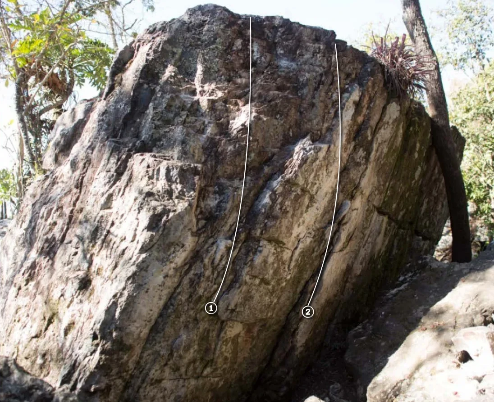
    - **largura_mapa**: 1096
    - **altura_mapa**: 893
    - **pontos_de_interesse**:
      - **[0]**:
        - **id**: PhBZE7VtDSqD8U
        - **uid**: PhBZE7VtDSqD8U
        - **rotulo**: 01
        - **circulo**:
          - **x**: 468
          - **y**: 685
          - **raio**: 12
        - **label**: 01
      - **[1]**:
        - **id**: FbFo4WMgq93FUL
        - **uid**: FbFo4WMgq93FUL
        - **rotulo**: 02
        - **circulo**:
          - **x**: 683
          - **y**: 693
          - **raio**: 12
        - **label**: 02
    - **referencias**:
      - **[0]**:
        - **alvo_uid**: AzAsVbpRR8NCmD
        - **pontos_uids**:
          - PhBZE7VtDSqD8U
        - **escalada**: Canarim
        - **ids**:
          - PhBZE7VtDSqD8U
      - **[1]**:
        - **alvo_uid**: 29ZNcyB4GZmTNv
        - **pontos_uids**:
          - FbFo4WMgq93FUL
        - **escalada**: Sabiá
        - **ids**:
          - FbFo4WMgq93FUL
  - **[1]**:
    - **caminho_imagem_mapa**: 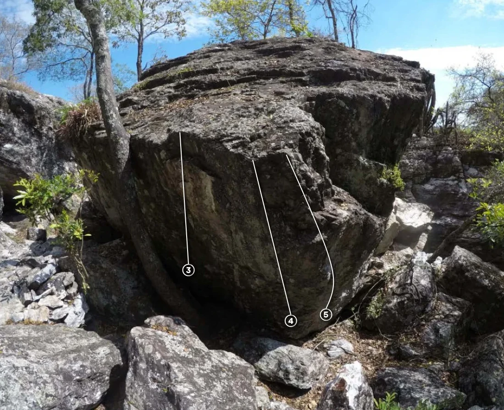
    - **largura_mapa**: 1099
    - **altura_mapa**: 895
    - **pontos_de_interesse**:
      - **[0]**:
        - **id**: 78hbcPC3JxJUSF
        - **uid**: 78hbcPC3JxJUSF
        - **rotulo**: 03
        - **circulo**:
          - **x**: 411
          - **y**: 590
          - **raio**: 12
        - **label**: 03
      - **[1]**:
        - **id**: SbotqR4jUIiUBh
        - **uid**: SbotqR4jUIiUBh
        - **rotulo**: 04
        - **circulo**:
          - **x**: 634
          - **y**: 700
          - **raio**: 12
        - **label**: 04
      - **[2]**:
        - **id**: bDXgtLmh3E6LLL
        - **uid**: bDXgtLmh3E6LLL
        - **rotulo**: 05
        - **circulo**:
          - **x**: 711
          - **y**: 687
          - **raio**: 12
        - **label**: 05
    - **referencias**:
      - **[0]**:
        - **alvo_uid**: RoRaerpVLHnnMi
        - **pontos_uids**:
          - 78hbcPC3JxJUSF
        - **escalada**: Consciência Limpa
        - **ids**:
          - 78hbcPC3JxJUSF
      - **[1]**:
        - **alvo_uid**: fRmptXErasQlWb
        - **pontos_uids**:
          - SbotqR4jUIiUBh
        - **escalada**: Consciência
        - **ids**:
          - SbotqR4jUIiUBh
      - **[2]**:
        - **alvo_uid**: OfkdNUdYCH06Je
        - **pontos_uids**:
          - bDXgtLmh3E6LLL
        - **escalada**: Mulheres Poderosas
        - **ids**:
          - bDXgtLmh3E6LLL
- **escaladas**:
  - **[0]**:
    - **uid**: AzAsVbpRR8NCmD
    - **boulder**:
      - **descricao**: Saída agachado em regletes bons e segue reto.
      - **nome**: Canarim
      - **dificuldade**: V2
  - **[1]**:
    - **uid**: 29ZNcyB4GZmTNv
    - **boulder**:
      - **descricao**: Saída agachado com as duas mãos em agarras boas laterais e vira a esquerda da planta.
      - **nome**: Sabiá
      - **dificuldade**: V1
  - **[2]**:
    - **uid**: RoRaerpVLHnnMi
    - **boulder**:
      - **descricao**: Saída sentado com mão direita em reglete lateral branco e esquerda proximo as pedras .
      - **nome**: Consciência Limpa
      - **dificuldade**: V2
  - **[3]**:
    - **uid**: fRmptXErasQlWb
    - **boulder**:
      - **descricao**: Saída agachado com as mãos juntas em batente baixo e segue reto pela aresta.
      - **nome**: Consciência
      - **dificuldade**: V1
  - **[4]**:
    - **uid**: OfkdNUdYCH06Je
    - **boulder**:
      - **descricao**: Saída agachado com mão direita em agarra lateral e esquerda na aresta.
      - **nome**: Mulheres Poderosas
      - **dificuldade**: V2
- **precomputados**:
  - **total_escaladas**: 5
  - **total_boulders**: 5

## Parte: setor_haiti

### Setor (Pico: Bocaina Park)

- **descricao**: # Setor Haiti
- **nome**: Haiti
- **uid**: vBnFROJdRpikVD
- **mapas**:
  - **[0]**:
    - **caminho_imagem_mapa**: 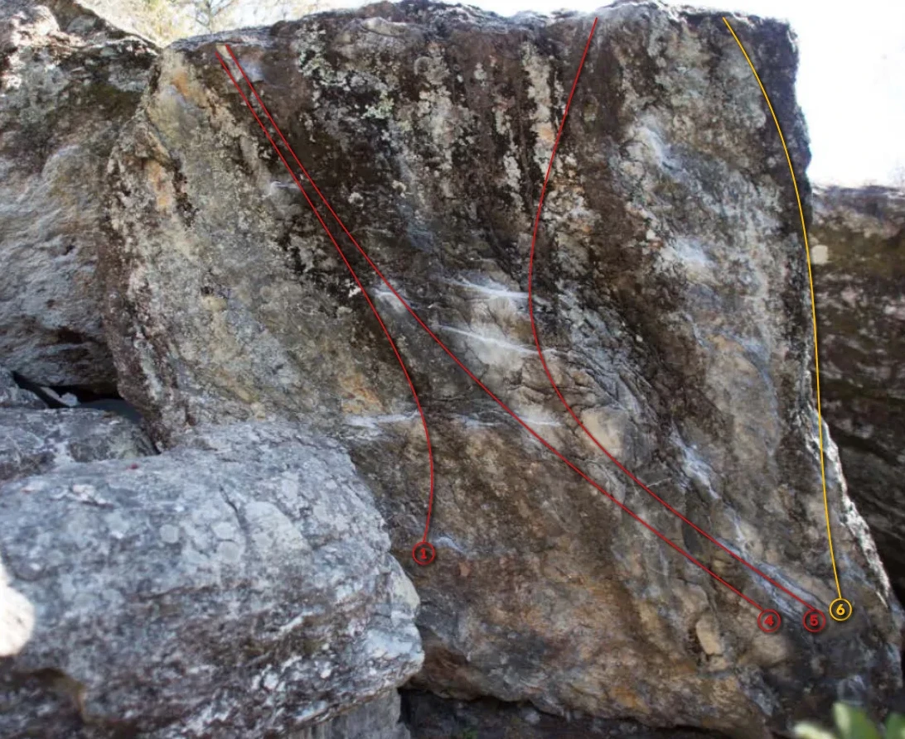
    - **largura_mapa**: 1092
    - **altura_mapa**: 893
    - **pontos_de_interesse**:
      - **[0]**:
        - **id**: FhtFb58a7CDhsN
        - **uid**: FhtFb58a7CDhsN
        - **rotulo**: 01
        - **circulo**:
          - **x**: 511
          - **y**: 669
          - **raio**: 13
        - **label**: 01
      - **[1]**:
        - **id**: GyCci4avj0ijDU
        - **uid**: GyCci4avj0ijDU
        - **rotulo**: 04
        - **circulo**:
          - **x**: 928
          - **y**: 750
          - **raio**: 13
        - **label**: 04
      - **[2]**:
        - **id**: uIrklHuN1gOLFp
        - **uid**: uIrklHuN1gOLFp
        - **rotulo**: 05
        - **circulo**:
          - **x**: 982
          - **y**: 750
          - **raio**: 13
        - **label**: 05
      - **[3]**:
        - **id**: a82fd2IbumPZSB
        - **uid**: a82fd2IbumPZSB
        - **rotulo**: 06
        - **circulo**:
          - **x**: 1015
          - **y**: 737
          - **raio**: 13
        - **label**: 06
      - **[4]**:
        - **id**: 4jvfro2mDUFwwJ
        - **uid**: 4jvfro2mDUFwwJ
        - **rotulo**: 1_fim
        - **circulo**:
          - **x**: 265
          - **y**: 56
          - **raio**: 13
        - **label**: 1_fim
      - **[5]**:
        - **id**: 3ohbSe7X3MrtxA
        - **uid**: 3ohbSe7X3MrtxA
        - **rotulo**: 2
        - **circulo**:
          - **x**: 721
          - **y**: 22
          - **raio**: 14
        - **label**: 2
    - **referencias**:
      - **[0]**:
        - **alvo_uid**: VrjDDeA6mDcMnW
        - **pontos_uids**:
          - FhtFb58a7CDhsN
          - 3
        - **escalada**: Jamaica Abaixo de Zero
        - **ids**:
          - FhtFb58a7CDhsN
          - 3
      - **[1]**:
        - **alvo_uid**: pSI1abxmrFvsOU
        - **pontos_uids**:
          - GyCci4avj0ijDU
        - **escalada**: Taiti
        - **ids**:
          - GyCci4avj0ijDU
      - **[2]**:
        - **alvo_uid**: ykABlKVEdX4WnL
        - **pontos_uids**:
          - uIrklHuN1gOLFp
        - **escalada**: Haiti
        - **ids**:
          - uIrklHuN1gOLFp
      - **[3]**:
        - **alvo_uid**: rZvDU2nJVOIFQX
        - **pontos_uids**:
          - a82fd2IbumPZSB
        - **escalada**: Nem Lá, Nem Cá
        - **ids**:
          - a82fd2IbumPZSB
      - **[4]**:
        - **alvo_uid**: whjMmhNnbP413h
        - **pontos_uids**:
          - FhtFb58a7CDhsN
          - 3ohbSe7X3MrtxA
        - **escalada**: Jamaica
        - **ids**:
          - FhtFb58a7CDhsN
          - 3ohbSe7X3MrtxA
- **escaladas**:
  - **[0]**:
    - **uid**: VrjDDeA6mDcMnW
    - **boulder**:
      - **descricao**: Saída sentado com a mão esquerda em reglete e direita em batente pequeno, seguindo reto virando no Taiti.
      - **nome**: Jamaica Abaixo de Zero
      - **dificuldade**: V7
  - **[1]**:
    - **uid**: whjMmhNnbP413h
    - **boulder**:
      - **descricao**: Saída do Jamaica Abaixo de Zero seguindo para direita virando no Haiti.
      - **nome**: Jamaica
      - **dificuldade**: V6
  - **[2]**:
    - **uid**: DsRz9n1F0hk9Kt
    - **boulder**:
      - **descricao**: Saída do Jamaica Abaixo de Zero, virando à esquerda do Taiti.
      - **nome**: Kuaiti
      - **dificuldade**: V8
  - **[3]**:
    - **uid**: pSI1abxmrFvsOU
    - **boulder**:
      - **descricao**: Saída sentado com as mãos juntas em batente grande seguindo para batentes lisos e virando a esquerda no bloco.
      - **nome**: Taiti
      - **dificuldade**: V7
  - **[4]**:
    - **uid**: ykABlKVEdX4WnL
    - **boulder**:
      - **descricao**: Mesma saída do Taíti seguindo a esquerda até batentes escorrido e virando reto.
      - **nome**: Haiti
      - **dificuldade**: V7
  - **[5]**:
    - **uid**: rZvDU2nJVOIFQX
    - **boulder**:
      - **descricao**: Mesma saída do Haíti seguindo pela aresta em regletes laterais e virando reto.
      - **nome**: Nem Lá, Nem Cá
      - **dificuldade**: V5
- **precomputados**:
  - **total_escaladas**: 6
  - **total_boulders**: 6

## Parte: setor_achados_e_perdidos

### Setor (Pico: Bocaina Park)

- **descricao**: # Setor Achados e Perdidos
- **nome**: Achados e Perdidos
- **uid**: ZQv26maQUVi4h5
- **mapas**:
  - **[0]**:
    - **caminho_imagem_mapa**: 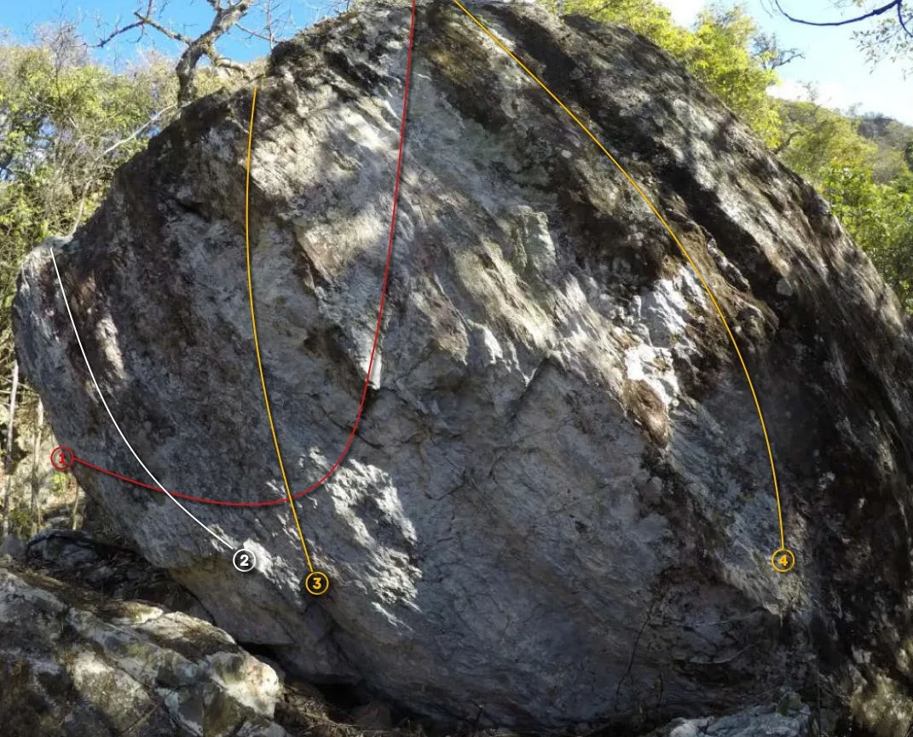
    - **largura_mapa**: 1071
    - **altura_mapa**: 865
    - **pontos_de_interesse**:
      - **[0]**:
        - **id**: Ov15ZNOC8paRFS
        - **uid**: Ov15ZNOC8paRFS
        - **rotulo**: 01
        - **circulo**:
          - **x**: 73
          - **y**: 538
          - **raio**: 12
        - **label**: 01
      - **[1]**:
        - **id**: jsuTMbKsoAro5q
        - **uid**: jsuTMbKsoAro5q
        - **rotulo**: 02
        - **circulo**:
          - **x**: 286
          - **y**: 658
          - **raio**: 12
        - **label**: 02
      - **[2]**:
        - **id**: ItoM2tBPnzTHYV
        - **uid**: ItoM2tBPnzTHYV
        - **rotulo**: 03
        - **circulo**:
          - **x**: 372
          - **y**: 684
          - **raio**: 12
        - **label**: 03
      - **[3]**:
        - **id**: Cfqap3oLYMVGtt
        - **uid**: Cfqap3oLYMVGtt
        - **rotulo**: 04
        - **circulo**:
          - **x**: 919
          - **y**: 658
          - **raio**: 13
        - **label**: 04
    - **referencias**:
      - **[0]**:
        - **alvo_uid**: 6MTjT97QEndL2p
        - **pontos_uids**:
          - Ov15ZNOC8paRFS
        - **escalada**: Fala Comigo
        - **ids**:
          - Ov15ZNOC8paRFS
      - **[1]**:
        - **alvo_uid**: Svg4YvJNez9SA3
        - **pontos_uids**:
          - jsuTMbKsoAro5q
        - **escalada**: Tendinite No More
        - **ids**:
          - jsuTMbKsoAro5q
      - **[2]**:
        - **alvo_uid**: WRQQlvWvCjpt2F
        - **pontos_uids**:
          - ItoM2tBPnzTHYV
        - **escalada**: Atitude no Trecho
        - **ids**:
          - ItoM2tBPnzTHYV
      - **[3]**:
        - **alvo_uid**: KZZyZqWtJhhWkP
        - **pontos_uids**:
          - Cfqap3oLYMVGtt
        - **escalada**: Achados e Perdidos
        - **ids**:
          - Cfqap3oLYMVGtt
- **escaladas**:
  - **[0]**:
    - **uid**: 6MTjT97QEndL2p
    - **boulder**:
      - **descricao**: saida agachado com as mãos em agarrao a esquerda do bloco e faz uma travessia para direita e vira no centro do bloco no boulder atitude no trecho.
      - **nome**: Fala Comigo
      - **dificuldade**: V6
  - **[1]**:
    - **uid**: Svg4YvJNez9SA3
    - **boulder**:
      - **descricao**: Saida do atitude no trecho e segue para esquerda.
      - **nome**: Tendinite No More
      - **dificuldade**: V2
  - **[2]**:
    - **uid**: WRQQlvWvCjpt2F
    - **boulder**:
      - **descricao**: saida agachado com as duas maos juntas em um cristal e segue reto (no meio do bloco).
      - **nome**: Atitude no Trecho
      - **dificuldade**: V3
  - **[3]**:
    - **uid**: KZZyZqWtJhhWkP
    - **boulder**:
      - **descricao**: Saida em pé a direita do bloco com mão direita em pinça escorrida e esquerda de balcão no equilibrio e segue pela esquerda.
      - **nome**: Achados e Perdidos
      - **dificuldade**: V3
- **precomputados**:
  - **total_escaladas**: 4
  - **total_boulders**: 4

## Parte: setor_bloco_do_rock_bocaina

### Setor (Pico: Bocaina Park)

- **descricao**: # Setor Bloco do Rock Bocaina
- **nome**: Bloco do Rock Bocaina
- **uid**: hkr7E07rMsU03N
- **mapas**:
  - **[0]**:
    - **caminho_imagem_mapa**: 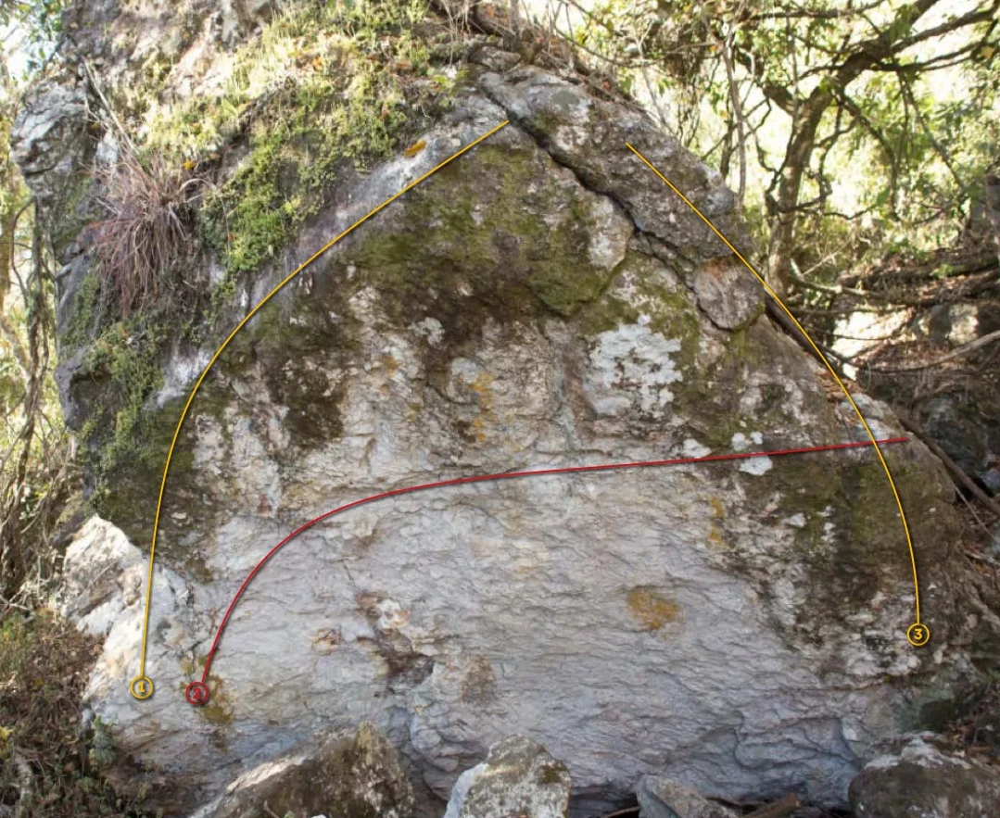
    - **largura_mapa**: 1079
    - **altura_mapa**: 883
    - **pontos_de_interesse**:
      - **[0]**:
        - **id**: xH9PTlH2K9PaGA
        - **uid**: xH9PTlH2K9PaGA
        - **rotulo**: 01
        - **circulo**:
          - **x**: 153
          - **y**: 742
          - **raio**: 11
        - **label**: 01
      - **[1]**:
        - **id**: DFUHpcIj1YGZi9
        - **uid**: DFUHpcIj1YGZi9
        - **rotulo**: 02
        - **circulo**:
          - **x**: 213
          - **y**: 748
          - **raio**: 11
        - **label**: 02
      - **[2]**:
        - **id**: 0VAwiGnZoMnA7B
        - **uid**: 0VAwiGnZoMnA7B
        - **rotulo**: 03
        - **circulo**:
          - **x**: 991
          - **y**: 685
          - **raio**: 11
        - **label**: 03
    - **referencias**:
      - **[0]**:
        - **alvo_uid**: DospLln4vrrRIa
        - **pontos_uids**:
          - xH9PTlH2K9PaGA
        - **escalada**: Açaí Bocaina
        - **ids**:
          - xH9PTlH2K9PaGA
      - **[1]**:
        - **alvo_uid**: aAcYxTKwQP83PQ
        - **pontos_uids**:
          - DFUHpcIj1YGZi9
        - **escalada**: Rock Bocaina
        - **ids**:
          - DFUHpcIj1YGZi9
      - **[2]**:
        - **alvo_uid**: i73Feh4FJLDh9q
        - **pontos_uids**:
          - 0VAwiGnZoMnA7B
        - **escalada**: Dedão de Aquiles
        - **ids**:
          - 0VAwiGnZoMnA7B
- **escaladas**:
  - **[0]**:
    - **uid**: DospLln4vrrRIa
    - **boulder**:
      - **descricao**: Saida em pé a esquerda do bloco com as mãos em agarrões e segue a aresta por cima virando no centro do bloco.
      - **nome**: Açaí Bocaina
      - **dificuldade**: V5
  - **[1]**:
    - **uid**: aAcYxTKwQP83PQ
    - **boulder**:
      - **descricao**: Saida do acai bocaina, e segue travessia para direita por baixo dominando no final .
      - **nome**: Rock Bocaina
      - **dificuldade**: V8
  - **[2]**:
    - **uid**: i73Feh4FJLDh9q
    - **boulder**:
      - **descricao**: Saída da aresta a direita do bloco e vai arestando até o topo.
      - **nome**: Dedão de Aquiles
      - **dificuldade**: V3
- **precomputados**:
  - **total_escaladas**: 3
  - **total_boulders**: 3

## Parte: setor_bloco_45

### Setor (Pico: Bocaina Park)

- **descricao**: # Setor Bloco 45º
- **nome**: Bloco 45º
- **uid**: iZezgdH50SBgEG
- **mapas**:
  - **[0]**:
    - **caminho_imagem_mapa**: 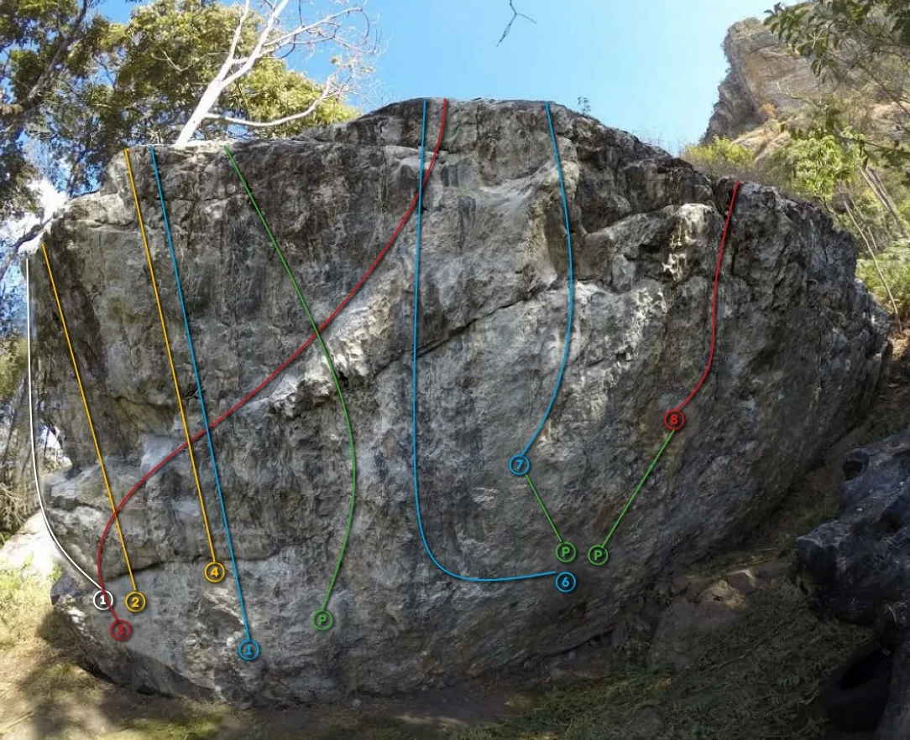
    - **largura_mapa**: 1084
    - **altura_mapa**: 883
    - **pontos_de_interesse**:
      - **[0]**:
        - **id**: mvHJiGGC0TT6wj
        - **uid**: mvHJiGGC0TT6wj
        - **rotulo**: 01
        - **circulo**:
          - **x**: 123
          - **y**: 716
          - **raio**: 11
        - **label**: 01
      - **[1]**:
        - **id**: MaKXkzxTpKAONV
        - **uid**: MaKXkzxTpKAONV
        - **rotulo**: 02
        - **circulo**:
          - **x**: 161
          - **y**: 718
          - **raio**: 11
        - **label**: 02
      - **[2]**:
        - **id**: 2srhDFdc437Aud
        - **uid**: 2srhDFdc437Aud
        - **rotulo**: 03
        - **circulo**:
          - **x**: 143
          - **y**: 752
          - **raio**: 11
        - **label**: 03
      - **[3]**:
        - **id**: 02gLzrf1qOvv04
        - **uid**: 02gLzrf1qOvv04
        - **rotulo**: 04
        - **circulo**:
          - **x**: 256
          - **y**: 683
          - **raio**: 11
        - **label**: 04
      - **[4]**:
        - **id**: DKlTPWQzGFDaAn
        - **uid**: DKlTPWQzGFDaAn
        - **rotulo**: 05
        - **circulo**:
          - **x**: 296
          - **y**: 775
          - **raio**: 11
        - **label**: 05
      - **[5]**:
        - **id**: Q84HXACSSluDIv
        - **uid**: Q84HXACSSluDIv
        - **rotulo**: 07
        - **circulo**:
          - **x**: 618
          - **y**: 554
          - **raio**: 11
        - **label**: 07
      - **[6]**:
        - **id**: 4okay9Mgep0XTd
        - **uid**: 4okay9Mgep0XTd
        - **rotulo**: 08
        - **circulo**:
          - **x**: 803
          - **y**: 501
          - **raio**: 11
        - **label**: 08
      - **[7]**:
        - **id**: UqEOCKyj2rttNj
        - **uid**: UqEOCKyj2rttNj
        - **rotulo**: P
        - **circulo**:
          - **x**: 384
          - **y**: 740
          - **raio**: 11
        - **label**: P
      - **[8]**:
        - **id**: ZWCwFmXJG23aZv
        - **uid**: ZWCwFmXJG23aZv
        - **rotulo**: P
        - **circulo**:
          - **x**: 674
          - **y**: 659
          - **raio**: 11
        - **label**: P
      - **[9]**:
        - **id**: FgMHh1l7UzZHE9
        - **uid**: FgMHh1l7UzZHE9
        - **rotulo**: P
        - **circulo**:
          - **x**: 712
          - **y**: 662
          - **raio**: 11
        - **label**: P
      - **[10]**:
        - **id**: 1lPKuoVwNNy6XE
        - **uid**: 1lPKuoVwNNy6XE
        - **rotulo**: 06
        - **circulo**:
          - **x**: 674
          - **y**: 695
          - **raio**: 11
        - **label**: 06
    - **referencias**:
      - **[0]**:
        - **alvo_uid**: TdBZjNMFkAaV9D
        - **pontos_uids**:
          - mvHJiGGC0TT6wj
        - **escalada**: Esquina do Gueto
        - **ids**:
          - mvHJiGGC0TT6wj
      - **[1]**:
        - **alvo_uid**: A5CATmQ4mbzcON
        - **pontos_uids**:
          - MaKXkzxTpKAONV
        - **escalada**: Bem-Vindo
        - **ids**:
          - MaKXkzxTpKAONV
      - **[2]**:
        - **alvo_uid**: jEKmEQkJzKkbof
        - **pontos_uids**:
          - 2srhDFdc437Aud
        - **escalada**: Siri Cascudo
        - **ids**:
          - 2srhDFdc437Aud
      - **[3]**:
        - **alvo_uid**: RgVlqgXPTuKESi
        - **pontos_uids**:
          - 02gLzrf1qOvv04
        - **escalada**: Índios
        - **ids**:
          - 02gLzrf1qOvv04
      - **[4]**:
        - **alvo_uid**: zgPCV5sX3RT5mv
        - **pontos_uids**:
          - DKlTPWQzGFDaAn
        - **escalada**: Índios SDS
        - **ids**:
          - DKlTPWQzGFDaAn
      - **[5]**:
        - **alvo_uid**: kCkw4BwSQ66JQY
        - **pontos_uids**:
          - 1lPKuoVwNNy6XE
        - **escalada**: Família Bocaina
        - **ids**:
          - 1lPKuoVwNNy6XE
      - **[6]**:
        - **alvo_uid**: hGMouLYyRGoSf8
        - **pontos_uids**:
          - Q84HXACSSluDIv
        - **escalada**: Sananga
        - **ids**:
          - Q84HXACSSluDIv
      - **[7]**:
        - **alvo_uid**: mTlIhLNDau9a7w
        - **pontos_uids**:
          - 4okay9Mgep0XTd
        - **escalada**: Espírito San
        - **ids**:
          - 4okay9Mgep0XTd
  - **[1]**:
    - **caminho_imagem_mapa**: 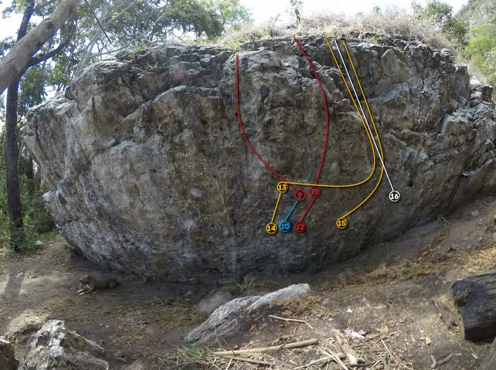
    - **largura_mapa**: 1091
    - **altura_mapa**: 813
    - **pontos_de_interesse**:
      - **[0]**:
        - **id**: yTJ6hZxe7sh2Q9
        - **uid**: yTJ6hZxe7sh2Q9
        - **rotulo**: 09
        - **circulo**:
          - **x**: 660
          - **y**: 429
          - **raio**: 11
        - **label**: 09
      - **[1]**:
        - **id**: BwCUNu7Y1Sekg3
        - **uid**: BwCUNu7Y1Sekg3
        - **rotulo**: 10
        - **circulo**:
          - **x**: 627
          - **y**: 498
          - **raio**: 11
        - **label**: 10
      - **[2]**:
        - **id**: YSiSC36Y2pwRMa
        - **uid**: YSiSC36Y2pwRMa
        - **rotulo**: 11
        - **circulo**:
          - **x**: 691
          - **y**: 421
          - **raio**: 11
        - **label**: 11
      - **[3]**:
        - **id**: UmXtCyKAdHUHJS
        - **uid**: UmXtCyKAdHUHJS
        - **rotulo**: 12
        - **circulo**:
          - **x**: 660
          - **y**: 498
          - **raio**: 11
        - **label**: 12
      - **[4]**:
        - **id**: YrbrDb9p8hPVqs
        - **uid**: YrbrDb9p8hPVqs
        - **rotulo**: 13
        - **circulo**:
          - **x**: 621
          - **y**: 411
          - **raio**: 11
        - **label**: 13
      - **[5]**:
        - **id**: no6uX0zqpcGt2S
        - **uid**: no6uX0zqpcGt2S
        - **rotulo**: 14
        - **circulo**:
          - **x**: 597
          - **y**: 502
          - **raio**: 11
        - **label**: 14
      - **[6]**:
        - **id**: tOWDdbPMmnwS4i
        - **uid**: tOWDdbPMmnwS4i
        - **rotulo**: 15
        - **circulo**:
          - **x**: 752
          - **y**: 490
          - **raio**: 11
        - **label**: 15
      - **[7]**:
        - **id**: G6FAlAqwWpH5lQ
        - **uid**: G6FAlAqwWpH5lQ
        - **rotulo**: 16
        - **circulo**:
          - **x**: 868
          - **y**: 431
          - **raio**: 11
        - **label**: 16
    - **referencias**:
      - **[0]**:
        - **alvo_uid**: 5j5RDqWyI5pH6E
        - **pontos_uids**:
          - yTJ6hZxe7sh2Q9
        - **escalada**: Tiro ao Alvo
        - **ids**:
          - yTJ6hZxe7sh2Q9
      - **[1]**:
        - **alvo_uid**: e5osFqSTv1yRnl
        - **pontos_uids**:
          - BwCUNu7Y1Sekg3
        - **escalada**: Tiro ao Alvo SDS
        - **ids**:
          - BwCUNu7Y1Sekg3
      - **[2]**:
        - **alvo_uid**: SFtPEGjCitlzP3
        - **pontos_uids**:
          - YSiSC36Y2pwRMa
        - **escalada**: Mão na Massa
        - **ids**:
          - YSiSC36Y2pwRMa
      - **[3]**:
        - **alvo_uid**: 2ORMfj30jI9Ore
        - **pontos_uids**:
          - UmXtCyKAdHUHJS
        - **escalada**: Mão na Massa SDS
        - **ids**:
          - UmXtCyKAdHUHJS
      - **[4]**:
        - **alvo_uid**: 2cKX9mHLW4grYR
        - **pontos_uids**:
          - YrbrDb9p8hPVqs
        - **escalada**: Bicho de Pé
        - **ids**:
          - YrbrDb9p8hPVqs
      - **[5]**:
        - **alvo_uid**: bSbc4MZmq3iZ0S
        - **pontos_uids**:
          - no6uX0zqpcGt2S
        - **escalada**: Bicho de Pé SDS
        - **ids**:
          - no6uX0zqpcGt2S
      - **[6]**:
        - **alvo_uid**: vN7FOp4blYdvKc
        - **pontos_uids**:
          - tOWDdbPMmnwS4i
        - **escalada**: Curto e Gross
        - **ids**:
          - tOWDdbPMmnwS4i
      - **[7]**:
        - **alvo_uid**: 117Soh4aoEHw6l
        - **pontos_uids**:
          - G6FAlAqwWpH5lQ
        - **escalada**: Carvoeiro
        - **ids**:
          - G6FAlAqwWpH5lQ
  - **[2]**:
    - **caminho_imagem_mapa**: 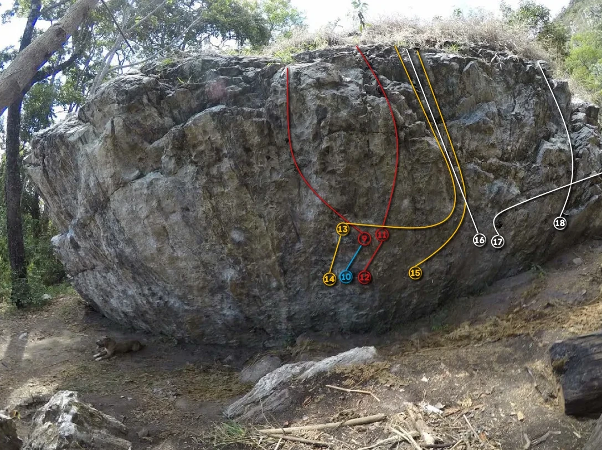
    - **largura_mapa**: 1087
    - **altura_mapa**: 812
    - **pontos_de_interesse**:
      - **[0]**:
        - **id**: GRltwvsxlkGCNN
        - **uid**: GRltwvsxlkGCNN
        - **rotulo**: 09
        - **circulo**:
          - **x**: 658
          - **y**: 431
          - **raio**: 11
        - **label**: 09
      - **[1]**:
        - **id**: YOMHgNryHpqEmt
        - **uid**: YOMHgNryHpqEmt
        - **rotulo**: 10
        - **circulo**:
          - **x**: 625
          - **y**: 499
          - **raio**: 11
        - **label**: 10
      - **[2]**:
        - **id**: cRnKxhDlh8Dpda
        - **uid**: cRnKxhDlh8Dpda
        - **rotulo**: 11
        - **circulo**:
          - **x**: 690
          - **y**: 423
          - **raio**: 11
        - **label**: 11
      - **[3]**:
        - **id**: Ri77RYIprayDJU
        - **uid**: Ri77RYIprayDJU
        - **rotulo**: 12
        - **circulo**:
          - **x**: 658
          - **y**: 500
          - **raio**: 11
        - **label**: 12
      - **[4]**:
        - **id**: dByo13RcijrdnK
        - **uid**: dByo13RcijrdnK
        - **rotulo**: 13
        - **circulo**:
          - **x**: 619
          - **y**: 413
          - **raio**: 11
        - **label**: 13
      - **[5]**:
        - **id**: YOAaqn7ekKwgoh
        - **uid**: YOAaqn7ekKwgoh
        - **rotulo**: 14
        - **circulo**:
          - **x**: 595
          - **y**: 503
          - **raio**: 11
        - **label**: 14
      - **[6]**:
        - **id**: qRXu6SzB2MuNzu
        - **uid**: qRXu6SzB2MuNzu
        - **rotulo**: 15
        - **circulo**:
          - **x**: 750
          - **y**: 493
          - **raio**: 11
        - **label**: 15
      - **[7]**:
        - **id**: Yxi3URgekTxOlF
        - **uid**: Yxi3URgekTxOlF
        - **rotulo**: 16
        - **circulo**:
          - **x**: 866
          - **y**: 433
          - **raio**: 11
        - **label**: 16
      - **[8]**:
        - **id**: 6OsqoKgTmvtSxl
        - **uid**: 6OsqoKgTmvtSxl
        - **rotulo**: 17
        - **circulo**:
          - **x**: 899
          - **y**: 436
          - **raio**: 11
        - **label**: 17
      - **[9]**:
        - **id**: KAegtkFDEyeUGI
        - **uid**: KAegtkFDEyeUGI
        - **rotulo**: 18
        - **circulo**:
          - **x**: 1011
          - **y**: 403
          - **raio**: 11
        - **label**: 18
    - **referencias**:
      - **[0]**:
        - **alvo_uid**: 5j5RDqWyI5pH6E
        - **pontos_uids**:
          - GRltwvsxlkGCNN
        - **escalada**: Tiro ao Alvo
        - **ids**:
          - GRltwvsxlkGCNN
      - **[1]**:
        - **alvo_uid**: e5osFqSTv1yRnl
        - **pontos_uids**:
          - YOMHgNryHpqEmt
        - **escalada**: Tiro ao Alvo SDS
        - **ids**:
          - YOMHgNryHpqEmt
      - **[2]**:
        - **alvo_uid**: SFtPEGjCitlzP3
        - **pontos_uids**:
          - cRnKxhDlh8Dpda
        - **escalada**: Mão na Massa
        - **ids**:
          - cRnKxhDlh8Dpda
      - **[3]**:
        - **alvo_uid**: 2ORMfj30jI9Ore
        - **pontos_uids**:
          - Ri77RYIprayDJU
        - **escalada**: Mão na Massa SDS
        - **ids**:
          - Ri77RYIprayDJU
      - **[4]**:
        - **alvo_uid**: 2cKX9mHLW4grYR
        - **pontos_uids**:
          - dByo13RcijrdnK
        - **escalada**: Bicho de Pé
        - **ids**:
          - dByo13RcijrdnK
      - **[5]**:
        - **alvo_uid**: bSbc4MZmq3iZ0S
        - **pontos_uids**:
          - YOAaqn7ekKwgoh
        - **escalada**: Bicho de Pé SDS
        - **ids**:
          - YOAaqn7ekKwgoh
      - **[6]**:
        - **alvo_uid**: vN7FOp4blYdvKc
        - **pontos_uids**:
          - qRXu6SzB2MuNzu
        - **escalada**: Curto e Gross
        - **ids**:
          - qRXu6SzB2MuNzu
      - **[7]**:
        - **alvo_uid**: 117Soh4aoEHw6l
        - **pontos_uids**:
          - Yxi3URgekTxOlF
        - **escalada**: Carvoeiro
        - **ids**:
          - Yxi3URgekTxOlF
      - **[8]**:
        - **alvo_uid**: ZLg4DW5jK5sKLO
        - **pontos_uids**:
          - 6OsqoKgTmvtSxl
        - **escalada**: Kadron
        - **ids**:
          - 6OsqoKgTmvtSxl
      - **[9]**:
        - **alvo_uid**: iTuKSE2ptAEKMC
        - **pontos_uids**:
          - KAegtkFDEyeUGI
        - **escalada**: Saída pela Culatra
        - **ids**:
          - KAegtkFDEyeUGI
- **escaladas**:
  - **[0]**:
    - **uid**: TdBZjNMFkAaV9D
    - **boulder**:
      - **descricao**: Saída do bem vindo e entra para a face da esquerda da pedra, virando por ela.
      - **nome**: Esquina do Gueto
      - **dificuldade**: V2
  - **[1]**:
    - **uid**: A5CATmQ4mbzcON
    - **boulder**:
      - **descricao**: Saída sentado com as mãos em dois bicos baixos, a esquerda do bloco, segue reto.
      - **nome**: Bem-Vindo
      - **dificuldade**: V4
  - **[2]**:
    - **uid**: jEKmEQkJzKkbof
    - **boulder**:
      - **descricao**: Saída do bem vindo, virando no Família Bocaina.
      - **nome**: Siri Cascudo
      - **dificuldade**: V6
  - **[3]**:
    - **uid**: RgVlqgXPTuKESi
    - **boulder**:
      - **descricao**: Saída do bem vindo,seguindo batente ou fenda horizontal bem marcada, virando no tiro ao alvo.
      - **nome**: Índios
      - **dificuldade**: V5
  - **[4]**:
    - **uid**: zgPCV5sX3RT5mv
    - **boulder**:
      - **descricao**: Saída sentado com mão direita em reglete pequeno e calcanhar esquerdo na mão esquerda em agarrao, segue reto, passando pelo reglete da fenda vertical.
      - **nome**: Índios SDS
      - **dificuldade**: V9
  - **[5]**:
    - **uid**: kCkw4BwSQ66JQY
    - **boulder**:
      - **descricao**: Saída sentado com a mão direita em reglete bom e esquerda junta na mesma agarra, saindo para uma agarra de ombro de esquerda.
      - **nome**: Família Bocaina
      - **dificuldade**: V10
  - **[6]**:
    - **uid**: hGMouLYyRGoSf8
    - **boulder**:
      - **descricao**: Saída em pé com as mãos em regletes invertidos.
      - **nome**: Sananga
      - **dificuldade**: V9
  - **[7]**:
    - **uid**: mTlIhLNDau9a7w
    - **boulder**:
      - **descricao**: Saída em pé com a mão esquerda em reglete pequeno e mão direita em mono dedo.
      - **nome**: Espírito San
      - **dificuldade**: V8_BARRA_V9
  - **[8]**:
    - **uid**: 5j5RDqWyI5pH6E
    - **boulder**:
      - **descricao**: Saída agachado com mão esquerda em um buraco abaulado e mão esquerda em reglete ruim.
      - **nome**: Tiro ao Alvo
      - **dificuldade**: V8
  - **[9]**:
    - **uid**: e5osFqSTv1yRnl
    - **boulder**:
      - **descricao**: Saída sentado com mão esquerda em reglete pequeno e direita em reglete liso com o pÉ esquerdo alto.
      - **nome**: Tiro ao Alvo SDS
      - **dificuldade**: V10
  - **[10]**:
    - **uid**: SFtPEGjCitlzP3
    - **boulder**:
      - **descricao**: Mesma agarra de saida do tiro ao alvo e vai pra direita.
      - **nome**: Mão na Massa
      - **dificuldade**: V7
  - **[11]**:
    - **uid**: 2ORMfj30jI9Ore
    - **boulder**:
      - **descricao**: Saida do tiro ao alvo SDS e vai pra direita.
      - **nome**: Mão na Massa SDS
      - **dificuldade**: V8
  - **[12]**:
    - **uid**: 2cKX9mHLW4grYR
    - **boulder**:
      - **descricao**: Mesma saida do tiro ao alvo a vai pra direita por baixo e vira no carvoeiro.
      - **nome**: Bicho de Pé
      - **dificuldade**: V5
  - **[13]**:
    - **uid**: bSbc4MZmq3iZ0S
    - **boulder**:
      - **descricao**: Saida do tiro ao alvo SDS e vira no carvoeiro.
      - **nome**: Bicho de Pé SDS
      - **dificuldade**: V6
  - **[14]**:
    - **uid**: vN7FOp4blYdvKc
    - **boulder**:
      - **descricao**: SaÍdA sentado com as duas mãos juntas em reglete batente ruim e pés ruins.
      - **nome**: Curto e Gross
      - **dificuldade**: V4
  - **[15]**:
    - **uid**: 117Soh4aoEHw6l
    - **boulder**:
      - **descricao**: SaÍda agachado com as mãos em dois agarroes e segue em fenda diagonal pra esquerda em agarroes.
      - **nome**: Carvoeiro
      - **dificuldade**: V1
  - **[16]**:
    - **uid**: ZLg4DW5jK5sKLO
    - **boulder**:
      - **descricao**: Saída do carvoeiro e faz travessia para direita contornando o bloco.
      - **nome**: Kadron
      - **dificuldade**: V3
  - **[17]**:
    - **uid**: iTuKSE2ptAEKMC
    - **boulder**:
      - **descricao**: Sai sentado com as mãos em agarrao a direita do bloco e segue reto.
      - **nome**: Saída pela Culatra
      - **dificuldade**: V2
  - **[18]**:
    - **uid**: qtBT8cki30jCS4
    - **boulder**:
      - **descricao**: Saída do bem vindo e virando no índios.
      - **nome**: Siri sem Casca
      - **dificuldade**: V6
  - **[19]**:
    - **uid**: gRvZz219LrdWkq
    - **boulder**:
      - **descricao**: Saída do bem vindo,seguindo batente ou fenda horizontal bem marcada, virando no tiro ao alvo.
      - **nome**: Siri Queijo
      - **dificuldade**: V7
  - **[20]**:
    - **uid**: CBzxeV1m1nvHB0
    - **boulder**:
      - **descricao**: Saída com a mão esquerda em escama na fenda, mão direita em agarrão baixo com calcanhar esquerdo na altura da mão esquerda, virando no Siri queijo.
      - **nome**: Problema Legal
      - **dificuldade**: V7
  - **[21]**:
    - **uid**: GdAqgqzZrqm0Yz
    - **boulder**:
      - **descricao**: Saída do sananga virando no Família Bocaina.
      - **nome**: Pecado de Chó
      - **dificuldade**: V10_BARRA_V11
  - **[22]**:
    - **uid**: P44HuqThR8jWbr
    - **boulder**:
      - **descricao**: Saída do sananga virando no indios.
      - **nome**: Ayuaska
      - **dificuldade**: V11
- **precomputados**:
  - **total_escaladas**: 23
  - **total_boulders**: 23

## Parte: setor_essencia

### Setor (Pico: Bocaina Park)

- **descricao**: # Setor Essência
- **nome**: Essência
- **uid**: Y3Brqzt8DNN8Mk
- **mapas**:
  - **[0]**:
    - **caminho_imagem_mapa**: 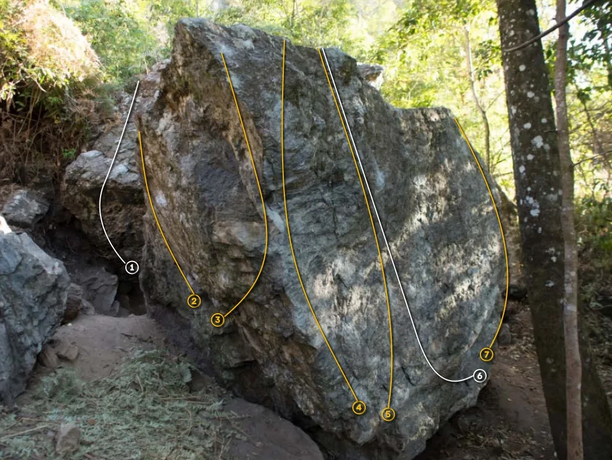
    - **largura_mapa**: 1089
    - **altura_mapa**: 818
    - **pontos_de_interesse**:
      - **[0]**:
        - **id**: glCtcnJevvaSZN
        - **uid**: glCtcnJevvaSZN
        - **rotulo**: 01
        - **circulo**:
          - **x**: 235
          - **y**: 475
          - **raio**: 11
        - **label**: 01
      - **[1]**:
        - **id**: MQRHQWmgmDwC9M
        - **uid**: MQRHQWmgmDwC9M
        - **rotulo**: 02
        - **circulo**:
          - **x**: 345
          - **y**: 535
          - **raio**: 11
        - **label**: 02
      - **[2]**:
        - **id**: lYw2RkYinavgTv
        - **uid**: lYw2RkYinavgTv
        - **rotulo**: 03
        - **circulo**:
          - **x**: 387
          - **y**: 569
          - **raio**: 11
        - **label**: 03
      - **[3]**:
        - **id**: IWoypEQIlAfWRc
        - **uid**: IWoypEQIlAfWRc
        - **rotulo**: 04
        - **circulo**:
          - **x**: 639
          - **y**: 725
          - **raio**: 11
        - **label**: 04
      - **[4]**:
        - **id**: KLrj3jqTsxgVkw
        - **uid**: KLrj3jqTsxgVkw
        - **rotulo**: 05
        - **circulo**:
          - **x**: 691
          - **y**: 737
          - **raio**: 11
        - **label**: 05
      - **[5]**:
        - **id**: jKfIC6lPVN7XjA
        - **uid**: jKfIC6lPVN7XjA
        - **rotulo**: 06
        - **circulo**:
          - **x**: 854
          - **y**: 668
          - **raio**: 11
        - **label**: 06
      - **[6]**:
        - **id**: 6i5eONlq7l9Yu4
        - **uid**: 6i5eONlq7l9Yu4
        - **rotulo**: 07
        - **circulo**:
          - **x**: 866
          - **y**: 630
          - **raio**: 11
        - **label**: 07
    - **referencias**:
      - **[0]**:
        - **alvo_uid**: 2O9dAPtU2R7uaq
        - **pontos_uids**:
          - glCtcnJevvaSZN
        - **escalada**: Agricultor
        - **ids**:
          - glCtcnJevvaSZN
      - **[1]**:
        - **alvo_uid**: m5Ae6ekD6Aja44
        - **pontos_uids**:
          - MQRHQWmgmDwC9M
        - **escalada**: Garimpeiro
        - **ids**:
          - MQRHQWmgmDwC9M
      - **[2]**:
        - **alvo_uid**: BoslIdr2KQEgqb
        - **pontos_uids**:
          - lYw2RkYinavgTv
        - **escalada**: A Regra é Clara
        - **ids**:
          - lYw2RkYinavgTv
      - **[3]**:
        - **alvo_uid**: miVPNcX7iuFApo
        - **pontos_uids**:
          - IWoypEQIlAfWRc
        - **escalada**: Essência
        - **ids**:
          - IWoypEQIlAfWRc
      - **[4]**:
        - **alvo_uid**: FCSwjipzAwHXBG
        - **pontos_uids**:
          - KLrj3jqTsxgVkw
        - **escalada**: Indecência
        - **ids**:
          - KLrj3jqTsxgVkw
      - **[5]**:
        - **alvo_uid**: DVFMiuNy0vgHGi
        - **pontos_uids**:
          - jKfIC6lPVN7XjA
        - **escalada**: Regra do Jogo
        - **ids**:
          - jKfIC6lPVN7XjA
      - **[6]**:
        - **alvo_uid**: FtYAbgHRT22SRW
        - **pontos_uids**:
          - 6i5eONlq7l9Yu4
        - **escalada**: Carta de Euforia
        - **ids**:
          - 6i5eONlq7l9Yu4
  - **[1]**:
    - **caminho_imagem_mapa**: 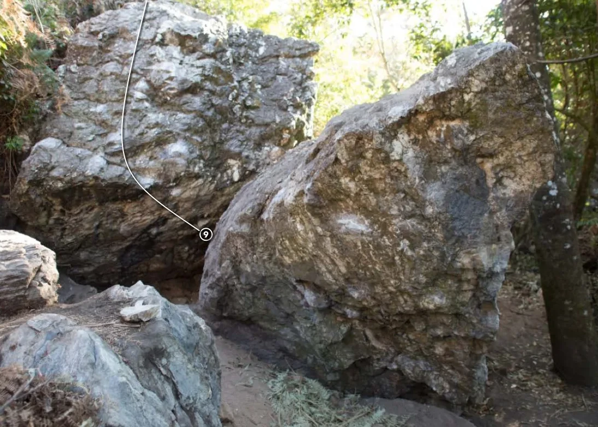
    - **largura_mapa**: 1094
    - **altura_mapa**: 782
    - **pontos_de_interesse**:
      - **[0]**:
        - **id**: T4wv12UtaUJD3l
        - **uid**: T4wv12UtaUJD3l
        - **rotulo**: 09
        - **circulo**:
          - **x**: 377
          - **y**: 429
          - **raio**: 11
        - **label**: 09
    - **referencias**:
      - **[0]**:
        - **alvo_uid**: NCp2yv5GqA8wIU
        - **pontos_uids**:
          - T4wv12UtaUJD3l
        - **escalada**: Jardim de Infância
        - **ids**:
          - T4wv12UtaUJD3l
- **escaladas**:
  - **[0]**:
    - **uid**: 2O9dAPtU2R7uaq
    - **boulder**:
      - **nome**: Agricultor
      - **dificuldade**: V2
  - **[1]**:
    - **uid**: m5Ae6ekD6Aja44
    - **boulder**:
      - **nome**: Garimpeiro
      - **dificuldade**: V4
  - **[2]**:
    - **uid**: BoslIdr2KQEgqb
    - **boulder**:
      - **nome**: A Regra é Clara
      - **dificuldade**: V5
  - **[3]**:
    - **uid**: miVPNcX7iuFApo
    - **boulder**:
      - **nome**: Essência
      - **dificuldade**: V4
  - **[4]**:
    - **uid**: FCSwjipzAwHXBG
    - **boulder**:
      - **nome**: Indecência
      - **dificuldade**: V3
  - **[5]**:
    - **uid**: DVFMiuNy0vgHGi
    - **boulder**:
      - **nome**: Regra do Jogo
      - **dificuldade**: V1
  - **[6]**:
    - **uid**: FtYAbgHRT22SRW
    - **boulder**:
      - **nome**: Carta de Euforia
      - **dificuldade**: V5
  - **[7]**:
    - **uid**: Q5CMWcG1JnkkPh
    - **boulder**:
      - **nome**: Escravos de Chó
      - **dificuldade**: V5
  - **[8]**:
    - **uid**: NCp2yv5GqA8wIU
    - **boulder**:
      - **nome**: Jardim de Infância
      - **dificuldade**: V0
- **precomputados**:
  - **total_escaladas**: 9
  - **total_boulders**: 9

## Arquivos Externos

- **arquivos_externos**:
  - **[0]**:
    - **caminho**: 
    - **checksum_sha256**: 876d52af193b9aadf5833b3a748c7c6ac3f4f57631f39749daaa47d5a8e71ef2
  - **[1]**:
    - **caminho**: 
    - **checksum_sha256**: e9ac224fda1d7cf8e792bc1859fc9aba4ee721d71398d9c1792ed86c7b142b7c
  - **[2]**:
    - **caminho**: 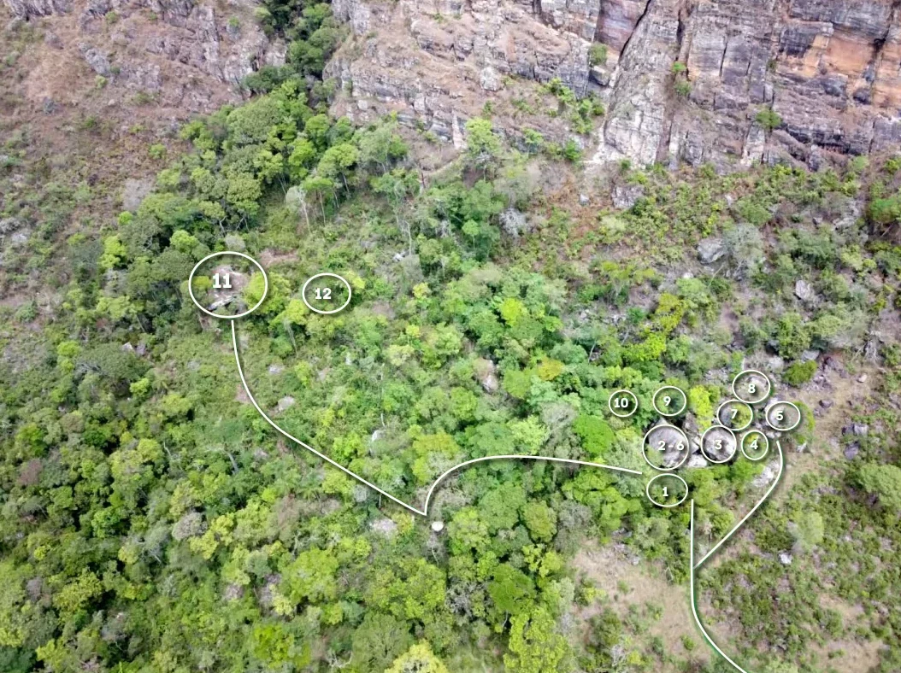
    - **checksum_sha256**: d333f58ec0010a57de784baa91d231833de81323abedec2c54bf4f9566e1de24
  - **[3]**:
    - **caminho**: 
    - **checksum_sha256**: 3b8752d7f0ee00f80c90f83a576799315400d96996f4b464402e1e1c938f79fa
  - **[4]**:
    - **caminho**: 
    - **checksum_sha256**: 41d74ca78c31aa861890c4104f7f65c988a1cb3061f72d678358e348e70bcb51
  - **[5]**:
    - **caminho**: 
    - **checksum_sha256**: 4e9ccc5d0b2792720981d62ea3c1dbd5f5840a915c1fea933edd9e84a9243c3e
  - **[6]**:
    - **caminho**: 
    - **checksum_sha256**: b30c59fd4667ea8792d1f11c7108d9ea6c04b76ab2ea22c6d1b7e289b6b13bb3
  - **[7]**:
    - **caminho**: 
    - **checksum_sha256**: ae675d48b1ea8f4953b0fe6067d624b890450ee2e981a1c504c1b639da319883
  - **[8]**:
    - **caminho**: 
    - **checksum_sha256**: 77ee9abe8f0628e9bf29a1f06474591bf38f4da5996ccb44d55067a9d3f6ba1f
  - **[9]**:
    - **caminho**: 
    - **checksum_sha256**: 4c6ad1be7e6da9820a0639a6076dddcbd9268e20c1c7b38cea3ef513943c930e
  - **[10]**:
    - **caminho**: 
    - **checksum_sha256**: 0d05e6dc8dd0e2980afd81c9a33f841784ee4398e13beec6c0d66dfbea68643f
  - **[11]**:
    - **caminho**: 
    - **checksum_sha256**: c20cf1f1d2d2588dbf97275ff4a4e5d3e07f5dcf1220f9a6e15464eefe552648
  - **[12]**:
    - **caminho**: 
    - **checksum_sha256**: 2caf89fe141b601c6a869c904738e11f5e6761656dc734c6b8c47b05813db1cf
  - **[13]**:
    - **caminho**: 
    - **checksum_sha256**: 4645a2f03197c1930d162791e335452609908fa445d148f80e77be93a50e2a8b
  - **[14]**:
    - **caminho**: 
    - **checksum_sha256**: c8cb23c9f352ed1dbcebbd73524d972b33678daf4faf7b399e0947528183ca84
  - **[15]**:
    - **caminho**: 
    - **checksum_sha256**: 4d6f5dc5c2f89c3e80a563f9e1b5b16c3aa1a2eb4c646e89c834a2617ea28293
  - **[16]**:
    - **caminho**: 
    - **checksum_sha256**: f2002f3bc7c8585ac0058a407a1fe47acda677a3ec8befe85607c11a328ec3e2
  - **[17]**:
    - **caminho**: 
    - **checksum_sha256**: bd9a055e34d2ca2385289bd1b1a4ffff6b44386d3ba90710f3a700eac77a250f
  - **[18]**:
    - **caminho**: 
    - **checksum_sha256**: 182f574fc1e74ae824650f715e1a04cb2f1c414b0352908b2682499a91d913a3
  - **[19]**:
    - **caminho**: 
    - **checksum_sha256**: e2257b4c10d50b1a11f52024bbb8bcb393c9549ba95012b866992cc52ff33017
  - **[20]**:
    - **caminho**: 
    - **checksum_sha256**: d8cbf304004986d81ba7d05ddd4f1003e5a0672ea73bb53fdfc47bbbb29a7909
  - **[21]**:
    - **caminho**: 
    - **checksum_sha256**: b2284df0aa2a3f5ec344615ac5b1ebefc6f9c8a355ca51d1797b18336577ebd7
  - **[22]**:
    - **caminho**: 
    - **checksum_sha256**: 644a501a99b3fced3f941daf092b1563140823295109f7a2a157bfe7ec8ac93d
  - **[23]**:
    - **caminho**: 
    - **checksum_sha256**: 344fa4b4172f51c3778b6a8bb3ef82849e5b7a6f4a62e7299c0661217e64d752
  - **[24]**:
    - **caminho**: 
    - **checksum_sha256**: c894c3ad16831449a17c6e2481b7ba12b7b751abe7cff82f1b0fa483bcb2f837

