# Croqui: Bocaina Park (Esportivas)

## Informações Gerais

- **descricao**:
    O Bocaina Park, localizado em Araxá - MG, é um dos principais polos de escalada esportiva da região. 
    Este croqui cobre as 220 vias do parque, distribuídas em diversos setores com graduações que vão do 4º ao 10º grau.
    
- **id**: br_mg_araxa_bocaina_esportivas
- **nome**: Bocaina Park (Esportivas)
- **caminho_thumbnail**: 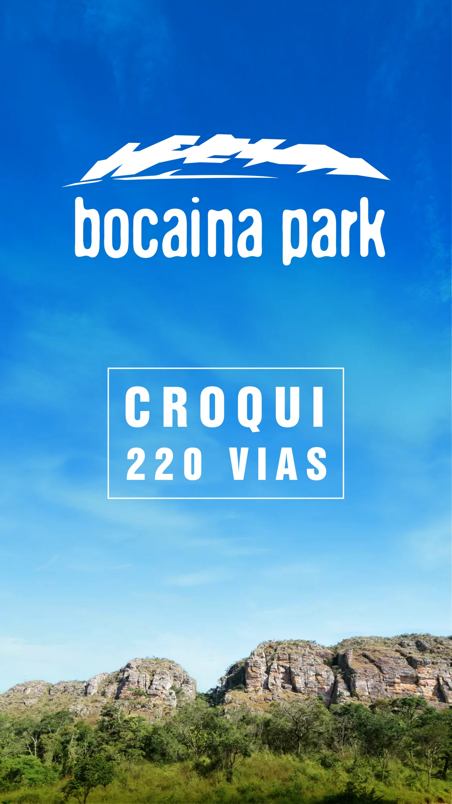
- **revisado_manualmente**: True
- **status_desenho_extraivel**: TEM_DESENHO_MAS_NAO_EXTRAIDO
- **botoes**:
  - **[0]**:
    - **texto**: Capa
    - **destino**:
      - **secao_textual**:
        - **conteudo**:
            # Bocaina Park - Araxá, MG
            
            |  |
            | :--: |
            | *Capa* |
            
            ## Croqui 220 Vias
  - **[1]**:
    - **texto**: Mapas Gerais
    - **destino**:
      - **secao_textual**:
        - **conteudo**:
            # Setores do Bocaina Park
            
            | 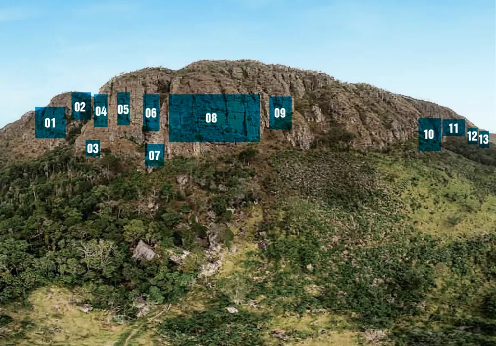 |
            | :--: |
            | *Mapa de Setores* |
            
            | ID | Setor | Qtde. de Vias |
            |---|---|---|---|
            | 01 | Ensolarado | 21 |
            | 02 | Garganta | 28 |
            | 03 | Tapa na Cara | 04 |
            | 04 | Terceiro Andar | 14 |
            | 05 | Paulistas | 16 |
            | 06 | Mezanino | 17 |
            | 07 | Shana Crazy | 09 |
            | 08 | Tsunami | 24 |
            | 09 | Udão | 13 |
            | 10 | Tereza | 06 |
            | 11 | Bem-vindo | 17 |
            | 11 | Tetos | 36 |
            | 12 | Segundo Andar | 10 |
            | 13 | Pirados de Rocha | 5 |
- **ultima_migracao**: 2
- **publicar_croqui**: True

## Parte: setor_highlines

### Setor (Pico: Bocaina Park)

- **descricao**: # Highlines - Bocaina Park
- **nome**: Highlines - Bocaina Park
- **mapas**:
  - **[0]**:
    - **caminho_imagem_mapa**: 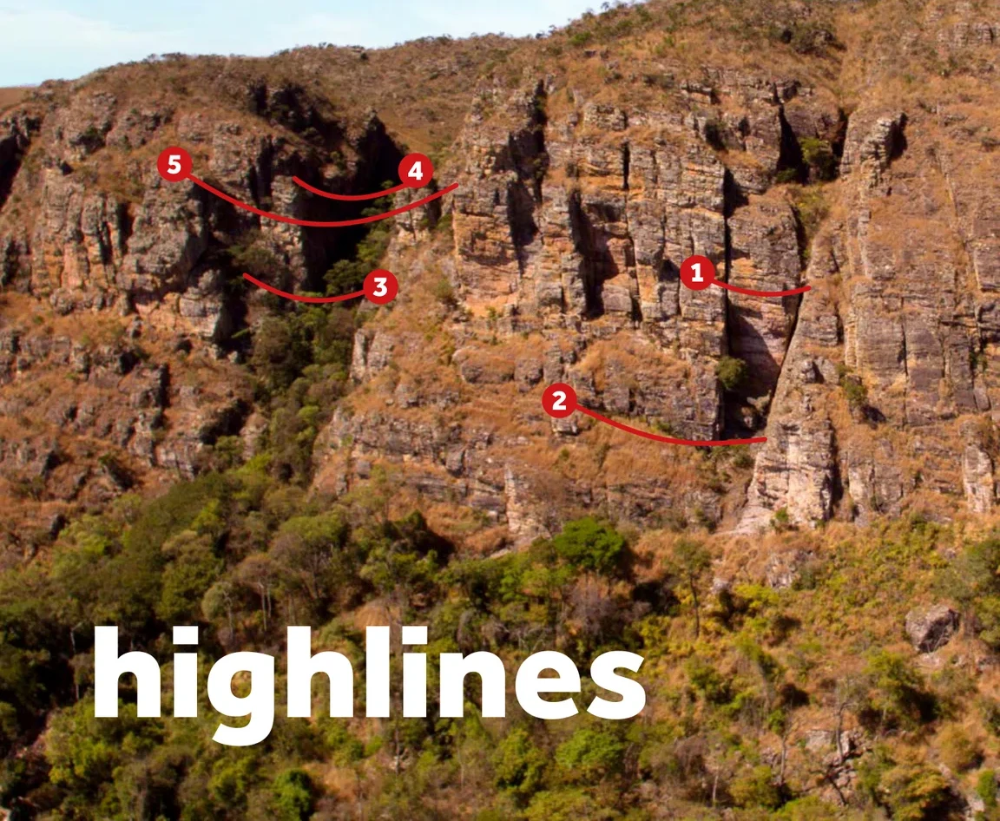
    - **largura_mapa**: 1152
    - **altura_mapa**: 946
    - **pontos_de_interesse**:
      - **[0]**:
        - **id**: 01
        - **label**: 01
        - **box**:
          - **x**: 803
          - **y**: 312
          - **comprimento**: 28
          - **largura**: 35
      - **[1]**:
        - **id**: 02
        - **label**: 02
        - **box**:
          - **x**: 644
          - **y**: 461
          - **comprimento**: 24
          - **largura**: 32
      - **[2]**:
        - **id**: 03
        - **label**: 03
        - **box**:
          - **x**: 438
          - **y**: 331
          - **comprimento**: 25
          - **largura**: 32
      - **[3]**:
        - **id**: 04
        - **label**: 04
        - **box**:
          - **x**: 480
          - **y**: 198
          - **comprimento**: 27
          - **largura**: 29
      - **[4]**:
        - **id**: 05
        - **label**: 05
        - **box**:
          - **x**: 200
          - **y**: 188
          - **comprimento**: 24
          - **largura**: 34
    - **referencias**:
      - **[0]**:
        - **escalada**: Trickline
        - **ids**:
          - 01
      - **[1]**:
        - **escalada**: Arquibancada
        - **ids**:
          - 02
      - **[2]**:
        - **escalada**: O melhor está por vir
        - **ids**:
          - 03
      - **[3]**:
        - **escalada**: Figura Pública
        - **ids**:
          - 04
      - **[4]**:
        - **escalada**: Visão além do alcance
        - **ids**:
          - 05
- **escaladas**:
  - **[0]**:
    - **highline**:
      - **nome**: Trickline
      - **distancia**: 17
      - **altura**: 20
      - **exposicao**: 180
      - **conquistadores**:
        - Caio Afeto
        - Gustavo Fontes
        - Bruno Miguéis
      - **data_abertura**: 2013
      - **descricao_acesso**: Lado móvel: Setor dos Paulistas, atrás do totem da via Decadentes. Lado estático: topo da via Puberdade no setor mezanino.
      - **descricao_ancoragem**: Lado estático, duas chapeletas com backup no top da via de escalada. Lado móvel 3 chapeletas, longes uma da outra, corda para ancoragem grande e muita proteção abrasão.
  - **[1]**:
    - **highline**:
      - **nome**: Arquibancada
      - **distancia**: 39
      - **altura**: 15
      - **exposicao**: 150
      - **conquistadores**:
        - Reginaldo Gomes
        - Diego Leonardo
      - **data_abertura**: 2017
      - **descricao_acesso**: Lado estático: Trilha setor Aeroshane em cima da via Shana Crazy. Lado móvel: Totem na trilha para terceiro andar no inicio da subida para o setor Paulistas.
      - **descricao_ancoragem**: Lado estático e lado móvel 3 chapeletas cada.
  - **[2]**:
    - **highline**:
      - **nome**: O melhor está por vir
      - **distancia**: 27
      - **altura**: 50
      - **exposicao**: 200
      - **conquistadores**:
        - Caio Afeto
        - Gustavo Fontes
        - Bruno Miguéis
      - **data_abertura**: 2013
      - **descricao_acesso**: Lado estático: Escalar a via mulheres ao poder na garganta e após o top da via, derivar para a direita. Lado móvel: Passar pelo terceiro Andar e continuar subindo até nivelar com o top da via mulheres ao poder.
      - **descricao_ancoragem**: Lado estático: 3 chapeletas. Lado móvel: 4 chapeletas distantes uma da outra, levar bastante proteção de abrasão.
  - **[3]**:
    - **highline**:
      - **nome**: Figura Pública
      - **distancia**: 75
      - **altura**: 70
      - **exposicao**: 200
      - **conquistadores**:
        - Reginaldo Gomes
        - Diego Leonardo
        - Thiago Vasconcelos
      - **data_abertura**: 2017
      - **descricao_acesso**: Lado estático: Escalar a via De Mão Beijada ate o cume, derivando para a direita após o top. Lado móvel: caminhar no interior da Garganta ate o final da erosão fluvial, depois virar completamente à esquerda no morro da trilha de moto, abandonando a trilha até alcançar o topo das vias de escalada e conseguir visualizar as chapeletas no alinhamento da outra ancoragem.
      - **descricao_ancoragem**: Lado estático e móvel, 3 chapeletas cada, necessitando bastante proteção de abrasão.
  - **[4]**:
    - **highline**:
      - **nome**: Visão além do alcance
      - **distancia**: 45
      - **altura**: 50
      - **conquistadores**:
        - Caio Afeto
        - Gustavo Fontes
        - Bruno Miguéis
      - **data_abertura**: 2013
      - **descricao_acesso**: Lado estático: passar pela entrada da garganta e no início do setor ensolarado começar uma escalaminhada em direção às ancoragens. Lado móvel: Terceiro Andar ao chegar na base da via efeito colateral, derivar completamente à esquerda em direção às ancoragens.
      - **descricao_ancoragem**: Lado estático: 4 chapeletas Lado móvel: 3 chapeletas.

## Parte: setor_ensolarado

### Setor (Pico: Bocaina Park)

- **descricao**:
    # Setor Ensolarado
    
    | 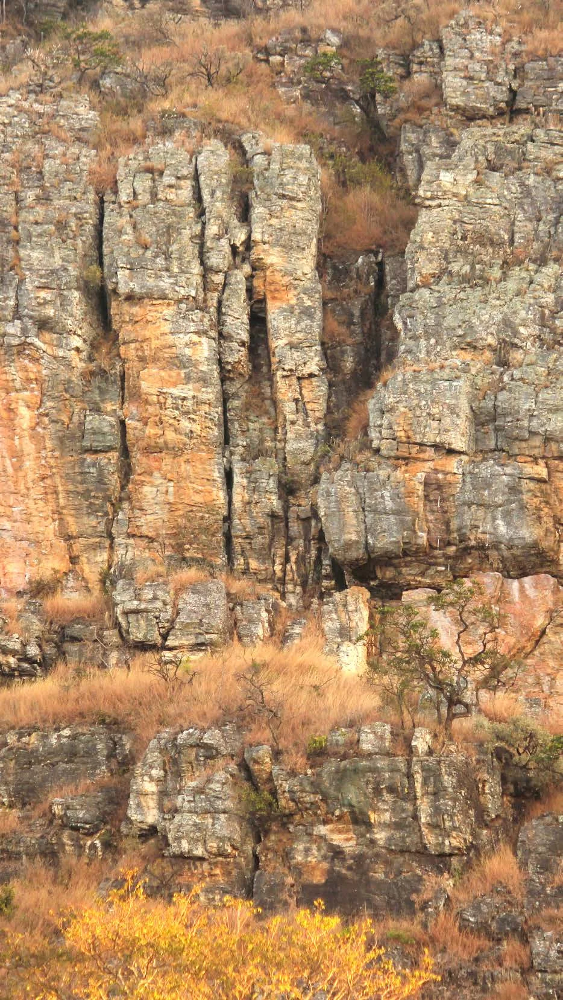 |
    | :--: |
    | *Setor Ensolarado* |
    
    O Setor Ensolarado é um dos setores iniciais do Bocaina Park, caracterizado por vias de graduação variada, do 5º ao 9b.
    
    > [!TIP]
    > Leve seu lixo e outro que encontrar para a cidade. Não faça necessidades fisiológicas nas trilhas e base de vias. Avisar a administração sobre a abertura de novas vias de escalada. **USE CAPACETE NAS BASES DE VIAS DE ESCALADA.**
- **nome**: Ensolarado
- **mapas**:
  - **[0]**:
    - **caminho_imagem_mapa**: 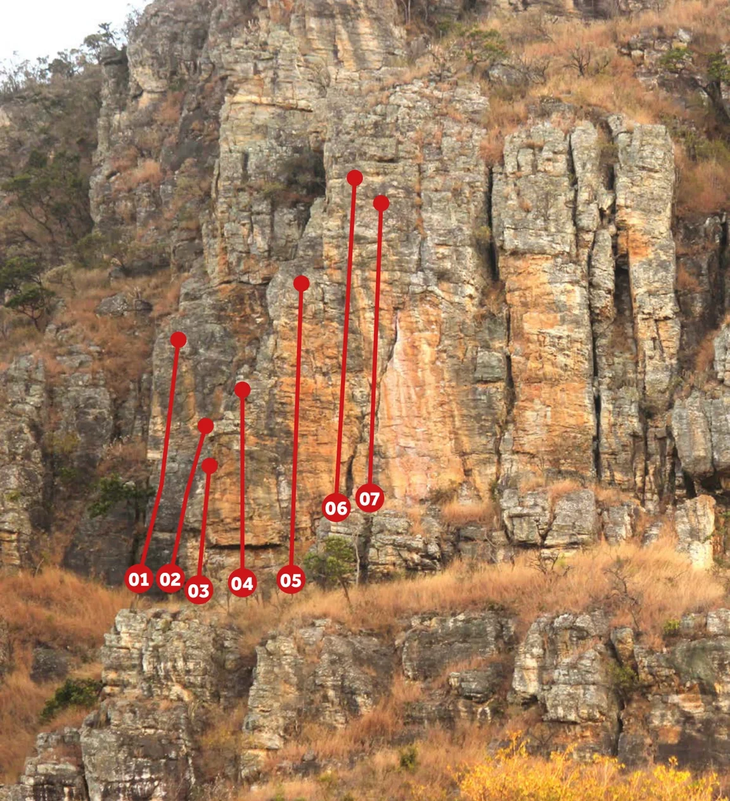
    - **largura_mapa**: 1152
    - **altura_mapa**: 1264
    - **pontos_de_interesse**:
      - **[0]**:
        - **id**: 01
        - **label**: 01
        - **box**:
          - **x**: 218
          - **y**: 913
          - **comprimento**: 30
          - **largura**: 32
      - **[1]**:
        - **id**: 02
        - **label**: 02
        - **box**:
          - **x**: 268
          - **y**: 911
          - **comprimento**: 36
          - **largura**: 28
      - **[2]**:
        - **id**: 03
        - **label**: 03
        - **box**:
          - **x**: 312
          - **y**: 931
          - **comprimento**: 35
          - **largura**: 30
      - **[3]**:
        - **id**: 04
        - **label**: 04
        - **box**:
          - **x**: 380
          - **y**: 922
          - **comprimento**: 49
          - **largura**: 35
      - **[4]**:
        - **id**: 05
        - **label**: 05
        - **box**:
          - **x**: 458
          - **y**: 917
          - **comprimento**: 43
          - **largura**: 32
      - **[5]**:
        - **id**: 06
        - **label**: 06
        - **box**:
          - **x**: 532
          - **y**: 800
          - **comprimento**: 35
          - **largura**: 29
      - **[6]**:
        - **id**: 07
        - **label**: 07
        - **box**:
          - **x**: 580
          - **y**: 789
          - **comprimento**: 43
          - **largura**: 34
    - **referencias**:
      - **[0]**:
        - **escalada**: Índios
        - **ids**:
          - 01
      - **[1]**:
        - **escalada**: Virando a Esquina
        - **ids**:
          - 02
      - **[2]**:
        - **escalada**: Feinomenal
        - **ids**:
          - 03
      - **[3]**:
        - **escalada**: Mirandinha fFlou
        - **ids**:
          - 04
      - **[4]**:
        - **escalada**: Quatro e Vinte
        - **ids**:
          - 05
      - **[5]**:
        - **escalada**: Yngyang
        - **ids**:
          - 06
      - **[6]**:
        - **escalada**: Sucuri
        - **ids**:
          - 07
      - **[7]**:
        - **escalada**: Mundo Mágico dos Abacates
        - **ids**:
          - 8
      - **[8]**:
        - **escalada**: Ariba Cabron
        - **ids**:
          - 9
      - **[9]**:
        - **escalada**: Família Martins
        - **ids**:
          - 10
      - **[10]**:
        - **escalada**: Zuzuquinha Mimada
        - **ids**:
          - 11
      - **[11]**:
        - **escalada**: De volta as Origens
        - **ids**:
          - 12
      - **[12]**:
        - **escalada**: Autista do Bando
        - **ids**:
          - 13
      - **[13]**:
        - **escalada**: Último Suspiro
        - **ids**:
          - 14
      - **[14]**:
        - **escalada**: Barba Negra
        - **ids**:
          - 15
      - **[15]**:
        - **escalada**: Capitão Gancho
        - **ids**:
          - 16
      - **[16]**:
        - **escalada**: Peter Pan do Cerrado
        - **ids**:
          - 17
      - **[17]**:
        - **escalada**: Indio Rastafari
        - **ids**:
          - 18
      - **[18]**:
        - **escalada**: Todo Cuidado e Pouco
        - **ids**:
          - 19
      - **[19]**:
        - **escalada**: Raul com Certeza
        - **ids**:
          - 20
      - **[20]**:
        - **escalada**: Raimundo Nonato
        - **ids**:
          - 21
  - **[1]**:
    - **caminho_imagem_mapa**: 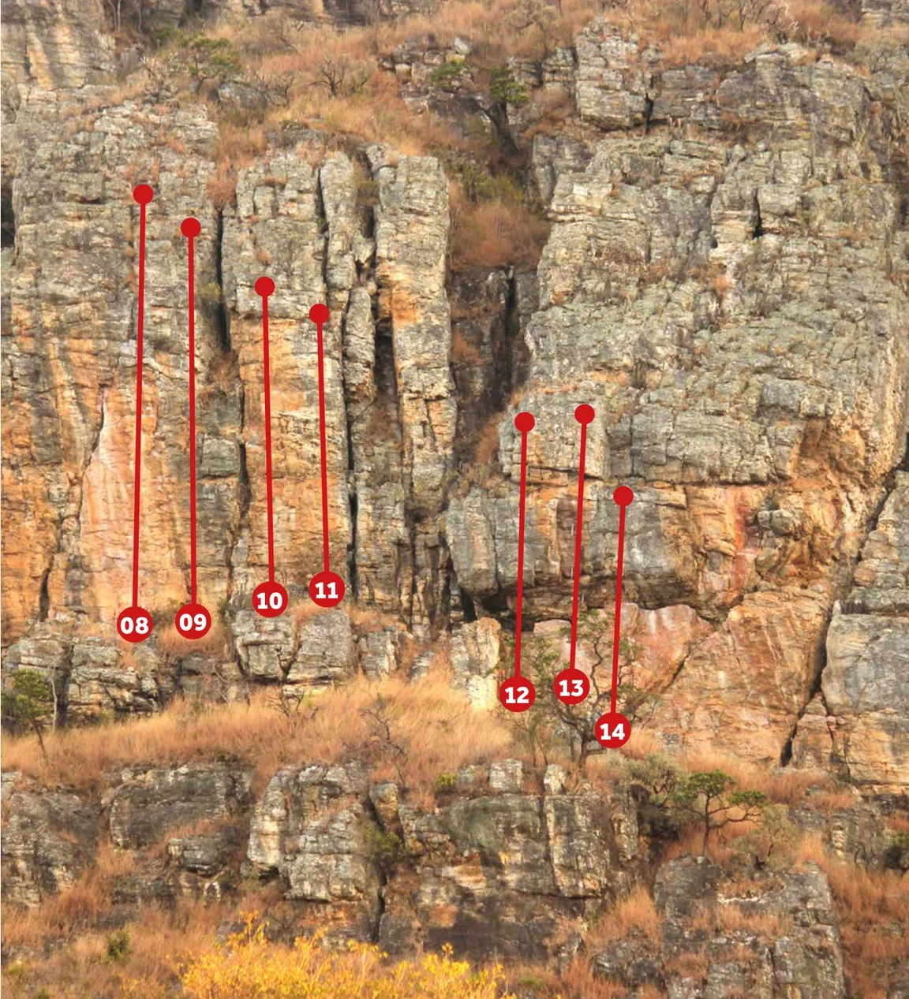
    - **largura_mapa**: 1152
    - **altura_mapa**: 1267
    - **pontos_de_interesse**:
      - **[0]**:
        - **id**: 08
        - **label**: 08
        - **box**:
          - **x**: 170
          - **y**: 794
          - **comprimento**: 44
          - **largura**: 33
      - **[1]**:
        - **id**: 09
        - **label**: 09
        - **box**:
          - **x**: 244
          - **y**: 790
          - **comprimento**: 43
          - **largura**: 33
      - **[2]**:
        - **id**: 10
        - **label**: 10
        - **box**:
          - **x**: 341
          - **y**: 763
          - **comprimento**: 42
          - **largura**: 34
      - **[3]**:
        - **id**: 11
        - **label**: 11
        - **box**:
          - **x**: 413
          - **y**: 748
          - **comprimento**: 42
          - **largura**: 37
      - **[4]**:
        - **id**: 12
        - **label**: 12
        - **box**:
          - **x**: 655
          - **y**: 882
          - **comprimento**: 38
          - **largura**: 30
      - **[5]**:
        - **id**: 13
        - **label**: 13
        - **box**:
          - **x**: 724
          - **y**: 873
          - **comprimento**: 39
          - **largura**: 30
      - **[6]**:
        - **id**: 14
        - **label**: 14
        - **box**:
          - **x**: 776
          - **y**: 928
          - **comprimento**: 41
          - **largura**: 28
  - **[2]**:
    - **caminho_imagem_mapa**: 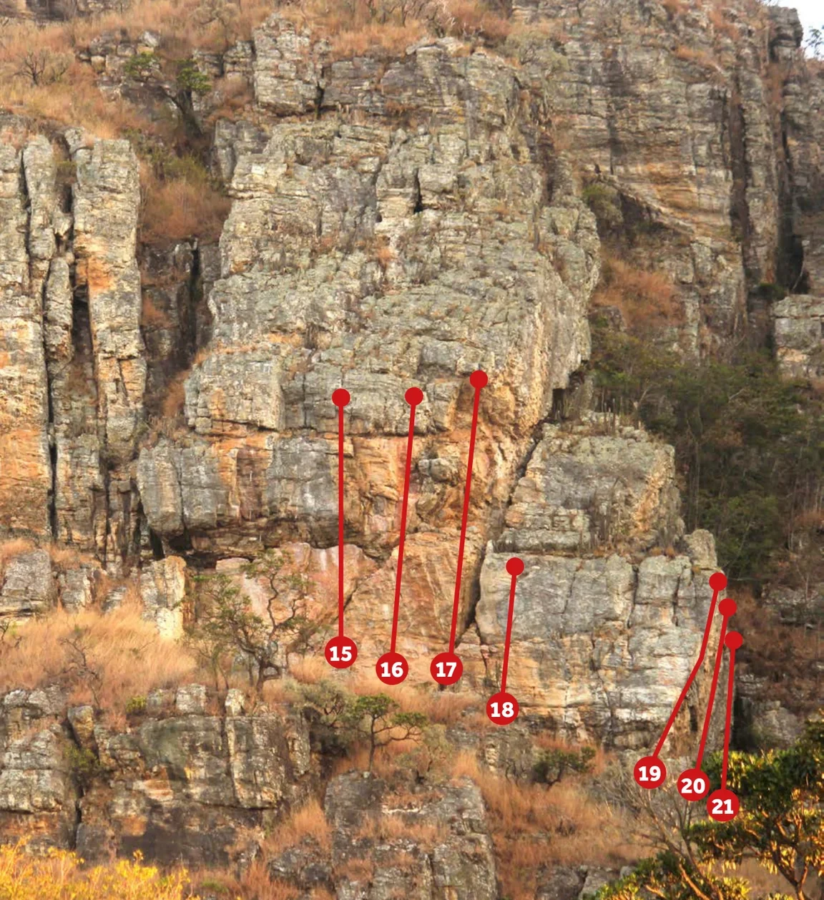
    - **largura_mapa**: 1152
    - **altura_mapa**: 1258
    - **pontos_de_interesse**:
      - **[0]**:
        - **id**: 15
        - **label**: 15
        - **box**:
          - **x**: 476
          - **y**: 914
          - **comprimento**: 38
          - **largura**: 30
      - **[1]**:
        - **id**: 16
        - **label**: 16
        - **box**:
          - **x**: 548
          - **y**: 936
          - **comprimento**: 41
          - **largura**: 35
      - **[2]**:
        - **id**: 17
        - **label**: 17
        - **box**:
          - **x**: 623
          - **y**: 936
          - **comprimento**: 36
          - **largura**: 33
      - **[3]**:
        - **id**: 18
        - **label**: 18
        - **box**:
          - **x**: 702
          - **y**: 992
          - **comprimento**: 41
          - **largura**: 29
      - **[4]**:
        - **id**: 19
        - **label**: 19
        - **box**:
          - **x**: 908
          - **y**: 1082
          - **comprimento**: 38
          - **largura**: 31
      - **[5]**:
        - **id**: 20
        - **label**: 20
        - **box**:
          - **x**: 968
          - **y**: 1096
          - **comprimento**: 33
          - **largura**: 25
      - **[6]**:
        - **id**: 21
        - **label**: 21
        - **box**:
          - **x**: 1010
          - **y**: 1126
          - **comprimento**: 32
          - **largura**: 26
  - **[3]**:
    - **caminho_imagem_mapa**: 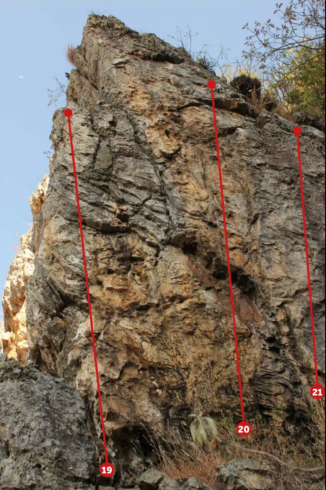
    - **largura_mapa**: 852
    - **altura_mapa**: 1278
    - **pontos_de_interesse**:
      - **[0]**:
        - **id**: 19
        - **label**: 19
        - **box**:
          - **x**: 279
          - **y**: 1226
          - **comprimento**: 36
          - **largura**: 29
      - **[1]**:
        - **id**: 20
        - **label**: 20
        - **box**:
          - **x**: 636
          - **y**: 1119
          - **comprimento**: 40
          - **largura**: 32
      - **[2]**:
        - **id**: 21
        - **label**: 21
        - **box**:
          - **x**: 829
          - **y**: 1022
          - **comprimento**: 34
          - **largura**: 30
- **escaladas**:
  - **[0]**:
    - **via_esportiva**:
      - **nome**: Índios
      - **dificuldade**: BR_7B
      - **extensao**: 20
      - **quantidade_protecoes_intermediarias**: 7
      - **quantidade_protecoes_parada**: 2
      - **conquistadores**:
        - Felipe Tavares
      - **data_abertura**: 2016
  - **[1]**:
    - **via_esportiva**:
      - **nome**: Virando a Esquina
      - **dificuldade**: BR_5
      - **extensao**: 8
      - **quantidade_protecoes_intermediarias**: 4
      - **quantidade_protecoes_parada**: 2
      - **conquistadores**:
        - Diego Leonardo
      - **data_abertura**: 2014
  - **[2]**:
    - **via_esportiva**:
      - **nome**: Feinomenal
      - **dificuldade**: BR_7A
      - **extensao**: 10
      - **quantidade_protecoes_intermediarias**: 4
      - **quantidade_protecoes_parada**: 2
      - **conquistadores**:
        - Fei
        - Luca Potilho
      - **data_abertura**: 2016
  - **[3]**:
    - **via_esportiva**:
      - **nome**: Mirandinha fFlou
      - **dificuldade**: BR_7A
      - **extensao**: 12
      - **quantidade_protecoes_intermediarias**: 6
      - **quantidade_protecoes_parada**: 2
      - **conquistadores**:
        - Rafael Furtado
        - Diego Leonardo
      - **data_abertura**: 2016
  - **[4]**:
    - **via_esportiva**:
      - **nome**: Quatro e Vinte
      - **dificuldade**: BR_6SUP
      - **extensao**: 20
      - **quantidade_protecoes_intermediarias**: 6
      - **quantidade_protecoes_parada**: 2
      - **conquistadores**:
        - Diego Leonardo
      - **data_abertura**: 2013
  - **[5]**:
    - **via_esportiva**:
      - **nome**: Yngyang
      - **dificuldade**: BR_6SUP
      - **extensao**: 20
      - **quantidade_protecoes_intermediarias**: 7
      - **quantidade_protecoes_parada**: 2
      - **conquistadores**:
        - Diego Leonardo
      - **data_abertura**: 2013
  - **[6]**:
    - **via_esportiva**:
      - **nome**: Sucuri
      - **dificuldade**: BR_7C
      - **extensao**: 15
      - **quantidade_protecoes_intermediarias**: 6
      - **quantidade_protecoes_parada**: 2
      - **conquistadores**:
        - Felipe Tavares
        - Felipe Alves
      - **data_abertura**: 2017
  - **[7]**:
    - **via_esportiva**:
      - **nome**: Mundo Mágico dos Abacates
      - **dificuldade**: BR_7B
      - **extensao**: 15
      - **quantidade_protecoes_intermediarias**: 6
      - **quantidade_protecoes_parada**: 2
      - **conquistadores**:
        - Lucas B. Marques
        - Diego Leonardo
      - **data_abertura**: 2013
  - **[8]**:
    - **via_esportiva**:
      - **nome**: Ariba Cabron
      - **dificuldade**: BR_7A
      - **extensao**: 15
      - **quantidade_protecoes_intermediarias**: 6
      - **quantidade_protecoes_parada**: 2
      - **conquistadores**:
        - Diego Leonardo
        - Rafael Furtado
      - **data_abertura**: 2013
  - **[9]**:
    - **via_esportiva**:
      - **nome**: Família Martins
      - **dificuldade**: BR_6SUP
      - **extensao**: 10
      - **quantidade_protecoes_intermediarias**: 6
      - **quantidade_protecoes_parada**: 2
      - **conquistadores**:
        - Diego Leonardo
      - **data_abertura**: 2014
  - **[10]**:
    - **via_esportiva**:
      - **nome**: Zuzuquinha Mimada
      - **dificuldade**: BR_6
      - **extensao**: 10
      - **quantidade_protecoes_intermediarias**: 6
      - **quantidade_protecoes_parada**: 2
      - **conquistadores**:
        - Mateus Martins
        - Arhtur Martins
      - **data_abertura**: 2014
  - **[11]**:
    - **via_esportiva**:
      - **nome**: De volta as Origens
      - **dificuldade**: BR_7B
      - **extensao**: 15
      - **quantidade_protecoes_intermediarias**: 4
      - **quantidade_protecoes_parada**: 2
      - **conquistadores**:
        - Rafael Furtado
        - Diego Leonardo
      - **data_abertura**: 2013
  - **[12]**:
    - **via_esportiva**:
      - **nome**: Autista do Bando
      - **dificuldade**: BR_9B
      - **extensao**: 15
      - **quantidade_protecoes_intermediarias**: 5
      - **quantidade_protecoes_parada**: 2
      - **conquistadores**:
        - Diego Leonardo
        - Rafael Furtado
      - **data_abertura**: 2014
  - **[13]**:
    - **via_esportiva**:
      - **nome**: Último Suspiro
      - **dificuldade**: BR_8B
      - **extensao**: 15
      - **quantidade_protecoes_intermediarias**: 4
      - **quantidade_protecoes_parada**: 2
      - **conquistadores**:
        - Rafael Furtado
        - Diego Leonardo
      - **data_abertura**: 2013
  - **[14]**:
    - **via_esportiva**:
      - **nome**: Barba Negra
      - **dificuldade**: BR_8B
      - **extensao**: 15
      - **quantidade_protecoes_intermediarias**: 6
      - **quantidade_protecoes_parada**: 2
      - **conquistadores**:
        - Alexandre FEI
      - **data_abertura**: 2013
  - **[15]**:
    - **via_esportiva**:
      - **nome**: Capitão Gancho
      - **dificuldade**: BR_7B
      - **extensao**: 15
      - **quantidade_protecoes_intermediarias**: 7
      - **quantidade_protecoes_parada**: 2
      - **conquistadores**:
        - Alexandre FEI
        - Daiex
      - **data_abertura**: 2013
  - **[16]**:
    - **via_esportiva**:
      - **nome**: Peter Pan do Cerrado
      - **dificuldade**: BR_7B
      - **extensao**: 20
      - **quantidade_protecoes_intermediarias**: 3
      - **quantidade_protecoes_parada**: 2
      - **conquistadores**:
        - Alexandre FEI
      - **data_abertura**: 2015
  - **[17]**:
    - **via_esportiva**:
      - **nome**: Indio Rastafari
      - **dificuldade**: BR_7C
      - **extensao**: 10
      - **quantidade_protecoes_intermediarias**: 3
      - **quantidade_protecoes_parada**: 2
      - **conquistadores**:
        - Alexandre FEI
      - **data_abertura**: 2015
  - **[18]**:
    - **via_esportiva**:
      - **nome**: Todo Cuidado e Pouco
      - **dificuldade**: BR_6SUP
      - **extensao**: 10
      - **quantidade_protecoes_intermediarias**: 3
      - **quantidade_protecoes_parada**: 2
      - **conquistadores**:
        - Gustavo Maneira
        - Daiex
      - **data_abertura**: 2013
  - **[19]**:
    - **via_esportiva**:
      - **nome**: Raul com Certeza
      - **dificuldade**: BR_7B
      - **extensao**: 10
      - **quantidade_protecoes_intermediarias**: 3
      - **quantidade_protecoes_parada**: 2
      - **conquistadores**:
        - Alexandre FEI
      - **data_abertura**: 2013
  - **[20]**:
    - **via_esportiva**:
      - **nome**: Raimundo Nonato
      - **dificuldade**: BR_7C
      - **extensao**: 10
      - **quantidade_protecoes_intermediarias**: 3
      - **quantidade_protecoes_parada**: 2
      - **conquistadores**:
        - Alexandre FEI
      - **data_abertura**: 2013

## Parte: setor_garganta

### Setor (Pico: Bocaina Park)

- **descricao**:
    # Setor Garganta
    
    |  |
    | :--: |
    | *Setor Garganta* |
    
    O Setor Garganta é um dos mais icônicos do Bocaina Park, com uma grande concentração de vias de 6º e 7º grau, além da clássica "Ceder Writhe" (8c).
    
    > [!TIP]
    > Leve seu lixo e outro que encontrar para a cidade. Não faça necessidades fisiológicas nas trilhas e base de vias. Avisar a administração sobre a abertura de novas vias de escalada. **USE CAPACETE NAS BASES DE VIAS DE ESCALADA.**
- **nome**: Garganta
- **mapas**:
  - **[0]**:
    - **caminho_imagem_mapa**: 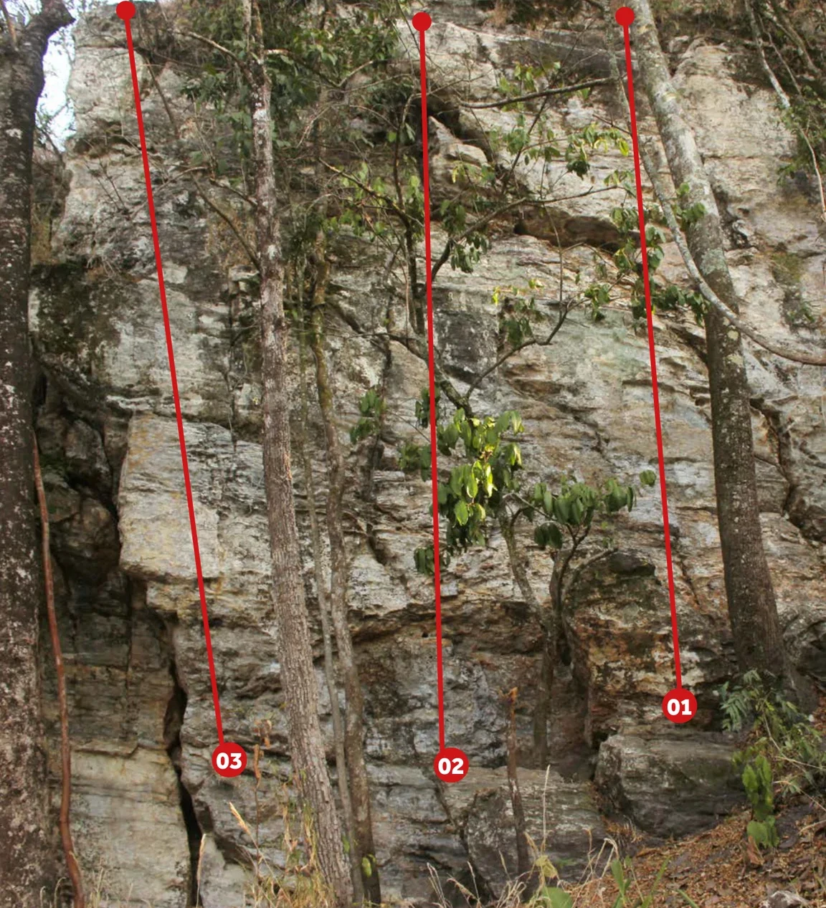
    - **largura_mapa**: 1152
    - **altura_mapa**: 1267
    - **pontos_de_interesse**:
      - **[0]**:
        - **id**: 01
        - **label**: 01
        - **box**:
          - **x**: 948
          - **y**: 986
          - **comprimento**: 43
          - **largura**: 34
      - **[1]**:
        - **id**: 02
        - **label**: 02
        - **box**:
          - **x**: 630
          - **y**: 1069
          - **comprimento**: 45
          - **largura**: 32
      - **[2]**:
        - **id**: 03
        - **label**: 03
        - **box**:
          - **x**: 320
          - **y**: 1060
          - **comprimento**: 45
          - **largura**: 33
    - **referencias**:
      - **[0]**:
        - **escalada**: Love's in the Air
        - **ids**:
          - 01
      - **[1]**:
        - **escalada**: BH em Chamas
        - **ids**:
          - 02
      - **[2]**:
        - **escalada**: Revolta dos Vinagres
        - **ids**:
          - 03
      - **[3]**:
        - **escalada**: De Pai para Filho
        - **ids**:
          - 04
      - **[4]**:
        - **escalada**: Amor de Mãe
        - **ids**:
          - 05
      - **[5]**:
        - **escalada**: Pagador de Promessa
        - **ids**:
          - 06
      - **[6]**:
        - **escalada**: Grande Família
        - **ids**:
          - 07
      - **[7]**:
        - **escalada**: Sangue do meu Sangue
        - **ids**:
          - 8
      - **[8]**:
        - **escalada**: Cocalcinhas
        - **ids**:
          - 9
      - **[9]**:
        - **escalada**: Guerreiro da Bocaina
        - **ids**:
          - 10
      - **[10]**:
        - **escalada**: Samurai Rastafari
        - **ids**:
          - 11
      - **[11]**:
        - **escalada**: Ceder Writhe
        - **ids**:
          - 12
      - **[12]**:
        - **escalada**: Sai pra Lá Sr. Doutor
        - **ids**:
          - 13
      - **[13]**:
        - **escalada**: Maniaco Sexual
        - **ids**:
          - 14
      - **[14]**:
        - **escalada**: Paraiboult
        - **ids**:
          - 15
      - **[15]**:
        - **escalada**: Mulheres ao Poder
        - **ids**:
          - 16
      - **[16]**:
        - **escalada**: Invasão Bacteriana
        - **ids**:
          - 17
      - **[17]**:
        - **escalada**: Yes We Can
        - **ids**:
          - 18
      - **[18]**:
        - **escalada**: Galo Doido
        - **ids**:
          - 19
      - **[19]**:
        - **escalada**: Baby Roots
        - **ids**:
          - 20
      - **[20]**:
        - **escalada**: Canelinha de Ouro
        - **ids**:
          - 21
      - **[21]**:
        - **escalada**: Rei Leão
        - **ids**:
          - 22
      - **[22]**:
        - **escalada**: Maluco Beleza
        - **ids**:
          - 23
      - **[23]**:
        - **escalada**: Peter Park
        - **ids**:
          - 24
      - **[24]**:
        - **escalada**: Super Poderosa
        - **ids**:
          - 25
      - **[25]**:
        - **escalada**: Cinco Vira, Dez Acaba
        - **ids**:
          - 26
      - **[26]**:
        - **escalada**: Dunas
        - **ids**:
          - 27
      - **[27]**:
        - **escalada**: Poeira Cósmica
        - **ids**:
          - 28
  - **[1]**:
    - **caminho_imagem_mapa**: 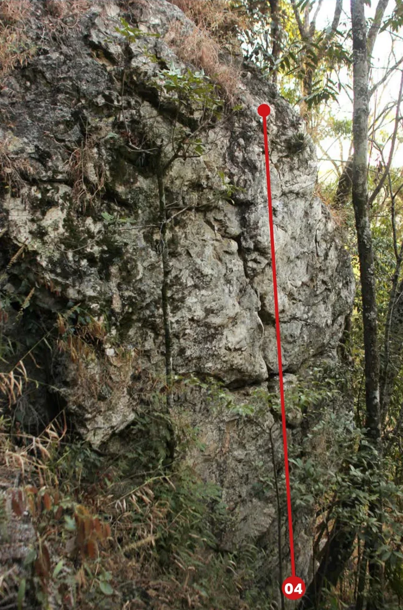
    - **largura_mapa**: 840
    - **altura_mapa**: 1269
    - **pontos_de_interesse**:
      - **[0]**:
        - **id**: 04
        - **label**: 04
        - **box**:
          - **x**: 612
          - **y**: 1224
          - **comprimento**: 46
          - **largura**: 32
  - **[2]**:
    - **caminho_imagem_mapa**: 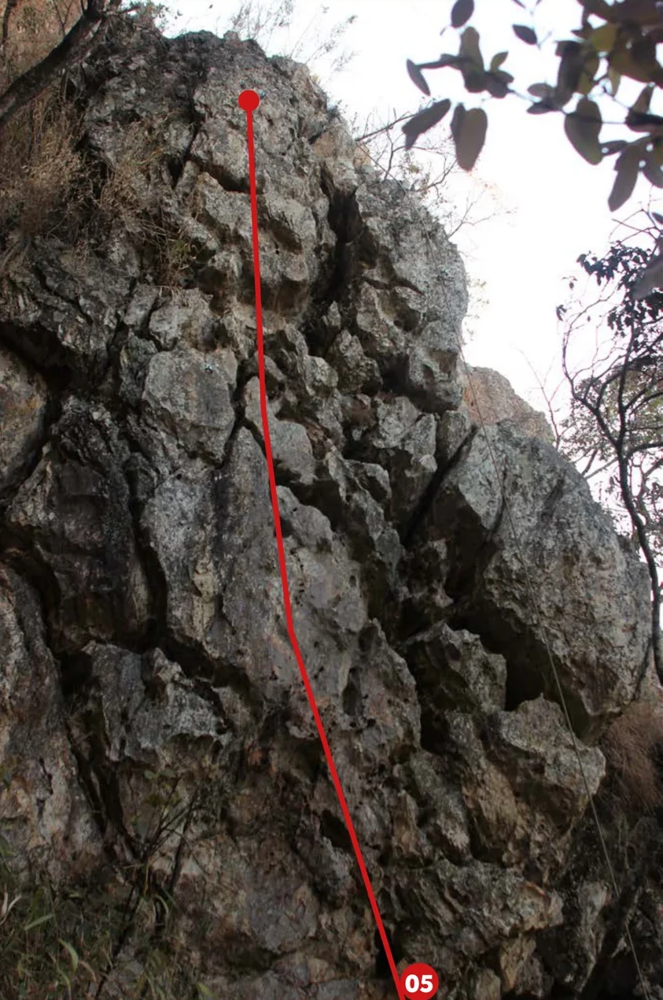
    - **largura_mapa**: 843
    - **altura_mapa**: 1270
    - **pontos_de_interesse**:
      - **[0]**:
        - **id**: 05
        - **label**: 05
        - **box**:
          - **x**: 533
          - **y**: 1248
          - **comprimento**: 44
          - **largura**: 33
  - **[3]**:
    - **caminho_imagem_mapa**: 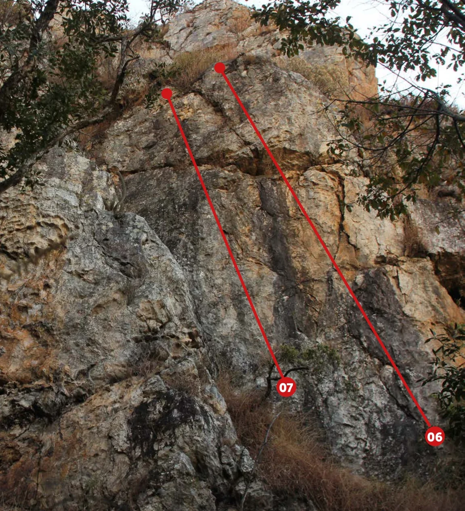
    - **largura_mapa**: 1151
    - **altura_mapa**: 1264
    - **pontos_de_interesse**:
      - **[0]**:
        - **id**: 06
        - **label**: 06
        - **box**:
          - **x**: 1076
          - **y**: 1082
          - **comprimento**: 51
          - **largura**: 42
      - **[1]**:
        - **id**: 07
        - **label**: 07
        - **box**:
          - **x**: 707
          - **y**: 958
          - **comprimento**: 44
          - **largura**: 37
  - **[4]**:
    - **caminho_imagem_mapa**: 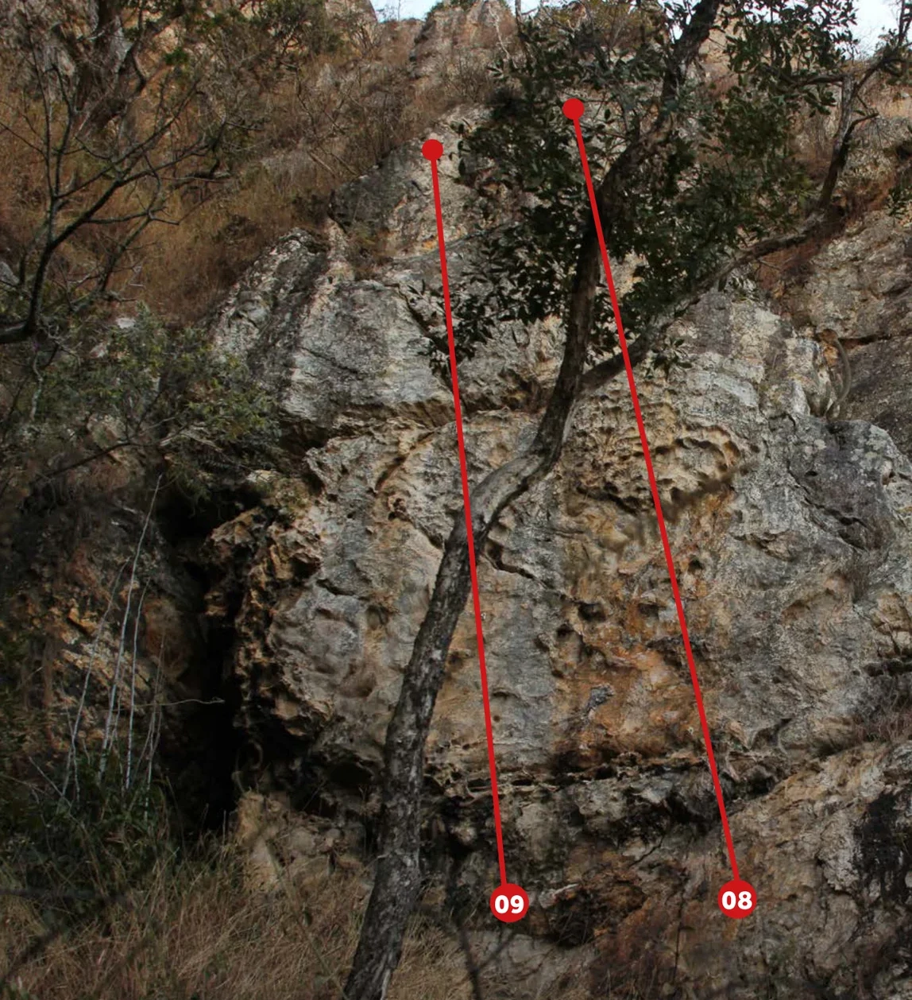
    - **largura_mapa**: 1148
    - **altura_mapa**: 1258
    - **pontos_de_interesse**:
      - **[0]**:
        - **id**: 08
        - **label**: 08
        - **box**:
          - **x**: 928
          - **y**: 1134
          - **comprimento**: 50
          - **largura**: 37
      - **[1]**:
        - **id**: 09
        - **label**: 09
        - **box**:
          - **x**: 642
          - **y**: 1140
          - **comprimento**: 51
          - **largura**: 45
  - **[5]**:
    - **caminho_imagem_mapa**: 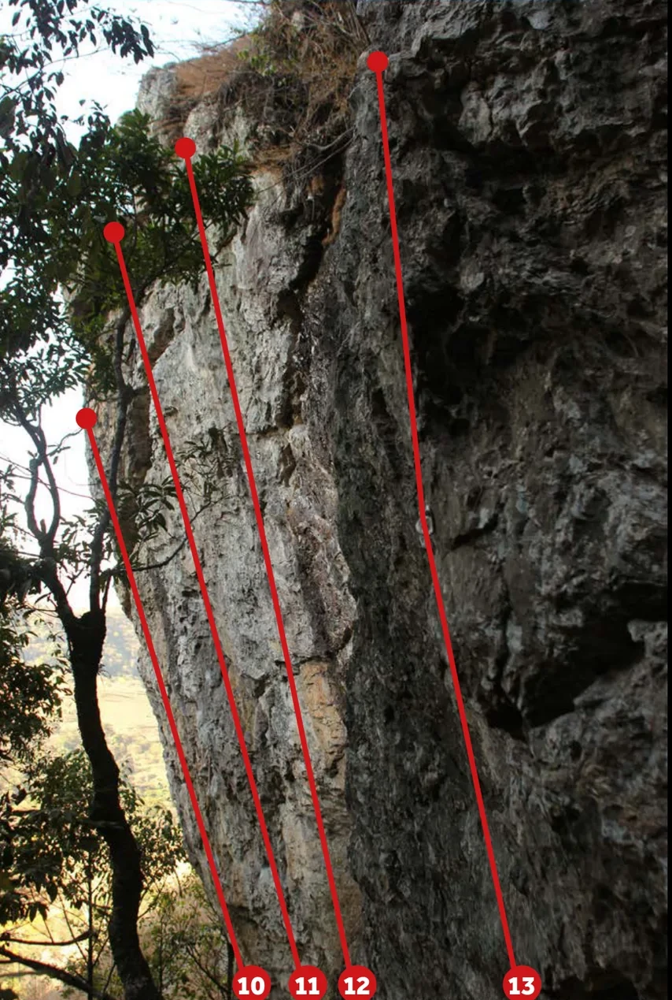
    - **largura_mapa**: 854
    - **altura_mapa**: 1269
    - **pontos_de_interesse**:
      - **[0]**:
        - **id**: 10
        - **label**: 10
        - **box**:
          - **x**: 320
          - **y**: 1250
          - **comprimento**: 43
          - **largura**: 33
      - **[1]**:
        - **id**: 11
        - **label**: 11
        - **box**:
          - **x**: 390
          - **y**: 1250
          - **comprimento**: 30
          - **largura**: 29
      - **[2]**:
        - **id**: 12
        - **label**: 12
        - **box**:
          - **x**: 452
          - **y**: 1249
          - **comprimento**: 34
          - **largura**: 30
      - **[3]**:
        - **id**: 13
        - **label**: 13
        - **box**:
          - **x**: 662
          - **y**: 1250
          - **comprimento**: 42
          - **largura**: 33
  - **[6]**:
    - **caminho_imagem_mapa**: 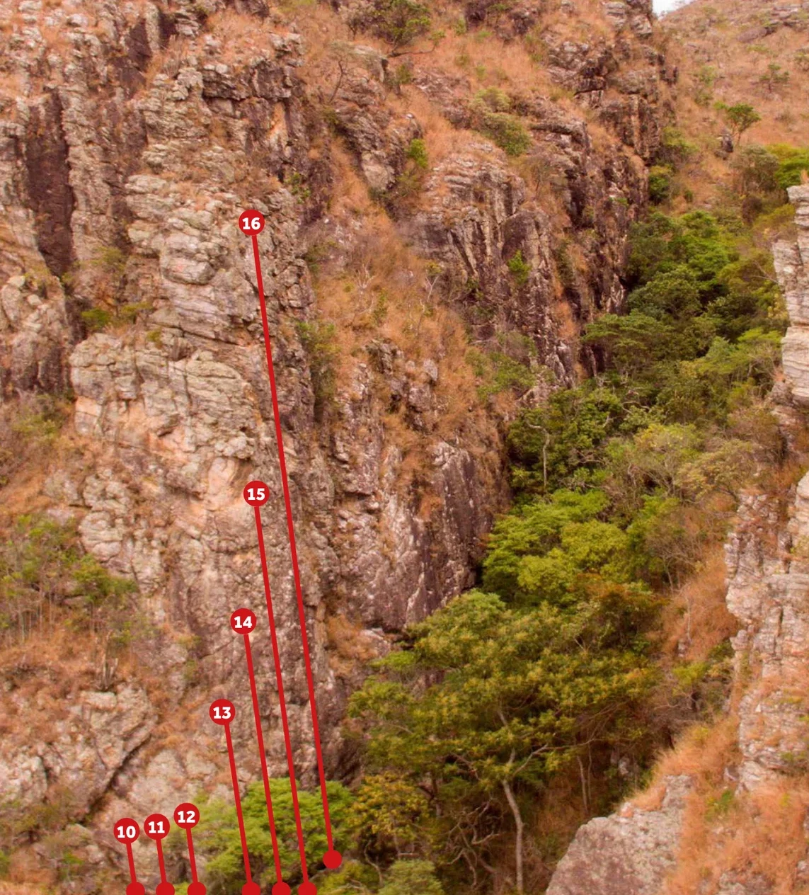
    - **largura_mapa**: 1143
    - **altura_mapa**: 1264
    - **pontos_de_interesse**:
      - **[0]**:
        - **id**: 10
        - **label**: 10
        - **box**:
          - **x**: 178
          - **y**: 1172
          - **comprimento**: 25
          - **largura**: 23
      - **[1]**:
        - **id**: 11
        - **label**: 11
        - **box**:
          - **x**: 220
          - **y**: 1168
          - **comprimento**: 23
          - **largura**: 22
      - **[2]**:
        - **id**: 12
        - **label**: 12
        - **box**:
          - **x**: 262
          - **y**: 1154
          - **comprimento**: 32
          - **largura**: 25
      - **[3]**:
        - **id**: 13
        - **label**: 13
        - **box**:
          - **x**: 313
          - **y**: 1006
          - **comprimento**: 30
          - **largura**: 25
      - **[4]**:
        - **id**: 14
        - **label**: 14
        - **box**:
          - **x**: 342
          - **y**: 878
          - **comprimento**: 33
          - **largura**: 25
      - **[5]**:
        - **id**: 15
        - **label**: 15
        - **box**:
          - **x**: 362
          - **y**: 697
          - **comprimento**: 33
          - **largura**: 26
      - **[6]**:
        - **id**: 16
        - **label**: 16
        - **box**:
          - **x**: 354
          - **y**: 315
          - **comprimento**: 37
          - **largura**: 30
  - **[7]**:
    - **caminho_imagem_mapa**: 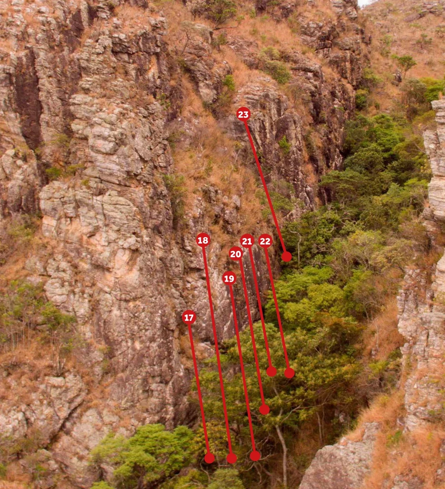
    - **largura_mapa**: 1151
    - **altura_mapa**: 1264
    - **pontos_de_interesse**:
      - **[0]**:
        - **id**: 17
        - **label**: 17
        - **box**:
          - **x**: 488
          - **y**: 820
          - **comprimento**: 29
          - **largura**: 25
      - **[1]**:
        - **id**: 18
        - **label**: 18
        - **box**:
          - **x**: 525
          - **y**: 622
          - **comprimento**: 34
          - **largura**: 25
      - **[2]**:
        - **id**: 19
        - **label**: 19
        - **box**:
          - **x**: 592
          - **y**: 720
          - **comprimento**: 32
          - **largura**: 26
      - **[3]**:
        - **id**: 20
        - **label**: 20
        - **box**:
          - **x**: 608
          - **y**: 657
          - **comprimento**: 37
          - **largura**: 28
      - **[4]**:
        - **id**: 21
        - **label**: 21
        - **box**:
          - **x**: 639
          - **y**: 622
          - **comprimento**: 24
          - **largura**: 24
      - **[5]**:
        - **id**: 22
        - **label**: 22
        - **box**:
          - **x**: 686
          - **y**: 623
          - **comprimento**: 26
          - **largura**: 22
      - **[6]**:
        - **id**: 23
        - **label**: 23
        - **box**:
          - **x**: 628
          - **y**: 294
          - **comprimento**: 35
          - **largura**: 29
  - **[8]**:
    - **caminho_imagem_mapa**: 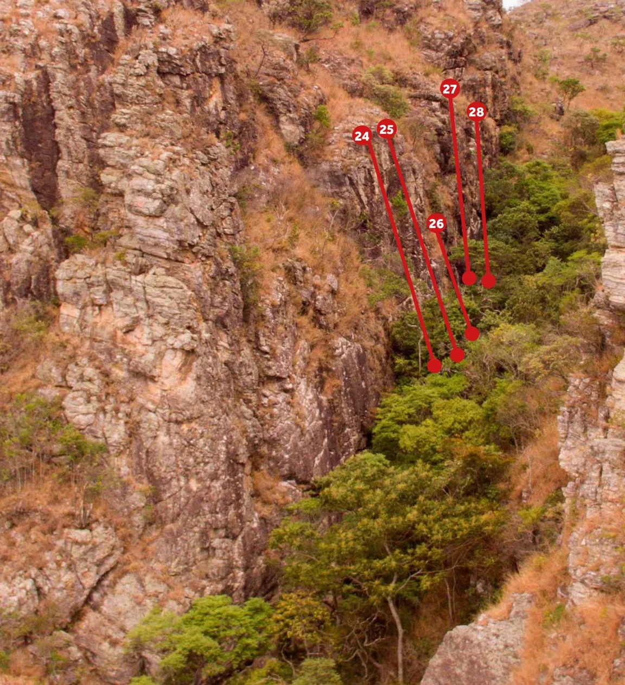
    - **largura_mapa**: 1152
    - **altura_mapa**: 1261
    - **pontos_de_interesse**:
      - **[0]**:
        - **id**: 24
        - **label**: 24
        - **box**:
          - **x**: 666
          - **y**: 250
          - **comprimento**: 37
          - **largura**: 28
      - **[1]**:
        - **id**: 25
        - **label**: 25
        - **box**:
          - **x**: 711
          - **y**: 238
          - **comprimento**: 34
          - **largura**: 26
      - **[2]**:
        - **id**: 26
        - **label**: 26
        - **box**:
          - **x**: 804
          - **y**: 410
          - **comprimento**: 34
          - **largura**: 25
      - **[3]**:
        - **id**: 27
        - **label**: 27
        - **box**:
          - **x**: 828
          - **y**: 164
          - **comprimento**: 30
          - **largura**: 25
      - **[4]**:
        - **id**: 28
        - **label**: 28
        - **box**:
          - **x**: 878
          - **y**: 206
          - **comprimento**: 35
          - **largura**: 25
- **escaladas**:
  - **[0]**:
    - **via_esportiva**:
      - **nome**: Love's in the Air
      - **dificuldade**: BR_6
      - **extensao**: 10
      - **quantidade_protecoes_intermediarias**: 4
      - **quantidade_protecoes_parada**: 2
      - **conquistadores**:
        - Laurêncio Jr
        - Anna Luiza Vilela
      - **data_abertura**: 2015
  - **[1]**:
    - **via_esportiva**:
      - **nome**: BH em Chamas
      - **dificuldade**: BR_6
      - **extensao**: 10
      - **quantidade_protecoes_intermediarias**: 4
      - **quantidade_protecoes_parada**: 2
      - **conquistadores**:
        - Laurêncio Jr
        - Anna Luiza Vilela
      - **data_abertura**: 2015
  - **[2]**:
    - **via_esportiva**:
      - **nome**: Revolta dos Vinagres
      - **dificuldade**: BR_6SUP
      - **extensao**: 10
      - **quantidade_protecoes_intermediarias**: 4
      - **quantidade_protecoes_parada**: 2
      - **conquistadores**:
        - Laurêncio Jr
        - Anna Luiza Vilela
      - **data_abertura**: 2015
  - **[3]**:
    - **via_esportiva**:
      - **nome**: De Pai para Filho
      - **dificuldade**: BR_6
      - **extensao**: 8
      - **quantidade_protecoes_intermediarias**: 2
      - **quantidade_protecoes_parada**: 2
      - **conquistadores**:
        - Daiex de Almeida
      - **data_abertura**: 2016
  - **[4]**:
    - **via_esportiva**:
      - **nome**: Amor de Mãe
      - **dificuldade**: BR_6
      - **extensao**: 8
      - **quantidade_protecoes_intermediarias**: 3
      - **quantidade_protecoes_parada**: 2
      - **conquistadores**:
        - Daiex de Almeida
      - **data_abertura**: 2016
  - **[5]**:
    - **via_esportiva**:
      - **nome**: Pagador de Promessa
      - **dificuldade**: BR_6SUP
      - **extensao**: 10
      - **quantidade_protecoes_intermediarias**: 3
      - **quantidade_protecoes_parada**: 2
      - **conquistadores**:
        - Laurêncio Jr
        - Alexandre Fei
      - **data_abertura**: 2013
  - **[6]**:
    - **via_esportiva**:
      - **nome**: Grande Família
      - **dificuldade**: BR_6
      - **extensao**: 15
      - **conquistadores**:
        - Alexandre Fei
        - Gustavo Maneira
      - **data_abertura**: 2013
  - **[7]**:
    - **via_esportiva**:
      - **nome**: Sangue do meu Sangue
      - **dificuldade**: BR_6
      - **extensao**: 10
      - **quantidade_protecoes_intermediarias**: 4
      - **quantidade_protecoes_parada**: 2
      - **conquistadores**:
        - Alexandre Fei
      - **data_abertura**: 2013
  - **[8]**:
    - **via_esportiva**:
      - **nome**: Cocalcinhas
      - **dificuldade**: BR_6
      - **extensao**: 10
      - **quantidade_protecoes_intermediarias**: 4
      - **quantidade_protecoes_parada**: 2
      - **conquistadores**:
        - Alexandre Fei
      - **data_abertura**: 2013
  - **[9]**:
    - **via_esportiva**:
      - **nome**: Guerreiro da Bocaina
      - **dificuldade**: BR_7A
      - **extensao**: 10
      - **quantidade_protecoes_intermediarias**: 4
      - **quantidade_protecoes_parada**: 2
      - **conquistadores**:
        - Alexandre Fei
      - **data_abertura**: 2013
  - **[10]**:
    - **via_esportiva**:
      - **nome**: Samurai Rastafari
      - **dificuldade**: BR_7B
      - **extensao**: 10
      - **quantidade_protecoes_intermediarias**: 4
      - **quantidade_protecoes_parada**: 2
      - **conquistadores**:
        - Alexandre Fei
      - **data_abertura**: 2013
  - **[11]**:
    - **via_esportiva**:
      - **nome**: Ceder Writhe
      - **dificuldade**: BR_8C
      - **extensao**: 12
      - **quantidade_protecoes_intermediarias**: 5
      - **quantidade_protecoes_parada**: 2
      - **conquistadores**:
        - Alexandre Fei
      - **data_abertura**: 2013
  - **[12]**:
    - **via_esportiva**:
      - **nome**: Sai pra Lá Sr. Doutor
      - **dificuldade**: BR_7A
      - **extensao**: 12
      - **quantidade_protecoes_intermediarias**: 5
      - **quantidade_protecoes_parada**: 2
      - **conquistadores**:
        - Daiex de Almeida
      - **data_abertura**: 2013
  - **[13]**:
    - **via_esportiva**:
      - **nome**: Maniaco Sexual
      - **dificuldade**: BR_7A
      - **extensao**: 12
      - **quantidade_protecoes_intermediarias**: 4
      - **quantidade_protecoes_parada**: 2
      - **conquistadores**:
        - Alexandre Fei
      - **data_abertura**: 2013
  - **[14]**:
    - **via_esportiva**:
      - **nome**: Paraiboult
      - **dificuldade**: INDEFINIDO
      - **extensao**: 20
      - **quantidade_protecoes_intermediarias**: 6
      - **quantidade_protecoes_parada**: 2
      - **conquistadores**:
        - Alexandre Fei
      - **data_abertura**: 2013
  - **[15]**:
    - **via_esportiva**:
      - **nome**: Mulheres ao Poder
      - **dificuldade**: BR_6SUP
      - **extensao**: 30
      - **quantidade_protecoes_intermediarias**: 13
      - **quantidade_protecoes_parada**: 2
      - **conquistadores**:
        - Diego Leonardo
        - Alexandre Fei
      - **data_abertura**: 2013
  - **[16]**:
    - **via_esportiva**:
      - **nome**: Invasão Bacteriana
      - **dificuldade**: BR_7A
      - **extensao**: 10
      - **quantidade_protecoes_intermediarias**: 5
      - **quantidade_protecoes_parada**: 2
      - **conquistadores**:
        - Alexandre Fei
      - **data_abertura**: 2013
  - **[17]**:
    - **via_esportiva**:
      - **nome**: Yes We Can
      - **dificuldade**: BR_6SUP
      - **extensao**: 20
      - **quantidade_protecoes_intermediarias**: 7
      - **quantidade_protecoes_parada**: 2
      - **conquistadores**:
        - Alexandre Fei
      - **data_abertura**: 2013
  - **[18]**:
    - **via_esportiva**:
      - **nome**: Galo Doido
      - **dificuldade**: BR_6SUP
      - **extensao**: 12
      - **quantidade_protecoes_intermediarias**: 6
      - **quantidade_protecoes_parada**: 2
      - **conquistadores**:
        - Alexandre Fei
      - **data_abertura**: 2013
  - **[19]**:
    - **via_esportiva**:
      - **nome**: Baby Roots
      - **dificuldade**: BR_6SUP
      - **extensao**: 12
      - **quantidade_protecoes_intermediarias**: 4
      - **quantidade_protecoes_parada**: 2
      - **conquistadores**:
        - Juliano Peter
      - **data_abertura**: 2013
  - **[20]**:
    - **via_esportiva**:
      - **nome**: Canelinha de Ouro
      - **dificuldade**: BR_6
      - **extensao**: 12
      - **quantidade_protecoes_intermediarias**: 4
      - **quantidade_protecoes_parada**: 2
      - **conquistadores**:
        - Alexandre Fei
      - **data_abertura**: 2013
  - **[21]**:
    - **via_esportiva**:
      - **nome**: Rei Leão
      - **dificuldade**: BR_7A
      - **extensao**: 15
      - **quantidade_protecoes_intermediarias**: 4
      - **quantidade_protecoes_parada**: 2
      - **conquistadores**:
        - Mateus Martins
        - Arthur Martins
      - **data_abertura**: 2013
  - **[22]**:
    - **via_esportiva**:
      - **nome**: Maluco Beleza
      - **dificuldade**: BR_7B
      - **conquistadores**:
        - Daiex de Almeida
        - Alexandre Fei
      - **data_abertura**: 2013
  - **[23]**:
    - **via_esportiva**:
      - **nome**: Peter Park
      - **dificuldade**: INDEFINIDO
      - **extensao**: 25
      - **quantidade_protecoes_intermediarias**: 9
      - **quantidade_protecoes_parada**: 2
      - **conquistadores**:
        - Juliano Peter Park
      - **data_abertura**: 2013
  - **[24]**:
    - **via_esportiva**:
      - **nome**: Super Poderosa
      - **dificuldade**: BR_7A
      - **extensao**: 25
      - **quantidade_protecoes_intermediarias**: 8
      - **quantidade_protecoes_parada**: 2
      - **conquistadores**:
        - Mateus Martins
        - Arthur Martins
      - **data_abertura**: 2013
  - **[25]**:
    - **via_esportiva**:
      - **nome**: Cinco Vira, Dez Acaba
      - **dificuldade**: BR_6SUP
      - **extensao**: 10
      - **quantidade_protecoes_intermediarias**: 4
      - **quantidade_protecoes_parada**: 2
      - **conquistadores**:
        - Alex
      - **data_abertura**: 2013
  - **[26]**:
    - **via_esportiva**:
      - **nome**: Dunas
      - **dificuldade**: BR_6SUP
      - **extensao**: 17
      - **quantidade_protecoes_intermediarias**: 7
      - **quantidade_protecoes_parada**: 2
      - **conquistadores**:
        - Alex
      - **data_abertura**: 2013
  - **[27]**:
    - **via_esportiva**:
      - **nome**: Poeira Cósmica
      - **dificuldade**: BR_7A
      - **extensao**: 15
      - **quantidade_protecoes_intermediarias**: 6
      - **quantidade_protecoes_parada**: 2
      - **conquistadores**:
        - Alex
      - **data_abertura**: 2013

## Parte: setor_tapa_na_cara

### Setor (Pico: Bocaina Park)

- **descricao**:
    # Setor Tapa na Cara
    
    |  |
    | :--: |
    | *Setor Tapa na Cara* |
    
    Setor com vias curtas e técnicas, ideal para quem busca vias de 6º e 7º grau.
    
    > [!TIP]
    > Leve seu lixo e outro que encontrar para a cidade. Não faça necessidades fisiológicas nas trilhas e base de vias. Avisar a administração sobre a abertura de novas vias de escalada. **USE CAPACETE NAS BASES DE VIAS DE ESCALADA.**
- **nome**: Tapa na Cara
- **mapas**:
  - **[0]**:
    - **caminho_imagem_mapa**: 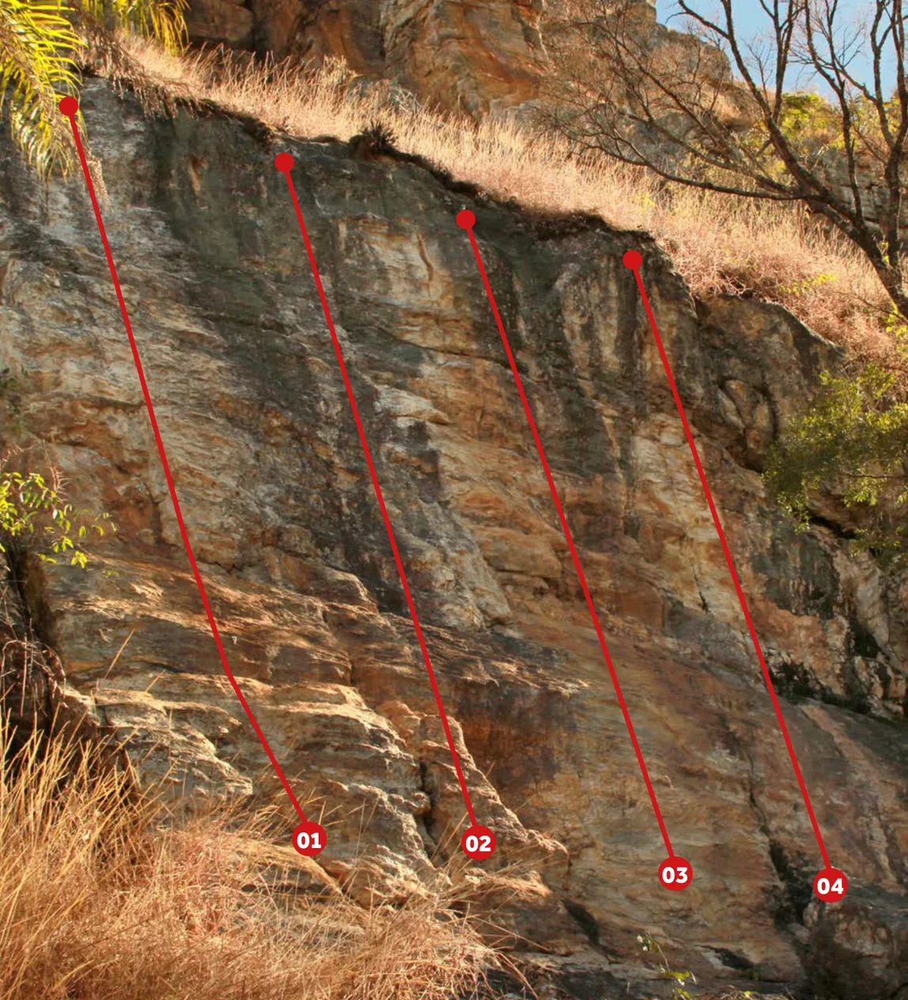
    - **largura_mapa**: 1148
    - **altura_mapa**: 1264
    - **pontos_de_interesse**:
      - **[0]**:
        - **id**: 01
        - **label**: 01
        - **box**:
          - **x**: 391
          - **y**: 1062
          - **comprimento**: 38
          - **largura**: 30
      - **[1]**:
        - **id**: 02
        - **label**: 02
        - **box**:
          - **x**: 604
          - **y**: 1066
          - **comprimento**: 43
          - **largura**: 31
      - **[2]**:
        - **id**: 03
        - **label**: 03
        - **box**:
          - **x**: 854
          - **y**: 1106
          - **comprimento**: 39
          - **largura**: 29
      - **[3]**:
        - **id**: 04
        - **label**: 04
        - **box**:
          - **x**: 1050
          - **y**: 1120
          - **comprimento**: 44
          - **largura**: 32
    - **referencias**:
      - **[0]**:
        - **escalada**: Marcha lenta
        - **ids**:
          - 01
      - **[1]**:
        - **escalada**: Bundalelê
        - **ids**:
          - 02
      - **[2]**:
        - **escalada**: Tapa na Cara
        - **ids**:
          - 03
      - **[3]**:
        - **escalada**: Cotonete Molhado
        - **ids**:
          - 04
- **escaladas**:
  - **[0]**:
    - **via_esportiva**:
      - **nome**: Marcha lenta
      - **dificuldade**: BR_6
      - **extensao**: 8
      - **quantidade_protecoes_intermediarias**: 3
      - **quantidade_protecoes_parada**: 2
      - **conquistadores**:
        - Diego Leonardo
        - Allisson Ismael
      - **data_abertura**: 2013
  - **[1]**:
    - **via_esportiva**:
      - **nome**: Bundalelê
      - **dificuldade**: BR_6
      - **extensao**: 10
      - **quantidade_protecoes_intermediarias**: 4
      - **quantidade_protecoes_parada**: 2
      - **conquistadores**:
        - Diego Leonardo
        - Daiex
        - Paulo
      - **data_abertura**: 2013
  - **[2]**:
    - **via_esportiva**:
      - **nome**: Tapa na Cara
      - **dificuldade**: BR_7A
      - **extensao**: 10
      - **quantidade_protecoes_intermediarias**: 3
      - **quantidade_protecoes_parada**: 2
      - **conquistadores**:
        - Diego Leonardo
        - Gustavo Maneira
      - **data_abertura**: 2013
  - **[3]**:
    - **via_esportiva**:
      - **nome**: Cotonete Molhado
      - **dificuldade**: BR_6SUP
      - **extensao**: 8
      - **quantidade_protecoes_intermediarias**: 3
      - **quantidade_protecoes_parada**: 2
      - **conquistadores**:
        - Diego Leonardo
        - Daiex
        - Paulo
      - **data_abertura**: 2013

## Parte: setor_terceiro_andar

### Setor (Pico: Bocaina Park)

- **descricao**:
    # Setor Terceiro Andar
    
    |  |
    | :--: |
    | *Setor Terceiro Andar* |
    
    O Setor Terceiro Andar é conhecido por suas vias de alta dificuldade, incluindo projetos e vias de 9º grau consolidado.
    
    > [!TIP]
    > Leve seu lixo e outro que encontrar para a cidade. Não faça necessidades fisiológicas nas trilhas e base de vias. Avisar a administração sobre a abertura de novas vias de escalada. **USE CAPACETE NAS BASES DE VIAS DE ESCALADA.**
- **nome**: Terceiro Andar
- **mapas**:
  - **[0]**:
    - **caminho_imagem_mapa**: 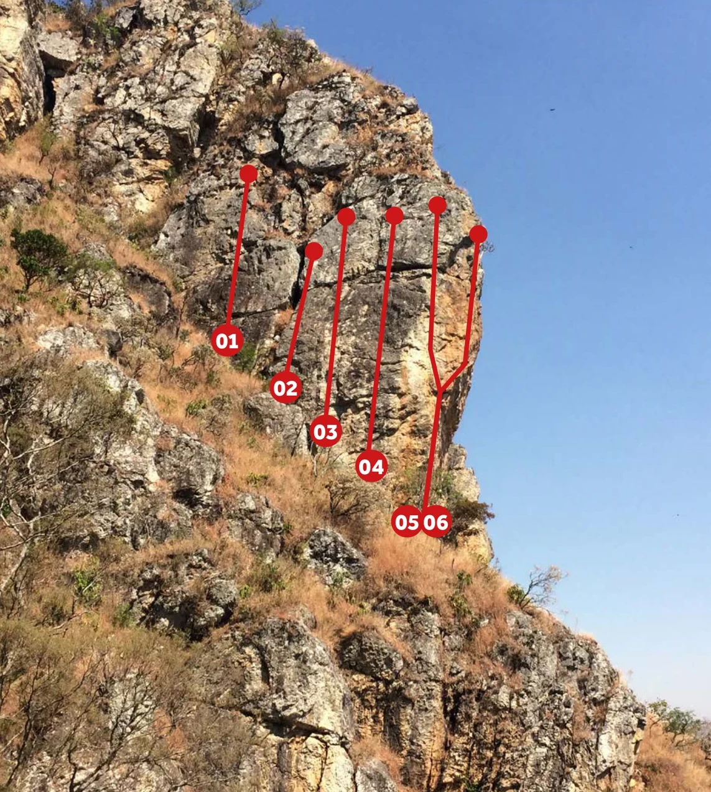
    - **largura_mapa**: 1143
    - **altura_mapa**: 1273
    - **pontos_de_interesse**:
      - **[0]**:
        - **id**: 01
        - **label**: 01
        - **box**:
          - **x**: 364
          - **y**: 548
          - **comprimento**: 46
          - **largura**: 38
      - **[1]**:
        - **id**: 02
        - **label**: 02
        - **box**:
          - **x**: 460
          - **y**: 624
          - **comprimento**: 49
          - **largura**: 37
      - **[2]**:
        - **id**: 03
        - **label**: 03
        - **box**:
          - **x**: 523
          - **y**: 694
          - **comprimento**: 52
          - **largura**: 41
      - **[3]**:
        - **id**: 04
        - **label**: 04
        - **box**:
          - **x**: 596
          - **y**: 751
          - **comprimento**: 50
          - **largura**: 36
      - **[4]**:
        - **id**: 05
        - **label**: 05
        - **box**:
          - **x**: 654
          - **y**: 838
          - **comprimento**: 33
          - **largura**: 31
      - **[5]**:
        - **id**: 06
        - **label**: 06
        - **box**:
          - **x**: 702
          - **y**: 838
          - **comprimento**: 36
          - **largura**: 31
    - **referencias**:
      - **[0]**:
        - **escalada**: Pêro no Mucho
        - **ids**:
          - 01
      - **[1]**:
        - **escalada**: Meia Hora
        - **ids**:
          - 02
      - **[2]**:
        - **escalada**: Falta de Educação
        - **ids**:
          - 03
      - **[3]**:
        - **escalada**: De Mão Beijada
        - **ids**:
          - 04
      - **[4]**:
        - **escalada**: Efeito Cascata
        - **ids**:
          - 05
      - **[5]**:
        - **escalada**: Efeito Colateral
        - **ids**:
          - 06
      - **[6]**:
        - **escalada**: Só pra Variar
        - **ids**:
          - 07
      - **[7]**:
        - **escalada**: Rock Supimpa
        - **ids**:
          - 08
      - **[8]**:
        - **escalada**: Você Decide
        - **ids**:
          - 09
      - **[9]**:
        - **escalada**: Grande Hotel
        - **ids**:
          - 10
      - **[10]**:
        - **escalada**: Cura Trimura
        - **ids**:
          - 11
      - **[11]**:
        - **escalada**: Próprio Veneno
        - **ids**:
          - 12
      - **[12]**:
        - **escalada**: Própria Loucura
        - **ids**:
          - 13
      - **[13]**:
        - **escalada**: Honney Money
        - **ids**:
          - 14
      - **[14]**:
        - **escalada**: Efeito Variado
        - **ids**:
          - 06
      - **[15]**:
        - **escalada**: Só paracolateral
        - **ids**:
          - 07
      - **[16]**:
        - **escalada**: Trimura do Hotel
        - **ids**:
          - 11
  - **[1]**:
    - **caminho_imagem_mapa**: 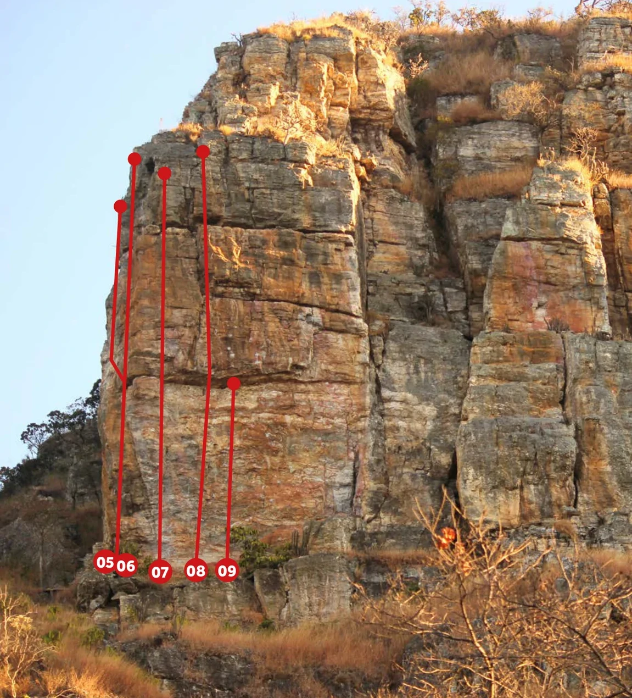
    - **largura_mapa**: 1151
    - **altura_mapa**: 1270
    - **pontos_de_interesse**:
      - **[0]**:
        - **id**: 05
        - **label**: 05
        - **box**:
          - **x**: 192
          - **y**: 1022
          - **comprimento**: 29
          - **largura**: 25
      - **[1]**:
        - **id**: 06
        - **label**: 06
        - **box**:
          - **x**: 230
          - **y**: 1028
          - **comprimento**: 31
          - **largura**: 27
      - **[2]**:
        - **id**: 07
        - **label**: 07
        - **box**:
          - **x**: 292
          - **y**: 1040
          - **comprimento**: 34
          - **largura**: 28
      - **[3]**:
        - **id**: 08
        - **label**: 08
        - **box**:
          - **x**: 356
          - **y**: 1036
          - **comprimento**: 31
          - **largura**: 28
      - **[4]**:
        - **id**: 09
        - **label**: 09
        - **box**:
          - **x**: 412
          - **y**: 1036
          - **comprimento**: 31
          - **largura**: 29
  - **[2]**:
    - **caminho_imagem_mapa**: 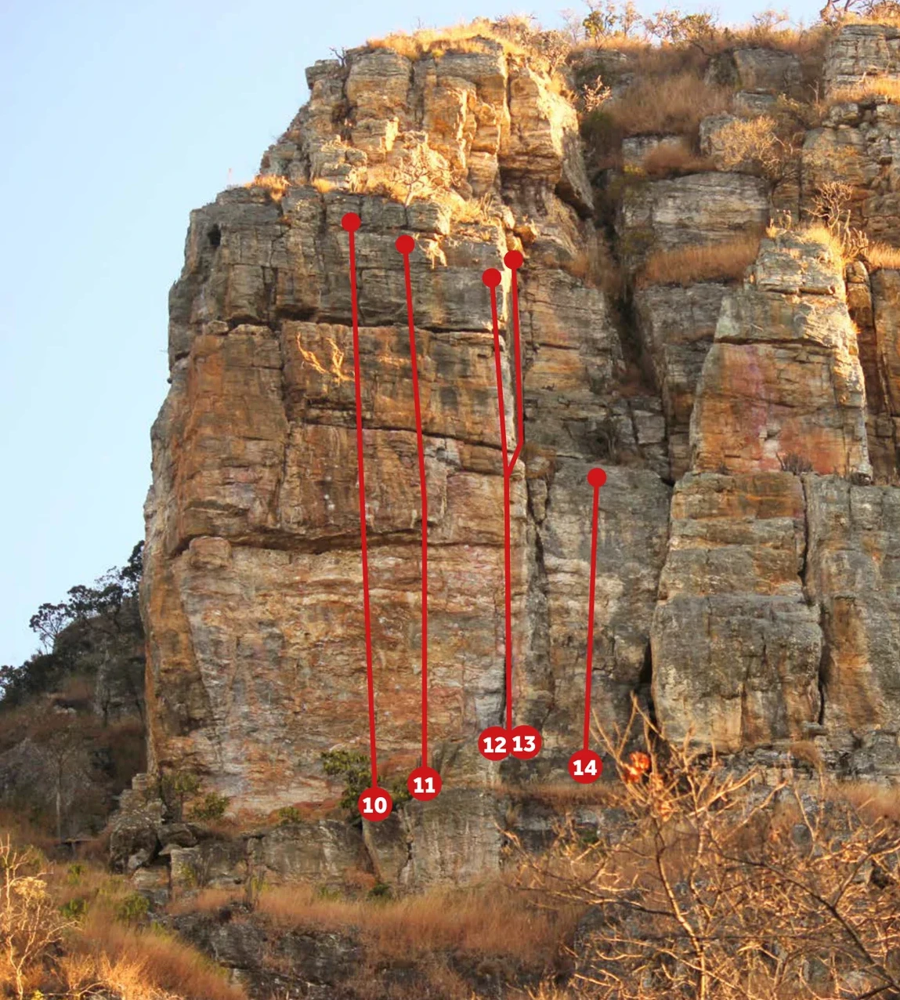
    - **largura_mapa**: 1149
    - **altura_mapa**: 1276
    - **pontos_de_interesse**:
      - **[0]**:
        - **id**: 10
        - **label**: 10
        - **box**:
          - **x**: 478
          - **y**: 1028
          - **comprimento**: 40
          - **largura**: 29
      - **[1]**:
        - **id**: 11
        - **label**: 11
        - **box**:
          - **x**: 541
          - **y**: 1002
          - **comprimento**: 36
          - **largura**: 30
      - **[2]**:
        - **id**: 12
        - **label**: 12
        - **box**:
          - **x**: 630
          - **y**: 946
          - **comprimento**: 29
          - **largura**: 25
      - **[3]**:
        - **id**: 13
        - **label**: 13
        - **box**:
          - **x**: 668
          - **y**: 947
          - **comprimento**: 31
          - **largura**: 24
      - **[4]**:
        - **id**: 14
        - **label**: 14
        - **box**:
          - **x**: 746
          - **y**: 980
          - **comprimento**: 38
          - **largura**: 29
  - **[3]**:
    - **caminho_imagem_mapa**: 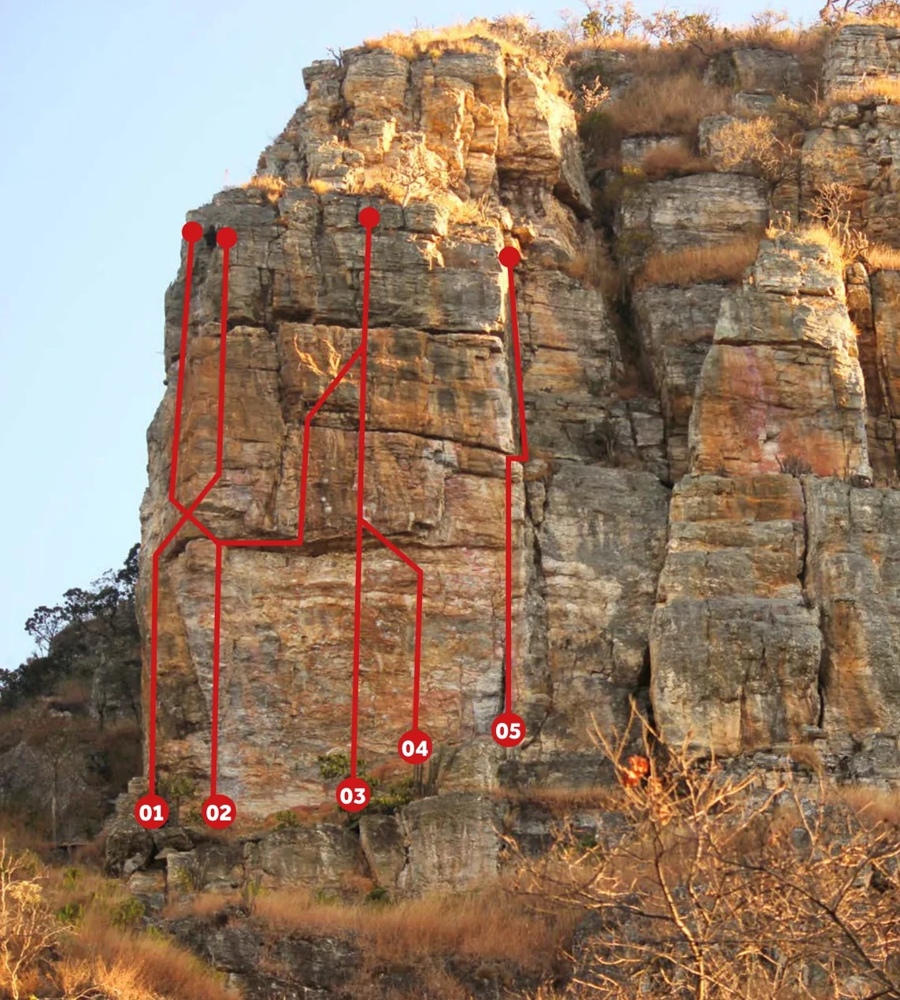
    - **largura_mapa**: 1143
    - **altura_mapa**: 1270
    - **pontos_de_interesse**:
      - **[0]**:
        - **id**: 01
        - **label**: 01
        - **box**:
          - **x**: 192
          - **y**: 1032
          - **comprimento**: 37
          - **largura**: 29
      - **[1]**:
        - **id**: 02
        - **label**: 02
        - **box**:
          - **x**: 278
          - **y**: 1032
          - **comprimento**: 41
          - **largura**: 32
      - **[2]**:
        - **id**: 03
        - **label**: 03
        - **box**:
          - **x**: 448
          - **y**: 1011
          - **comprimento**: 39
          - **largura**: 30
      - **[3]**:
        - **id**: 04
        - **label**: 04
        - **box**:
          - **x**: 527
          - **y**: 950
          - **comprimento**: 40
          - **largura**: 27
      - **[4]**:
        - **id**: 05
        - **label**: 05
        - **box**:
          - **x**: 645
          - **y**: 928
          - **comprimento**: 40
          - **largura**: 30
- **escaladas**:
  - **[0]**:
    - **via_esportiva**:
      - **nome**: Pêro no Mucho
      - **dificuldade**: BR_5
      - **extensao**: 10
      - **quantidade_protecoes_intermediarias**: 6
      - **quantidade_protecoes_parada**: 1
      - **conquistadores**:
        - Diego Leonardo
        - Jéssica Basso
      - **data_abertura**: 2014
  - **[1]**:
    - **via_esportiva**:
      - **nome**: Meia Hora
      - **dificuldade**: BR_6
      - **extensao**: 15
      - **quantidade_protecoes_intermediarias**: 6
      - **quantidade_protecoes_parada**: 2
      - **conquistadores**:
        - Diego Leonardo
        - Daiex de Almeida
      - **data_abertura**: 2012
  - **[2]**:
    - **via_esportiva**:
      - **nome**: Falta de Educação
      - **dificuldade**: BR_6SUP
      - **extensao**: 20
      - **quantidade_protecoes_intermediarias**: 7
      - **quantidade_protecoes_parada**: 2
      - **conquistadores**:
        - Diego Leonardo
        - Daiex de Almeida
      - **data_abertura**: 2012
  - **[3]**:
    - **via_esportiva**:
      - **nome**: De Mão Beijada
      - **dificuldade**: BR_7A
      - **extensao**: 20
      - **quantidade_protecoes_intermediarias**: 9
      - **quantidade_protecoes_parada**: 2
      - **conquistadores**:
        - Laurêncio Jr
        - Diego Leonardo
      - **data_abertura**: 2012
  - **[4]**:
    - **via_esportiva**:
      - **descricao**: Falta topo.
      - **nome**: Efeito Cascata
      - **dificuldade**: BR_7C
      - **extensao**: 20
      - **quantidade_protecoes_intermediarias**: 5
      - **conquistadores**:
        - Alessandro Imbeloni
        - Mara Imbeloni
      - **data_abertura**: 2013
  - **[5]**:
    - **via_esportiva**:
      - **nome**: Efeito Colateral
      - **dificuldade**: BR_9A
      - **extensao**: 25
      - **quantidade_protecoes_intermediarias**: 8
      - **quantidade_protecoes_parada**: 2
      - **conquistadores**:
        - Diego
        - Difora
        - Chorão
      - **data_abertura**: 2008
  - **[6]**:
    - **via_esportiva**:
      - **nome**: Só pra Variar
      - **dificuldade**: BR_9C
      - **extensao**: 25
      - **quantidade_protecoes_intermediarias**: 9
      - **quantidade_protecoes_parada**: 2
      - **conquistadores**:
        - Diego Leonardo
        - Gustavo Maneira
      - **data_abertura**: 2011
  - **[7]**:
    - **via_esportiva**:
      - **nome**: Rock Supimpa
      - **dificuldade**: BR_9B
      - **extensao**: 25
      - **quantidade_protecoes_intermediarias**: 8
      - **quantidade_protecoes_parada**: 2
      - **conquistadores**:
        - Diego Leonardo
        - Gustavo Maneira
      - **data_abertura**: 2012
  - **[8]**:
    - **via_esportiva**:
      - **nome**: Você Decide
      - **dificuldade**: BR_8A
      - **extensao**: 10
      - **quantidade_protecoes_intermediarias**: 4
      - **quantidade_protecoes_parada**: 2
      - **conquistadores**:
        - Diego Leonardo
        - Pedro Andrade
      - **data_abertura**: 2014
  - **[9]**:
    - **via_esportiva**:
      - **nome**: Grande Hotel
      - **dificuldade**: BR_9A
      - **extensao**: 25
      - **quantidade_protecoes_intermediarias**: 9
      - **quantidade_protecoes_parada**: 2
      - **conquistadores**:
        - Alexandre FEI
        - Diego Leonardo
      - **data_abertura**: 2013
  - **[10]**:
    - **via_esportiva**:
      - **nome**: Cura Trimura
      - **dificuldade**: BR_8B
      - **extensao**: 25
      - **quantidade_protecoes_intermediarias**: 9
      - **quantidade_protecoes_parada**: 2
      - **conquistadores**:
        - Laurêncio Jr.
      - **data_abertura**: 2013
  - **[11]**:
    - **via_esportiva**:
      - **nome**: Próprio Veneno
      - **dificuldade**: BR_7C
      - **extensao**: 20
      - **quantidade_protecoes_intermediarias**: 6
      - **quantidade_protecoes_parada**: 2
      - **conquistadores**:
        - Laurêncio Jr
        - Rafael Furtado
      - **data_abertura**: 2013
  - **[12]**:
    - **via_esportiva**:
      - **nome**: Própria Loucura
      - **dificuldade**: BR_9A
      - **extensao**: 20
      - **quantidade_protecoes_intermediarias**: 8
      - **quantidade_protecoes_parada**: 2
      - **conquistadores**:
        - Diego Leonardo
        - Rafael Furtado
      - **data_abertura**: 2016
  - **[13]**:
    - **via_esportiva**:
      - **nome**: Honney Money
      - **dificuldade**: BR_6SUP
      - **extensao**: 10
      - **quantidade_protecoes_intermediarias**: 6
      - **quantidade_protecoes_parada**: 2
      - **conquistadores**:
        - Diego
        - Gustavinho
        - Rafinha
      - **data_abertura**: 2016
  - **[14]**:
    - **via_esportiva**:
      - **descricao**: Faz o primeiro crux da Efeito Colateral e o segundo crux da Só Pra Variar.
      - **nome**: Efeito Variado
      - **dificuldade**: BR_9A
  - **[15]**:
    - **via_esportiva**:
      - **descricao**: Primeiro crux da via Só pra Variar com segundo crux da Efeito Colateral.
      - **nome**: Só paracolateral
      - **dificuldade**: BR_9A
  - **[16]**:
    - **via_esportiva**:
      - **descricao**: Primeiro crux da Cura Trimura com Crux da Grande Hotel.
      - **nome**: Trimura do Hotel
      - **dificuldade**: PROJETO

## Parte: setor_paulistas

### Setor (Pico: Bocaina Park)

- **descricao**:
    # Setor Paulistas
    
    | 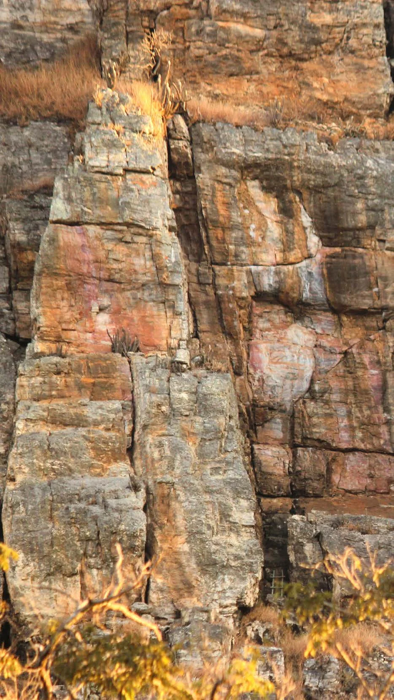 |
    | :--: |
    | *Setor Paulistas* |
    
    O Setor Paulistas contém uma grande variedade de vias técnicas, com destaque para a "Cortina de Fumaça" (9c).
    
    > [!TIP]
    > Leve seu lixo e outro que encontrar para a cidade. Não faça necessidades fisiológicas nas trilhas e base de vias. Avisar a administração sobre a abertura de novas vias de escalada. **USE CAPACETE NAS BASES DE VIAS DE ESCALADA.**
- **nome**: Paulistas
- **mapas**:
  - **[0]**:
    - **caminho_imagem_mapa**: 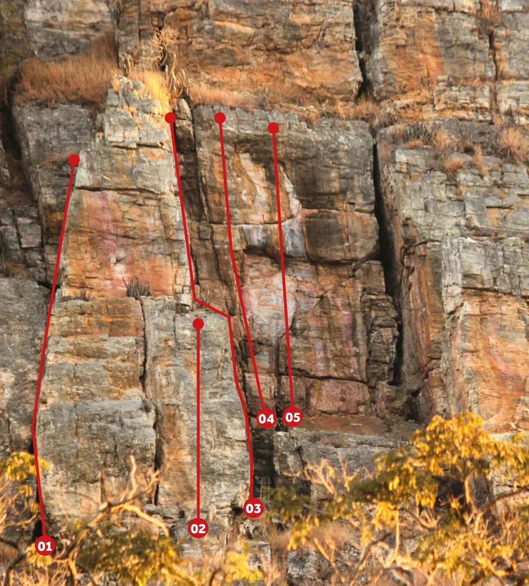
    - **largura_mapa**: 1143
    - **altura_mapa**: 1267
    - **pontos_de_interesse**:
      - **[0]**:
        - **id**: 01
        - **label**: 01
        - **box**:
          - **x**: 96
          - **y**: 1181
          - **comprimento**: 38
          - **largura**: 30
      - **[1]**:
        - **id**: 02
        - **label**: 02
        - **box**:
          - **x**: 428
          - **y**: 1143
          - **comprimento**: 38
          - **largura**: 30
      - **[2]**:
        - **id**: 03
        - **label**: 03
        - **box**:
          - **x**: 548
          - **y**: 1100
          - **comprimento**: 40
          - **largura**: 29
      - **[3]**:
        - **id**: 04
        - **label**: 04
        - **box**:
          - **x**: 576
          - **y**: 905
          - **comprimento**: 33
          - **largura**: 32
      - **[4]**:
        - **id**: 05
        - **label**: 05
        - **box**:
          - **x**: 632
          - **y**: 902
          - **comprimento**: 33
          - **largura**: 31
    - **referencias**:
      - **[0]**:
        - **escalada**: Física Quântica
        - **ids**:
          - 01
      - **[1]**:
        - **escalada**: Chamasamiga
        - **ids**:
          - 02
      - **[2]**:
        - **escalada**: Acupuntura
        - **ids**:
          - 03
      - **[3]**:
        - **escalada**: Capitão Bocaina
        - **ids**:
          - 04
      - **[4]**:
        - **escalada**: Miragem
        - **ids**:
          - 05
      - **[5]**:
        - **escalada**: Cortina de Fumaça
        - **ids**:
          - 06
      - **[6]**:
        - **escalada**: Sem Nome (Via 07)
        - **ids**:
          - 07
      - **[7]**:
        - **escalada**: Pubianos
        - **ids**:
          - 8
      - **[8]**:
        - **escalada**: Bocaina Roots
        - **ids**:
          - 9
      - **[9]**:
        - **escalada**: Decadentes
        - **ids**:
          - 10
      - **[10]**:
        - **escalada**: Pelos de Aldebaran
        - **ids**:
          - 11
      - **[11]**:
        - **escalada**: Ejaculação Precoce
        - **ids**:
          - 12
      - **[12]**:
        - **escalada**: Via do Laurêncio
        - **ids**:
          - 13
      - **[13]**:
        - **escalada**: International love
        - **ids**:
          - 14
      - **[14]**:
        - **escalada**: Cinquenteira
        - **ids**:
          - 15
      - **[15]**:
        - **escalada**: Boa idéia
        - **ids**:
          - 16
  - **[1]**:
    - **caminho_imagem_mapa**: 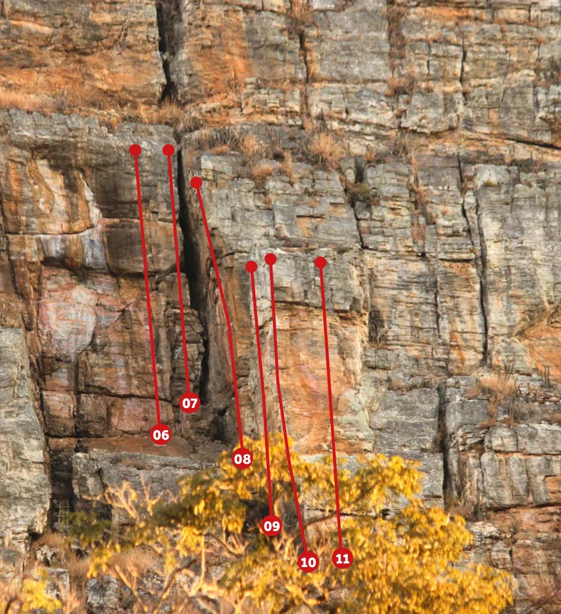
    - **largura_mapa**: 1152
    - **altura_mapa**: 1261
    - **pontos_de_interesse**:
      - **[0]**:
        - **id**: 06
        - **label**: 06
        - **box**:
          - **x**: 330
          - **y**: 893
          - **comprimento**: 43
          - **largura**: 32
      - **[1]**:
        - **id**: 07
        - **label**: 07
        - **box**:
          - **x**: 389
          - **y**: 828
          - **comprimento**: 38
          - **largura**: 32
      - **[2]**:
        - **id**: 08
        - **label**: 08
        - **box**:
          - **x**: 498
          - **y**: 943
          - **comprimento**: 43
          - **largura**: 32
      - **[3]**:
        - **id**: 09
        - **label**: 09
        - **box**:
          - **x**: 558
          - **y**: 1080
          - **comprimento**: 39
          - **largura**: 29
      - **[4]**:
        - **id**: 10
        - **label**: 10
        - **box**:
          - **x**: 634
          - **y**: 1156
          - **comprimento**: 39
          - **largura**: 29
      - **[5]**:
        - **id**: 11
        - **label**: 11
        - **box**:
          - **x**: 703
          - **y**: 1148
          - **comprimento**: 36
          - **largura**: 29
  - **[2]**:
    - **caminho_imagem_mapa**: 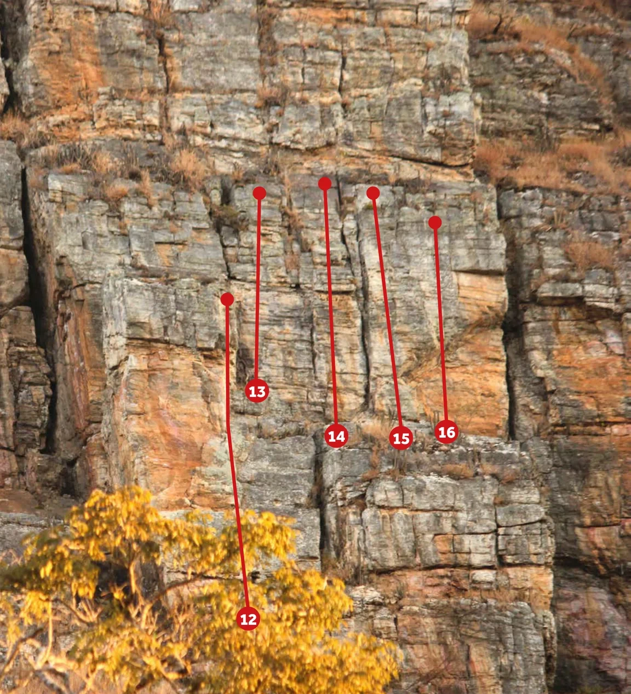
    - **largura_mapa**: 1152
    - **altura_mapa**: 1267
    - **pontos_de_interesse**:
      - **[0]**:
        - **id**: 12
        - **label**: 12
        - **box**:
          - **x**: 454
          - **y**: 1132
          - **comprimento**: 37
          - **largura**: 29
      - **[1]**:
        - **id**: 13
        - **label**: 13
        - **box**:
          - **x**: 469
          - **y**: 716
          - **comprimento**: 38
          - **largura**: 31
      - **[2]**:
        - **id**: 14
        - **label**: 14
        - **box**:
          - **x**: 614
          - **y**: 797
          - **comprimento**: 39
          - **largura**: 30
      - **[3]**:
        - **id**: 15
        - **label**: 15
        - **box**:
          - **x**: 732
          - **y**: 802
          - **comprimento**: 38
          - **largura**: 29
      - **[4]**:
        - **id**: 16
        - **label**: 16
        - **box**:
          - **x**: 815
          - **y**: 790
          - **comprimento**: 38
          - **largura**: 31
- **escaladas**:
  - **[0]**:
    - **via_esportiva**:
      - **nome**: Física Quântica
      - **dificuldade**: BR_7A
      - **extensao**: 20
      - **conquistadores**:
        - Laurêncio
        - Daiex
      - **data_abertura**: 2015
  - **[1]**:
    - **via_esportiva**:
      - **nome**: Chamasamiga
      - **dificuldade**: INDEFINIDO
      - **extensao**: 12
      - **conquistadores**:
        - Diego Leonardo
        - Gustavo Maneira
      - **data_abertura**: 2016
  - **[2]**:
    - **via_esportiva**:
      - **nome**: Acupuntura
      - **dificuldade**: BR_6SUP
      - **extensao**: 25
      - **quantidade_protecoes_intermediarias**: 8
      - **quantidade_protecoes_parada**: 2
      - **conquistadores**:
        - Paulinho (RP)
      - **data_abertura**: 2008
  - **[3]**:
    - **via_esportiva**:
      - **nome**: Capitão Bocaina
      - **dificuldade**: BR_8A
      - **extensao**: 15
      - **quantidade_protecoes_intermediarias**: 6
      - **quantidade_protecoes_parada**: 2
      - **conquistadores**:
        - Alexandre Fei
        - Laurêncio
      - **data_abertura**: 2014
  - **[4]**:
    - **via_esportiva**:
      - **nome**: Miragem
      - **dificuldade**: BR_9B
      - **extensao**: 15
      - **quantidade_protecoes_intermediarias**: 7
      - **quantidade_protecoes_parada**: 2
      - **conquistadores**:
        - Diego Leonardo
        - Rafael Furtado
      - **data_abertura**: 2015
  - **[5]**:
    - **via_esportiva**:
      - **nome**: Cortina de Fumaça
      - **dificuldade**: BR_9C
      - **extensao**: 15
      - **quantidade_protecoes_intermediarias**: 6
      - **quantidade_protecoes_parada**: 2
      - **conquistadores**:
        - Diego Leonardo
        - Gustavo Maneira
      - **data_abertura**: 2012
  - **[6]**:
    - **via_esportiva**:
      - **nome**: Sem Nome (Via 07)
      - **dificuldade**: BR_7B
      - **extensao**: 10
      - **quantidade_protecoes_intermediarias**: 5
      - **quantidade_protecoes_parada**: 2
      - **conquistadores**:
        - Rafael Furtado
        - Gustavo Maneira
      - **data_abertura**: 2015
  - **[7]**:
    - **via_esportiva**:
      - **nome**: Pubianos
      - **dificuldade**: BR_8A
      - **extensao**: 15
      - **quantidade_protecoes_intermediarias**: 6
      - **quantidade_protecoes_parada**: 2
      - **conquistadores**:
        - Paulinho (RP)
        - Alexandre Fei
      - **data_abertura**: 2014
  - **[8]**:
    - **via_esportiva**:
      - **nome**: Bocaina Roots
      - **dificuldade**: BR_7A
      - **extensao**: 10
      - **quantidade_protecoes_intermediarias**: 8
      - **quantidade_protecoes_parada**: 2
      - **conquistadores**:
        - Diego Leonardo
        - Gustavo Maneira
      - **data_abertura**: 2014
  - **[9]**:
    - **via_esportiva**:
      - **nome**: Decadentes
      - **dificuldade**: BR_7A
      - **extensao**: 15
      - **quantidade_protecoes_intermediarias**: 7
      - **quantidade_protecoes_parada**: 2
      - **conquistadores**:
        - Paulinho (RP)
        - Diego Leonardo
      - **data_abertura**: 2008/14
  - **[10]**:
    - **via_esportiva**:
      - **nome**: Pelos de Aldebaran
      - **dificuldade**: BR_7C
      - **extensao**: 15
      - **quantidade_protecoes_intermediarias**: 8
      - **quantidade_protecoes_parada**: 2
      - **conquistadores**:
        - Laurêncio
        - Diego Leonardo
      - **data_abertura**: 2014
  - **[11]**:
    - **via_esportiva**:
      - **nome**: Ejaculação Precoce
      - **dificuldade**: BR_7A
      - **extensao**: 15
      - **quantidade_protecoes_intermediarias**: 8
      - **quantidade_protecoes_parada**: 2
      - **conquistadores**:
        - Diego Leonardo
        - Laurêncio
      - **data_abertura**: 2014
  - **[12]**:
    - **via_esportiva**:
      - **nome**: Via do Laurêncio
      - **dificuldade**: BR_6SUP
      - **extensao**: 8
      - **conquistadores**:
        - Laurêncio
        - Zé Roberto
      - **data_abertura**: 2014
  - **[13]**:
    - **via_esportiva**:
      - **nome**: International love
      - **dificuldade**: BR_7A
      - **extensao**: 12
      - **quantidade_protecoes_intermediarias**: 7
      - **quantidade_protecoes_parada**: 2
      - **conquistadores**:
        - Etienne
        - Diego Leonardo
      - **data_abertura**: 2014
  - **[14]**:
    - **via_esportiva**:
      - **nome**: Cinquenteira
      - **dificuldade**: BR_6SUP
      - **extensao**: 8
      - **quantidade_protecoes_intermediarias**: 6
      - **quantidade_protecoes_parada**: 2
      - **conquistadores**:
        - Diego Leonardo
        - Gustavo Maneira
      - **data_abertura**: 2014
  - **[15]**:
    - **via_esportiva**:
      - **nome**: Boa idéia
      - **dificuldade**: BR_6SUP
      - **extensao**: 8
      - **quantidade_protecoes_intermediarias**: 5
      - **quantidade_protecoes_parada**: 2
      - **conquistadores**:
        - Deigo Leonardo
        - Daiex de Almeida
      - **data_abertura**: 2014

## Parte: setor_mezanino

### Setor (Pico: Bocaina Park)

- **descricao**:
    # Setor Mezanino
    
    | 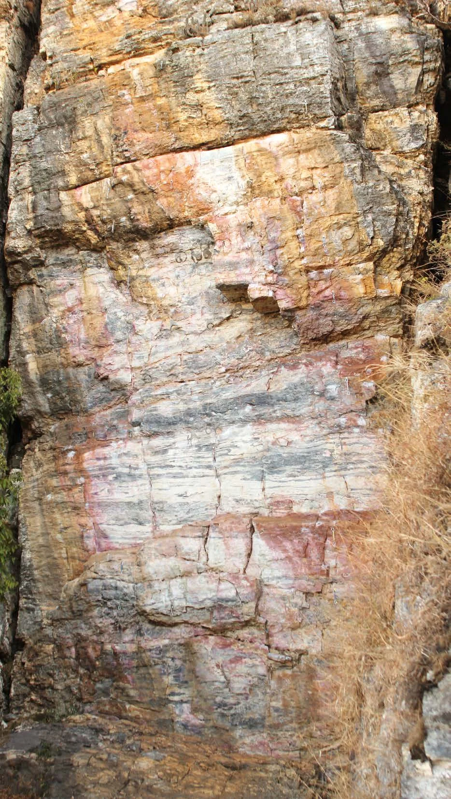 |
    | :--: |
    | *Setor Mezanino* |
    
    O Setor Mezanino oferece uma excelente mistura de vias fáceis (5º grau) e caminhos extremamente difíceis ultrapassando o 10º grau.
    
    > [!TIP]
    > Leve seu lixo e outro que encontrar para a cidade. Não faça necessidades fisiológicas nas trilhas e base de vias. Avisar a administração sobre a abertura de novas vias de escalada. **USE CAPACETE NAS BASES DE VIAS DE ESCALADA.**
- **nome**: Mezanino
- **mapas**:
  - **[0]**:
    - **caminho_imagem_mapa**: 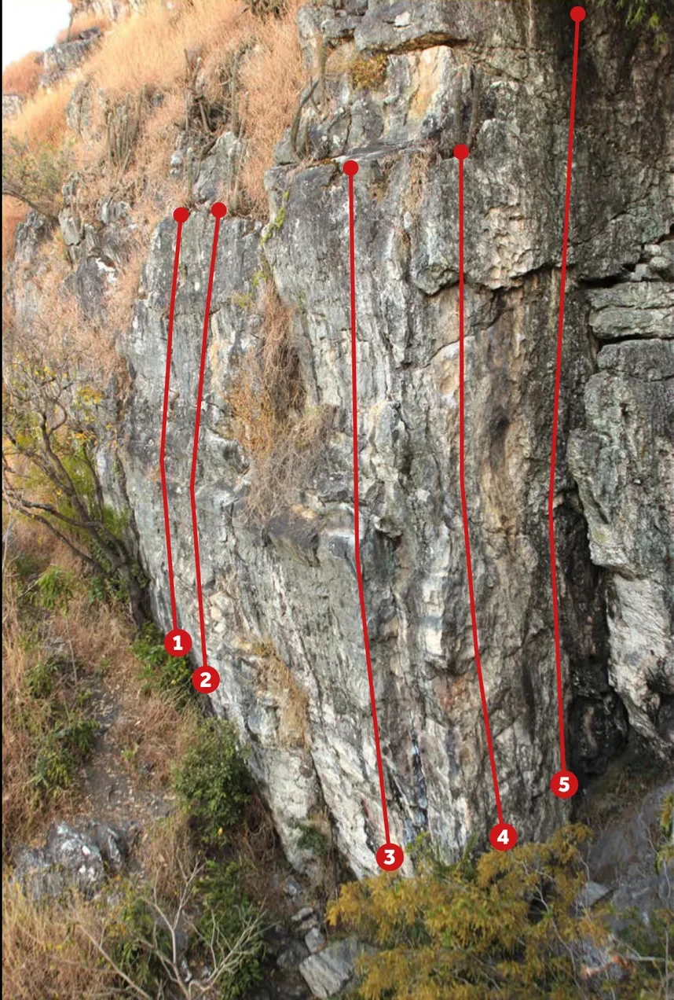
    - **largura_mapa**: 858
    - **altura_mapa**: 1272
    - **pontos_de_interesse**:
      - **[0]**:
        - **id**: 01
        - **label**: 01
        - **box**:
          - **x**: 226
          - **y**: 818
          - **comprimento**: 21
          - **largura**: 29
      - **[1]**:
        - **id**: 02
        - **label**: 02
        - **box**:
          - **x**: 262
          - **y**: 864
          - **comprimento**: 27
          - **largura**: 31
      - **[2]**:
        - **id**: 03
        - **label**: 03
        - **box**:
          - **x**: 496
          - **y**: 1089
          - **comprimento**: 20
          - **largura**: 26
      - **[3]**:
        - **id**: 04
        - **label**: 04
        - **box**:
          - **x**: 640
          - **y**: 1064
          - **comprimento**: 17
          - **largura**: 22
      - **[4]**:
        - **id**: 05
        - **label**: 05
        - **box**:
          - **x**: 718
          - **y**: 997
          - **comprimento**: 22
          - **largura**: 28
    - **referencias**:
      - **[0]**:
        - **escalada**: Alberto Roberto
        - **ids**:
          - 01
      - **[1]**:
        - **escalada**: Chico Anísio
        - **ids**:
          - 02
      - **[2]**:
        - **escalada**: Onjacktallbeck
        - **ids**:
          - 03
      - **[3]**:
        - **escalada**: Princípio Ativo
        - **ids**:
          - 04
      - **[4]**:
        - **escalada**: Suindara
        - **ids**:
          - 05
      - **[5]**:
        - **escalada**: São Jorge
        - **ids**:
          - 06
      - **[6]**:
        - **escalada**: Ramadan
        - **ids**:
          - 07
      - **[7]**:
        - **escalada**: Sabotagem
        - **ids**:
          - 08
      - **[8]**:
        - **escalada**: Universo Paralelo
        - **ids**:
          - 09
      - **[9]**:
        - **escalada**: Egocentrismo
        - **ids**:
          - 10
      - **[10]**:
        - **escalada**: Farinha do Mesmo Saco
        - **ids**:
          - 11
      - **[11]**:
        - **escalada**: Bafo de Onça
        - **ids**:
          - 12
      - **[12]**:
        - **escalada**: 12 anos
        - **ids**:
          - 13
      - **[13]**:
        - **escalada**: Mais Água no Feijão
        - **ids**:
          - 14
      - **[14]**:
        - **escalada**: Puberdade
        - **ids**:
          - 15
      - **[15]**:
        - **escalada**: Eldorado
        - **ids**:
          - 16
      - **[16]**:
        - **escalada**: Mais uma Prova de Amor
        - **ids**:
          - 17
      - **[17]**:
        - **escalada**: Sabotagem do Universo
        - **ids**:
          - 08
      - **[18]**:
        - **escalada**: Universo Sabotada
        - **ids**:
          - 09
      - **[19]**:
        - **escalada**: Ego Paralelo
        - **ids**:
          - 10
  - **[1]**:
    - **caminho_imagem_mapa**: 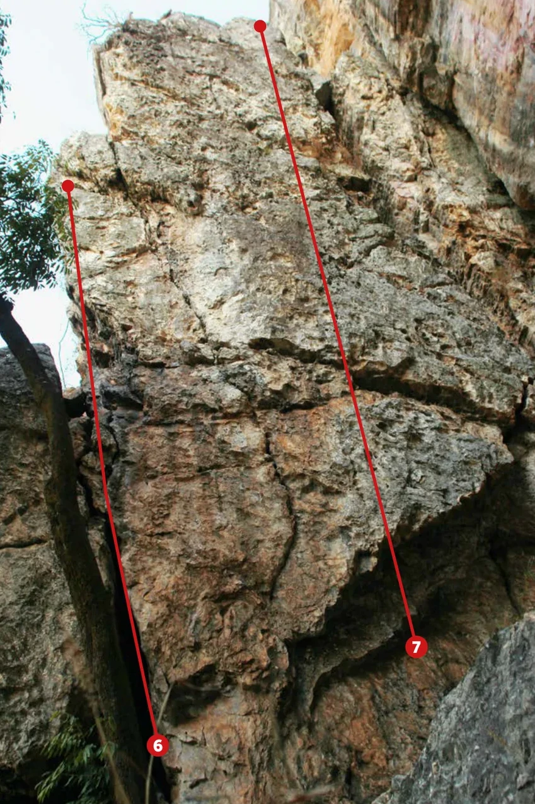
    - **largura_mapa**: 849
    - **altura_mapa**: 1273
    - **pontos_de_interesse**:
      - **[0]**:
        - **id**: 06
        - **label**: 06
        - **box**:
          - **x**: 250
          - **y**: 1180
          - **comprimento**: 21
          - **largura**: 27
      - **[1]**:
        - **id**: 07
        - **label**: 07
        - **box**:
          - **x**: 659
          - **y**: 1022
          - **comprimento**: 28
          - **largura**: 33
  - **[2]**:
    - **caminho_imagem_mapa**: 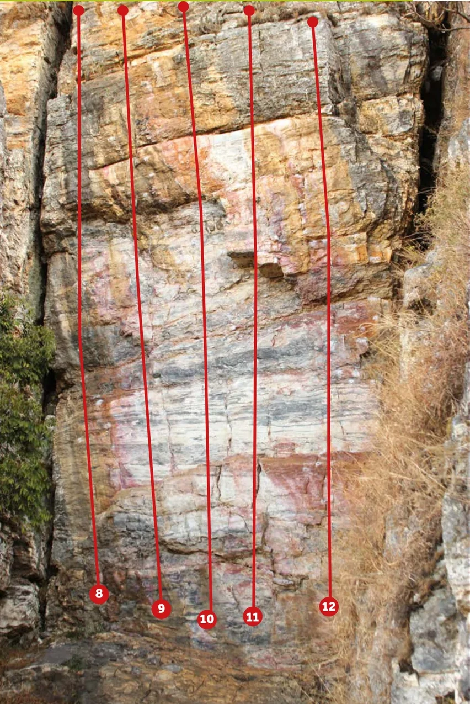
    - **largura_mapa**: 852
    - **altura_mapa**: 1275
    - **pontos_de_interesse**:
      - **[0]**:
        - **id**: 08
        - **label**: 08
        - **box**:
          - **x**: 180
          - **y**: 1074
          - **comprimento**: 17
          - **largura**: 22
      - **[1]**:
        - **id**: 09
        - **label**: 09
        - **box**:
          - **x**: 292
          - **y**: 1102
          - **comprimento**: 16
          - **largura**: 20
      - **[2]**:
        - **id**: 10
        - **label**: 10
        - **box**:
          - **x**: 375
          - **y**: 1121
          - **comprimento**: 32
          - **largura**: 26
      - **[3]**:
        - **id**: 11
        - **label**: 11
        - **box**:
          - **x**: 457
          - **y**: 1117
          - **comprimento**: 28
          - **largura**: 26
      - **[4]**:
        - **id**: 12
        - **label**: 12
        - **box**:
          - **x**: 596
          - **y**: 1098
          - **comprimento**: 31
          - **largura**: 27
  - **[3]**:
    - **caminho_imagem_mapa**: 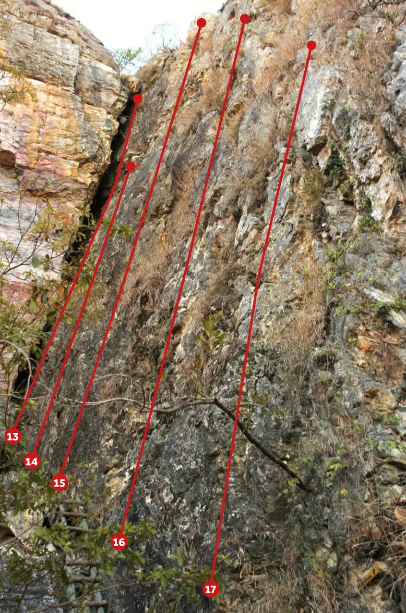
    - **largura_mapa**: 846
    - **altura_mapa**: 1275
    - **pontos_de_interesse**:
      - **[0]**:
        - **id**: 13
        - **label**: 13
        - **box**:
          - **x**: 26
          - **y**: 907
          - **comprimento**: 33
          - **largura**: 26
      - **[1]**:
        - **id**: 14
        - **label**: 14
        - **box**:
          - **x**: 64
          - **y**: 960
          - **comprimento**: 32
          - **largura**: 25
      - **[2]**:
        - **id**: 15
        - **label**: 15
        - **box**:
          - **x**: 123
          - **y**: 1004
          - **comprimento**: 32
          - **largura**: 27
      - **[3]**:
        - **id**: 16
        - **label**: 16
        - **box**:
          - **x**: 248
          - **y**: 1128
          - **comprimento**: 33
          - **largura**: 26
      - **[4]**:
        - **id**: 17
        - **label**: 17
        - **box**:
          - **x**: 438
          - **y**: 1226
          - **comprimento**: 31
          - **largura**: 27
  - **[4]**:
    - **caminho_imagem_mapa**: 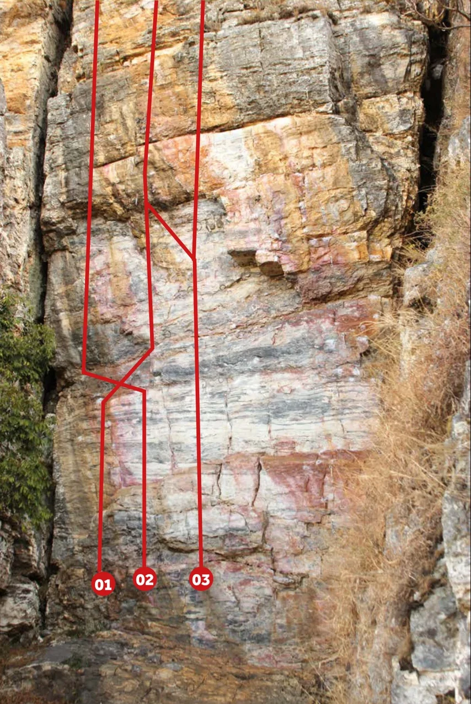
    - **largura_mapa**: 854
    - **altura_mapa**: 1275
    - **pontos_de_interesse**:
      - **[0]**:
        - **id**: 01
        - **label**: 01
        - **box**:
          - **x**: 187
          - **y**: 1059
          - **comprimento**: 38
          - **largura**: 30
      - **[1]**:
        - **id**: 02
        - **label**: 02
        - **box**:
          - **x**: 262
          - **y**: 1050
          - **comprimento**: 43
          - **largura**: 33
      - **[2]**:
        - **id**: 03
        - **label**: 03
        - **box**:
          - **x**: 364
          - **y**: 1050
          - **comprimento**: 39
          - **largura**: 30
- **escaladas**:
  - **[0]**:
    - **via_esportiva**:
      - **nome**: Alberto Roberto
      - **dificuldade**: BR_6
      - **extensao**: 8
      - **quantidade_protecoes_intermediarias**: 3
      - **quantidade_protecoes_parada**: 2
      - **conquistadores**:
        - Felipe Tavares
        - Gustavo Maneira
      - **data_abertura**: 2011
  - **[1]**:
    - **via_esportiva**:
      - **nome**: Chico Anísio
      - **dificuldade**: BR_6
      - **extensao**: 8
      - **quantidade_protecoes_intermediarias**: 3
      - **quantidade_protecoes_parada**: 2
      - **conquistadores**:
        - Diego Leonardo
      - **data_abertura**: 2011
  - **[2]**:
    - **via_esportiva**:
      - **nome**: Onjacktallbeck
      - **dificuldade**: BR_7B
      - **extensao**: 10
      - **quantidade_protecoes_intermediarias**: 5
      - **quantidade_protecoes_parada**: 2
      - **conquistadores**:
        - Diego Leonardo
      - **data_abertura**: 2011
  - **[3]**:
    - **via_esportiva**:
      - **nome**: Princípio Ativo
      - **dificuldade**: BR_7A
      - **extensao**: 10
      - **quantidade_protecoes_intermediarias**: 5
      - **quantidade_protecoes_parada**: 2
      - **conquistadores**:
        - Laurêncio
        - Daiex
      - **data_abertura**: 2011
  - **[4]**:
    - **via_esportiva**:
      - **nome**: Suindara
      - **dificuldade**: BR_6SUP
      - **extensao**: 10
      - **quantidade_protecoes_intermediarias**: 5
      - **quantidade_protecoes_parada**: 2
      - **conquistadores**:
        - Laurêncio
        - Daiex
      - **data_abertura**: 2011
  - **[5]**:
    - **via_esportiva**:
      - **nome**: São Jorge
      - **dificuldade**: BR_7B
      - **extensao**: 25
      - **quantidade_protecoes_intermediarias**: 9
      - **quantidade_protecoes_parada**: 2
      - **conquistadores**:
        - Laurêncio
        - Daiex
      - **data_abertura**: 2011
  - **[6]**:
    - **via_esportiva**:
      - **nome**: Ramadan
      - **dificuldade**: BR_6SUP
      - **extensao**: 20
      - **quantidade_protecoes_intermediarias**: 7
      - **quantidade_protecoes_parada**: 2
      - **conquistadores**:
        - Diego
        - Laurêncio
      - **data_abertura**: 2012
  - **[7]**:
    - **via_esportiva**:
      - **nome**: Sabotagem
      - **dificuldade**: BR_10A
      - **extensao**: 25
      - **quantidade_protecoes_intermediarias**: 9
      - **quantidade_protecoes_parada**: 2
      - **conquistadores**:
        - Rafael Passos
      - **data_abertura**: 2011
  - **[8]**:
    - **via_esportiva**:
      - **nome**: Universo Paralelo
      - **dificuldade**: BR_10B
      - **extensao**: 20
      - **quantidade_protecoes_intermediarias**: 11
      - **quantidade_protecoes_parada**: 2
      - **conquistadores**:
        - Diego
        - Laurêncio
      - **data_abertura**: 2011
  - **[9]**:
    - **via_esportiva**:
      - **nome**: Egocentrismo
      - **dificuldade**: BR_10B
      - **extensao**: 25
      - **quantidade_protecoes_intermediarias**: 11
      - **quantidade_protecoes_parada**: 2
      - **conquistadores**:
        - Diego Leonardo
        - Laurêncio
        - Rafinha
      - **data_abertura**: 2011
  - **[10]**:
    - **via_esportiva**:
      - **nome**: Farinha do Mesmo Saco
      - **dificuldade**: BR_9B
      - **extensao**: 20
      - **quantidade_protecoes_intermediarias**: 8
      - **quantidade_protecoes_parada**: 2
      - **conquistadores**:
        - Diego
        - Gustavo
      - **data_abertura**: 2011
  - **[11]**:
    - **via_esportiva**:
      - **nome**: Bafo de Onça
      - **dificuldade**: BR_9A
      - **extensao**: 17
      - **quantidade_protecoes_intermediarias**: 8
      - **quantidade_protecoes_parada**: 2
      - **conquistadores**:
        - Daiex
        - Diego
        - Gustavo Versiani
      - **data_abertura**: 2011
  - **[12]**:
    - **via_esportiva**:
      - **nome**: 12 anos
      - **dificuldade**: BR_5
      - **extensao**: 20
      - **conquistadores**:
        - Diego Leonardo
      - **data_abertura**: 2012
  - **[13]**:
    - **via_esportiva**:
      - **nome**: Mais Água no Feijão
      - **dificuldade**: BR_5
      - **extensao**: 15
      - **conquistadores**:
        - Juliano Peter Parker
      - **data_abertura**: 2015
  - **[14]**:
    - **via_esportiva**:
      - **nome**: Puberdade
      - **dificuldade**: BR_5
      - **extensao**: 20
      - **quantidade_protecoes_intermediarias**: 9
      - **quantidade_protecoes_parada**: 2
      - **conquistadores**:
        - Diego Leonardo
      - **data_abertura**: 2012
  - **[15]**:
    - **via_esportiva**:
      - **nome**: Eldorado
      - **dificuldade**: BR_5
      - **extensao**: 20
      - **conquistadores**:
        - Juliano Peter Parker
      - **data_abertura**: 2015
  - **[16]**:
    - **via_esportiva**:
      - **nome**: Mais uma Prova de Amor
      - **dificuldade**: BR_5
      - **extensao**: 20
      - **conquistadores**:
        - Juliano Peter Parker
      - **data_abertura**: 2015
  - **[17]**:
    - **via_esportiva**:
      - **descricao**: Primeiro crux da Sabotagem com o segundo crux da Universo Paralelo.
      - **nome**: Sabotagem do Universo
      - **dificuldade**: BR_10B
  - **[18]**:
    - **via_esportiva**:
      - **descricao**: Primeiro crux da Universo Paralelo com o segundo crux da Sabotagem.
      - **nome**: Universo Sabotada
      - **dificuldade**: BR_9B
  - **[19]**:
    - **via_esportiva**:
      - **descricao**: Primeiro crux da Egocentrismo com o segundo crux da Universo Paralelo.
      - **nome**: Ego Paralelo
      - **dificuldade**: BR_10C

## Parte: setor_shana_crazy

### Setor (Pico: Bocaina Park)

- **descricao**:
    # Setor Shana Crazy
    
    |  |
    | :--: |
    | *Setor Shana Crazy* |
    
    O Setor Shana Crazy possui vias curtas e intensas, variando do 4º ao 7º grau.
    
    > [!TIP]
    > Leve seu lixo e outro que encontrar para a cidade. Não faça necessidades fisiológicas nas trilhas e base de vias. Avisar a administração sobre a abertura de novas vias de escalada. **USE CAPACETE NAS BASES DE VIAS DE ESCALADA.**
- **nome**: Shana Crazy
- **mapas**:
  - **[0]**:
    - **caminho_imagem_mapa**: 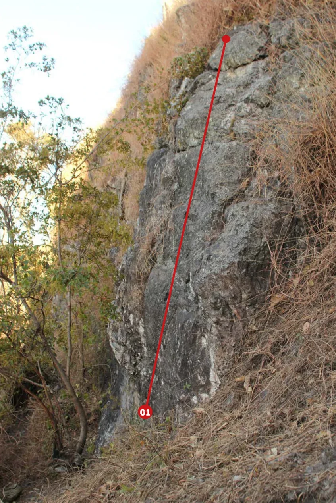
    - **largura_mapa**: 846
    - **altura_mapa**: 1267
    - **pontos_de_interesse**:
      - **[0]**:
        - **id**: 01
        - **label**: 01
        - **box**:
          - **x**: 365
          - **y**: 1038
          - **comprimento**: 32
          - **largura**: 26
    - **referencias**:
      - **[0]**:
        - **escalada**: Caroço de Manga
        - **ids**:
          - 01
      - **[1]**:
        - **escalada**: Caminho das pedras
        - **ids**:
          - 02
      - **[2]**:
        - **escalada**: Caminho das águas
        - **ids**:
          - 03
      - **[3]**:
        - **escalada**: Shana Crazy
        - **ids**:
          - 04
      - **[4]**:
        - **escalada**: Na racha
        - **ids**:
          - 05
      - **[5]**:
        - **escalada**: Lei Rounet
        - **ids**:
          - 06
      - **[6]**:
        - **escalada**: Maria da Penha
        - **ids**:
          - 07
      - **[7]**:
        - **escalada**: Para-raio de Maluco
        - **ids**:
          - 8
      - **[8]**:
        - **escalada**: Sandálias da Humildade
        - **ids**:
          - 9
  - **[1]**:
    - **caminho_imagem_mapa**: 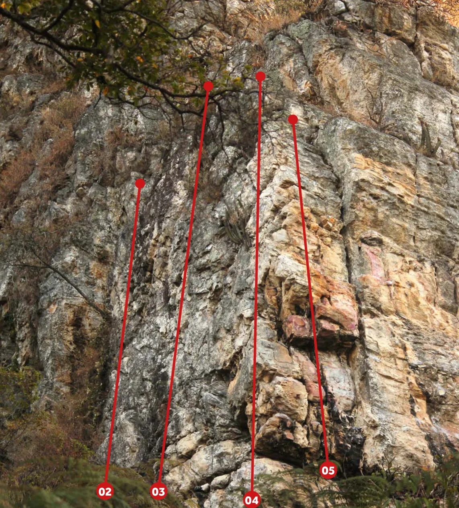
    - **largura_mapa**: 1142
    - **altura_mapa**: 1264
    - **pontos_de_interesse**:
      - **[0]**:
        - **id**: 02
        - **label**: 02
        - **box**:
          - **x**: 262
          - **y**: 1223
          - **comprimento**: 41
          - **largura**: 28
      - **[1]**:
        - **id**: 03
        - **label**: 03
        - **box**:
          - **x**: 394
          - **y**: 1223
          - **comprimento**: 39
          - **largura**: 28
      - **[2]**:
        - **id**: 04
        - **label**: 04
        - **box**:
          - **x**: 627
          - **y**: 1244
          - **comprimento**: 42
          - **largura**: 32
      - **[3]**:
        - **id**: 05
        - **label**: 05
        - **box**:
          - **x**: 816
          - **y**: 1169
          - **comprimento**: 43
          - **largura**: 36
  - **[2]**:
    - **caminho_imagem_mapa**: 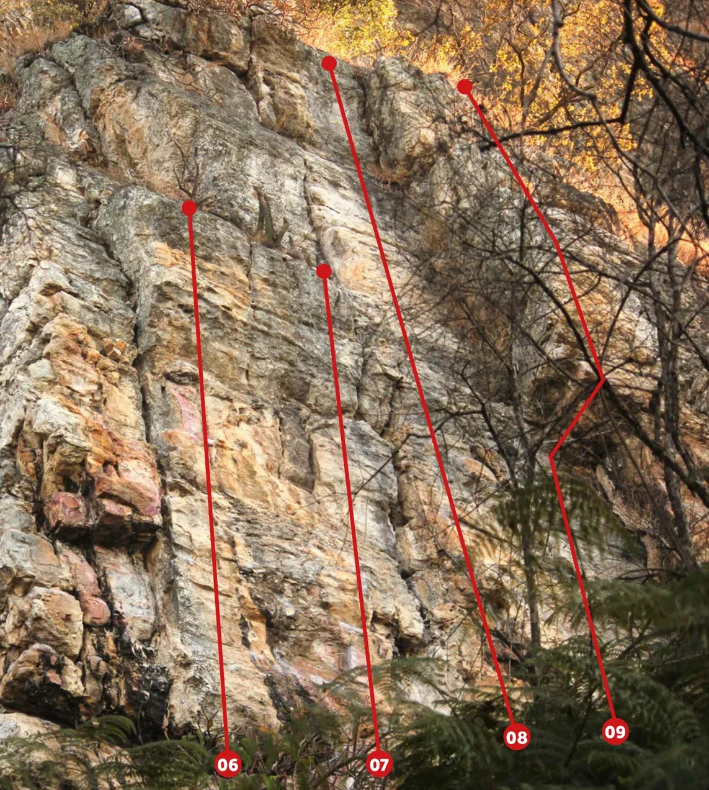
    - **largura_mapa**: 1143
    - **altura_mapa**: 1272
    - **pontos_de_interesse**:
      - **[0]**:
        - **id**: 06
        - **label**: 06
        - **box**:
          - **x**: 368
          - **y**: 1232
          - **comprimento**: 43
          - **largura**: 33
      - **[1]**:
        - **id**: 07
        - **label**: 07
        - **box**:
          - **x**: 612
          - **y**: 1231
          - **comprimento**: 37
          - **largura**: 30
      - **[2]**:
        - **id**: 08
        - **label**: 08
        - **box**:
          - **x**: 833
          - **y**: 1187
          - **comprimento**: 40
          - **largura**: 28
      - **[3]**:
        - **id**: 09
        - **label**: 09
        - **box**:
          - **x**: 992
          - **y**: 1179
          - **comprimento**: 42
          - **largura**: 32
- **escaladas**:
  - **[0]**:
    - **via_esportiva**:
      - **nome**: Caroço de Manga
      - **dificuldade**: BR_4
      - **extensao**: 5
      - **quantidade_protecoes_intermediarias**: 2
      - **quantidade_protecoes_parada**: 2
      - **conquistadores**:
        - Daiex de Almeida
      - **data_abertura**: 2014
  - **[1]**:
    - **via_esportiva**:
      - **nome**: Caminho das pedras
      - **dificuldade**: BR_5
      - **extensao**: 8
      - **quantidade_protecoes_intermediarias**: 3
      - **quantidade_protecoes_parada**: 2
      - **conquistadores**:
        - Gustavo Maneira
      - **data_abertura**: 2012
  - **[2]**:
    - **via_esportiva**:
      - **nome**: Caminho das águas
      - **dificuldade**: BR_5
      - **extensao**: 10
      - **quantidade_protecoes_intermediarias**: 4
      - **quantidade_protecoes_parada**: 2
      - **conquistadores**:
        - Diego Leonardo
      - **data_abertura**: 2012
  - **[3]**:
    - **via_esportiva**:
      - **nome**: Shana Crazy
      - **dificuldade**: BR_6SUP
      - **extensao**: 10
      - **quantidade_protecoes_intermediarias**: 4
      - **quantidade_protecoes_parada**: 2
      - **conquistadores**:
        - Laurêncio
      - **data_abertura**: 2011
  - **[4]**:
    - **via_esportiva**:
      - **nome**: Na racha
      - **dificuldade**: BR_6SUP
      - **extensao**: 10
      - **quantidade_protecoes_intermediarias**: 4
      - **quantidade_protecoes_parada**: 2
      - **conquistadores**:
        - Pedro Andrade
      - **data_abertura**: 2017
  - **[5]**:
    - **via_esportiva**:
      - **nome**: Lei Rounet
      - **dificuldade**: BR_7B
      - **extensao**: 10
      - **quantidade_protecoes_intermediarias**: 5
      - **quantidade_protecoes_parada**: 2
      - **conquistadores**:
        - Diego Leonardo
      - **data_abertura**: 2011
  - **[6]**:
    - **via_esportiva**:
      - **nome**: Maria da Penha
      - **dificuldade**: BR_6SUP
      - **extensao**: 10
      - **quantidade_protecoes_intermediarias**: 4
      - **quantidade_protecoes_parada**: 2
      - **conquistadores**:
        - Laurêncio
      - **data_abertura**: 2011
  - **[7]**:
    - **via_esportiva**:
      - **nome**: Para-raio de Maluco
      - **dificuldade**: BR_6
      - **extensao**: 12
      - **quantidade_protecoes_intermediarias**: 7
      - **quantidade_protecoes_parada**: 2
      - **conquistadores**:
        - Diego Leonardo
        - Gustavo Maneira
      - **data_abertura**: 2011
  - **[8]**:
    - **via_esportiva**:
      - **nome**: Sandálias da Humildade
      - **dificuldade**: BR_7B
      - **extensao**: 10
      - **quantidade_protecoes_intermediarias**: 7
      - **quantidade_protecoes_parada**: 2
      - **conquistadores**:
        - Diego Leonardo
      - **data_abertura**: 2011

## Parte: setor_tsunami

### Setor (Pico: Bocaina Park)

- **descricao**:
    # Setor Tsunami
    
    | 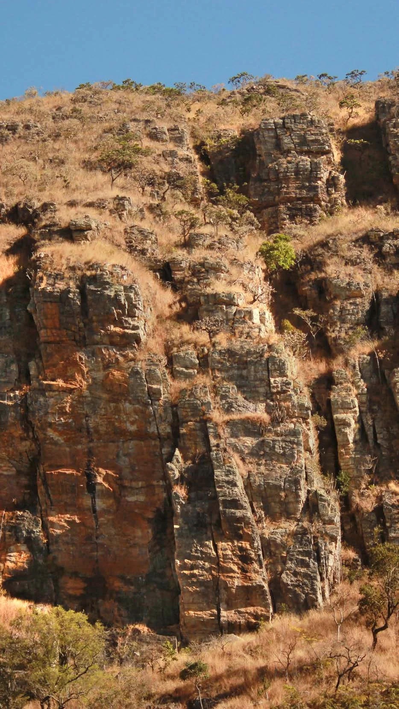 |
    | :--: |
    | *Setor Tsunami* |
    
    O Setor Tsunami é um dos maiores do Bocaina Park, com vias extensas e desafiadoras que chegam ao 10º grau.
    
    > [!TIP]
    > Leve seu lixo e outro que encontrar para a cidade. Não faça necessidades fisiológicas nas trilhas e base de vias. Avisar a administração sobre a abertura de novas vias de escalada. **USE CAPACETE NAS BASES DE VIAS DE ESCALADA.**
- **nome**: Tsunami
- **mapas**:
  - **[0]**:
    - **caminho_imagem_mapa**: 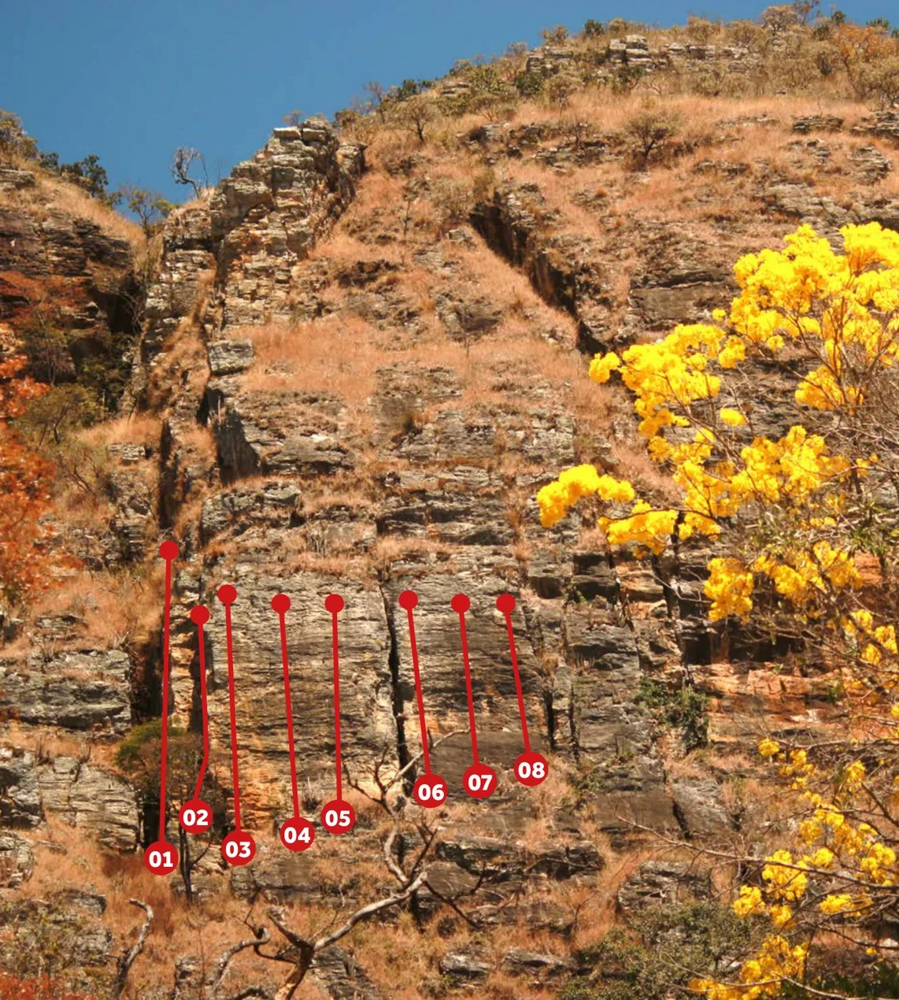
    - **largura_mapa**: 1142
    - **altura_mapa**: 1270
    - **pontos_de_interesse**:
      - **[0]**:
        - **id**: 01
        - **label**: 01
        - **box**:
          - **x**: 204
          - **y**: 1092
          - **comprimento**: 38
          - **largura**: 29
      - **[1]**:
        - **id**: 02
        - **label**: 02
        - **box**:
          - **x**: 248
          - **y**: 1039
          - **comprimento**: 39
          - **largura**: 30
      - **[2]**:
        - **id**: 03
        - **label**: 03
        - **box**:
          - **x**: 302
          - **y**: 1080
          - **comprimento**: 39
          - **largura**: 29
      - **[3]**:
        - **id**: 04
        - **label**: 04
        - **box**:
          - **x**: 378
          - **y**: 1062
          - **comprimento**: 42
          - **largura**: 29
      - **[4]**:
        - **id**: 05
        - **label**: 05
        - **box**:
          - **x**: 429
          - **y**: 1040
          - **comprimento**: 40
          - **largura**: 29
      - **[5]**:
        - **id**: 06
        - **label**: 06
        - **box**:
          - **x**: 548
          - **y**: 1006
          - **comprimento**: 41
          - **largura**: 29
      - **[6]**:
        - **id**: 07
        - **label**: 07
        - **box**:
          - **x**: 610
          - **y**: 994
          - **comprimento**: 38
          - **largura**: 29
      - **[7]**:
        - **id**: 08
        - **label**: 08
        - **box**:
          - **x**: 674
          - **y**: 978
          - **comprimento**: 45
          - **largura**: 35
    - **referencias**:
      - **[0]**:
        - **escalada**: ET de Varginha
        - **ids**:
          - 01
      - **[1]**:
        - **escalada**: Jardim das Arestas
        - **ids**:
          - 02
      - **[2]**:
        - **escalada**: Sunshine
        - **ids**:
          - 03
      - **[3]**:
        - **escalada**: Sexta-feira 13
        - **ids**:
          - 04
      - **[4]**:
        - **escalada**: Vida Louca
        - **ids**:
          - 05
      - **[5]**:
        - **escalada**: Miranda Mirandinha
        - **ids**:
          - 06
      - **[6]**:
        - **escalada**: Foi sem Querer
        - **ids**:
          - 07
      - **[7]**:
        - **escalada**: Cabeleira
        - **ids**:
          - 8
      - **[8]**:
        - **escalada**: Muchas Gracias
        - **ids**:
          - 9
      - **[9]**:
        - **escalada**: Muy Hermosa
        - **ids**:
          - 10
      - **[10]**:
        - **escalada**: Medicina Chilena
        - **ids**:
          - 11
      - **[11]**:
        - **escalada**: As Aparências Enganam
        - **ids**:
          - 12
      - **[12]**:
        - **escalada**: Raios e Trovões
        - **ids**:
          - 13
      - **[13]**:
        - **escalada**: Quem vê Cara não vê Graduação
        - **ids**:
          - 14
      - **[14]**:
        - **escalada**: Sete Chaves
        - **ids**:
          - 15
      - **[15]**:
        - **escalada**: Buena Onda
        - **ids**:
          - 16
      - **[16]**:
        - **escalada**: Marola
        - **ids**:
          - 17
      - **[17]**:
        - **escalada**: Filha de Todos
        - **ids**:
          - 18
      - **[18]**:
        - **escalada**: Neblina Baixa
        - **ids**:
          - 19
      - **[19]**:
        - **escalada**: Círculo de Fogo
        - **ids**:
          - 20
      - **[20]**:
        - **escalada**: Fissura de Cristal
        - **ids**:
          - 21
      - **[21]**:
        - **escalada**: Mandruva Assassino
        - **ids**:
          - 22
      - **[22]**:
        - **escalada**: Namoro Antigo
        - **ids**:
          - 23
      - **[23]**:
        - **escalada**: Chora Nenêm
        - **ids**:
          - 24
  - **[1]**:
    - **caminho_imagem_mapa**: 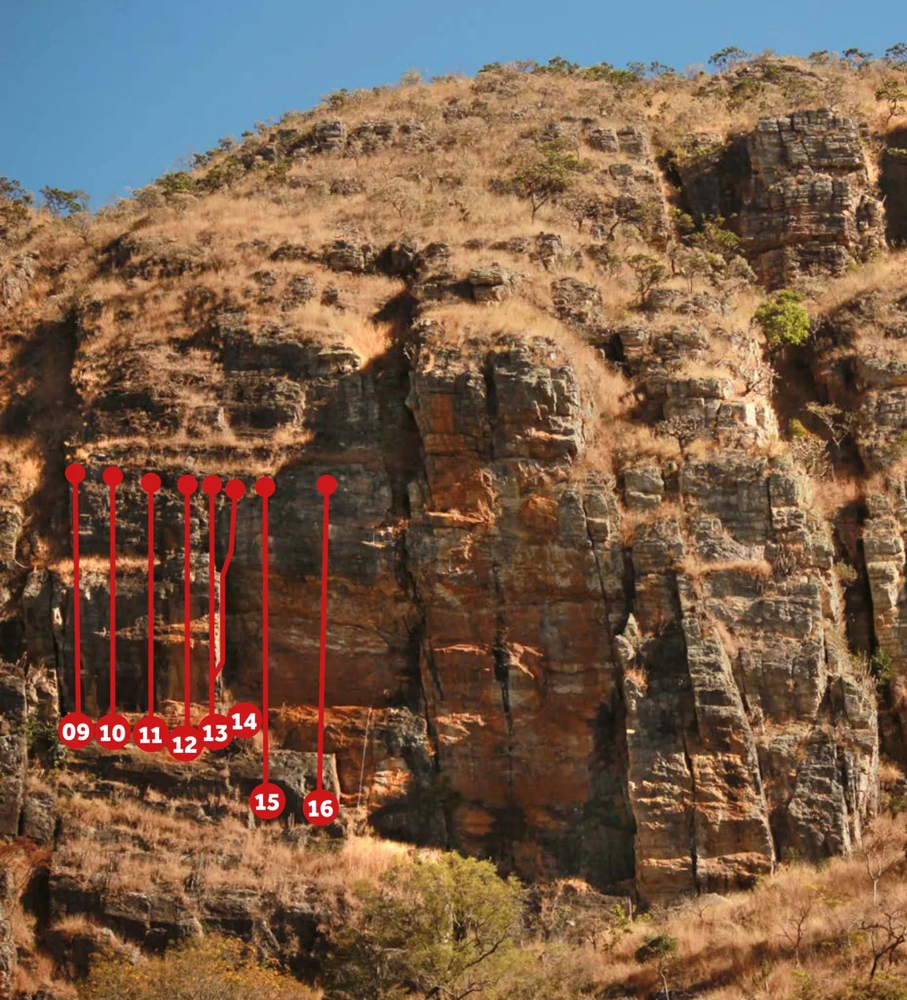
    - **largura_mapa**: 1152
    - **altura_mapa**: 1270
    - **pontos_de_interesse**:
      - **[0]**:
        - **id**: 09
        - **label**: 09
        - **box**:
          - **x**: 96
          - **y**: 929
          - **comprimento**: 31
          - **largura**: 24
      - **[1]**:
        - **id**: 10
        - **label**: 10
        - **box**:
          - **x**: 142
          - **y**: 930
          - **comprimento**: 32
          - **largura**: 27
      - **[2]**:
        - **id**: 11
        - **label**: 11
        - **box**:
          - **x**: 190
          - **y**: 932
          - **comprimento**: 29
          - **largura**: 25
      - **[3]**:
        - **id**: 12
        - **label**: 12
        - **box**:
          - **x**: 234
          - **y**: 945
          - **comprimento**: 29
          - **largura**: 26
      - **[4]**:
        - **id**: 13
        - **label**: 13
        - **box**:
          - **x**: 272
          - **y**: 930
          - **comprimento**: 27
          - **largura**: 25
      - **[5]**:
        - **id**: 14
        - **label**: 14
        - **box**:
          - **x**: 308
          - **y**: 916
          - **comprimento**: 29
          - **largura**: 28
      - **[6]**:
        - **id**: 15
        - **label**: 15
        - **box**:
          - **x**: 340
          - **y**: 1020
          - **comprimento**: 42
          - **largura**: 33
      - **[7]**:
        - **id**: 16
        - **label**: 16
        - **box**:
          - **x**: 406
          - **y**: 1026
          - **comprimento**: 43
          - **largura**: 33
  - **[2]**:
    - **caminho_imagem_mapa**: 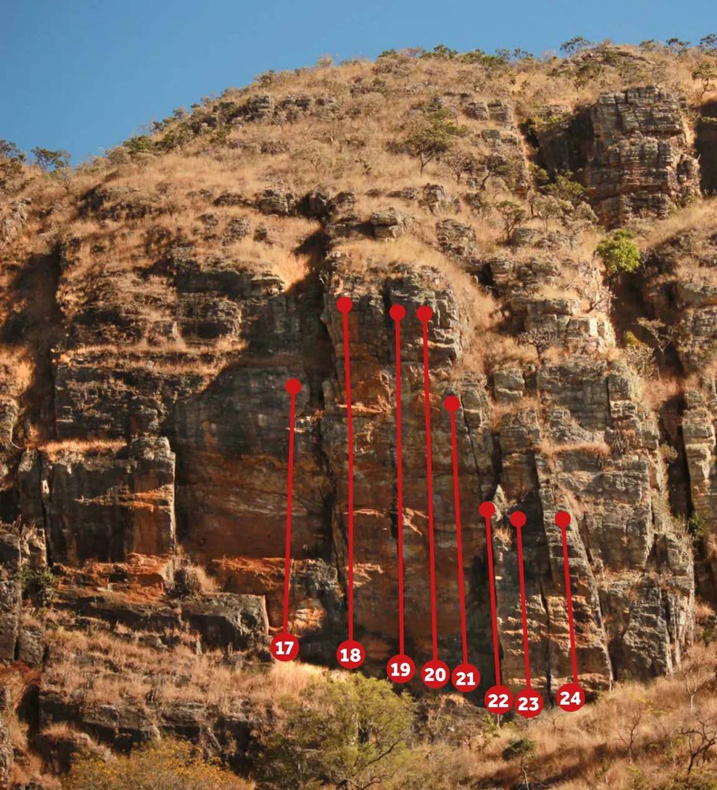
    - **largura_mapa**: 1152
    - **altura_mapa**: 1270
    - **pontos_de_interesse**:
      - **[0]**:
        - **id**: 17
        - **label**: 17
        - **box**:
          - **x**: 456
          - **y**: 1041
          - **comprimento**: 42
          - **largura**: 36
      - **[1]**:
        - **id**: 18
        - **label**: 18
        - **box**:
          - **x**: 562
          - **y**: 1054
          - **comprimento**: 43
          - **largura**: 34
      - **[2]**:
        - **id**: 19
        - **label**: 19
        - **box**:
          - **x**: 642
          - **y**: 1074
          - **comprimento**: 30
          - **largura**: 30
      - **[3]**:
        - **id**: 20
        - **label**: 20
        - **box**:
          - **x**: 698
          - **y**: 1082
          - **comprimento**: 31
          - **largura**: 29
      - **[4]**:
        - **id**: 21
        - **label**: 21
        - **box**:
          - **x**: 748
          - **y**: 1092
          - **comprimento**: 31
          - **largura**: 27
      - **[5]**:
        - **id**: 22
        - **label**: 22
        - **box**:
          - **x**: 801
          - **y**: 1126
          - **comprimento**: 30
          - **largura**: 26
      - **[6]**:
        - **id**: 23
        - **label**: 23
        - **box**:
          - **x**: 850
          - **y**: 1132
          - **comprimento**: 34
          - **largura**: 29
      - **[7]**:
        - **id**: 24
        - **label**: 24
        - **box**:
          - **x**: 914
          - **y**: 1122
          - **comprimento**: 37
          - **largura**: 29
- **escaladas**:
  - **[0]**:
    - **via_esportiva**:
      - **nome**: ET de Varginha
      - **dificuldade**: BR_6SUP
      - **extensao**: 10
      - **quantidade_protecoes_intermediarias**: 5
      - **quantidade_protecoes_parada**: 2
      - **conquistadores**:
        - Gustavo Maneira
      - **data_abertura**: 2014
  - **[1]**:
    - **via_esportiva**:
      - **nome**: Jardim das Arestas
      - **dificuldade**: BR_6SUP
      - **extensao**: 10
      - **quantidade_protecoes_intermediarias**: 4
      - **quantidade_protecoes_parada**: 2
      - **conquistadores**:
        - Diego Leonardo
        - Gustavo Maneira
      - **data_abertura**: 2014
  - **[2]**:
    - **via_esportiva**:
      - **nome**: Sunshine
      - **dificuldade**: BR_7A
      - **extensao**: 10
      - **quantidade_protecoes_intermediarias**: 5
      - **quantidade_protecoes_parada**: 2
      - **conquistadores**:
        - Diego Leonardo
        - Gustavo Maneira
      - **data_abertura**: 2014
  - **[3]**:
    - **via_esportiva**:
      - **nome**: Sexta-feira 13
      - **dificuldade**: BR_7C
      - **extensao**: 10
      - **quantidade_protecoes_intermediarias**: 5
      - **quantidade_protecoes_parada**: 2
      - **conquistadores**:
        - Diego Leonardo
        - Rafael Furtado
      - **data_abertura**: 2014
  - **[4]**:
    - **via_esportiva**:
      - **nome**: Vida Louca
      - **dificuldade**: BR_7A
      - **extensao**: 10
      - **quantidade_protecoes_intermediarias**: 4
      - **quantidade_protecoes_parada**: 2
      - **conquistadores**:
        - Diego Leonardo
        - Gustavo Maneira
      - **data_abertura**: 2014
  - **[5]**:
    - **via_esportiva**:
      - **nome**: Miranda Mirandinha
      - **dificuldade**: BR_7C
      - **extensao**: 8
      - **quantidade_protecoes_intermediarias**: 4
      - **quantidade_protecoes_parada**: 2
      - **conquistadores**:
        - Rafael Furtado
        - Argos Pena
      - **data_abertura**: 2014
  - **[6]**:
    - **via_esportiva**:
      - **nome**: Foi sem Querer
      - **dificuldade**: BR_6SUP
      - **extensao**: 8
      - **quantidade_protecoes_intermediarias**: 4
      - **quantidade_protecoes_parada**: 2
      - **conquistadores**:
        - Rafael Furtado
        - Diego Leonardo
      - **data_abertura**: 2014
  - **[7]**:
    - **via_esportiva**:
      - **nome**: Cabeleira
      - **dificuldade**: BR_6SUP
      - **extensao**: 8
      - **quantidade_protecoes_intermediarias**: 4
      - **quantidade_protecoes_parada**: 2
      - **conquistadores**:
        - Rafael Furtado
        - Diego Leonardo
      - **data_abertura**: 2014
  - **[8]**:
    - **via_esportiva**:
      - **nome**: Muchas Gracias
      - **dificuldade**: BR_8A
      - **extensao**: 12
      - **quantidade_protecoes_intermediarias**: 5
      - **quantidade_protecoes_parada**: 2
      - **conquistadores**:
        - Alexandre Fei
      - **data_abertura**: 2013
  - **[9]**:
    - **via_esportiva**:
      - **nome**: Muy Hermosa
      - **dificuldade**: BR_8B
      - **extensao**: 12
      - **quantidade_protecoes_intermediarias**: 5
      - **quantidade_protecoes_parada**: 2
      - **conquistadores**:
        - Alexandre Fei
      - **data_abertura**: 2013
  - **[10]**:
    - **via_esportiva**:
      - **nome**: Medicina Chilena
      - **dificuldade**: BR_9B
      - **extensao**: 15
      - **quantidade_protecoes_intermediarias**: 6
      - **quantidade_protecoes_parada**: 2
      - **conquistadores**:
        - Alexandre Fei
      - **data_abertura**: 2013
  - **[11]**:
    - **via_esportiva**:
      - **nome**: As Aparências Enganam
      - **dificuldade**: BR_10B
      - **extensao**: 15
      - **quantidade_protecoes_intermediarias**: 7
      - **quantidade_protecoes_parada**: 2
      - **conquistadores**:
        - Rafael Passos
      - **data_abertura**: 2013
  - **[12]**:
    - **via_esportiva**:
      - **nome**: Raios e Trovões
      - **dificuldade**: BR_8C
      - **extensao**: 15
      - **quantidade_protecoes_intermediarias**: 6
      - **quantidade_protecoes_parada**: 2
      - **conquistadores**:
        - Alexandre Fei
      - **data_abertura**: 2013
  - **[13]**:
    - **via_esportiva**:
      - **nome**: Quem vê Cara não vê Graduação
      - **dificuldade**: BR_7A
      - **extensao**: 15
      - **quantidade_protecoes_intermediarias**: 8
      - **quantidade_protecoes_parada**: 2
      - **conquistadores**:
        - Alexandre Fei
      - **data_abertura**: 2014
  - **[14]**:
    - **via_esportiva**:
      - **nome**: Sete Chaves
      - **dificuldade**: PROJETO
      - **extensao**: 20
      - **quantidade_protecoes_intermediarias**: 8
      - **quantidade_protecoes_parada**: 2
      - **conquistadores**:
        - Rafael Passos
      - **data_abertura**: 2015
  - **[15]**:
    - **via_esportiva**:
      - **nome**: Buena Onda
      - **dificuldade**: PROJETO
      - **extensao**: 20
      - **quantidade_protecoes_intermediarias**: 7
      - **quantidade_protecoes_parada**: 2
      - **conquistadores**:
        - Alexandre Fei
        - Gustavo Scandiuzzi
      - **data_abertura**: 2015
  - **[16]**:
    - **via_esportiva**:
      - **nome**: Marola
      - **dificuldade**: PROJETO
      - **extensao**: 25
      - **quantidade_protecoes_intermediarias**: 10
      - **quantidade_protecoes_parada**: 2
      - **conquistadores**:
        - Diego Leonardo
        - Rafael Furtado
      - **data_abertura**: 2015
  - **[17]**:
    - **via_esportiva**:
      - **nome**: Filha de Todos
      - **dificuldade**: BR_10A
      - **extensao**: 30
      - **quantidade_protecoes_intermediarias**: 13
      - **quantidade_protecoes_parada**: 2
      - **conquistadores**:
        - Alexandre Fei
        - Lucas Francês
      - **data_abertura**: 2008
  - **[18]**:
    - **via_esportiva**:
      - **nome**: Neblina Baixa
      - **dificuldade**: BR_8B
      - **extensao**: 30
      - **quantidade_protecoes_intermediarias**: 12
      - **quantidade_protecoes_parada**: 2
      - **conquistadores**:
        - Diego Leonardo
        - Lucas Francês
      - **data_abertura**: 2008
  - **[19]**:
    - **via_esportiva**:
      - **nome**: Círculo de Fogo
      - **dificuldade**: BR_10A
      - **extensao**: 30
      - **quantidade_protecoes_intermediarias**: 15
      - **quantidade_protecoes_parada**: 2
      - **conquistadores**:
        - Alexandre Fei
      - **data_abertura**: 2013
  - **[20]**:
    - **via_esportiva**:
      - **nome**: Fissura de Cristal
      - **dificuldade**: BR_8A
      - **extensao**: 25
      - **quantidade_protecoes_intermediarias**: 10
      - **quantidade_protecoes_parada**: 2
      - **conquistadores**:
        - Alexandre Fei
      - **data_abertura**: 2013
  - **[21]**:
    - **via_esportiva**:
      - **nome**: Mandruva Assassino
      - **dificuldade**: BR_7A
      - **extensao**: 15
      - **quantidade_protecoes_intermediarias**: 5
      - **quantidade_protecoes_parada**: 2
      - **conquistadores**:
        - Diego Leonardo
        - Lucas Francês
      - **data_abertura**: 2008
  - **[22]**:
    - **via_esportiva**:
      - **nome**: Namoro Antigo
      - **dificuldade**: BR_9C
      - **extensao**: 12
      - **quantidade_protecoes_intermediarias**: 4
      - **quantidade_protecoes_parada**: 2
      - **conquistadores**:
        - Ze Roberto
        - Felipe Belisario
      - **data_abertura**: 2007
  - **[23]**:
    - **via_esportiva**:
      - **nome**: Chora Nenêm
      - **dificuldade**: BR_7C
      - **extensao**: 15
      - **conquistadores**:
        - Fei
        - Xodó
        - Diego
        - Lucas Ramos
      - **data_abertura**: 2006

## Parte: setor_udao

### Setor (Pico: Bocaina Park)

- **descricao**:
    # Setor Udão
    
    |  |
    | :--: |
    | *Setor Udão* |
    
    O Setor Udão apresenta vias de 5º a 7º grau, com uma boa concentração de vias de 6º sup.
    
    > [!TIP]
    > Leve seu lixo e outro que encontrar para a cidade. Não faça necessidades fisiológicas nas trilhas e base de vias. Avisar a administração sobre a abertura de novas vias de escalada. **USE CAPACETE NAS BASES DE VIAS DE ESCALADA.**
- **nome**: Udão
- **mapas**:
  - **[0]**:
    - **caminho_imagem_mapa**: 
    - **largura_mapa**: 1152
    - **altura_mapa**: 1267
    - **pontos_de_interesse**:
      - **[0]**:
        - **id**: 01
        - **label**: 01
        - **box**:
          - **x**: 223
          - **y**: 1090
          - **comprimento**: 30
          - **largura**: 27
      - **[1]**:
        - **id**: 02
        - **label**: 02
        - **box**:
          - **x**: 274
          - **y**: 1084
          - **comprimento**: 33
          - **largura**: 27
      - **[2]**:
        - **id**: 03
        - **label**: 03
        - **box**:
          - **x**: 340
          - **y**: 1088
          - **comprimento**: 41
          - **largura**: 29
      - **[3]**:
        - **id**: 04
        - **label**: 04
        - **box**:
          - **x**: 570
          - **y**: 952
          - **comprimento**: 44
          - **largura**: 33
      - **[4]**:
        - **id**: 05
        - **label**: 05
        - **box**:
          - **x**: 622
          - **y**: 900
          - **comprimento**: 43
          - **largura**: 34
      - **[5]**:
        - **id**: 06
        - **label**: 06
        - **box**:
          - **x**: 668
          - **y**: 854
          - **comprimento**: 45
          - **largura**: 34
    - **referencias**:
      - **[0]**:
        - **escalada**: Pulando a cerca
        - **ids**:
          - 01
      - **[1]**:
        - **escalada**: Cerca Elétrica
        - **ids**:
          - 02
      - **[2]**:
        - **escalada**: Clube da Esquina
        - **ids**:
          - 03
      - **[3]**:
        - **escalada**: Chuva de Meteoros
        - **ids**:
          - 04
      - **[4]**:
        - **escalada**: Pit Bitoca
        - **ids**:
          - 05
      - **[5]**:
        - **escalada**: Jovem Ganso
        - **ids**:
          - 06
      - **[6]**:
        - **escalada**: Filho de Vó
        - **ids**:
          - 07
      - **[7]**:
        - **escalada**: Loucura Alheia
        - **ids**:
          - 8
      - **[8]**:
        - **escalada**: Mistério de Ramadã
        - **ids**:
          - 9
      - **[9]**:
        - **escalada**: Chuva de Verão
        - **ids**:
          - 10
      - **[10]**:
        - **escalada**: Pole Dance
        - **ids**:
          - 11
      - **[11]**:
        - **escalada**: Brusqueta do Cerrado
        - **ids**:
          - 12
      - **[12]**:
        - **escalada**: Rota Aérea
        - **ids**:
          - 13
  - **[1]**:
    - **caminho_imagem_mapa**: 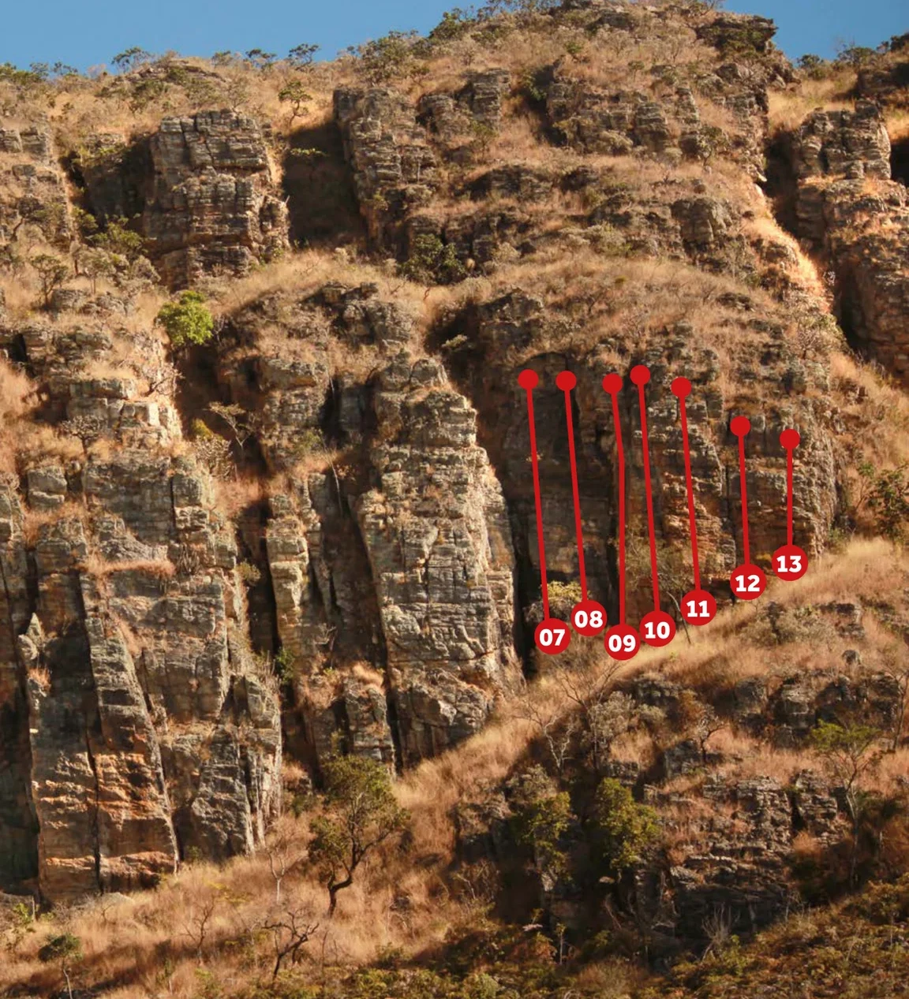
    - **largura_mapa**: 1152
    - **altura_mapa**: 1267
    - **pontos_de_interesse**:
      - **[0]**:
        - **id**: 07
        - **label**: 07
        - **box**:
          - **x**: 702
          - **y**: 808
          - **comprimento**: 31
          - **largura**: 25
      - **[1]**:
        - **id**: 08
        - **label**: 08
        - **box**:
          - **x**: 745
          - **y**: 784
          - **comprimento**: 32
          - **largura**: 26
      - **[2]**:
        - **id**: 09
        - **label**: 09
        - **box**:
          - **x**: 787
          - **y**: 814
          - **comprimento**: 34
          - **largura**: 23
      - **[3]**:
        - **id**: 10
        - **label**: 10
        - **box**:
          - **x**: 831
          - **y**: 799
          - **comprimento**: 34
          - **largura**: 24
      - **[4]**:
        - **id**: 11
        - **label**: 11
        - **box**:
          - **x**: 884
          - **y**: 772
          - **comprimento**: 41
          - **largura**: 36
      - **[5]**:
        - **id**: 12
        - **label**: 12
        - **box**:
          - **x**: 947
          - **y**: 740
          - **comprimento**: 42
          - **largura**: 32
      - **[6]**:
        - **id**: 13
        - **label**: 13
        - **box**:
          - **x**: 1000
          - **y**: 715
          - **comprimento**: 42
          - **largura**: 32
- **escaladas**:
  - **[0]**:
    - **via_esportiva**:
      - **nome**: Pulando a cerca
      - **dificuldade**: BR_6SUP
      - **extensao**: 12
      - **quantidade_protecoes_intermediarias**: 6
      - **quantidade_protecoes_parada**: 2
      - **conquistadores**:
        - Alexandre Fei
        - Daiex
      - **data_abertura**: 2014
  - **[1]**:
    - **via_esportiva**:
      - **nome**: Cerca Elétrica
      - **dificuldade**: BR_7A
      - **extensao**: 15
      - **quantidade_protecoes_intermediarias**: 5
      - **quantidade_protecoes_parada**: 2
      - **conquistadores**:
        - Alexandre Fei
      - **data_abertura**: 2013
  - **[2]**:
    - **via_esportiva**:
      - **nome**: Clube da Esquina
      - **dificuldade**: BR_5
      - **extensao**: 8
      - **quantidade_protecoes_intermediarias**: 3
      - **quantidade_protecoes_parada**: 2
      - **conquistadores**:
        - Gustavo Maneira
        - Daiex de Almeida
      - **data_abertura**: 2013
  - **[3]**:
    - **via_esportiva**:
      - **nome**: Chuva de Meteoros
      - **dificuldade**: BR_6
      - **extensao**: 25
      - **quantidade_protecoes_intermediarias**: 7
      - **quantidade_protecoes_parada**: 2
      - **conquistadores**:
        - Daiex de Almeida
      - **data_abertura**: 2013
  - **[4]**:
    - **via_esportiva**:
      - **nome**: Pit Bitoca
      - **dificuldade**: BR_6SUP
      - **extensao**: 18
      - **quantidade_protecoes_intermediarias**: 5
      - **quantidade_protecoes_parada**: 2
      - **conquistadores**:
        - Alexandre Fei
      - **data_abertura**: 2013
  - **[5]**:
    - **via_esportiva**:
      - **nome**: Jovem Ganso
      - **dificuldade**: BR_6SUP
      - **extensao**: 15
      - **quantidade_protecoes_intermediarias**: 6
      - **quantidade_protecoes_parada**: 2
      - **conquistadores**:
        - Daiex de Almeida
        - Gustavo Maneira
      - **data_abertura**: 2013
  - **[6]**:
    - **via_esportiva**:
      - **nome**: Filho de Vó
      - **dificuldade**: BR_6SUP
      - **extensao**: 12
      - **quantidade_protecoes_intermediarias**: 4
      - **quantidade_protecoes_parada**: 2
      - **conquistadores**:
        - Daiex de Almeida
        - Gustavo Maneira
      - **data_abertura**: 2013
  - **[7]**:
    - **via_esportiva**:
      - **nome**: Loucura Alheia
      - **dificuldade**: BR_6SUP
      - **extensao**: 12
      - **quantidade_protecoes_intermediarias**: 4
      - **quantidade_protecoes_parada**: 2
      - **conquistadores**:
        - Daiex de Almeida
        - Gustavo Maneira
      - **data_abertura**: 2013
  - **[8]**:
    - **via_esportiva**:
      - **nome**: Mistério de Ramadã
      - **dificuldade**: BR_7A
      - **extensao**: 15
      - **quantidade_protecoes_intermediarias**: 6
      - **quantidade_protecoes_parada**: 2
      - **conquistadores**:
        - Alexandre Fei
        - Gustavo Maneira
      - **data_abertura**: 2013
  - **[9]**:
    - **via_esportiva**:
      - **nome**: Chuva de Verão
      - **dificuldade**: BR_7A
      - **extensao**: 12
      - **quantidade_protecoes_intermediarias**: 5
      - **quantidade_protecoes_parada**: 2
      - **conquistadores**:
        - Alexandre Fei
      - **data_abertura**: 2013
  - **[10]**:
    - **via_esportiva**:
      - **nome**: Pole Dance
      - **dificuldade**: BR_6SUP
      - **extensao**: 12
      - **quantidade_protecoes_intermediarias**: 5
      - **quantidade_protecoes_parada**: 2
      - **conquistadores**:
        - Alexandre Fei
      - **data_abertura**: 2013
  - **[11]**:
    - **via_esportiva**:
      - **nome**: Brusqueta do Cerrado
      - **dificuldade**: BR_6
      - **extensao**: 8
      - **quantidade_protecoes_intermediarias**: 5
      - **quantidade_protecoes_parada**: 2
      - **conquistadores**:
        - Daiex de Almeida
      - **data_abertura**: 2016
  - **[12]**:
    - **via_esportiva**:
      - **nome**: Rota Aérea
      - **dificuldade**: BR_6
      - **extensao**: 8
      - **quantidade_protecoes_intermediarias**: 4
      - **quantidade_protecoes_parada**: 2
      - **conquistadores**:
        - Gustavo
      - **data_abertura**: 2016

## Parte: setor_tereza

### Setor (Pico: Bocaina Park)

- **descricao**:
    # Setor Tereza
    
    | 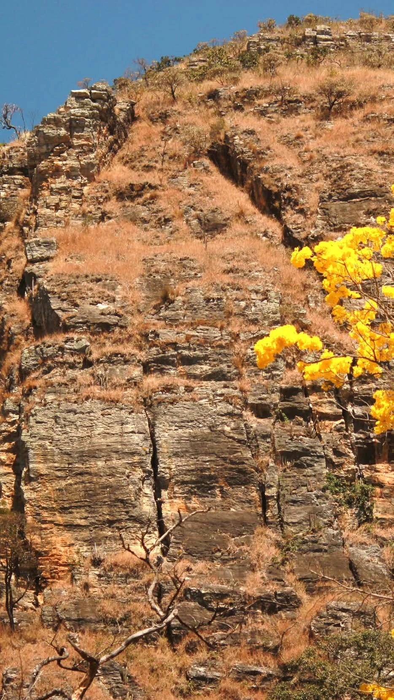 |
    | :--: |
    | *Setor Tereza* |
    
    Setor com vias acessíveis de 5º grau e desafios técnicos de até 7º grau.
    
    > [!TIP]
    > Leve seu lixo e outro que encontrar para a cidade. Não faça necessidades fisiológicas nas trilhas e base de vias. Avisar a administração sobre a abertura de novas vias de escalada. **USE CAPACETE NAS BASES DE VIAS DE ESCALADA.**
- **nome**: Tereza
- **mapas**:
  - **[0]**:
    - **caminho_imagem_mapa**: 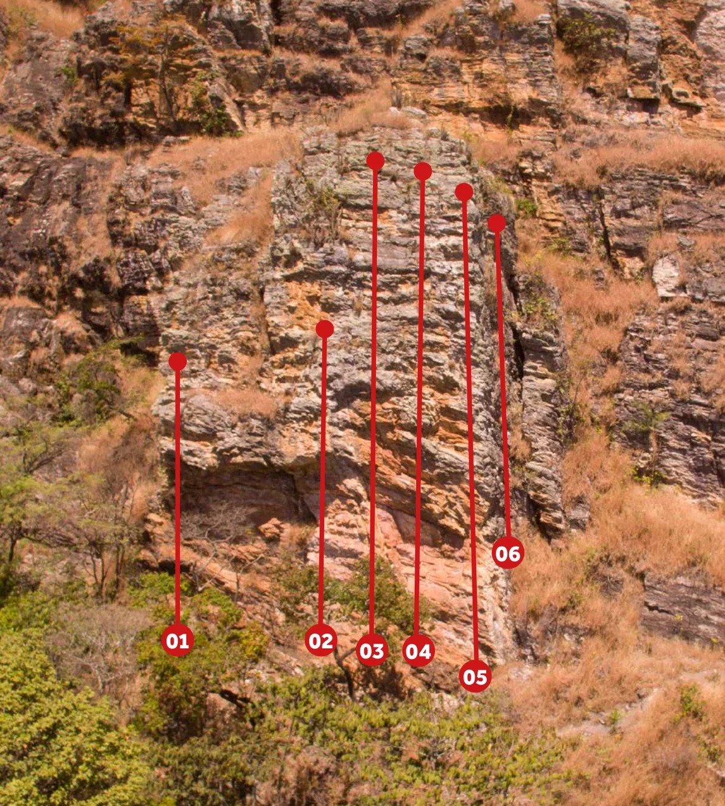
    - **largura_mapa**: 1145
    - **altura_mapa**: 1273
    - **pontos_de_interesse**:
      - **[0]**:
        - **id**: 01
        - **label**: 01
        - **box**:
          - **x**: 280
          - **y**: 1013
          - **comprimento**: 42
          - **largura**: 34
      - **[1]**:
        - **id**: 02
        - **label**: 02
        - **box**:
          - **x**: 506
          - **y**: 1013
          - **comprimento**: 46
          - **largura**: 32
      - **[2]**:
        - **id**: 03
        - **label**: 03
        - **box**:
          - **x**: 587
          - **y**: 1028
          - **comprimento**: 48
          - **largura**: 36
      - **[3]**:
        - **id**: 04
        - **label**: 04
        - **box**:
          - **x**: 660
          - **y**: 1029
          - **comprimento**: 49
          - **largura**: 36
      - **[4]**:
        - **id**: 05
        - **label**: 05
        - **box**:
          - **x**: 750
          - **y**: 1070
          - **comprimento**: 44
          - **largura**: 33
      - **[5]**:
        - **id**: 06
        - **label**: 06
        - **box**:
          - **x**: 801
          - **y**: 875
          - **comprimento**: 50
          - **largura**: 40
    - **referencias**:
      - **[0]**:
        - **escalada**: Jaratataca
        - **ids**:
          - 01
      - **[1]**:
        - **escalada**: Grito da Aranha
        - **ids**:
          - 02
      - **[2]**:
        - **escalada**: Melhor Opção
        - **ids**:
          - 03
      - **[3]**:
        - **escalada**: Rapa do Tacho
        - **ids**:
          - 04
      - **[4]**:
        - **escalada**: Carrapato não tem Pai
        - **ids**:
          - 05
      - **[5]**:
        - **escalada**: Barriga Verde
        - **ids**:
          - 06
  - **[1]**:
    - **caminho_imagem_mapa**: 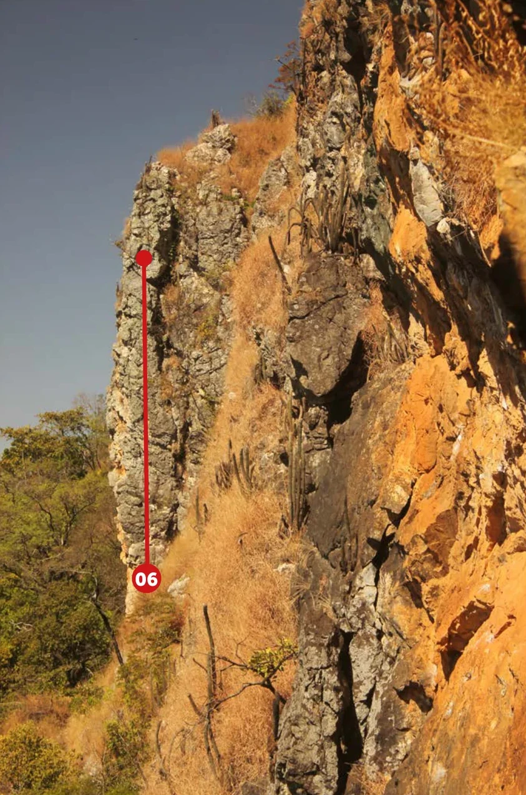
    - **largura_mapa**: 843
    - **altura_mapa**: 1273
    - **pontos_de_interesse**:
      - **[0]**:
        - **id**: 06
        - **label**: 06
        - **box**:
          - **x**: 234
          - **y**: 928
          - **comprimento**: 48
          - **largura**: 37
- **escaladas**:
  - **[0]**:
    - **via_esportiva**:
      - **nome**: Jaratataca
      - **dificuldade**: BR_6SUP
      - **extensao**: 10
      - **quantidade_protecoes_intermediarias**: 6
      - **quantidade_protecoes_parada**: 2
      - **conquistadores**:
        - Diego Leonardo
        - Laurêncio
      - **data_abertura**: 2009
  - **[1]**:
    - **via_esportiva**:
      - **nome**: Grito da Aranha
      - **dificuldade**: BR_7C
      - **extensao**: 15
      - **quantidade_protecoes_intermediarias**: 6
      - **quantidade_protecoes_parada**: 1
      - **conquistadores**:
        - Laurêncio
        - Diego Leonardo
      - **data_abertura**: 2009
  - **[2]**:
    - **via_esportiva**:
      - **nome**: Melhor Opção
      - **dificuldade**: BR_7A
      - **extensao**: 20
      - **quantidade_protecoes_intermediarias**: 8
      - **quantidade_protecoes_parada**: 2
      - **conquistadores**:
        - Laurêncio
        - Diego Leonardo
      - **data_abertura**: 2009
  - **[3]**:
    - **via_esportiva**:
      - **nome**: Rapa do Tacho
      - **dificuldade**: BR_6SUP
      - **extensao**: 20
      - **quantidade_protecoes_intermediarias**: 8
      - **quantidade_protecoes_parada**: 2
      - **conquistadores**:
        - Daiex de Almeida
      - **data_abertura**: 2016
  - **[4]**:
    - **via_esportiva**:
      - **nome**: Carrapato não tem Pai
      - **dificuldade**: BR_5
      - **extensao**: 20
      - **quantidade_protecoes_intermediarias**: 8
      - **quantidade_protecoes_parada**: 2
      - **conquistadores**:
        - Diego Leonardo
        - Felipe Siqueira
      - **data_abertura**: 2009
  - **[5]**:
    - **via_esportiva**:
      - **nome**: Barriga Verde
      - **dificuldade**: BR_5
      - **extensao**: 15
      - **quantidade_protecoes_intermediarias**: 6
      - **quantidade_protecoes_parada**: 2
      - **conquistadores**:
        - Lucas Ramos
      - **data_abertura**: 2006

## Parte: setor_bem_vindo

### Setor (Pico: Bocaina Park)

- **descricao**:
    # Setor Bem-vindo
    
    O Setor Bem-vindo é um dos setores mais tradicionais do parque, com vias que variam de 5º a 8a, e algumas das vias mais longas como "Sainhaca" e "Excalibur" (45m).
    
    > [!TIP]
    > Leve seu lixo e outro que encontrar para a cidade. Não faça necessidades fisiológicas nas trilhas e base de vias. Avisar a administração sobre a abertura de novas vias de escalada. **USE CAPACETE NAS BASES DE VIAS DE ESCALADA.**
- **nome**: Bem-vindo
- **mapas**:
  - **[0]**:
    - **caminho_imagem_mapa**: 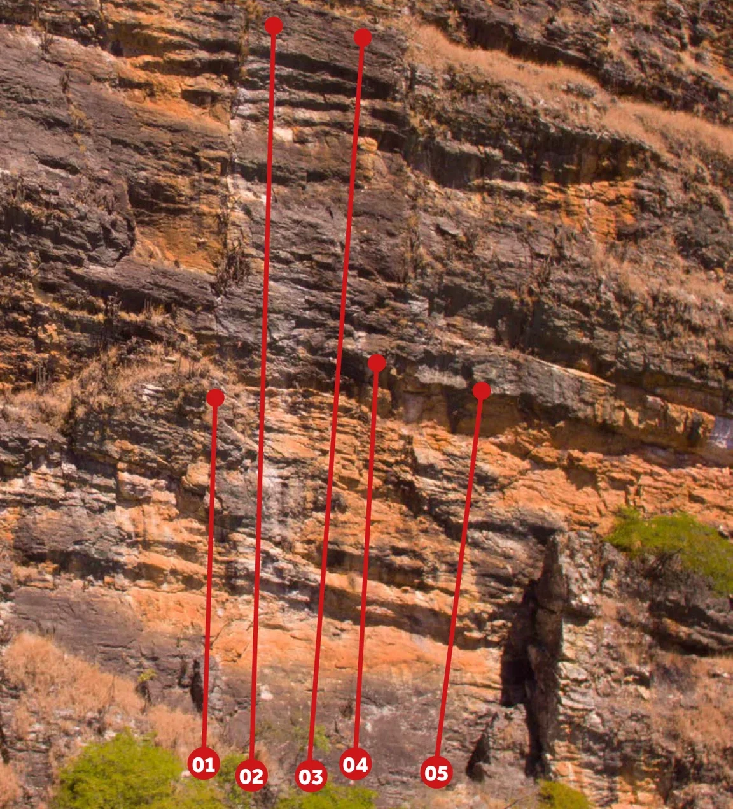
    - **largura_mapa**: 1152
    - **altura_mapa**: 1270
    - **pontos_de_interesse**:
      - **[0]**:
        - **id**: 01
        - **label**: 01
        - **box**:
          - **x**: 320
          - **y**: 1200
          - **comprimento**: 45
          - **largura**: 33
      - **[1]**:
        - **id**: 02
        - **label**: 02
        - **box**:
          - **x**: 394
          - **y**: 1219
          - **comprimento**: 45
          - **largura**: 32
      - **[2]**:
        - **id**: 03
        - **label**: 03
        - **box**:
          - **x**: 488
          - **y**: 1220
          - **comprimento**: 46
          - **largura**: 33
      - **[3]**:
        - **id**: 04
        - **label**: 04
        - **box**:
          - **x**: 558
          - **y**: 1201
          - **comprimento**: 48
          - **largura**: 32
      - **[4]**:
        - **id**: 05
        - **label**: 05
        - **box**:
          - **x**: 686
          - **y**: 1213
          - **comprimento**: 46
          - **largura**: 32
    - **referencias**:
      - **[0]**:
        - **escalada**: Carapuça
        - **ids**:
          - 01
      - **[1]**:
        - **escalada**: Sainhaca
        - **ids**:
          - 02
      - **[2]**:
        - **escalada**: Excalibur
        - **ids**:
          - 03
      - **[3]**:
        - **escalada**: Só as Cachorras
        - **ids**:
          - 04
      - **[4]**:
        - **escalada**: Lendárias 11 Vacas
        - **ids**:
          - 05
      - **[5]**:
        - **escalada**: Chapeleta Voadora
        - **ids**:
          - 06
      - **[6]**:
        - **escalada**: Pau Podre
        - **ids**:
          - 07
      - **[7]**:
        - **escalada**: Bonsai Cearense
        - **ids**:
          - 8
      - **[8]**:
        - **escalada**: Macaco Velho
        - **ids**:
          - 9
      - **[9]**:
        - **escalada**: Sargento Pincel
        - **ids**:
          - 10
      - **[10]**:
        - **escalada**: Proparoxítona
        - **ids**:
          - 11
      - **[11]**:
        - **escalada**: Volte Sempre
        - **ids**:
          - 12
      - **[12]**:
        - **escalada**: Espírito de Equipe
        - **ids**:
          - 13
      - **[13]**:
        - **escalada**: Bem-vindo
        - **ids**:
          - 14
      - **[14]**:
        - **escalada**: Ganja no País das Maravilhas
        - **ids**:
          - 15
      - **[15]**:
        - **escalada**: Ritual Satânico
        - **ids**:
          - 16
      - **[16]**:
        - **escalada**: Sweet Home Alabama
        - **ids**:
          - 17
      - **[17]**:
        - **escalada**: Show de Calouros
        - **ids**:
          - 18
      - **[18]**:
        - **escalada**: Permissão Concebida
        - **ids**:
          - 19
  - **[1]**:
    - **caminho_imagem_mapa**: 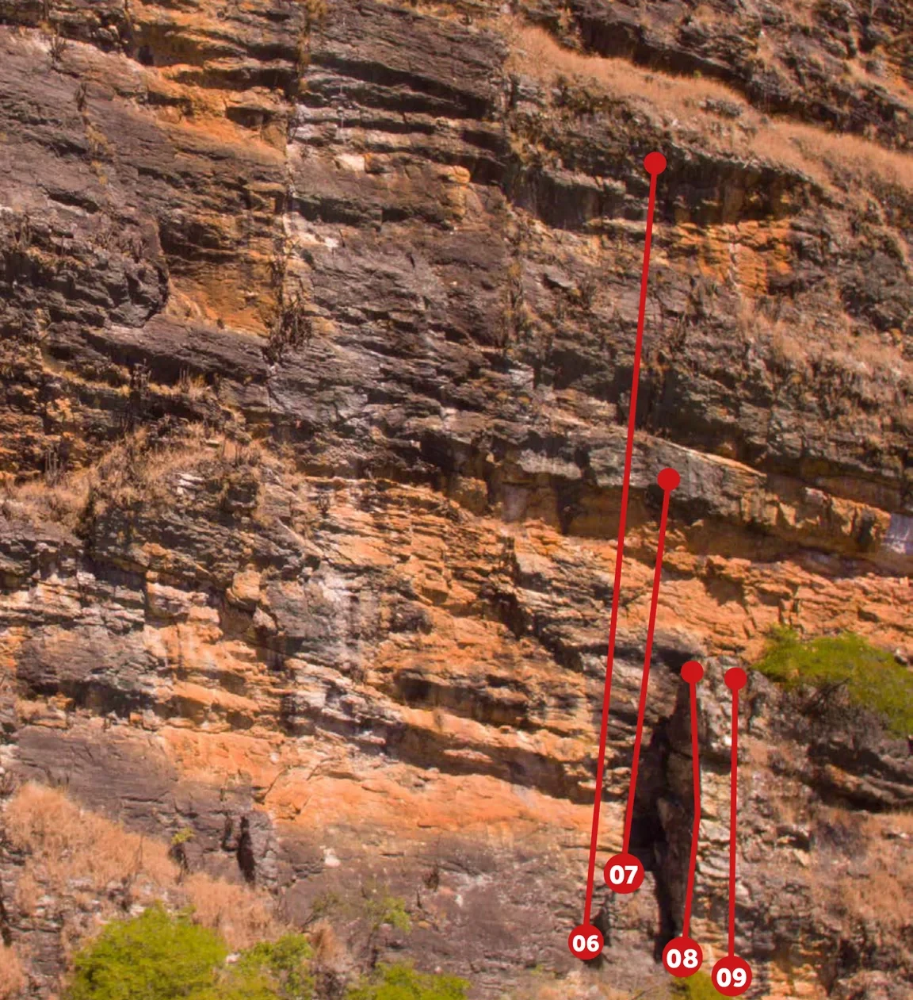
    - **largura_mapa**: 1152
    - **altura_mapa**: 1261
    - **pontos_de_interesse**:
      - **[0]**:
        - **id**: 06
        - **label**: 06
        - **box**:
          - **x**: 739
          - **y**: 1188
          - **comprimento**: 44
          - **largura**: 33
      - **[1]**:
        - **id**: 07
        - **label**: 07
        - **box**:
          - **x**: 786
          - **y**: 1102
          - **comprimento**: 47
          - **largura**: 37
      - **[2]**:
        - **id**: 08
        - **label**: 08
        - **box**:
          - **x**: 861
          - **y**: 1210
          - **comprimento**: 50
          - **largura**: 37
      - **[3]**:
        - **id**: 09
        - **label**: 09
        - **box**:
          - **x**: 923
          - **y**: 1234
          - **comprimento**: 48
          - **largura**: 37
  - **[2]**:
    - **caminho_imagem_mapa**: 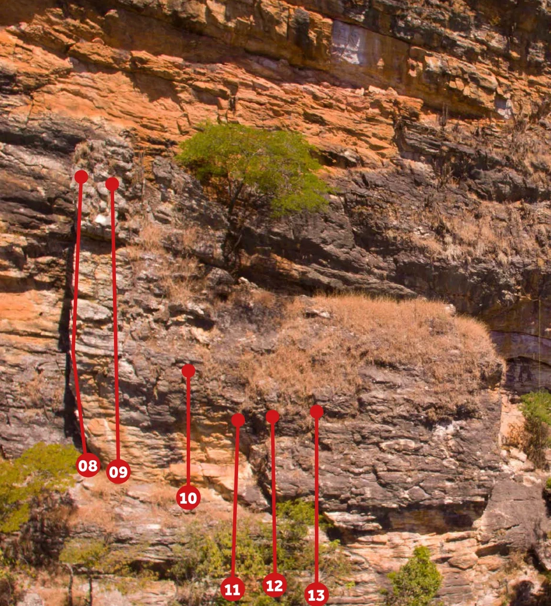
    - **largura_mapa**: 1152
    - **altura_mapa**: 1267
    - **pontos_de_interesse**:
      - **[0]**:
        - **id**: 08
        - **label**: 08
        - **box**:
          - **x**: 184
          - **y**: 974
          - **comprimento**: 53
          - **largura**: 38
      - **[1]**:
        - **id**: 09
        - **label**: 09
        - **box**:
          - **x**: 246
          - **y**: 988
          - **comprimento**: 52
          - **largura**: 41
      - **[2]**:
        - **id**: 10
        - **label**: 10
        - **box**:
          - **x**: 393
          - **y**: 1042
          - **comprimento**: 48
          - **largura**: 37
      - **[3]**:
        - **id**: 11
        - **label**: 11
        - **box**:
          - **x**: 485
          - **y**: 1233
          - **comprimento**: 42
          - **largura**: 36
      - **[4]**:
        - **id**: 12
        - **label**: 12
        - **box**:
          - **x**: 573
          - **y**: 1225
          - **comprimento**: 42
          - **largura**: 32
      - **[5]**:
        - **id**: 13
        - **label**: 13
        - **box**:
          - **x**: 660
          - **y**: 1244
          - **comprimento**: 43
          - **largura**: 33
  - **[3]**:
    - **caminho_imagem_mapa**: 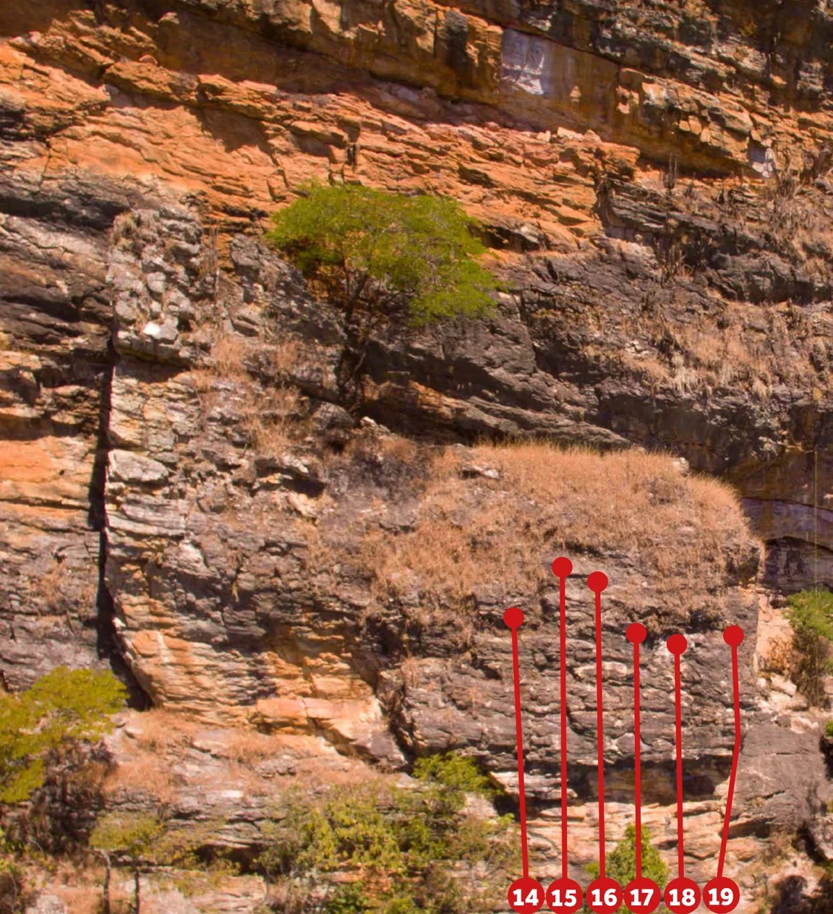
    - **largura_mapa**: 1152
    - **altura_mapa**: 1264
    - **pontos_de_interesse**:
      - **[0]**:
        - **id**: 14
        - **label**: 14
        - **box**:
          - **x**: 728
          - **y**: 1240
          - **comprimento**: 33
          - **largura**: 29
      - **[1]**:
        - **id**: 15
        - **label**: 15
        - **box**:
          - **x**: 782
          - **y**: 1240
          - **comprimento**: 33
          - **largura**: 30
      - **[2]**:
        - **id**: 16
        - **label**: 16
        - **box**:
          - **x**: 836
          - **y**: 1238
          - **comprimento**: 35
          - **largura**: 30
      - **[3]**:
        - **id**: 17
        - **label**: 17
        - **box**:
          - **x**: 886
          - **y**: 1241
          - **comprimento**: 33
          - **largura**: 32
      - **[4]**:
        - **id**: 18
        - **label**: 18
        - **box**:
          - **x**: 942
          - **y**: 1240
          - **comprimento**: 33
          - **largura**: 32
      - **[5]**:
        - **id**: 19
        - **label**: 19
        - **box**:
          - **x**: 996
          - **y**: 1238
          - **comprimento**: 32
          - **largura**: 31
- **escaladas**:
  - **[0]**:
    - **via_esportiva**:
      - **descricao**: Inacabada.
      - **nome**: Carapuça
      - **dificuldade**: PROJETO
  - **[1]**:
    - **via_esportiva**:
      - **nome**: Sainhaca
      - **dificuldade**: BR_8A
      - **extensao**: 45
      - **quantidade_protecoes_intermediarias**: 18
      - **quantidade_protecoes_parada**: 2
      - **conquistadores**:
        - Diego
        - Fei
        - Gustavo Scandiuzzi
      - **data_abertura**: 2007
  - **[2]**:
    - **via_esportiva**:
      - **nome**: Excalibur
      - **dificuldade**: BR_7C
      - **extensao**: 45
      - **quantidade_protecoes_intermediarias**: 20
      - **quantidade_protecoes_parada**: 2
      - **conquistadores**:
        - Diego
        - Laurêncio
        - Fei
      - **data_abertura**: 2007
  - **[3]**:
    - **via_esportiva**:
      - **descricao**: Falta topo.
      - **nome**: Só as Cachorras
      - **dificuldade**: BR_7C
      - **extensao**: 25
      - **quantidade_protecoes_intermediarias**: 8
      - **conquistadores**:
        - Alexandre
        - Fei
        - Bruno Kabeção
      - **data_abertura**: 2007
  - **[4]**:
    - **via_esportiva**:
      - **nome**: Lendárias 11 Vacas
      - **dificuldade**: BR_7B
      - **extensao**: 20
      - **quantidade_protecoes_intermediarias**: 10
      - **quantidade_protecoes_parada**: 2
      - **conquistadores**:
        - Juliano
        - Diego
        - Laurêncio
        - Fei
      - **data_abertura**: 2007
  - **[5]**:
    - **via_esportiva**:
      - **nome**: Chapeleta Voadora
      - **dificuldade**: BR_7B
      - **extensao**: 30
      - **conquistadores**:
        - Diego
        - Laurêncio
        - Fei
      - **data_abertura**: 2008
  - **[6]**:
    - **via_esportiva**:
      - **descricao**: Inacabada.
      - **nome**: Pau Podre
      - **dificuldade**: PROJETO
      - **data_abertura**: 2007
  - **[7]**:
    - **via_esportiva**:
      - **nome**: Bonsai Cearense
      - **dificuldade**: BR_5
      - **extensao**: 10
      - **quantidade_protecoes_intermediarias**: 4
      - **quantidade_protecoes_parada**: 2
      - **conquistadores**:
        - Juliano
      - **data_abertura**: 2006
  - **[8]**:
    - **via_esportiva**:
      - **nome**: Macaco Velho
      - **dificuldade**: BR_6SUP
      - **extensao**: 10
      - **quantidade_protecoes_intermediarias**: 6
      - **quantidade_protecoes_parada**: 2
      - **conquistadores**:
        - Pedro Andrade
      - **data_abertura**: 2017
  - **[9]**:
    - **via_esportiva**:
      - **nome**: Sargento Pincel
      - **dificuldade**: BR_6SUP
      - **extensao**: 15
      - **quantidade_protecoes_intermediarias**: 6
      - **quantidade_protecoes_parada**: 2
      - **conquistadores**:
        - Laurêncio Jr
      - **data_abertura**: 2010
  - **[10]**:
    - **via_esportiva**:
      - **nome**: Proparoxítona
      - **dificuldade**: BR_6
      - **extensao**: 10
      - **quantidade_protecoes_intermediarias**: 4
      - **quantidade_protecoes_parada**: 2
      - **conquistadores**:
        - Diego Leonardo
        - Gustavo Maneira
      - **data_abertura**: 2010
  - **[11]**:
    - **via_esportiva**:
      - **nome**: Volte Sempre
      - **dificuldade**: BR_6
      - **extensao**: 10
      - **quantidade_protecoes_intermediarias**: 5
      - **quantidade_protecoes_parada**: 2
      - **conquistadores**:
        - Diego Leonardo
        - Gustavo Maneira
      - **data_abertura**: 2010
  - **[12]**:
    - **via_esportiva**:
      - **nome**: Espírito de Equipe
      - **dificuldade**: BR_6SUP
      - **extensao**: 19
      - **quantidade_protecoes_intermediarias**: 4
      - **quantidade_protecoes_parada**: 2
      - **conquistadores**:
        - Daiex de Almeida
      - **data_abertura**: 2017
  - **[13]**:
    - **via_esportiva**:
      - **nome**: Bem-vindo
      - **dificuldade**: BR_7A
      - **extensao**: 10
      - **quantidade_protecoes_intermediarias**: 4
      - **quantidade_protecoes_parada**: 2
      - **conquistadores**:
        - Geraldo Neto
        - Aluísio
      - **data_abertura**: 2006
  - **[14]**:
    - **via_esportiva**:
      - **nome**: Ganja no País das Maravilhas
      - **dificuldade**: BR_7A
      - **extensao**: 10
      - **quantidade_protecoes_intermediarias**: 4
      - **quantidade_protecoes_parada**: 2
      - **conquistadores**:
        - Rafael Furtado
      - **data_abertura**: 2017
  - **[15]**:
    - **via_esportiva**:
      - **nome**: Ritual Satânico
      - **dificuldade**: BR_7A
      - **extensao**: 10
      - **quantidade_protecoes_intermediarias**: 4
      - **quantidade_protecoes_parada**: 2
      - **conquistadores**:
        - Geraldo Neto
        - Aluísio
      - **data_abertura**: 2006
  - **[16]**:
    - **via_esportiva**:
      - **nome**: Sweet Home Alabama
      - **dificuldade**: BR_6SUP_BARRA_7A
      - **extensao**: 10
      - **quantidade_protecoes_intermediarias**: 3
      - **quantidade_protecoes_parada**: 2
      - **conquistadores**:
        - Diego Leonardo
      - **data_abertura**: 2017
  - **[17]**:
    - **via_esportiva**:
      - **descricao**: Falta topo.
      - **nome**: Show de Calouros
      - **dificuldade**: BR_8A
      - **extensao**: 10
      - **quantidade_protecoes_intermediarias**: 4
      - **conquistadores**:
        - Geraldo Neto
        - Aluísio
      - **data_abertura**: 2006
  - **[18]**:
    - **via_esportiva**:
      - **nome**: Permissão Concebida
      - **dificuldade**: BR_8A
      - **extensao**: 8
      - **quantidade_protecoes_intermediarias**: 4
      - **quantidade_protecoes_parada**: 2
      - **conquistadores**:
        - Diego Leonardo
        - Gustavo Maneira
      - **data_abertura**: 2009

## Parte: setor_tetos

### Setor (Pico: Bocaina Park)

- **descricao**:
    # Setor Tetos
    
    | 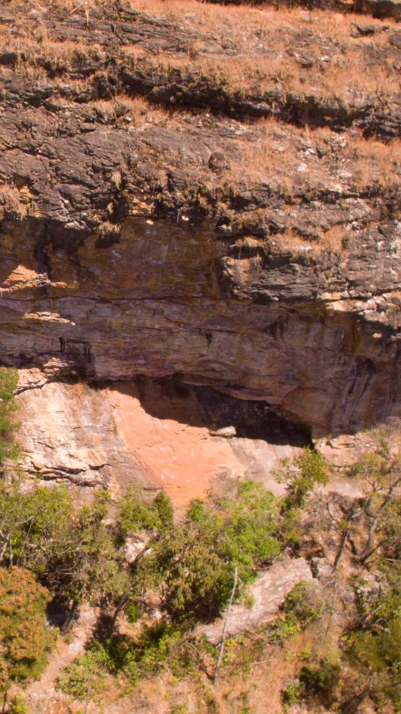 |
    | :--: |
    | *Setor Tetos* |
    
    O Setor Tetos é conhecido por suas vias atléticas e desafiadoras, com muitos tetos e negativas. Contém vias variadas de 5º a 10a grau, além de vários projetos promissores.
    
    > [!TIP]
    > Leve seu lixo e outro que encontrar para a cidade. Não faça necessidades fisiológicas nas trilhas e base de vias. Avisar a administração sobre a abertura de novas vias de escalada. **USE CAPACETE NAS BASES DE VIAS DE ESCALADA.**
- **nome**: Tetos
- **mapas**:
  - **[0]**:
    - **caminho_imagem_mapa**: 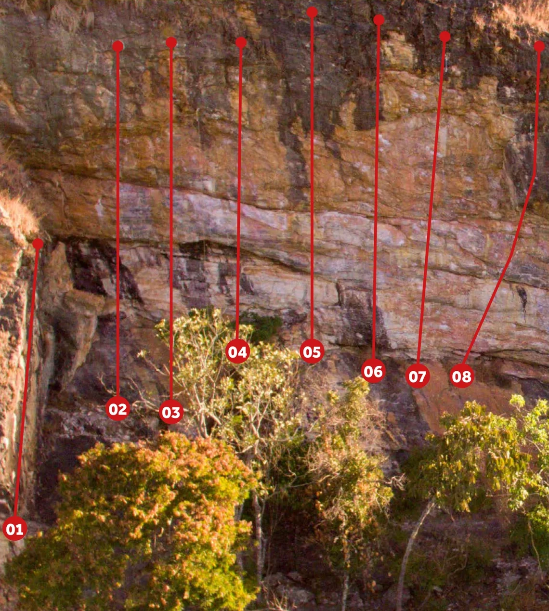
    - **largura_mapa**: 1140
    - **altura_mapa**: 1269
    - **pontos_de_interesse**:
      - **[0]**:
        - **id**: 01
        - **label**: 01
        - **box**:
          - **x**: 30
          - **y**: 1100
          - **comprimento**: 43
          - **largura**: 33
      - **[1]**:
        - **id**: 02
        - **label**: 02
        - **box**:
          - **x**: 245
          - **y**: 850
          - **comprimento**: 44
          - **largura**: 33
      - **[2]**:
        - **id**: 03
        - **label**: 03
        - **box**:
          - **x**: 355
          - **y**: 856
          - **comprimento**: 48
          - **largura**: 35
      - **[3]**:
        - **id**: 04
        - **label**: 04
        - **box**:
          - **x**: 494
          - **y**: 732
          - **comprimento**: 47
          - **largura**: 33
      - **[4]**:
        - **id**: 05
        - **label**: 05
        - **box**:
          - **x**: 648
          - **y**: 732
          - **comprimento**: 45
          - **largura**: 34
      - **[5]**:
        - **id**: 06
        - **label**: 06
        - **box**:
          - **x**: 774
          - **y**: 772
          - **comprimento**: 49
          - **largura**: 36
      - **[6]**:
        - **id**: 07
        - **label**: 07
        - **box**:
          - **x**: 866
          - **y**: 782
          - **comprimento**: 44
          - **largura**: 34
      - **[7]**:
        - **id**: 08
        - **label**: 08
        - **box**:
          - **x**: 958
          - **y**: 782
          - **comprimento**: 49
          - **largura**: 36
    - **referencias**:
      - **[0]**:
        - **escalada**: Permissão Concebida
        - **ids**:
          - 01
      - **[1]**:
        - **escalada**: Bocaina Aventura
        - **ids**:
          - 02
      - **[2]**:
        - **escalada**: O Vento Levou
        - **ids**:
          - 03
      - **[3]**:
        - **escalada**: Titan
        - **ids**:
          - 04
      - **[4]**:
        - **escalada**: Mirian
        - **ids**:
          - 05
      - **[5]**:
        - **escalada**: Hipnose
        - **ids**:
          - 06
      - **[6]**:
        - **escalada**: Resta Um
        - **ids**:
          - 07
      - **[7]**:
        - **escalada**: Medo de quê Aresta
        - **ids**:
          - 8
      - **[8]**:
        - **escalada**: Pressão Psicológica
        - **ids**:
          - 9
      - **[9]**:
        - **escalada**: Zumbi da Bocaina
        - **ids**:
          - 10
      - **[10]**:
        - **escalada**: Curta e Grossa
        - **ids**:
          - 11
      - **[11]**:
        - **escalada**: Menos Curta e Mais Grossa
        - **ids**:
          - 12
      - **[12]**:
        - **escalada**: El Corazon
        - **ids**:
          - 13
      - **[13]**:
        - **escalada**: Sombra e Água Fresca
        - **ids**:
          - 14
      - **[14]**:
        - **escalada**: Vitamina C
        - **ids**:
          - 15
      - **[15]**:
        - **escalada**: Mão de Vaca
        - **ids**:
          - 16
      - **[16]**:
        - **escalada**: Natural Climb
        - **ids**:
          - 17
      - **[17]**:
        - **escalada**: Chape
        - **ids**:
          - 18
      - **[18]**:
        - **escalada**: Comando Delta
        - **ids**:
          - 19
      - **[19]**:
        - **escalada**: Rachando os Bico
        - **ids**:
          - 20
      - **[20]**:
        - **escalada**: Mato Seco
        - **ids**:
          - 21
      - **[21]**:
        - **escalada**: De um jeito ou de Outro
        - **ids**:
          - 22
      - **[22]**:
        - **escalada**: Arapuá
        - **ids**:
          - 23
      - **[23]**:
        - **escalada**: Carcará Uru
        - **ids**:
          - 24
      - **[24]**:
        - **escalada**: Rapadura
        - **ids**:
          - 25
      - **[25]**:
        - **escalada**: Zé Bunitim
        - **ids**:
          - 26
      - **[26]**:
        - **escalada**: Vai ser Fei
        - **ids**:
          - 27
      - **[27]**:
        - **escalada**: Estrela Solitária
        - **ids**:
          - 28
      - **[28]**:
        - **escalada**: Vergateza
        - **ids**:
          - 29
      - **[29]**:
        - **escalada**: Chico Curandeiro
        - **ids**:
          - 30
      - **[30]**:
        - **escalada**: Reforma Trabalhista
        - **ids**:
          - 31
      - **[31]**:
        - **escalada**: Arborigenas
        - **ids**:
          - 32
      - **[32]**:
        - **escalada**: Faz sua Parte
        - **ids**:
          - 33
      - **[33]**:
        - **escalada**: Delirando
        - **ids**:
          - 34
      - **[34]**:
        - **escalada**: Saraiva
        - **ids**:
          - 35
      - **[35]**:
        - **escalada**: Rolando Lero
        - **ids**:
          - 36
      - **[36]**:
        - **escalada**: Jardinagem
        - **ids**:
          - 37
      - **[37]**:
        - **escalada**: Soldados do Sol
        - **ids**:
          - 38
      - **[38]**:
        - **escalada**: Metamorfose Ambulante
        - **ids**:
          - 39
      - **[39]**:
        - **escalada**: Baby Rasta
        - **ids**:
          - 40
      - **[40]**:
        - **escalada**: Cara ou Crachá
        - **ids**:
          - 41
  - **[1]**:
    - **caminho_imagem_mapa**: 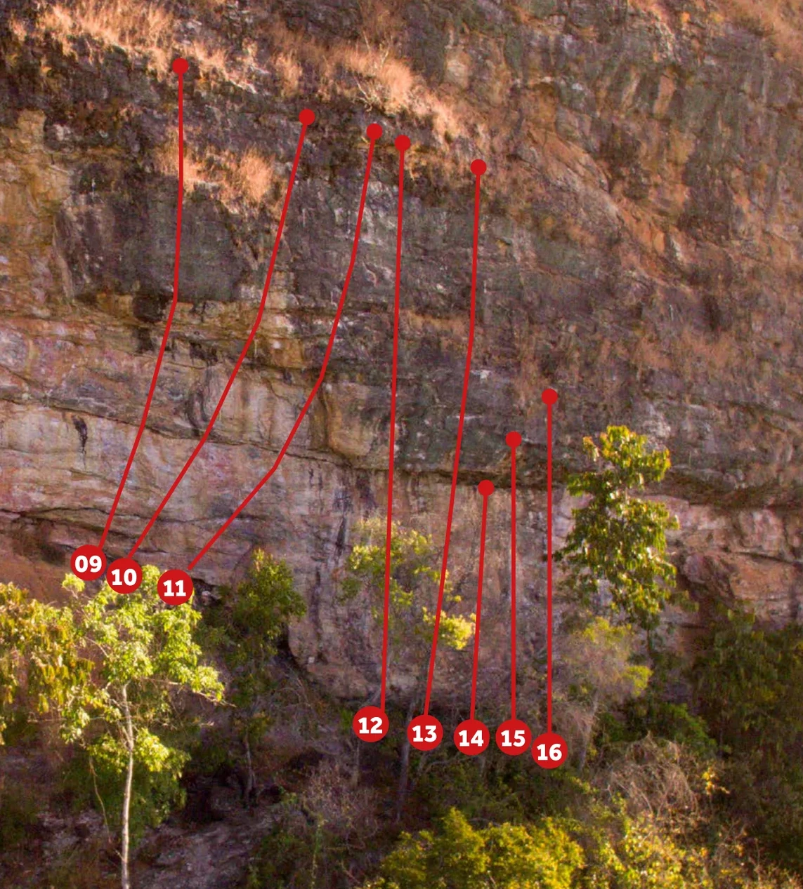
    - **largura_mapa**: 1143
    - **altura_mapa**: 1267
    - **pontos_de_interesse**:
      - **[0]**:
        - **id**: 09
        - **label**: 09
        - **box**:
          - **x**: 126
          - **y**: 801
          - **comprimento**: 37
          - **largura**: 28
      - **[1]**:
        - **id**: 10
        - **label**: 10
        - **box**:
          - **x**: 176
          - **y**: 821
          - **comprimento**: 33
          - **largura**: 28
      - **[2]**:
        - **id**: 11
        - **label**: 11
        - **box**:
          - **x**: 248
          - **y**: 838
          - **comprimento**: 41
          - **largura**: 33
      - **[3]**:
        - **id**: 12
        - **label**: 12
        - **box**:
          - **x**: 527
          - **y**: 1034
          - **comprimento**: 42
          - **largura**: 32
      - **[4]**:
        - **id**: 13
        - **label**: 13
        - **box**:
          - **x**: 604
          - **y**: 1046
          - **comprimento**: 43
          - **largura**: 33
      - **[5]**:
        - **id**: 14
        - **label**: 14
        - **box**:
          - **x**: 670
          - **y**: 1052
          - **comprimento**: 45
          - **largura**: 33
      - **[6]**:
        - **id**: 15
        - **label**: 15
        - **box**:
          - **x**: 729
          - **y**: 1053
          - **comprimento**: 44
          - **largura**: 34
      - **[7]**:
        - **id**: 16
        - **label**: 16
        - **box**:
          - **x**: 782
          - **y**: 1072
          - **comprimento**: 43
          - **largura**: 33
  - **[2]**:
    - **caminho_imagem_mapa**: 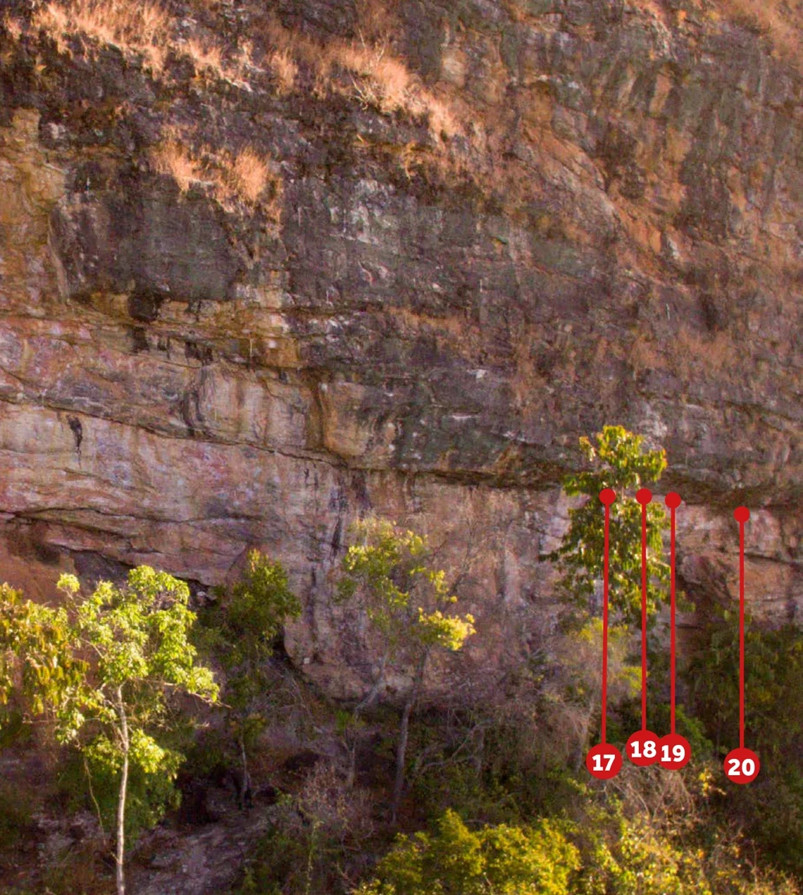
    - **largura_mapa**: 1140
    - **altura_mapa**: 1270
    - **pontos_de_interesse**:
      - **[0]**:
        - **id**: 17
        - **label**: 17
        - **box**:
          - **x**: 856
          - **y**: 1083
          - **comprimento**: 35
          - **largura**: 36
      - **[1]**:
        - **id**: 18
        - **label**: 18
        - **box**:
          - **x**: 914
          - **y**: 1062
          - **comprimento**: 35
          - **largura**: 30
      - **[2]**:
        - **id**: 19
        - **label**: 19
        - **box**:
          - **x**: 954
          - **y**: 1068
          - **comprimento**: 35
          - **largura**: 27
      - **[3]**:
        - **id**: 20
        - **label**: 20
        - **box**:
          - **x**: 1052
          - **y**: 1086
          - **comprimento**: 39
          - **largura**: 34
  - **[3]**:
    - **caminho_imagem_mapa**: 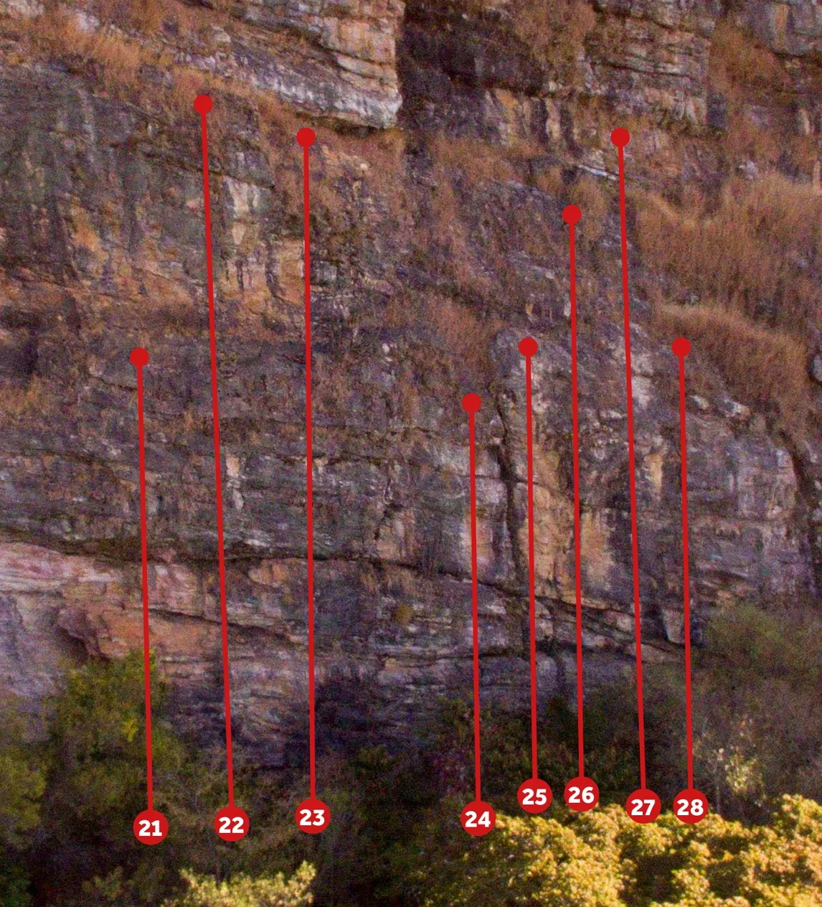
    - **largura_mapa**: 1146
    - **altura_mapa**: 1264
    - **pontos_de_interesse**:
      - **[0]**:
        - **id**: 21
        - **label**: 21
        - **box**:
          - **x**: 208
          - **y**: 1154
          - **comprimento**: 41
          - **largura**: 33
      - **[1]**:
        - **id**: 22
        - **label**: 22
        - **box**:
          - **x**: 321
          - **y**: 1150
          - **comprimento**: 44
          - **largura**: 32
      - **[2]**:
        - **id**: 23
        - **label**: 23
        - **box**:
          - **x**: 435
          - **y**: 1139
          - **comprimento**: 44
          - **largura**: 34
      - **[3]**:
        - **id**: 24
        - **label**: 24
        - **box**:
          - **x**: 666
          - **y**: 1141
          - **comprimento**: 44
          - **largura**: 32
      - **[4]**:
        - **id**: 25
        - **label**: 25
        - **box**:
          - **x**: 745
          - **y**: 1111
          - **comprimento**: 44
          - **largura**: 34
      - **[5]**:
        - **id**: 26
        - **label**: 26
        - **box**:
          - **x**: 810
          - **y**: 1108
          - **comprimento**: 49
          - **largura**: 36
      - **[6]**:
        - **id**: 27
        - **label**: 27
        - **box**:
          - **x**: 896
          - **y**: 1126
          - **comprimento**: 41
          - **largura**: 33
      - **[7]**:
        - **id**: 28
        - **label**: 28
        - **box**:
          - **x**: 962
          - **y**: 1126
          - **comprimento**: 45
          - **largura**: 33
  - **[4]**:
    - **caminho_imagem_mapa**: 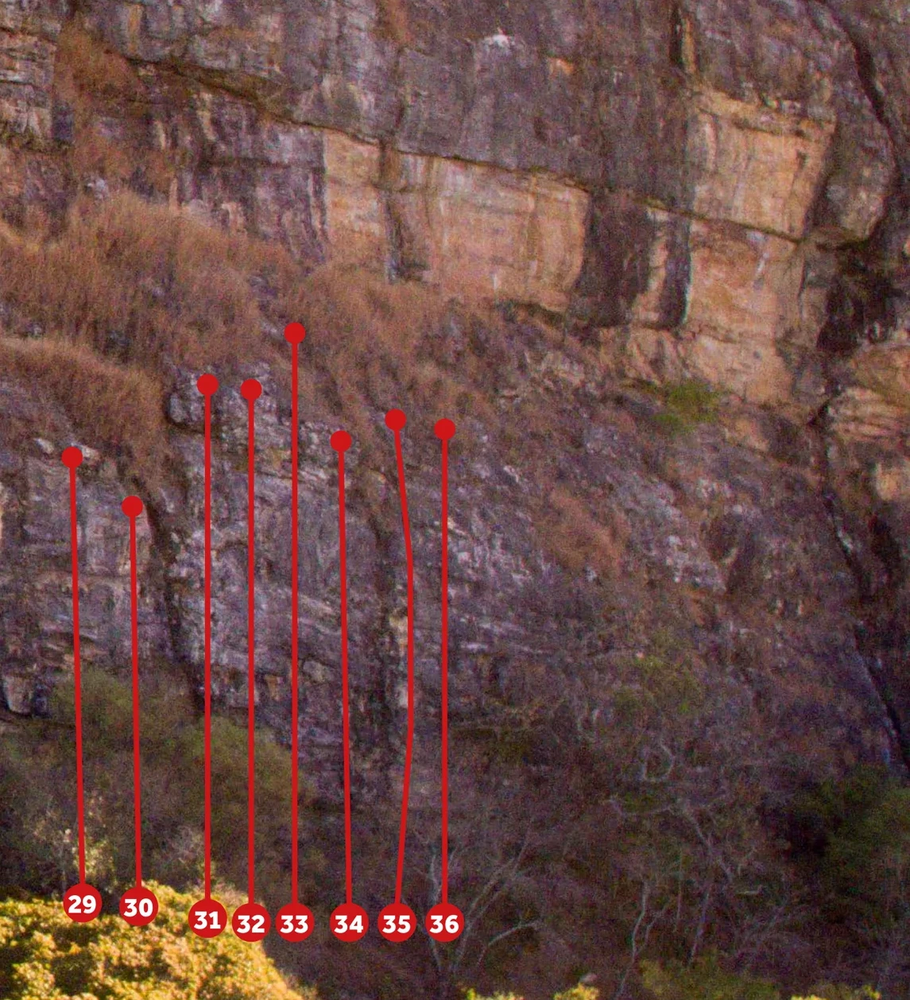
    - **largura_mapa**: 1145
    - **altura_mapa**: 1258
    - **pontos_de_interesse**:
      - **[0]**:
        - **id**: 29
        - **label**: 29
        - **box**:
          - **x**: 102
          - **y**: 1138
          - **comprimento**: 45
          - **largura**: 37
      - **[1]**:
        - **id**: 30
        - **label**: 30
        - **box**:
          - **x**: 173
          - **y**: 1142
          - **comprimento**: 48
          - **largura**: 37
      - **[2]**:
        - **id**: 31
        - **label**: 31
        - **box**:
          - **x**: 261
          - **y**: 1155
          - **comprimento**: 36
          - **largura**: 32
      - **[3]**:
        - **id**: 32
        - **label**: 32
        - **box**:
          - **x**: 315
          - **y**: 1162
          - **comprimento**: 34
          - **largura**: 31
      - **[4]**:
        - **id**: 33
        - **label**: 33
        - **box**:
          - **x**: 370
          - **y**: 1160
          - **comprimento**: 32
          - **largura**: 30
      - **[5]**:
        - **id**: 34
        - **label**: 34
        - **box**:
          - **x**: 438
          - **y**: 1162
          - **comprimento**: 39
          - **largura**: 31
      - **[6]**:
        - **id**: 35
        - **label**: 35
        - **box**:
          - **x**: 499
          - **y**: 1162
          - **comprimento**: 36
          - **largura**: 31
      - **[7]**:
        - **id**: 36
        - **label**: 36
        - **box**:
          - **x**: 558
          - **y**: 1162
          - **comprimento**: 36
          - **largura**: 29
  - **[5]**:
    - **caminho_imagem_mapa**: 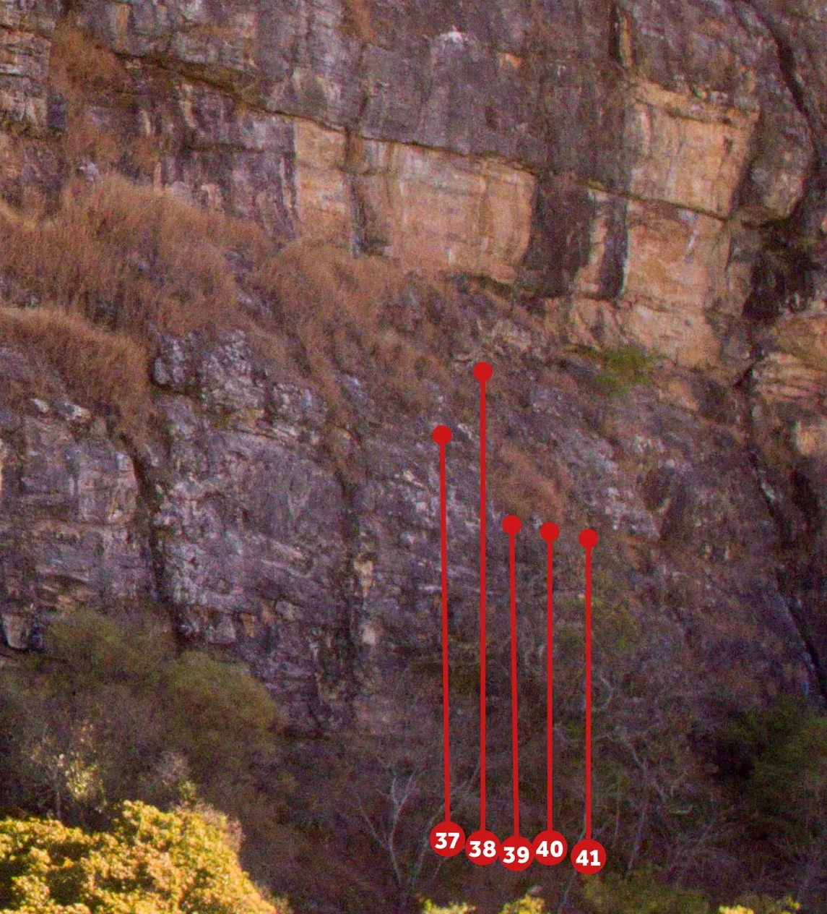
    - **largura_mapa**: 1145
    - **altura_mapa**: 1264
    - **pontos_de_interesse**:
      - **[0]**:
        - **id**: 37
        - **label**: 37
        - **box**:
          - **x**: 618
          - **y**: 1161
          - **comprimento**: 30
          - **largura**: 26
      - **[1]**:
        - **id**: 38
        - **label**: 38
        - **box**:
          - **x**: 668
          - **y**: 1174
          - **comprimento**: 33
          - **largura**: 29
      - **[2]**:
        - **id**: 39
        - **label**: 39
        - **box**:
          - **x**: 715
          - **y**: 1181
          - **comprimento**: 36
          - **largura**: 26
      - **[3]**:
        - **id**: 40
        - **label**: 40
        - **box**:
          - **x**: 761
          - **y**: 1174
          - **comprimento**: 34
          - **largura**: 29
      - **[4]**:
        - **id**: 41
        - **label**: 41
        - **box**:
          - **x**: 813
          - **y**: 1185
          - **comprimento**: 36
          - **largura**: 26
- **escaladas**:
  - **[0]**:
    - **via_esportiva**:
      - **nome**: Permissão Concebida
      - **dificuldade**: BR_8A
      - **extensao**: 8
      - **quantidade_protecoes_intermediarias**: 4
      - **quantidade_protecoes_parada**: 2
      - **conquistadores**:
        - Diego Leonardo
        - Gustavo Maneira
      - **data_abertura**: 2008
  - **[1]**:
    - **via_esportiva**:
      - **nome**: Bocaina Aventura
      - **dificuldade**: PROJETO
      - **extensao**: 10
      - **quantidade_protecoes_intermediarias**: 6
      - **quantidade_protecoes_parada**: 2
      - **conquistadores**:
        - Diego Leonardo
        - Alexandre Fei
      - **data_abertura**: 2017
  - **[2]**:
    - **via_esportiva**:
      - **nome**: O Vento Levou
      - **dificuldade**: BR_10A
      - **extensao**: 10
      - **quantidade_protecoes_intermediarias**: 4
      - **quantidade_protecoes_parada**: 2
      - **conquistadores**:
        - Diego Leonardo
        - Alexandre Fei
      - **data_abertura**: 2017
  - **[3]**:
    - **via_esportiva**:
      - **nome**: Titan
      - **dificuldade**: PROJETO
      - **extensao**: 10
      - **conquistadores**:
        - Alexandre Fei
        - Diego Leonardo
      - **data_abertura**: 2017
  - **[4]**:
    - **via_esportiva**:
      - **nome**: Mirian
      - **dificuldade**: BR_8C
      - **extensao**: 15
      - **quantidade_protecoes_intermediarias**: 7
      - **quantidade_protecoes_parada**: 2
      - **conquistadores**:
        - Gustavo Piacasteli
        - Difora
        - Alexandre Fei
        - Gustavo Scandiuzzi
      - **data_abertura**: 2008
  - **[5]**:
    - **via_esportiva**:
      - **nome**: Hipnose
      - **dificuldade**: BR_7C
      - **extensao**: 15
      - **quantidade_protecoes_intermediarias**: 6
      - **quantidade_protecoes_parada**: 2
      - **conquistadores**:
        - Daiex de Almeida
        - Alexandre Fei
      - **data_abertura**: 2008
  - **[6]**:
    - **via_esportiva**:
      - **nome**: Resta Um
      - **dificuldade**: BR_9A
      - **extensao**: 15
      - **quantidade_protecoes_intermediarias**: 7
      - **quantidade_protecoes_parada**: 2
      - **conquistadores**:
        - Alexandre Fei
        - Juliano Peter Park
        - Juliano Fernandes
      - **data_abertura**: 2006
  - **[7]**:
    - **via_esportiva**:
      - **nome**: Medo de quê Aresta
      - **dificuldade**: BR_10A
      - **extensao**: 15
      - **quantidade_protecoes_intermediarias**: 7
      - **quantidade_protecoes_parada**: 2
      - **conquistadores**:
        - Rafael Furtado
        - Alexandre Fei
      - **data_abertura**: 2008
  - **[8]**:
    - **via_esportiva**:
      - **nome**: Pressão Psicológica
      - **dificuldade**: PROJETO
      - **extensao**: 15
      - **quantidade_protecoes_intermediarias**: 6
      - **quantidade_protecoes_parada**: 2
      - **conquistadores**:
        - Alexandre Fei
        - Felipe Belisario
      - **data_abertura**: 2009
  - **[9]**:
    - **via_esportiva**:
      - **nome**: Zumbi da Bocaina
      - **dificuldade**: BR_8B
      - **extensao**: 15
      - **quantidade_protecoes_intermediarias**: 7
      - **quantidade_protecoes_parada**: 2
      - **conquistadores**:
        - Fei
        - Diego Leonardo
        - Ricardo Magrão
      - **data_abertura**: 2008
  - **[10]**:
    - **via_esportiva**:
      - **nome**: Curta e Grossa
      - **dificuldade**: BR_7C
      - **extensao**: 15
      - **quantidade_protecoes_intermediarias**: 8
      - **quantidade_protecoes_parada**: 2
      - **conquistadores**:
        - Juliano
        - Diego
        - Alexandre Fei
      - **data_abertura**: 2006
  - **[11]**:
    - **via_esportiva**:
      - **nome**: Menos Curta e Mais Grossa
      - **dificuldade**: BR_8C
      - **extensao**: 15
      - **quantidade_protecoes_intermediarias**: 7
      - **quantidade_protecoes_parada**: 2
      - **conquistadores**:
        - Alexandre Fei
        - Lucas Ramos
        - Gabriel Guimarães
      - **data_abertura**: 2009
  - **[12]**:
    - **via_esportiva**:
      - **nome**: El Corazon
      - **dificuldade**: BR_8B
      - **extensao**: 15
      - **quantidade_protecoes_intermediarias**: 8
      - **quantidade_protecoes_parada**: 2
      - **conquistadores**:
        - Alexandre Fei
      - **data_abertura**: 2017
  - **[13]**:
    - **via_esportiva**:
      - **nome**: Sombra e Água Fresca
      - **dificuldade**: BR_6
      - **extensao**: 5
      - **quantidade_protecoes_intermediarias**: 2
      - **quantidade_protecoes_parada**: 2
      - **conquistadores**:
        - Juliano
      - **data_abertura**: 2006
  - **[14]**:
    - **via_esportiva**:
      - **nome**: Vitamina C
      - **dificuldade**: BR_10A
      - **extensao**: 10
      - **quantidade_protecoes_intermediarias**: 4
      - **conquistadores**:
        - Juliano Peter Park
        - Alexandre Fei
      - **data_abertura**: 2006
  - **[15]**:
    - **via_esportiva**:
      - **descricao**: Falta topo.
      - **nome**: Mão de Vaca
      - **dificuldade**: INDEFINIDO
      - **quantidade_protecoes_intermediarias**: 6
      - **conquistadores**:
        - Juliano
  - **[16]**:
    - **via_esportiva**:
      - **nome**: Natural Climb
      - **dificuldade**: BR_8B
      - **extensao**: 15
      - **quantidade_protecoes_intermediarias**: 6
      - **quantidade_protecoes_parada**: 2
      - **conquistadores**:
        - Alexandre Fei
      - **data_abertura**: 2017
  - **[17]**:
    - **via_esportiva**:
      - **nome**: Chape
      - **dificuldade**: INDEFINIDO
  - **[18]**:
    - **via_esportiva**:
      - **nome**: Comando Delta
      - **dificuldade**: BR_6
      - **extensao**: 10
      - **quantidade_protecoes_intermediarias**: 3
      - **quantidade_protecoes_parada**: 2
      - **conquistadores**:
        - Juliano
      - **data_abertura**: 2005
  - **[19]**:
    - **via_esportiva**:
      - **nome**: Rachando os Bico
      - **dificuldade**: BR_5
      - **extensao**: 10
      - **quantidade_protecoes_intermediarias**: 3
      - **quantidade_protecoes_parada**: 2
      - **conquistadores**:
        - Juliano
      - **data_abertura**: 2006
  - **[20]**:
    - **via_esportiva**:
      - **descricao**: Inacabada.
      - **nome**: Mato Seco
      - **dificuldade**: PROJETO
  - **[21]**:
    - **via_esportiva**:
      - **nome**: De um jeito ou de Outro
      - **dificuldade**: INDEFINIDO
  - **[22]**:
    - **via_esportiva**:
      - **nome**: Arapuá
      - **dificuldade**: INDEFINIDO
  - **[23]**:
    - **via_esportiva**:
      - **nome**: Carcará Uru
      - **dificuldade**: BR_6SUP
      - **extensao**: 10
      - **quantidade_protecoes_intermediarias**: 4
      - **quantidade_protecoes_parada**: 2
      - **conquistadores**:
        - Daiex de Almeida
        - Geovane
      - **data_abertura**: 2017
  - **[24]**:
    - **via_esportiva**:
      - **nome**: Rapadura
      - **dificuldade**: BR_7A
      - **extensao**: 15
      - **quantidade_protecoes_intermediarias**: 6
      - **quantidade_protecoes_parada**: 2
      - **conquistadores**:
        - Alexandre Fei
      - **data_abertura**: 2017
  - **[25]**:
    - **via_esportiva**:
      - **nome**: Zé Bunitim
      - **dificuldade**: PROJETO
      - **extensao**: 20
      - **quantidade_protecoes_intermediarias**: 6
      - **quantidade_protecoes_parada**: 2
      - **conquistadores**:
        - Saulo
        - Diego
      - **data_abertura**: 2017
  - **[26]**:
    - **via_esportiva**:
      - **nome**: Vai ser Fei
      - **dificuldade**: BR_6SUP
      - **extensao**: 25
      - **quantidade_protecoes_intermediarias**: 7
      - **quantidade_protecoes_parada**: 2
      - **conquistadores**:
        - Diego Leonardo
      - **data_abertura**: 2017
  - **[27]**:
    - **via_esportiva**:
      - **nome**: Estrela Solitária
      - **dificuldade**: BR_6SUP
      - **extensao**: 12
      - **quantidade_protecoes_intermediarias**: 5
      - **quantidade_protecoes_parada**: 2
      - **conquistadores**:
        - Daiex de Almeida
      - **data_abertura**: 2017
  - **[28]**:
    - **via_esportiva**:
      - **nome**: Vergateza
      - **dificuldade**: BR_6SUP
      - **extensao**: 12
      - **quantidade_protecoes_intermediarias**: 5
      - **quantidade_protecoes_parada**: 2
      - **conquistadores**:
        - Daiex de Almeida
      - **data_abertura**: 2017
  - **[29]**:
    - **via_esportiva**:
      - **nome**: Chico Curandeiro
      - **dificuldade**: BR_6
      - **extensao**: 10
      - **quantidade_protecoes_intermediarias**: 5
      - **quantidade_protecoes_parada**: 2
      - **conquistadores**:
        - Daiex de Almeida
      - **data_abertura**: 2017
  - **[30]**:
    - **via_esportiva**:
      - **nome**: Reforma Trabalhista
      - **dificuldade**: BR_7A
      - **extensao**: 18
      - **quantidade_protecoes_intermediarias**: 5
      - **quantidade_protecoes_parada**: 2
      - **conquistadores**:
        - Daiex de Almeida
      - **data_abertura**: 2017
  - **[31]**:
    - **via_esportiva**:
      - **nome**: Arborigenas
      - **dificuldade**: PROJETO
      - **extensao**: 18
      - **quantidade_protecoes_intermediarias**: 6
      - **quantidade_protecoes_parada**: 2
      - **conquistadores**:
        - Daiex de Almeida
      - **data_abertura**: 2017
  - **[32]**:
    - **via_esportiva**:
      - **nome**: Faz sua Parte
      - **dificuldade**: BR_7A
      - **extensao**: 25
      - **quantidade_protecoes_intermediarias**: 6
      - **quantidade_protecoes_parada**: 2
      - **conquistadores**:
        - Daiex de Almeida
        - Pedro Andrade
      - **data_abertura**: 2017
  - **[33]**:
    - **via_esportiva**:
      - **nome**: Delirando
      - **dificuldade**: BR_6SUP
      - **extensao**: 18
      - **quantidade_protecoes_intermediarias**: 5
      - **quantidade_protecoes_parada**: 2
      - **conquistadores**:
        - Daiex de Almeida
      - **data_abertura**: 2017
  - **[34]**:
    - **via_esportiva**:
      - **nome**: Saraiva
      - **dificuldade**: BR_6SUP
      - **extensao**: 20
      - **quantidade_protecoes_intermediarias**: 4
      - **quantidade_protecoes_parada**: 2
      - **conquistadores**:
        - Daiex de Almeida
      - **data_abertura**: 2017
  - **[35]**:
    - **via_esportiva**:
      - **nome**: Rolando Lero
      - **dificuldade**: BR_6SUP
      - **extensao**: 20
      - **quantidade_protecoes_intermediarias**: 5
      - **quantidade_protecoes_parada**: 2
      - **conquistadores**:
        - Daiex de Almeida
      - **data_abertura**: 2017
  - **[36]**:
    - **via_esportiva**:
      - **nome**: Jardinagem
      - **dificuldade**: BR_7A
      - **extensao**: 10
      - **quantidade_protecoes_intermediarias**: 4
      - **quantidade_protecoes_parada**: 2
      - **conquistadores**:
        - Daiex de Almeida
      - **data_abertura**: 2017
  - **[37]**:
    - **via_esportiva**:
      - **nome**: Soldados do Sol
      - **dificuldade**: BR_7A
      - **extensao**: 15
      - **quantidade_protecoes_intermediarias**: 4
      - **quantidade_protecoes_parada**: 2
      - **conquistadores**:
        - Alexandre Fei
      - **data_abertura**: 2017
  - **[38]**:
    - **via_esportiva**:
      - **nome**: Metamorfose Ambulante
      - **dificuldade**: BR_6SUP
      - **extensao**: 8
      - **quantidade_protecoes_intermediarias**: 4
      - **quantidade_protecoes_parada**: 2
      - **conquistadores**:
        - Daiex de Almeida
      - **data_abertura**: 2017
  - **[39]**:
    - **via_esportiva**:
      - **nome**: Baby Rasta
      - **dificuldade**: BR_6
      - **extensao**: 8
      - **quantidade_protecoes_intermediarias**: 4
      - **quantidade_protecoes_parada**: 2
      - **conquistadores**:
        - Alexandre Fei
      - **data_abertura**: 2017
  - **[40]**:
    - **via_esportiva**:
      - **nome**: Cara ou Crachá
      - **dificuldade**: BR_6
      - **extensao**: 8
      - **quantidade_protecoes_intermediarias**: 4
      - **quantidade_protecoes_parada**: 2
      - **conquistadores**:
        - Daiex
        - Saulo
      - **data_abertura**: 2017

## Parte: setor_segundo_andar

### Setor (Pico: Bocaina Park)

- **descricao**:
    # Setor Segundo Andar
    
    | 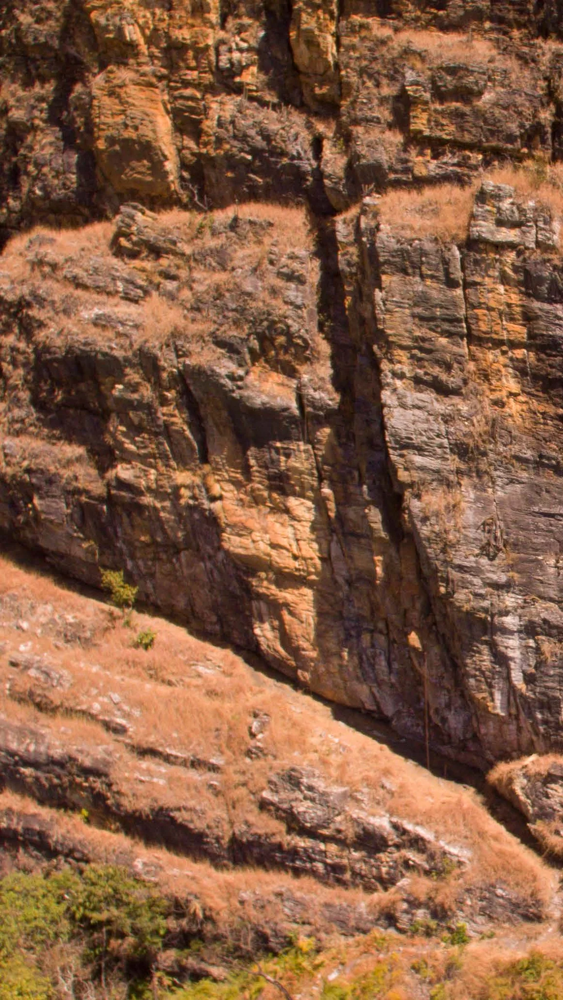 |
    | :--: |
    | *Setor Segundo Andar* |
    
    O Setor Segundo Andar oferece vias atléticas com nomes inspirados na cultura pop, variando de 6º a 9º grau.
    
    > [!TIP]
    > Leve seu lixo e outro que encontrar para a cidade. Não faça necessidades fisiológicas nas trilhas e base de vias. Avisar a administração sobre a abertura de novas vias de escalada. **USE CAPACETE NAS BASES DE VIAS DE ESCALADA.**
- **nome**: Segundo Andar
- **mapas**:
  - **[0]**:
    - **caminho_imagem_mapa**: 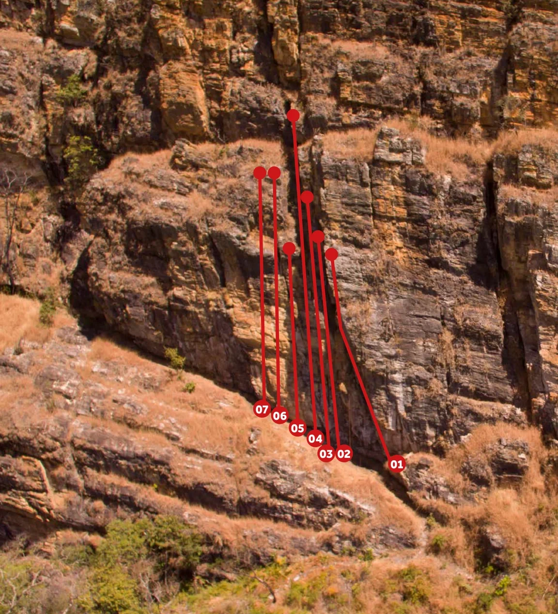
    - **largura_mapa**: 1152
    - **altura_mapa**: 1266
    - **pontos_de_interesse**:
      - **[0]**:
        - **id**: 01
        - **label**: 01
        - **box**:
          - **x**: 820
          - **y**: 958
          - **comprimento**: 33
          - **largura**: 25
      - **[1]**:
        - **id**: 02
        - **label**: 02
        - **box**:
          - **x**: 710
          - **y**: 934
          - **comprimento**: 25
          - **largura**: 18
      - **[2]**:
        - **id**: 03
        - **label**: 03
        - **box**:
          - **x**: 672
          - **y**: 936
          - **comprimento**: 25
          - **largura**: 21
      - **[3]**:
        - **id**: 04
        - **label**: 04
        - **box**:
          - **x**: 650
          - **y**: 905
          - **comprimento**: 27
          - **largura**: 22
      - **[4]**:
        - **id**: 05
        - **label**: 05
        - **box**:
          - **x**: 612
          - **y**: 882
          - **comprimento**: 25
          - **largura**: 19
      - **[5]**:
        - **id**: 06
        - **label**: 06
        - **box**:
          - **x**: 576
          - **y**: 856
          - **comprimento**: 27
          - **largura**: 19
      - **[6]**:
        - **id**: 07
        - **label**: 07
        - **box**:
          - **x**: 540
          - **y**: 843
          - **comprimento**: 24
          - **largura**: 20
    - **referencias**:
      - **[0]**:
        - **escalada**: Torrecitas
        - **ids**:
          - 01
      - **[1]**:
        - **escalada**: Mula Preta
        - **ids**:
          - 02
      - **[2]**:
        - **escalada**: Homem de Ferro
        - **ids**:
          - 03
      - **[3]**:
        - **escalada**: Paraíba Francês
        - **ids**:
          - 04
      - **[4]**:
        - **escalada**: Quaresmeira
        - **ids**:
          - 05
      - **[5]**:
        - **escalada**: 007 em... O Ataque das Andorinhas
        - **ids**:
          - 06
      - **[6]**:
        - **escalada**: Jogo Limpo
        - **ids**:
          - 07
      - **[7]**:
        - **escalada**: James Bond
        - **ids**:
          - 8
      - **[8]**:
        - **escalada**: Apolo o Doutrinador
        - **ids**:
          - 9
      - **[9]**:
        - **escalada**: Rock Balboa
        - **ids**:
          - 10
      - **[10]**:
        - **escalada**: Xodó da Bocaina
        - **ids**:
          - 11
  - **[1]**:
    - **caminho_imagem_mapa**: 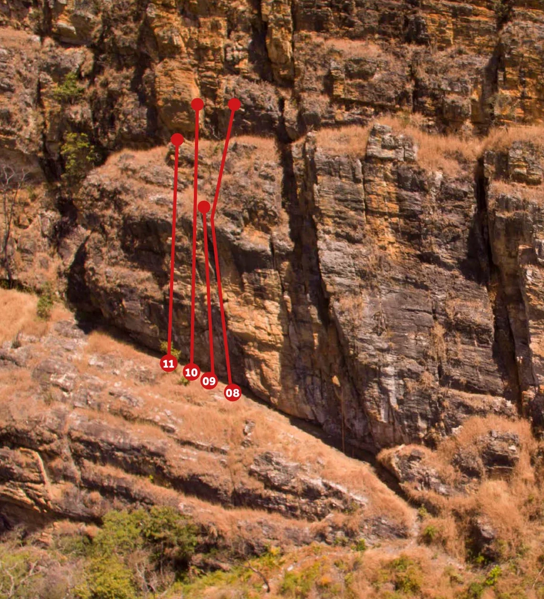
    - **largura_mapa**: 1140
    - **altura_mapa**: 1255
    - **pontos_de_interesse**:
      - **[0]**:
        - **id**: 08
        - **label**: 08
        - **box**:
          - **x**: 488
          - **y**: 822
          - **comprimento**: 29
          - **largura**: 23
      - **[1]**:
        - **id**: 09
        - **label**: 09
        - **box**:
          - **x**: 438
          - **y**: 797
          - **comprimento**: 26
          - **largura**: 20
      - **[2]**:
        - **id**: 10
        - **label**: 10
        - **box**:
          - **x**: 400
          - **y**: 778
          - **comprimento**: 26
          - **largura**: 19
      - **[3]**:
        - **id**: 11
        - **label**: 11
        - **box**:
          - **x**: 352
          - **y**: 760
          - **comprimento**: 25
          - **largura**: 23
- **escaladas**:
  - **[0]**:
    - **via_esportiva**:
      - **descricao**: Inacabada.
      - **nome**: Torrecitas
      - **dificuldade**: PROJETO
      - **extensao**: 30
      - **quantidade_protecoes_intermediarias**: 8
      - **conquistadores**:
        - Alexandre Fei
        - Gustavo Maneira
      - **data_abertura**: 2010
  - **[1]**:
    - **via_esportiva**:
      - **nome**: Mula Preta
      - **dificuldade**: BR_7C
      - **extensao**: 15
      - **quantidade_protecoes_intermediarias**: 6
      - **quantidade_protecoes_parada**: 2
      - **conquistadores**:
        - Alexandre Fei
        - Zac
      - **data_abertura**: 2017
  - **[2]**:
    - **via_esportiva**:
      - **nome**: Homem de Ferro
      - **dificuldade**: BR_8A
      - **extensao**: 17
      - **quantidade_protecoes_intermediarias**: 6
      - **quantidade_protecoes_parada**: 2
      - **conquistadores**:
        - Alexandre Fei
        - Gustavo Chorão
      - **data_abertura**: 2008
  - **[3]**:
    - **via_esportiva**:
      - **nome**: Paraíba Francês
      - **dificuldade**: BR_6
      - **extensao**: 25
      - **conquistadores**:
        - Alexandre Fei
        - Daiex de Almeida
      - **data_abertura**: 2017
  - **[4]**:
    - **via_esportiva**:
      - **nome**: Quaresmeira
      - **dificuldade**: BR_7A
      - **extensao**: 15
      - **quantidade_protecoes_intermediarias**: 6
      - **quantidade_protecoes_parada**: 2
      - **conquistadores**:
        - Daiex de Almeida
      - **data_abertura**: 2017
  - **[5]**:
    - **via_esportiva**:
      - **nome**: 007 em... O Ataque das Andorinhas
      - **dificuldade**: BR_7B
      - **extensao**: 20
      - **quantidade_protecoes_intermediarias**: 10
      - **quantidade_protecoes_parada**: 2
      - **conquistadores**:
        - Alexandre Fei
        - Gustavo Chorão
      - **data_abertura**: 2008
  - **[6]**:
    - **via_esportiva**:
      - **nome**: Jogo Limpo
      - **dificuldade**: PROJETO
      - **extensao**: 20
      - **quantidade_protecoes_intermediarias**: 10
      - **quantidade_protecoes_parada**: 2
      - **conquistadores**:
        - Alexandre Fei
        - Daiex de Almeida
      - **data_abertura**: 2017
  - **[7]**:
    - **via_esportiva**:
      - **nome**: James Bond
      - **dificuldade**: BR_8A
      - **extensao**: 23
      - **quantidade_protecoes_intermediarias**: 11
      - **quantidade_protecoes_parada**: 2
      - **conquistadores**:
        - Alexandre Fei
        - Gustavo Maneira
      - **data_abertura**: 2008
  - **[8]**:
    - **via_esportiva**:
      - **nome**: Apolo o Doutrinador
      - **dificuldade**: BR_7B
      - **extensao**: 15
      - **quantidade_protecoes_intermediarias**: 6
      - **quantidade_protecoes_parada**: 2
      - **conquistadores**:
        - Alexandre Fei
        - Gustavo Maneira
      - **data_abertura**: 2009
  - **[9]**:
    - **via_esportiva**:
      - **nome**: Rock Balboa
      - **dificuldade**: BR_9B
      - **extensao**: 20
      - **quantidade_protecoes_intermediarias**: 9
      - **quantidade_protecoes_parada**: 2
      - **conquistadores**:
        - Alexandre Fei
        - Gustavo Maneira
      - **data_abertura**: 2008
  - **[10]**:
    - **via_esportiva**:
      - **nome**: Xodó da Bocaina
      - **dificuldade**: BR_7A
      - **extensao**: 20
      - **quantidade_protecoes_intermediarias**: 7
      - **quantidade_protecoes_parada**: 2
      - **conquistadores**:
        - Alexandre Fei
      - **data_abertura**: 2017

## Parte: setor_pirados_de_rocha

### Setor (Pico: Bocaina Park)

- **descricao**:
    # Setor Pirados de Rocha
    
    | 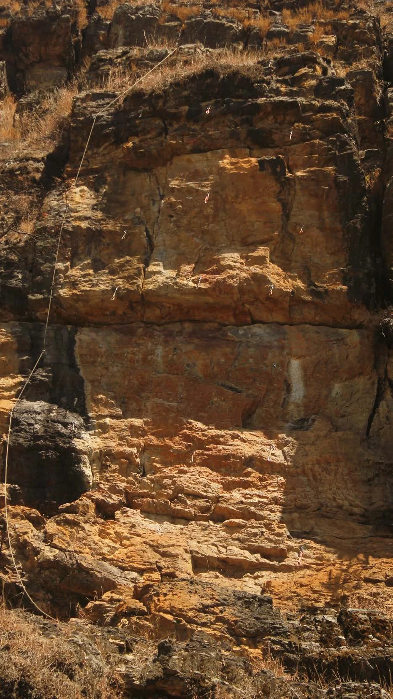 |
    | :--: |
    | *Setor Pirados de Rocha* |
    
    Setor com várias vias de projeto e nomes inspirados no cenário político brasileiro de 2017.
    
    > [!TIP]
    > Leve seu lixo e outro que encontrar para a cidade. Não faça necessidades fisiológicas nas trilhas e base de vias. Avisar a administração sobre a abertura de novas vias de escalada. **USE CAPACETE NAS BASES DE VIAS DE ESCALADA.**
- **nome**: Pirados de Rocha
- **mapas**:
  - **[0]**:
    - **caminho_imagem_mapa**: 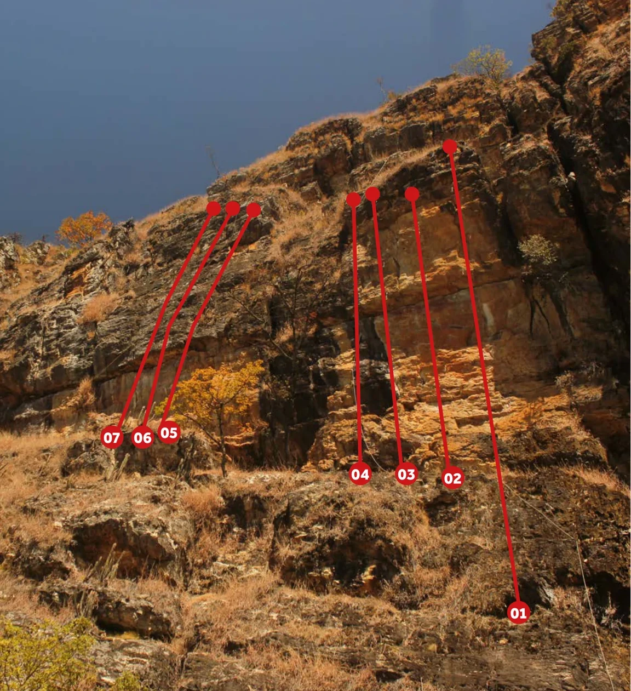
    - **largura_mapa**: 1152
    - **altura_mapa**: 1261
    - **pontos_de_interesse**:
      - **[0]**:
        - **id**: 01
        - **label**: 01
        - **box**:
          - **x**: 946
          - **y**: 1119
          - **comprimento**: 36
          - **largura**: 30
      - **[1]**:
        - **id**: 02
        - **label**: 02
        - **box**:
          - **x**: 826
          - **y**: 873
          - **comprimento**: 43
          - **largura**: 32
      - **[2]**:
        - **id**: 03
        - **label**: 03
        - **box**:
          - **x**: 738
          - **y**: 870
          - **comprimento**: 40
          - **largura**: 30
      - **[3]**:
        - **id**: 04
        - **label**: 04
        - **box**:
          - **x**: 658
          - **y**: 865
          - **comprimento**: 42
          - **largura**: 28
      - **[4]**:
        - **id**: 05
        - **label**: 05
        - **box**:
          - **x**: 308
          - **y**: 788
          - **comprimento**: 29
          - **largura**: 22
      - **[5]**:
        - **id**: 06
        - **label**: 06
        - **box**:
          - **x**: 260
          - **y**: 796
          - **comprimento**: 33
          - **largura**: 23
      - **[6]**:
        - **id**: 07
        - **label**: 07
        - **box**:
          - **x**: 204
          - **y**: 797
          - **comprimento**: 27
          - **largura**: 24
    - **referencias**:
      - **[0]**:
        - **escalada**: Uphill
        - **ids**:
          - 01
      - **[1]**:
        - **escalada**: Dilma Roussef
        - **ids**:
          - 02
      - **[2]**:
        - **escalada**: Renan Calheiros
        - **ids**:
          - 03
      - **[3]**:
        - **escalada**: Sérgio Moro
        - **ids**:
          - 04
      - **[4]**:
        - **escalada**: Pirados de Rocha
        - **ids**:
          - 05
      - **[5]**:
        - **escalada**: Qualidade de Vida
        - **ids**:
          - 06
      - **[6]**:
        - **escalada**: Lava Jato
        - **ids**:
          - 07
- **escaladas**:
  - **[0]**:
    - **via_esportiva**:
      - **nome**: Uphill
      - **dificuldade**: PROJETO
      - **extensao**: 20
      - **quantidade_protecoes_intermediarias**: 13
      - **quantidade_protecoes_parada**: 2
      - **conquistadores**:
        - Diego
        - Rafael Furtado
        - Vitu
      - **data_abertura**: 2017
  - **[1]**:
    - **via_esportiva**:
      - **nome**: Dilma Roussef
      - **dificuldade**: BR_8A
      - **extensao**: 12
      - **quantidade_protecoes_intermediarias**: 6
      - **quantidade_protecoes_parada**: 2
      - **conquistadores**:
        - Diego
        - Rafael Furtado
        - Vitu
      - **data_abertura**: 2017
  - **[2]**:
    - **via_esportiva**:
      - **nome**: Renan Calheiros
      - **dificuldade**: PROJETO
      - **extensao**: 12
      - **quantidade_protecoes_intermediarias**: 6
      - **quantidade_protecoes_parada**: 2
      - **conquistadores**:
        - Diego Leonardo
        - Rafael Furtado
      - **data_abertura**: 2017
  - **[3]**:
    - **via_esportiva**:
      - **nome**: Sérgio Moro
      - **dificuldade**: PROJETO
      - **extensao**: 12
      - **quantidade_protecoes_intermediarias**: 7
      - **quantidade_protecoes_parada**: 2
      - **conquistadores**:
        - Diego Leonardo
        - Rafael Furtado
      - **data_abertura**: 2017
  - **[4]**:
    - **via_esportiva**:
      - **nome**: Pirados de Rocha
      - **dificuldade**: PROJETO
      - **extensao**: 20
      - **quantidade_protecoes_intermediarias**: 7
      - **quantidade_protecoes_parada**: 2
      - **conquistadores**:
        - Juliano Peter Park
        - Bruno Graciano
      - **data_abertura**: 2017
  - **[5]**:
    - **via_esportiva**:
      - **nome**: Qualidade de Vida
      - **dificuldade**: INDEFINIDO
      - **extensao**: 20
      - **quantidade_protecoes_intermediarias**: 10
      - **quantidade_protecoes_parada**: 2
      - **conquistadores**:
        - Rafael
        - Diego
        - Vitu
      - **data_abertura**: 2017
  - **[6]**:
    - **via_esportiva**:
      - **nome**: Lava Jato
      - **dificuldade**: INDEFINIDO
      - **conquistadores**:
        - Rafael
        - Diego
        - Vitu
      - **data_abertura**: 2017

## Arquivos Externos

- **arquivos_externos**:
  - **[0]**:
    - **caminho**: 
    - **checksum_sha256**: 4f5f7d3bae9cc3664cc05ffb8607f3e9a03443ef1c4be19e48a22da9a4bd5431
  - **[1]**:
    - **caminho**: 
    - **checksum_sha256**: 3e130b8f9872135df443814b88e948a598e57aada38968cf620ebea486da1e9c
  - **[2]**:
    - **caminho**: 
    - **checksum_sha256**: 8a8b9d03de6315f8c65e77de11a29cafb8a174cd4dbd047fd4b9b2c7dec34d20
  - **[3]**:
    - **caminho**: 
    - **checksum_sha256**: 5fcb7043284dbec0d9e0648f3bf4ebec9263a2d5584a01f9cbd1dd5362f7d95e
  - **[4]**:
    - **caminho**: 
    - **checksum_sha256**: e247065083c2ad89002dc5427d86aaeba616ef6a6c824e555ba153b603ae9b1c
  - **[5]**:
    - **caminho**: 
    - **checksum_sha256**: 6a8e93e36b950fd6b960e38a0e0fc8ecf5d088512975c0eb960e8e68cae5e6af
  - **[6]**:
    - **caminho**: 
    - **checksum_sha256**: 2505acc210cddf1073fc00e783d27445b45693f9f1c53152d43ea554ba01250e
  - **[7]**:
    - **caminho**: 
    - **checksum_sha256**: 30f49c7173c7ea117534754daf5e8b4c68c6a0a9c00edbee3938624950ba3e81
  - **[8]**:
    - **caminho**: 
    - **checksum_sha256**: 87fe192c6c2a9b13aa1a1f5f8d51f7da30a8c536162fe563b1f9dad3f633995b
  - **[9]**:
    - **caminho**: 
    - **checksum_sha256**: 02f0c9cb3384f94d7e09bd69fe77cbcec6b4ea0e936deae5fdfad760d992dde8
  - **[10]**:
    - **caminho**: 
    - **checksum_sha256**: 60639836f514a5523c5df91d128ed77e6284fcdb16ec8d6cc1890b6fc572ef4f
  - **[11]**:
    - **caminho**: 
    - **checksum_sha256**: f1f06801996aee94356d97784d5b2b87115aa38d7984dd56ccafb6b152af4467
  - **[12]**:
    - **caminho**: 
    - **checksum_sha256**: f25a4d6cd9de39d6918cd03cd7bcbea4a298592003ce94eb6c4c14a2222537cc
  - **[13]**:
    - **caminho**: 
    - **checksum_sha256**: cd06d3b6d3bcd7ae20138a9d5bc4f1911794257a5e39bf27082ed87da5993e6a
  - **[14]**:
    - **caminho**: 
    - **checksum_sha256**: ec743b7bbbf4f96df9b410fa496dc82cfaf4ba369ad9c823af4e75902310b119
  - **[15]**:
    - **caminho**: 
    - **checksum_sha256**: 0f632e95e27521464902f5354cf97ff7d39ca81d2c824e8f47837220308a6853
  - **[16]**:
    - **caminho**: 
    - **checksum_sha256**: 8348ac962d69a6901d442771316eb879c6ce485eb731cbc6e91219e74aa75e4e
  - **[17]**:
    - **caminho**: 
    - **checksum_sha256**: c0631306936582cec58b34d2fee9eacae92d8c567a0c624d30766c4a7a5dfa63
  - **[18]**:
    - **caminho**: 
    - **checksum_sha256**: 9693896e80f2681f0e57963d053415ac2a04f9b7171cbbbf4c1cb9c68b785b8f
  - **[19]**:
    - **caminho**: 
    - **checksum_sha256**: d8c6b6c23366abed58090109f8c0414e2b013d57bbfdff04900fe2a50cce9999
  - **[20]**:
    - **caminho**: 
    - **checksum_sha256**: 13114a98627884f6505720dc3ed84787f035bac601ab185c07c4e155e303eb02
  - **[21]**:
    - **caminho**: 
    - **checksum_sha256**: 388a4978082a1266ca6552ecad367d9f7d09228aef4af1a47e5596e5e35ac6d8
  - **[22]**:
    - **caminho**: 
    - **checksum_sha256**: 04532c8f783364a99267ac78513406c9181da7fdcc244123fece89962241fffa
  - **[23]**:
    - **caminho**: 
    - **checksum_sha256**: e8f1745ac21f9fea43b9676b9b080007cdbb25a806ad0ce5342f8cf7182b2324
  - **[24]**:
    - **caminho**: 
    - **checksum_sha256**: e0ebdd88d475d28a648f5fa0538116ea41696c1262766ed7f4c302a25a8c3d7a
  - **[25]**:
    - **caminho**: 
    - **checksum_sha256**: a23efe066b8c994a5c704eb920ee79e7d17bc6c1b74c65bdba5d4b5f8e9f4321
  - **[26]**:
    - **caminho**: 
    - **checksum_sha256**: 451c1fe394d9980703e5bb175bb19f4ea9a3eb7d0e5fd5e3efad283c495ca930
  - **[27]**:
    - **caminho**: 
    - **checksum_sha256**: 4b9a914ec880623c16aadd2a209e00c15f6fb86dfe5292c49340752c7f199eae
  - **[28]**:
    - **caminho**: 
    - **checksum_sha256**: d2f5170d3266cacdc63afa8cedf6c1b58e1e36cd5b1a5e0c111ce315ed94b21d
  - **[29]**:
    - **caminho**: 
    - **checksum_sha256**: b3226cf31712c19ff8881d58c4ee80993a604a46c46cf67800ab861d906bb23f
  - **[30]**:
    - **caminho**: 
    - **checksum_sha256**: 525027b16e763de05d47a5a1d215a27fd0f3d47a49a6af88beb350db97257927
  - **[31]**:
    - **caminho**: 
    - **checksum_sha256**: 6f6a01b045eba8f248572b849027b215ab35404d2ecac705e9a8fa75c208a8f8
  - **[32]**:
    - **caminho**: 
    - **checksum_sha256**: 15db817a945539dcdcc2fed34cafc24094b01343027cda44b2681597b5628a25
  - **[33]**:
    - **caminho**: 
    - **checksum_sha256**: 759fa49b557fe14493693943da7f4bf158a25f0a95c2574ba48047e381bc8e47
  - **[34]**:
    - **caminho**: 
    - **checksum_sha256**: 1dca86ae3b5c231f158e43aa36fac5da250b9ef7202d908dcf8651893959a569
  - **[35]**:
    - **caminho**: 
    - **checksum_sha256**: 707a604a3e52c283beef73a0b05bc253ee4ecf4b394c1b110f9bd9935a50c9f7
  - **[36]**:
    - **caminho**: 
    - **checksum_sha256**: 6035b82a10d882bf194e197e46e2d1e4e4ae1a671457cef0bef4c8d829991e7b
  - **[37]**:
    - **caminho**: 
    - **checksum_sha256**: 689329d6d02242c6dd744faca80183c6a5e27c5e7d8e4bf28bdb16bbf8dc688b
  - **[38]**:
    - **caminho**: 
    - **checksum_sha256**: 81d51af31bc4832ca0c4e078d6f7e69d5a51a7263e11d76bf923490aa841b99b
  - **[39]**:
    - **caminho**: 
    - **checksum_sha256**: f13a65606d2b33573caa818e0f369c176077dc05016133ca2468d7c6776daac7
  - **[40]**:
    - **caminho**: 
    - **checksum_sha256**: 736401c0f6791b498a253511c61abac47f65a22d4dcfb306b981afff4b6f5e48
  - **[41]**:
    - **caminho**: 
    - **checksum_sha256**: 87282a740256c98b44fe041023c1f9ff1fe4b9208fcef6ee06b5ba9541635512
  - **[42]**:
    - **caminho**: 
    - **checksum_sha256**: 21152048d452c2d712d213e164f028518e1d76a62dbe44747f3735c45f51df1b
  - **[43]**:
    - **caminho**: 
    - **checksum_sha256**: 089de33c6a6df6072b17096d0980b4d3e6a80db59e5d1784034917462e4ff4a5
  - **[44]**:
    - **caminho**: 
    - **checksum_sha256**: 2c042b787052182296eb9976711f7af552f80bca24cd521b604d81fb7ac59070
  - **[45]**:
    - **caminho**: 
    - **checksum_sha256**: e126b0616b8271351421d2f6fef384fdd7d295b82b48859d76e3adcf7b9d51d8
  - **[46]**:
    - **caminho**: 
    - **checksum_sha256**: 5cf7ebe03e000fc28a09ab94a3252bf9db9604cc01704218167516ad05709738
  - **[47]**:
    - **caminho**: 
    - **checksum_sha256**: fe1ff9b10e90e68fdc600e8caa3cae0c9c4f6500de9e21f043dc9d76916e55e8
  - **[48]**:
    - **caminho**: 
    - **checksum_sha256**: fcd60bd2d6069ca7a12be0a25eac20735c16589ccc0cedce061a008c21c49458
  - **[49]**:
    - **caminho**: 
    - **checksum_sha256**: d6ee53ecc97b99b91ed389fff218bdb99827c88d7738b75f07b7ebe6220f1be7
  - **[50]**:
    - **caminho**: 
    - **checksum_sha256**: 51f278ae2da3e0f303dff9c84f83c5353b41bad9ed8c94f65c1aad91c8019292
  - **[51]**:
    - **caminho**: 
    - **checksum_sha256**: 01da080a74a529c5a9762d133445638057a42dd132f54b6a1697f8b0a9d16bcd
  - **[52]**:
    - **caminho**: 
    - **checksum_sha256**: 6ce803349efdd30a66197d1df7708db771896be7af6a2055fa28379a2d24e041
  - **[53]**:
    - **caminho**: 
    - **checksum_sha256**: 6d5268b36e7afc9408221905c8f0461e66bbdc0edc26ef16a3639ebc3390cece
  - **[54]**:
    - **caminho**: 
    - **checksum_sha256**: 4590c563354c7a86049975facea04d4e58d52195125ba21d29da0de960ebdb26
  - **[55]**:
    - **caminho**: 
    - **checksum_sha256**: 3381feb9c5a9907f36b2566e84b7add85c17a6deb4b14bb077c299ba5cd7dd6e
  - **[56]**:
    - **caminho**: 
    - **checksum_sha256**: db63ae13273a6a5ae8976a3a9cba6e9825a4a35537d7975e42aacc375be50c55
  - **[57]**:
    - **caminho**: 
    - **checksum_sha256**: 44237e143c6c290bf2fbccba3c2d8cda71a251b220adfcccab68d68031ea29a9
  - **[58]**:
    - **caminho**: 
    - **checksum_sha256**: 38f2a4c4b970a558020fe0df40b3ed99e4fd1afc8b1586ab73732b4eb767d449
  - **[59]**:
    - **caminho**: 
    - **checksum_sha256**: 9e4a5b3671776cc7d8c9813b3ad170293f0564c157026337b0a64607d0801f2a
  - **[60]**:
    - **caminho**: 
    - **checksum_sha256**: 1d20f31c0102ec7f80dcc1ae7a1a1e31e7d1131a957a6a6b8afc66ba8b5c7ea1
  - **[61]**:
    - **caminho**: 
    - **checksum_sha256**: 15e17350b3d1b519eb2b5c8d05220843d35c449599cb2a2bbd8104d240d2505e
  - **[62]**:
    - **caminho**: 
    - **checksum_sha256**: 145cd518742e1164014bd7a3e564b25cd7596f318142f331dffa04944fde1d54
  - **[63]**:
    - **caminho**: 
    - **checksum_sha256**: 8fad307d25a31b31c4cdf2b91411d7640a5e42c428d9adcd844d7aa732c8bc21
  - **[64]**:
    - **caminho**: 
    - **checksum_sha256**: 179b635c8bcd811edaa32ae6d1adb9f2773231537704bdca908afa69d71c4dc6

