# Croqui: Bocaina Park (Esportivas)

## Informações Gerais

- **descricao**:
    O Bocaina Park, localizado em Araxá - MG, é um dos principais polos de escalada esportiva da região. 
    Este croqui cobre as 220 vias do parque, distribuídas em diversos setores com graduações que vão do 4º ao 10º grau.
    
- **id**: br_mg_araxa_bocaina_esportivas
- **nome**: Bocaina Park (Esportivas)
- **uid**: Ygo9aN5g9LtcLo
- **caminho_thumbnail**: 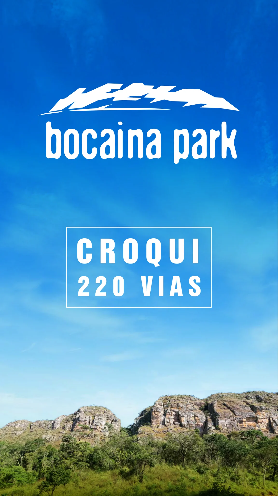
- **revisado_manualmente**: True
- **status_desenho_extraivel**: DESENHO_EXTRAIDO
- **botoes**:
  - **[0]**:
    - **uid**: TzqLEGnLqIP0fd
    - **texto**: Capa
    - **destino**:
      - **secao_textual**:
        - **conteudo**:
            # Bocaina Park - Araxá, MG
            
            |  |
            | :--: |
            | *Capa* |
            
            ## Croqui 220 Vias
- **ultima_migracao**: 5
- **publicar_croqui**: True
- **revisado_bounding_circle**: True

## Parte: setor_highlines

### Setor (Pico: Bocaina Park)

- **descricao**: # Highlines - Bocaina Park
- **nome**: Highlines - Bocaina Park
- **uid**: qSQoG5K7dOGfrN
- **mapas**:
  - **[0]**:
    - **caminho_imagem_mapa**: 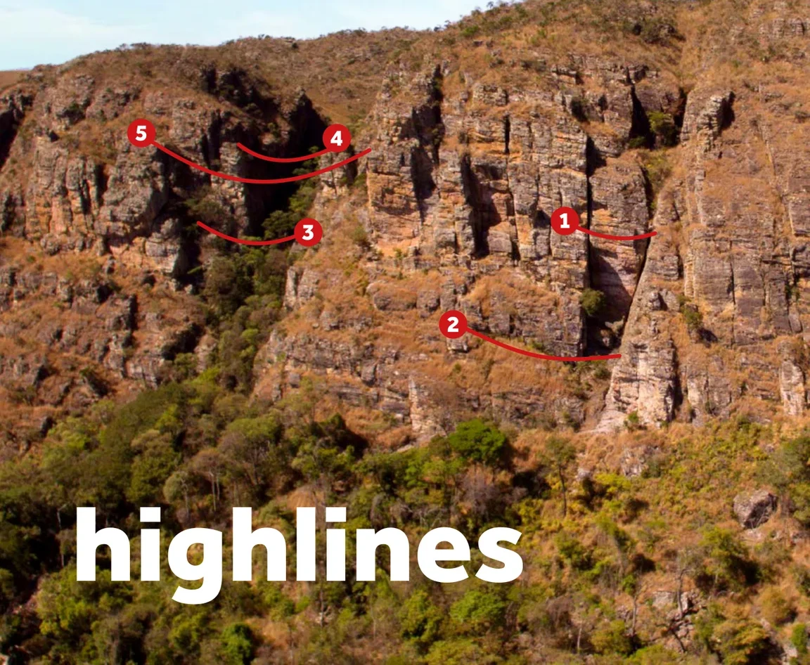
    - **largura_mapa**: 1152
    - **altura_mapa**: 946
    - **pontos_de_interesse**:
      - **[0]**:
        - **id**: xf7ye0AEXOOAhI
        - **uid**: xf7ye0AEXOOAhI
        - **rotulo**: 01
        - **circulo**:
          - **x**: 803
          - **y**: 314
          - **raio**: 21
        - **label**: 01
      - **[1]**:
        - **id**: D5tssQyDLu2Uv8
        - **uid**: D5tssQyDLu2Uv8
        - **rotulo**: 02
        - **circulo**:
          - **x**: 644
          - **y**: 461
          - **raio**: 21
        - **label**: 02
      - **[2]**:
        - **id**: ubSGuCsUJfGODf
        - **uid**: ubSGuCsUJfGODf
        - **rotulo**: 03
        - **circulo**:
          - **x**: 438
          - **y**: 331
          - **raio**: 21
        - **label**: 03
      - **[3]**:
        - **id**: BcVF8z9GRCrIsP
        - **uid**: BcVF8z9GRCrIsP
        - **rotulo**: 04
        - **circulo**:
          - **x**: 479
          - **y**: 198
          - **raio**: 21
        - **label**: 04
      - **[4]**:
        - **id**: mu6L92XvGS7QBE
        - **uid**: mu6L92XvGS7QBE
        - **rotulo**: 05
        - **circulo**:
          - **x**: 200
          - **y**: 188
          - **raio**: 21
        - **label**: 05
    - **referencias**:
      - **[0]**:
        - **alvo_uid**: z5LNYx5jCRLmMC
        - **pontos_uids**:
          - xf7ye0AEXOOAhI
        - **escalada**: Trickline
        - **ids**:
          - xf7ye0AEXOOAhI
      - **[1]**:
        - **alvo_uid**: CqE03sWWsdDoWr
        - **pontos_uids**:
          - D5tssQyDLu2Uv8
        - **escalada**: Arquibancada
        - **ids**:
          - D5tssQyDLu2Uv8
      - **[2]**:
        - **alvo_uid**: Urc67LvE0zKUUa
        - **pontos_uids**:
          - ubSGuCsUJfGODf
        - **escalada**: O melhor está por vir
        - **ids**:
          - ubSGuCsUJfGODf
      - **[3]**:
        - **alvo_uid**: 3CTP6QwsRy0Z1w
        - **pontos_uids**:
          - BcVF8z9GRCrIsP
        - **escalada**: Figura Pública
        - **ids**:
          - BcVF8z9GRCrIsP
      - **[4]**:
        - **alvo_uid**: QIcKYtvvcXMGdq
        - **pontos_uids**:
          - mu6L92XvGS7QBE
        - **escalada**: Visão além do alcance
        - **ids**:
          - mu6L92XvGS7QBE
- **escaladas**:
  - **[0]**:
    - **uid**: z5LNYx5jCRLmMC
    - **highline**:
      - **nome**: Trickline
      - **distancia**: 17
      - **altura**: 20
      - **exposicao**: 180
      - **conquistadores**:
        - Caio Afeto
        - Gustavo Fontes
        - Bruno Miguéis
      - **data_abertura**: 2013
      - **descricao_acesso**: Lado móvel: Setor dos Paulistas, atrás do totem da via Decadentes. Lado estático: topo da via Puberdade no setor mezanino.
      - **descricao_ancoragem**: Lado estático, duas chapeletas com backup no top da via de escalada. Lado móvel 3 chapeletas, longes uma da outra, corda para ancoragem grande e muita proteção abrasão.
  - **[1]**:
    - **uid**: CqE03sWWsdDoWr
    - **highline**:
      - **nome**: Arquibancada
      - **distancia**: 39
      - **altura**: 15
      - **exposicao**: 150
      - **conquistadores**:
        - Reginaldo Gomes
        - Diego Leonardo
      - **data_abertura**: 2017
      - **descricao_acesso**: Lado estático: Trilha setor Aeroshane em cima da via Shana Crazy. Lado móvel: Totem na trilha para terceiro andar no inicio da subida para o setor Paulistas.
      - **descricao_ancoragem**: Lado estático e lado móvel 3 chapeletas cada.
  - **[2]**:
    - **uid**: Urc67LvE0zKUUa
    - **highline**:
      - **nome**: O melhor está por vir
      - **distancia**: 27
      - **altura**: 50
      - **exposicao**: 200
      - **conquistadores**:
        - Caio Afeto
        - Gustavo Fontes
        - Bruno Miguéis
      - **data_abertura**: 2013
      - **descricao_acesso**: Lado estático: Escalar a via mulheres ao poder na garganta e após o top da via, derivar para a direita. Lado móvel: Passar pelo terceiro Andar e continuar subindo até nivelar com o top da via mulheres ao poder.
      - **descricao_ancoragem**: Lado estático: 3 chapeletas. Lado móvel: 4 chapeletas distantes uma da outra, levar bastante proteção de abrasão.
  - **[3]**:
    - **uid**: 3CTP6QwsRy0Z1w
    - **highline**:
      - **nome**: Figura Pública
      - **distancia**: 75
      - **altura**: 70
      - **exposicao**: 200
      - **conquistadores**:
        - Reginaldo Gomes
        - Diego Leonardo
        - Thiago Vasconcelos
      - **data_abertura**: 2017
      - **descricao_acesso**: Lado estático: Escalar a via De Mão Beijada ate o cume, derivando para a direita após o top. Lado móvel: caminhar no interior da Garganta ate o final da erosão fluvial, depois virar completamente à esquerda no morro da trilha de moto, abandonando a trilha até alcançar o topo das vias de escalada e conseguir visualizar as chapeletas no alinhamento da outra ancoragem.
      - **descricao_ancoragem**: Lado estático e móvel, 3 chapeletas cada, necessitando bastante proteção de abrasão.
  - **[4]**:
    - **uid**: QIcKYtvvcXMGdq
    - **highline**:
      - **nome**: Visão além do alcance
      - **distancia**: 45
      - **altura**: 50
      - **conquistadores**:
        - Caio Afeto
        - Gustavo Fontes
        - Bruno Miguéis
      - **data_abertura**: 2013
      - **descricao_acesso**: Lado estático: passar pela entrada da garganta e no início do setor ensolarado começar uma escalaminhada em direção às ancoragens. Lado móvel: Terceiro Andar ao chegar na base da via efeito colateral, derivar completamente à esquerda em direção às ancoragens.
      - **descricao_ancoragem**: Lado estático: 4 chapeletas Lado móvel: 3 chapeletas.
- **precomputados**:
  - **total_escaladas**: 5
  - **total_highlines**: 5

## Parte: setor_ensolarado

### Setor (Pico: Bocaina Park)

- **descricao**:
    # Setor Ensolarado
    
    O Setor Ensolarado é um dos setores iniciais do Bocaina Park, caracterizado por vias de graduação variada, do 5º ao 9b.
    
    > [!TIP]
    > Leve seu lixo e outro que encontrar para a cidade. Não faça necessidades fisiológicas nas trilhas e base de vias. Avisar a administração sobre a abertura de novas vias de escalada. **USE CAPACETE NAS BASES DE VIAS DE ESCALADA.**
- **nome**: Ensolarado
- **uid**: yct6sz1JSOdJNh
- **caminho_imagem_capa**: 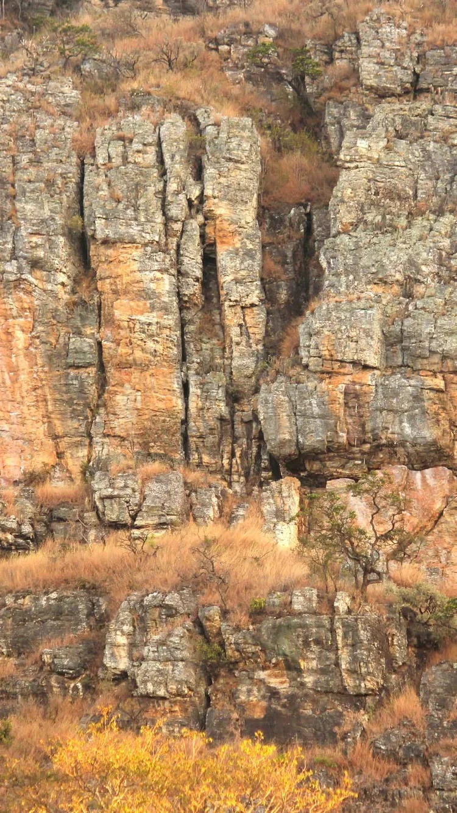
- **mapas**:
  - **[0]**:
    - **caminho_imagem_mapa**: 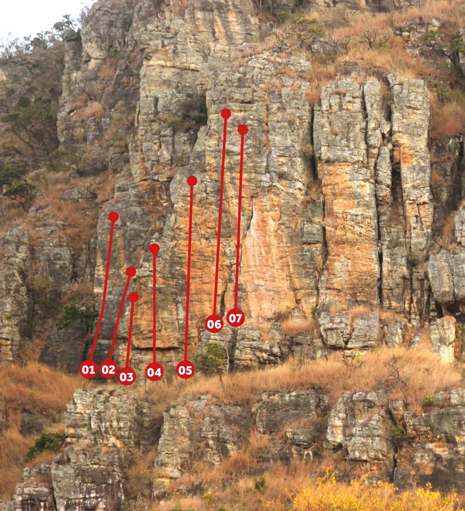
    - **largura_mapa**: 1152
    - **altura_mapa**: 1264
    - **pontos_de_interesse**:
      - **[0]**:
        - **id**: OdHP2xjGnE6wPV
        - **uid**: OdHP2xjGnE6wPV
        - **rotulo**: 01
        - **circulo**:
          - **x**: 219
          - **y**: 914
          - **raio**: 23
        - **label**: 01
      - **[1]**:
        - **id**: phxam2BROIoKzL
        - **uid**: phxam2BROIoKzL
        - **rotulo**: 02
        - **circulo**:
          - **x**: 269
          - **y**: 913
          - **raio**: 23
        - **label**: 02
      - **[2]**:
        - **id**: v1mrluCkDb3aQ7
        - **uid**: v1mrluCkDb3aQ7
        - **rotulo**: 03
        - **circulo**:
          - **x**: 314
          - **y**: 931
          - **raio**: 23
        - **label**: 03
      - **[3]**:
        - **id**: XBPLekeYYCfTem
        - **uid**: XBPLekeYYCfTem
        - **rotulo**: 04
        - **circulo**:
          - **x**: 382
          - **y**: 920
          - **raio**: 23
        - **label**: 04
      - **[4]**:
        - **id**: zyiwqXC5Q40XYf
        - **uid**: zyiwqXC5Q40XYf
        - **rotulo**: 05
        - **circulo**:
          - **x**: 459
          - **y**: 914
          - **raio**: 24
        - **label**: 05
      - **[5]**:
        - **id**: ExLJBNwbFvuw6b
        - **uid**: ExLJBNwbFvuw6b
        - **rotulo**: 06
        - **circulo**:
          - **x**: 531
          - **y**: 800
          - **raio**: 23
        - **label**: 06
      - **[6]**:
        - **id**: Y9OBNRuCmmINk6
        - **uid**: Y9OBNRuCmmINk6
        - **rotulo**: 07
        - **circulo**:
          - **x**: 584
          - **y**: 786
          - **raio**: 24
        - **label**: 07
    - **referencias**:
      - **[0]**:
        - **alvo_uid**: HGWtnLyLht3KbQ
        - **pontos_uids**:
          - OdHP2xjGnE6wPV
        - **escalada**: Índios
        - **ids**:
          - OdHP2xjGnE6wPV
      - **[1]**:
        - **alvo_uid**: qUXHJPqJaKfQZw
        - **pontos_uids**:
          - phxam2BROIoKzL
        - **escalada**: Virando a Esquina
        - **ids**:
          - phxam2BROIoKzL
      - **[2]**:
        - **alvo_uid**: bxtat1Udlp39GA
        - **pontos_uids**:
          - v1mrluCkDb3aQ7
        - **escalada**: Feinomenal
        - **ids**:
          - v1mrluCkDb3aQ7
      - **[3]**:
        - **alvo_uid**: eY01sFDFiq6xak
        - **pontos_uids**:
          - XBPLekeYYCfTem
        - **escalada**: Mirandinha fFlou
        - **ids**:
          - XBPLekeYYCfTem
      - **[4]**:
        - **alvo_uid**: aTVauEM6xDvs5g
        - **pontos_uids**:
          - zyiwqXC5Q40XYf
        - **escalada**: Quatro e Vinte
        - **ids**:
          - zyiwqXC5Q40XYf
      - **[5]**:
        - **alvo_uid**: l0jexMQ2GVX76H
        - **pontos_uids**:
          - ExLJBNwbFvuw6b
        - **escalada**: Yngyang
        - **ids**:
          - ExLJBNwbFvuw6b
      - **[6]**:
        - **alvo_uid**: JYkRW0Cc8Gfqxj
        - **pontos_uids**:
          - Y9OBNRuCmmINk6
        - **escalada**: Sucuri
        - **ids**:
          - Y9OBNRuCmmINk6
  - **[1]**:
    - **caminho_imagem_mapa**: 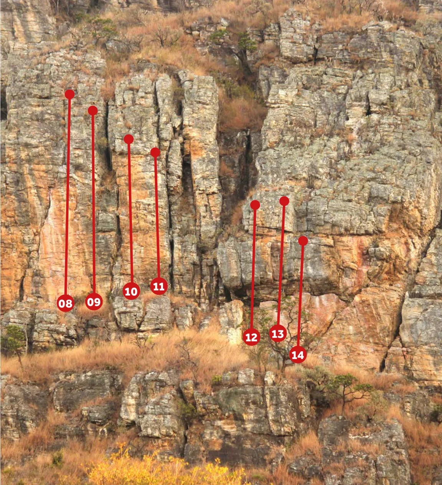
    - **largura_mapa**: 1152
    - **altura_mapa**: 1267
    - **pontos_de_interesse**:
      - **[0]**:
        - **id**: OIOKU6vPgVnAOl
        - **uid**: OIOKU6vPgVnAOl
        - **rotulo**: 08
        - **circulo**:
          - **x**: 171
          - **y**: 793
          - **raio**: 23
        - **label**: 08
      - **[1]**:
        - **id**: juduvWR6Jt50o9
        - **uid**: juduvWR6Jt50o9
        - **rotulo**: 09
        - **circulo**:
          - **x**: 245
          - **y**: 788
          - **raio**: 23
        - **label**: 09
      - **[2]**:
        - **id**: KDEXErkVBzadtE
        - **uid**: KDEXErkVBzadtE
        - **rotulo**: 10
        - **circulo**:
          - **x**: 343
          - **y**: 761
          - **raio**: 23
        - **label**: 10
      - **[3]**:
        - **id**: BvTF6ZpkAakOFl
        - **uid**: BvTF6ZpkAakOFl
        - **rotulo**: 11
        - **circulo**:
          - **x**: 414
          - **y**: 748
          - **raio**: 24
        - **label**: 11
      - **[4]**:
        - **id**: LDetB3GBTxxBKV
        - **uid**: LDetB3GBTxxBKV
        - **rotulo**: 12
        - **circulo**:
          - **x**: 656
          - **y**: 881
          - **raio**: 23
        - **label**: 12
      - **[5]**:
        - **id**: hmqSfIkyLMKoRE
        - **uid**: hmqSfIkyLMKoRE
        - **rotulo**: 13
        - **circulo**:
          - **x**: 724
          - **y**: 871
          - **raio**: 23
        - **label**: 13
      - **[6]**:
        - **id**: ENWZPOOluQrJXU
        - **uid**: ENWZPOOluQrJXU
        - **rotulo**: 14
        - **circulo**:
          - **x**: 777
          - **y**: 926
          - **raio**: 23
        - **label**: 14
    - **referencias**:
      - **[0]**:
        - **alvo_uid**: IAK1aBk8ZqPygN
        - **pontos_uids**:
          - KDEXErkVBzadtE
        - **escalada**: Família Martins
        - **ids**:
          - KDEXErkVBzadtE
      - **[1]**:
        - **alvo_uid**: ojXDmDH4lIyu5m
        - **pontos_uids**:
          - BvTF6ZpkAakOFl
        - **escalada**: Zuzuquinha Mimada
        - **ids**:
          - BvTF6ZpkAakOFl
      - **[2]**:
        - **alvo_uid**: XouQhAkM1nLCXa
        - **pontos_uids**:
          - LDetB3GBTxxBKV
        - **escalada**: De volta as Origens
        - **ids**:
          - LDetB3GBTxxBKV
      - **[3]**:
        - **alvo_uid**: maS7Rm09eKBd7I
        - **pontos_uids**:
          - hmqSfIkyLMKoRE
        - **escalada**: Autista do Bando
        - **ids**:
          - hmqSfIkyLMKoRE
      - **[4]**:
        - **alvo_uid**: F59fHqfUNyR1os
        - **pontos_uids**:
          - ENWZPOOluQrJXU
        - **escalada**: Último Suspiro
        - **ids**:
          - ENWZPOOluQrJXU
      - **[5]**:
        - **alvo_uid**: odqJSRMlFytS5l
        - **pontos_uids**:
          - OIOKU6vPgVnAOl
        - **escalada**: Mundo Mágico dos Abacates
        - **ids**:
          - OIOKU6vPgVnAOl
      - **[6]**:
        - **alvo_uid**: QzmvuNyLhZPuSI
        - **pontos_uids**:
          - juduvWR6Jt50o9
        - **escalada**: Ariba Cabron
        - **ids**:
          - juduvWR6Jt50o9
  - **[2]**:
    - **caminho_imagem_mapa**: 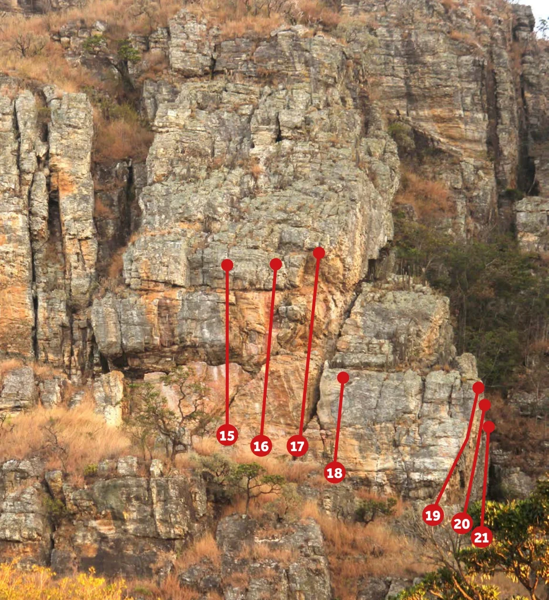
    - **largura_mapa**: 1152
    - **altura_mapa**: 1258
    - **pontos_de_interesse**:
      - **[0]**:
        - **id**: 0oZel6NpfOGh5R
        - **uid**: 0oZel6NpfOGh5R
        - **rotulo**: 15
        - **circulo**:
          - **x**: 477
          - **y**: 912
          - **raio**: 23
        - **label**: 15
      - **[1]**:
        - **id**: qNDB2s8nYdLDs5
        - **uid**: qNDB2s8nYdLDs5
        - **rotulo**: 16
        - **circulo**:
          - **x**: 548
          - **y**: 935
          - **raio**: 23
        - **label**: 16
      - **[2]**:
        - **id**: fVz98Nfwbn28cs
        - **uid**: fVz98Nfwbn28cs
        - **rotulo**: 17
        - **circulo**:
          - **x**: 624
          - **y**: 934
          - **raio**: 23
        - **label**: 17
      - **[3]**:
        - **id**: zHjL6dmj8az4BP
        - **uid**: zHjL6dmj8az4BP
        - **rotulo**: 18
        - **circulo**:
          - **x**: 703
          - **y**: 991
          - **raio**: 23
        - **label**: 18
      - **[4]**:
        - **id**: DT57854Vw1iOxl
        - **uid**: DT57854Vw1iOxl
        - **rotulo**: 19
        - **circulo**:
          - **x**: 909
          - **y**: 1080
          - **raio**: 23
        - **label**: 19
      - **[5]**:
        - **id**: xHuCfmzEm9sfom
        - **uid**: xHuCfmzEm9sfom
        - **rotulo**: 20
        - **circulo**:
          - **x**: 970
          - **y**: 1097
          - **raio**: 23
        - **label**: 20
      - **[6]**:
        - **id**: AgrFFuyXMOIMiM
        - **uid**: AgrFFuyXMOIMiM
        - **rotulo**: 21
        - **circulo**:
          - **x**: 1011
          - **y**: 1126
          - **raio**: 23
        - **label**: 21
    - **referencias**:
      - **[0]**:
        - **alvo_uid**: ktZ5fnnC0kpNJM
        - **pontos_uids**:
          - 0oZel6NpfOGh5R
        - **escalada**: Barba Negra
        - **ids**:
          - 0oZel6NpfOGh5R
      - **[1]**:
        - **alvo_uid**: BNGBXrcRrk6pHG
        - **pontos_uids**:
          - qNDB2s8nYdLDs5
        - **escalada**: Capitão Gancho
        - **ids**:
          - qNDB2s8nYdLDs5
      - **[2]**:
        - **alvo_uid**: xWTHEo97dfcpR3
        - **pontos_uids**:
          - fVz98Nfwbn28cs
        - **escalada**: Peter Pan do Cerrado
        - **ids**:
          - fVz98Nfwbn28cs
      - **[3]**:
        - **alvo_uid**: Lc65yFsxm4hZD5
        - **pontos_uids**:
          - zHjL6dmj8az4BP
        - **escalada**: Indio Rastafari
        - **ids**:
          - zHjL6dmj8az4BP
      - **[4]**:
        - **alvo_uid**: iX5of2hnmiKcua
        - **pontos_uids**:
          - DT57854Vw1iOxl
        - **escalada**: Todo Cuidado e Pouco
        - **ids**:
          - DT57854Vw1iOxl
      - **[5]**:
        - **alvo_uid**: TiBHVpJkVJqxfx
        - **pontos_uids**:
          - xHuCfmzEm9sfom
        - **escalada**: Raul com Certeza
        - **ids**:
          - xHuCfmzEm9sfom
      - **[6]**:
        - **alvo_uid**: mpcMR2qBgMORqZ
        - **pontos_uids**:
          - AgrFFuyXMOIMiM
        - **escalada**: Raimundo Nonato
        - **ids**:
          - AgrFFuyXMOIMiM
  - **[3]**:
    - **caminho_imagem_mapa**: 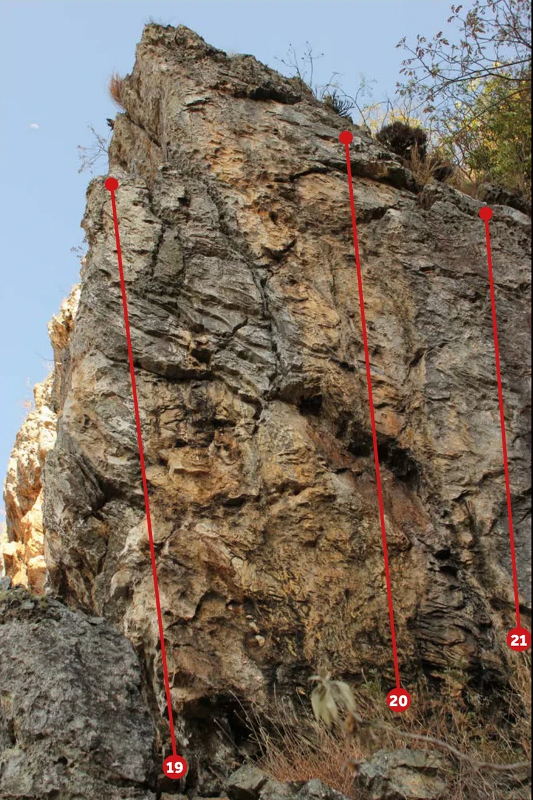
    - **largura_mapa**: 852
    - **altura_mapa**: 1278
    - **pontos_de_interesse**:
      - **[0]**:
        - **id**: OYYmmEE85dnVjn
        - **uid**: OYYmmEE85dnVjn
        - **rotulo**: 19
        - **circulo**:
          - **x**: 280
          - **y**: 1226
          - **raio**: 20
        - **label**: 19
      - **[1]**:
        - **id**: cZ7Lqnk8NpiLm8
        - **uid**: cZ7Lqnk8NpiLm8
        - **rotulo**: 20
        - **circulo**:
          - **x**: 637
          - **y**: 1119
          - **raio**: 20
        - **label**: 20
      - **[2]**:
        - **id**: aDObPIePw1bJYU
        - **uid**: aDObPIePw1bJYU
        - **rotulo**: 21
        - **circulo**:
          - **x**: 829
          - **y**: 1022
          - **raio**: 20
        - **label**: 21
    - **referencias**:
      - **[0]**:
        - **alvo_uid**: iX5of2hnmiKcua
        - **pontos_uids**:
          - OYYmmEE85dnVjn
        - **escalada**: Todo Cuidado e Pouco
        - **ids**:
          - OYYmmEE85dnVjn
      - **[1]**:
        - **alvo_uid**: TiBHVpJkVJqxfx
        - **pontos_uids**:
          - cZ7Lqnk8NpiLm8
        - **escalada**: Raul com Certeza
        - **ids**:
          - cZ7Lqnk8NpiLm8
      - **[2]**:
        - **alvo_uid**: mpcMR2qBgMORqZ
        - **pontos_uids**:
          - aDObPIePw1bJYU
        - **escalada**: Raimundo Nonato
        - **ids**:
          - aDObPIePw1bJYU
- **escaladas**:
  - **[0]**:
    - **uid**: HGWtnLyLht3KbQ
    - **via_esportiva**:
      - **nome**: Índios
      - **dificuldade**: BR_7B
      - **extensao**: 20
      - **quantidade_protecoes_intermediarias**: 7
      - **quantidade_protecoes_parada**: 2
      - **conquistadores**:
        - Felipe Tavares
      - **data_abertura**: 2016
  - **[1]**:
    - **uid**: qUXHJPqJaKfQZw
    - **via_esportiva**:
      - **nome**: Virando a Esquina
      - **dificuldade**: BR_5
      - **extensao**: 8
      - **quantidade_protecoes_intermediarias**: 4
      - **quantidade_protecoes_parada**: 2
      - **conquistadores**:
        - Diego Leonardo
      - **data_abertura**: 2014
  - **[2]**:
    - **uid**: bxtat1Udlp39GA
    - **via_esportiva**:
      - **nome**: Feinomenal
      - **dificuldade**: BR_7A
      - **extensao**: 10
      - **quantidade_protecoes_intermediarias**: 4
      - **quantidade_protecoes_parada**: 2
      - **conquistadores**:
        - Fei
        - Luca Potilho
      - **data_abertura**: 2016
  - **[3]**:
    - **uid**: eY01sFDFiq6xak
    - **via_esportiva**:
      - **nome**: Mirandinha fFlou
      - **dificuldade**: BR_7A
      - **extensao**: 12
      - **quantidade_protecoes_intermediarias**: 6
      - **quantidade_protecoes_parada**: 2
      - **conquistadores**:
        - Rafael Furtado
        - Diego Leonardo
      - **data_abertura**: 2016
  - **[4]**:
    - **uid**: aTVauEM6xDvs5g
    - **via_esportiva**:
      - **nome**: Quatro e Vinte
      - **dificuldade**: BR_6SUP
      - **extensao**: 20
      - **quantidade_protecoes_intermediarias**: 6
      - **quantidade_protecoes_parada**: 2
      - **conquistadores**:
        - Diego Leonardo
      - **data_abertura**: 2013
  - **[5]**:
    - **uid**: l0jexMQ2GVX76H
    - **via_esportiva**:
      - **nome**: Yngyang
      - **dificuldade**: BR_6SUP
      - **extensao**: 20
      - **quantidade_protecoes_intermediarias**: 7
      - **quantidade_protecoes_parada**: 2
      - **conquistadores**:
        - Diego Leonardo
      - **data_abertura**: 2013
  - **[6]**:
    - **uid**: JYkRW0Cc8Gfqxj
    - **via_esportiva**:
      - **nome**: Sucuri
      - **dificuldade**: BR_7C
      - **extensao**: 15
      - **quantidade_protecoes_intermediarias**: 6
      - **quantidade_protecoes_parada**: 2
      - **conquistadores**:
        - Felipe Tavares
        - Felipe Alves
      - **data_abertura**: 2017
  - **[7]**:
    - **uid**: odqJSRMlFytS5l
    - **via_esportiva**:
      - **nome**: Mundo Mágico dos Abacates
      - **dificuldade**: BR_7B
      - **extensao**: 15
      - **quantidade_protecoes_intermediarias**: 6
      - **quantidade_protecoes_parada**: 2
      - **conquistadores**:
        - Lucas B. Marques
        - Diego Leonardo
      - **data_abertura**: 2013
  - **[8]**:
    - **uid**: QzmvuNyLhZPuSI
    - **via_esportiva**:
      - **nome**: Ariba Cabron
      - **dificuldade**: BR_7A
      - **extensao**: 15
      - **quantidade_protecoes_intermediarias**: 6
      - **quantidade_protecoes_parada**: 2
      - **conquistadores**:
        - Diego Leonardo
        - Rafael Furtado
      - **data_abertura**: 2013
  - **[9]**:
    - **uid**: IAK1aBk8ZqPygN
    - **via_esportiva**:
      - **nome**: Família Martins
      - **dificuldade**: BR_6SUP
      - **extensao**: 10
      - **quantidade_protecoes_intermediarias**: 6
      - **quantidade_protecoes_parada**: 2
      - **conquistadores**:
        - Diego Leonardo
      - **data_abertura**: 2014
  - **[10]**:
    - **uid**: ojXDmDH4lIyu5m
    - **via_esportiva**:
      - **nome**: Zuzuquinha Mimada
      - **dificuldade**: BR_6
      - **extensao**: 10
      - **quantidade_protecoes_intermediarias**: 6
      - **quantidade_protecoes_parada**: 2
      - **conquistadores**:
        - Mateus Martins
        - Arhtur Martins
      - **data_abertura**: 2014
  - **[11]**:
    - **uid**: XouQhAkM1nLCXa
    - **via_esportiva**:
      - **nome**: De volta as Origens
      - **dificuldade**: BR_7B
      - **extensao**: 15
      - **quantidade_protecoes_intermediarias**: 4
      - **quantidade_protecoes_parada**: 2
      - **conquistadores**:
        - Rafael Furtado
        - Diego Leonardo
      - **data_abertura**: 2013
  - **[12]**:
    - **uid**: maS7Rm09eKBd7I
    - **via_esportiva**:
      - **nome**: Autista do Bando
      - **dificuldade**: BR_9B
      - **extensao**: 15
      - **quantidade_protecoes_intermediarias**: 5
      - **quantidade_protecoes_parada**: 2
      - **conquistadores**:
        - Diego Leonardo
        - Rafael Furtado
      - **data_abertura**: 2014
  - **[13]**:
    - **uid**: F59fHqfUNyR1os
    - **via_esportiva**:
      - **nome**: Último Suspiro
      - **dificuldade**: BR_8B
      - **extensao**: 15
      - **quantidade_protecoes_intermediarias**: 4
      - **quantidade_protecoes_parada**: 2
      - **conquistadores**:
        - Rafael Furtado
        - Diego Leonardo
      - **data_abertura**: 2013
  - **[14]**:
    - **uid**: ktZ5fnnC0kpNJM
    - **via_esportiva**:
      - **nome**: Barba Negra
      - **dificuldade**: BR_8B
      - **extensao**: 15
      - **quantidade_protecoes_intermediarias**: 6
      - **quantidade_protecoes_parada**: 2
      - **conquistadores**:
        - Alexandre FEI
      - **data_abertura**: 2013
  - **[15]**:
    - **uid**: BNGBXrcRrk6pHG
    - **via_esportiva**:
      - **nome**: Capitão Gancho
      - **dificuldade**: BR_7B
      - **extensao**: 15
      - **quantidade_protecoes_intermediarias**: 7
      - **quantidade_protecoes_parada**: 2
      - **conquistadores**:
        - Alexandre FEI
        - Daiex
      - **data_abertura**: 2013
  - **[16]**:
    - **uid**: xWTHEo97dfcpR3
    - **via_esportiva**:
      - **nome**: Peter Pan do Cerrado
      - **dificuldade**: BR_7B
      - **extensao**: 20
      - **quantidade_protecoes_intermediarias**: 3
      - **quantidade_protecoes_parada**: 2
      - **conquistadores**:
        - Alexandre FEI
      - **data_abertura**: 2015
  - **[17]**:
    - **uid**: Lc65yFsxm4hZD5
    - **via_esportiva**:
      - **nome**: Indio Rastafari
      - **dificuldade**: BR_7C
      - **extensao**: 10
      - **quantidade_protecoes_intermediarias**: 3
      - **quantidade_protecoes_parada**: 2
      - **conquistadores**:
        - Alexandre FEI
      - **data_abertura**: 2015
  - **[18]**:
    - **uid**: iX5of2hnmiKcua
    - **via_esportiva**:
      - **nome**: Todo Cuidado e Pouco
      - **dificuldade**: BR_6SUP
      - **extensao**: 10
      - **quantidade_protecoes_intermediarias**: 3
      - **quantidade_protecoes_parada**: 2
      - **conquistadores**:
        - Gustavo Maneira
        - Daiex
      - **data_abertura**: 2013
  - **[19]**:
    - **uid**: TiBHVpJkVJqxfx
    - **via_esportiva**:
      - **nome**: Raul com Certeza
      - **dificuldade**: BR_7B
      - **extensao**: 10
      - **quantidade_protecoes_intermediarias**: 3
      - **quantidade_protecoes_parada**: 2
      - **conquistadores**:
        - Alexandre FEI
      - **data_abertura**: 2013
  - **[20]**:
    - **uid**: mpcMR2qBgMORqZ
    - **via_esportiva**:
      - **nome**: Raimundo Nonato
      - **dificuldade**: BR_7C
      - **extensao**: 10
      - **quantidade_protecoes_intermediarias**: 3
      - **quantidade_protecoes_parada**: 2
      - **conquistadores**:
        - Alexandre FEI
      - **data_abertura**: 2013
- **precomputados**:
  - **total_escaladas**: 21
  - **total_esportivas**: 21

## Parte: setor_garganta

### Setor (Pico: Bocaina Park)

- **descricao**:
    # Setor Garganta
    
    O Setor Garganta é um dos mais icônicos do Bocaina Park, com uma grande concentração de vias de 6º e 7º grau, além da clássica "Ceder Writhe" (8c).
    
    > [!TIP]
    > Leve seu lixo e outro que encontrar para a cidade. Não faça necessidades fisiológicas nas trilhas e base de vias. Avisar a administração sobre a abertura de novas vias de escalada. **USE CAPACETE NAS BASES DE VIAS DE ESCALADA.**
- **nome**: Garganta
- **uid**: 246UG6k7cYUggW
- **caminho_imagem_capa**: 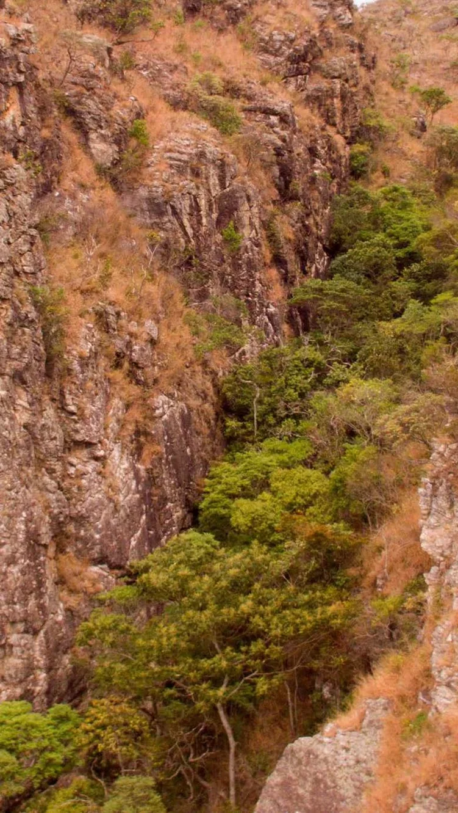
- **mapas**:
  - **[0]**:
    - **caminho_imagem_mapa**: 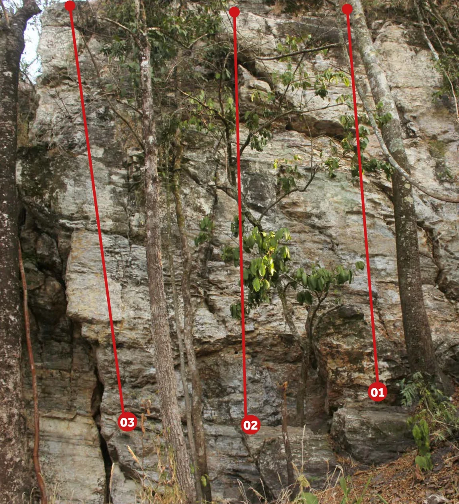
    - **largura_mapa**: 1152
    - **altura_mapa**: 1267
    - **pontos_de_interesse**:
      - **[0]**:
        - **id**: 0h2qRVRPVdKkob
        - **uid**: 0h2qRVRPVdKkob
        - **rotulo**: 01
        - **circulo**:
          - **x**: 948
          - **y**: 985
          - **raio**: 24
        - **label**: 01
      - **[1]**:
        - **id**: Om1WE4l9S2hvvl
        - **uid**: Om1WE4l9S2hvvl
        - **rotulo**: 02
        - **circulo**:
          - **x**: 629
          - **y**: 1069
          - **raio**: 25
        - **label**: 02
      - **[2]**:
        - **id**: x3nCRY0i89PKXK
        - **uid**: x3nCRY0i89PKXK
        - **rotulo**: 03
        - **circulo**:
          - **x**: 320
          - **y**: 1060
          - **raio**: 24
        - **label**: 03
    - **referencias**:
      - **[0]**:
        - **alvo_uid**: eUdYm0HHUTQdvU
        - **pontos_uids**:
          - 0h2qRVRPVdKkob
        - **escalada**: Love's in the Air
        - **ids**:
          - 0h2qRVRPVdKkob
      - **[1]**:
        - **alvo_uid**: boCGOTc9cQWxO5
        - **pontos_uids**:
          - Om1WE4l9S2hvvl
        - **escalada**: BH em Chamas
        - **ids**:
          - Om1WE4l9S2hvvl
      - **[2]**:
        - **alvo_uid**: OWmUQgXd9N23C1
        - **pontos_uids**:
          - x3nCRY0i89PKXK
        - **escalada**: Revolta dos Vinagres
        - **ids**:
          - x3nCRY0i89PKXK
  - **[1]**:
    - **caminho_imagem_mapa**: 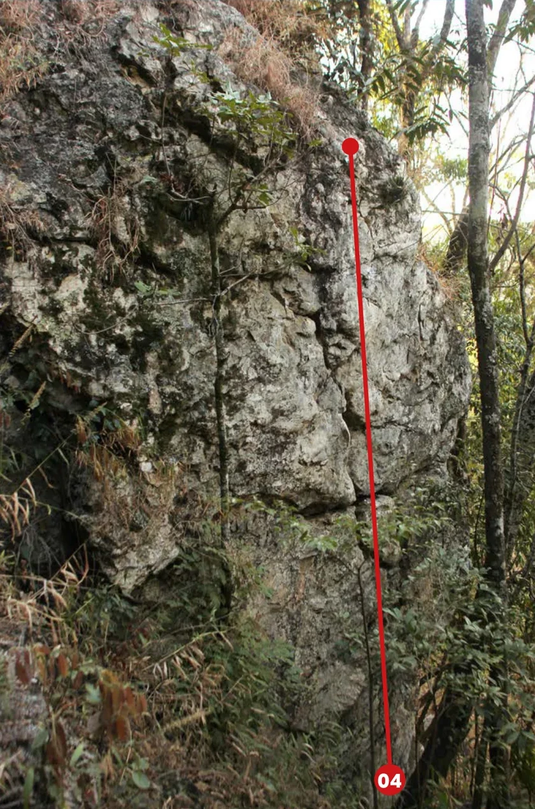
    - **largura_mapa**: 840
    - **altura_mapa**: 1269
    - **pontos_de_interesse**:
      - **[0]**:
        - **id**: 9y4XyyOynjpYI5
        - **uid**: 9y4XyyOynjpYI5
        - **rotulo**: 04
        - **circulo**:
          - **x**: 612
          - **y**: 1224
          - **raio**: 25
        - **label**: 04
    - **referencias**:
      - **[0]**:
        - **alvo_uid**: FRLyPP5H8WJy1S
        - **pontos_uids**:
          - 9y4XyyOynjpYI5
        - **escalada**: De Pai para Filho
        - **ids**:
          - 9y4XyyOynjpYI5
  - **[2]**:
    - **caminho_imagem_mapa**: 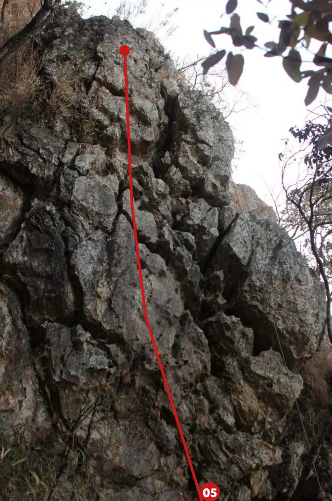
    - **largura_mapa**: 843
    - **altura_mapa**: 1270
    - **pontos_de_interesse**:
      - **[0]**:
        - **id**: DmBaJzqQnlxOlQ
        - **uid**: DmBaJzqQnlxOlQ
        - **rotulo**: 05
        - **circulo**:
          - **x**: 533
          - **y**: 1247
          - **raio**: 25
        - **label**: 05
    - **referencias**:
      - **[0]**:
        - **alvo_uid**: LkumlxJke7XZ7G
        - **pontos_uids**:
          - DmBaJzqQnlxOlQ
        - **escalada**: Amor de Mãe
        - **ids**:
          - DmBaJzqQnlxOlQ
  - **[3]**:
    - **caminho_imagem_mapa**: 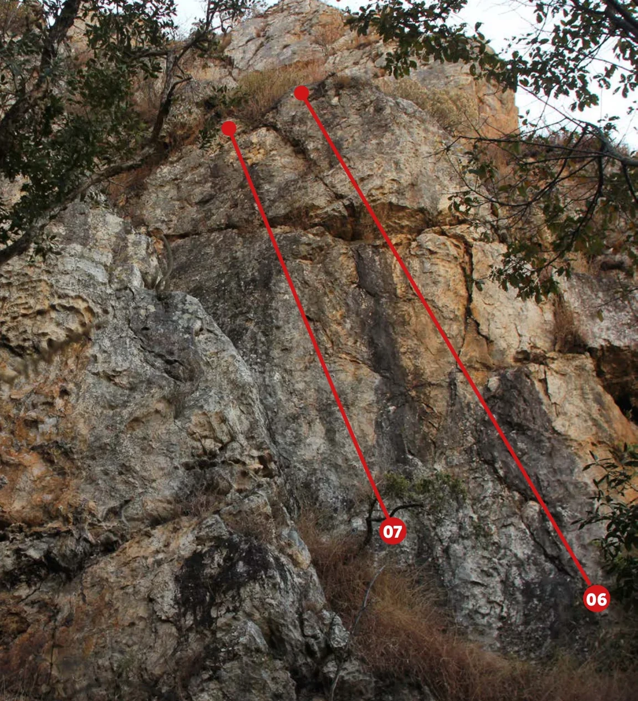
    - **largura_mapa**: 1151
    - **altura_mapa**: 1264
    - **pontos_de_interesse**:
      - **[0]**:
        - **id**: 9s7ZM1DpHcJJYv
        - **uid**: 9s7ZM1DpHcJJYv
        - **rotulo**: 06
        - **circulo**:
          - **x**: 1076
          - **y**: 1079
          - **raio**: 24
        - **label**: 06
      - **[1]**:
        - **id**: MUz2E49JzHgvtt
        - **uid**: MUz2E49JzHgvtt
        - **rotulo**: 07
        - **circulo**:
          - **x**: 709
          - **y**: 957
          - **raio**: 24
        - **label**: 07
    - **referencias**:
      - **[0]**:
        - **alvo_uid**: HuA1HYV1ZztWls
        - **pontos_uids**:
          - 9s7ZM1DpHcJJYv
        - **escalada**: Pagador de Promessa
        - **ids**:
          - 9s7ZM1DpHcJJYv
      - **[1]**:
        - **alvo_uid**: uPHWwV2TJJh2sA
        - **pontos_uids**:
          - MUz2E49JzHgvtt
        - **escalada**: Grande Família
        - **ids**:
          - MUz2E49JzHgvtt
  - **[4]**:
    - **caminho_imagem_mapa**: 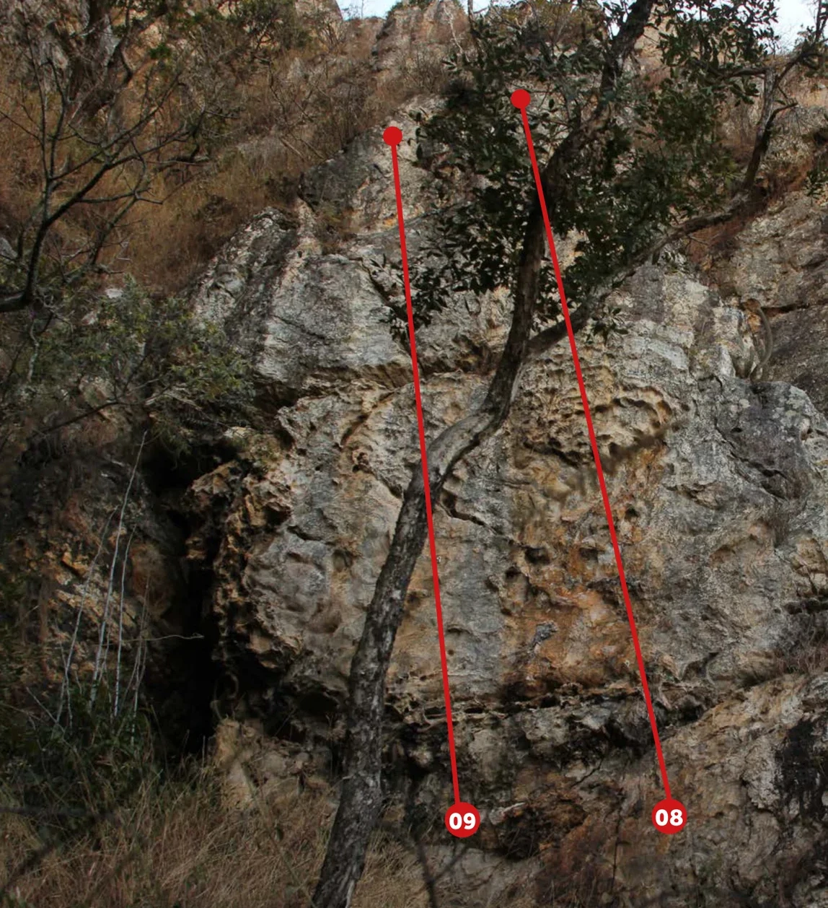
    - **largura_mapa**: 1148
    - **altura_mapa**: 1258
    - **pontos_de_interesse**:
      - **[0]**:
        - **id**: 8VdnWwoB0Q133l
        - **uid**: 8VdnWwoB0Q133l
        - **rotulo**: 08
        - **circulo**:
          - **x**: 928
          - **y**: 1131
          - **raio**: 24
        - **label**: 08
      - **[1]**:
        - **id**: Qq300CtAsjD06M
        - **uid**: Qq300CtAsjD06M
        - **rotulo**: 09
        - **circulo**:
          - **x**: 641
          - **y**: 1136
          - **raio**: 25
        - **label**: 09
    - **referencias**:
      - **[0]**:
        - **alvo_uid**: 1gEgWfE8RSDrEu
        - **pontos_uids**:
          - 8VdnWwoB0Q133l
        - **escalada**: Sangue do meu Sangue
        - **ids**:
          - 8VdnWwoB0Q133l
      - **[1]**:
        - **alvo_uid**: wkNjF7jNNniVZV
        - **pontos_uids**:
          - Qq300CtAsjD06M
        - **escalada**: Cocalcinhas
        - **ids**:
          - Qq300CtAsjD06M
  - **[5]**:
    - **caminho_imagem_mapa**: 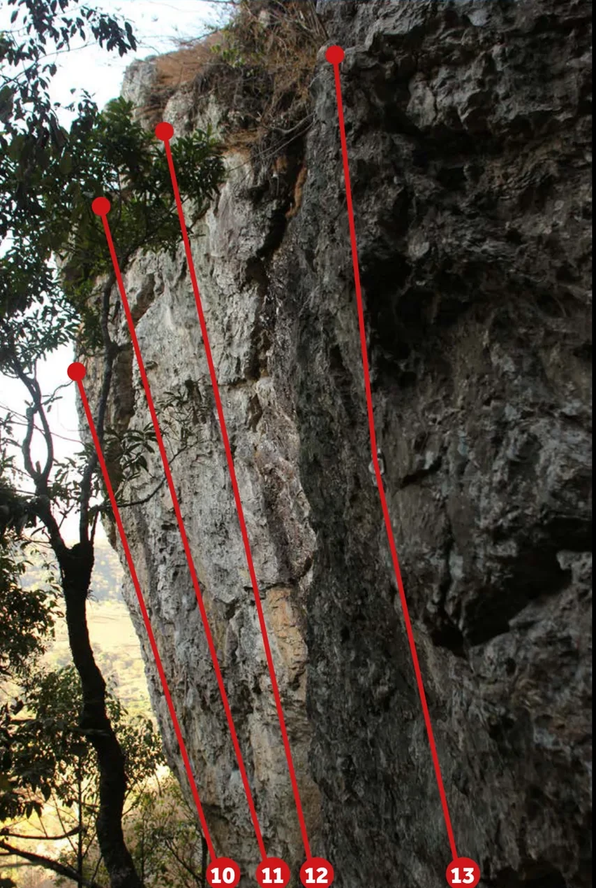
    - **largura_mapa**: 854
    - **altura_mapa**: 1269
    - **pontos_de_interesse**:
      - **[0]**:
        - **id**: h5UDx1EvJnl51e
        - **uid**: h5UDx1EvJnl51e
        - **rotulo**: 10
        - **circulo**:
          - **x**: 320
          - **y**: 1250
          - **raio**: 25
        - **label**: 10
      - **[1]**:
        - **id**: XSPpu1ZDWYE5Q8
        - **uid**: XSPpu1ZDWYE5Q8
        - **rotulo**: 11
        - **circulo**:
          - **x**: 391
          - **y**: 1250
          - **raio**: 25
        - **label**: 11
      - **[2]**:
        - **id**: 2kMeJ5idBFnlAG
        - **uid**: 2kMeJ5idBFnlAG
        - **rotulo**: 12
        - **circulo**:
          - **x**: 454
          - **y**: 1250
          - **raio**: 25
        - **label**: 12
      - **[3]**:
        - **id**: hk7WRbg4CUR06u
        - **uid**: hk7WRbg4CUR06u
        - **rotulo**: 13
        - **circulo**:
          - **x**: 664
          - **y**: 1250
          - **raio**: 25
        - **label**: 13
    - **referencias**:
      - **[0]**:
        - **alvo_uid**: KLnmzzYHe6lOS8
        - **pontos_uids**:
          - h5UDx1EvJnl51e
        - **escalada**: Guerreiro da Bocaina
        - **ids**:
          - h5UDx1EvJnl51e
      - **[1]**:
        - **alvo_uid**: XGSKaJqAncc0ZE
        - **pontos_uids**:
          - XSPpu1ZDWYE5Q8
        - **escalada**: Samurai Rastafari
        - **ids**:
          - XSPpu1ZDWYE5Q8
      - **[2]**:
        - **alvo_uid**: gWDEtMboiOy5gM
        - **pontos_uids**:
          - 2kMeJ5idBFnlAG
        - **escalada**: Ceder Writhe
        - **ids**:
          - 2kMeJ5idBFnlAG
      - **[3]**:
        - **alvo_uid**: 4n3hyPkgewbb5O
        - **pontos_uids**:
          - hk7WRbg4CUR06u
        - **escalada**: Sai pra Lá Sr. Doutor
        - **ids**:
          - hk7WRbg4CUR06u
  - **[6]**:
    - **caminho_imagem_mapa**: 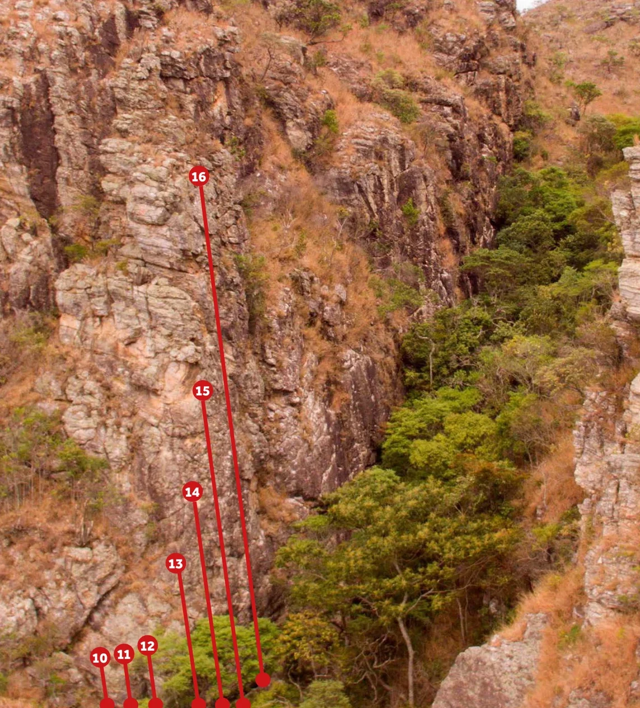
    - **largura_mapa**: 1143
    - **altura_mapa**: 1264
    - **pontos_de_interesse**:
      - **[0]**:
        - **id**: 8wThMUBhTcCw74
        - **uid**: 8wThMUBhTcCw74
        - **rotulo**: 10
        - **circulo**:
          - **x**: 178
          - **y**: 1173
          - **raio**: 19
        - **label**: 10
      - **[1]**:
        - **id**: dwudz1rF50ocY9
        - **uid**: dwudz1rF50ocY9
        - **rotulo**: 11
        - **circulo**:
          - **x**: 221
          - **y**: 1167
          - **raio**: 18
        - **label**: 11
      - **[2]**:
        - **id**: VIArE0rn4FL1YN
        - **uid**: VIArE0rn4FL1YN
        - **rotulo**: 12
        - **circulo**:
          - **x**: 263
          - **y**: 1152
          - **raio**: 19
        - **label**: 12
      - **[3]**:
        - **id**: kJ5xH8PkS7cLW0
        - **uid**: kJ5xH8PkS7cLW0
        - **rotulo**: 13
        - **circulo**:
          - **x**: 314
          - **y**: 1006
          - **raio**: 19
        - **label**: 13
      - **[4]**:
        - **id**: HSVonTX0F256H3
        - **uid**: HSVonTX0F256H3
        - **rotulo**: 14
        - **circulo**:
          - **x**: 343
          - **y**: 877
          - **raio**: 19
        - **label**: 14
      - **[5]**:
        - **id**: qBHB84eizqvoqh
        - **uid**: qBHB84eizqvoqh
        - **rotulo**: 15
        - **circulo**:
          - **x**: 362
          - **y**: 697
          - **raio**: 19
        - **label**: 15
      - **[6]**:
        - **id**: bnTRcKGc8y5Nrq
        - **uid**: bnTRcKGc8y5Nrq
        - **rotulo**: 16
        - **circulo**:
          - **x**: 355
          - **y**: 315
          - **raio**: 18
        - **label**: 16
    - **referencias**:
      - **[0]**:
        - **alvo_uid**: KLnmzzYHe6lOS8
        - **pontos_uids**:
          - 8wThMUBhTcCw74
        - **escalada**: Guerreiro da Bocaina
        - **ids**:
          - 8wThMUBhTcCw74
      - **[1]**:
        - **alvo_uid**: XGSKaJqAncc0ZE
        - **pontos_uids**:
          - dwudz1rF50ocY9
        - **escalada**: Samurai Rastafari
        - **ids**:
          - dwudz1rF50ocY9
      - **[2]**:
        - **alvo_uid**: gWDEtMboiOy5gM
        - **pontos_uids**:
          - VIArE0rn4FL1YN
        - **escalada**: Ceder Writhe
        - **ids**:
          - VIArE0rn4FL1YN
      - **[3]**:
        - **alvo_uid**: 4n3hyPkgewbb5O
        - **pontos_uids**:
          - kJ5xH8PkS7cLW0
        - **escalada**: Sai pra Lá Sr. Doutor
        - **ids**:
          - kJ5xH8PkS7cLW0
      - **[4]**:
        - **alvo_uid**: R7QBXqMTy1mlvA
        - **pontos_uids**:
          - HSVonTX0F256H3
        - **escalada**: Maniaco Sexual
        - **ids**:
          - HSVonTX0F256H3
      - **[5]**:
        - **alvo_uid**: ovOwLTfZYVMAa0
        - **pontos_uids**:
          - qBHB84eizqvoqh
        - **escalada**: Paraiboult
        - **ids**:
          - qBHB84eizqvoqh
      - **[6]**:
        - **alvo_uid**: LnN0qOva6huNap
        - **pontos_uids**:
          - bnTRcKGc8y5Nrq
        - **escalada**: Mulheres ao Poder
        - **ids**:
          - bnTRcKGc8y5Nrq
  - **[7]**:
    - **caminho_imagem_mapa**: 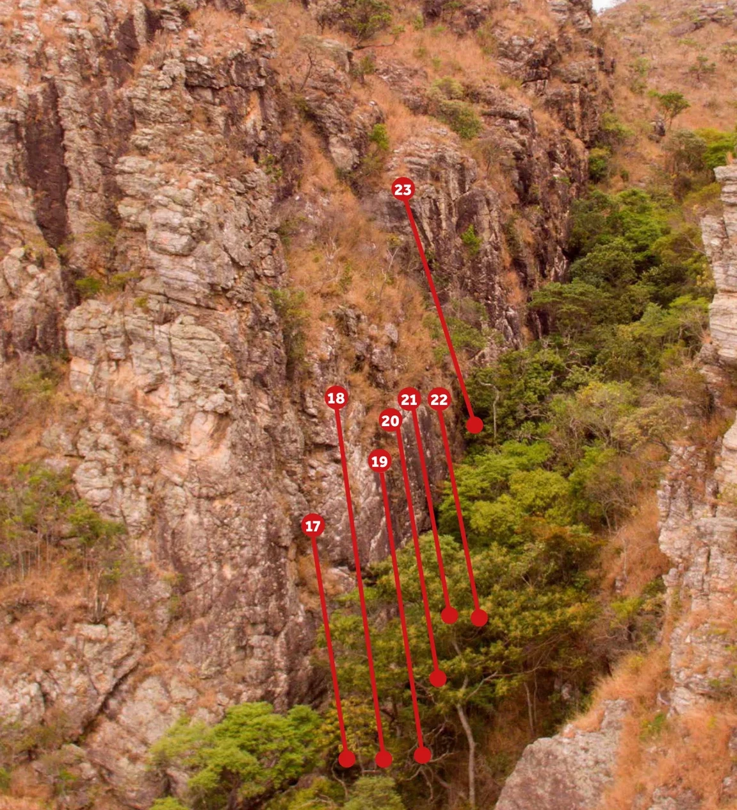
    - **largura_mapa**: 1151
    - **altura_mapa**: 1264
    - **pontos_de_interesse**:
      - **[0]**:
        - **id**: vVYiSXHuHaKo3E
        - **uid**: vVYiSXHuHaKo3E
        - **rotulo**: 17
        - **circulo**:
          - **x**: 489
          - **y**: 820
          - **raio**: 18
        - **label**: 17
      - **[1]**:
        - **id**: IvVy73fEi0lehg
        - **uid**: IvVy73fEi0lehg
        - **rotulo**: 18
        - **circulo**:
          - **x**: 526
          - **y**: 621
          - **raio**: 19
        - **label**: 18
      - **[2]**:
        - **id**: JbRZQzj2ev0w4P
        - **uid**: JbRZQzj2ev0w4P
        - **rotulo**: 19
        - **circulo**:
          - **x**: 593
          - **y**: 719
          - **raio**: 19
        - **label**: 19
      - **[3]**:
        - **id**: OgLoUO577IxOBL
        - **uid**: OgLoUO577IxOBL
        - **rotulo**: 20
        - **circulo**:
          - **x**: 610
          - **y**: 656
          - **raio**: 18
        - **label**: 20
      - **[4]**:
        - **id**: 6VjeyCS0XIoZCF
        - **uid**: 6VjeyCS0XIoZCF
        - **rotulo**: 21
        - **circulo**:
          - **x**: 639
          - **y**: 623
          - **raio**: 18
        - **label**: 21
      - **[5]**:
        - **id**: aCKqxc4jGFJzGl
        - **uid**: aCKqxc4jGFJzGl
        - **rotulo**: 22
        - **circulo**:
          - **x**: 686
          - **y**: 623
          - **raio**: 19
        - **label**: 22
      - **[6]**:
        - **id**: AJZm6TcIqd0Ajc
        - **uid**: AJZm6TcIqd0Ajc
        - **rotulo**: 23
        - **circulo**:
          - **x**: 630
          - **y**: 295
          - **raio**: 19
        - **label**: 23
    - **referencias**:
      - **[0]**:
        - **alvo_uid**: qHdIVNpoUa9Cbu
        - **pontos_uids**:
          - vVYiSXHuHaKo3E
        - **escalada**: Invasão Bacteriana
        - **ids**:
          - vVYiSXHuHaKo3E
      - **[1]**:
        - **alvo_uid**: 6JDxSvwgRJJgS6
        - **pontos_uids**:
          - IvVy73fEi0lehg
        - **escalada**: Yes We Can
        - **ids**:
          - IvVy73fEi0lehg
      - **[2]**:
        - **alvo_uid**: 4F43TIb209GCpF
        - **pontos_uids**:
          - JbRZQzj2ev0w4P
        - **escalada**: Galo Doido
        - **ids**:
          - JbRZQzj2ev0w4P
      - **[3]**:
        - **alvo_uid**: 20JvoF1MsteE5L
        - **pontos_uids**:
          - OgLoUO577IxOBL
        - **escalada**: Baby Roots
        - **ids**:
          - OgLoUO577IxOBL
      - **[4]**:
        - **alvo_uid**: Uc4bo91Mn6UXSd
        - **pontos_uids**:
          - 6VjeyCS0XIoZCF
        - **escalada**: Canelinha de Ouro
        - **ids**:
          - 6VjeyCS0XIoZCF
      - **[5]**:
        - **alvo_uid**: OYRbzZvYFkg1D6
        - **pontos_uids**:
          - aCKqxc4jGFJzGl
        - **escalada**: Rei Leão
        - **ids**:
          - aCKqxc4jGFJzGl
      - **[6]**:
        - **alvo_uid**: XoIerLay5Jsp0G
        - **pontos_uids**:
          - AJZm6TcIqd0Ajc
        - **escalada**: Maluco Beleza
        - **ids**:
          - AJZm6TcIqd0Ajc
  - **[8]**:
    - **caminho_imagem_mapa**: 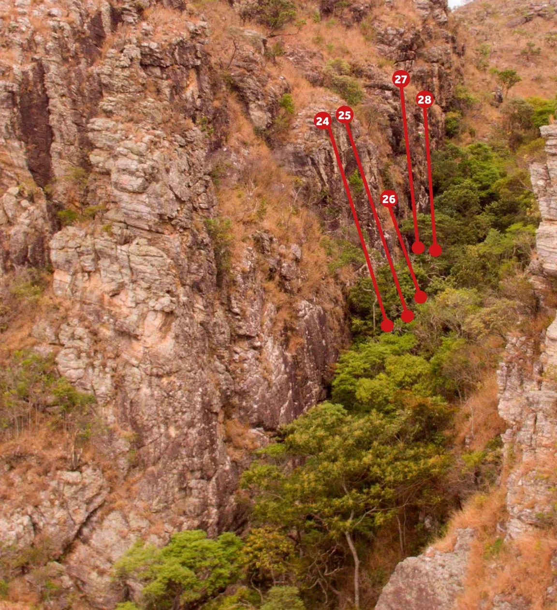
    - **largura_mapa**: 1152
    - **altura_mapa**: 1261
    - **pontos_de_interesse**:
      - **[0]**:
        - **id**: wQHeKMHQoqYT9a
        - **uid**: wQHeKMHQoqYT9a
        - **rotulo**: 24
        - **circulo**:
          - **x**: 668
          - **y**: 249
          - **raio**: 19
        - **label**: 24
      - **[1]**:
        - **id**: iZPfwRNUXjqnIt
        - **uid**: iZPfwRNUXjqnIt
        - **rotulo**: 25
        - **circulo**:
          - **x**: 713
          - **y**: 237
          - **raio**: 18
        - **label**: 25
      - **[2]**:
        - **id**: Bdk0WViyrVHeVE
        - **uid**: Bdk0WViyrVHeVE
        - **rotulo**: 26
        - **circulo**:
          - **x**: 805
          - **y**: 410
          - **raio**: 19
        - **label**: 26
      - **[3]**:
        - **id**: DMSPDtQcQ7FV85
        - **uid**: DMSPDtQcQ7FV85
        - **rotulo**: 27
        - **circulo**:
          - **x**: 829
          - **y**: 163
          - **raio**: 19
        - **label**: 27
      - **[4]**:
        - **id**: xmmrWTN8gCLhUU
        - **uid**: xmmrWTN8gCLhUU
        - **rotulo**: 28
        - **circulo**:
          - **x**: 878
          - **y**: 206
          - **raio**: 19
        - **label**: 28
    - **referencias**:
      - **[0]**:
        - **alvo_uid**: ryVTglx40nZepT
        - **pontos_uids**:
          - wQHeKMHQoqYT9a
        - **escalada**: Peter Park
        - **ids**:
          - wQHeKMHQoqYT9a
      - **[1]**:
        - **alvo_uid**: lEKjUnixWx7mng
        - **pontos_uids**:
          - iZPfwRNUXjqnIt
        - **escalada**: Super Poderosa
        - **ids**:
          - iZPfwRNUXjqnIt
      - **[2]**:
        - **alvo_uid**: aOJQWHqDDgCsXK
        - **pontos_uids**:
          - Bdk0WViyrVHeVE
        - **escalada**: Cinco Vira, Dez Acaba
        - **ids**:
          - Bdk0WViyrVHeVE
      - **[3]**:
        - **alvo_uid**: W8v5a7FqY4ICgU
        - **pontos_uids**:
          - DMSPDtQcQ7FV85
        - **escalada**: Dunas
        - **ids**:
          - DMSPDtQcQ7FV85
      - **[4]**:
        - **alvo_uid**: 99PUi9mUeSpPGM
        - **pontos_uids**:
          - xmmrWTN8gCLhUU
        - **escalada**: Poeira Cósmica
        - **ids**:
          - xmmrWTN8gCLhUU
- **escaladas**:
  - **[0]**:
    - **uid**: eUdYm0HHUTQdvU
    - **via_esportiva**:
      - **nome**: Love's in the Air
      - **dificuldade**: BR_6
      - **extensao**: 10
      - **quantidade_protecoes_intermediarias**: 4
      - **quantidade_protecoes_parada**: 2
      - **conquistadores**:
        - Laurêncio Jr
        - Anna Luiza Vilela
      - **data_abertura**: 2015
  - **[1]**:
    - **uid**: boCGOTc9cQWxO5
    - **via_esportiva**:
      - **nome**: BH em Chamas
      - **dificuldade**: BR_6
      - **extensao**: 10
      - **quantidade_protecoes_intermediarias**: 4
      - **quantidade_protecoes_parada**: 2
      - **conquistadores**:
        - Laurêncio Jr
        - Anna Luiza Vilela
      - **data_abertura**: 2015
  - **[2]**:
    - **uid**: OWmUQgXd9N23C1
    - **via_esportiva**:
      - **nome**: Revolta dos Vinagres
      - **dificuldade**: BR_6SUP
      - **extensao**: 10
      - **quantidade_protecoes_intermediarias**: 4
      - **quantidade_protecoes_parada**: 2
      - **conquistadores**:
        - Laurêncio Jr
        - Anna Luiza Vilela
      - **data_abertura**: 2015
  - **[3]**:
    - **uid**: FRLyPP5H8WJy1S
    - **via_esportiva**:
      - **nome**: De Pai para Filho
      - **dificuldade**: BR_6
      - **extensao**: 8
      - **quantidade_protecoes_intermediarias**: 2
      - **quantidade_protecoes_parada**: 2
      - **conquistadores**:
        - Daiex de Almeida
      - **data_abertura**: 2016
  - **[4]**:
    - **uid**: LkumlxJke7XZ7G
    - **via_esportiva**:
      - **nome**: Amor de Mãe
      - **dificuldade**: BR_6
      - **extensao**: 8
      - **quantidade_protecoes_intermediarias**: 3
      - **quantidade_protecoes_parada**: 2
      - **conquistadores**:
        - Daiex de Almeida
      - **data_abertura**: 2016
  - **[5]**:
    - **uid**: HuA1HYV1ZztWls
    - **via_esportiva**:
      - **nome**: Pagador de Promessa
      - **dificuldade**: BR_6SUP
      - **extensao**: 10
      - **quantidade_protecoes_intermediarias**: 3
      - **quantidade_protecoes_parada**: 2
      - **conquistadores**:
        - Laurêncio Jr
        - Alexandre Fei
      - **data_abertura**: 2013
  - **[6]**:
    - **uid**: uPHWwV2TJJh2sA
    - **via_esportiva**:
      - **nome**: Grande Família
      - **dificuldade**: BR_6
      - **extensao**: 15
      - **conquistadores**:
        - Alexandre Fei
        - Gustavo Maneira
      - **data_abertura**: 2013
  - **[7]**:
    - **uid**: 1gEgWfE8RSDrEu
    - **via_esportiva**:
      - **nome**: Sangue do meu Sangue
      - **dificuldade**: BR_6
      - **extensao**: 10
      - **quantidade_protecoes_intermediarias**: 4
      - **quantidade_protecoes_parada**: 2
      - **conquistadores**:
        - Alexandre Fei
      - **data_abertura**: 2013
  - **[8]**:
    - **uid**: wkNjF7jNNniVZV
    - **via_esportiva**:
      - **nome**: Cocalcinhas
      - **dificuldade**: BR_6
      - **extensao**: 10
      - **quantidade_protecoes_intermediarias**: 4
      - **quantidade_protecoes_parada**: 2
      - **conquistadores**:
        - Alexandre Fei
      - **data_abertura**: 2013
  - **[9]**:
    - **uid**: KLnmzzYHe6lOS8
    - **via_esportiva**:
      - **nome**: Guerreiro da Bocaina
      - **dificuldade**: BR_7A
      - **extensao**: 10
      - **quantidade_protecoes_intermediarias**: 4
      - **quantidade_protecoes_parada**: 2
      - **conquistadores**:
        - Alexandre Fei
      - **data_abertura**: 2013
  - **[10]**:
    - **uid**: XGSKaJqAncc0ZE
    - **via_esportiva**:
      - **nome**: Samurai Rastafari
      - **dificuldade**: BR_7B
      - **extensao**: 10
      - **quantidade_protecoes_intermediarias**: 4
      - **quantidade_protecoes_parada**: 2
      - **conquistadores**:
        - Alexandre Fei
      - **data_abertura**: 2013
  - **[11]**:
    - **uid**: gWDEtMboiOy5gM
    - **via_esportiva**:
      - **nome**: Ceder Writhe
      - **dificuldade**: BR_8C
      - **extensao**: 12
      - **quantidade_protecoes_intermediarias**: 5
      - **quantidade_protecoes_parada**: 2
      - **conquistadores**:
        - Alexandre Fei
      - **data_abertura**: 2013
  - **[12]**:
    - **uid**: 4n3hyPkgewbb5O
    - **via_esportiva**:
      - **nome**: Sai pra Lá Sr. Doutor
      - **dificuldade**: BR_7A
      - **extensao**: 12
      - **quantidade_protecoes_intermediarias**: 5
      - **quantidade_protecoes_parada**: 2
      - **conquistadores**:
        - Daiex de Almeida
      - **data_abertura**: 2013
  - **[13]**:
    - **uid**: R7QBXqMTy1mlvA
    - **via_esportiva**:
      - **nome**: Maniaco Sexual
      - **dificuldade**: BR_7A
      - **extensao**: 12
      - **quantidade_protecoes_intermediarias**: 4
      - **quantidade_protecoes_parada**: 2
      - **conquistadores**:
        - Alexandre Fei
      - **data_abertura**: 2013
  - **[14]**:
    - **uid**: ovOwLTfZYVMAa0
    - **via_esportiva**:
      - **nome**: Paraiboult
      - **dificuldade**: INDEFINIDO
      - **extensao**: 20
      - **quantidade_protecoes_intermediarias**: 6
      - **quantidade_protecoes_parada**: 2
      - **conquistadores**:
        - Alexandre Fei
      - **data_abertura**: 2013
  - **[15]**:
    - **uid**: LnN0qOva6huNap
    - **via_esportiva**:
      - **nome**: Mulheres ao Poder
      - **dificuldade**: BR_6SUP
      - **extensao**: 30
      - **quantidade_protecoes_intermediarias**: 13
      - **quantidade_protecoes_parada**: 2
      - **conquistadores**:
        - Diego Leonardo
        - Alexandre Fei
      - **data_abertura**: 2013
  - **[16]**:
    - **uid**: qHdIVNpoUa9Cbu
    - **via_esportiva**:
      - **nome**: Invasão Bacteriana
      - **dificuldade**: BR_7A
      - **extensao**: 10
      - **quantidade_protecoes_intermediarias**: 5
      - **quantidade_protecoes_parada**: 2
      - **conquistadores**:
        - Alexandre Fei
      - **data_abertura**: 2013
  - **[17]**:
    - **uid**: 6JDxSvwgRJJgS6
    - **via_esportiva**:
      - **nome**: Yes We Can
      - **dificuldade**: BR_6SUP
      - **extensao**: 20
      - **quantidade_protecoes_intermediarias**: 7
      - **quantidade_protecoes_parada**: 2
      - **conquistadores**:
        - Alexandre Fei
      - **data_abertura**: 2013
  - **[18]**:
    - **uid**: 4F43TIb209GCpF
    - **via_esportiva**:
      - **nome**: Galo Doido
      - **dificuldade**: BR_6SUP
      - **extensao**: 12
      - **quantidade_protecoes_intermediarias**: 6
      - **quantidade_protecoes_parada**: 2
      - **conquistadores**:
        - Alexandre Fei
      - **data_abertura**: 2013
  - **[19]**:
    - **uid**: 20JvoF1MsteE5L
    - **via_esportiva**:
      - **nome**: Baby Roots
      - **dificuldade**: BR_6SUP
      - **extensao**: 12
      - **quantidade_protecoes_intermediarias**: 4
      - **quantidade_protecoes_parada**: 2
      - **conquistadores**:
        - Juliano Peter
      - **data_abertura**: 2013
  - **[20]**:
    - **uid**: Uc4bo91Mn6UXSd
    - **via_esportiva**:
      - **nome**: Canelinha de Ouro
      - **dificuldade**: BR_6
      - **extensao**: 12
      - **quantidade_protecoes_intermediarias**: 4
      - **quantidade_protecoes_parada**: 2
      - **conquistadores**:
        - Alexandre Fei
      - **data_abertura**: 2013
  - **[21]**:
    - **uid**: OYRbzZvYFkg1D6
    - **via_esportiva**:
      - **nome**: Rei Leão
      - **dificuldade**: BR_7A
      - **extensao**: 15
      - **quantidade_protecoes_intermediarias**: 4
      - **quantidade_protecoes_parada**: 2
      - **conquistadores**:
        - Mateus Martins
        - Arthur Martins
      - **data_abertura**: 2013
  - **[22]**:
    - **uid**: XoIerLay5Jsp0G
    - **via_esportiva**:
      - **nome**: Maluco Beleza
      - **dificuldade**: BR_7B
      - **conquistadores**:
        - Daiex de Almeida
        - Alexandre Fei
      - **data_abertura**: 2013
  - **[23]**:
    - **uid**: ryVTglx40nZepT
    - **via_esportiva**:
      - **nome**: Peter Park
      - **dificuldade**: INDEFINIDO
      - **extensao**: 25
      - **quantidade_protecoes_intermediarias**: 9
      - **quantidade_protecoes_parada**: 2
      - **conquistadores**:
        - Juliano Peter Park
      - **data_abertura**: 2013
  - **[24]**:
    - **uid**: lEKjUnixWx7mng
    - **via_esportiva**:
      - **nome**: Super Poderosa
      - **dificuldade**: BR_7A
      - **extensao**: 25
      - **quantidade_protecoes_intermediarias**: 8
      - **quantidade_protecoes_parada**: 2
      - **conquistadores**:
        - Mateus Martins
        - Arthur Martins
      - **data_abertura**: 2013
  - **[25]**:
    - **uid**: aOJQWHqDDgCsXK
    - **via_esportiva**:
      - **nome**: Cinco Vira, Dez Acaba
      - **dificuldade**: BR_6SUP
      - **extensao**: 10
      - **quantidade_protecoes_intermediarias**: 4
      - **quantidade_protecoes_parada**: 2
      - **conquistadores**:
        - Alex
      - **data_abertura**: 2013
  - **[26]**:
    - **uid**: W8v5a7FqY4ICgU
    - **via_esportiva**:
      - **nome**: Dunas
      - **dificuldade**: BR_6SUP
      - **extensao**: 17
      - **quantidade_protecoes_intermediarias**: 7
      - **quantidade_protecoes_parada**: 2
      - **conquistadores**:
        - Alex
      - **data_abertura**: 2013
  - **[27]**:
    - **uid**: 99PUi9mUeSpPGM
    - **via_esportiva**:
      - **nome**: Poeira Cósmica
      - **dificuldade**: BR_7A
      - **extensao**: 15
      - **quantidade_protecoes_intermediarias**: 6
      - **quantidade_protecoes_parada**: 2
      - **conquistadores**:
        - Alex
      - **data_abertura**: 2013
- **precomputados**:
  - **total_escaladas**: 28
  - **total_esportivas**: 28

## Parte: setor_tapa_na_cara

### Setor (Pico: Bocaina Park)

- **descricao**:
    # Setor Tapa na Cara
    
    Setor com vias curtas e técnicas, ideal para quem busca vias de 6º e 7º grau.
    
    > [!TIP]
    > Leve seu lixo e outro que encontrar para a cidade. Não faça necessidades fisiológicas nas trilhas e base de vias. Avisar a administração sobre a abertura de novas vias de escalada. **USE CAPACETE NAS BASES DE VIAS DE ESCALADA.**
- **nome**: Tapa na Cara
- **uid**: SIe8qMFw1Y46zG
- **caminho_imagem_capa**: 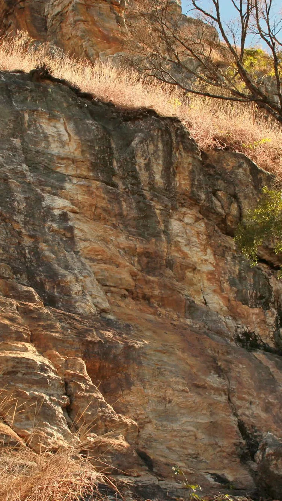
- **mapas**:
  - **[0]**:
    - **caminho_imagem_mapa**: 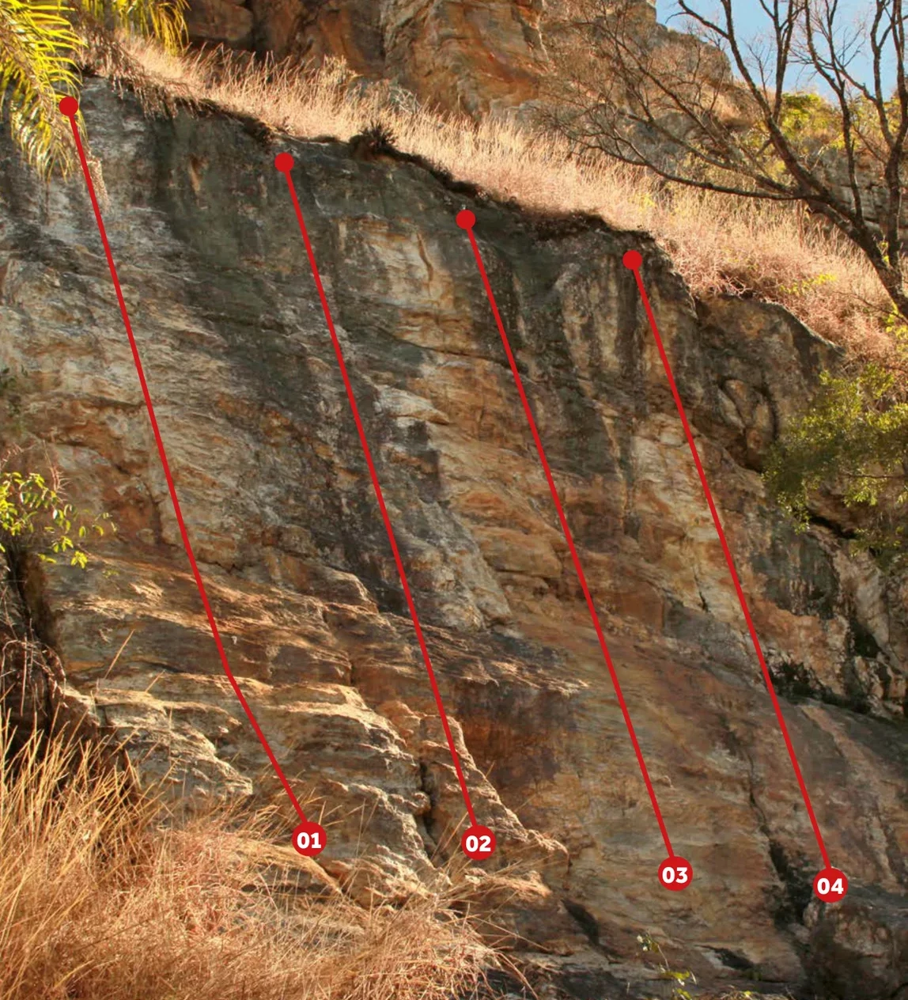
    - **largura_mapa**: 1148
    - **altura_mapa**: 1264
    - **pontos_de_interesse**:
      - **[0]**:
        - **id**: QgT7EBt8FUEXVE
        - **uid**: QgT7EBt8FUEXVE
        - **rotulo**: 01
        - **circulo**:
          - **x**: 390
          - **y**: 1061
          - **raio**: 22
        - **label**: 01
      - **[1]**:
        - **id**: T0glVtLEys5pdU
        - **uid**: T0glVtLEys5pdU
        - **rotulo**: 02
        - **circulo**:
          - **x**: 605
          - **y**: 1065
          - **raio**: 22
        - **label**: 02
      - **[2]**:
        - **id**: wwsC4daVFJYHjD
        - **uid**: wwsC4daVFJYHjD
        - **rotulo**: 03
        - **circulo**:
          - **x**: 854
          - **y**: 1104
          - **raio**: 22
        - **label**: 03
      - **[3]**:
        - **id**: rHGzNuGFbtRPp3
        - **uid**: rHGzNuGFbtRPp3
        - **rotulo**: 04
        - **circulo**:
          - **x**: 1050
          - **y**: 1119
          - **raio**: 22
        - **label**: 04
    - **referencias**:
      - **[0]**:
        - **alvo_uid**: Qv5Oziuikaqdg9
        - **pontos_uids**:
          - QgT7EBt8FUEXVE
        - **escalada**: Marcha lenta
        - **ids**:
          - QgT7EBt8FUEXVE
      - **[1]**:
        - **alvo_uid**: bq6Ph21tIFhVNl
        - **pontos_uids**:
          - T0glVtLEys5pdU
        - **escalada**: Bundalelê
        - **ids**:
          - T0glVtLEys5pdU
      - **[2]**:
        - **alvo_uid**: 3Y1MK9DFiABqp5
        - **pontos_uids**:
          - wwsC4daVFJYHjD
        - **escalada**: Tapa na Cara
        - **ids**:
          - wwsC4daVFJYHjD
      - **[3]**:
        - **alvo_uid**: 77gq3V4yehvQXa
        - **pontos_uids**:
          - rHGzNuGFbtRPp3
        - **escalada**: Cotonete Molhado
        - **ids**:
          - rHGzNuGFbtRPp3
- **escaladas**:
  - **[0]**:
    - **uid**: Qv5Oziuikaqdg9
    - **via_esportiva**:
      - **nome**: Marcha lenta
      - **dificuldade**: BR_6
      - **extensao**: 8
      - **quantidade_protecoes_intermediarias**: 3
      - **quantidade_protecoes_parada**: 2
      - **conquistadores**:
        - Diego Leonardo
        - Allisson Ismael
      - **data_abertura**: 2013
  - **[1]**:
    - **uid**: bq6Ph21tIFhVNl
    - **via_esportiva**:
      - **nome**: Bundalelê
      - **dificuldade**: BR_6
      - **extensao**: 10
      - **quantidade_protecoes_intermediarias**: 4
      - **quantidade_protecoes_parada**: 2
      - **conquistadores**:
        - Diego Leonardo
        - Daiex
        - Paulo
      - **data_abertura**: 2013
  - **[2]**:
    - **uid**: 3Y1MK9DFiABqp5
    - **via_esportiva**:
      - **nome**: Tapa na Cara
      - **dificuldade**: BR_7A
      - **extensao**: 10
      - **quantidade_protecoes_intermediarias**: 3
      - **quantidade_protecoes_parada**: 2
      - **conquistadores**:
        - Diego Leonardo
        - Gustavo Maneira
      - **data_abertura**: 2013
  - **[3]**:
    - **uid**: 77gq3V4yehvQXa
    - **via_esportiva**:
      - **nome**: Cotonete Molhado
      - **dificuldade**: BR_6SUP
      - **extensao**: 8
      - **quantidade_protecoes_intermediarias**: 3
      - **quantidade_protecoes_parada**: 2
      - **conquistadores**:
        - Diego Leonardo
        - Daiex
        - Paulo
      - **data_abertura**: 2013
- **precomputados**:
  - **total_escaladas**: 4
  - **total_esportivas**: 4

## Parte: setor_terceiro_andar

### Setor (Pico: Bocaina Park)

- **descricao**:
    # Setor Terceiro Andar
    
    O Setor Terceiro Andar é conhecido por suas vias de alta dificuldade, incluindo projetos e vias de 9º grau consolidado.
    
    > [!TIP]
    > Leve seu lixo e outro que encontrar para a cidade. Não faça necessidades fisiológicas nas trilhas e base de vias. Avisar a administração sobre a abertura de novas vias de escalada. **USE CAPACETE NAS BASES DE VIAS DE ESCALADA.**
- **nome**: Terceiro Andar
- **uid**: bIzbj97ftcBIWw
- **caminho_imagem_capa**: 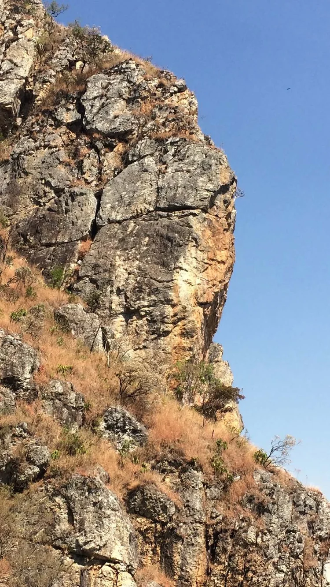
- **mapas**:
  - **[0]**:
    - **caminho_imagem_mapa**: 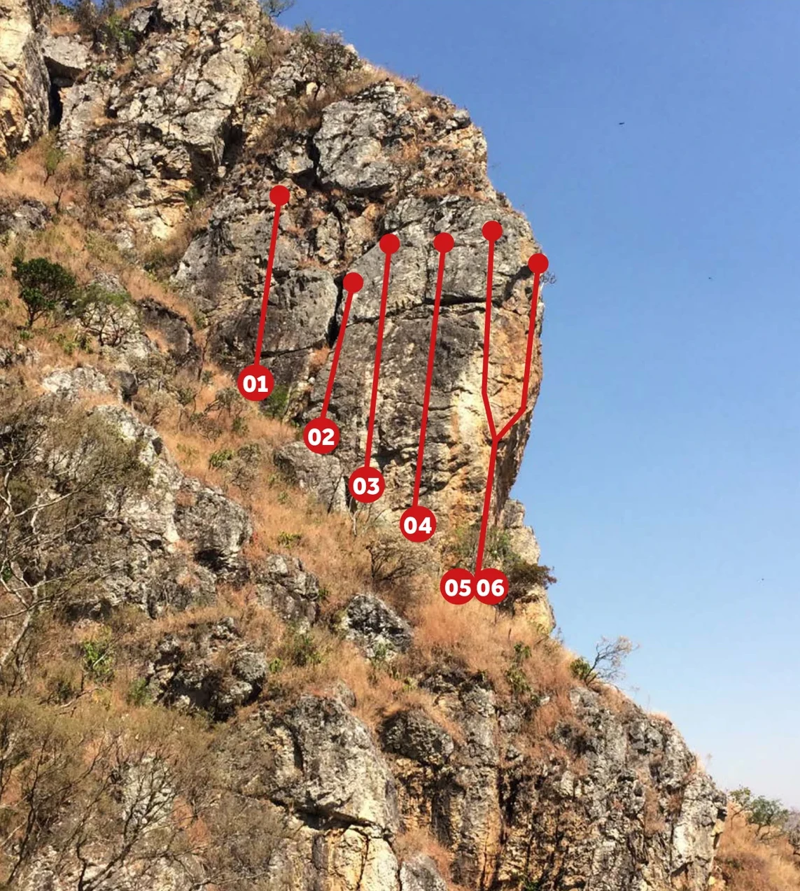
    - **largura_mapa**: 1143
    - **altura_mapa**: 1273
    - **pontos_de_interesse**:
      - **[0]**:
        - **id**: oMU5Wwu9cqkvML
        - **uid**: oMU5Wwu9cqkvML
        - **rotulo**: 01
        - **circulo**:
          - **x**: 365
          - **y**: 547
          - **raio**: 26
        - **label**: 01
      - **[1]**:
        - **id**: wc1cq7Wnf6KsAc
        - **uid**: wc1cq7Wnf6KsAc
        - **rotulo**: 02
        - **circulo**:
          - **x**: 459
          - **y**: 623
          - **raio**: 26
        - **label**: 02
      - **[2]**:
        - **id**: qdec7NGGUuqcLL
        - **uid**: qdec7NGGUuqcLL
        - **rotulo**: 03
        - **circulo**:
          - **x**: 524
          - **y**: 692
          - **raio**: 26
        - **label**: 03
      - **[3]**:
        - **id**: G6Itp1lJNnBI47
        - **uid**: G6Itp1lJNnBI47
        - **rotulo**: 04
        - **circulo**:
          - **x**: 597
          - **y**: 749
          - **raio**: 26
        - **label**: 04
      - **[4]**:
        - **id**: m2ALz09ZzVMsRf
        - **uid**: m2ALz09ZzVMsRf
        - **rotulo**: 05
        - **circulo**:
          - **x**: 654
          - **y**: 838
          - **raio**: 26
        - **label**: 05
      - **[5]**:
        - **id**: O9dQ0QtlDnX7zp
        - **uid**: O9dQ0QtlDnX7zp
        - **rotulo**: 06
        - **circulo**:
          - **x**: 701
          - **y**: 838
          - **raio**: 26
        - **label**: 06
    - **referencias**:
      - **[0]**:
        - **alvo_uid**: 8zeHKHtgkbIHEP
        - **pontos_uids**:
          - oMU5Wwu9cqkvML
        - **escalada**: Pêro no Mucho
        - **ids**:
          - oMU5Wwu9cqkvML
      - **[1]**:
        - **alvo_uid**: WKL29Y4R3HGPWE
        - **pontos_uids**:
          - wc1cq7Wnf6KsAc
        - **escalada**: Meia Hora
        - **ids**:
          - wc1cq7Wnf6KsAc
      - **[2]**:
        - **alvo_uid**: x24Bxs1Za3Ipkh
        - **pontos_uids**:
          - qdec7NGGUuqcLL
        - **escalada**: Falta de Educação
        - **ids**:
          - qdec7NGGUuqcLL
      - **[3]**:
        - **alvo_uid**: lMIJftJKh2tQZW
        - **pontos_uids**:
          - G6Itp1lJNnBI47
        - **escalada**: De Mão Beijada
        - **ids**:
          - G6Itp1lJNnBI47
      - **[4]**:
        - **alvo_uid**: 8I5EZreTIOhFyd
        - **pontos_uids**:
          - m2ALz09ZzVMsRf
        - **escalada**: Efeito Cascata
        - **ids**:
          - m2ALz09ZzVMsRf
      - **[5]**:
        - **alvo_uid**: YSdMMLY5O3o0Dh
        - **pontos_uids**:
          - O9dQ0QtlDnX7zp
        - **escalada**: Efeito Colateral
        - **ids**:
          - O9dQ0QtlDnX7zp
  - **[1]**:
    - **caminho_imagem_mapa**: 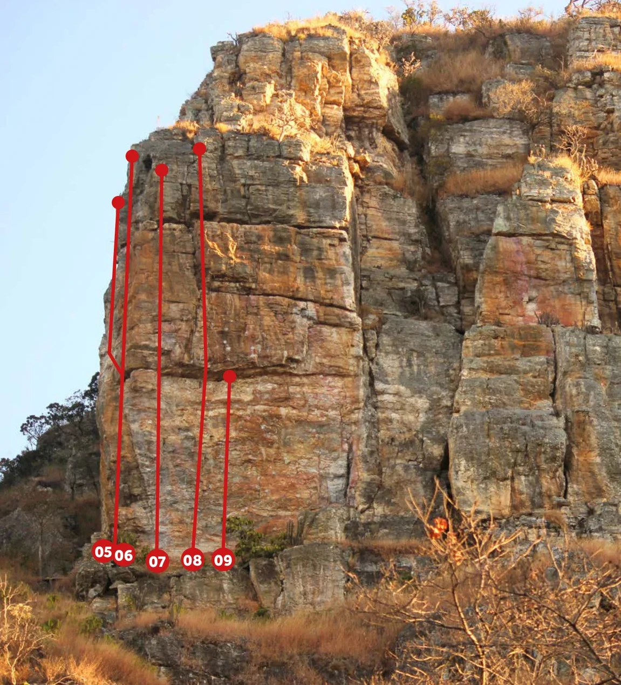
    - **largura_mapa**: 1151
    - **altura_mapa**: 1270
    - **pontos_de_interesse**:
      - **[0]**:
        - **id**: G0M0PbtSsy8HSa
        - **uid**: G0M0PbtSsy8HSa
        - **rotulo**: 05
        - **circulo**:
          - **x**: 191
          - **y**: 1022
          - **raio**: 22
        - **label**: 05
      - **[1]**:
        - **id**: T4g4bC6J909S9T
        - **uid**: T4g4bC6J909S9T
        - **rotulo**: 06
        - **circulo**:
          - **x**: 230
          - **y**: 1028
          - **raio**: 22
        - **label**: 06
      - **[2]**:
        - **id**: 5BZjrR7ZOFnjIh
        - **uid**: 5BZjrR7ZOFnjIh
        - **rotulo**: 07
        - **circulo**:
          - **x**: 292
          - **y**: 1041
          - **raio**: 22
        - **label**: 07
      - **[3]**:
        - **id**: Ota8xOi2gq9Kaa
        - **uid**: Ota8xOi2gq9Kaa
        - **rotulo**: 08
        - **circulo**:
          - **x**: 358
          - **y**: 1037
          - **raio**: 22
        - **label**: 08
      - **[4]**:
        - **id**: pZfCIskHdR0Gin
        - **uid**: pZfCIskHdR0Gin
        - **rotulo**: 09
        - **circulo**:
          - **x**: 413
          - **y**: 1038
          - **raio**: 22
        - **label**: 09
    - **referencias**:
      - **[0]**:
        - **alvo_uid**: 8I5EZreTIOhFyd
        - **pontos_uids**:
          - G0M0PbtSsy8HSa
        - **escalada**: Efeito Cascata
        - **ids**:
          - G0M0PbtSsy8HSa
      - **[1]**:
        - **alvo_uid**: YSdMMLY5O3o0Dh
        - **pontos_uids**:
          - T4g4bC6J909S9T
        - **escalada**: Efeito Colateral
        - **ids**:
          - T4g4bC6J909S9T
      - **[2]**:
        - **alvo_uid**: iQdxWwg2mIyUcM
        - **pontos_uids**:
          - 5BZjrR7ZOFnjIh
        - **escalada**: Só pra Variar
        - **ids**:
          - 5BZjrR7ZOFnjIh
      - **[3]**:
        - **alvo_uid**: 9g5t6d0Hq1t6eQ
        - **pontos_uids**:
          - Ota8xOi2gq9Kaa
        - **escalada**: Rock Supimpa
        - **ids**:
          - Ota8xOi2gq9Kaa
      - **[4]**:
        - **alvo_uid**: xVWScK5FYpgqQy
        - **pontos_uids**:
          - pZfCIskHdR0Gin
        - **escalada**: Você Decide
        - **ids**:
          - pZfCIskHdR0Gin
  - **[2]**:
    - **caminho_imagem_mapa**: 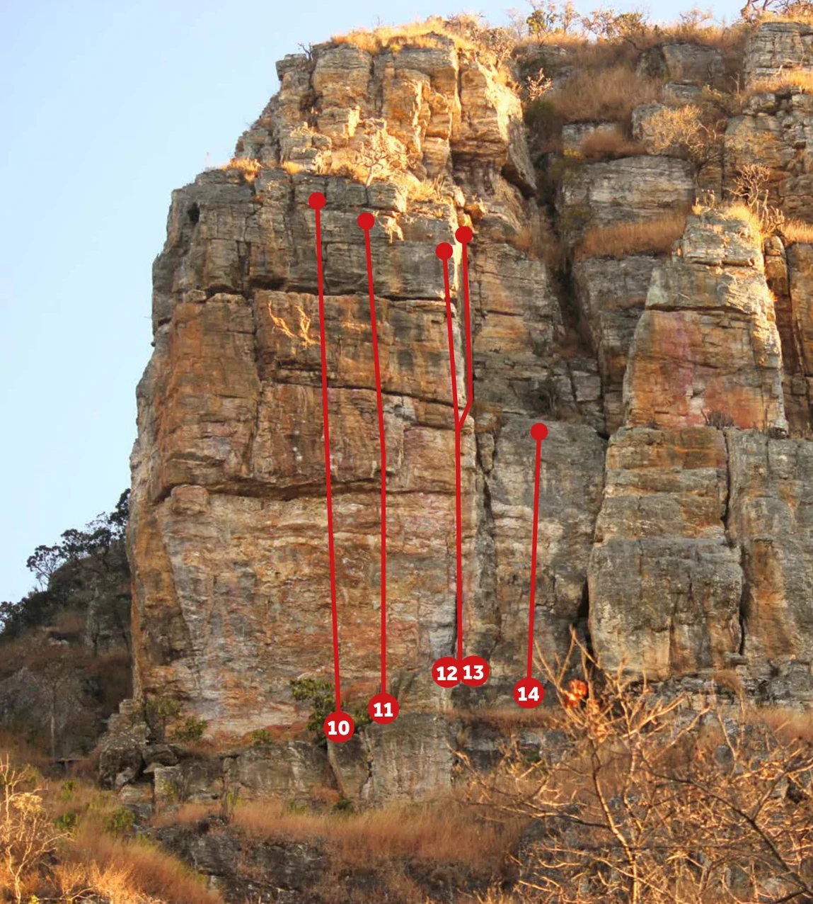
    - **largura_mapa**: 1149
    - **altura_mapa**: 1276
    - **pontos_de_interesse**:
      - **[0]**:
        - **id**: 29tVY3b9Mgy4v4
        - **uid**: 29tVY3b9Mgy4v4
        - **rotulo**: 10
        - **circulo**:
          - **x**: 479
          - **y**: 1026
          - **raio**: 22
        - **label**: 10
      - **[1]**:
        - **id**: QghijXjvRmqKFV
        - **uid**: QghijXjvRmqKFV
        - **rotulo**: 11
        - **circulo**:
          - **x**: 542
          - **y**: 1000
          - **raio**: 22
        - **label**: 11
      - **[2]**:
        - **id**: kgV2dNHXXefVTl
        - **uid**: kgV2dNHXXefVTl
        - **rotulo**: 12
        - **circulo**:
          - **x**: 632
          - **y**: 949
          - **raio**: 22
        - **label**: 12
      - **[3]**:
        - **id**: c1Li6WEMrI4ito
        - **uid**: c1Li6WEMrI4ito
        - **rotulo**: 13
        - **circulo**:
          - **x**: 670
          - **y**: 947
          - **raio**: 22
        - **label**: 13
      - **[4]**:
        - **id**: QqBq3ZguacLg81
        - **uid**: QqBq3ZguacLg81
        - **rotulo**: 14
        - **circulo**:
          - **x**: 747
          - **y**: 979
          - **raio**: 22
        - **label**: 14
    - **referencias**:
      - **[0]**:
        - **alvo_uid**: fym9kYv9Jn2PUT
        - **pontos_uids**:
          - 29tVY3b9Mgy4v4
        - **escalada**: Grande Hotel
        - **ids**:
          - 29tVY3b9Mgy4v4
      - **[1]**:
        - **alvo_uid**: ToJzvJZ4g2QF1v
        - **pontos_uids**:
          - QghijXjvRmqKFV
        - **escalada**: Cura Trimura
        - **ids**:
          - QghijXjvRmqKFV
      - **[2]**:
        - **alvo_uid**: gw1vn1qlIUsbg7
        - **pontos_uids**:
          - kgV2dNHXXefVTl
        - **escalada**: Próprio Veneno
        - **ids**:
          - kgV2dNHXXefVTl
      - **[3]**:
        - **alvo_uid**: eXK1iNTAqd3QtC
        - **pontos_uids**:
          - c1Li6WEMrI4ito
        - **escalada**: Própria Loucura
        - **ids**:
          - c1Li6WEMrI4ito
      - **[4]**:
        - **alvo_uid**: hUw8t3L6g7y34K
        - **pontos_uids**:
          - QqBq3ZguacLg81
        - **escalada**: Honney Money
        - **ids**:
          - QqBq3ZguacLg81
  - **[3]**:
    - **caminho_imagem_mapa**: 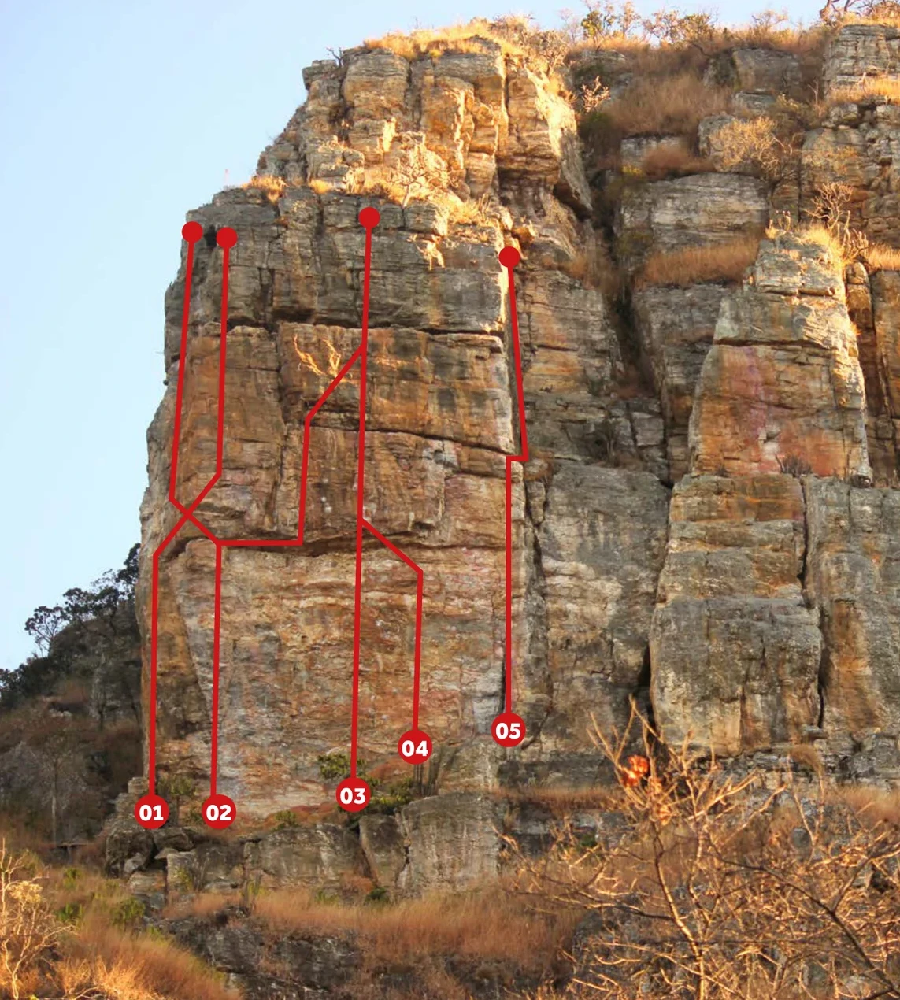
    - **largura_mapa**: 1143
    - **altura_mapa**: 1270
    - **pontos_de_interesse**:
      - **[0]**:
        - **id**: IqSYGhdzyuj3lR
        - **uid**: IqSYGhdzyuj3lR
        - **rotulo**: 01
        - **circulo**:
          - **x**: 192
          - **y**: 1032
          - **raio**: 22
        - **label**: 01
      - **[1]**:
        - **id**: YFAtqkAMDBp73b
        - **uid**: YFAtqkAMDBp73b
        - **rotulo**: 02
        - **circulo**:
          - **x**: 278
          - **y**: 1031
          - **raio**: 22
        - **label**: 02
      - **[2]**:
        - **id**: j16r3CdbNAkHic
        - **uid**: j16r3CdbNAkHic
        - **rotulo**: 03
        - **circulo**:
          - **x**: 448
          - **y**: 1009
          - **raio**: 22
        - **label**: 03
      - **[3]**:
        - **id**: 3uaXpRvqiAPcZo
        - **uid**: 3uaXpRvqiAPcZo
        - **rotulo**: 04
        - **circulo**:
          - **x**: 527
          - **y**: 949
          - **raio**: 22
        - **label**: 04
      - **[4]**:
        - **id**: u9bSuW2bbIYmMu
        - **uid**: u9bSuW2bbIYmMu
        - **rotulo**: 05
        - **circulo**:
          - **x**: 646
          - **y**: 927
          - **raio**: 22
        - **label**: 05
    - **referencias**:
      - **[0]**:
        - **alvo_uid**: Ap4exzEtVm2GOt
        - **pontos_uids**:
          - IqSYGhdzyuj3lR
        - **escalada**: Efeito Variado
        - **ids**:
          - IqSYGhdzyuj3lR
      - **[1]**:
        - **alvo_uid**: HeP33UtMx9NyRt
        - **pontos_uids**:
          - YFAtqkAMDBp73b
        - **escalada**: Só paracolateral
        - **ids**:
          - YFAtqkAMDBp73b
      - **[2]**:
        - **alvo_uid**: fym9kYv9Jn2PUT
        - **pontos_uids**:
          - j16r3CdbNAkHic
        - **escalada**: Grande Hotel
        - **ids**:
          - j16r3CdbNAkHic
      - **[3]**:
        - **alvo_uid**: QHLMUlvIn5LlWi
        - **pontos_uids**:
          - 3uaXpRvqiAPcZo
        - **escalada**: Trimura do Hotel
        - **ids**:
          - 3uaXpRvqiAPcZo
      - **[4]**:
        - **alvo_uid**: eXK1iNTAqd3QtC
        - **pontos_uids**:
          - u9bSuW2bbIYmMu
        - **escalada**: Própria Loucura
        - **ids**:
          - u9bSuW2bbIYmMu
- **escaladas**:
  - **[0]**:
    - **uid**: 8zeHKHtgkbIHEP
    - **via_esportiva**:
      - **nome**: Pêro no Mucho
      - **dificuldade**: BR_5
      - **extensao**: 10
      - **quantidade_protecoes_intermediarias**: 6
      - **quantidade_protecoes_parada**: 1
      - **conquistadores**:
        - Diego Leonardo
        - Jéssica Basso
      - **data_abertura**: 2014
  - **[1]**:
    - **uid**: WKL29Y4R3HGPWE
    - **via_esportiva**:
      - **nome**: Meia Hora
      - **dificuldade**: BR_6
      - **extensao**: 15
      - **quantidade_protecoes_intermediarias**: 6
      - **quantidade_protecoes_parada**: 2
      - **conquistadores**:
        - Diego Leonardo
        - Daiex de Almeida
      - **data_abertura**: 2012
  - **[2]**:
    - **uid**: x24Bxs1Za3Ipkh
    - **via_esportiva**:
      - **nome**: Falta de Educação
      - **dificuldade**: BR_6SUP
      - **extensao**: 20
      - **quantidade_protecoes_intermediarias**: 7
      - **quantidade_protecoes_parada**: 2
      - **conquistadores**:
        - Diego Leonardo
        - Daiex de Almeida
      - **data_abertura**: 2012
  - **[3]**:
    - **uid**: lMIJftJKh2tQZW
    - **via_esportiva**:
      - **nome**: De Mão Beijada
      - **dificuldade**: BR_7A
      - **extensao**: 20
      - **quantidade_protecoes_intermediarias**: 9
      - **quantidade_protecoes_parada**: 2
      - **conquistadores**:
        - Laurêncio Jr
        - Diego Leonardo
      - **data_abertura**: 2012
  - **[4]**:
    - **uid**: 8I5EZreTIOhFyd
    - **via_esportiva**:
      - **descricao**: Falta topo.
      - **nome**: Efeito Cascata
      - **dificuldade**: BR_7C
      - **extensao**: 20
      - **quantidade_protecoes_intermediarias**: 5
      - **conquistadores**:
        - Alessandro Imbeloni
        - Mara Imbeloni
      - **data_abertura**: 2013
  - **[5]**:
    - **uid**: YSdMMLY5O3o0Dh
    - **via_esportiva**:
      - **nome**: Efeito Colateral
      - **dificuldade**: BR_9A
      - **extensao**: 25
      - **quantidade_protecoes_intermediarias**: 8
      - **quantidade_protecoes_parada**: 2
      - **conquistadores**:
        - Diego
        - Difora
        - Chorão
      - **data_abertura**: 2008
  - **[6]**:
    - **uid**: iQdxWwg2mIyUcM
    - **via_esportiva**:
      - **nome**: Só pra Variar
      - **dificuldade**: BR_9C
      - **extensao**: 25
      - **quantidade_protecoes_intermediarias**: 9
      - **quantidade_protecoes_parada**: 2
      - **conquistadores**:
        - Diego Leonardo
        - Gustavo Maneira
      - **data_abertura**: 2011
  - **[7]**:
    - **uid**: 9g5t6d0Hq1t6eQ
    - **via_esportiva**:
      - **nome**: Rock Supimpa
      - **dificuldade**: BR_9B
      - **extensao**: 25
      - **quantidade_protecoes_intermediarias**: 8
      - **quantidade_protecoes_parada**: 2
      - **conquistadores**:
        - Diego Leonardo
        - Gustavo Maneira
      - **data_abertura**: 2012
  - **[8]**:
    - **uid**: xVWScK5FYpgqQy
    - **via_esportiva**:
      - **nome**: Você Decide
      - **dificuldade**: BR_8A
      - **extensao**: 10
      - **quantidade_protecoes_intermediarias**: 4
      - **quantidade_protecoes_parada**: 2
      - **conquistadores**:
        - Diego Leonardo
        - Pedro Andrade
      - **data_abertura**: 2014
  - **[9]**:
    - **uid**: fym9kYv9Jn2PUT
    - **via_esportiva**:
      - **nome**: Grande Hotel
      - **dificuldade**: BR_9A
      - **extensao**: 25
      - **quantidade_protecoes_intermediarias**: 9
      - **quantidade_protecoes_parada**: 2
      - **conquistadores**:
        - Alexandre FEI
        - Diego Leonardo
      - **data_abertura**: 2013
  - **[10]**:
    - **uid**: ToJzvJZ4g2QF1v
    - **via_esportiva**:
      - **nome**: Cura Trimura
      - **dificuldade**: BR_8B
      - **extensao**: 25
      - **quantidade_protecoes_intermediarias**: 9
      - **quantidade_protecoes_parada**: 2
      - **conquistadores**:
        - Laurêncio Jr.
      - **data_abertura**: 2013
  - **[11]**:
    - **uid**: gw1vn1qlIUsbg7
    - **via_esportiva**:
      - **nome**: Próprio Veneno
      - **dificuldade**: BR_7C
      - **extensao**: 20
      - **quantidade_protecoes_intermediarias**: 6
      - **quantidade_protecoes_parada**: 2
      - **conquistadores**:
        - Laurêncio Jr
        - Rafael Furtado
      - **data_abertura**: 2013
  - **[12]**:
    - **uid**: eXK1iNTAqd3QtC
    - **via_esportiva**:
      - **nome**: Própria Loucura
      - **dificuldade**: BR_9A
      - **extensao**: 20
      - **quantidade_protecoes_intermediarias**: 8
      - **quantidade_protecoes_parada**: 2
      - **conquistadores**:
        - Diego Leonardo
        - Rafael Furtado
      - **data_abertura**: 2016
  - **[13]**:
    - **uid**: hUw8t3L6g7y34K
    - **via_esportiva**:
      - **nome**: Honney Money
      - **dificuldade**: BR_6SUP
      - **extensao**: 10
      - **quantidade_protecoes_intermediarias**: 6
      - **quantidade_protecoes_parada**: 2
      - **conquistadores**:
        - Diego
        - Gustavinho
        - Rafinha
      - **data_abertura**: 2016
  - **[14]**:
    - **uid**: Ap4exzEtVm2GOt
    - **via_esportiva**:
      - **descricao**: Faz o primeiro crux da Efeito Colateral e o segundo crux da Só Pra Variar.
      - **nome**: Efeito Variado
      - **dificuldade**: BR_9A
  - **[15]**:
    - **uid**: HeP33UtMx9NyRt
    - **via_esportiva**:
      - **descricao**: Primeiro crux da via Só pra Variar com segundo crux da Efeito Colateral.
      - **nome**: Só paracolateral
      - **dificuldade**: BR_9A
  - **[16]**:
    - **uid**: QHLMUlvIn5LlWi
    - **via_esportiva**:
      - **descricao**: Primeiro crux da Cura Trimura com Crux da Grande Hotel.
      - **nome**: Trimura do Hotel
      - **dificuldade**: PROJETO
- **precomputados**:
  - **total_escaladas**: 17
  - **total_esportivas**: 17

## Parte: setor_paulistas

### Setor (Pico: Bocaina Park)

- **descricao**:
    # Setor Paulistas
    
    O Setor Paulistas contém uma grande variedade de vias técnicas, com destaque para a "Cortina de Fumaça" (9c).
    
    > [!TIP]
    > Leve seu lixo e outro que encontrar para a cidade. Não faça necessidades fisiológicas nas trilhas e base de vias. Avisar a administração sobre a abertura de novas vias de escalada. **USE CAPACETE NAS BASES DE VIAS DE ESCALADA.**
- **nome**: Paulistas
- **uid**: lqRtz0vbIZQGsV
- **caminho_imagem_capa**: 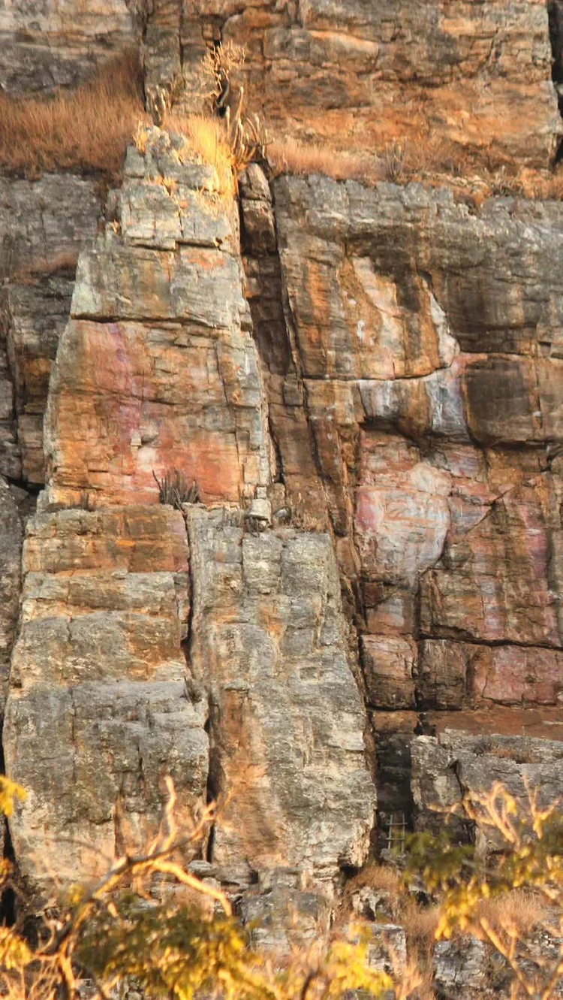
- **mapas**:
  - **[0]**:
    - **caminho_imagem_mapa**: 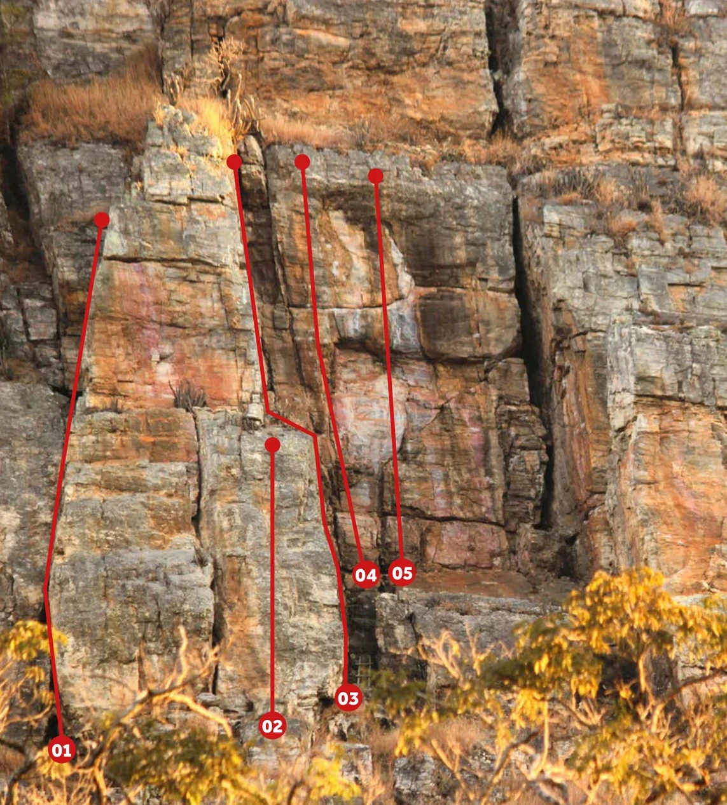
    - **largura_mapa**: 1143
    - **altura_mapa**: 1267
    - **pontos_de_interesse**:
      - **[0]**:
        - **id**: QmCpk76e3ZhLrV
        - **uid**: QmCpk76e3ZhLrV
        - **rotulo**: 01
        - **circulo**:
          - **x**: 97
          - **y**: 1180
          - **raio**: 22
        - **label**: 01
      - **[1]**:
        - **id**: SLmhBoAAdYc8xh
        - **uid**: SLmhBoAAdYc8xh
        - **rotulo**: 02
        - **circulo**:
          - **x**: 428
          - **y**: 1142
          - **raio**: 22
        - **label**: 02
      - **[2]**:
        - **id**: LJpYDXmUME5DOk
        - **uid**: LJpYDXmUME5DOk
        - **rotulo**: 03
        - **circulo**:
          - **x**: 548
          - **y**: 1098
          - **raio**: 22
        - **label**: 03
      - **[3]**:
        - **id**: 6bMiLyVancgKzu
        - **uid**: 6bMiLyVancgKzu
        - **rotulo**: 04
        - **circulo**:
          - **x**: 576
          - **y**: 904
          - **raio**: 22
        - **label**: 04
      - **[4]**:
        - **id**: DYFLxmXq3OA8Ro
        - **uid**: DYFLxmXq3OA8Ro
        - **rotulo**: 05
        - **circulo**:
          - **x**: 633
          - **y**: 902
          - **raio**: 22
        - **label**: 05
    - **referencias**:
      - **[0]**:
        - **alvo_uid**: dK3axNmwBvVzkv
        - **pontos_uids**:
          - QmCpk76e3ZhLrV
        - **escalada**: Física Quântica
        - **ids**:
          - QmCpk76e3ZhLrV
      - **[1]**:
        - **alvo_uid**: BMDfw8KmSwFl8r
        - **pontos_uids**:
          - SLmhBoAAdYc8xh
        - **escalada**: Chamasamiga
        - **ids**:
          - SLmhBoAAdYc8xh
      - **[2]**:
        - **alvo_uid**: s9GDqmsPHWE4pv
        - **pontos_uids**:
          - LJpYDXmUME5DOk
        - **escalada**: Acupuntura
        - **ids**:
          - LJpYDXmUME5DOk
      - **[3]**:
        - **alvo_uid**: FbUwXupN4POcp6
        - **pontos_uids**:
          - 6bMiLyVancgKzu
        - **escalada**: Capitão Bocaina
        - **ids**:
          - 6bMiLyVancgKzu
      - **[4]**:
        - **alvo_uid**: ylgFCOdbut2wke
        - **pontos_uids**:
          - DYFLxmXq3OA8Ro
        - **escalada**: Miragem
        - **ids**:
          - DYFLxmXq3OA8Ro
  - **[1]**:
    - **caminho_imagem_mapa**: 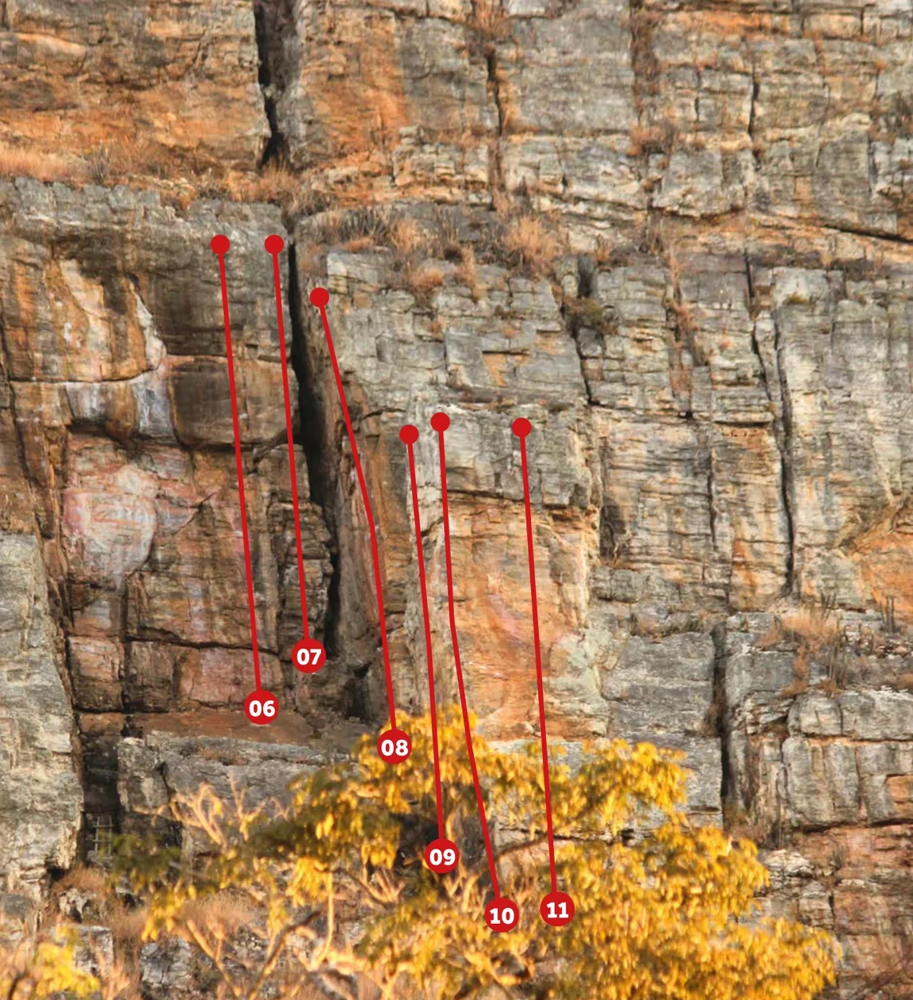
    - **largura_mapa**: 1152
    - **altura_mapa**: 1261
    - **pontos_de_interesse**:
      - **[0]**:
        - **id**: Fiqi4PRdQnQZkB
        - **uid**: Fiqi4PRdQnQZkB
        - **rotulo**: 06
        - **circulo**:
          - **x**: 330
          - **y**: 892
          - **raio**: 23
        - **label**: 06
      - **[1]**:
        - **id**: dVEg1kUMo7VSnT
        - **uid**: dVEg1kUMo7VSnT
        - **rotulo**: 07
        - **circulo**:
          - **x**: 389
          - **y**: 827
          - **raio**: 22
        - **label**: 07
      - **[2]**:
        - **id**: LVOimv61UZlH2t
        - **uid**: LVOimv61UZlH2t
        - **rotulo**: 08
        - **circulo**:
          - **x**: 498
          - **y**: 942
          - **raio**: 23
        - **label**: 08
      - **[3]**:
        - **id**: xghK6WxznTRTMO
        - **uid**: xghK6WxznTRTMO
        - **rotulo**: 09
        - **circulo**:
          - **x**: 558
          - **y**: 1079
          - **raio**: 22
        - **label**: 09
      - **[4]**:
        - **id**: JBsqtYZZWPEV3a
        - **uid**: JBsqtYZZWPEV3a
        - **rotulo**: 10
        - **circulo**:
          - **x**: 633
          - **y**: 1155
          - **raio**: 22
        - **label**: 10
      - **[5]**:
        - **id**: jkUjqewjfIbyFE
        - **uid**: jkUjqewjfIbyFE
        - **rotulo**: 11
        - **circulo**:
          - **x**: 703
          - **y**: 1147
          - **raio**: 22
        - **label**: 11
    - **referencias**:
      - **[0]**:
        - **alvo_uid**: WwcqkCPfDaBkYI
        - **pontos_uids**:
          - Fiqi4PRdQnQZkB
        - **escalada**: Cortina de Fumaça
        - **ids**:
          - Fiqi4PRdQnQZkB
      - **[1]**:
        - **alvo_uid**: IBjSFNeoeoI63h
        - **pontos_uids**:
          - dVEg1kUMo7VSnT
        - **escalada**: Sem Nome (Via 07)
        - **ids**:
          - dVEg1kUMo7VSnT
      - **[2]**:
        - **alvo_uid**: o9M6C6PP0H46Hp
        - **pontos_uids**:
          - JBsqtYZZWPEV3a
        - **escalada**: Decadentes
        - **ids**:
          - JBsqtYZZWPEV3a
      - **[3]**:
        - **alvo_uid**: 8099bJ1aHLMeNQ
        - **pontos_uids**:
          - jkUjqewjfIbyFE
        - **escalada**: Pelos de Aldebaran
        - **ids**:
          - jkUjqewjfIbyFE
      - **[4]**:
        - **alvo_uid**: jZimscxMxfMm12
        - **pontos_uids**:
          - LVOimv61UZlH2t
        - **escalada**: Pubianos
        - **ids**:
          - LVOimv61UZlH2t
      - **[5]**:
        - **alvo_uid**: suJqK4U9H2xovt
        - **pontos_uids**:
          - xghK6WxznTRTMO
        - **escalada**: Bocaina Roots
        - **ids**:
          - xghK6WxznTRTMO
  - **[2]**:
    - **caminho_imagem_mapa**: 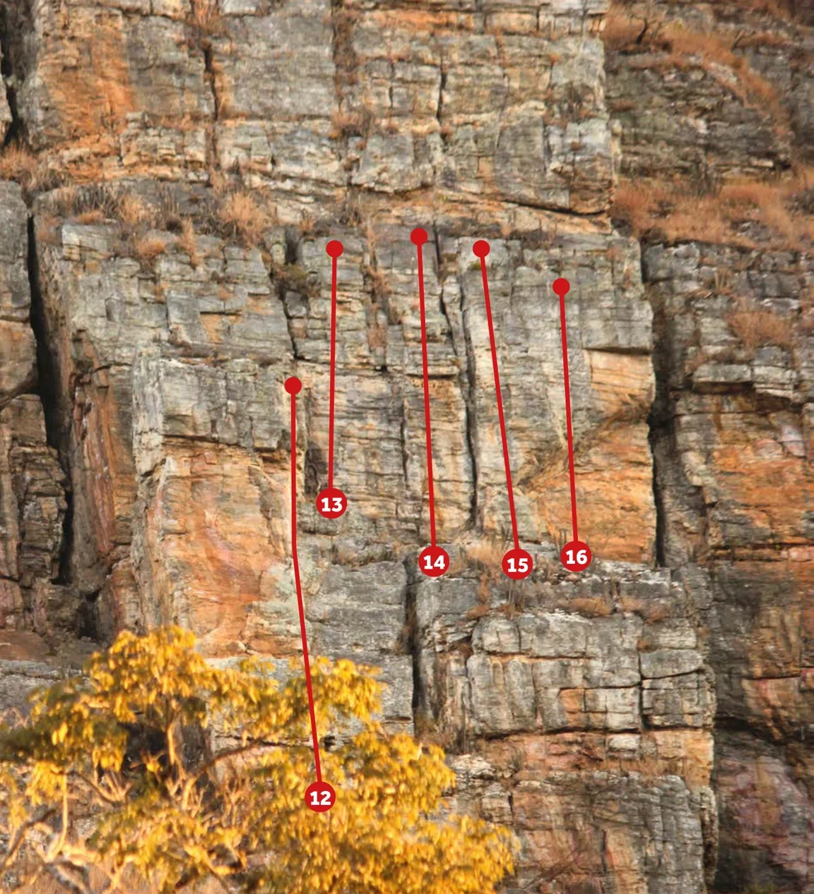
    - **largura_mapa**: 1152
    - **altura_mapa**: 1267
    - **pontos_de_interesse**:
      - **[0]**:
        - **id**: wLG9AEMAZeRdKl
        - **uid**: wLG9AEMAZeRdKl
        - **rotulo**: 12
        - **circulo**:
          - **x**: 453
          - **y**: 1129
          - **raio**: 22
        - **label**: 12
      - **[1]**:
        - **id**: Xgc2wH3Tr53z4p
        - **uid**: Xgc2wH3Tr53z4p
        - **rotulo**: 13
        - **circulo**:
          - **x**: 469
          - **y**: 714
          - **raio**: 22
        - **label**: 13
      - **[2]**:
        - **id**: kFwp5rHuXEnt0u
        - **uid**: kFwp5rHuXEnt0u
        - **rotulo**: 14
        - **circulo**:
          - **x**: 614
          - **y**: 796
          - **raio**: 22
        - **label**: 14
      - **[3]**:
        - **id**: MFDYeBrTikaIso
        - **uid**: MFDYeBrTikaIso
        - **rotulo**: 15
        - **circulo**:
          - **x**: 732
          - **y**: 800
          - **raio**: 22
        - **label**: 15
      - **[4]**:
        - **id**: hGvj0hexsTOV8f
        - **uid**: hGvj0hexsTOV8f
        - **rotulo**: 16
        - **circulo**:
          - **x**: 815
          - **y**: 788
          - **raio**: 22
        - **label**: 16
    - **referencias**:
      - **[0]**:
        - **alvo_uid**: p3ttzKCAv46AxK
        - **pontos_uids**:
          - wLG9AEMAZeRdKl
        - **escalada**: Ejaculação Precoce
        - **ids**:
          - wLG9AEMAZeRdKl
      - **[1]**:
        - **alvo_uid**: miGbrMteuZ0Gio
        - **pontos_uids**:
          - Xgc2wH3Tr53z4p
        - **escalada**: Via do Laurêncio
        - **ids**:
          - Xgc2wH3Tr53z4p
      - **[2]**:
        - **alvo_uid**: j2y3uGveSBERyA
        - **pontos_uids**:
          - kFwp5rHuXEnt0u
        - **escalada**: International love
        - **ids**:
          - kFwp5rHuXEnt0u
      - **[3]**:
        - **alvo_uid**: kz1wcURACdWrdR
        - **pontos_uids**:
          - MFDYeBrTikaIso
        - **escalada**: Cinquenteira
        - **ids**:
          - MFDYeBrTikaIso
      - **[4]**:
        - **alvo_uid**: 8V5oh4Wq9fdPrf
        - **pontos_uids**:
          - hGvj0hexsTOV8f
        - **escalada**: Boa idéia
        - **ids**:
          - hGvj0hexsTOV8f
- **escaladas**:
  - **[0]**:
    - **uid**: dK3axNmwBvVzkv
    - **via_esportiva**:
      - **nome**: Física Quântica
      - **dificuldade**: BR_7A
      - **extensao**: 20
      - **conquistadores**:
        - Laurêncio
        - Daiex
      - **data_abertura**: 2015
  - **[1]**:
    - **uid**: BMDfw8KmSwFl8r
    - **via_esportiva**:
      - **nome**: Chamasamiga
      - **dificuldade**: INDEFINIDO
      - **extensao**: 12
      - **conquistadores**:
        - Diego Leonardo
        - Gustavo Maneira
      - **data_abertura**: 2016
  - **[2]**:
    - **uid**: s9GDqmsPHWE4pv
    - **via_esportiva**:
      - **nome**: Acupuntura
      - **dificuldade**: BR_6SUP
      - **extensao**: 25
      - **quantidade_protecoes_intermediarias**: 8
      - **quantidade_protecoes_parada**: 2
      - **conquistadores**:
        - Paulinho (RP)
      - **data_abertura**: 2008
  - **[3]**:
    - **uid**: FbUwXupN4POcp6
    - **via_esportiva**:
      - **nome**: Capitão Bocaina
      - **dificuldade**: BR_8A
      - **extensao**: 15
      - **quantidade_protecoes_intermediarias**: 6
      - **quantidade_protecoes_parada**: 2
      - **conquistadores**:
        - Alexandre Fei
        - Laurêncio
      - **data_abertura**: 2014
  - **[4]**:
    - **uid**: ylgFCOdbut2wke
    - **via_esportiva**:
      - **nome**: Miragem
      - **dificuldade**: BR_9B
      - **extensao**: 15
      - **quantidade_protecoes_intermediarias**: 7
      - **quantidade_protecoes_parada**: 2
      - **conquistadores**:
        - Diego Leonardo
        - Rafael Furtado
      - **data_abertura**: 2015
  - **[5]**:
    - **uid**: WwcqkCPfDaBkYI
    - **via_esportiva**:
      - **nome**: Cortina de Fumaça
      - **dificuldade**: BR_9C
      - **extensao**: 15
      - **quantidade_protecoes_intermediarias**: 6
      - **quantidade_protecoes_parada**: 2
      - **conquistadores**:
        - Diego Leonardo
        - Gustavo Maneira
      - **data_abertura**: 2012
  - **[6]**:
    - **uid**: IBjSFNeoeoI63h
    - **via_esportiva**:
      - **nome**: Sem Nome (Via 07)
      - **dificuldade**: BR_7B
      - **extensao**: 10
      - **quantidade_protecoes_intermediarias**: 5
      - **quantidade_protecoes_parada**: 2
      - **conquistadores**:
        - Rafael Furtado
        - Gustavo Maneira
      - **data_abertura**: 2015
  - **[7]**:
    - **uid**: jZimscxMxfMm12
    - **via_esportiva**:
      - **nome**: Pubianos
      - **dificuldade**: BR_8A
      - **extensao**: 15
      - **quantidade_protecoes_intermediarias**: 6
      - **quantidade_protecoes_parada**: 2
      - **conquistadores**:
        - Paulinho (RP)
        - Alexandre Fei
      - **data_abertura**: 2014
  - **[8]**:
    - **uid**: suJqK4U9H2xovt
    - **via_esportiva**:
      - **nome**: Bocaina Roots
      - **dificuldade**: BR_7A
      - **extensao**: 10
      - **quantidade_protecoes_intermediarias**: 8
      - **quantidade_protecoes_parada**: 2
      - **conquistadores**:
        - Diego Leonardo
        - Gustavo Maneira
      - **data_abertura**: 2014
  - **[9]**:
    - **uid**: o9M6C6PP0H46Hp
    - **via_esportiva**:
      - **nome**: Decadentes
      - **dificuldade**: BR_7A
      - **extensao**: 15
      - **quantidade_protecoes_intermediarias**: 7
      - **quantidade_protecoes_parada**: 2
      - **conquistadores**:
        - Paulinho (RP)
        - Diego Leonardo
      - **data_abertura**: 2008/14
  - **[10]**:
    - **uid**: 8099bJ1aHLMeNQ
    - **via_esportiva**:
      - **nome**: Pelos de Aldebaran
      - **dificuldade**: BR_7C
      - **extensao**: 15
      - **quantidade_protecoes_intermediarias**: 8
      - **quantidade_protecoes_parada**: 2
      - **conquistadores**:
        - Laurêncio
        - Diego Leonardo
      - **data_abertura**: 2014
  - **[11]**:
    - **uid**: p3ttzKCAv46AxK
    - **via_esportiva**:
      - **nome**: Ejaculação Precoce
      - **dificuldade**: BR_7A
      - **extensao**: 15
      - **quantidade_protecoes_intermediarias**: 8
      - **quantidade_protecoes_parada**: 2
      - **conquistadores**:
        - Diego Leonardo
        - Laurêncio
      - **data_abertura**: 2014
  - **[12]**:
    - **uid**: miGbrMteuZ0Gio
    - **via_esportiva**:
      - **nome**: Via do Laurêncio
      - **dificuldade**: BR_6SUP
      - **extensao**: 8
      - **conquistadores**:
        - Laurêncio
        - Zé Roberto
      - **data_abertura**: 2014
  - **[13]**:
    - **uid**: j2y3uGveSBERyA
    - **via_esportiva**:
      - **nome**: International love
      - **dificuldade**: BR_7A
      - **extensao**: 12
      - **quantidade_protecoes_intermediarias**: 7
      - **quantidade_protecoes_parada**: 2
      - **conquistadores**:
        - Etienne
        - Diego Leonardo
      - **data_abertura**: 2014
  - **[14]**:
    - **uid**: kz1wcURACdWrdR
    - **via_esportiva**:
      - **nome**: Cinquenteira
      - **dificuldade**: BR_6SUP
      - **extensao**: 8
      - **quantidade_protecoes_intermediarias**: 6
      - **quantidade_protecoes_parada**: 2
      - **conquistadores**:
        - Diego Leonardo
        - Gustavo Maneira
      - **data_abertura**: 2014
  - **[15]**:
    - **uid**: 8V5oh4Wq9fdPrf
    - **via_esportiva**:
      - **nome**: Boa idéia
      - **dificuldade**: BR_6SUP
      - **extensao**: 8
      - **quantidade_protecoes_intermediarias**: 5
      - **quantidade_protecoes_parada**: 2
      - **conquistadores**:
        - Deigo Leonardo
        - Daiex de Almeida
      - **data_abertura**: 2014
- **precomputados**:
  - **total_escaladas**: 16
  - **total_esportivas**: 16

## Parte: setor_mezanino

### Setor (Pico: Bocaina Park)

- **descricao**:
    # Setor Mezanino
    
    O Setor Mezanino oferece uma excelente mistura de vias fáceis (5º grau) e caminhos extremamente difíceis ultrapassando o 10º grau.
    
    > [!TIP]
    > Leve seu lixo e outro que encontrar para a cidade. Não faça necessidades fisiológicas nas trilhas e base de vias. Avisar a administração sobre a abertura de novas vias de escalada. **USE CAPACETE NAS BASES DE VIAS DE ESCALADA.**
- **nome**: Mezanino
- **uid**: XtSJq3QnulIdf9
- **caminho_imagem_capa**: 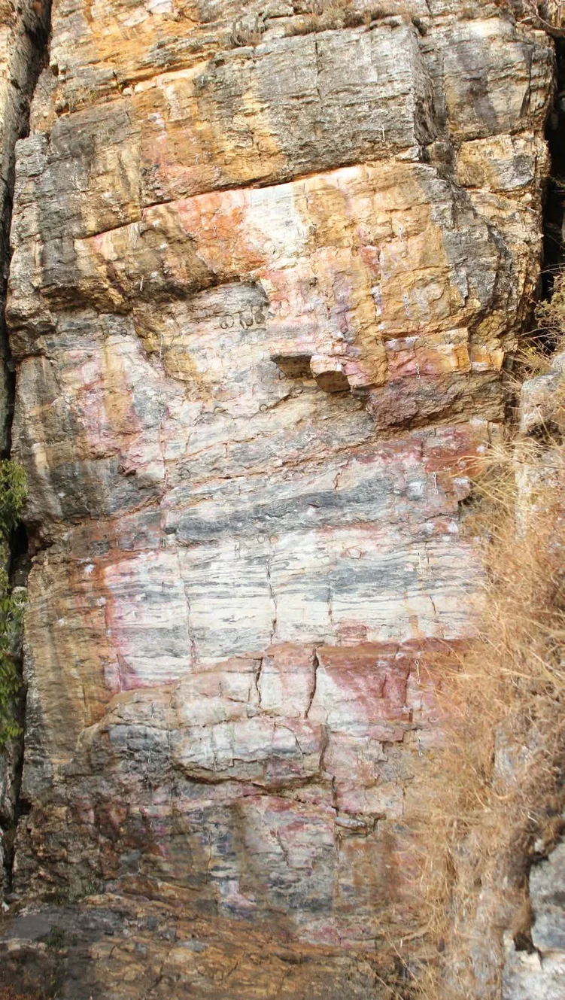
- **mapas**:
  - **[0]**:
    - **caminho_imagem_mapa**: 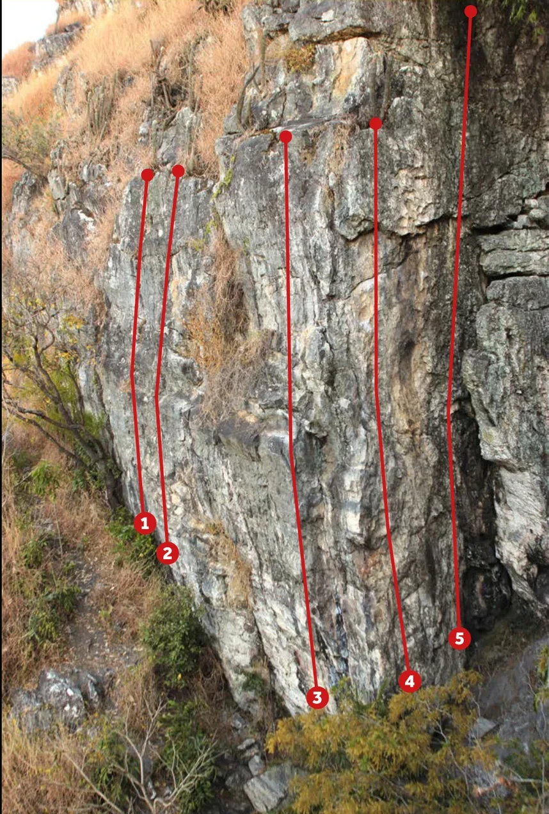
    - **largura_mapa**: 858
    - **altura_mapa**: 1272
    - **pontos_de_interesse**:
      - **[0]**:
        - **id**: GTvj00Y0ph9osU
        - **uid**: GTvj00Y0ph9osU
        - **rotulo**: 01
        - **circulo**:
          - **x**: 226
          - **y**: 818
          - **raio**: 18
        - **label**: 01
      - **[1]**:
        - **id**: OMqhzWj1QBrab8
        - **uid**: OMqhzWj1QBrab8
        - **rotulo**: 02
        - **circulo**:
          - **x**: 262
          - **y**: 864
          - **raio**: 18
        - **label**: 02
      - **[2]**:
        - **id**: hLClRTJlpfc7Rc
        - **uid**: hLClRTJlpfc7Rc
        - **rotulo**: 03
        - **circulo**:
          - **x**: 496
          - **y**: 1090
          - **raio**: 18
        - **label**: 03
      - **[3]**:
        - **id**: uKUBt2u6WgljiQ
        - **uid**: uKUBt2u6WgljiQ
        - **rotulo**: 04
        - **circulo**:
          - **x**: 641
          - **y**: 1065
          - **raio**: 18
        - **label**: 04
      - **[4]**:
        - **id**: VZYLXVwApIJypM
        - **uid**: VZYLXVwApIJypM
        - **rotulo**: 05
        - **circulo**:
          - **x**: 718
          - **y**: 997
          - **raio**: 18
        - **label**: 05
    - **referencias**:
      - **[0]**:
        - **alvo_uid**: 5GCU7GH7C7kiFK
        - **pontos_uids**:
          - GTvj00Y0ph9osU
        - **escalada**: Alberto Roberto
        - **ids**:
          - GTvj00Y0ph9osU
      - **[1]**:
        - **alvo_uid**: 7HodsiNYBt6gbD
        - **pontos_uids**:
          - OMqhzWj1QBrab8
        - **escalada**: Chico Anísio
        - **ids**:
          - OMqhzWj1QBrab8
      - **[2]**:
        - **alvo_uid**: DYaZant0J8Gui6
        - **pontos_uids**:
          - hLClRTJlpfc7Rc
        - **escalada**: Onjacktallbeck
        - **ids**:
          - hLClRTJlpfc7Rc
      - **[3]**:
        - **alvo_uid**: en2ai4q3jcEO5C
        - **pontos_uids**:
          - uKUBt2u6WgljiQ
        - **escalada**: Princípio Ativo
        - **ids**:
          - uKUBt2u6WgljiQ
      - **[4]**:
        - **alvo_uid**: l34xxltBQfjS2P
        - **pontos_uids**:
          - VZYLXVwApIJypM
        - **escalada**: Suindara
        - **ids**:
          - VZYLXVwApIJypM
  - **[1]**:
    - **caminho_imagem_mapa**: 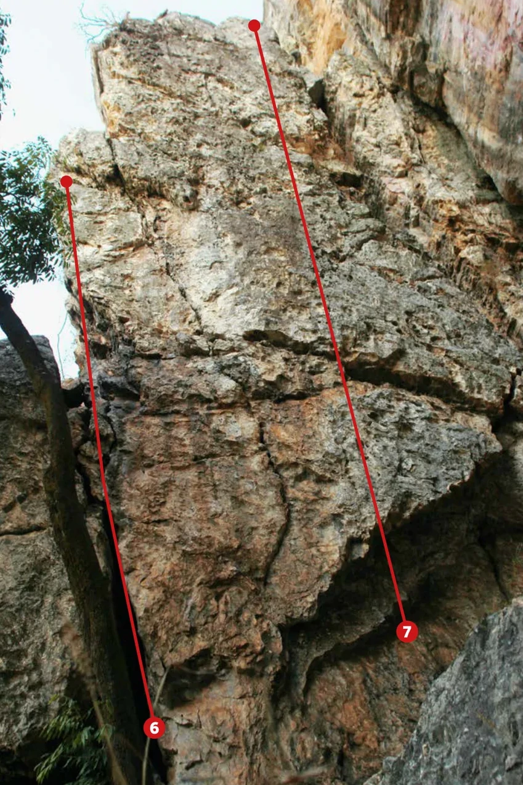
    - **largura_mapa**: 849
    - **altura_mapa**: 1273
    - **pontos_de_interesse**:
      - **[0]**:
        - **id**: AoAU97R3prQlf7
        - **uid**: AoAU97R3prQlf7
        - **rotulo**: 06
        - **circulo**:
          - **x**: 250
          - **y**: 1180
          - **raio**: 18
        - **label**: 06
      - **[1]**:
        - **id**: QjYbSF13EwdPZI
        - **uid**: QjYbSF13EwdPZI
        - **rotulo**: 07
        - **circulo**:
          - **x**: 661
          - **y**: 1024
          - **raio**: 18
        - **label**: 07
    - **referencias**:
      - **[0]**:
        - **alvo_uid**: lPmg97U63xDZy6
        - **pontos_uids**:
          - AoAU97R3prQlf7
        - **escalada**: São Jorge
        - **ids**:
          - AoAU97R3prQlf7
      - **[1]**:
        - **alvo_uid**: 46aiVD6DTgbMos
        - **pontos_uids**:
          - QjYbSF13EwdPZI
        - **escalada**: Ramadan
        - **ids**:
          - QjYbSF13EwdPZI
  - **[2]**:
    - **caminho_imagem_mapa**: 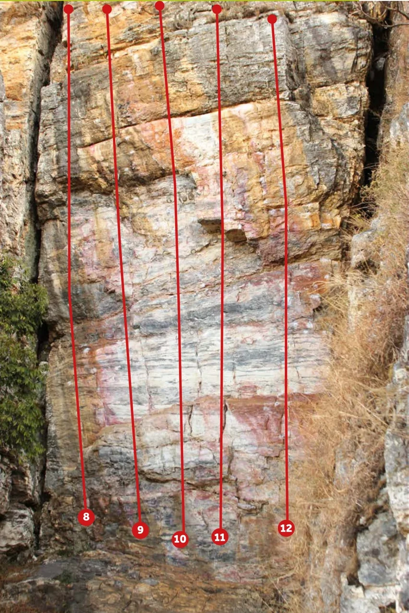
    - **largura_mapa**: 852
    - **altura_mapa**: 1275
    - **pontos_de_interesse**:
      - **[0]**:
        - **id**: GVeWle0FVGoMUC
        - **uid**: GVeWle0FVGoMUC
        - **rotulo**: 08
        - **circulo**:
          - **x**: 180
          - **y**: 1076
          - **raio**: 18
        - **label**: 08
      - **[1]**:
        - **id**: soq6LdwtfEy9Ot
        - **uid**: soq6LdwtfEy9Ot
        - **rotulo**: 09
        - **circulo**:
          - **x**: 292
          - **y**: 1103
          - **raio**: 18
        - **label**: 09
      - **[2]**:
        - **id**: kE6RTfFzSK958q
        - **uid**: kE6RTfFzSK958q
        - **rotulo**: 10
        - **circulo**:
          - **x**: 375
          - **y**: 1122
          - **raio**: 18
        - **label**: 10
      - **[3]**:
        - **id**: jUdoUYCASvNzMc
        - **uid**: jUdoUYCASvNzMc
        - **rotulo**: 11
        - **circulo**:
          - **x**: 458
          - **y**: 1116
          - **raio**: 18
        - **label**: 11
      - **[4]**:
        - **id**: 8ZEvdP9NmDyg4f
        - **uid**: 8ZEvdP9NmDyg4f
        - **rotulo**: 12
        - **circulo**:
          - **x**: 596
          - **y**: 1099
          - **raio**: 18
        - **label**: 12
    - **referencias**:
      - **[0]**:
        - **alvo_uid**: w6WDExD7bNX1i0
        - **pontos_uids**:
          - GVeWle0FVGoMUC
        - **escalada**: Sabotagem
        - **ids**:
          - GVeWle0FVGoMUC
      - **[1]**:
        - **alvo_uid**: SnZvDjTl710VE7
        - **pontos_uids**:
          - soq6LdwtfEy9Ot
        - **escalada**: Universo Paralelo
        - **ids**:
          - soq6LdwtfEy9Ot
      - **[2]**:
        - **alvo_uid**: YE9VE4VBKg6i0W
        - **pontos_uids**:
          - kE6RTfFzSK958q
        - **escalada**: Egocentrismo
        - **ids**:
          - kE6RTfFzSK958q
      - **[3]**:
        - **alvo_uid**: tRsCMe1V3E1XHr
        - **pontos_uids**:
          - jUdoUYCASvNzMc
        - **escalada**: Farinha do Mesmo Saco
        - **ids**:
          - jUdoUYCASvNzMc
      - **[4]**:
        - **alvo_uid**: r5w7kVq2wE2U0E
        - **pontos_uids**:
          - 8ZEvdP9NmDyg4f
        - **escalada**: Bafo de Onça
        - **ids**:
          - 8ZEvdP9NmDyg4f
  - **[3]**:
    - **caminho_imagem_mapa**: 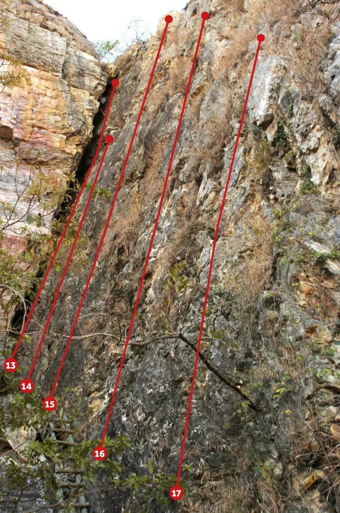
    - **largura_mapa**: 846
    - **altura_mapa**: 1275
    - **pontos_de_interesse**:
      - **[0]**:
        - **id**: Pqrg7anDY1mGbe
        - **uid**: Pqrg7anDY1mGbe
        - **rotulo**: 13
        - **circulo**:
          - **x**: 27
          - **y**: 907
          - **raio**: 18
        - **label**: 13
      - **[1]**:
        - **id**: siVE4gSeA3JC24
        - **uid**: siVE4gSeA3JC24
        - **rotulo**: 14
        - **circulo**:
          - **x**: 66
          - **y**: 959
          - **raio**: 18
        - **label**: 14
      - **[2]**:
        - **id**: D7QKJDZpXueX7d
        - **uid**: D7QKJDZpXueX7d
        - **rotulo**: 15
        - **circulo**:
          - **x**: 124
          - **y**: 1004
          - **raio**: 18
        - **label**: 15
      - **[3]**:
        - **id**: D3dWZQ7qjfwx6l
        - **uid**: D3dWZQ7qjfwx6l
        - **rotulo**: 16
        - **circulo**:
          - **x**: 248
          - **y**: 1127
          - **raio**: 18
        - **label**: 16
      - **[4]**:
        - **id**: rGGcxXm39CnRRy
        - **uid**: rGGcxXm39CnRRy
        - **rotulo**: 17
        - **circulo**:
          - **x**: 439
          - **y**: 1225
          - **raio**: 18
        - **label**: 17
    - **referencias**:
      - **[0]**:
        - **alvo_uid**: 0rg8WpSqdCPACP
        - **pontos_uids**:
          - Pqrg7anDY1mGbe
        - **escalada**: 12 anos
        - **ids**:
          - Pqrg7anDY1mGbe
      - **[1]**:
        - **alvo_uid**: 9jZyOcLQ1a08sR
        - **pontos_uids**:
          - siVE4gSeA3JC24
        - **escalada**: Mais Água no Feijão
        - **ids**:
          - siVE4gSeA3JC24
      - **[2]**:
        - **alvo_uid**: 7AyYXMLc3o6BEi
        - **pontos_uids**:
          - D7QKJDZpXueX7d
        - **escalada**: Puberdade
        - **ids**:
          - D7QKJDZpXueX7d
      - **[3]**:
        - **alvo_uid**: hduwjwGjedu4vQ
        - **pontos_uids**:
          - D3dWZQ7qjfwx6l
        - **escalada**: Eldorado
        - **ids**:
          - D3dWZQ7qjfwx6l
      - **[4]**:
        - **alvo_uid**: NzL6RJuK2dbT0x
        - **pontos_uids**:
          - rGGcxXm39CnRRy
        - **escalada**: Mais uma Prova de Amor
        - **ids**:
          - rGGcxXm39CnRRy
  - **[4]**:
    - **caminho_imagem_mapa**: 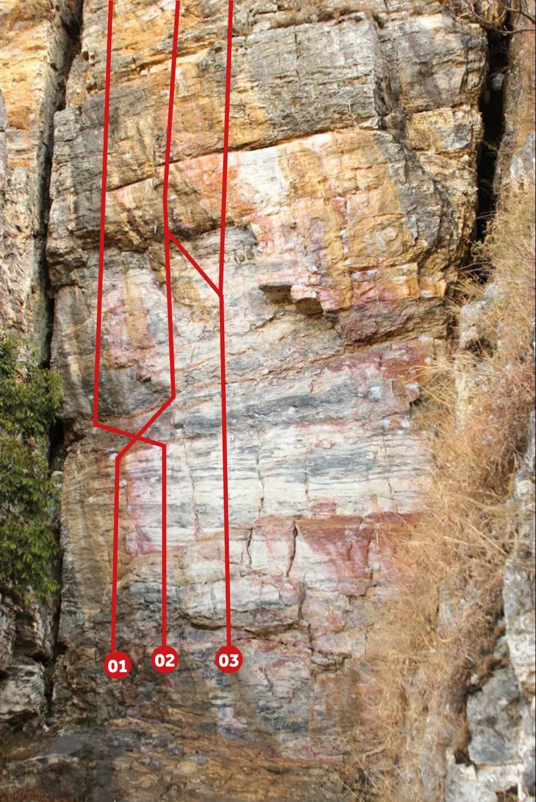
    - **largura_mapa**: 854
    - **altura_mapa**: 1275
    - **pontos_de_interesse**:
      - **[0]**:
        - **id**: 56sHbocurTc3qM
        - **uid**: 56sHbocurTc3qM
        - **rotulo**: 01
        - **circulo**:
          - **x**: 187
          - **y**: 1057
          - **raio**: 22
        - **label**: 01
      - **[1]**:
        - **id**: 8kr8gGDdtU6g3p
        - **uid**: 8kr8gGDdtU6g3p
        - **rotulo**: 02
        - **circulo**:
          - **x**: 263
          - **y**: 1049
          - **raio**: 22
        - **label**: 02
      - **[2]**:
        - **id**: 0oyObWuOWQ1NGK
        - **uid**: 0oyObWuOWQ1NGK
        - **rotulo**: 03
        - **circulo**:
          - **x**: 365
          - **y**: 1049
          - **raio**: 22
        - **label**: 03
    - **referencias**:
      - **[0]**:
        - **alvo_uid**: e77vd27xDy4gET
        - **pontos_uids**:
          - 56sHbocurTc3qM
        - **escalada**: Sabotagem do Universo
        - **ids**:
          - 56sHbocurTc3qM
      - **[1]**:
        - **alvo_uid**: hPdohjQToeibRU
        - **pontos_uids**:
          - 8kr8gGDdtU6g3p
        - **escalada**: Universo Sabotada
        - **ids**:
          - 8kr8gGDdtU6g3p
      - **[2]**:
        - **alvo_uid**: UClQOb9FcAtOCz
        - **pontos_uids**:
          - 0oyObWuOWQ1NGK
        - **escalada**: Ego Paralelo
        - **ids**:
          - 0oyObWuOWQ1NGK
- **escaladas**:
  - **[0]**:
    - **uid**: 5GCU7GH7C7kiFK
    - **via_esportiva**:
      - **nome**: Alberto Roberto
      - **dificuldade**: BR_6
      - **extensao**: 8
      - **quantidade_protecoes_intermediarias**: 3
      - **quantidade_protecoes_parada**: 2
      - **conquistadores**:
        - Felipe Tavares
        - Gustavo Maneira
      - **data_abertura**: 2011
  - **[1]**:
    - **uid**: 7HodsiNYBt6gbD
    - **via_esportiva**:
      - **nome**: Chico Anísio
      - **dificuldade**: BR_6
      - **extensao**: 8
      - **quantidade_protecoes_intermediarias**: 3
      - **quantidade_protecoes_parada**: 2
      - **conquistadores**:
        - Diego Leonardo
      - **data_abertura**: 2011
  - **[2]**:
    - **uid**: DYaZant0J8Gui6
    - **via_esportiva**:
      - **nome**: Onjacktallbeck
      - **dificuldade**: BR_7B
      - **extensao**: 10
      - **quantidade_protecoes_intermediarias**: 5
      - **quantidade_protecoes_parada**: 2
      - **conquistadores**:
        - Diego Leonardo
      - **data_abertura**: 2011
  - **[3]**:
    - **uid**: en2ai4q3jcEO5C
    - **via_esportiva**:
      - **nome**: Princípio Ativo
      - **dificuldade**: BR_7A
      - **extensao**: 10
      - **quantidade_protecoes_intermediarias**: 5
      - **quantidade_protecoes_parada**: 2
      - **conquistadores**:
        - Laurêncio
        - Daiex
      - **data_abertura**: 2011
  - **[4]**:
    - **uid**: l34xxltBQfjS2P
    - **via_esportiva**:
      - **nome**: Suindara
      - **dificuldade**: BR_6SUP
      - **extensao**: 10
      - **quantidade_protecoes_intermediarias**: 5
      - **quantidade_protecoes_parada**: 2
      - **conquistadores**:
        - Laurêncio
        - Daiex
      - **data_abertura**: 2011
  - **[5]**:
    - **uid**: lPmg97U63xDZy6
    - **via_esportiva**:
      - **nome**: São Jorge
      - **dificuldade**: BR_7B
      - **extensao**: 25
      - **quantidade_protecoes_intermediarias**: 9
      - **quantidade_protecoes_parada**: 2
      - **conquistadores**:
        - Laurêncio
        - Daiex
      - **data_abertura**: 2011
  - **[6]**:
    - **uid**: 46aiVD6DTgbMos
    - **via_esportiva**:
      - **nome**: Ramadan
      - **dificuldade**: BR_6SUP
      - **extensao**: 20
      - **quantidade_protecoes_intermediarias**: 7
      - **quantidade_protecoes_parada**: 2
      - **conquistadores**:
        - Diego
        - Laurêncio
      - **data_abertura**: 2012
  - **[7]**:
    - **uid**: w6WDExD7bNX1i0
    - **via_esportiva**:
      - **nome**: Sabotagem
      - **dificuldade**: BR_10A
      - **extensao**: 25
      - **quantidade_protecoes_intermediarias**: 9
      - **quantidade_protecoes_parada**: 2
      - **conquistadores**:
        - Rafael Passos
      - **data_abertura**: 2011
  - **[8]**:
    - **uid**: SnZvDjTl710VE7
    - **via_esportiva**:
      - **nome**: Universo Paralelo
      - **dificuldade**: BR_10B
      - **extensao**: 20
      - **quantidade_protecoes_intermediarias**: 11
      - **quantidade_protecoes_parada**: 2
      - **conquistadores**:
        - Diego
        - Laurêncio
      - **data_abertura**: 2011
  - **[9]**:
    - **uid**: YE9VE4VBKg6i0W
    - **via_esportiva**:
      - **nome**: Egocentrismo
      - **dificuldade**: BR_10B
      - **extensao**: 25
      - **quantidade_protecoes_intermediarias**: 11
      - **quantidade_protecoes_parada**: 2
      - **conquistadores**:
        - Diego Leonardo
        - Laurêncio
        - Rafinha
      - **data_abertura**: 2011
  - **[10]**:
    - **uid**: tRsCMe1V3E1XHr
    - **via_esportiva**:
      - **nome**: Farinha do Mesmo Saco
      - **dificuldade**: BR_9B
      - **extensao**: 20
      - **quantidade_protecoes_intermediarias**: 8
      - **quantidade_protecoes_parada**: 2
      - **conquistadores**:
        - Diego
        - Gustavo
      - **data_abertura**: 2011
  - **[11]**:
    - **uid**: r5w7kVq2wE2U0E
    - **via_esportiva**:
      - **nome**: Bafo de Onça
      - **dificuldade**: BR_9A
      - **extensao**: 17
      - **quantidade_protecoes_intermediarias**: 8
      - **quantidade_protecoes_parada**: 2
      - **conquistadores**:
        - Daiex
        - Diego
        - Gustavo Versiani
      - **data_abertura**: 2011
  - **[12]**:
    - **uid**: 0rg8WpSqdCPACP
    - **via_esportiva**:
      - **nome**: 12 anos
      - **dificuldade**: BR_5
      - **extensao**: 20
      - **conquistadores**:
        - Diego Leonardo
      - **data_abertura**: 2012
  - **[13]**:
    - **uid**: 9jZyOcLQ1a08sR
    - **via_esportiva**:
      - **nome**: Mais Água no Feijão
      - **dificuldade**: BR_5
      - **extensao**: 15
      - **conquistadores**:
        - Juliano Peter Parker
      - **data_abertura**: 2015
  - **[14]**:
    - **uid**: 7AyYXMLc3o6BEi
    - **via_esportiva**:
      - **nome**: Puberdade
      - **dificuldade**: BR_5
      - **extensao**: 20
      - **quantidade_protecoes_intermediarias**: 9
      - **quantidade_protecoes_parada**: 2
      - **conquistadores**:
        - Diego Leonardo
      - **data_abertura**: 2012
  - **[15]**:
    - **uid**: hduwjwGjedu4vQ
    - **via_esportiva**:
      - **nome**: Eldorado
      - **dificuldade**: BR_5
      - **extensao**: 20
      - **conquistadores**:
        - Juliano Peter Parker
      - **data_abertura**: 2015
  - **[16]**:
    - **uid**: NzL6RJuK2dbT0x
    - **via_esportiva**:
      - **nome**: Mais uma Prova de Amor
      - **dificuldade**: BR_5
      - **extensao**: 20
      - **conquistadores**:
        - Juliano Peter Parker
      - **data_abertura**: 2015
  - **[17]**:
    - **uid**: e77vd27xDy4gET
    - **via_esportiva**:
      - **descricao**: Primeiro crux da Sabotagem com o segundo crux da Universo Paralelo.
      - **nome**: Sabotagem do Universo
      - **dificuldade**: BR_10B
  - **[18]**:
    - **uid**: hPdohjQToeibRU
    - **via_esportiva**:
      - **descricao**: Primeiro crux da Universo Paralelo com o segundo crux da Sabotagem.
      - **nome**: Universo Sabotada
      - **dificuldade**: BR_9B
  - **[19]**:
    - **uid**: UClQOb9FcAtOCz
    - **via_esportiva**:
      - **descricao**: Primeiro crux da Egocentrismo com o segundo crux da Universo Paralelo.
      - **nome**: Ego Paralelo
      - **dificuldade**: BR_10C
- **precomputados**:
  - **total_escaladas**: 20
  - **total_esportivas**: 20

## Parte: setor_shana_crazy

### Setor (Pico: Bocaina Park)

- **descricao**:
    # Setor Shana Crazy
    
    O Setor Shana Crazy possui vias curtas e intensas, variando do 4º ao 7º grau.
    
    > [!TIP]
    > Leve seu lixo e outro que encontrar para a cidade. Não faça necessidades fisiológicas nas trilhas e base de vias. Avisar a administração sobre a abertura de novas vias de escalada. **USE CAPACETE NAS BASES DE VIAS DE ESCALADA.**
- **nome**: Shana Crazy
- **uid**: ALlNMayNg4qW0W
- **caminho_imagem_capa**: 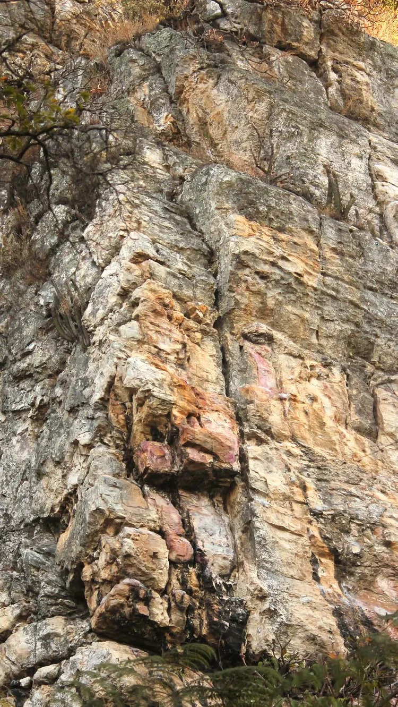
- **mapas**:
  - **[0]**:
    - **caminho_imagem_mapa**: 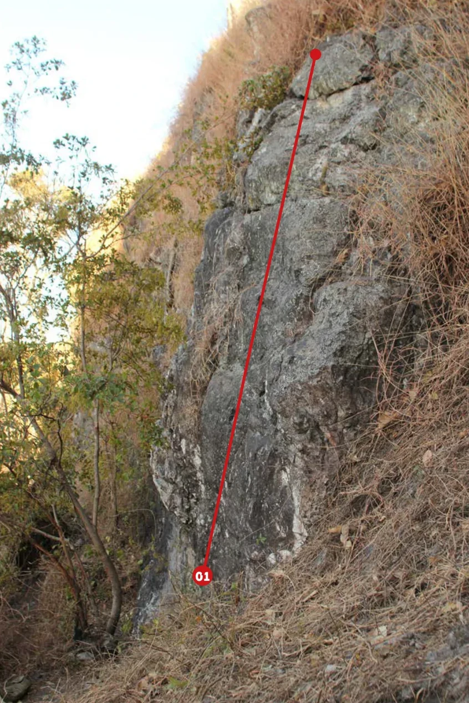
    - **largura_mapa**: 846
    - **altura_mapa**: 1267
    - **pontos_de_interesse**:
      - **[0]**:
        - **id**: 3Lyfms77DTU25h
        - **uid**: 3Lyfms77DTU25h
        - **rotulo**: 01
        - **circulo**:
          - **x**: 365
          - **y**: 1038
          - **raio**: 18
        - **label**: 01
    - **referencias**:
      - **[0]**:
        - **alvo_uid**: KtP05CrUDquMa2
        - **pontos_uids**:
          - 3Lyfms77DTU25h
        - **escalada**: Caroço de Manga
        - **ids**:
          - 3Lyfms77DTU25h
  - **[1]**:
    - **caminho_imagem_mapa**: 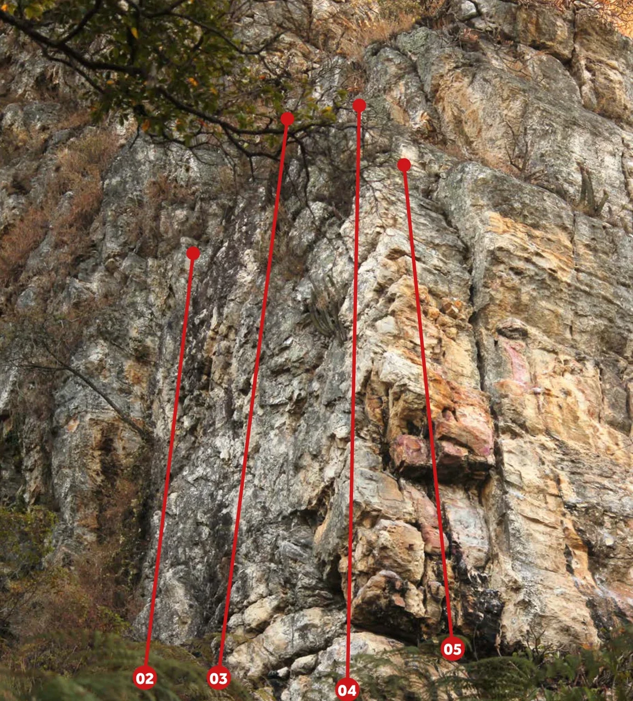
    - **largura_mapa**: 1142
    - **altura_mapa**: 1264
    - **pontos_de_interesse**:
      - **[0]**:
        - **id**: l00ZSL8CowRe11
        - **uid**: l00ZSL8CowRe11
        - **rotulo**: 02
        - **circulo**:
          - **x**: 262
          - **y**: 1222
          - **raio**: 22
        - **label**: 02
      - **[1]**:
        - **id**: cqrWwBV63APeld
        - **uid**: cqrWwBV63APeld
        - **rotulo**: 03
        - **circulo**:
          - **x**: 394
          - **y**: 1222
          - **raio**: 22
        - **label**: 03
      - **[2]**:
        - **id**: 2Fg27UblG0q6t2
        - **uid**: 2Fg27UblG0q6t2
        - **rotulo**: 04
        - **circulo**:
          - **x**: 627
          - **y**: 1244
          - **raio**: 22
        - **label**: 04
      - **[3]**:
        - **id**: UuMnef3ScwBU5q
        - **uid**: UuMnef3ScwBU5q
        - **rotulo**: 05
        - **circulo**:
          - **x**: 816
          - **y**: 1169
          - **raio**: 22
        - **label**: 05
    - **referencias**:
      - **[0]**:
        - **alvo_uid**: tNs8OoCHJ8pkyV
        - **pontos_uids**:
          - l00ZSL8CowRe11
        - **escalada**: Caminho das pedras
        - **ids**:
          - l00ZSL8CowRe11
      - **[1]**:
        - **alvo_uid**: r4dQbVfK4VI33g
        - **pontos_uids**:
          - cqrWwBV63APeld
        - **escalada**: Caminho das águas
        - **ids**:
          - cqrWwBV63APeld
      - **[2]**:
        - **alvo_uid**: qD6Ceolo44X2w1
        - **pontos_uids**:
          - 2Fg27UblG0q6t2
        - **escalada**: Shana Crazy
        - **ids**:
          - 2Fg27UblG0q6t2
      - **[3]**:
        - **alvo_uid**: gmKH48WBR5Tiyq
        - **pontos_uids**:
          - UuMnef3ScwBU5q
        - **escalada**: Na racha
        - **ids**:
          - UuMnef3ScwBU5q
  - **[2]**:
    - **caminho_imagem_mapa**: 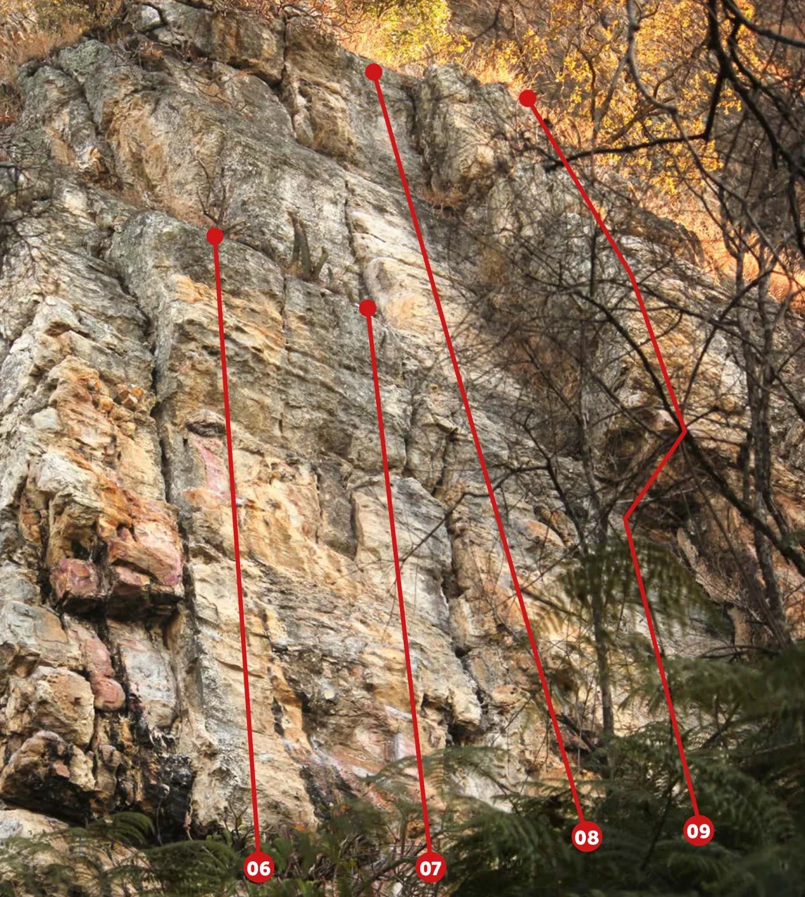
    - **largura_mapa**: 1143
    - **altura_mapa**: 1272
    - **pontos_de_interesse**:
      - **[0]**:
        - **id**: bJRwtmAaAdgtU2
        - **uid**: bJRwtmAaAdgtU2
        - **rotulo**: 06
        - **circulo**:
          - **x**: 367
          - **y**: 1230
          - **raio**: 22
        - **label**: 06
      - **[1]**:
        - **id**: cWxETo0bviRwtv
        - **uid**: cWxETo0bviRwtv
        - **rotulo**: 07
        - **circulo**:
          - **x**: 612
          - **y**: 1230
          - **raio**: 22
        - **label**: 07
      - **[2]**:
        - **id**: 68rOrJDeHrNPcM
        - **uid**: 68rOrJDeHrNPcM
        - **rotulo**: 08
        - **circulo**:
          - **x**: 833
          - **y**: 1187
          - **raio**: 22
        - **label**: 08
      - **[3]**:
        - **id**: DaRVTccRUKC0kS
        - **uid**: DaRVTccRUKC0kS
        - **rotulo**: 09
        - **circulo**:
          - **x**: 992
          - **y**: 1178
          - **raio**: 22
        - **label**: 09
    - **referencias**:
      - **[0]**:
        - **alvo_uid**: xT8zvDHyLijCjY
        - **pontos_uids**:
          - bJRwtmAaAdgtU2
        - **escalada**: Lei Rounet
        - **ids**:
          - bJRwtmAaAdgtU2
      - **[1]**:
        - **alvo_uid**: LmL2tFAel8o9PW
        - **pontos_uids**:
          - cWxETo0bviRwtv
        - **escalada**: Maria da Penha
        - **ids**:
          - cWxETo0bviRwtv
      - **[2]**:
        - **alvo_uid**: UYkX8oPcGqjomJ
        - **pontos_uids**:
          - 68rOrJDeHrNPcM
        - **escalada**: Para-raio de Maluco
        - **ids**:
          - 68rOrJDeHrNPcM
      - **[3]**:
        - **alvo_uid**: ZwJBVHE0z1YKaG
        - **pontos_uids**:
          - DaRVTccRUKC0kS
        - **escalada**: Sandálias da Humildade
        - **ids**:
          - DaRVTccRUKC0kS
- **escaladas**:
  - **[0]**:
    - **uid**: KtP05CrUDquMa2
    - **via_esportiva**:
      - **nome**: Caroço de Manga
      - **dificuldade**: BR_4
      - **extensao**: 5
      - **quantidade_protecoes_intermediarias**: 2
      - **quantidade_protecoes_parada**: 2
      - **conquistadores**:
        - Daiex de Almeida
      - **data_abertura**: 2014
  - **[1]**:
    - **uid**: tNs8OoCHJ8pkyV
    - **via_esportiva**:
      - **nome**: Caminho das pedras
      - **dificuldade**: BR_5
      - **extensao**: 8
      - **quantidade_protecoes_intermediarias**: 3
      - **quantidade_protecoes_parada**: 2
      - **conquistadores**:
        - Gustavo Maneira
      - **data_abertura**: 2012
  - **[2]**:
    - **uid**: r4dQbVfK4VI33g
    - **via_esportiva**:
      - **nome**: Caminho das águas
      - **dificuldade**: BR_5
      - **extensao**: 10
      - **quantidade_protecoes_intermediarias**: 4
      - **quantidade_protecoes_parada**: 2
      - **conquistadores**:
        - Diego Leonardo
      - **data_abertura**: 2012
  - **[3]**:
    - **uid**: qD6Ceolo44X2w1
    - **via_esportiva**:
      - **nome**: Shana Crazy
      - **dificuldade**: BR_6SUP
      - **extensao**: 10
      - **quantidade_protecoes_intermediarias**: 4
      - **quantidade_protecoes_parada**: 2
      - **conquistadores**:
        - Laurêncio
      - **data_abertura**: 2011
  - **[4]**:
    - **uid**: gmKH48WBR5Tiyq
    - **via_esportiva**:
      - **nome**: Na racha
      - **dificuldade**: BR_6SUP
      - **extensao**: 10
      - **quantidade_protecoes_intermediarias**: 4
      - **quantidade_protecoes_parada**: 2
      - **conquistadores**:
        - Pedro Andrade
      - **data_abertura**: 2017
  - **[5]**:
    - **uid**: xT8zvDHyLijCjY
    - **via_esportiva**:
      - **nome**: Lei Rounet
      - **dificuldade**: BR_7B
      - **extensao**: 10
      - **quantidade_protecoes_intermediarias**: 5
      - **quantidade_protecoes_parada**: 2
      - **conquistadores**:
        - Diego Leonardo
      - **data_abertura**: 2011
  - **[6]**:
    - **uid**: LmL2tFAel8o9PW
    - **via_esportiva**:
      - **nome**: Maria da Penha
      - **dificuldade**: BR_6SUP
      - **extensao**: 10
      - **quantidade_protecoes_intermediarias**: 4
      - **quantidade_protecoes_parada**: 2
      - **conquistadores**:
        - Laurêncio
      - **data_abertura**: 2011
  - **[7]**:
    - **uid**: UYkX8oPcGqjomJ
    - **via_esportiva**:
      - **nome**: Para-raio de Maluco
      - **dificuldade**: BR_6
      - **extensao**: 12
      - **quantidade_protecoes_intermediarias**: 7
      - **quantidade_protecoes_parada**: 2
      - **conquistadores**:
        - Diego Leonardo
        - Gustavo Maneira
      - **data_abertura**: 2011
  - **[8]**:
    - **uid**: ZwJBVHE0z1YKaG
    - **via_esportiva**:
      - **nome**: Sandálias da Humildade
      - **dificuldade**: BR_7B
      - **extensao**: 10
      - **quantidade_protecoes_intermediarias**: 7
      - **quantidade_protecoes_parada**: 2
      - **conquistadores**:
        - Diego Leonardo
      - **data_abertura**: 2011
- **precomputados**:
  - **total_escaladas**: 9
  - **total_esportivas**: 9

## Parte: setor_tsunami

### Setor (Pico: Bocaina Park)

- **descricao**:
    # Setor Tsunami
    
    O Setor Tsunami é um dos maiores do Bocaina Park, com vias extensas e desafiadoras que chegam ao 10º grau.
    
    > [!TIP]
    > Leve seu lixo e outro que encontrar para a cidade. Não faça necessidades fisiológicas nas trilhas e base de vias. Avisar a administração sobre a abertura de novas vias de escalada. **USE CAPACETE NAS BASES DE VIAS DE ESCALADA.**
- **nome**: Tsunami
- **uid**: vcNPgYS6LWY92G
- **caminho_imagem_capa**: 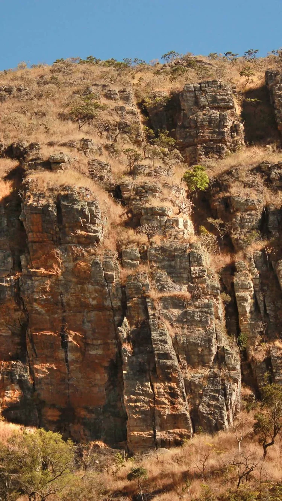
- **mapas**:
  - **[0]**:
    - **caminho_imagem_mapa**: 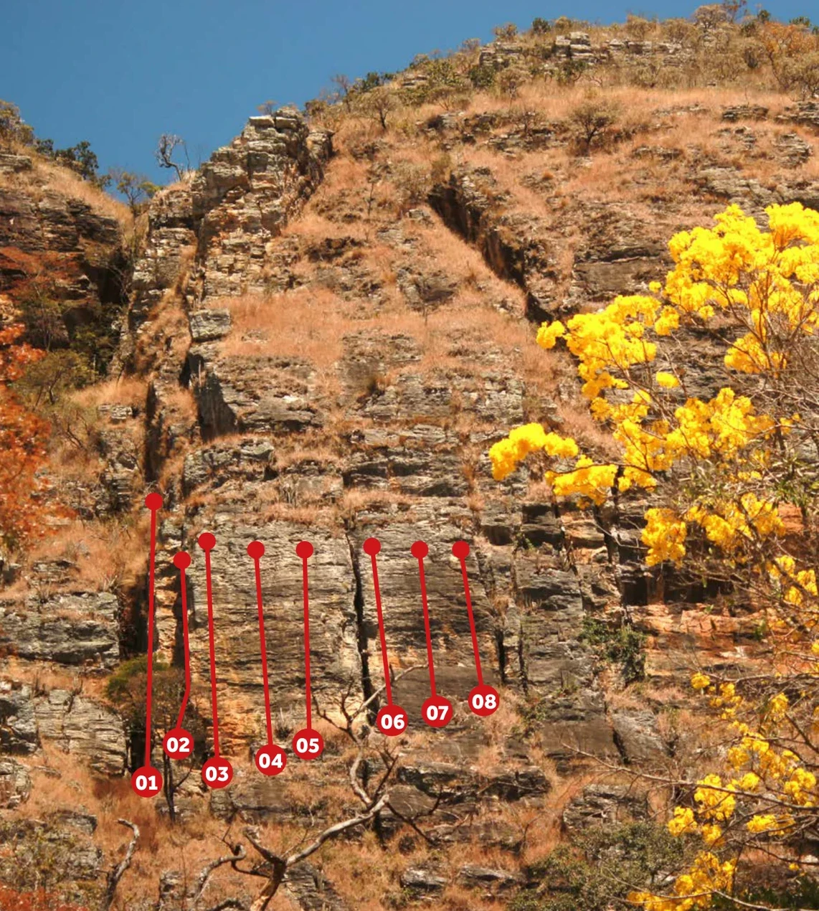
    - **largura_mapa**: 1142
    - **altura_mapa**: 1270
    - **pontos_de_interesse**:
      - **[0]**:
        - **id**: lYkbXINI3M14TB
        - **uid**: lYkbXINI3M14TB
        - **rotulo**: 01
        - **circulo**:
          - **x**: 204
          - **y**: 1090
          - **raio**: 22
        - **label**: 01
      - **[1]**:
        - **id**: YcYhv6YVK4LPRG
        - **uid**: YcYhv6YVK4LPRG
        - **rotulo**: 02
        - **circulo**:
          - **x**: 249
          - **y**: 1037
          - **raio**: 22
        - **label**: 02
      - **[2]**:
        - **id**: YnA2uiL5jEroBp
        - **uid**: YnA2uiL5jEroBp
        - **rotulo**: 03
        - **circulo**:
          - **x**: 303
          - **y**: 1077
          - **raio**: 22
        - **label**: 03
      - **[3]**:
        - **id**: B1UU2CPU5zAAhE
        - **uid**: B1UU2CPU5zAAhE
        - **rotulo**: 04
        - **circulo**:
          - **x**: 378
          - **y**: 1059
          - **raio**: 22
        - **label**: 04
      - **[4]**:
        - **id**: M8VcpfdKpUeSa2
        - **uid**: M8VcpfdKpUeSa2
        - **rotulo**: 05
        - **circulo**:
          - **x**: 430
          - **y**: 1037
          - **raio**: 22
        - **label**: 05
      - **[5]**:
        - **id**: pFUAV3JrAEtnlQ
        - **uid**: pFUAV3JrAEtnlQ
        - **rotulo**: 06
        - **circulo**:
          - **x**: 547
          - **y**: 1005
          - **raio**: 23
        - **label**: 06
      - **[6]**:
        - **id**: emrEyULDP85MIr
        - **uid**: emrEyULDP85MIr
        - **rotulo**: 07
        - **circulo**:
          - **x**: 610
          - **y**: 992
          - **raio**: 22
        - **label**: 07
      - **[7]**:
        - **id**: DZqmdaStIME3ny
        - **uid**: DZqmdaStIME3ny
        - **rotulo**: 08
        - **circulo**:
          - **x**: 675
          - **y**: 977
          - **raio**: 22
        - **label**: 08
    - **referencias**:
      - **[0]**:
        - **alvo_uid**: z9GEdWyiDyH85l
        - **pontos_uids**:
          - lYkbXINI3M14TB
        - **escalada**: ET de Varginha
        - **ids**:
          - lYkbXINI3M14TB
      - **[1]**:
        - **alvo_uid**: FhbdAulroX3sOx
        - **pontos_uids**:
          - YcYhv6YVK4LPRG
        - **escalada**: Jardim das Arestas
        - **ids**:
          - YcYhv6YVK4LPRG
      - **[2]**:
        - **alvo_uid**: XlzbaVqz31HzAI
        - **pontos_uids**:
          - YnA2uiL5jEroBp
        - **escalada**: Sunshine
        - **ids**:
          - YnA2uiL5jEroBp
      - **[3]**:
        - **alvo_uid**: squlv4JbPpvISd
        - **pontos_uids**:
          - B1UU2CPU5zAAhE
        - **escalada**: Sexta-feira 13
        - **ids**:
          - B1UU2CPU5zAAhE
      - **[4]**:
        - **alvo_uid**: Ie5UVGcmGjmRIv
        - **pontos_uids**:
          - M8VcpfdKpUeSa2
        - **escalada**: Vida Louca
        - **ids**:
          - M8VcpfdKpUeSa2
      - **[5]**:
        - **alvo_uid**: nEJapi2vtrLQji
        - **pontos_uids**:
          - pFUAV3JrAEtnlQ
        - **escalada**: Miranda Mirandinha
        - **ids**:
          - pFUAV3JrAEtnlQ
      - **[6]**:
        - **alvo_uid**: ghZWpbhT1X7HYg
        - **pontos_uids**:
          - emrEyULDP85MIr
        - **escalada**: Foi sem Querer
        - **ids**:
          - emrEyULDP85MIr
      - **[7]**:
        - **alvo_uid**: FgNUfl6XtN7E9x
        - **pontos_uids**:
          - DZqmdaStIME3ny
        - **escalada**: Cabeleira
        - **ids**:
          - DZqmdaStIME3ny
  - **[1]**:
    - **caminho_imagem_mapa**: 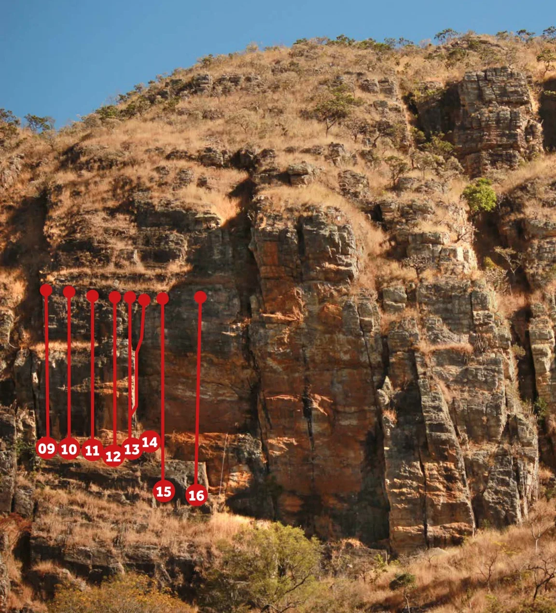
    - **largura_mapa**: 1152
    - **altura_mapa**: 1270
    - **pontos_de_interesse**:
      - **[0]**:
        - **id**: gmlZ1pUF6PQPfN
        - **uid**: gmlZ1pUF6PQPfN
        - **rotulo**: 09
        - **circulo**:
          - **x**: 97
          - **y**: 928
          - **raio**: 23
        - **label**: 09
      - **[1]**:
        - **id**: CyQ79dfMenOufn
        - **uid**: CyQ79dfMenOufn
        - **rotulo**: 10
        - **circulo**:
          - **x**: 143
          - **y**: 930
          - **raio**: 24
        - **label**: 10
      - **[2]**:
        - **id**: HN3eiUTMCVD5Oy
        - **uid**: HN3eiUTMCVD5Oy
        - **rotulo**: 11
        - **circulo**:
          - **x**: 192
          - **y**: 932
          - **raio**: 23
        - **label**: 11
      - **[3]**:
        - **id**: KiRAkLRYYODPEo
        - **uid**: KiRAkLRYYODPEo
        - **rotulo**: 12
        - **circulo**:
          - **x**: 235
          - **y**: 945
          - **raio**: 22
        - **label**: 12
      - **[4]**:
        - **id**: uwlWKp8phsqkb5
        - **uid**: uwlWKp8phsqkb5
        - **rotulo**: 13
        - **circulo**:
          - **x**: 274
          - **y**: 930
          - **raio**: 22
        - **label**: 13
      - **[5]**:
        - **id**: 54dAZhAsgqm5tL
        - **uid**: 54dAZhAsgqm5tL
        - **rotulo**: 14
        - **circulo**:
          - **x**: 311
          - **y**: 915
          - **raio**: 22
        - **label**: 14
      - **[6]**:
        - **id**: TXr5chtQICieKg
        - **uid**: TXr5chtQICieKg
        - **rotulo**: 15
        - **circulo**:
          - **x**: 340
          - **y**: 1018
          - **raio**: 23
        - **label**: 15
      - **[7]**:
        - **id**: Fzqd64oQe0TXO2
        - **uid**: Fzqd64oQe0TXO2
        - **rotulo**: 16
        - **circulo**:
          - **x**: 407
          - **y**: 1026
          - **raio**: 23
        - **label**: 16
    - **referencias**:
      - **[0]**:
        - **alvo_uid**: 9pQfcCFX6W0JG6
        - **pontos_uids**:
          - CyQ79dfMenOufn
        - **escalada**: Muy Hermosa
        - **ids**:
          - CyQ79dfMenOufn
      - **[1]**:
        - **alvo_uid**: doRXQ5JnPNvY9S
        - **pontos_uids**:
          - HN3eiUTMCVD5Oy
        - **escalada**: Medicina Chilena
        - **ids**:
          - HN3eiUTMCVD5Oy
      - **[2]**:
        - **alvo_uid**: kyO4GY6naAQ13J
        - **pontos_uids**:
          - KiRAkLRYYODPEo
        - **escalada**: As Aparências Enganam
        - **ids**:
          - KiRAkLRYYODPEo
      - **[3]**:
        - **alvo_uid**: DSmjmboNbSJJQt
        - **pontos_uids**:
          - uwlWKp8phsqkb5
        - **escalada**: Raios e Trovões
        - **ids**:
          - uwlWKp8phsqkb5
      - **[4]**:
        - **alvo_uid**: RLrXPn1DBcTeec
        - **pontos_uids**:
          - 54dAZhAsgqm5tL
        - **escalada**: Quem vê Cara não vê Graduação
        - **ids**:
          - 54dAZhAsgqm5tL
      - **[5]**:
        - **alvo_uid**: awnOgWojth5XtQ
        - **pontos_uids**:
          - TXr5chtQICieKg
        - **escalada**: Sete Chaves
        - **ids**:
          - TXr5chtQICieKg
      - **[6]**:
        - **alvo_uid**: P5ZW8my4itY6wF
        - **pontos_uids**:
          - Fzqd64oQe0TXO2
        - **escalada**: Buena Onda
        - **ids**:
          - Fzqd64oQe0TXO2
      - **[7]**:
        - **alvo_uid**: RTfkifSaI26xyl
        - **pontos_uids**:
          - gmlZ1pUF6PQPfN
        - **escalada**: Muchas Gracias
        - **ids**:
          - gmlZ1pUF6PQPfN
  - **[2]**:
    - **caminho_imagem_mapa**: 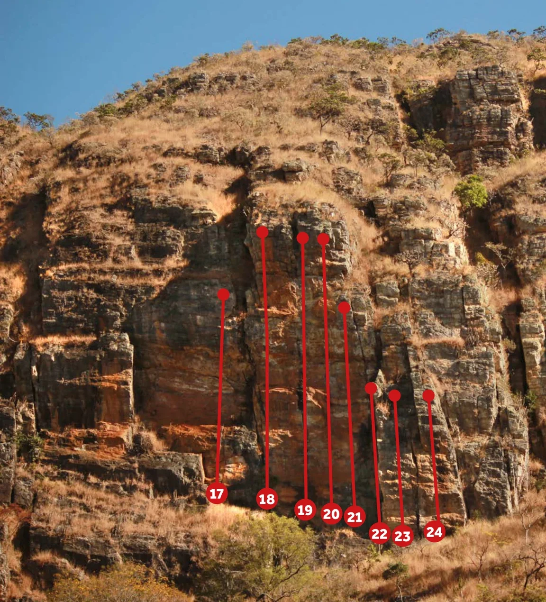
    - **largura_mapa**: 1152
    - **altura_mapa**: 1270
    - **pontos_de_interesse**:
      - **[0]**:
        - **id**: mztaNYC4v4wyuV
        - **uid**: mztaNYC4v4wyuV
        - **rotulo**: 17
        - **circulo**:
          - **x**: 457
          - **y**: 1041
          - **raio**: 23
        - **label**: 17
      - **[1]**:
        - **id**: eVE2J2t1pO6NNG
        - **uid**: eVE2J2t1pO6NNG
        - **rotulo**: 18
        - **circulo**:
          - **x**: 563
          - **y**: 1052
          - **raio**: 23
        - **label**: 18
      - **[2]**:
        - **id**: Y31iw3YALVBsPP
        - **uid**: Y31iw3YALVBsPP
        - **rotulo**: 19
        - **circulo**:
          - **x**: 644
          - **y**: 1075
          - **raio**: 23
        - **label**: 19
      - **[3]**:
        - **id**: 6RphrBHxhLYOOe
        - **uid**: 6RphrBHxhLYOOe
        - **rotulo**: 20
        - **circulo**:
          - **x**: 699
          - **y**: 1083
          - **raio**: 23
        - **label**: 20
      - **[4]**:
        - **id**: lMSZbQB5AsRkeS
        - **uid**: lMSZbQB5AsRkeS
        - **rotulo**: 21
        - **circulo**:
          - **x**: 749
          - **y**: 1090
          - **raio**: 23
        - **label**: 21
      - **[5]**:
        - **id**: 2H3WSsernK1OZg
        - **uid**: 2H3WSsernK1OZg
        - **rotulo**: 22
        - **circulo**:
          - **x**: 801
          - **y**: 1125
          - **raio**: 23
        - **label**: 22
      - **[6]**:
        - **id**: nuyyh8rMrPpjtL
        - **uid**: nuyyh8rMrPpjtL
        - **rotulo**: 23
        - **circulo**:
          - **x**: 850
          - **y**: 1131
          - **raio**: 23
        - **label**: 23
      - **[7]**:
        - **id**: nowAvzKSjB15xC
        - **uid**: nowAvzKSjB15xC
        - **rotulo**: 24
        - **circulo**:
          - **x**: 917
          - **y**: 1121
          - **raio**: 23
        - **label**: 24
    - **referencias**:
      - **[0]**:
        - **alvo_uid**: siZbSx5OyH7E19
        - **pontos_uids**:
          - mztaNYC4v4wyuV
        - **escalada**: Marola
        - **ids**:
          - mztaNYC4v4wyuV
      - **[1]**:
        - **alvo_uid**: pKqodFmgdgpNbT
        - **pontos_uids**:
          - eVE2J2t1pO6NNG
        - **escalada**: Filha de Todos
        - **ids**:
          - eVE2J2t1pO6NNG
      - **[2]**:
        - **alvo_uid**: toPSJZjNhi90L3
        - **pontos_uids**:
          - Y31iw3YALVBsPP
        - **escalada**: Neblina Baixa
        - **ids**:
          - Y31iw3YALVBsPP
      - **[3]**:
        - **alvo_uid**: 7UIHzha8XXLNns
        - **pontos_uids**:
          - 6RphrBHxhLYOOe
        - **escalada**: Círculo de Fogo
        - **ids**:
          - 6RphrBHxhLYOOe
      - **[4]**:
        - **alvo_uid**: nkycpqeiTdGciT
        - **pontos_uids**:
          - lMSZbQB5AsRkeS
        - **escalada**: Fissura de Cristal
        - **ids**:
          - lMSZbQB5AsRkeS
      - **[5]**:
        - **alvo_uid**: Kh56Kgs45O6V0N
        - **pontos_uids**:
          - 2H3WSsernK1OZg
        - **escalada**: Mandruva Assassino
        - **ids**:
          - 2H3WSsernK1OZg
      - **[6]**:
        - **alvo_uid**: dKLdImwy9OcnDx
        - **pontos_uids**:
          - nuyyh8rMrPpjtL
        - **escalada**: Namoro Antigo
        - **ids**:
          - nuyyh8rMrPpjtL
      - **[7]**:
        - **alvo_uid**: 3lXAFmsAZ4D3Xg
        - **pontos_uids**:
          - nowAvzKSjB15xC
        - **escalada**: Chora Nenêm
        - **ids**:
          - nowAvzKSjB15xC
- **escaladas**:
  - **[0]**:
    - **uid**: z9GEdWyiDyH85l
    - **via_esportiva**:
      - **nome**: ET de Varginha
      - **dificuldade**: BR_6SUP
      - **extensao**: 10
      - **quantidade_protecoes_intermediarias**: 5
      - **quantidade_protecoes_parada**: 2
      - **conquistadores**:
        - Gustavo Maneira
      - **data_abertura**: 2014
  - **[1]**:
    - **uid**: FhbdAulroX3sOx
    - **via_esportiva**:
      - **nome**: Jardim das Arestas
      - **dificuldade**: BR_6SUP
      - **extensao**: 10
      - **quantidade_protecoes_intermediarias**: 4
      - **quantidade_protecoes_parada**: 2
      - **conquistadores**:
        - Diego Leonardo
        - Gustavo Maneira
      - **data_abertura**: 2014
  - **[2]**:
    - **uid**: XlzbaVqz31HzAI
    - **via_esportiva**:
      - **nome**: Sunshine
      - **dificuldade**: BR_7A
      - **extensao**: 10
      - **quantidade_protecoes_intermediarias**: 5
      - **quantidade_protecoes_parada**: 2
      - **conquistadores**:
        - Diego Leonardo
        - Gustavo Maneira
      - **data_abertura**: 2014
  - **[3]**:
    - **uid**: squlv4JbPpvISd
    - **via_esportiva**:
      - **nome**: Sexta-feira 13
      - **dificuldade**: BR_7C
      - **extensao**: 10
      - **quantidade_protecoes_intermediarias**: 5
      - **quantidade_protecoes_parada**: 2
      - **conquistadores**:
        - Diego Leonardo
        - Rafael Furtado
      - **data_abertura**: 2014
  - **[4]**:
    - **uid**: Ie5UVGcmGjmRIv
    - **via_esportiva**:
      - **nome**: Vida Louca
      - **dificuldade**: BR_7A
      - **extensao**: 10
      - **quantidade_protecoes_intermediarias**: 4
      - **quantidade_protecoes_parada**: 2
      - **conquistadores**:
        - Diego Leonardo
        - Gustavo Maneira
      - **data_abertura**: 2014
  - **[5]**:
    - **uid**: nEJapi2vtrLQji
    - **via_esportiva**:
      - **nome**: Miranda Mirandinha
      - **dificuldade**: BR_7C
      - **extensao**: 8
      - **quantidade_protecoes_intermediarias**: 4
      - **quantidade_protecoes_parada**: 2
      - **conquistadores**:
        - Rafael Furtado
        - Argos Pena
      - **data_abertura**: 2014
  - **[6]**:
    - **uid**: ghZWpbhT1X7HYg
    - **via_esportiva**:
      - **nome**: Foi sem Querer
      - **dificuldade**: BR_6SUP
      - **extensao**: 8
      - **quantidade_protecoes_intermediarias**: 4
      - **quantidade_protecoes_parada**: 2
      - **conquistadores**:
        - Rafael Furtado
        - Diego Leonardo
      - **data_abertura**: 2014
  - **[7]**:
    - **uid**: FgNUfl6XtN7E9x
    - **via_esportiva**:
      - **nome**: Cabeleira
      - **dificuldade**: BR_6SUP
      - **extensao**: 8
      - **quantidade_protecoes_intermediarias**: 4
      - **quantidade_protecoes_parada**: 2
      - **conquistadores**:
        - Rafael Furtado
        - Diego Leonardo
      - **data_abertura**: 2014
  - **[8]**:
    - **uid**: RTfkifSaI26xyl
    - **via_esportiva**:
      - **nome**: Muchas Gracias
      - **dificuldade**: BR_8A
      - **extensao**: 12
      - **quantidade_protecoes_intermediarias**: 5
      - **quantidade_protecoes_parada**: 2
      - **conquistadores**:
        - Alexandre Fei
      - **data_abertura**: 2013
  - **[9]**:
    - **uid**: 9pQfcCFX6W0JG6
    - **via_esportiva**:
      - **nome**: Muy Hermosa
      - **dificuldade**: BR_8B
      - **extensao**: 12
      - **quantidade_protecoes_intermediarias**: 5
      - **quantidade_protecoes_parada**: 2
      - **conquistadores**:
        - Alexandre Fei
      - **data_abertura**: 2013
  - **[10]**:
    - **uid**: doRXQ5JnPNvY9S
    - **via_esportiva**:
      - **nome**: Medicina Chilena
      - **dificuldade**: BR_9B
      - **extensao**: 15
      - **quantidade_protecoes_intermediarias**: 6
      - **quantidade_protecoes_parada**: 2
      - **conquistadores**:
        - Alexandre Fei
      - **data_abertura**: 2013
  - **[11]**:
    - **uid**: kyO4GY6naAQ13J
    - **via_esportiva**:
      - **nome**: As Aparências Enganam
      - **dificuldade**: BR_10B
      - **extensao**: 15
      - **quantidade_protecoes_intermediarias**: 7
      - **quantidade_protecoes_parada**: 2
      - **conquistadores**:
        - Rafael Passos
      - **data_abertura**: 2013
  - **[12]**:
    - **uid**: DSmjmboNbSJJQt
    - **via_esportiva**:
      - **nome**: Raios e Trovões
      - **dificuldade**: BR_8C
      - **extensao**: 15
      - **quantidade_protecoes_intermediarias**: 6
      - **quantidade_protecoes_parada**: 2
      - **conquistadores**:
        - Alexandre Fei
      - **data_abertura**: 2013
  - **[13]**:
    - **uid**: RLrXPn1DBcTeec
    - **via_esportiva**:
      - **nome**: Quem vê Cara não vê Graduação
      - **dificuldade**: BR_7A
      - **extensao**: 15
      - **quantidade_protecoes_intermediarias**: 8
      - **quantidade_protecoes_parada**: 2
      - **conquistadores**:
        - Alexandre Fei
      - **data_abertura**: 2014
  - **[14]**:
    - **uid**: awnOgWojth5XtQ
    - **via_esportiva**:
      - **nome**: Sete Chaves
      - **dificuldade**: PROJETO
      - **extensao**: 20
      - **quantidade_protecoes_intermediarias**: 8
      - **quantidade_protecoes_parada**: 2
      - **conquistadores**:
        - Rafael Passos
      - **data_abertura**: 2015
  - **[15]**:
    - **uid**: P5ZW8my4itY6wF
    - **via_esportiva**:
      - **nome**: Buena Onda
      - **dificuldade**: PROJETO
      - **extensao**: 20
      - **quantidade_protecoes_intermediarias**: 7
      - **quantidade_protecoes_parada**: 2
      - **conquistadores**:
        - Alexandre Fei
        - Gustavo Scandiuzzi
      - **data_abertura**: 2015
  - **[16]**:
    - **uid**: siZbSx5OyH7E19
    - **via_esportiva**:
      - **nome**: Marola
      - **dificuldade**: PROJETO
      - **extensao**: 25
      - **quantidade_protecoes_intermediarias**: 10
      - **quantidade_protecoes_parada**: 2
      - **conquistadores**:
        - Diego Leonardo
        - Rafael Furtado
      - **data_abertura**: 2015
  - **[17]**:
    - **uid**: pKqodFmgdgpNbT
    - **via_esportiva**:
      - **nome**: Filha de Todos
      - **dificuldade**: BR_10A
      - **extensao**: 30
      - **quantidade_protecoes_intermediarias**: 13
      - **quantidade_protecoes_parada**: 2
      - **conquistadores**:
        - Alexandre Fei
        - Lucas Francês
      - **data_abertura**: 2008
  - **[18]**:
    - **uid**: toPSJZjNhi90L3
    - **via_esportiva**:
      - **nome**: Neblina Baixa
      - **dificuldade**: BR_8B
      - **extensao**: 30
      - **quantidade_protecoes_intermediarias**: 12
      - **quantidade_protecoes_parada**: 2
      - **conquistadores**:
        - Diego Leonardo
        - Lucas Francês
      - **data_abertura**: 2008
  - **[19]**:
    - **uid**: 7UIHzha8XXLNns
    - **via_esportiva**:
      - **nome**: Círculo de Fogo
      - **dificuldade**: BR_10A
      - **extensao**: 30
      - **quantidade_protecoes_intermediarias**: 15
      - **quantidade_protecoes_parada**: 2
      - **conquistadores**:
        - Alexandre Fei
      - **data_abertura**: 2013
  - **[20]**:
    - **uid**: nkycpqeiTdGciT
    - **via_esportiva**:
      - **nome**: Fissura de Cristal
      - **dificuldade**: BR_8A
      - **extensao**: 25
      - **quantidade_protecoes_intermediarias**: 10
      - **quantidade_protecoes_parada**: 2
      - **conquistadores**:
        - Alexandre Fei
      - **data_abertura**: 2013
  - **[21]**:
    - **uid**: Kh56Kgs45O6V0N
    - **via_esportiva**:
      - **nome**: Mandruva Assassino
      - **dificuldade**: BR_7A
      - **extensao**: 15
      - **quantidade_protecoes_intermediarias**: 5
      - **quantidade_protecoes_parada**: 2
      - **conquistadores**:
        - Diego Leonardo
        - Lucas Francês
      - **data_abertura**: 2008
  - **[22]**:
    - **uid**: dKLdImwy9OcnDx
    - **via_esportiva**:
      - **nome**: Namoro Antigo
      - **dificuldade**: BR_9C
      - **extensao**: 12
      - **quantidade_protecoes_intermediarias**: 4
      - **quantidade_protecoes_parada**: 2
      - **conquistadores**:
        - Ze Roberto
        - Felipe Belisario
      - **data_abertura**: 2007
  - **[23]**:
    - **uid**: 3lXAFmsAZ4D3Xg
    - **via_esportiva**:
      - **nome**: Chora Nenêm
      - **dificuldade**: BR_7C
      - **extensao**: 15
      - **conquistadores**:
        - Fei
        - Xodó
        - Diego
        - Lucas Ramos
      - **data_abertura**: 2006
- **precomputados**:
  - **total_escaladas**: 24
  - **total_esportivas**: 24

## Parte: setor_udao

### Setor (Pico: Bocaina Park)

- **descricao**:
    # Setor Udão
    
    O Setor Udão apresenta vias de 5º a 7º grau, com uma boa concentração de vias de 6º sup.
    
    > [!TIP]
    > Leve seu lixo e outro que encontrar para a cidade. Não faça necessidades fisiológicas nas trilhas e base de vias. Avisar a administração sobre a abertura de novas vias de escalada. **USE CAPACETE NAS BASES DE VIAS DE ESCALADA.**
- **nome**: Udão
- **uid**: RDvWM1pC3cmOAz
- **caminho_imagem_capa**: 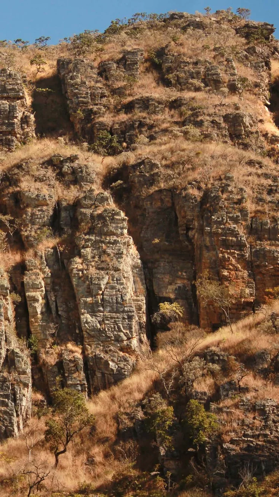
- **mapas**:
  - **[0]**:
    - **caminho_imagem_mapa**: 
    - **largura_mapa**: 1152
    - **altura_mapa**: 1267
    - **pontos_de_interesse**:
      - **[0]**:
        - **id**: AHeyOArgvGM8P9
        - **uid**: AHeyOArgvGM8P9
        - **rotulo**: 01
        - **circulo**:
          - **x**: 224
          - **y**: 1090
          - **raio**: 23
        - **label**: 01
      - **[1]**:
        - **id**: DnzcoRdhU1hFcr
        - **uid**: DnzcoRdhU1hFcr
        - **rotulo**: 02
        - **circulo**:
          - **x**: 274
          - **y**: 1086
          - **raio**: 23
        - **label**: 02
      - **[2]**:
        - **id**: dnEVA0bIfq3FBi
        - **uid**: dnEVA0bIfq3FBi
        - **rotulo**: 03
        - **circulo**:
          - **x**: 342
          - **y**: 1086
          - **raio**: 23
        - **label**: 03
      - **[3]**:
        - **id**: nlVYVc9EODbL6M
        - **uid**: nlVYVc9EODbL6M
        - **rotulo**: 04
        - **circulo**:
          - **x**: 570
          - **y**: 950
          - **raio**: 23
        - **label**: 04
      - **[4]**:
        - **id**: 3mPEvyaas7dWHx
        - **uid**: 3mPEvyaas7dWHx
        - **rotulo**: 05
        - **circulo**:
          - **x**: 623
          - **y**: 899
          - **raio**: 23
        - **label**: 05
      - **[5]**:
        - **id**: 4INVlIPpmgU0qV
        - **uid**: 4INVlIPpmgU0qV
        - **rotulo**: 06
        - **circulo**:
          - **x**: 668
          - **y**: 853
          - **raio**: 23
        - **label**: 06
    - **referencias**:
      - **[0]**:
        - **alvo_uid**: TBfeLKMqq9j217
        - **pontos_uids**:
          - AHeyOArgvGM8P9
        - **escalada**: Pulando a cerca
        - **ids**:
          - AHeyOArgvGM8P9
      - **[1]**:
        - **alvo_uid**: E7dGmVTn0GA73f
        - **pontos_uids**:
          - DnzcoRdhU1hFcr
        - **escalada**: Cerca Elétrica
        - **ids**:
          - DnzcoRdhU1hFcr
      - **[2]**:
        - **alvo_uid**: A2DJJlGzRxTnH9
        - **pontos_uids**:
          - dnEVA0bIfq3FBi
        - **escalada**: Clube da Esquina
        - **ids**:
          - dnEVA0bIfq3FBi
      - **[3]**:
        - **alvo_uid**: BD8xtor1M8TTfy
        - **pontos_uids**:
          - nlVYVc9EODbL6M
        - **escalada**: Chuva de Meteoros
        - **ids**:
          - nlVYVc9EODbL6M
      - **[4]**:
        - **alvo_uid**: COJFiz7EbK2YQc
        - **pontos_uids**:
          - 3mPEvyaas7dWHx
        - **escalada**: Pit Bitoca
        - **ids**:
          - 3mPEvyaas7dWHx
      - **[5]**:
        - **alvo_uid**: R4wt2wZYZIhOcv
        - **pontos_uids**:
          - 4INVlIPpmgU0qV
        - **escalada**: Jovem Ganso
        - **ids**:
          - 4INVlIPpmgU0qV
  - **[1]**:
    - **caminho_imagem_mapa**: 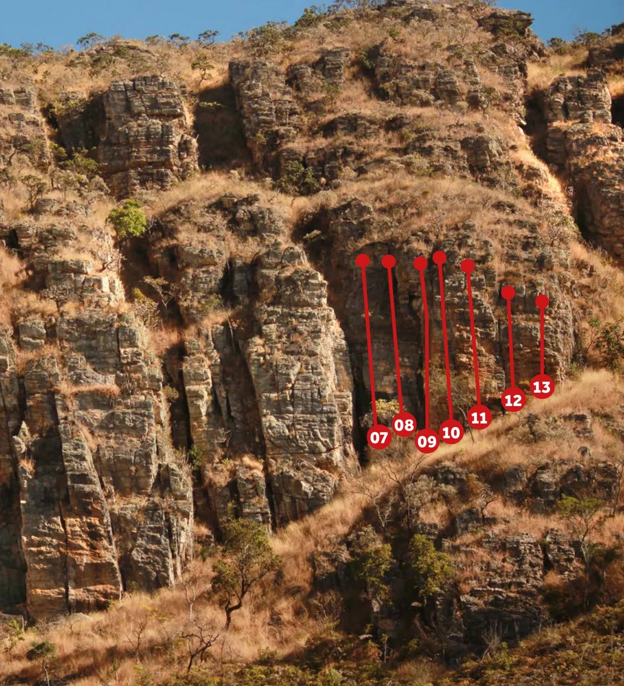
    - **largura_mapa**: 1152
    - **altura_mapa**: 1267
    - **pontos_de_interesse**:
      - **[0]**:
        - **id**: AG9ezkMldrsn60
        - **uid**: AG9ezkMldrsn60
        - **rotulo**: 07
        - **circulo**:
          - **x**: 700
          - **y**: 808
          - **raio**: 23
        - **label**: 07
      - **[1]**:
        - **id**: LGS8CPiTaAOzDL
        - **uid**: LGS8CPiTaAOzDL
        - **rotulo**: 08
        - **circulo**:
          - **x**: 747
          - **y**: 784
          - **raio**: 23
        - **label**: 08
      - **[2]**:
        - **id**: z7JuoTTUWsL2F6
        - **uid**: z7JuoTTUWsL2F6
        - **rotulo**: 09
        - **circulo**:
          - **x**: 788
          - **y**: 815
          - **raio**: 23
        - **label**: 09
      - **[3]**:
        - **id**: i5lZR5PSYwfwE8
        - **uid**: i5lZR5PSYwfwE8
        - **rotulo**: 10
        - **circulo**:
          - **x**: 833
          - **y**: 798
          - **raio**: 23
        - **label**: 10
      - **[4]**:
        - **id**: UeYdT2rFbWeIO2
        - **uid**: UeYdT2rFbWeIO2
        - **rotulo**: 11
        - **circulo**:
          - **x**: 885
          - **y**: 771
          - **raio**: 23
        - **label**: 11
      - **[5]**:
        - **id**: v2Wp4Z7p5EzuAj
        - **uid**: v2Wp4Z7p5EzuAj
        - **rotulo**: 12
        - **circulo**:
          - **x**: 947
          - **y**: 739
          - **raio**: 23
        - **label**: 12
      - **[6]**:
        - **id**: gzGHt5BlEYXU4l
        - **uid**: gzGHt5BlEYXU4l
        - **rotulo**: 13
        - **circulo**:
          - **x**: 1001
          - **y**: 714
          - **raio**: 23
        - **label**: 13
    - **referencias**:
      - **[0]**:
        - **alvo_uid**: 2eFUtu9YUB5x0J
        - **pontos_uids**:
          - AG9ezkMldrsn60
        - **escalada**: Filho de Vó
        - **ids**:
          - AG9ezkMldrsn60
      - **[1]**:
        - **alvo_uid**: puImKmmFRbKT9L
        - **pontos_uids**:
          - i5lZR5PSYwfwE8
        - **escalada**: Chuva de Verão
        - **ids**:
          - i5lZR5PSYwfwE8
      - **[2]**:
        - **alvo_uid**: FRNqGKfCDTM51k
        - **pontos_uids**:
          - UeYdT2rFbWeIO2
        - **escalada**: Pole Dance
        - **ids**:
          - UeYdT2rFbWeIO2
      - **[3]**:
        - **alvo_uid**: ltLnaMRsm9MAoL
        - **pontos_uids**:
          - v2Wp4Z7p5EzuAj
        - **escalada**: Brusqueta do Cerrado
        - **ids**:
          - v2Wp4Z7p5EzuAj
      - **[4]**:
        - **alvo_uid**: uSCoBfaUxcl0c9
        - **pontos_uids**:
          - gzGHt5BlEYXU4l
        - **escalada**: Rota Aérea
        - **ids**:
          - gzGHt5BlEYXU4l
      - **[5]**:
        - **alvo_uid**: zIVJzPjPBZIJZF
        - **pontos_uids**:
          - LGS8CPiTaAOzDL
        - **escalada**: Loucura Alheia
        - **ids**:
          - LGS8CPiTaAOzDL
      - **[6]**:
        - **alvo_uid**: lfDrIvS2jG18ep
        - **pontos_uids**:
          - z7JuoTTUWsL2F6
        - **escalada**: Mistério de Ramadã
        - **ids**:
          - z7JuoTTUWsL2F6
- **escaladas**:
  - **[0]**:
    - **uid**: TBfeLKMqq9j217
    - **via_esportiva**:
      - **nome**: Pulando a cerca
      - **dificuldade**: BR_6SUP
      - **extensao**: 12
      - **quantidade_protecoes_intermediarias**: 6
      - **quantidade_protecoes_parada**: 2
      - **conquistadores**:
        - Alexandre Fei
        - Daiex
      - **data_abertura**: 2014
  - **[1]**:
    - **uid**: E7dGmVTn0GA73f
    - **via_esportiva**:
      - **nome**: Cerca Elétrica
      - **dificuldade**: BR_7A
      - **extensao**: 15
      - **quantidade_protecoes_intermediarias**: 5
      - **quantidade_protecoes_parada**: 2
      - **conquistadores**:
        - Alexandre Fei
      - **data_abertura**: 2013
  - **[2]**:
    - **uid**: A2DJJlGzRxTnH9
    - **via_esportiva**:
      - **nome**: Clube da Esquina
      - **dificuldade**: BR_5
      - **extensao**: 8
      - **quantidade_protecoes_intermediarias**: 3
      - **quantidade_protecoes_parada**: 2
      - **conquistadores**:
        - Gustavo Maneira
        - Daiex de Almeida
      - **data_abertura**: 2013
  - **[3]**:
    - **uid**: BD8xtor1M8TTfy
    - **via_esportiva**:
      - **nome**: Chuva de Meteoros
      - **dificuldade**: BR_6
      - **extensao**: 25
      - **quantidade_protecoes_intermediarias**: 7
      - **quantidade_protecoes_parada**: 2
      - **conquistadores**:
        - Daiex de Almeida
      - **data_abertura**: 2013
  - **[4]**:
    - **uid**: COJFiz7EbK2YQc
    - **via_esportiva**:
      - **nome**: Pit Bitoca
      - **dificuldade**: BR_6SUP
      - **extensao**: 18
      - **quantidade_protecoes_intermediarias**: 5
      - **quantidade_protecoes_parada**: 2
      - **conquistadores**:
        - Alexandre Fei
      - **data_abertura**: 2013
  - **[5]**:
    - **uid**: R4wt2wZYZIhOcv
    - **via_esportiva**:
      - **nome**: Jovem Ganso
      - **dificuldade**: BR_6SUP
      - **extensao**: 15
      - **quantidade_protecoes_intermediarias**: 6
      - **quantidade_protecoes_parada**: 2
      - **conquistadores**:
        - Daiex de Almeida
        - Gustavo Maneira
      - **data_abertura**: 2013
  - **[6]**:
    - **uid**: 2eFUtu9YUB5x0J
    - **via_esportiva**:
      - **nome**: Filho de Vó
      - **dificuldade**: BR_6SUP
      - **extensao**: 12
      - **quantidade_protecoes_intermediarias**: 4
      - **quantidade_protecoes_parada**: 2
      - **conquistadores**:
        - Daiex de Almeida
        - Gustavo Maneira
      - **data_abertura**: 2013
  - **[7]**:
    - **uid**: zIVJzPjPBZIJZF
    - **via_esportiva**:
      - **nome**: Loucura Alheia
      - **dificuldade**: BR_6SUP
      - **extensao**: 12
      - **quantidade_protecoes_intermediarias**: 4
      - **quantidade_protecoes_parada**: 2
      - **conquistadores**:
        - Daiex de Almeida
        - Gustavo Maneira
      - **data_abertura**: 2013
  - **[8]**:
    - **uid**: lfDrIvS2jG18ep
    - **via_esportiva**:
      - **nome**: Mistério de Ramadã
      - **dificuldade**: BR_7A
      - **extensao**: 15
      - **quantidade_protecoes_intermediarias**: 6
      - **quantidade_protecoes_parada**: 2
      - **conquistadores**:
        - Alexandre Fei
        - Gustavo Maneira
      - **data_abertura**: 2013
  - **[9]**:
    - **uid**: puImKmmFRbKT9L
    - **via_esportiva**:
      - **nome**: Chuva de Verão
      - **dificuldade**: BR_7A
      - **extensao**: 12
      - **quantidade_protecoes_intermediarias**: 5
      - **quantidade_protecoes_parada**: 2
      - **conquistadores**:
        - Alexandre Fei
      - **data_abertura**: 2013
  - **[10]**:
    - **uid**: FRNqGKfCDTM51k
    - **via_esportiva**:
      - **nome**: Pole Dance
      - **dificuldade**: BR_6SUP
      - **extensao**: 12
      - **quantidade_protecoes_intermediarias**: 5
      - **quantidade_protecoes_parada**: 2
      - **conquistadores**:
        - Alexandre Fei
      - **data_abertura**: 2013
  - **[11]**:
    - **uid**: ltLnaMRsm9MAoL
    - **via_esportiva**:
      - **nome**: Brusqueta do Cerrado
      - **dificuldade**: BR_6
      - **extensao**: 8
      - **quantidade_protecoes_intermediarias**: 5
      - **quantidade_protecoes_parada**: 2
      - **conquistadores**:
        - Daiex de Almeida
      - **data_abertura**: 2016
  - **[12]**:
    - **uid**: uSCoBfaUxcl0c9
    - **via_esportiva**:
      - **nome**: Rota Aérea
      - **dificuldade**: BR_6
      - **extensao**: 8
      - **quantidade_protecoes_intermediarias**: 4
      - **quantidade_protecoes_parada**: 2
      - **conquistadores**:
        - Gustavo
      - **data_abertura**: 2016
- **precomputados**:
  - **total_escaladas**: 13
  - **total_esportivas**: 13

## Parte: setor_tereza

### Setor (Pico: Bocaina Park)

- **descricao**:
    # Setor Tereza
    
    Setor com vias acessíveis de 5º grau e desafios técnicos de até 7º grau.
    
    > [!TIP]
    > Leve seu lixo e outro que encontrar para a cidade. Não faça necessidades fisiológicas nas trilhas e base de vias. Avisar a administração sobre a abertura de novas vias de escalada. **USE CAPACETE NAS BASES DE VIAS DE ESCALADA.**
- **nome**: Tereza
- **uid**: sKwnDft8hBVYxs
- **caminho_imagem_capa**: 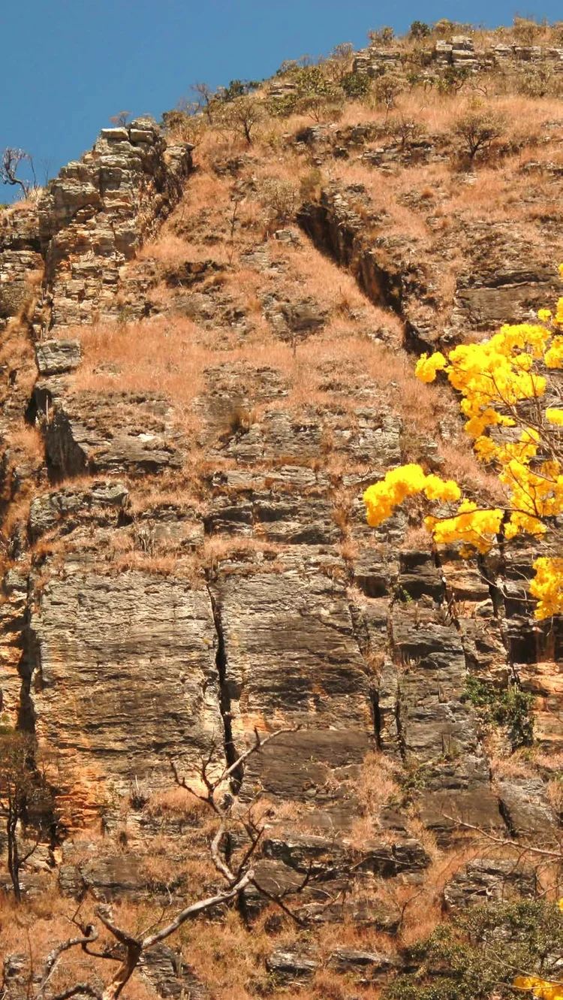
- **mapas**:
  - **[0]**:
    - **caminho_imagem_mapa**: 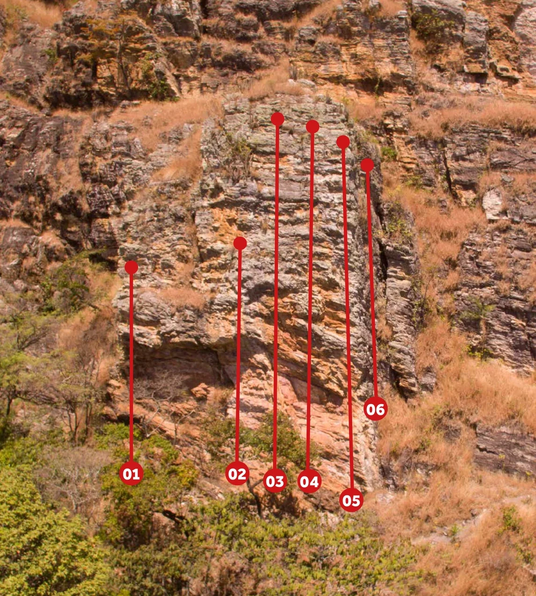
    - **largura_mapa**: 1145
    - **altura_mapa**: 1273
    - **pontos_de_interesse**:
      - **[0]**:
        - **id**: jsnhRlqh8PYw4C
        - **uid**: jsnhRlqh8PYw4C
        - **rotulo**: 01
        - **circulo**:
          - **x**: 281
          - **y**: 1011
          - **raio**: 26
        - **label**: 01
      - **[1]**:
        - **id**: Q9scflgF5tKf7Q
        - **uid**: Q9scflgF5tKf7Q
        - **rotulo**: 02
        - **circulo**:
          - **x**: 507
          - **y**: 1012
          - **raio**: 26
        - **label**: 02
      - **[2]**:
        - **id**: ZNBxU5Np5v3rBX
        - **uid**: ZNBxU5Np5v3rBX
        - **rotulo**: 03
        - **circulo**:
          - **x**: 588
          - **y**: 1027
          - **raio**: 26
        - **label**: 03
      - **[3]**:
        - **id**: xts4vHnP8tqmht
        - **uid**: xts4vHnP8tqmht
        - **rotulo**: 04
        - **circulo**:
          - **x**: 662
          - **y**: 1028
          - **raio**: 26
        - **label**: 04
      - **[4]**:
        - **id**: eWwQT4zVzTXSrT
        - **uid**: eWwQT4zVzTXSrT
        - **rotulo**: 05
        - **circulo**:
          - **x**: 751
          - **y**: 1068
          - **raio**: 26
        - **label**: 05
      - **[5]**:
        - **id**: 8Xvl9JGHXDkANZ
        - **uid**: 8Xvl9JGHXDkANZ
        - **rotulo**: 06
        - **circulo**:
          - **x**: 802
          - **y**: 873
          - **raio**: 26
        - **label**: 06
    - **referencias**:
      - **[0]**:
        - **alvo_uid**: OSe0oEbXXvgMLR
        - **pontos_uids**:
          - jsnhRlqh8PYw4C
        - **escalada**: Jaratataca
        - **ids**:
          - jsnhRlqh8PYw4C
      - **[1]**:
        - **alvo_uid**: kzMCrmf8x464pr
        - **pontos_uids**:
          - Q9scflgF5tKf7Q
        - **escalada**: Grito da Aranha
        - **ids**:
          - Q9scflgF5tKf7Q
      - **[2]**:
        - **alvo_uid**: p0tguxulhRW0Fl
        - **pontos_uids**:
          - ZNBxU5Np5v3rBX
        - **escalada**: Melhor Opção
        - **ids**:
          - ZNBxU5Np5v3rBX
      - **[3]**:
        - **alvo_uid**: W6y5fFECWC6ItX
        - **pontos_uids**:
          - xts4vHnP8tqmht
        - **escalada**: Rapa do Tacho
        - **ids**:
          - xts4vHnP8tqmht
      - **[4]**:
        - **alvo_uid**: zOAjGMBAH0R4DB
        - **pontos_uids**:
          - eWwQT4zVzTXSrT
        - **escalada**: Carrapato não tem Pai
        - **ids**:
          - eWwQT4zVzTXSrT
      - **[5]**:
        - **alvo_uid**: itw9iTSwUlj6of
        - **pontos_uids**:
          - 8Xvl9JGHXDkANZ
        - **escalada**: Barriga Verde
        - **ids**:
          - 8Xvl9JGHXDkANZ
  - **[1]**:
    - **caminho_imagem_mapa**: 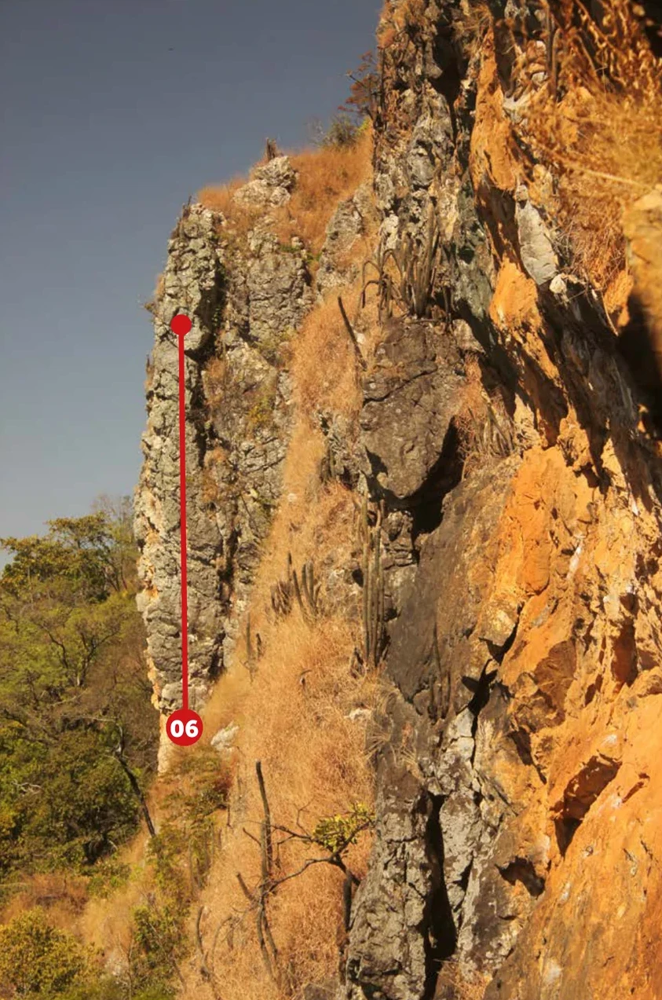
    - **largura_mapa**: 843
    - **altura_mapa**: 1273
    - **pontos_de_interesse**:
      - **[0]**:
        - **id**: ciUqgfQcb73IcX
        - **uid**: ciUqgfQcb73IcX
        - **rotulo**: 06
        - **circulo**:
          - **x**: 235
          - **y**: 927
          - **raio**: 24
        - **label**: 06
    - **referencias**:
      - **[0]**:
        - **alvo_uid**: itw9iTSwUlj6of
        - **pontos_uids**:
          - ciUqgfQcb73IcX
        - **escalada**: Barriga Verde
        - **ids**:
          - ciUqgfQcb73IcX
- **escaladas**:
  - **[0]**:
    - **uid**: OSe0oEbXXvgMLR
    - **via_esportiva**:
      - **nome**: Jaratataca
      - **dificuldade**: BR_6SUP
      - **extensao**: 10
      - **quantidade_protecoes_intermediarias**: 6
      - **quantidade_protecoes_parada**: 2
      - **conquistadores**:
        - Diego Leonardo
        - Laurêncio
      - **data_abertura**: 2009
  - **[1]**:
    - **uid**: kzMCrmf8x464pr
    - **via_esportiva**:
      - **nome**: Grito da Aranha
      - **dificuldade**: BR_7C
      - **extensao**: 15
      - **quantidade_protecoes_intermediarias**: 6
      - **quantidade_protecoes_parada**: 1
      - **conquistadores**:
        - Laurêncio
        - Diego Leonardo
      - **data_abertura**: 2009
  - **[2]**:
    - **uid**: p0tguxulhRW0Fl
    - **via_esportiva**:
      - **nome**: Melhor Opção
      - **dificuldade**: BR_7A
      - **extensao**: 20
      - **quantidade_protecoes_intermediarias**: 8
      - **quantidade_protecoes_parada**: 2
      - **conquistadores**:
        - Laurêncio
        - Diego Leonardo
      - **data_abertura**: 2009
  - **[3]**:
    - **uid**: W6y5fFECWC6ItX
    - **via_esportiva**:
      - **nome**: Rapa do Tacho
      - **dificuldade**: BR_6SUP
      - **extensao**: 20
      - **quantidade_protecoes_intermediarias**: 8
      - **quantidade_protecoes_parada**: 2
      - **conquistadores**:
        - Daiex de Almeida
      - **data_abertura**: 2016
  - **[4]**:
    - **uid**: zOAjGMBAH0R4DB
    - **via_esportiva**:
      - **nome**: Carrapato não tem Pai
      - **dificuldade**: BR_5
      - **extensao**: 20
      - **quantidade_protecoes_intermediarias**: 8
      - **quantidade_protecoes_parada**: 2
      - **conquistadores**:
        - Diego Leonardo
        - Felipe Siqueira
      - **data_abertura**: 2009
  - **[5]**:
    - **uid**: itw9iTSwUlj6of
    - **via_esportiva**:
      - **nome**: Barriga Verde
      - **dificuldade**: BR_5
      - **extensao**: 15
      - **quantidade_protecoes_intermediarias**: 6
      - **quantidade_protecoes_parada**: 2
      - **conquistadores**:
        - Lucas Ramos
      - **data_abertura**: 2006
- **precomputados**:
  - **total_escaladas**: 6
  - **total_esportivas**: 6

## Parte: setor_bem_vindo

### Setor (Pico: Bocaina Park)

- **descricao**:
    # Setor Bem-vindo
    
    O Setor Bem-vindo é um dos setores mais tradicionais do parque, com vias que variam de 5º a 8a, e algumas das vias mais longas como "Sainhaca" e "Excalibur" (45m).
    
    > [!TIP]
    > Leve seu lixo e outro que encontrar para a cidade. Não faça necessidades fisiológicas nas trilhas e base de vias. Avisar a administração sobre a abertura de novas vias de escalada. **USE CAPACETE NAS BASES DE VIAS DE ESCALADA.**
- **nome**: Bem-vindo
- **uid**: dwuQyJozrODbgq
- **mapas**:
  - **[0]**:
    - **caminho_imagem_mapa**: 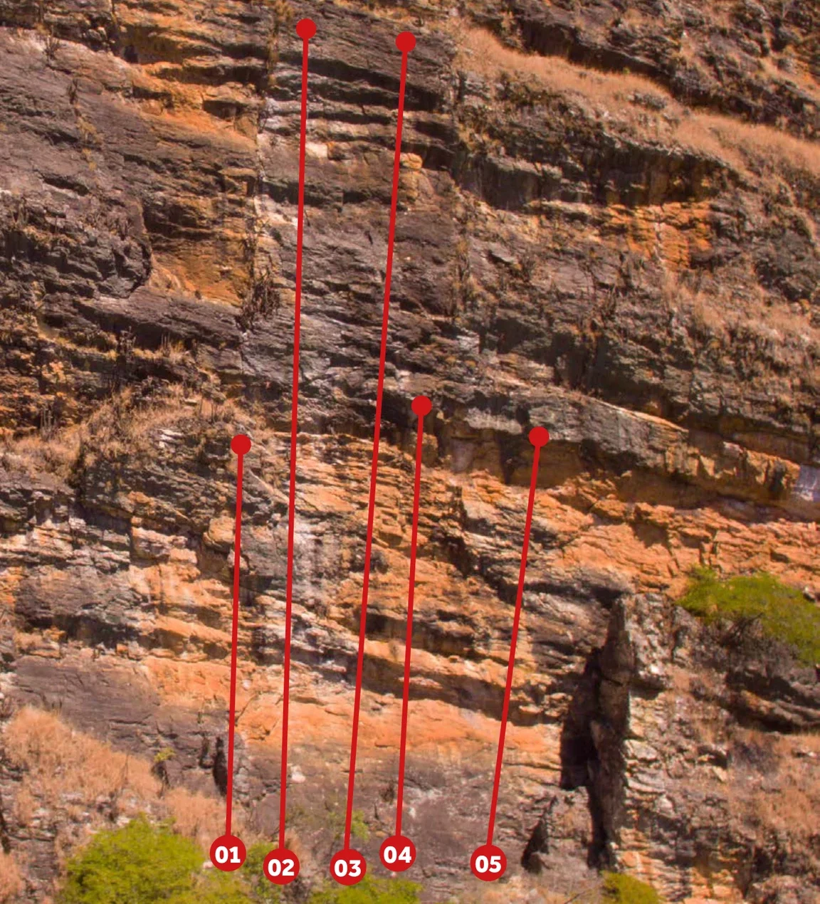
    - **largura_mapa**: 1152
    - **altura_mapa**: 1270
    - **pontos_de_interesse**:
      - **[0]**:
        - **id**: w8LEhOvZahBt0d
        - **uid**: w8LEhOvZahBt0d
        - **rotulo**: 01
        - **circulo**:
          - **x**: 320
          - **y**: 1199
          - **raio**: 26
        - **label**: 01
      - **[1]**:
        - **id**: 0JChhWNO08tVzr
        - **uid**: 0JChhWNO08tVzr
        - **rotulo**: 02
        - **circulo**:
          - **x**: 395
          - **y**: 1217
          - **raio**: 26
        - **label**: 02
      - **[2]**:
        - **id**: HnWMGgZrbhzWVB
        - **uid**: HnWMGgZrbhzWVB
        - **rotulo**: 03
        - **circulo**:
          - **x**: 489
          - **y**: 1219
          - **raio**: 26
        - **label**: 03
      - **[3]**:
        - **id**: Hahak9R6aj1v5b
        - **uid**: Hahak9R6aj1v5b
        - **rotulo**: 04
        - **circulo**:
          - **x**: 559
          - **y**: 1200
          - **raio**: 26
        - **label**: 04
      - **[4]**:
        - **id**: X8b1Z8K6CzoucU
        - **uid**: X8b1Z8K6CzoucU
        - **rotulo**: 05
        - **circulo**:
          - **x**: 686
          - **y**: 1212
          - **raio**: 26
        - **label**: 05
    - **referencias**:
      - **[0]**:
        - **alvo_uid**: GtMLRilXAqTqE4
        - **pontos_uids**:
          - w8LEhOvZahBt0d
        - **escalada**: Carapuça
        - **ids**:
          - w8LEhOvZahBt0d
      - **[1]**:
        - **alvo_uid**: 4RV25nAblvsxNc
        - **pontos_uids**:
          - 0JChhWNO08tVzr
        - **escalada**: Sainhaca
        - **ids**:
          - 0JChhWNO08tVzr
      - **[2]**:
        - **alvo_uid**: 0u3XfCe434ygyF
        - **pontos_uids**:
          - HnWMGgZrbhzWVB
        - **escalada**: Excalibur
        - **ids**:
          - HnWMGgZrbhzWVB
      - **[3]**:
        - **alvo_uid**: d8zcCmQlPLAq2d
        - **pontos_uids**:
          - Hahak9R6aj1v5b
        - **escalada**: Só as Cachorras
        - **ids**:
          - Hahak9R6aj1v5b
      - **[4]**:
        - **alvo_uid**: gHo6ISNGA0L2uy
        - **pontos_uids**:
          - X8b1Z8K6CzoucU
        - **escalada**: Lendárias 11 Vacas
        - **ids**:
          - X8b1Z8K6CzoucU
  - **[1]**:
    - **caminho_imagem_mapa**: 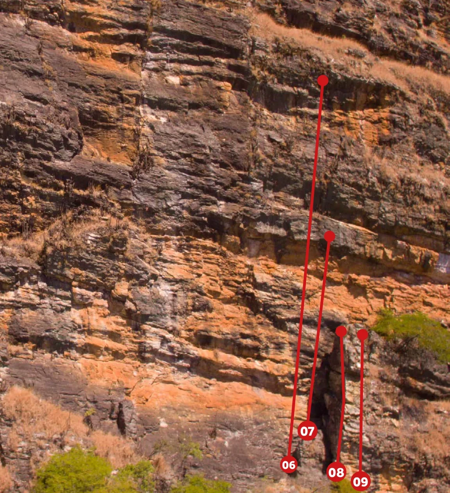
    - **largura_mapa**: 1152
    - **altura_mapa**: 1261
    - **pontos_de_interesse**:
      - **[0]**:
        - **id**: MguiTufKeNXtSC
        - **uid**: MguiTufKeNXtSC
        - **rotulo**: 06
        - **circulo**:
          - **x**: 739
          - **y**: 1188
          - **raio**: 22
        - **label**: 06
      - **[1]**:
        - **id**: OjmllxTaIIA9IT
        - **uid**: OjmllxTaIIA9IT
        - **rotulo**: 07
        - **circulo**:
          - **x**: 787
          - **y**: 1101
          - **raio**: 25
        - **label**: 07
      - **[2]**:
        - **id**: ELHAzDpnHM1fRE
        - **uid**: ELHAzDpnHM1fRE
        - **rotulo**: 08
        - **circulo**:
          - **x**: 861
          - **y**: 1207
          - **raio**: 26
        - **label**: 08
      - **[3]**:
        - **id**: nf5cdU4DiBadLg
        - **uid**: nf5cdU4DiBadLg
        - **rotulo**: 09
        - **circulo**:
          - **x**: 923
          - **y**: 1231
          - **raio**: 25
        - **label**: 09
    - **referencias**:
      - **[0]**:
        - **alvo_uid**: eWepKZfiGBz1xT
        - **pontos_uids**:
          - MguiTufKeNXtSC
        - **escalada**: Chapeleta Voadora
        - **ids**:
          - MguiTufKeNXtSC
      - **[1]**:
        - **alvo_uid**: WxfcNaYUIJNFIi
        - **pontos_uids**:
          - OjmllxTaIIA9IT
        - **escalada**: Pau Podre
        - **ids**:
          - OjmllxTaIIA9IT
      - **[2]**:
        - **alvo_uid**: QCdRLBOdHIwEQy
        - **pontos_uids**:
          - ELHAzDpnHM1fRE
        - **escalada**: Bonsai Cearense
        - **ids**:
          - ELHAzDpnHM1fRE
      - **[3]**:
        - **alvo_uid**: aki6i9SEmWdTZu
        - **pontos_uids**:
          - nf5cdU4DiBadLg
        - **escalada**: Macaco Velho
        - **ids**:
          - nf5cdU4DiBadLg
  - **[2]**:
    - **caminho_imagem_mapa**: 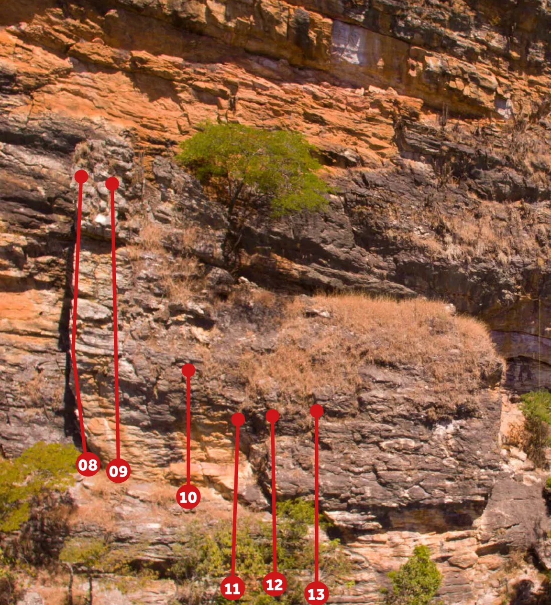
    - **largura_mapa**: 1152
    - **altura_mapa**: 1267
    - **pontos_de_interesse**:
      - **[0]**:
        - **id**: QKJmWTjZqfd9ot
        - **uid**: QKJmWTjZqfd9ot
        - **rotulo**: 08
        - **circulo**:
          - **x**: 184
          - **y**: 972
          - **raio**: 26
        - **label**: 08
      - **[1]**:
        - **id**: SEU4YTGVyE6oi7
        - **uid**: SEU4YTGVyE6oi7
        - **rotulo**: 09
        - **circulo**:
          - **x**: 248
          - **y**: 986
          - **raio**: 26
        - **label**: 09
      - **[2]**:
        - **id**: 9ZcilwtFHEfyeq
        - **uid**: 9ZcilwtFHEfyeq
        - **rotulo**: 10
        - **circulo**:
          - **x**: 394
          - **y**: 1040
          - **raio**: 26
        - **label**: 10
      - **[3]**:
        - **id**: Q2200nGa3tnkwD
        - **uid**: Q2200nGa3tnkwD
        - **rotulo**: 11
        - **circulo**:
          - **x**: 486
          - **y**: 1231
          - **raio**: 26
        - **label**: 11
      - **[4]**:
        - **id**: 69ymiLK8grHszV
        - **uid**: 69ymiLK8grHszV
        - **rotulo**: 12
        - **circulo**:
          - **x**: 574
          - **y**: 1223
          - **raio**: 26
        - **label**: 12
      - **[5]**:
        - **id**: d3hTGiP94VR0V8
        - **uid**: d3hTGiP94VR0V8
        - **rotulo**: 13
        - **circulo**:
          - **x**: 662
          - **y**: 1243
          - **raio**: 26
        - **label**: 13
    - **referencias**:
      - **[0]**:
        - **alvo_uid**: Exh9XI8apId7Pp
        - **pontos_uids**:
          - 9ZcilwtFHEfyeq
        - **escalada**: Sargento Pincel
        - **ids**:
          - 9ZcilwtFHEfyeq
      - **[1]**:
        - **alvo_uid**: VYCMUjhjNBl37U
        - **pontos_uids**:
          - Q2200nGa3tnkwD
        - **escalada**: Proparoxítona
        - **ids**:
          - Q2200nGa3tnkwD
      - **[2]**:
        - **alvo_uid**: mGe6vvjUrDtBf8
        - **pontos_uids**:
          - 69ymiLK8grHszV
        - **escalada**: Volte Sempre
        - **ids**:
          - 69ymiLK8grHszV
      - **[3]**:
        - **alvo_uid**: 2hRWc6tRZlk1Kq
        - **pontos_uids**:
          - d3hTGiP94VR0V8
        - **escalada**: Espírito de Equipe
        - **ids**:
          - d3hTGiP94VR0V8
      - **[4]**:
        - **alvo_uid**: QCdRLBOdHIwEQy
        - **pontos_uids**:
          - QKJmWTjZqfd9ot
        - **escalada**: Bonsai Cearense
        - **ids**:
          - QKJmWTjZqfd9ot
      - **[5]**:
        - **alvo_uid**: aki6i9SEmWdTZu
        - **pontos_uids**:
          - SEU4YTGVyE6oi7
        - **escalada**: Macaco Velho
        - **ids**:
          - SEU4YTGVyE6oi7
  - **[3]**:
    - **caminho_imagem_mapa**: 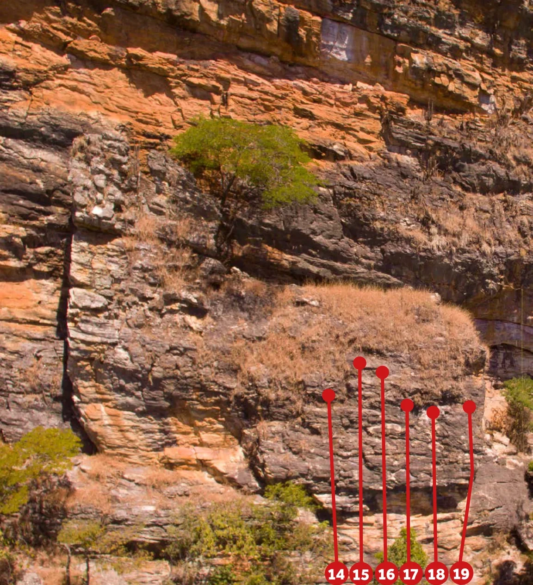
    - **largura_mapa**: 1152
    - **altura_mapa**: 1264
    - **pontos_de_interesse**:
      - **[0]**:
        - **id**: R30WB7YYFrXWYx
        - **uid**: R30WB7YYFrXWYx
        - **rotulo**: 14
        - **circulo**:
          - **x**: 727
          - **y**: 1240
          - **raio**: 26
        - **label**: 14
      - **[1]**:
        - **id**: LNWoXCrSSTpEnB
        - **uid**: LNWoXCrSSTpEnB
        - **rotulo**: 15
        - **circulo**:
          - **x**: 781
          - **y**: 1240
          - **raio**: 26
        - **label**: 15
      - **[2]**:
        - **id**: GYfId5JUPhKZNy
        - **uid**: GYfId5JUPhKZNy
        - **rotulo**: 16
        - **circulo**:
          - **x**: 836
          - **y**: 1240
          - **raio**: 26
        - **label**: 16
      - **[3]**:
        - **id**: IDEya5KaOPrYoL
        - **uid**: IDEya5KaOPrYoL
        - **rotulo**: 17
        - **circulo**:
          - **x**: 889
          - **y**: 1240
          - **raio**: 26
        - **label**: 17
      - **[4]**:
        - **id**: tcWBwvJRc9nIre
        - **uid**: tcWBwvJRc9nIre
        - **rotulo**: 18
        - **circulo**:
          - **x**: 944
          - **y**: 1240
          - **raio**: 26
        - **label**: 18
      - **[5]**:
        - **id**: YNkkHnugBo71S2
        - **uid**: YNkkHnugBo71S2
        - **rotulo**: 19
        - **circulo**:
          - **x**: 998
          - **y**: 1238
          - **raio**: 26
        - **label**: 19
    - **referencias**:
      - **[0]**:
        - **alvo_uid**: dMlZsh5MjM2Coe
        - **pontos_uids**:
          - R30WB7YYFrXWYx
        - **escalada**: Bem-vindo
        - **ids**:
          - R30WB7YYFrXWYx
      - **[1]**:
        - **alvo_uid**: mrEz9Od4K964EJ
        - **pontos_uids**:
          - LNWoXCrSSTpEnB
        - **escalada**: Ganja no País das Maravilhas
        - **ids**:
          - LNWoXCrSSTpEnB
      - **[2]**:
        - **alvo_uid**: G5cAnXMY4Y6FWJ
        - **pontos_uids**:
          - GYfId5JUPhKZNy
        - **escalada**: Ritual Satânico
        - **ids**:
          - GYfId5JUPhKZNy
      - **[3]**:
        - **alvo_uid**: 1Y9muZA1EsqoxU
        - **pontos_uids**:
          - IDEya5KaOPrYoL
        - **escalada**: Sweet Home Alabama
        - **ids**:
          - IDEya5KaOPrYoL
      - **[4]**:
        - **alvo_uid**: yk6GBOSHZFSWiD
        - **pontos_uids**:
          - tcWBwvJRc9nIre
        - **escalada**: Show de Calouros
        - **ids**:
          - tcWBwvJRc9nIre
      - **[5]**:
        - **alvo_uid**: F7D9fVSvVzF8LF
        - **pontos_uids**:
          - YNkkHnugBo71S2
        - **escalada**: Permissão Concebida
        - **ids**:
          - YNkkHnugBo71S2
- **escaladas**:
  - **[0]**:
    - **uid**: GtMLRilXAqTqE4
    - **via_esportiva**:
      - **descricao**: Inacabada.
      - **nome**: Carapuça
      - **dificuldade**: PROJETO
  - **[1]**:
    - **uid**: 4RV25nAblvsxNc
    - **via_esportiva**:
      - **nome**: Sainhaca
      - **dificuldade**: BR_8A
      - **extensao**: 45
      - **quantidade_protecoes_intermediarias**: 18
      - **quantidade_protecoes_parada**: 2
      - **conquistadores**:
        - Diego
        - Fei
        - Gustavo Scandiuzzi
      - **data_abertura**: 2007
  - **[2]**:
    - **uid**: 0u3XfCe434ygyF
    - **via_esportiva**:
      - **nome**: Excalibur
      - **dificuldade**: BR_7C
      - **extensao**: 45
      - **quantidade_protecoes_intermediarias**: 20
      - **quantidade_protecoes_parada**: 2
      - **conquistadores**:
        - Diego
        - Laurêncio
        - Fei
      - **data_abertura**: 2007
  - **[3]**:
    - **uid**: d8zcCmQlPLAq2d
    - **via_esportiva**:
      - **descricao**: Falta topo.
      - **nome**: Só as Cachorras
      - **dificuldade**: BR_7C
      - **extensao**: 25
      - **quantidade_protecoes_intermediarias**: 8
      - **conquistadores**:
        - Alexandre
        - Fei
        - Bruno Kabeção
      - **data_abertura**: 2007
  - **[4]**:
    - **uid**: gHo6ISNGA0L2uy
    - **via_esportiva**:
      - **nome**: Lendárias 11 Vacas
      - **dificuldade**: BR_7B
      - **extensao**: 20
      - **quantidade_protecoes_intermediarias**: 10
      - **quantidade_protecoes_parada**: 2
      - **conquistadores**:
        - Juliano
        - Diego
        - Laurêncio
        - Fei
      - **data_abertura**: 2007
  - **[5]**:
    - **uid**: eWepKZfiGBz1xT
    - **via_esportiva**:
      - **nome**: Chapeleta Voadora
      - **dificuldade**: BR_7B
      - **extensao**: 30
      - **conquistadores**:
        - Diego
        - Laurêncio
        - Fei
      - **data_abertura**: 2008
  - **[6]**:
    - **uid**: WxfcNaYUIJNFIi
    - **via_esportiva**:
      - **descricao**: Inacabada.
      - **nome**: Pau Podre
      - **dificuldade**: PROJETO
      - **data_abertura**: 2007
  - **[7]**:
    - **uid**: QCdRLBOdHIwEQy
    - **via_esportiva**:
      - **nome**: Bonsai Cearense
      - **dificuldade**: BR_5
      - **extensao**: 10
      - **quantidade_protecoes_intermediarias**: 4
      - **quantidade_protecoes_parada**: 2
      - **conquistadores**:
        - Juliano
      - **data_abertura**: 2006
  - **[8]**:
    - **uid**: aki6i9SEmWdTZu
    - **via_esportiva**:
      - **nome**: Macaco Velho
      - **dificuldade**: BR_6SUP
      - **extensao**: 10
      - **quantidade_protecoes_intermediarias**: 6
      - **quantidade_protecoes_parada**: 2
      - **conquistadores**:
        - Pedro Andrade
      - **data_abertura**: 2017
  - **[9]**:
    - **uid**: Exh9XI8apId7Pp
    - **via_esportiva**:
      - **nome**: Sargento Pincel
      - **dificuldade**: BR_6SUP
      - **extensao**: 15
      - **quantidade_protecoes_intermediarias**: 6
      - **quantidade_protecoes_parada**: 2
      - **conquistadores**:
        - Laurêncio Jr
      - **data_abertura**: 2010
  - **[10]**:
    - **uid**: VYCMUjhjNBl37U
    - **via_esportiva**:
      - **nome**: Proparoxítona
      - **dificuldade**: BR_6
      - **extensao**: 10
      - **quantidade_protecoes_intermediarias**: 4
      - **quantidade_protecoes_parada**: 2
      - **conquistadores**:
        - Diego Leonardo
        - Gustavo Maneira
      - **data_abertura**: 2010
  - **[11]**:
    - **uid**: mGe6vvjUrDtBf8
    - **via_esportiva**:
      - **nome**: Volte Sempre
      - **dificuldade**: BR_6
      - **extensao**: 10
      - **quantidade_protecoes_intermediarias**: 5
      - **quantidade_protecoes_parada**: 2
      - **conquistadores**:
        - Diego Leonardo
        - Gustavo Maneira
      - **data_abertura**: 2010
  - **[12]**:
    - **uid**: 2hRWc6tRZlk1Kq
    - **via_esportiva**:
      - **nome**: Espírito de Equipe
      - **dificuldade**: BR_6SUP
      - **extensao**: 19
      - **quantidade_protecoes_intermediarias**: 4
      - **quantidade_protecoes_parada**: 2
      - **conquistadores**:
        - Daiex de Almeida
      - **data_abertura**: 2017
  - **[13]**:
    - **uid**: dMlZsh5MjM2Coe
    - **via_esportiva**:
      - **nome**: Bem-vindo
      - **dificuldade**: BR_7A
      - **extensao**: 10
      - **quantidade_protecoes_intermediarias**: 4
      - **quantidade_protecoes_parada**: 2
      - **conquistadores**:
        - Geraldo Neto
        - Aluísio
      - **data_abertura**: 2006
  - **[14]**:
    - **uid**: mrEz9Od4K964EJ
    - **via_esportiva**:
      - **nome**: Ganja no País das Maravilhas
      - **dificuldade**: BR_7A
      - **extensao**: 10
      - **quantidade_protecoes_intermediarias**: 4
      - **quantidade_protecoes_parada**: 2
      - **conquistadores**:
        - Rafael Furtado
      - **data_abertura**: 2017
  - **[15]**:
    - **uid**: G5cAnXMY4Y6FWJ
    - **via_esportiva**:
      - **nome**: Ritual Satânico
      - **dificuldade**: BR_7A
      - **extensao**: 10
      - **quantidade_protecoes_intermediarias**: 4
      - **quantidade_protecoes_parada**: 2
      - **conquistadores**:
        - Geraldo Neto
        - Aluísio
      - **data_abertura**: 2006
  - **[16]**:
    - **uid**: 1Y9muZA1EsqoxU
    - **via_esportiva**:
      - **nome**: Sweet Home Alabama
      - **dificuldade**: BR_6SUP_BARRA_7A
      - **extensao**: 10
      - **quantidade_protecoes_intermediarias**: 3
      - **quantidade_protecoes_parada**: 2
      - **conquistadores**:
        - Diego Leonardo
      - **data_abertura**: 2017
  - **[17]**:
    - **uid**: yk6GBOSHZFSWiD
    - **via_esportiva**:
      - **descricao**: Falta topo.
      - **nome**: Show de Calouros
      - **dificuldade**: BR_8A
      - **extensao**: 10
      - **quantidade_protecoes_intermediarias**: 4
      - **conquistadores**:
        - Geraldo Neto
        - Aluísio
      - **data_abertura**: 2006
- **precomputados**:
  - **total_escaladas**: 18
  - **total_esportivas**: 18

## Parte: setor_tetos

### Setor (Pico: Bocaina Park)

- **descricao**:
    # Setor Tetos
    
    O Setor Tetos é conhecido por suas vias atléticas e desafiadoras, com muitos tetos e negativas. Contém vias variadas de 5º a 10a grau, além de vários projetos promissores.
    
    > [!TIP]
    > Leve seu lixo e outro que encontrar para a cidade. Não faça necessidades fisiológicas nas trilhas e base de vias. Avisar a administração sobre a abertura de novas vias de escalada. **USE CAPACETE NAS BASES DE VIAS DE ESCALADA.**
- **nome**: Tetos
- **uid**: q0gv91KFyAc9AX
- **caminho_imagem_capa**: 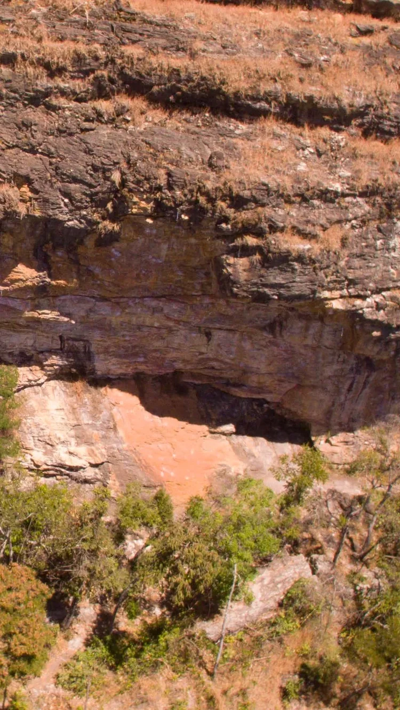
- **mapas**:
  - **[0]**:
    - **caminho_imagem_mapa**: 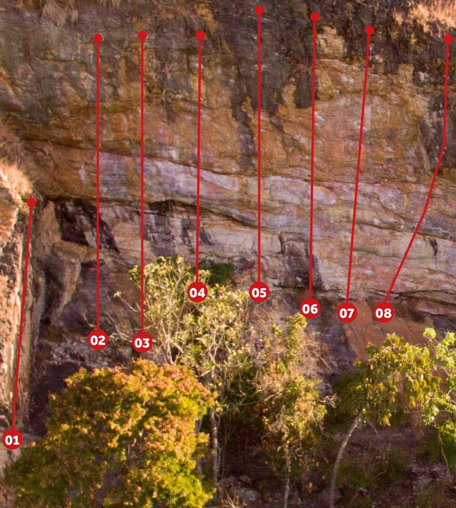
    - **largura_mapa**: 1140
    - **altura_mapa**: 1269
    - **pontos_de_interesse**:
      - **[0]**:
        - **id**: VVmeYDqpqUrzMC
        - **uid**: VVmeYDqpqUrzMC
        - **rotulo**: 01
        - **circulo**:
          - **x**: 30
          - **y**: 1098
          - **raio**: 26
        - **label**: 01
      - **[1]**:
        - **id**: klTvqOpElXFtgd
        - **uid**: klTvqOpElXFtgd
        - **rotulo**: 02
        - **circulo**:
          - **x**: 245
          - **y**: 849
          - **raio**: 26
        - **label**: 02
      - **[2]**:
        - **id**: aCgwCXtfdEbGQT
        - **uid**: aCgwCXtfdEbGQT
        - **rotulo**: 03
        - **circulo**:
          - **x**: 356
          - **y**: 855
          - **raio**: 25
        - **label**: 03
      - **[3]**:
        - **id**: Ev61OAHQxfQ3KJ
        - **uid**: Ev61OAHQxfQ3KJ
        - **rotulo**: 04
        - **circulo**:
          - **x**: 494
          - **y**: 730
          - **raio**: 26
        - **label**: 04
      - **[4]**:
        - **id**: iH5LFhDzwiIzV1
        - **uid**: iH5LFhDzwiIzV1
        - **rotulo**: 05
        - **circulo**:
          - **x**: 648
          - **y**: 730
          - **raio**: 26
        - **label**: 05
      - **[5]**:
        - **id**: yZmZDY7gw9ttxJ
        - **uid**: yZmZDY7gw9ttxJ
        - **rotulo**: 06
        - **circulo**:
          - **x**: 775
          - **y**: 770
          - **raio**: 26
        - **label**: 06
      - **[6]**:
        - **id**: 8lIT9GjjTrKPdh
        - **uid**: 8lIT9GjjTrKPdh
        - **rotulo**: 07
        - **circulo**:
          - **x**: 867
          - **y**: 781
          - **raio**: 26
        - **label**: 07
      - **[7]**:
        - **id**: Pa68eSDpzyjJfi
        - **uid**: Pa68eSDpzyjJfi
        - **rotulo**: 08
        - **circulo**:
          - **x**: 959
          - **y**: 780
          - **raio**: 26
        - **label**: 08
    - **referencias**:
      - **[0]**:
        - **alvo_uid**: F7D9fVSvVzF8LF
        - **pontos_uids**:
          - VVmeYDqpqUrzMC
        - **escalada**: Permissão Concebida
        - **ids**:
          - VVmeYDqpqUrzMC
      - **[1]**:
        - **alvo_uid**: TGxnEnnJtAimRH
        - **pontos_uids**:
          - klTvqOpElXFtgd
        - **escalada**: Bocaina Aventura
        - **ids**:
          - klTvqOpElXFtgd
      - **[2]**:
        - **alvo_uid**: Ie9UWepqQRMx6o
        - **pontos_uids**:
          - aCgwCXtfdEbGQT
        - **escalada**: O Vento Levou
        - **ids**:
          - aCgwCXtfdEbGQT
      - **[3]**:
        - **alvo_uid**: hKx4cwMfhTYeb6
        - **pontos_uids**:
          - Ev61OAHQxfQ3KJ
        - **escalada**: Titan
        - **ids**:
          - Ev61OAHQxfQ3KJ
      - **[4]**:
        - **alvo_uid**: SszjnbPwrsf4eq
        - **pontos_uids**:
          - iH5LFhDzwiIzV1
        - **escalada**: Mirian
        - **ids**:
          - iH5LFhDzwiIzV1
      - **[5]**:
        - **alvo_uid**: 0lcn0eDNV8CEwv
        - **pontos_uids**:
          - yZmZDY7gw9ttxJ
        - **escalada**: Hipnose
        - **ids**:
          - yZmZDY7gw9ttxJ
      - **[6]**:
        - **alvo_uid**: w85Oym63vWA2qF
        - **pontos_uids**:
          - 8lIT9GjjTrKPdh
        - **escalada**: Resta Um
        - **ids**:
          - 8lIT9GjjTrKPdh
      - **[7]**:
        - **alvo_uid**: wmBgyAkH8bCedi
        - **pontos_uids**:
          - Pa68eSDpzyjJfi
        - **escalada**: Medo de quê Aresta
        - **ids**:
          - Pa68eSDpzyjJfi
  - **[1]**:
    - **caminho_imagem_mapa**: 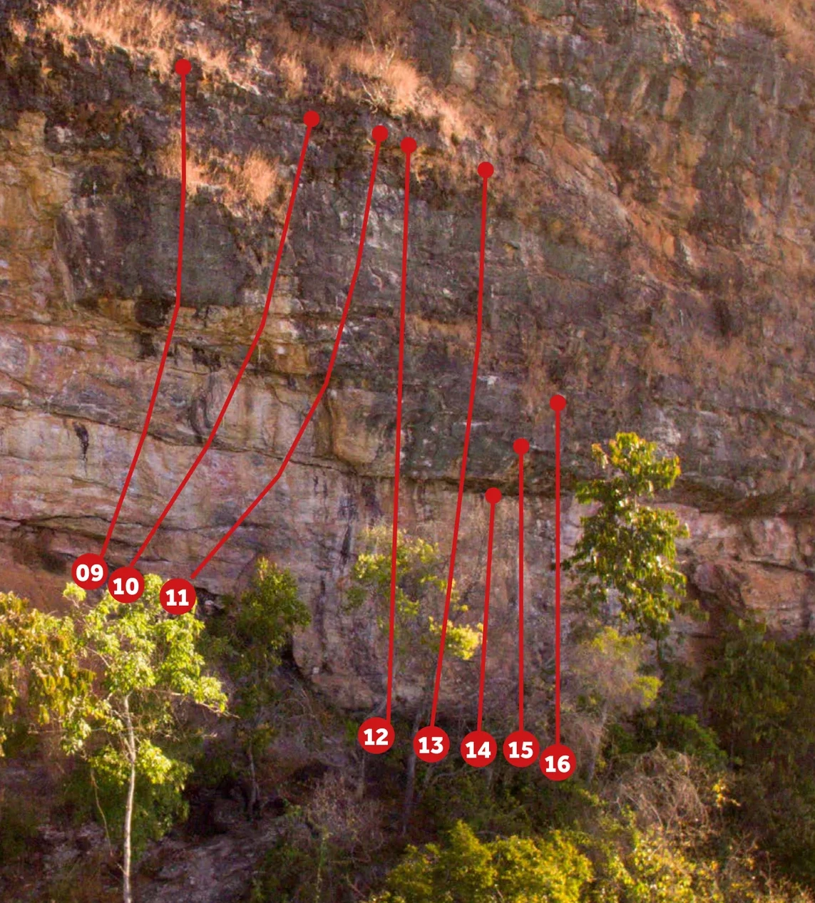
    - **largura_mapa**: 1143
    - **altura_mapa**: 1267
    - **pontos_de_interesse**:
      - **[0]**:
        - **id**: TBReM08vDSQoNC
        - **uid**: TBReM08vDSQoNC
        - **rotulo**: 09
        - **circulo**:
          - **x**: 126
          - **y**: 801
          - **raio**: 26
        - **label**: 09
      - **[1]**:
        - **id**: Z6NhxYvDiEoqUP
        - **uid**: Z6NhxYvDiEoqUP
        - **rotulo**: 10
        - **circulo**:
          - **x**: 177
          - **y**: 820
          - **raio**: 25
        - **label**: 10
      - **[2]**:
        - **id**: 7LXkoKbvttlkeP
        - **uid**: 7LXkoKbvttlkeP
        - **rotulo**: 11
        - **circulo**:
          - **x**: 248
          - **y**: 837
          - **raio**: 25
        - **label**: 11
      - **[3]**:
        - **id**: m9IUzqvFgPqfBG
        - **uid**: m9IUzqvFgPqfBG
        - **rotulo**: 12
        - **circulo**:
          - **x**: 527
          - **y**: 1033
          - **raio**: 26
        - **label**: 12
      - **[4]**:
        - **id**: hINRwGKdOLvPCz
        - **uid**: hINRwGKdOLvPCz
        - **rotulo**: 13
        - **circulo**:
          - **x**: 605
          - **y**: 1045
          - **raio**: 26
        - **label**: 13
      - **[5]**:
        - **id**: hD0GfEH3ZOcve2
        - **uid**: hD0GfEH3ZOcve2
        - **rotulo**: 14
        - **circulo**:
          - **x**: 671
          - **y**: 1052
          - **raio**: 26
        - **label**: 14
      - **[6]**:
        - **id**: UcJkDe1qScRH9k
        - **uid**: UcJkDe1qScRH9k
        - **rotulo**: 15
        - **circulo**:
          - **x**: 732
          - **y**: 1051
          - **raio**: 26
        - **label**: 15
      - **[7]**:
        - **id**: 8uZhSl99JsXxW1
        - **uid**: 8uZhSl99JsXxW1
        - **rotulo**: 16
        - **circulo**:
          - **x**: 782
          - **y**: 1070
          - **raio**: 26
        - **label**: 16
    - **referencias**:
      - **[0]**:
        - **alvo_uid**: DRKloY4ISi99SZ
        - **pontos_uids**:
          - Z6NhxYvDiEoqUP
        - **escalada**: Zumbi da Bocaina
        - **ids**:
          - Z6NhxYvDiEoqUP
      - **[1]**:
        - **alvo_uid**: Y0YqvSUbQarcyO
        - **pontos_uids**:
          - 7LXkoKbvttlkeP
        - **escalada**: Curta e Grossa
        - **ids**:
          - 7LXkoKbvttlkeP
      - **[2]**:
        - **alvo_uid**: pE81kT7cLImtOA
        - **pontos_uids**:
          - m9IUzqvFgPqfBG
        - **escalada**: Menos Curta e Mais Grossa
        - **ids**:
          - m9IUzqvFgPqfBG
      - **[3]**:
        - **alvo_uid**: fWW466uDuqrrBy
        - **pontos_uids**:
          - hINRwGKdOLvPCz
        - **escalada**: El Corazon
        - **ids**:
          - hINRwGKdOLvPCz
      - **[4]**:
        - **alvo_uid**: J7bXywRiu0PAXt
        - **pontos_uids**:
          - hD0GfEH3ZOcve2
        - **escalada**: Sombra e Água Fresca
        - **ids**:
          - hD0GfEH3ZOcve2
      - **[5]**:
        - **alvo_uid**: hF0nLRzYrLtFnG
        - **pontos_uids**:
          - UcJkDe1qScRH9k
        - **escalada**: Vitamina C
        - **ids**:
          - UcJkDe1qScRH9k
      - **[6]**:
        - **alvo_uid**: x8blgb1mpYRvI2
        - **pontos_uids**:
          - 8uZhSl99JsXxW1
        - **escalada**: Mão de Vaca
        - **ids**:
          - 8uZhSl99JsXxW1
      - **[7]**:
        - **alvo_uid**: apiiCMS0Y3LfGH
        - **pontos_uids**:
          - TBReM08vDSQoNC
        - **escalada**: Pressão Psicológica
        - **ids**:
          - TBReM08vDSQoNC
  - **[2]**:
    - **caminho_imagem_mapa**: 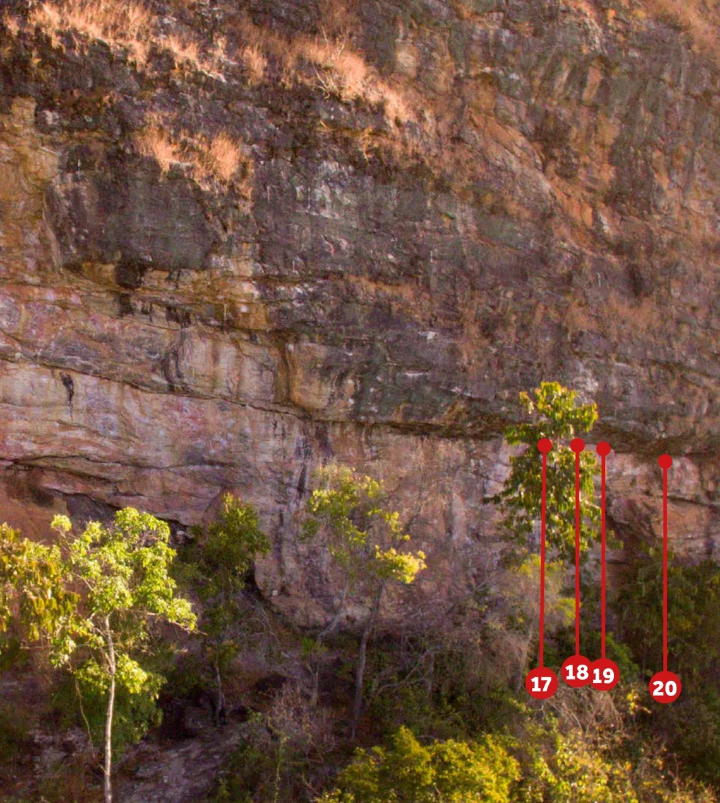
    - **largura_mapa**: 1140
    - **altura_mapa**: 1270
    - **pontos_de_interesse**:
      - **[0]**:
        - **id**: xGj9tV6IsE76OZ
        - **uid**: xGj9tV6IsE76OZ
        - **rotulo**: 17
        - **circulo**:
          - **x**: 858
          - **y**: 1081
          - **raio**: 26
        - **label**: 17
      - **[1]**:
        - **id**: h0BP1Iv3C8nojt
        - **uid**: h0BP1Iv3C8nojt
        - **rotulo**: 18
        - **circulo**:
          - **x**: 914
          - **y**: 1062
          - **raio**: 25
        - **label**: 18
      - **[2]**:
        - **id**: 5P2vYzXR2JTyC5
        - **uid**: 5P2vYzXR2JTyC5
        - **rotulo**: 19
        - **circulo**:
          - **x**: 955
          - **y**: 1068
          - **raio**: 26
        - **label**: 19
      - **[3]**:
        - **id**: 57zwLNC4NB1QgE
        - **uid**: 57zwLNC4NB1QgE
        - **rotulo**: 20
        - **circulo**:
          - **x**: 1053
          - **y**: 1087
          - **raio**: 26
        - **label**: 20
    - **referencias**:
      - **[0]**:
        - **alvo_uid**: BsI4k9yPnH5DRR
        - **pontos_uids**:
          - xGj9tV6IsE76OZ
        - **escalada**: Natural Climb
        - **ids**:
          - xGj9tV6IsE76OZ
      - **[1]**:
        - **alvo_uid**: vdWGVzFsYDwaQH
        - **pontos_uids**:
          - h0BP1Iv3C8nojt
        - **escalada**: Chape
        - **ids**:
          - h0BP1Iv3C8nojt
      - **[2]**:
        - **alvo_uid**: 9BvYuLQwFnoDY4
        - **pontos_uids**:
          - 5P2vYzXR2JTyC5
        - **escalada**: Comando Delta
        - **ids**:
          - 5P2vYzXR2JTyC5
      - **[3]**:
        - **alvo_uid**: 5tfG8RnUv0Kbby
        - **pontos_uids**:
          - 57zwLNC4NB1QgE
        - **escalada**: Rachando os Bico
        - **ids**:
          - 57zwLNC4NB1QgE
  - **[3]**:
    - **caminho_imagem_mapa**: 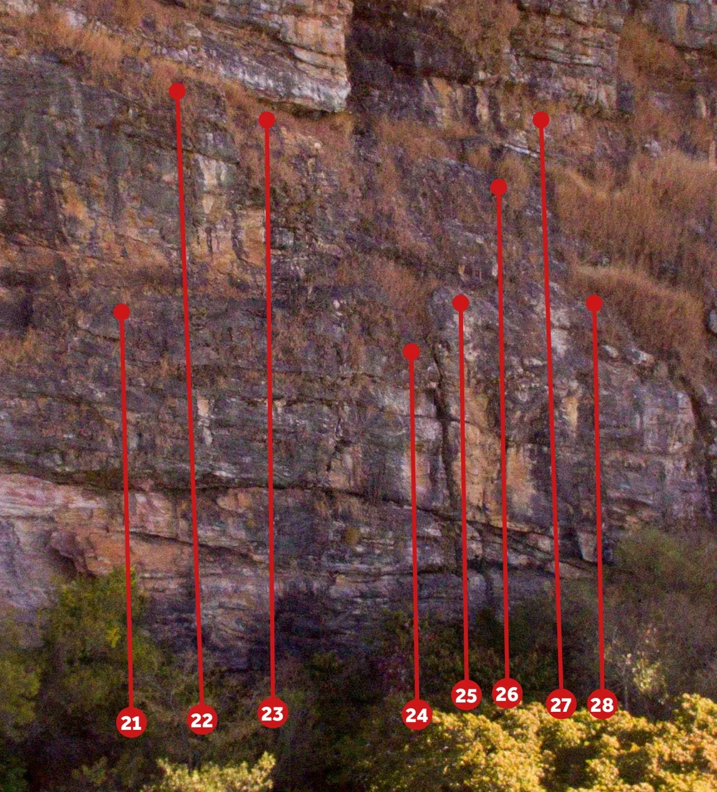
    - **largura_mapa**: 1146
    - **altura_mapa**: 1264
    - **pontos_de_interesse**:
      - **[0]**:
        - **id**: XweVblYrpqTYtU
        - **uid**: XweVblYrpqTYtU
        - **rotulo**: 21
        - **circulo**:
          - **x**: 210
          - **y**: 1154
          - **raio**: 25
        - **label**: 21
      - **[1]**:
        - **id**: aiUzgymVH79URH
        - **uid**: aiUzgymVH79URH
        - **rotulo**: 22
        - **circulo**:
          - **x**: 324
          - **y**: 1149
          - **raio**: 25
        - **label**: 22
      - **[2]**:
        - **id**: rLOiwo9onNuREd
        - **uid**: rLOiwo9onNuREd
        - **rotulo**: 23
        - **circulo**:
          - **x**: 436
          - **y**: 1138
          - **raio**: 25
        - **label**: 23
      - **[3]**:
        - **id**: BZdr830a6PWwSC
        - **uid**: BZdr830a6PWwSC
        - **rotulo**: 24
        - **circulo**:
          - **x**: 666
          - **y**: 1141
          - **raio**: 25
        - **label**: 24
      - **[4]**:
        - **id**: Pm9tbpsxXhTxBy
        - **uid**: Pm9tbpsxXhTxBy
        - **rotulo**: 25
        - **circulo**:
          - **x**: 746
          - **y**: 1109
          - **raio**: 24
        - **label**: 25
      - **[5]**:
        - **id**: 1QHYZAEvriEn06
        - **uid**: 1QHYZAEvriEn06
        - **rotulo**: 26
        - **circulo**:
          - **x**: 810
          - **y**: 1107
          - **raio**: 24
        - **label**: 26
      - **[6]**:
        - **id**: nW2u62ZMKkWEgh
        - **uid**: nW2u62ZMKkWEgh
        - **rotulo**: 27
        - **circulo**:
          - **x**: 897
          - **y**: 1124
          - **raio**: 24
        - **label**: 27
      - **[7]**:
        - **id**: owKBZE3xVZYpir
        - **uid**: owKBZE3xVZYpir
        - **rotulo**: 28
        - **circulo**:
          - **x**: 963
          - **y**: 1123
          - **raio**: 25
        - **label**: 28
    - **referencias**:
      - **[0]**:
        - **alvo_uid**: H2qOuKrpEQlu0A
        - **pontos_uids**:
          - XweVblYrpqTYtU
        - **escalada**: Mato Seco
        - **ids**:
          - XweVblYrpqTYtU
      - **[1]**:
        - **alvo_uid**: jLN8OHcYm3uybN
        - **pontos_uids**:
          - aiUzgymVH79URH
        - **escalada**: De um jeito ou de Outro
        - **ids**:
          - aiUzgymVH79URH
      - **[2]**:
        - **alvo_uid**: IDsRjzE5Shsn0i
        - **pontos_uids**:
          - rLOiwo9onNuREd
        - **escalada**: Arapuá
        - **ids**:
          - rLOiwo9onNuREd
      - **[3]**:
        - **alvo_uid**: a8qjjWEmbXbw1g
        - **pontos_uids**:
          - BZdr830a6PWwSC
        - **escalada**: Carcará Uru
        - **ids**:
          - BZdr830a6PWwSC
      - **[4]**:
        - **alvo_uid**: TCHHRRwnSo0yWJ
        - **pontos_uids**:
          - Pm9tbpsxXhTxBy
        - **escalada**: Rapadura
        - **ids**:
          - Pm9tbpsxXhTxBy
      - **[5]**:
        - **alvo_uid**: QoHpF2tNA5YI8Y
        - **pontos_uids**:
          - 1QHYZAEvriEn06
        - **escalada**: Zé Bunitim
        - **ids**:
          - 1QHYZAEvriEn06
      - **[6]**:
        - **alvo_uid**: BrMHU0dJXjsBV8
        - **pontos_uids**:
          - nW2u62ZMKkWEgh
        - **escalada**: Vai ser Fei
        - **ids**:
          - nW2u62ZMKkWEgh
      - **[7]**:
        - **alvo_uid**: naXlgfjpGm7qed
        - **pontos_uids**:
          - owKBZE3xVZYpir
        - **escalada**: Estrela Solitária
        - **ids**:
          - owKBZE3xVZYpir
  - **[4]**:
    - **caminho_imagem_mapa**: 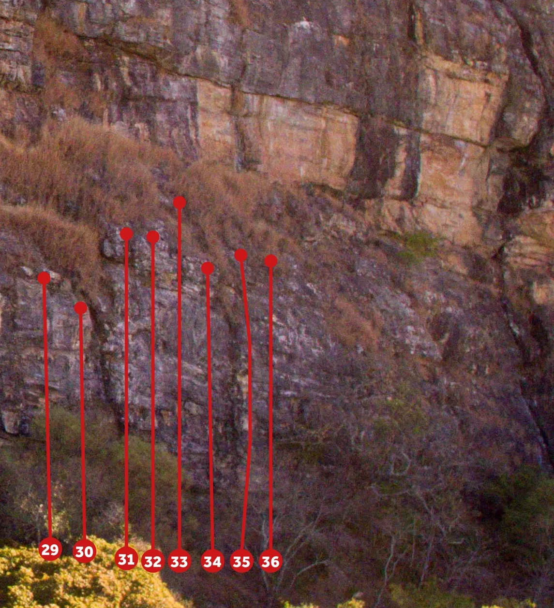
    - **largura_mapa**: 1145
    - **altura_mapa**: 1258
    - **pontos_de_interesse**:
      - **[0]**:
        - **id**: akOsodANt89xcy
        - **uid**: akOsodANt89xcy
        - **rotulo**: 29
        - **circulo**:
          - **x**: 104
          - **y**: 1136
          - **raio**: 25
        - **label**: 29
      - **[1]**:
        - **id**: mTDNcu4v9nLF71
        - **uid**: mTDNcu4v9nLF71
        - **rotulo**: 30
        - **circulo**:
          - **x**: 174
          - **y**: 1140
          - **raio**: 25
        - **label**: 30
      - **[2]**:
        - **id**: wz3w3L8BZbA8Ps
        - **uid**: wz3w3L8BZbA8Ps
        - **rotulo**: 31
        - **circulo**:
          - **x**: 261
          - **y**: 1155
          - **raio**: 25
        - **label**: 31
      - **[3]**:
        - **id**: DWuZZuNmE9lhMm
        - **uid**: DWuZZuNmE9lhMm
        - **rotulo**: 32
        - **circulo**:
          - **x**: 316
          - **y**: 1161
          - **raio**: 25
        - **label**: 32
      - **[4]**:
        - **id**: ALCNfLwr14TJgb
        - **uid**: ALCNfLwr14TJgb
        - **rotulo**: 33
        - **circulo**:
          - **x**: 371
          - **y**: 1160
          - **raio**: 25
        - **label**: 33
      - **[5]**:
        - **id**: ba6Q0RjorgFJP7
        - **uid**: ba6Q0RjorgFJP7
        - **rotulo**: 34
        - **circulo**:
          - **x**: 439
          - **y**: 1161
          - **raio**: 25
        - **label**: 34
      - **[6]**:
        - **id**: vmCeTpXHJkG5YU
        - **uid**: vmCeTpXHJkG5YU
        - **rotulo**: 35
        - **circulo**:
          - **x**: 499
          - **y**: 1161
          - **raio**: 25
        - **label**: 35
      - **[7]**:
        - **id**: TZopm3wqMLsNCq
        - **uid**: TZopm3wqMLsNCq
        - **rotulo**: 36
        - **circulo**:
          - **x**: 559
          - **y**: 1161
          - **raio**: 25
        - **label**: 36
    - **referencias**:
      - **[0]**:
        - **alvo_uid**: uM5ETrXCCnlNpz
        - **pontos_uids**:
          - akOsodANt89xcy
        - **escalada**: Vergateza
        - **ids**:
          - akOsodANt89xcy
      - **[1]**:
        - **alvo_uid**: wl0W2dMTksTump
        - **pontos_uids**:
          - mTDNcu4v9nLF71
        - **escalada**: Chico Curandeiro
        - **ids**:
          - mTDNcu4v9nLF71
      - **[2]**:
        - **alvo_uid**: h9FgimQVw16Llh
        - **pontos_uids**:
          - wz3w3L8BZbA8Ps
        - **escalada**: Reforma Trabalhista
        - **ids**:
          - wz3w3L8BZbA8Ps
      - **[3]**:
        - **alvo_uid**: kDDmL8pKIyDiFz
        - **pontos_uids**:
          - DWuZZuNmE9lhMm
        - **escalada**: Arborigenas
        - **ids**:
          - DWuZZuNmE9lhMm
      - **[4]**:
        - **alvo_uid**: jJvROrAbIcYEQo
        - **pontos_uids**:
          - ALCNfLwr14TJgb
        - **escalada**: Faz sua Parte
        - **ids**:
          - ALCNfLwr14TJgb
      - **[5]**:
        - **alvo_uid**: BmdokcT3buzsCG
        - **pontos_uids**:
          - ba6Q0RjorgFJP7
        - **escalada**: Delirando
        - **ids**:
          - ba6Q0RjorgFJP7
      - **[6]**:
        - **alvo_uid**: gi517SFLPmugWw
        - **pontos_uids**:
          - vmCeTpXHJkG5YU
        - **escalada**: Saraiva
        - **ids**:
          - vmCeTpXHJkG5YU
      - **[7]**:
        - **alvo_uid**: yBXaNEaTkhudiE
        - **pontos_uids**:
          - TZopm3wqMLsNCq
        - **escalada**: Rolando Lero
        - **ids**:
          - TZopm3wqMLsNCq
  - **[5]**:
    - **caminho_imagem_mapa**: 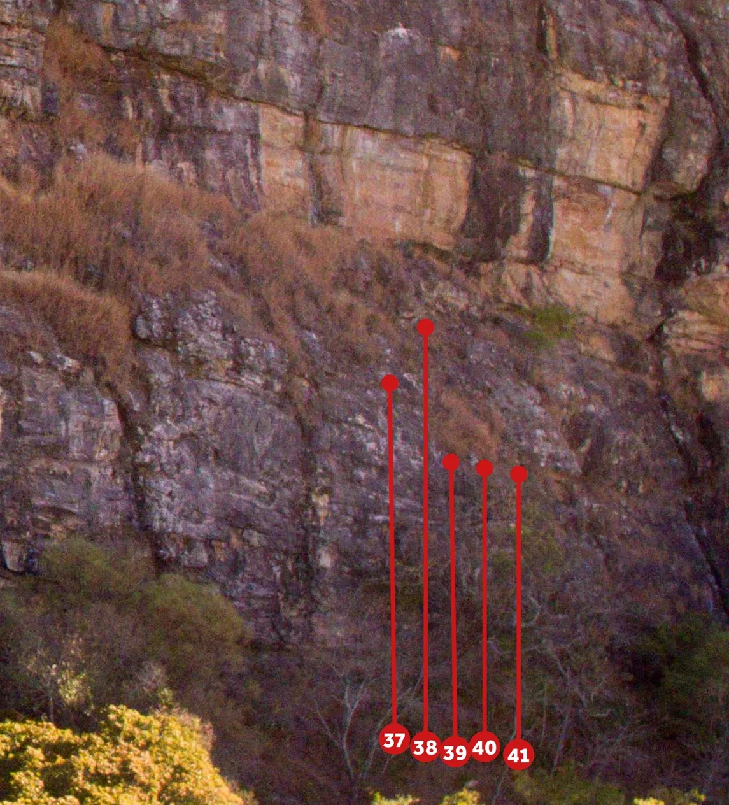
    - **largura_mapa**: 1145
    - **altura_mapa**: 1264
    - **pontos_de_interesse**:
      - **[0]**:
        - **id**: dDQ5kKPVTlQ5Cs
        - **uid**: dDQ5kKPVTlQ5Cs
        - **rotulo**: 37
        - **circulo**:
          - **x**: 619
          - **y**: 1161
          - **raio**: 25
        - **label**: 37
      - **[1]**:
        - **id**: 8gwxepUxMglsmu
        - **uid**: 8gwxepUxMglsmu
        - **rotulo**: 38
        - **circulo**:
          - **x**: 669
          - **y**: 1173
          - **raio**: 25
        - **label**: 38
      - **[2]**:
        - **id**: w81UJxCpYoklGL
        - **uid**: w81UJxCpYoklGL
        - **rotulo**: 39
        - **circulo**:
          - **x**: 715
          - **y**: 1181
          - **raio**: 25
        - **label**: 39
      - **[3]**:
        - **id**: 7D7qfyXe6GKMjw
        - **uid**: 7D7qfyXe6GKMjw
        - **rotulo**: 40
        - **circulo**:
          - **x**: 761
          - **y**: 1173
          - **raio**: 25
        - **label**: 40
      - **[4]**:
        - **id**: MddszylTmeQ098
        - **uid**: MddszylTmeQ098
        - **rotulo**: 41
        - **circulo**:
          - **x**: 815
          - **y**: 1185
          - **raio**: 25
        - **label**: 41
    - **referencias**:
      - **[0]**:
        - **alvo_uid**: 2Hk2fgJBEqidDo
        - **pontos_uids**:
          - dDQ5kKPVTlQ5Cs
        - **escalada**: Jardinagem
        - **ids**:
          - dDQ5kKPVTlQ5Cs
      - **[1]**:
        - **alvo_uid**: 0FvddY5SgNJfXh
        - **pontos_uids**:
          - 8gwxepUxMglsmu
        - **escalada**: Soldados do Sol
        - **ids**:
          - 8gwxepUxMglsmu
      - **[2]**:
        - **alvo_uid**: CCpYiQTAYU4JzL
        - **pontos_uids**:
          - w81UJxCpYoklGL
        - **escalada**: Metamorfose Ambulante
        - **ids**:
          - w81UJxCpYoklGL
      - **[3]**:
        - **alvo_uid**: YPShBCxz1NnuoC
        - **pontos_uids**:
          - 7D7qfyXe6GKMjw
        - **escalada**: Baby Rasta
        - **ids**:
          - 7D7qfyXe6GKMjw
      - **[4]**:
        - **alvo_uid**: 3mRLgxBhK9EuPn
        - **pontos_uids**:
          - MddszylTmeQ098
        - **escalada**: Cara ou Crachá
        - **ids**:
          - MddszylTmeQ098
- **escaladas**:
  - **[0]**:
    - **uid**: F7D9fVSvVzF8LF
    - **via_esportiva**:
      - **nome**: Permissão Concebida
      - **dificuldade**: BR_8A
      - **extensao**: 8
      - **quantidade_protecoes_intermediarias**: 4
      - **quantidade_protecoes_parada**: 2
      - **conquistadores**:
        - Diego Leonardo
        - Gustavo Maneira
      - **data_abertura**: 2008
  - **[1]**:
    - **uid**: TGxnEnnJtAimRH
    - **via_esportiva**:
      - **nome**: Bocaina Aventura
      - **dificuldade**: PROJETO
      - **extensao**: 10
      - **quantidade_protecoes_intermediarias**: 6
      - **quantidade_protecoes_parada**: 2
      - **conquistadores**:
        - Diego Leonardo
        - Alexandre Fei
      - **data_abertura**: 2017
  - **[2]**:
    - **uid**: Ie9UWepqQRMx6o
    - **via_esportiva**:
      - **nome**: O Vento Levou
      - **dificuldade**: BR_10A
      - **extensao**: 10
      - **quantidade_protecoes_intermediarias**: 4
      - **quantidade_protecoes_parada**: 2
      - **conquistadores**:
        - Diego Leonardo
        - Alexandre Fei
      - **data_abertura**: 2017
  - **[3]**:
    - **uid**: hKx4cwMfhTYeb6
    - **via_esportiva**:
      - **nome**: Titan
      - **dificuldade**: PROJETO
      - **extensao**: 10
      - **conquistadores**:
        - Alexandre Fei
        - Diego Leonardo
      - **data_abertura**: 2017
  - **[4]**:
    - **uid**: SszjnbPwrsf4eq
    - **via_esportiva**:
      - **nome**: Mirian
      - **dificuldade**: BR_8C
      - **extensao**: 15
      - **quantidade_protecoes_intermediarias**: 7
      - **quantidade_protecoes_parada**: 2
      - **conquistadores**:
        - Gustavo Piacasteli
        - Difora
        - Alexandre Fei
        - Gustavo Scandiuzzi
      - **data_abertura**: 2008
  - **[5]**:
    - **uid**: 0lcn0eDNV8CEwv
    - **via_esportiva**:
      - **nome**: Hipnose
      - **dificuldade**: BR_7C
      - **extensao**: 15
      - **quantidade_protecoes_intermediarias**: 6
      - **quantidade_protecoes_parada**: 2
      - **conquistadores**:
        - Daiex de Almeida
        - Alexandre Fei
      - **data_abertura**: 2008
  - **[6]**:
    - **uid**: w85Oym63vWA2qF
    - **via_esportiva**:
      - **nome**: Resta Um
      - **dificuldade**: BR_9A
      - **extensao**: 15
      - **quantidade_protecoes_intermediarias**: 7
      - **quantidade_protecoes_parada**: 2
      - **conquistadores**:
        - Alexandre Fei
        - Juliano Peter Park
        - Juliano Fernandes
      - **data_abertura**: 2006
  - **[7]**:
    - **uid**: wmBgyAkH8bCedi
    - **via_esportiva**:
      - **nome**: Medo de quê Aresta
      - **dificuldade**: BR_10A
      - **extensao**: 15
      - **quantidade_protecoes_intermediarias**: 7
      - **quantidade_protecoes_parada**: 2
      - **conquistadores**:
        - Rafael Furtado
        - Alexandre Fei
      - **data_abertura**: 2008
  - **[8]**:
    - **uid**: apiiCMS0Y3LfGH
    - **via_esportiva**:
      - **nome**: Pressão Psicológica
      - **dificuldade**: PROJETO
      - **extensao**: 15
      - **quantidade_protecoes_intermediarias**: 6
      - **quantidade_protecoes_parada**: 2
      - **conquistadores**:
        - Alexandre Fei
        - Felipe Belisario
      - **data_abertura**: 2009
  - **[9]**:
    - **uid**: DRKloY4ISi99SZ
    - **via_esportiva**:
      - **nome**: Zumbi da Bocaina
      - **dificuldade**: BR_8B
      - **extensao**: 15
      - **quantidade_protecoes_intermediarias**: 7
      - **quantidade_protecoes_parada**: 2
      - **conquistadores**:
        - Fei
        - Diego Leonardo
        - Ricardo Magrão
      - **data_abertura**: 2008
  - **[10]**:
    - **uid**: Y0YqvSUbQarcyO
    - **via_esportiva**:
      - **nome**: Curta e Grossa
      - **dificuldade**: BR_7C
      - **extensao**: 15
      - **quantidade_protecoes_intermediarias**: 8
      - **quantidade_protecoes_parada**: 2
      - **conquistadores**:
        - Juliano
        - Diego
        - Alexandre Fei
      - **data_abertura**: 2006
  - **[11]**:
    - **uid**: pE81kT7cLImtOA
    - **via_esportiva**:
      - **nome**: Menos Curta e Mais Grossa
      - **dificuldade**: BR_8C
      - **extensao**: 15
      - **quantidade_protecoes_intermediarias**: 7
      - **quantidade_protecoes_parada**: 2
      - **conquistadores**:
        - Alexandre Fei
        - Lucas Ramos
        - Gabriel Guimarães
      - **data_abertura**: 2009
  - **[12]**:
    - **uid**: fWW466uDuqrrBy
    - **via_esportiva**:
      - **nome**: El Corazon
      - **dificuldade**: BR_8B
      - **extensao**: 15
      - **quantidade_protecoes_intermediarias**: 8
      - **quantidade_protecoes_parada**: 2
      - **conquistadores**:
        - Alexandre Fei
      - **data_abertura**: 2017
  - **[13]**:
    - **uid**: J7bXywRiu0PAXt
    - **via_esportiva**:
      - **nome**: Sombra e Água Fresca
      - **dificuldade**: BR_6
      - **extensao**: 5
      - **quantidade_protecoes_intermediarias**: 2
      - **quantidade_protecoes_parada**: 2
      - **conquistadores**:
        - Juliano
      - **data_abertura**: 2006
  - **[14]**:
    - **uid**: hF0nLRzYrLtFnG
    - **via_esportiva**:
      - **nome**: Vitamina C
      - **dificuldade**: BR_10A
      - **extensao**: 10
      - **quantidade_protecoes_intermediarias**: 4
      - **conquistadores**:
        - Juliano Peter Park
        - Alexandre Fei
      - **data_abertura**: 2006
  - **[15]**:
    - **uid**: x8blgb1mpYRvI2
    - **via_esportiva**:
      - **descricao**: Falta topo.
      - **nome**: Mão de Vaca
      - **dificuldade**: INDEFINIDO
      - **quantidade_protecoes_intermediarias**: 6
      - **conquistadores**:
        - Juliano
  - **[16]**:
    - **uid**: BsI4k9yPnH5DRR
    - **via_esportiva**:
      - **nome**: Natural Climb
      - **dificuldade**: BR_8B
      - **extensao**: 15
      - **quantidade_protecoes_intermediarias**: 6
      - **quantidade_protecoes_parada**: 2
      - **conquistadores**:
        - Alexandre Fei
      - **data_abertura**: 2017
  - **[17]**:
    - **uid**: vdWGVzFsYDwaQH
    - **via_esportiva**:
      - **nome**: Chape
      - **dificuldade**: INDEFINIDO
  - **[18]**:
    - **uid**: 9BvYuLQwFnoDY4
    - **via_esportiva**:
      - **nome**: Comando Delta
      - **dificuldade**: BR_6
      - **extensao**: 10
      - **quantidade_protecoes_intermediarias**: 3
      - **quantidade_protecoes_parada**: 2
      - **conquistadores**:
        - Juliano
      - **data_abertura**: 2005
  - **[19]**:
    - **uid**: 5tfG8RnUv0Kbby
    - **via_esportiva**:
      - **nome**: Rachando os Bico
      - **dificuldade**: BR_5
      - **extensao**: 10
      - **quantidade_protecoes_intermediarias**: 3
      - **quantidade_protecoes_parada**: 2
      - **conquistadores**:
        - Juliano
      - **data_abertura**: 2006
  - **[20]**:
    - **uid**: H2qOuKrpEQlu0A
    - **via_esportiva**:
      - **descricao**: Inacabada.
      - **nome**: Mato Seco
      - **dificuldade**: PROJETO
  - **[21]**:
    - **uid**: jLN8OHcYm3uybN
    - **via_esportiva**:
      - **nome**: De um jeito ou de Outro
      - **dificuldade**: INDEFINIDO
  - **[22]**:
    - **uid**: IDsRjzE5Shsn0i
    - **via_esportiva**:
      - **nome**: Arapuá
      - **dificuldade**: INDEFINIDO
  - **[23]**:
    - **uid**: a8qjjWEmbXbw1g
    - **via_esportiva**:
      - **nome**: Carcará Uru
      - **dificuldade**: BR_6SUP
      - **extensao**: 10
      - **quantidade_protecoes_intermediarias**: 4
      - **quantidade_protecoes_parada**: 2
      - **conquistadores**:
        - Daiex de Almeida
        - Geovane
      - **data_abertura**: 2017
  - **[24]**:
    - **uid**: TCHHRRwnSo0yWJ
    - **via_esportiva**:
      - **nome**: Rapadura
      - **dificuldade**: BR_7A
      - **extensao**: 15
      - **quantidade_protecoes_intermediarias**: 6
      - **quantidade_protecoes_parada**: 2
      - **conquistadores**:
        - Alexandre Fei
      - **data_abertura**: 2017
  - **[25]**:
    - **uid**: QoHpF2tNA5YI8Y
    - **via_esportiva**:
      - **nome**: Zé Bunitim
      - **dificuldade**: PROJETO
      - **extensao**: 20
      - **quantidade_protecoes_intermediarias**: 6
      - **quantidade_protecoes_parada**: 2
      - **conquistadores**:
        - Saulo
        - Diego
      - **data_abertura**: 2017
  - **[26]**:
    - **uid**: BrMHU0dJXjsBV8
    - **via_esportiva**:
      - **nome**: Vai ser Fei
      - **dificuldade**: BR_6SUP
      - **extensao**: 25
      - **quantidade_protecoes_intermediarias**: 7
      - **quantidade_protecoes_parada**: 2
      - **conquistadores**:
        - Diego Leonardo
      - **data_abertura**: 2017
  - **[27]**:
    - **uid**: naXlgfjpGm7qed
    - **via_esportiva**:
      - **nome**: Estrela Solitária
      - **dificuldade**: BR_6SUP
      - **extensao**: 12
      - **quantidade_protecoes_intermediarias**: 5
      - **quantidade_protecoes_parada**: 2
      - **conquistadores**:
        - Daiex de Almeida
      - **data_abertura**: 2017
  - **[28]**:
    - **uid**: uM5ETrXCCnlNpz
    - **via_esportiva**:
      - **nome**: Vergateza
      - **dificuldade**: BR_6SUP
      - **extensao**: 12
      - **quantidade_protecoes_intermediarias**: 5
      - **quantidade_protecoes_parada**: 2
      - **conquistadores**:
        - Daiex de Almeida
      - **data_abertura**: 2017
  - **[29]**:
    - **uid**: wl0W2dMTksTump
    - **via_esportiva**:
      - **nome**: Chico Curandeiro
      - **dificuldade**: BR_6
      - **extensao**: 10
      - **quantidade_protecoes_intermediarias**: 5
      - **quantidade_protecoes_parada**: 2
      - **conquistadores**:
        - Daiex de Almeida
      - **data_abertura**: 2017
  - **[30]**:
    - **uid**: h9FgimQVw16Llh
    - **via_esportiva**:
      - **nome**: Reforma Trabalhista
      - **dificuldade**: BR_7A
      - **extensao**: 18
      - **quantidade_protecoes_intermediarias**: 5
      - **quantidade_protecoes_parada**: 2
      - **conquistadores**:
        - Daiex de Almeida
      - **data_abertura**: 2017
  - **[31]**:
    - **uid**: kDDmL8pKIyDiFz
    - **via_esportiva**:
      - **nome**: Arborigenas
      - **dificuldade**: PROJETO
      - **extensao**: 18
      - **quantidade_protecoes_intermediarias**: 6
      - **quantidade_protecoes_parada**: 2
      - **conquistadores**:
        - Daiex de Almeida
      - **data_abertura**: 2017
  - **[32]**:
    - **uid**: jJvROrAbIcYEQo
    - **via_esportiva**:
      - **nome**: Faz sua Parte
      - **dificuldade**: BR_7A
      - **extensao**: 25
      - **quantidade_protecoes_intermediarias**: 6
      - **quantidade_protecoes_parada**: 2
      - **conquistadores**:
        - Daiex de Almeida
        - Pedro Andrade
      - **data_abertura**: 2017
  - **[33]**:
    - **uid**: BmdokcT3buzsCG
    - **via_esportiva**:
      - **nome**: Delirando
      - **dificuldade**: BR_6SUP
      - **extensao**: 18
      - **quantidade_protecoes_intermediarias**: 5
      - **quantidade_protecoes_parada**: 2
      - **conquistadores**:
        - Daiex de Almeida
      - **data_abertura**: 2017
  - **[34]**:
    - **uid**: gi517SFLPmugWw
    - **via_esportiva**:
      - **nome**: Saraiva
      - **dificuldade**: BR_6SUP
      - **extensao**: 20
      - **quantidade_protecoes_intermediarias**: 4
      - **quantidade_protecoes_parada**: 2
      - **conquistadores**:
        - Daiex de Almeida
      - **data_abertura**: 2017
  - **[35]**:
    - **uid**: yBXaNEaTkhudiE
    - **via_esportiva**:
      - **nome**: Rolando Lero
      - **dificuldade**: BR_6SUP
      - **extensao**: 20
      - **quantidade_protecoes_intermediarias**: 5
      - **quantidade_protecoes_parada**: 2
      - **conquistadores**:
        - Daiex de Almeida
      - **data_abertura**: 2017
  - **[36]**:
    - **uid**: 2Hk2fgJBEqidDo
    - **via_esportiva**:
      - **nome**: Jardinagem
      - **dificuldade**: BR_7A
      - **extensao**: 10
      - **quantidade_protecoes_intermediarias**: 4
      - **quantidade_protecoes_parada**: 2
      - **conquistadores**:
        - Daiex de Almeida
      - **data_abertura**: 2017
  - **[37]**:
    - **uid**: 0FvddY5SgNJfXh
    - **via_esportiva**:
      - **nome**: Soldados do Sol
      - **dificuldade**: BR_7A
      - **extensao**: 15
      - **quantidade_protecoes_intermediarias**: 4
      - **quantidade_protecoes_parada**: 2
      - **conquistadores**:
        - Alexandre Fei
      - **data_abertura**: 2017
  - **[38]**:
    - **uid**: CCpYiQTAYU4JzL
    - **via_esportiva**:
      - **nome**: Metamorfose Ambulante
      - **dificuldade**: BR_6SUP
      - **extensao**: 8
      - **quantidade_protecoes_intermediarias**: 4
      - **quantidade_protecoes_parada**: 2
      - **conquistadores**:
        - Daiex de Almeida
      - **data_abertura**: 2017
  - **[39]**:
    - **uid**: YPShBCxz1NnuoC
    - **via_esportiva**:
      - **nome**: Baby Rasta
      - **dificuldade**: BR_6
      - **extensao**: 8
      - **quantidade_protecoes_intermediarias**: 4
      - **quantidade_protecoes_parada**: 2
      - **conquistadores**:
        - Alexandre Fei
      - **data_abertura**: 2017
  - **[40]**:
    - **uid**: 3mRLgxBhK9EuPn
    - **via_esportiva**:
      - **nome**: Cara ou Crachá
      - **dificuldade**: BR_6
      - **extensao**: 8
      - **quantidade_protecoes_intermediarias**: 4
      - **quantidade_protecoes_parada**: 2
      - **conquistadores**:
        - Daiex
        - Saulo
      - **data_abertura**: 2017
- **precomputados**:
  - **total_escaladas**: 41
  - **total_esportivas**: 41

## Parte: setor_segundo_andar

### Setor (Pico: Bocaina Park)

- **descricao**:
    # Setor Segundo Andar
    
    O Setor Segundo Andar oferece vias atléticas com nomes inspirados na cultura pop, variando de 6º a 9º grau.
    
    > [!TIP]
    > Leve seu lixo e outro que encontrar para a cidade. Não faça necessidades fisiológicas nas trilhas e base de vias. Avisar a administração sobre a abertura de novas vias de escalada. **USE CAPACETE NAS BASES DE VIAS DE ESCALADA.**
- **nome**: Segundo Andar
- **uid**: uiwowojbrlzAlz
- **caminho_imagem_capa**: 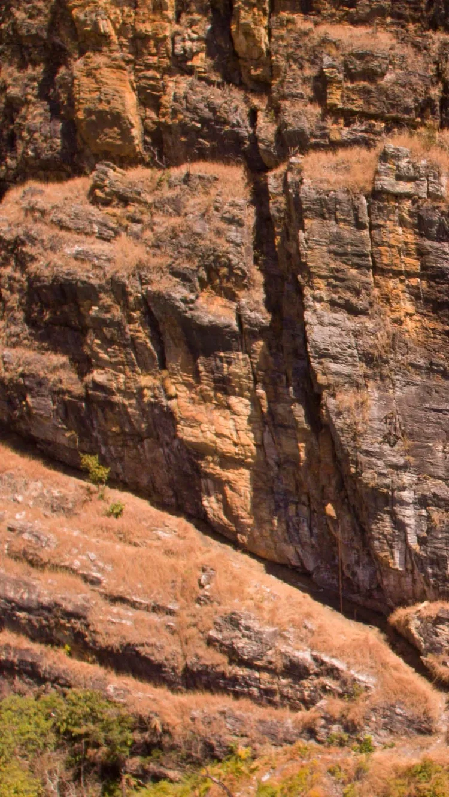
- **mapas**:
  - **[0]**:
    - **caminho_imagem_mapa**: 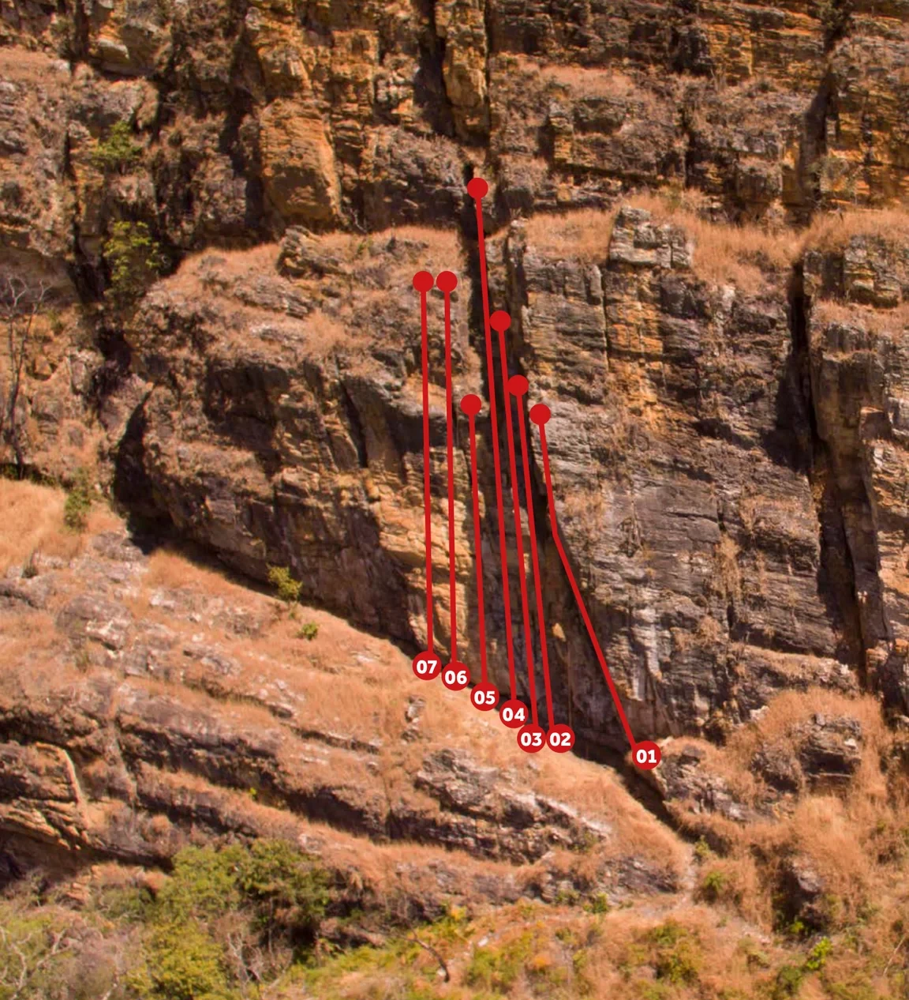
    - **largura_mapa**: 1152
    - **altura_mapa**: 1266
    - **pontos_de_interesse**:
      - **[0]**:
        - **id**: iwYgC4aJ56Q7n1
        - **uid**: iwYgC4aJ56Q7n1
        - **rotulo**: 01
        - **circulo**:
          - **x**: 820
          - **y**: 956
          - **raio**: 19
        - **label**: 01
      - **[1]**:
        - **id**: Qku4cX6BPewmqD
        - **uid**: Qku4cX6BPewmqD
        - **rotulo**: 02
        - **circulo**:
          - **x**: 711
          - **y**: 935
          - **raio**: 18
        - **label**: 02
      - **[2]**:
        - **id**: 9DGG4VeBXV43cN
        - **uid**: 9DGG4VeBXV43cN
        - **rotulo**: 03
        - **circulo**:
          - **x**: 674
          - **y**: 935
          - **raio**: 19
        - **label**: 03
      - **[3]**:
        - **id**: crXh3CmLA53Vfz
        - **uid**: crXh3CmLA53Vfz
        - **rotulo**: 04
        - **circulo**:
          - **x**: 651
          - **y**: 904
          - **raio**: 19
        - **label**: 04
      - **[4]**:
        - **id**: CJ3JdTiqiZt33R
        - **uid**: CJ3JdTiqiZt33R
        - **rotulo**: 05
        - **circulo**:
          - **x**: 615
          - **y**: 882
          - **raio**: 19
        - **label**: 05
      - **[5]**:
        - **id**: 1ewpRMv6Ryj1PP
        - **uid**: 1ewpRMv6Ryj1PP
        - **rotulo**: 06
        - **circulo**:
          - **x**: 578
          - **y**: 856
          - **raio**: 19
        - **label**: 06
      - **[6]**:
        - **id**: k2ndXucmZJ8mLM
        - **uid**: k2ndXucmZJ8mLM
        - **rotulo**: 07
        - **circulo**:
          - **x**: 541
          - **y**: 843
          - **raio**: 18
        - **label**: 07
    - **referencias**:
      - **[0]**:
        - **alvo_uid**: 22kahsv1xbSYcN
        - **pontos_uids**:
          - iwYgC4aJ56Q7n1
        - **escalada**: Torrecitas
        - **ids**:
          - iwYgC4aJ56Q7n1
      - **[1]**:
        - **alvo_uid**: xI6Dxi97YE6T42
        - **pontos_uids**:
          - Qku4cX6BPewmqD
        - **escalada**: Mula Preta
        - **ids**:
          - Qku4cX6BPewmqD
      - **[2]**:
        - **alvo_uid**: o4OeEdY6X5CVjh
        - **pontos_uids**:
          - 9DGG4VeBXV43cN
        - **escalada**: Homem de Ferro
        - **ids**:
          - 9DGG4VeBXV43cN
      - **[3]**:
        - **alvo_uid**: 9423ThOhc9l9vS
        - **pontos_uids**:
          - crXh3CmLA53Vfz
        - **escalada**: Paraíba Francês
        - **ids**:
          - crXh3CmLA53Vfz
      - **[4]**:
        - **alvo_uid**: V3JKzBPn5qrsU1
        - **pontos_uids**:
          - CJ3JdTiqiZt33R
        - **escalada**: Quaresmeira
        - **ids**:
          - CJ3JdTiqiZt33R
      - **[5]**:
        - **alvo_uid**: 2rXZcykXGEykwa
        - **pontos_uids**:
          - 1ewpRMv6Ryj1PP
        - **escalada**: 007 em... O Ataque das Andorinhas
        - **ids**:
          - 1ewpRMv6Ryj1PP
      - **[6]**:
        - **alvo_uid**: gCMJaS1Z31fRAI
        - **pontos_uids**:
          - k2ndXucmZJ8mLM
        - **escalada**: Jogo Limpo
        - **ids**:
          - k2ndXucmZJ8mLM
  - **[1]**:
    - **caminho_imagem_mapa**: 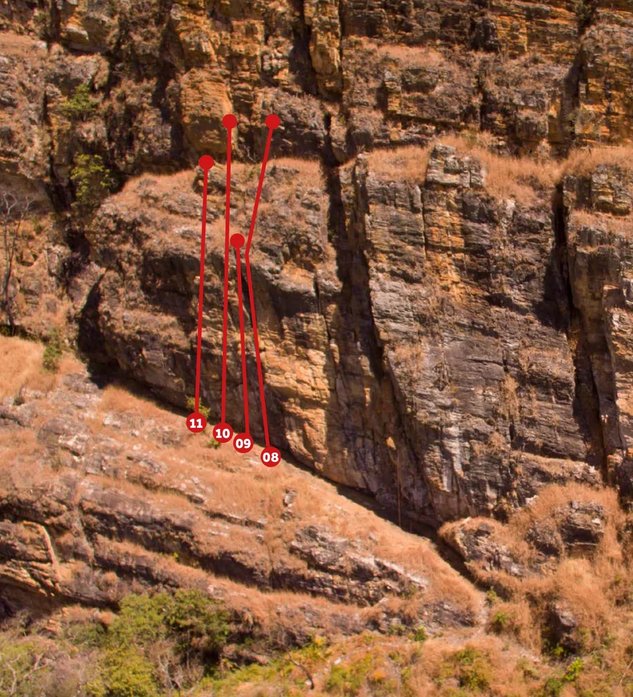
    - **largura_mapa**: 1140
    - **altura_mapa**: 1255
    - **pontos_de_interesse**:
      - **[0]**:
        - **id**: ez4EG55dLdavku
        - **uid**: ez4EG55dLdavku
        - **rotulo**: 08
        - **circulo**:
          - **x**: 488
          - **y**: 823
          - **raio**: 19
        - **label**: 08
      - **[1]**:
        - **id**: 9xvISV21bpDV01
        - **uid**: 9xvISV21bpDV01
        - **rotulo**: 09
        - **circulo**:
          - **x**: 438
          - **y**: 798
          - **raio**: 19
        - **label**: 09
      - **[2]**:
        - **id**: o1GWF7gBXJN9iZ
        - **uid**: o1GWF7gBXJN9iZ
        - **rotulo**: 10
        - **circulo**:
          - **x**: 401
          - **y**: 779
          - **raio**: 18
        - **label**: 10
      - **[3]**:
        - **id**: HRrlEogkFlP1Kb
        - **uid**: HRrlEogkFlP1Kb
        - **rotulo**: 11
        - **circulo**:
          - **x**: 354
          - **y**: 761
          - **raio**: 19
        - **label**: 11
    - **referencias**:
      - **[0]**:
        - **alvo_uid**: dkEvcLxjwHqk75
        - **pontos_uids**:
          - o1GWF7gBXJN9iZ
        - **escalada**: Rock Balboa
        - **ids**:
          - o1GWF7gBXJN9iZ
      - **[1]**:
        - **alvo_uid**: uKNP3Aq2gNs3UH
        - **pontos_uids**:
          - HRrlEogkFlP1Kb
        - **escalada**: Xodó da Bocaina
        - **ids**:
          - HRrlEogkFlP1Kb
      - **[2]**:
        - **alvo_uid**: ioecqiNedWEyKt
        - **pontos_uids**:
          - ez4EG55dLdavku
        - **escalada**: James Bond
        - **ids**:
          - ez4EG55dLdavku
      - **[3]**:
        - **alvo_uid**: 4apeMqQwWizOIG
        - **pontos_uids**:
          - 9xvISV21bpDV01
        - **escalada**: Apolo o Doutrinador
        - **ids**:
          - 9xvISV21bpDV01
- **escaladas**:
  - **[0]**:
    - **uid**: 22kahsv1xbSYcN
    - **via_esportiva**:
      - **descricao**: Inacabada.
      - **nome**: Torrecitas
      - **dificuldade**: PROJETO
      - **extensao**: 30
      - **quantidade_protecoes_intermediarias**: 8
      - **conquistadores**:
        - Alexandre Fei
        - Gustavo Maneira
      - **data_abertura**: 2010
  - **[1]**:
    - **uid**: xI6Dxi97YE6T42
    - **via_esportiva**:
      - **nome**: Mula Preta
      - **dificuldade**: BR_7C
      - **extensao**: 15
      - **quantidade_protecoes_intermediarias**: 6
      - **quantidade_protecoes_parada**: 2
      - **conquistadores**:
        - Alexandre Fei
        - Zac
      - **data_abertura**: 2017
  - **[2]**:
    - **uid**: o4OeEdY6X5CVjh
    - **via_esportiva**:
      - **nome**: Homem de Ferro
      - **dificuldade**: BR_8A
      - **extensao**: 17
      - **quantidade_protecoes_intermediarias**: 6
      - **quantidade_protecoes_parada**: 2
      - **conquistadores**:
        - Alexandre Fei
        - Gustavo Chorão
      - **data_abertura**: 2008
  - **[3]**:
    - **uid**: 9423ThOhc9l9vS
    - **via_esportiva**:
      - **nome**: Paraíba Francês
      - **dificuldade**: BR_6
      - **extensao**: 25
      - **conquistadores**:
        - Alexandre Fei
        - Daiex de Almeida
      - **data_abertura**: 2017
  - **[4]**:
    - **uid**: V3JKzBPn5qrsU1
    - **via_esportiva**:
      - **nome**: Quaresmeira
      - **dificuldade**: BR_7A
      - **extensao**: 15
      - **quantidade_protecoes_intermediarias**: 6
      - **quantidade_protecoes_parada**: 2
      - **conquistadores**:
        - Daiex de Almeida
      - **data_abertura**: 2017
  - **[5]**:
    - **uid**: 2rXZcykXGEykwa
    - **via_esportiva**:
      - **nome**: 007 em... O Ataque das Andorinhas
      - **dificuldade**: BR_7B
      - **extensao**: 20
      - **quantidade_protecoes_intermediarias**: 10
      - **quantidade_protecoes_parada**: 2
      - **conquistadores**:
        - Alexandre Fei
        - Gustavo Chorão
      - **data_abertura**: 2008
  - **[6]**:
    - **uid**: gCMJaS1Z31fRAI
    - **via_esportiva**:
      - **nome**: Jogo Limpo
      - **dificuldade**: PROJETO
      - **extensao**: 20
      - **quantidade_protecoes_intermediarias**: 10
      - **quantidade_protecoes_parada**: 2
      - **conquistadores**:
        - Alexandre Fei
        - Daiex de Almeida
      - **data_abertura**: 2017
  - **[7]**:
    - **uid**: ioecqiNedWEyKt
    - **via_esportiva**:
      - **nome**: James Bond
      - **dificuldade**: BR_8A
      - **extensao**: 23
      - **quantidade_protecoes_intermediarias**: 11
      - **quantidade_protecoes_parada**: 2
      - **conquistadores**:
        - Alexandre Fei
        - Gustavo Maneira
      - **data_abertura**: 2008
  - **[8]**:
    - **uid**: 4apeMqQwWizOIG
    - **via_esportiva**:
      - **nome**: Apolo o Doutrinador
      - **dificuldade**: BR_7B
      - **extensao**: 15
      - **quantidade_protecoes_intermediarias**: 6
      - **quantidade_protecoes_parada**: 2
      - **conquistadores**:
        - Alexandre Fei
        - Gustavo Maneira
      - **data_abertura**: 2009
  - **[9]**:
    - **uid**: dkEvcLxjwHqk75
    - **via_esportiva**:
      - **nome**: Rock Balboa
      - **dificuldade**: BR_9B
      - **extensao**: 20
      - **quantidade_protecoes_intermediarias**: 9
      - **quantidade_protecoes_parada**: 2
      - **conquistadores**:
        - Alexandre Fei
        - Gustavo Maneira
      - **data_abertura**: 2008
  - **[10]**:
    - **uid**: uKNP3Aq2gNs3UH
    - **via_esportiva**:
      - **nome**: Xodó da Bocaina
      - **dificuldade**: BR_7A
      - **extensao**: 20
      - **quantidade_protecoes_intermediarias**: 7
      - **quantidade_protecoes_parada**: 2
      - **conquistadores**:
        - Alexandre Fei
      - **data_abertura**: 2017
- **precomputados**:
  - **total_escaladas**: 11
  - **total_esportivas**: 11

## Parte: setor_pirados_de_rocha

### Setor (Pico: Bocaina Park)

- **descricao**:
    # Setor Pirados de Rocha
    
    Setor com várias vias de projeto e nomes inspirados no cenário político brasileiro de 2017.
    
    > [!TIP]
    > Leve seu lixo e outro que encontrar para a cidade. Não faça necessidades fisiológicas nas trilhas e base de vias. Avisar a administração sobre a abertura de novas vias de escalada. **USE CAPACETE NAS BASES DE VIAS DE ESCALADA.**
- **nome**: Pirados de Rocha
- **uid**: ObPNZKFJ6b8VT1
- **caminho_imagem_capa**: 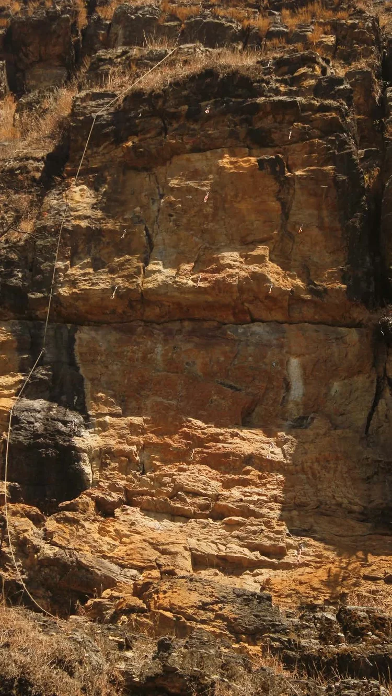
- **mapas**:
  - **[0]**:
    - **caminho_imagem_mapa**: 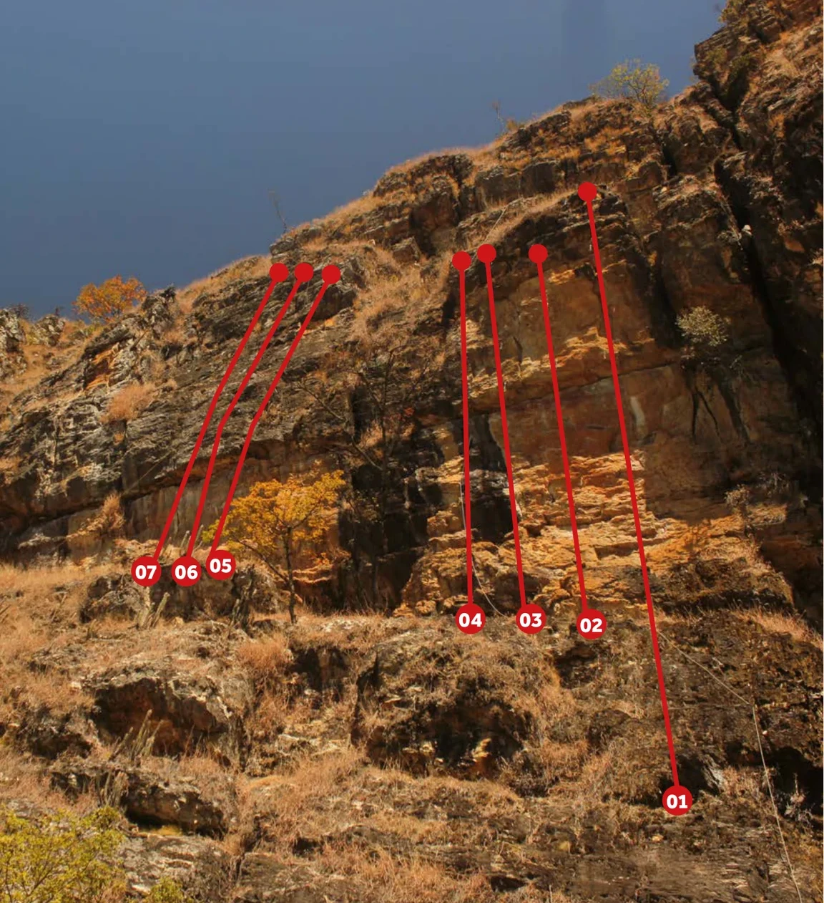
    - **largura_mapa**: 1152
    - **altura_mapa**: 1261
    - **pontos_de_interesse**:
      - **[0]**:
        - **id**: 0z6BsJvzvwywYg
        - **uid**: 0z6BsJvzvwywYg
        - **rotulo**: 01
        - **circulo**:
          - **x**: 947
          - **y**: 1118
          - **raio**: 21
        - **label**: 01
      - **[1]**:
        - **id**: qKbJYXmdKGlZo0
        - **uid**: qKbJYXmdKGlZo0
        - **rotulo**: 02
        - **circulo**:
          - **x**: 827
          - **y**: 872
          - **raio**: 22
        - **label**: 02
      - **[2]**:
        - **id**: FDgUxqzrKvcWFU
        - **uid**: FDgUxqzrKvcWFU
        - **rotulo**: 03
        - **circulo**:
          - **x**: 743
          - **y**: 865
          - **raio**: 21
        - **label**: 03
      - **[3]**:
        - **id**: oG1YAXAb7MQQUh
        - **uid**: oG1YAXAb7MQQUh
        - **rotulo**: 04
        - **circulo**:
          - **x**: 658
          - **y**: 865
          - **raio**: 22
        - **label**: 04
      - **[4]**:
        - **id**: lH443PEkiSko3A
        - **uid**: lH443PEkiSko3A
        - **rotulo**: 05
        - **circulo**:
          - **x**: 308
          - **y**: 789
          - **raio**: 22
        - **label**: 05
      - **[5]**:
        - **id**: rGJfhdjaqJK8pw
        - **uid**: rGJfhdjaqJK8pw
        - **rotulo**: 06
        - **circulo**:
          - **x**: 260
          - **y**: 798
          - **raio**: 22
        - **label**: 06
      - **[6]**:
        - **id**: OuAdkCsVHrBpIz
        - **uid**: OuAdkCsVHrBpIz
        - **rotulo**: 07
        - **circulo**:
          - **x**: 204
          - **y**: 798
          - **raio**: 21
        - **label**: 07
    - **referencias**:
      - **[0]**:
        - **alvo_uid**: rbApYVoMUkQEgp
        - **pontos_uids**:
          - 0z6BsJvzvwywYg
        - **escalada**: Uphill
        - **ids**:
          - 0z6BsJvzvwywYg
      - **[1]**:
        - **alvo_uid**: C9z6Zdg0MKWEP9
        - **pontos_uids**:
          - qKbJYXmdKGlZo0
        - **escalada**: Dilma Roussef
        - **ids**:
          - qKbJYXmdKGlZo0
      - **[2]**:
        - **alvo_uid**: 9qd69EYIr3CBS7
        - **pontos_uids**:
          - FDgUxqzrKvcWFU
        - **escalada**: Renan Calheiros
        - **ids**:
          - FDgUxqzrKvcWFU
      - **[3]**:
        - **alvo_uid**: TMAvHYH9SVzd4R
        - **pontos_uids**:
          - oG1YAXAb7MQQUh
        - **escalada**: Sérgio Moro
        - **ids**:
          - oG1YAXAb7MQQUh
      - **[4]**:
        - **alvo_uid**: 0I7CQWxLRR6vCH
        - **pontos_uids**:
          - lH443PEkiSko3A
        - **escalada**: Pirados de Rocha
        - **ids**:
          - lH443PEkiSko3A
      - **[5]**:
        - **alvo_uid**: l8mSXWUBQUp1Zu
        - **pontos_uids**:
          - rGJfhdjaqJK8pw
        - **escalada**: Qualidade de Vida
        - **ids**:
          - rGJfhdjaqJK8pw
      - **[6]**:
        - **alvo_uid**: bHpIqkdCEtildr
        - **pontos_uids**:
          - OuAdkCsVHrBpIz
        - **escalada**: Lava Jato
        - **ids**:
          - OuAdkCsVHrBpIz
- **escaladas**:
  - **[0]**:
    - **uid**: rbApYVoMUkQEgp
    - **via_esportiva**:
      - **nome**: Uphill
      - **dificuldade**: PROJETO
      - **extensao**: 20
      - **quantidade_protecoes_intermediarias**: 13
      - **quantidade_protecoes_parada**: 2
      - **conquistadores**:
        - Diego
        - Rafael Furtado
        - Vitu
      - **data_abertura**: 2017
  - **[1]**:
    - **uid**: C9z6Zdg0MKWEP9
    - **via_esportiva**:
      - **nome**: Dilma Roussef
      - **dificuldade**: BR_8A
      - **extensao**: 12
      - **quantidade_protecoes_intermediarias**: 6
      - **quantidade_protecoes_parada**: 2
      - **conquistadores**:
        - Diego
        - Rafael Furtado
        - Vitu
      - **data_abertura**: 2017
  - **[2]**:
    - **uid**: 9qd69EYIr3CBS7
    - **via_esportiva**:
      - **nome**: Renan Calheiros
      - **dificuldade**: PROJETO
      - **extensao**: 12
      - **quantidade_protecoes_intermediarias**: 6
      - **quantidade_protecoes_parada**: 2
      - **conquistadores**:
        - Diego Leonardo
        - Rafael Furtado
      - **data_abertura**: 2017
  - **[3]**:
    - **uid**: TMAvHYH9SVzd4R
    - **via_esportiva**:
      - **nome**: Sérgio Moro
      - **dificuldade**: PROJETO
      - **extensao**: 12
      - **quantidade_protecoes_intermediarias**: 7
      - **quantidade_protecoes_parada**: 2
      - **conquistadores**:
        - Diego Leonardo
        - Rafael Furtado
      - **data_abertura**: 2017
  - **[4]**:
    - **uid**: 0I7CQWxLRR6vCH
    - **via_esportiva**:
      - **nome**: Pirados de Rocha
      - **dificuldade**: PROJETO
      - **extensao**: 20
      - **quantidade_protecoes_intermediarias**: 7
      - **quantidade_protecoes_parada**: 2
      - **conquistadores**:
        - Juliano Peter Park
        - Bruno Graciano
      - **data_abertura**: 2017
  - **[5]**:
    - **uid**: l8mSXWUBQUp1Zu
    - **via_esportiva**:
      - **nome**: Qualidade de Vida
      - **dificuldade**: INDEFINIDO
      - **extensao**: 20
      - **quantidade_protecoes_intermediarias**: 10
      - **quantidade_protecoes_parada**: 2
      - **conquistadores**:
        - Rafael
        - Diego
        - Vitu
      - **data_abertura**: 2017
  - **[6]**:
    - **uid**: bHpIqkdCEtildr
    - **via_esportiva**:
      - **nome**: Lava Jato
      - **dificuldade**: INDEFINIDO
      - **conquistadores**:
        - Rafael
        - Diego
        - Vitu
      - **data_abertura**: 2017
- **precomputados**:
  - **total_escaladas**: 7
  - **total_esportivas**: 7

## Arquivos Externos

- **arquivos_externos**:
  - **[0]**:
    - **caminho**: 
    - **checksum_sha256**: 4f5f7d3bae9cc3664cc05ffb8607f3e9a03443ef1c4be19e48a22da9a4bd5431
  - **[1]**:
    - **caminho**: 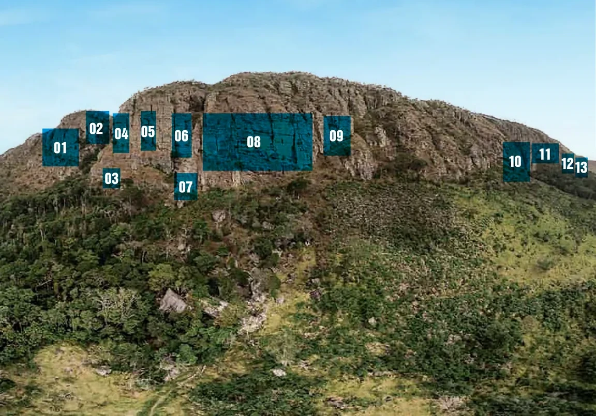
    - **checksum_sha256**: 3e130b8f9872135df443814b88e948a598e57aada38968cf620ebea486da1e9c
  - **[2]**:
    - **caminho**: 
    - **checksum_sha256**: 8a8b9d03de6315f8c65e77de11a29cafb8a174cd4dbd047fd4b9b2c7dec34d20
  - **[3]**:
    - **caminho**: 
    - **checksum_sha256**: 5fcb7043284dbec0d9e0648f3bf4ebec9263a2d5584a01f9cbd1dd5362f7d95e
  - **[4]**:
    - **caminho**: 
    - **checksum_sha256**: e247065083c2ad89002dc5427d86aaeba616ef6a6c824e555ba153b603ae9b1c
  - **[5]**:
    - **caminho**: 
    - **checksum_sha256**: 6a8e93e36b950fd6b960e38a0e0fc8ecf5d088512975c0eb960e8e68cae5e6af
  - **[6]**:
    - **caminho**: 
    - **checksum_sha256**: 2d9ae1ef21c2aed7afe944b9f1fe95011e711c103fc444625870988a188c8eb6
  - **[7]**:
    - **caminho**: 
    - **checksum_sha256**: 30f49c7173c7ea117534754daf5e8b4c68c6a0a9c00edbee3938624950ba3e81
  - **[8]**:
    - **caminho**: 
    - **checksum_sha256**: 87fe192c6c2a9b13aa1a1f5f8d51f7da30a8c536162fe563b1f9dad3f633995b
  - **[9]**:
    - **caminho**: 
    - **checksum_sha256**: 02f0c9cb3384f94d7e09bd69fe77cbcec6b4ea0e936deae5fdfad760d992dde8
  - **[10]**:
    - **caminho**: 
    - **checksum_sha256**: 60639836f514a5523c5df91d128ed77e6284fcdb16ec8d6cc1890b6fc572ef4f
  - **[11]**:
    - **caminho**: 
    - **checksum_sha256**: c3b29f6f0d4910b5c8aa8591f6e696409f475578e200ee7c6e87a24fc0aed778
  - **[12]**:
    - **caminho**: 
    - **checksum_sha256**: f25a4d6cd9de39d6918cd03cd7bcbea4a298592003ce94eb6c4c14a2222537cc
  - **[13]**:
    - **caminho**: 
    - **checksum_sha256**: cd06d3b6d3bcd7ae20138a9d5bc4f1911794257a5e39bf27082ed87da5993e6a
  - **[14]**:
    - **caminho**: 
    - **checksum_sha256**: ec743b7bbbf4f96df9b410fa496dc82cfaf4ba369ad9c823af4e75902310b119
  - **[15]**:
    - **caminho**: 
    - **checksum_sha256**: 0f632e95e27521464902f5354cf97ff7d39ca81d2c824e8f47837220308a6853
  - **[16]**:
    - **caminho**: 
    - **checksum_sha256**: 8348ac962d69a6901d442771316eb879c6ce485eb731cbc6e91219e74aa75e4e
  - **[17]**:
    - **caminho**: 
    - **checksum_sha256**: c0631306936582cec58b34d2fee9eacae92d8c567a0c624d30766c4a7a5dfa63
  - **[18]**:
    - **caminho**: 
    - **checksum_sha256**: 9693896e80f2681f0e57963d053415ac2a04f9b7171cbbbf4c1cb9c68b785b8f
  - **[19]**:
    - **caminho**: 
    - **checksum_sha256**: d8c6b6c23366abed58090109f8c0414e2b013d57bbfdff04900fe2a50cce9999
  - **[20]**:
    - **caminho**: 
    - **checksum_sha256**: 13114a98627884f6505720dc3ed84787f035bac601ab185c07c4e155e303eb02
  - **[21]**:
    - **caminho**: 
    - **checksum_sha256**: 388a4978082a1266ca6552ecad367d9f7d09228aef4af1a47e5596e5e35ac6d8
  - **[22]**:
    - **caminho**: 
    - **checksum_sha256**: 92fc8f67446ade6b32b643d4dd90df0ad2fac8acbd62556733638fa30a9fa265
  - **[23]**:
    - **caminho**: 
    - **checksum_sha256**: e8f1745ac21f9fea43b9676b9b080007cdbb25a806ad0ce5342f8cf7182b2324
  - **[24]**:
    - **caminho**: 
    - **checksum_sha256**: e0ebdd88d475d28a648f5fa0538116ea41696c1262766ed7f4c302a25a8c3d7a
  - **[25]**:
    - **caminho**: 
    - **checksum_sha256**: a23efe066b8c994a5c704eb920ee79e7d17bc6c1b74c65bdba5d4b5f8e9f4321
  - **[26]**:
    - **caminho**: 
    - **checksum_sha256**: 451c1fe394d9980703e5bb175bb19f4ea9a3eb7d0e5fd5e3efad283c495ca930
  - **[27]**:
    - **caminho**: 
    - **checksum_sha256**: 4b9a914ec880623c16aadd2a209e00c15f6fb86dfe5292c49340752c7f199eae
  - **[28]**:
    - **caminho**: 
    - **checksum_sha256**: 6def226f7dbbfd667f179ee7b897fdf891e93adb71a87eb53b48e88e14def2b5
  - **[29]**:
    - **caminho**: 
    - **checksum_sha256**: b3226cf31712c19ff8881d58c4ee80993a604a46c46cf67800ab861d906bb23f
  - **[30]**:
    - **caminho**: 
    - **checksum_sha256**: 525027b16e763de05d47a5a1d215a27fd0f3d47a49a6af88beb350db97257927
  - **[31]**:
    - **caminho**: 
    - **checksum_sha256**: 6f6a01b045eba8f248572b849027b215ab35404d2ecac705e9a8fa75c208a8f8
  - **[32]**:
    - **caminho**: 
    - **checksum_sha256**: c0e26f1dbb5e3adb00bbc143ac70be29eb835de645d4dc02f0889bbda0731909
  - **[33]**:
    - **caminho**: 
    - **checksum_sha256**: 759fa49b557fe14493693943da7f4bf158a25f0a95c2574ba48047e381bc8e47
  - **[34]**:
    - **caminho**: 
    - **checksum_sha256**: 839b6737f10836f2f922ea0f2627a6d51a6977f462d4582066538a106ac8de69
  - **[35]**:
    - **caminho**: 
    - **checksum_sha256**: 707a604a3e52c283beef73a0b05bc253ee4ecf4b394c1b110f9bd9935a50c9f7
  - **[36]**:
    - **caminho**: 
    - **checksum_sha256**: 6035b82a10d882bf194e197e46e2d1e4e4ae1a671457cef0bef4c8d829991e7b
  - **[37]**:
    - **caminho**: 
    - **checksum_sha256**: f1a0895ee4f39be0398fd8853cf87759645e4f3a0de98f9a5e6315fad5d1925e
  - **[38]**:
    - **caminho**: 
    - **checksum_sha256**: 81d51af31bc4832ca0c4e078d6f7e69d5a51a7263e11d76bf923490aa841b99b
  - **[39]**:
    - **caminho**: 
    - **checksum_sha256**: f13a65606d2b33573caa818e0f369c176077dc05016133ca2468d7c6776daac7
  - **[40]**:
    - **caminho**: 
    - **checksum_sha256**: 736401c0f6791b498a253511c61abac47f65a22d4dcfb306b981afff4b6f5e48
  - **[41]**:
    - **caminho**: 
    - **checksum_sha256**: 7bbc29e7ab18aa47d1289aa45b1f8eb6c46682eb5c584dde5a6235e1714ca1d1
  - **[42]**:
    - **caminho**: 
    - **checksum_sha256**: 21152048d452c2d712d213e164f028518e1d76a62dbe44747f3735c45f51df1b
  - **[43]**:
    - **caminho**: 
    - **checksum_sha256**: 059ffde64944a28b0cee9271a4e1fd797e51052a223b036a3a201ffdf4f4a144
  - **[44]**:
    - **caminho**: 
    - **checksum_sha256**: 2c042b787052182296eb9976711f7af552f80bca24cd521b604d81fb7ac59070
  - **[45]**:
    - **caminho**: 
    - **checksum_sha256**: e126b0616b8271351421d2f6fef384fdd7d295b82b48859d76e3adcf7b9d51d8
  - **[46]**:
    - **caminho**: 
    - **checksum_sha256**: 5cf7ebe03e000fc28a09ab94a3252bf9db9604cc01704218167516ad05709738
  - **[47]**:
    - **caminho**: 
    - **checksum_sha256**: fe1ff9b10e90e68fdc600e8caa3cae0c9c4f6500de9e21f043dc9d76916e55e8
  - **[48]**:
    - **caminho**: 
    - **checksum_sha256**: 7fec60387867ec3cc659d2b9386ee09b48ad1eb60c2fc097ff59a8a1347bd968
  - **[49]**:
    - **caminho**: 
    - **checksum_sha256**: d6ee53ecc97b99b91ed389fff218bdb99827c88d7738b75f07b7ebe6220f1be7
  - **[50]**:
    - **caminho**: 
    - **checksum_sha256**: 51f278ae2da3e0f303dff9c84f83c5353b41bad9ed8c94f65c1aad91c8019292
  - **[51]**:
    - **caminho**: 
    - **checksum_sha256**: 05ec3ed33641fec63f276a2c0607dedbf83770f2cc04b51fc68ed382d58fe4fc
  - **[52]**:
    - **caminho**: 
    - **checksum_sha256**: 6ce803349efdd30a66197d1df7708db771896be7af6a2055fa28379a2d24e041
  - **[53]**:
    - **caminho**: 
    - **checksum_sha256**: 6d5268b36e7afc9408221905c8f0461e66bbdc0edc26ef16a3639ebc3390cece
  - **[54]**:
    - **caminho**: 
    - **checksum_sha256**: 4590c563354c7a86049975facea04d4e58d52195125ba21d29da0de960ebdb26
  - **[55]**:
    - **caminho**: 
    - **checksum_sha256**: 3381feb9c5a9907f36b2566e84b7add85c17a6deb4b14bb077c299ba5cd7dd6e
  - **[56]**:
    - **caminho**: 
    - **checksum_sha256**: db63ae13273a6a5ae8976a3a9cba6e9825a4a35537d7975e42aacc375be50c55
  - **[57]**:
    - **caminho**: 
    - **checksum_sha256**: 44237e143c6c290bf2fbccba3c2d8cda71a251b220adfcccab68d68031ea29a9
  - **[58]**:
    - **caminho**: 
    - **checksum_sha256**: 25108431b22dc17ac2e72d79c63da3ae84a8b24c713de56697be5b0871b47357
  - **[59]**:
    - **caminho**: 
    - **checksum_sha256**: 9e4a5b3671776cc7d8c9813b3ad170293f0564c157026337b0a64607d0801f2a
  - **[60]**:
    - **caminho**: 
    - **checksum_sha256**: 1d20f31c0102ec7f80dcc1ae7a1a1e31e7d1131a957a6a6b8afc66ba8b5c7ea1
  - **[61]**:
    - **caminho**: 
    - **checksum_sha256**: 15e17350b3d1b519eb2b5c8d05220843d35c449599cb2a2bbd8104d240d2505e
  - **[62]**:
    - **caminho**: 
    - **checksum_sha256**: a334dbeea358ec0c81dea81acaa75e1eae529f3e59d88f11839c29864d53d494
  - **[63]**:
    - **caminho**: 
    - **checksum_sha256**: 8fad307d25a31b31c4cdf2b91411d7640a5e42c428d9adcd844d7aa732c8bc21
  - **[64]**:
    - **caminho**: 
    - **checksum_sha256**: 179b635c8bcd811edaa32ae6d1adb9f2773231537704bdca908afa69d71c4dc6

