# Croqui: Arcos - Bombonera

## Informações Gerais

- **descricao**: Afloramento de calcário situado em Pains, no estado de Minas Gerais, com diversos setores de escalada esportiva.
- **id**: br_mg_arcos_bombonera
- **nome**: Arcos - Bombonera
- **uid**: Cj7ql1orkaqEyg
- **creditos**:
  - Alexsandro Martins
- **caminho_thumbnail**: 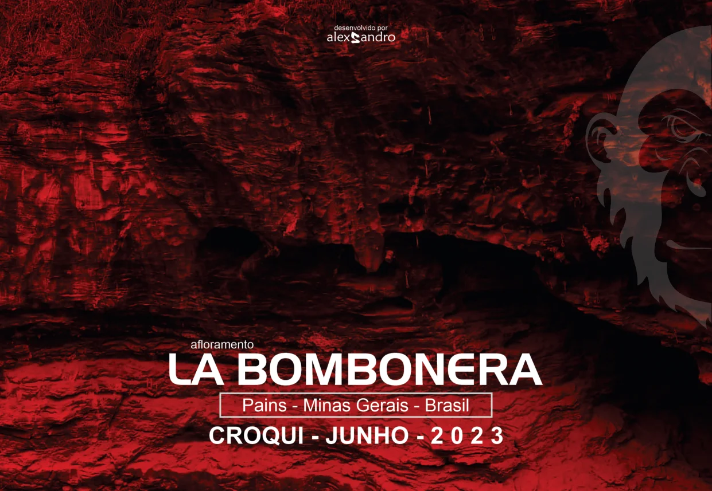
- **revisado_manualmente**: True
- **status_desenho_extraivel**: NAO_TEM_DESENHO
- **botoes**:
  - **[0]**:
    - **uid**: N98fj8cENR6UWj
    - **texto**: Capa
    - **destino**:
      - **secao_textual**:
        - **conteudo**:
            # afloramento LA BOMBONERA
            
            Pains - Minas Gerais - Brasil
            
            **CROQUI - JUNHO - 2023**
            
            |  |
            | :--: |
            | *Capa* |
            
            desenvolvido por alexsandro
  - **[1]**:
    - **uid**: OhCbRpO7eqgFVt
    - **texto**: Atenção e Regras
    - **destino**:
      - **secao_textual**:
        - **conteudo**:
            # ATENÇÃO
            
            Os nomes das vias, seus respectivos conquistadores e a graduação sugerida para cada uma delas são resultados de uma pesquisa oral conduzida entre os escaladores que frequentam o pico, uma vez que não foi encontrado nenhum registro prévio sobre o tema (exceto os guias anteriores). O resultado desse trabalho pode eventualmente conter erros, os quais peço que não sejam entendidos como desrespeito. O objetivo é documentar e divulgar a prática da escalada no centro-oeste mineiro da maneira mais exata possível.
            
            # OBSERVAÇÃO
            
            Como algumas vias são de conquistadores desconhecidos foi utilizado apelido + (*) para identificá-las. Caso encontre algum engano nos dados citados neste croqui, peço que me envie a correção. Terei satisfação em atendê-lo, pois todos os envolvidos com a escalada tem a ganhar com o aprimoramento desse trabalho.
            
            Muito obrigado aos conquistadores e conquistadoras, **GRATIDÃO** a vocês sempre!!!
            
            Arte/Organização/Produção: **alexsandro martins** / 7ª versão / atualização 2023 / Revisão e graduação sugerida das vias: **Grupo de Trabalho**
            
            # SEJA CONSCIENTE!
            
            **UTILIZE APENAS AS TRILHAS PRINCIPAIS; As grutas não são banheiros!** Faça suas necessidades fisiológicas em casa, caso não consiga segurar, faça longe das pedras e cubra com folhas ou terra; **Leve todo seu lixo de volta** e o lixo de outros visitantes descuidados (inclusive papel higiênico, garrafas plásticas, bitucas, pontas, papel de bala...); Os animais locais e plantas nativas devem permanecer em seus lugares. Lembre-se que eles estão em seu habitat natural e precisam ser respeitados; Os animais domésticos (ex. cães) não devem ser trazidos a este local, desta forma, você os protege de doenças silvestres e vice versa; Fogueiras além de provocar queimadas, danificam o local; Estacione de maneira adequada e no local adequado a fim de não atrapalhar o fluxo de outros veículos; Utilize equipamentos de segurança e verifique seu estado de conservação; Cuidado com pedras soltas principalmente em setores e vias novas; Antes de conquistar uma via de escalada entre em contato com o GT.
  - **[2]**:
    - **uid**: 7vECZW8NTtJtEu
    - **texto**: Parcerias e Contato
    - **destino**:
      - **secao_textual**:
        - **conteudo**:
            # Parcerias na atualização do ano de 2023 dos croquis dos Afloramentos, Setores e Vias de Escalada Esportiva em Arcos, Pains e Região - MG
            
            | 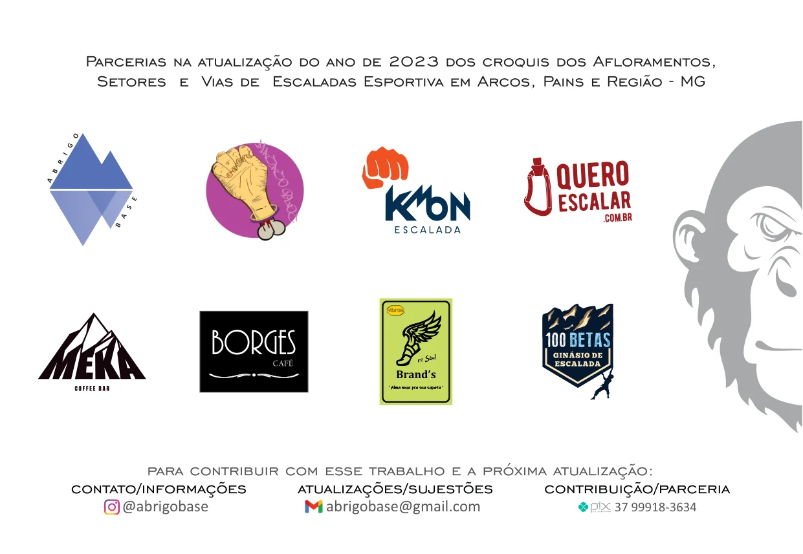 |
            | :--: |
            | *Parcerias* |
            
            Para contribuir com esse trabalho e a próxima atualização:
            
            **CONTATO/INFORMAÇÕES:** [@abrigobase](https://www.instagram.com/abrigobase)
            
            **ATUALIZAÇÕES/SUGESTÕES:** abrigobase@gmail.com
            
            **CONTRIBUIÇÃO/PARCERIA:** PIX: 37 99918-3634
- **ultima_migracao**: 5
- **publicar_croqui**: True
- **revisado_bounding_circle**: True

## Parte: setor_esquerda

### Setor (Pico: Bombonera)

- **descricao**: Sombra o dia todo (varia de acordo com a estação).
- **nome**: Setor Esquerda
- **uid**: rSxUzdQ8mBJymW
- **mapas**:
  - **[0]**:
    - **caminho_imagem_mapa**: 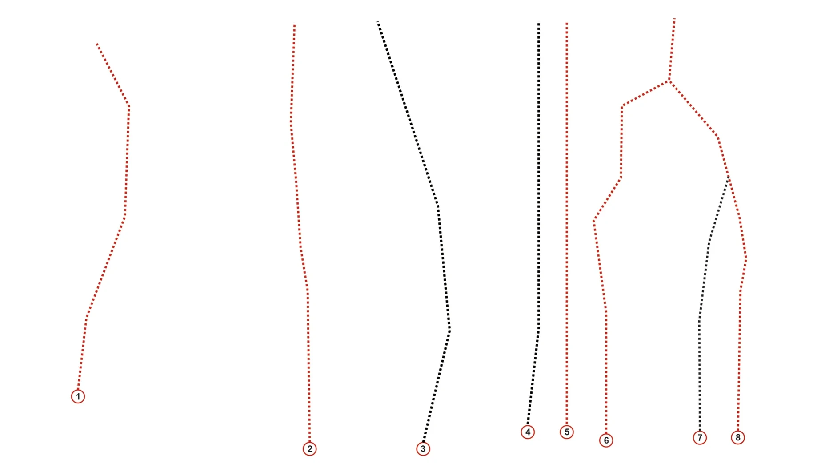
    - **largura_mapa**: 1829
    - **altura_mapa**: 1070
    - **pontos_de_interesse**:
      - **[0]**:
        - **id**: poyG2VlVSQfq8m
        - **uid**: poyG2VlVSQfq8m
        - **rotulo**: 1
        - **circulo**:
          - **x**: 176
          - **y**: 891
          - **raio**: 15
        - **label**: 1
      - **[1]**:
        - **id**: BycwtmIT62Yuun
        - **uid**: BycwtmIT62Yuun
        - **rotulo**: 2
        - **circulo**:
          - **x**: 697
          - **y**: 1010
          - **raio**: 15
        - **label**: 2
      - **[2]**:
        - **id**: WCmaAp4uvyzDRD
        - **uid**: WCmaAp4uvyzDRD
        - **rotulo**: 3
        - **circulo**:
          - **x**: 951
          - **y**: 1009
          - **raio**: 15
        - **label**: 3
      - **[3]**:
        - **id**: FmXSRlQJUMYAUA
        - **uid**: FmXSRlQJUMYAUA
        - **rotulo**: 4
        - **circulo**:
          - **x**: 1187
          - **y**: 971
          - **raio**: 15
        - **label**: 4
      - **[4]**:
        - **id**: kGQFRXZbNKGsC3
        - **uid**: kGQFRXZbNKGsC3
        - **rotulo**: 5
        - **circulo**:
          - **x**: 1275
          - **y**: 971
          - **raio**: 15
        - **label**: 5
      - **[5]**:
        - **id**: xDY3ag2CnO7ZTp
        - **uid**: xDY3ag2CnO7ZTp
        - **rotulo**: 6
        - **circulo**:
          - **x**: 1364
          - **y**: 990
          - **raio**: 15
        - **label**: 6
      - **[6]**:
        - **id**: 3uYeEp3lGBTb0T
        - **uid**: 3uYeEp3lGBTb0T
        - **rotulo**: 7
        - **circulo**:
          - **x**: 1575
          - **y**: 984
          - **raio**: 15
        - **label**: 7
      - **[7]**:
        - **id**: 11oEOtMCFBHyXm
        - **uid**: 11oEOtMCFBHyXm
        - **rotulo**: 8
        - **circulo**:
          - **x**: 1660
          - **y**: 984
          - **raio**: 15
        - **label**: 8
    - **referencias**:
      - **[0]**:
        - **alvo_uid**: NgdSnrMcAorPRL
        - **pontos_uids**:
          - poyG2VlVSQfq8m
        - **escalada**: Água Bolhas
        - **ids**:
          - poyG2VlVSQfq8m
      - **[1]**:
        - **alvo_uid**: uYPH3FmeLbLkCy
        - **pontos_uids**:
          - BycwtmIT62Yuun
        - **escalada**: Concretino
        - **ids**:
          - BycwtmIT62Yuun
      - **[2]**:
        - **alvo_uid**: oP5m9O4s2mdydX
        - **pontos_uids**:
          - WCmaAp4uvyzDRD
        - **escalada**: Gado impresso (com abelha)
        - **ids**:
          - WCmaAp4uvyzDRD
      - **[3]**:
        - **alvo_uid**: l4DcSerZGm75gW
        - **pontos_uids**:
          - FmXSRlQJUMYAUA
        - **escalada**: (via inacabada 4)
        - **ids**:
          - FmXSRlQJUMYAUA
      - **[4]**:
        - **alvo_uid**: gniP749eAIb2xI
        - **pontos_uids**:
          - kGQFRXZbNKGsC3
        - **escalada**: Jaratataca
        - **ids**:
          - kGQFRXZbNKGsC3
      - **[5]**:
        - **alvo_uid**: i4259rGnQO105e
        - **pontos_uids**:
          - xDY3ag2CnO7ZTp
        - **escalada**: (sem nome 3)
        - **ids**:
          - xDY3ag2CnO7ZTp
      - **[6]**:
        - **alvo_uid**: GiGaL1kxqewirM
        - **pontos_uids**:
          - 3uYeEp3lGBTb0T
        - **escalada**: (via inacabada 5)
        - **ids**:
          - 3uYeEp3lGBTb0T
      - **[7]**:
        - **alvo_uid**: a51GcVXkGuUWPV
        - **pontos_uids**:
          - 11oEOtMCFBHyXm
        - **escalada**: Teoria dos jogos
        - **ids**:
          - 11oEOtMCFBHyXm
  - **[1]**:
    - **caminho_imagem_mapa**: 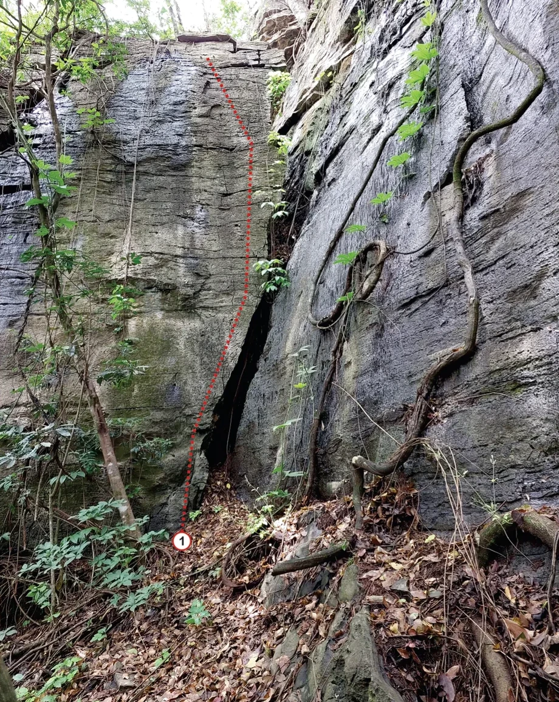
    - **largura_mapa**: 920
    - **altura_mapa**: 1153
    - **pontos_de_interesse**:
      - **[0]**:
        - **id**: 7xAt6fxiTcyoxH
        - **uid**: 7xAt6fxiTcyoxH
        - **rotulo**: 1
        - **circulo**:
          - **x**: 300
          - **y**: 889
          - **raio**: 15
        - **label**: 1
    - **referencias**:
      - **[0]**:
        - **alvo_uid**: NgdSnrMcAorPRL
        - **pontos_uids**:
          - 7xAt6fxiTcyoxH
        - **escalada**: Água Bolhas
        - **ids**:
          - 7xAt6fxiTcyoxH
  - **[2]**:
    - **caminho_imagem_mapa**: 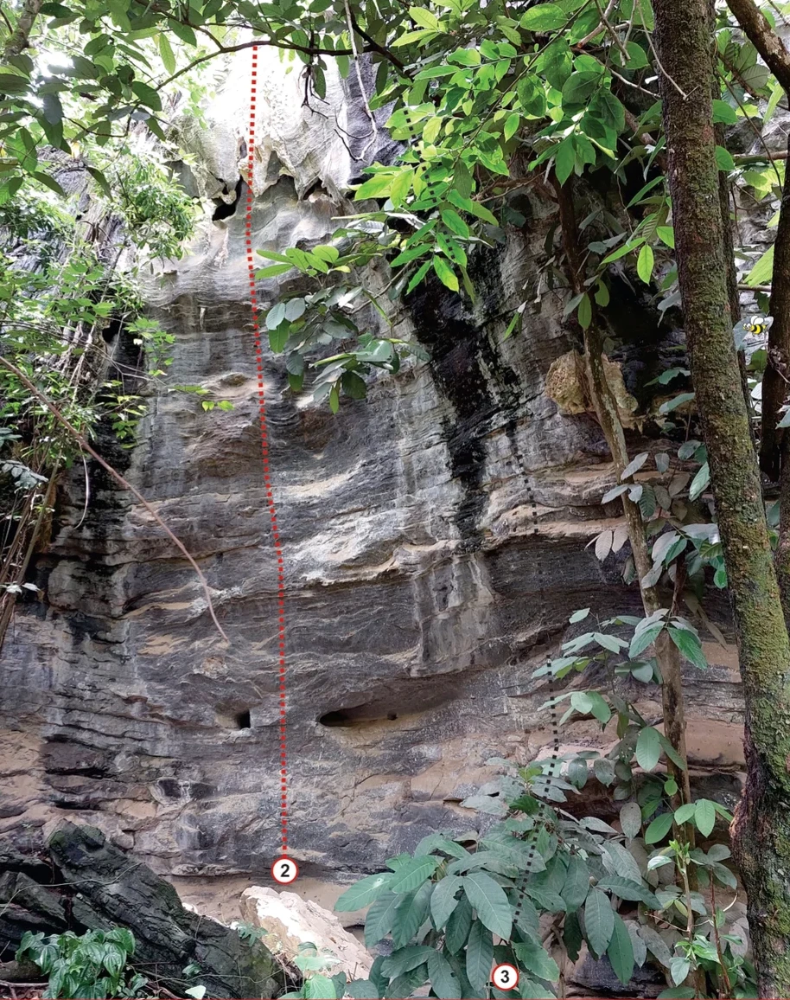
    - **largura_mapa**: 914
    - **altura_mapa**: 1156
    - **pontos_de_interesse**:
      - **[0]**:
        - **id**: QRiSHe8lp41YMF
        - **uid**: QRiSHe8lp41YMF
        - **rotulo**: 2
        - **circulo**:
          - **x**: 330
          - **y**: 1007
          - **raio**: 15
        - **label**: 2
      - **[1]**:
        - **id**: jHmefJHDqjaPSL
        - **uid**: jHmefJHDqjaPSL
        - **rotulo**: 3
        - **circulo**:
          - **x**: 585
          - **y**: 1129
          - **raio**: 15
        - **label**: 3
    - **referencias**:
      - **[0]**:
        - **alvo_uid**: uYPH3FmeLbLkCy
        - **pontos_uids**:
          - QRiSHe8lp41YMF
        - **escalada**: Concretino
        - **ids**:
          - QRiSHe8lp41YMF
      - **[1]**:
        - **alvo_uid**: oP5m9O4s2mdydX
        - **pontos_uids**:
          - jHmefJHDqjaPSL
        - **escalada**: Gado impresso (com abelha)
        - **ids**:
          - jHmefJHDqjaPSL
  - **[3]**:
    - **caminho_imagem_mapa**: 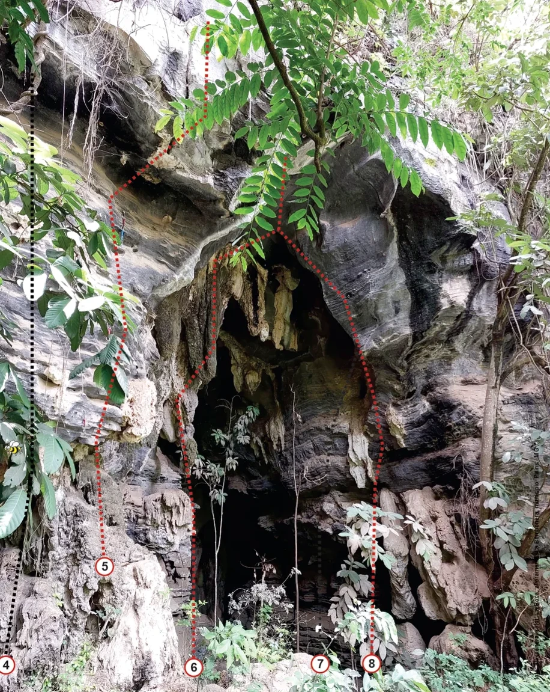
    - **largura_mapa**: 916
    - **altura_mapa**: 1151
    - **pontos_de_interesse**:
      - **[0]**:
        - **id**: 7GqyfYG6X04Ste
        - **uid**: 7GqyfYG6X04Ste
        - **rotulo**: 4
        - **circulo**:
          - **x**: 11
          - **y**: 1106
          - **raio**: 14
        - **label**: 4
      - **[1]**:
        - **id**: iat1Z1jqJGsaSz
        - **uid**: iat1Z1jqJGsaSz
        - **rotulo**: 5
        - **circulo**:
          - **x**: 174
          - **y**: 942
          - **raio**: 15
        - **label**: 5
      - **[2]**:
        - **id**: QcGKyz1ikla9a8
        - **uid**: QcGKyz1ikla9a8
        - **rotulo**: 6
        - **circulo**:
          - **x**: 323
          - **y**: 1110
          - **raio**: 15
        - **label**: 6
      - **[3]**:
        - **id**: Tu9qrWf4A3unPG
        - **uid**: Tu9qrWf4A3unPG
        - **rotulo**: 7
        - **circulo**:
          - **x**: 533
          - **y**: 1104
          - **raio**: 15
        - **label**: 7
      - **[4]**:
        - **id**: HSXgBAARGlARTG
        - **uid**: HSXgBAARGlARTG
        - **rotulo**: 8
        - **circulo**:
          - **x**: 619
          - **y**: 1104
          - **raio**: 15
        - **label**: 8
    - **referencias**:
      - **[0]**:
        - **alvo_uid**: l4DcSerZGm75gW
        - **pontos_uids**:
          - 7GqyfYG6X04Ste
        - **escalada**: (via inacabada 4)
        - **ids**:
          - 7GqyfYG6X04Ste
      - **[1]**:
        - **alvo_uid**: gniP749eAIb2xI
        - **pontos_uids**:
          - iat1Z1jqJGsaSz
        - **escalada**: Jaratataca
        - **ids**:
          - iat1Z1jqJGsaSz
      - **[2]**:
        - **alvo_uid**: i4259rGnQO105e
        - **pontos_uids**:
          - QcGKyz1ikla9a8
        - **escalada**: (sem nome 3)
        - **ids**:
          - QcGKyz1ikla9a8
      - **[3]**:
        - **alvo_uid**: GiGaL1kxqewirM
        - **pontos_uids**:
          - Tu9qrWf4A3unPG
        - **escalada**: (via inacabada 5)
        - **ids**:
          - Tu9qrWf4A3unPG
      - **[4]**:
        - **alvo_uid**: a51GcVXkGuUWPV
        - **pontos_uids**:
          - HSXgBAARGlARTG
        - **escalada**: Teoria dos jogos
        - **ids**:
          - HSXgBAARGlARTG
- **escaladas**:
  - **[0]**:
    - **uid**: NgdSnrMcAorPRL
    - **via_esportiva**:
      - **nome**: Água Bolhas
      - **dificuldade**: BR_5
      - **destaque**: True
      - **quantidade_protecoes_intermediarias**: 3
      - **quantidade_protecoes_parada**: 2
      - **data_abertura**: 2020
  - **[1]**:
    - **uid**: uYPH3FmeLbLkCy
    - **via_esportiva**:
      - **nome**: Concretino
      - **dificuldade**: BR_7C_BARRA_8A
      - **destaque**: True
      - **quantidade_protecoes_intermediarias**: 5
      - **quantidade_protecoes_parada**: 2
      - **data_abertura**: 2020
  - **[2]**:
    - **uid**: oP5m9O4s2mdydX
    - **via_esportiva**:
      - **nome**: Gado impresso (com abelha)
      - **dificuldade**: INDEFINIDO
      - **quantidade_protecoes_intermediarias**: 5
      - **quantidade_protecoes_parada**: 2
      - **data_abertura**: 2022
  - **[3]**:
    - **uid**: l4DcSerZGm75gW
    - **via_esportiva**:
      - **nome**: (via inacabada 4)
      - **dificuldade**: INDEFINIDO
      - **quantidade_protecoes_parada**: 2
      - **data_abertura**: 2022
  - **[4]**:
    - **uid**: gniP749eAIb2xI
    - **via_esportiva**:
      - **nome**: Jaratataca
      - **dificuldade**: BR_7A
      - **destaque**: True
      - **quantidade_protecoes_intermediarias**: 4
      - **quantidade_protecoes_parada**: 2
      - **data_abertura**: 2022
  - **[5]**:
    - **uid**: i4259rGnQO105e
    - **via_esportiva**:
      - **nome**: (sem nome 3)
      - **dificuldade**: BR_8C_BARRA_9A
      - **quantidade_protecoes_intermediarias**: 4
      - **quantidade_protecoes_parada**: 2
      - **data_abertura**: 2022
  - **[6]**:
    - **uid**: GiGaL1kxqewirM
    - **via_esportiva**:
      - **nome**: (via inacabada 5)
      - **dificuldade**: INDEFINIDO
      - **data_abertura**: 2022
  - **[7]**:
    - **uid**: a51GcVXkGuUWPV
    - **via_esportiva**:
      - **nome**: Teoria dos jogos
      - **dificuldade**: BR_9A
      - **quantidade_protecoes_intermediarias**: 6
      - **quantidade_protecoes_parada**: 2
      - **destaque**: True
      - **data_abertura**: 2022
- **precomputados**:
  - **total_escaladas**: 8
  - **total_esportivas**: 8

## Parte: setor_bombonera

### Setor (Pico: Bombonera)

- **descricao**:
    # Setor bombonera
    
    Sombra a partir das 12h (varia de acordo com a estação).
- **nome**: Setor Bombonera
- **uid**: zx4lHNzgwsL23H
- **caminho_imagem_capa**: 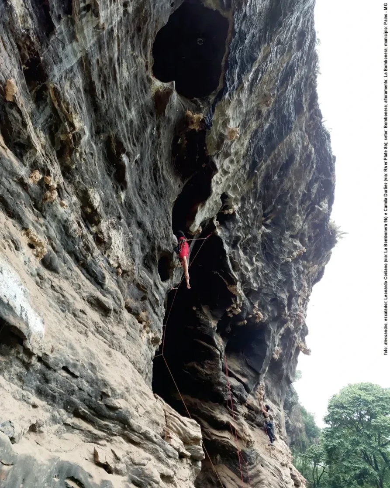
- **mapas**:
  - **[0]**:
    - **caminho_imagem_mapa**: 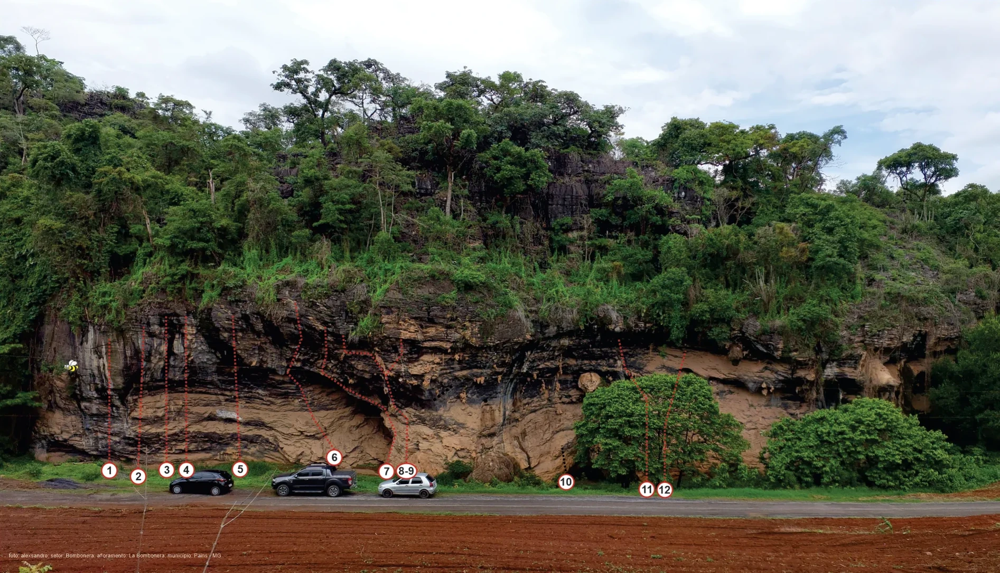
    - **largura_mapa**: 1893
    - **altura_mapa**: 1086
    - **pontos_de_interesse**:
      - **[0]**:
        - **id**: rrHrPb5dRzfD8s
        - **uid**: rrHrPb5dRzfD8s
        - **rotulo**: 1
        - **circulo**:
          - **x**: 207
          - **y**: 892
          - **raio**: 15
        - **label**: 1
      - **[1]**:
        - **id**: AZBsQv1UlFHUTa
        - **uid**: AZBsQv1UlFHUTa
        - **rotulo**: 2
        - **circulo**:
          - **x**: 262
          - **y**: 903
          - **raio**: 15
        - **label**: 2
      - **[2]**:
        - **id**: qYGNX67R0kEcNk
        - **uid**: qYGNX67R0kEcNk
        - **rotulo**: 3
        - **circulo**:
          - **x**: 316
          - **y**: 891
          - **raio**: 15
        - **label**: 3
      - **[3]**:
        - **id**: 3hXaANPLClInTg
        - **uid**: 3hXaANPLClInTg
        - **rotulo**: 4
        - **circulo**:
          - **x**: 353
          - **y**: 891
          - **raio**: 15
        - **label**: 4
      - **[4]**:
        - **id**: egNL8knYiZoxnh
        - **uid**: egNL8knYiZoxnh
        - **rotulo**: 5
        - **circulo**:
          - **x**: 454
          - **y**: 890
          - **raio**: 15
        - **label**: 5
      - **[5]**:
        - **id**: NytubYldx8n2fh
        - **uid**: NytubYldx8n2fh
        - **rotulo**: 6
        - **circulo**:
          - **x**: 633
          - **y**: 867
          - **raio**: 15
        - **label**: 6
      - **[6]**:
        - **id**: 71A3N9VJd0eS7C
        - **uid**: 71A3N9VJd0eS7C
        - **rotulo**: 7
        - **circulo**:
          - **x**: 732
          - **y**: 894
          - **raio**: 15
        - **label**: 7
      - **[7]**:
        - **id**: b9rhCnqh8NFLNI
        - **uid**: b9rhCnqh8NFLNI
        - **rotulo**: 8-9
        - **circulo**:
          - **x**: 770
          - **y**: 893
          - **raio**: 19
        - **label**: 8-9
      - **[8]**:
        - **id**: SvZyr0uK31VfJU
        - **uid**: SvZyr0uK31VfJU
        - **rotulo**: 10
        - **circulo**:
          - **x**: 1072
          - **y**: 914
          - **raio**: 15
        - **label**: 10
      - **[9]**:
        - **id**: 4QYmWZLYIfZPkW
        - **uid**: 4QYmWZLYIfZPkW
        - **rotulo**: 11
        - **circulo**:
          - **x**: 1224
          - **y**: 927
          - **raio**: 15
        - **label**: 11
      - **[10]**:
        - **id**: aaYNefUUdD16O0
        - **uid**: aaYNefUUdD16O0
        - **rotulo**: 12
        - **circulo**:
          - **x**: 1259
          - **y**: 928
          - **raio**: 15
        - **label**: 12
    - **referencias**:
      - **[0]**:
        - **alvo_uid**: bGY7jjt35TGBtK
        - **pontos_uids**:
          - rrHrPb5dRzfD8s
        - **escalada**: Lá Cancha
        - **ids**:
          - rrHrPb5dRzfD8s
      - **[1]**:
        - **alvo_uid**: wMFAO7CdjeYw7e
        - **pontos_uids**:
          - AZBsQv1UlFHUTa
        - **escalada**: La Mano de Dios
        - **ids**:
          - AZBsQv1UlFHUTa
      - **[2]**:
        - **alvo_uid**: 8JVfNOQ2gW9Jcy
        - **pontos_uids**:
          - qYGNX67R0kEcNk
        - **escalada**: Projeto (sem nome 1)
        - **ids**:
          - qYGNX67R0kEcNk
      - **[3]**:
        - **alvo_uid**: DVsshBdFmIcrsW
        - **pontos_uids**:
          - 3hXaANPLClInTg
        - **escalada**: Projeto (sem nome 2)
        - **ids**:
          - 3hXaANPLClInTg
      - **[4]**:
        - **alvo_uid**: U8JPeflFSWXrZZ
        - **pontos_uids**:
          - egNL8knYiZoxnh
        - **escalada**: Barra Brava
        - **ids**:
          - egNL8knYiZoxnh
      - **[5]**:
        - **alvo_uid**: r5jWWEC9DOZ8Vx
        - **pontos_uids**:
          - NytubYldx8n2fh
        - **escalada**: Lá Bombonera
        - **ids**:
          - NytubYldx8n2fh
      - **[6]**:
        - **alvo_uid**: OSpickpZ1nLhIC
        - **pontos_uids**:
          - 71A3N9VJd0eS7C
        - **escalada**: Diego Armando Maradona
        - **ids**:
          - 71A3N9VJd0eS7C
      - **[7]**:
        - **alvo_uid**: m4LvODmbmQX51z
        - **pontos_uids**:
          - b9rhCnqh8NFLNI
        - **escalada**: River Plate (principal)
        - **ids**:
          - b9rhCnqh8NFLNI
      - **[8]**:
        - **alvo_uid**: On2qI9r8TxxD4D
        - **pontos_uids**:
          - b9rhCnqh8NFLNI
        - **escalada**: Boca Junior (variante)
        - **ids**:
          - b9rhCnqh8NFLNI
      - **[9]**:
        - **alvo_uid**: 2g85yvxRTmrvil
        - **pontos_uids**:
          - SvZyr0uK31VfJU
        - **escalada**: (via inacabada 3) Superclassicos
        - **ids**:
          - SvZyr0uK31VfJU
      - **[10]**:
        - **alvo_uid**: iH7SPwQn4gXy5R
        - **pontos_uids**:
          - 4QYmWZLYIfZPkW
        - **escalada**: San Lourenzo
        - **ids**:
          - 4QYmWZLYIfZPkW
      - **[11]**:
        - **alvo_uid**: OABLScx7zfHBNl
        - **pontos_uids**:
          - aaYNefUUdD16O0
        - **escalada**: La Marca
        - **ids**:
          - aaYNefUUdD16O0
- **escaladas**:
  - **[0]**:
    - **uid**: bGY7jjt35TGBtK
    - **via_esportiva**:
      - **nome**: Lá Cancha
      - **dificuldade**: BR_8C
      - **destaque**: True
      - **quantidade_protecoes_intermediarias**: 6
      - **quantidade_protecoes_parada**: 2
  - **[1]**:
    - **uid**: wMFAO7CdjeYw7e
    - **via_esportiva**:
      - **nome**: La Mano de Dios
      - **dificuldade**: BR_9B
      - **destaque**: True
      - **quantidade_protecoes_intermediarias**: 5
      - **quantidade_protecoes_parada**: 2
  - **[2]**:
    - **uid**: 8JVfNOQ2gW9Jcy
    - **via_esportiva**:
      - **nome**: Projeto (sem nome 1)
      - **dificuldade**: PROJETO
      - **quantidade_protecoes_intermediarias**: 6
      - **quantidade_protecoes_parada**: 2
  - **[3]**:
    - **uid**: DVsshBdFmIcrsW
    - **via_esportiva**:
      - **nome**: Projeto (sem nome 2)
      - **dificuldade**: PROJETO
      - **quantidade_protecoes_intermediarias**: 7
      - **quantidade_protecoes_parada**: 2
      - **data_abertura**: 2020
  - **[4]**:
    - **uid**: U8JPeflFSWXrZZ
    - **via_esportiva**:
      - **nome**: Barra Brava
      - **dificuldade**: BR_10A
      - **destaque**: True
      - **quantidade_protecoes_intermediarias**: 8
      - **quantidade_protecoes_parada**: 2
      - **data_abertura**: 2020
  - **[5]**:
    - **uid**: r5jWWEC9DOZ8Vx
    - **via_esportiva**:
      - **nome**: Lá Bombonera
      - **destaque**: True
      - **dificuldade**: BR_9B_BARRA_9C
      - **quantidade_protecoes_intermediarias**: 9
      - **quantidade_protecoes_parada**: 2
      - **data_abertura**: 2020
  - **[6]**:
    - **uid**: OSpickpZ1nLhIC
    - **via_esportiva**:
      - **nome**: Diego Armando Maradona
      - **destaque**: True
      - **dificuldade**: BR_9C
      - **quantidade_protecoes_intermediarias**: 8
      - **quantidade_protecoes_parada**: 2
      - **data_abertura**: 2020
  - **[7]**:
    - **uid**: m4LvODmbmQX51z
    - **via_esportiva**:
      - **nome**: River Plate (principal)
      - **destaque**: True
      - **dificuldade**: BR_8A
      - **quantidade_protecoes_intermediarias**: 7
      - **quantidade_protecoes_parada**: 2
  - **[8]**:
    - **uid**: On2qI9r8TxxD4D
    - **via_esportiva**:
      - **nome**: Boca Junior (variante)
      - **dificuldade**: BR_8A
      - **destaque**: True
      - **quantidade_protecoes_intermediarias**: 7
      - **quantidade_protecoes_parada**: 2
  - **[9]**:
    - **uid**: 2g85yvxRTmrvil
    - **via_esportiva**:
      - **nome**: (via inacabada 3) Superclassicos
      - **dificuldade**: INDEFINIDO
      - **quantidade_protecoes_intermediarias**: 1
  - **[10]**:
    - **uid**: iH7SPwQn4gXy5R
    - **via_esportiva**:
      - **nome**: San Lourenzo
      - **dificuldade**: BR_8C
      - **destaque**: True
      - **quantidade_protecoes_intermediarias**: 7
      - **quantidade_protecoes_parada**: 2
  - **[11]**:
    - **uid**: OABLScx7zfHBNl
    - **via_esportiva**:
      - **nome**: La Marca
      - **dificuldade**: BR_8A_BARRA_8B
      - **destaque**: True
      - **quantidade_protecoes_intermediarias**: 8
      - **quantidade_protecoes_parada**: 2
      - **data_abertura**: 2023
- **precomputados**:
  - **total_escaladas**: 12
  - **total_esportivas**: 12

## Parte: setor_bosque

### Setor (Pico: Bombonera)

- **descricao**: Sombra o dia todo (varia de acordo com a estação).
- **nome**: Setor Bosque
- **uid**: pYitgZt0y6k4JK
- **mapas**:
  - **[0]**:
    - **caminho_imagem_mapa**: 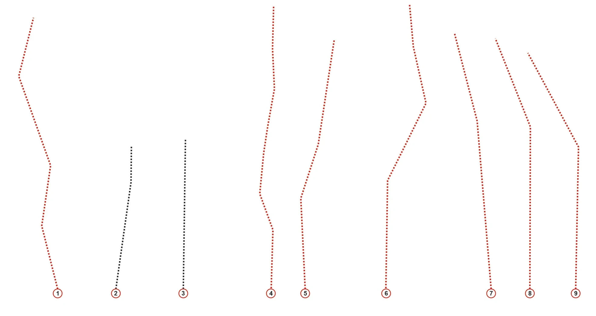
    - **largura_mapa**: 1966
    - **altura_mapa**: 1043
    - **pontos_de_interesse**:
      - **[0]**:
        - **id**: l5PDF3f7iQbVWM
        - **uid**: l5PDF3f7iQbVWM
        - **rotulo**: 1
        - **circulo**:
          - **x**: 190
          - **y**: 968
          - **raio**: 15
        - **label**: 1
      - **[1]**:
        - **id**: j2UGyzK8vRFo20
        - **uid**: j2UGyzK8vRFo20
        - **rotulo**: 2
        - **circulo**:
          - **x**: 382
          - **y**: 968
          - **raio**: 15
        - **label**: 2
      - **[2]**:
        - **id**: DSjcwyE4sCTBer
        - **uid**: DSjcwyE4sCTBer
        - **rotulo**: 3
        - **circulo**:
          - **x**: 604
          - **y**: 968
          - **raio**: 15
        - **label**: 3
      - **[3]**:
        - **id**: dTe5YLEnmNeKqY
        - **uid**: dTe5YLEnmNeKqY
        - **rotulo**: 4
        - **circulo**:
          - **x**: 893
          - **y**: 968
          - **raio**: 15
        - **label**: 4
      - **[4]**:
        - **id**: tUFYg3IGsekz91
        - **uid**: tUFYg3IGsekz91
        - **rotulo**: 5
        - **circulo**:
          - **x**: 1007
          - **y**: 968
          - **raio**: 15
        - **label**: 5
      - **[5]**:
        - **id**: s17F65vNMUwtoH
        - **uid**: s17F65vNMUwtoH
        - **rotulo**: 6
        - **circulo**:
          - **x**: 1274
          - **y**: 968
          - **raio**: 15
        - **label**: 6
      - **[6]**:
        - **id**: iKD5DEJ2Ni0PS1
        - **uid**: iKD5DEJ2Ni0PS1
        - **rotulo**: 7
        - **circulo**:
          - **x**: 1620
          - **y**: 969
          - **raio**: 15
        - **label**: 7
      - **[7]**:
        - **id**: fJKpSb9DackcvK
        - **uid**: fJKpSb9DackcvK
        - **rotulo**: 8
        - **circulo**:
          - **x**: 1748
          - **y**: 968
          - **raio**: 15
        - **label**: 8
      - **[8]**:
        - **id**: JhQ4oiXSzjNFUe
        - **uid**: JhQ4oiXSzjNFUe
        - **rotulo**: 9
        - **circulo**:
          - **x**: 1899
          - **y**: 968
          - **raio**: 15
        - **label**: 9
    - **referencias**:
      - **[0]**:
        - **alvo_uid**: Gb4mHgP0BBrpJD
        - **pontos_uids**:
          - l5PDF3f7iQbVWM
        - **escalada**: La Cucaracha
        - **ids**:
          - l5PDF3f7iQbVWM
      - **[1]**:
        - **alvo_uid**: s3yFmIBmxwQTZH
        - **pontos_uids**:
          - j2UGyzK8vRFo20
        - **escalada**: (via inacabada 1) Bem Vindo ao Bosque
        - **ids**:
          - j2UGyzK8vRFo20
      - **[2]**:
        - **alvo_uid**: HMfUeRq4be4xa1
        - **pontos_uids**:
          - DSjcwyE4sCTBer
        - **escalada**: (via inacabada 2)
        - **ids**:
          - DSjcwyE4sCTBer
      - **[3]**:
        - **alvo_uid**: Ln4IOlN0c8xnVj
        - **pontos_uids**:
          - dTe5YLEnmNeKqY
        - **escalada**: Malandro é Malandro
        - **ids**:
          - dTe5YLEnmNeKqY
      - **[4]**:
        - **alvo_uid**: A3p6qXvV4FwilA
        - **pontos_uids**:
          - tUFYg3IGsekz91
        - **escalada**: Mané é Mané
        - **ids**:
          - tUFYg3IGsekz91
      - **[5]**:
        - **alvo_uid**: nhsaBxopfWrZst
        - **pontos_uids**:
          - s17F65vNMUwtoH
        - **escalada**: Segunda Divisão
        - **ids**:
          - s17F65vNMUwtoH
      - **[6]**:
        - **alvo_uid**: XZGptTD7mgsbOc
        - **pontos_uids**:
          - iKD5DEJ2Ni0PS1
        - **escalada**: Diedrinho
        - **ids**:
          - iKD5DEJ2Ni0PS1
      - **[7]**:
        - **alvo_uid**: 0yXVSmz1EOOIeO
        - **pontos_uids**:
          - fJKpSb9DackcvK
        - **escalada**: Dona Leci
        - **ids**:
          - fJKpSb9DackcvK
      - **[8]**:
        - **alvo_uid**: OXVGxNW9Yhn7Q3
        - **pontos_uids**:
          - JhQ4oiXSzjNFUe
        - **escalada**: Caminito
        - **ids**:
          - JhQ4oiXSzjNFUe
  - **[1]**:
    - **caminho_imagem_mapa**: 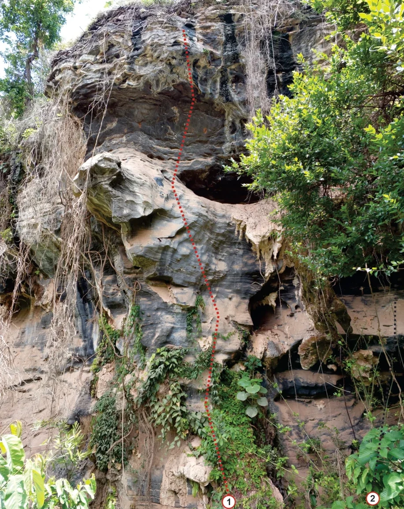
    - **largura_mapa**: 916
    - **altura_mapa**: 1151
    - **pontos_de_interesse**:
      - **[0]**:
        - **id**: KOurLs9Z7td77c
        - **uid**: KOurLs9Z7td77c
        - **rotulo**: 1
        - **circulo**:
          - **x**: 519
          - **y**: 1135
          - **raio**: 15
        - **label**: 1
      - **[1]**:
        - **id**: 3zoYjt8XpMVn3N
        - **uid**: 3zoYjt8XpMVn3N
        - **rotulo**: 2
        - **circulo**:
          - **x**: 846
          - **y**: 1127
          - **raio**: 14
        - **label**: 2
    - **referencias**:
      - **[0]**:
        - **alvo_uid**: Gb4mHgP0BBrpJD
        - **pontos_uids**:
          - KOurLs9Z7td77c
        - **escalada**: La Cucaracha
        - **ids**:
          - KOurLs9Z7td77c
      - **[1]**:
        - **alvo_uid**: s3yFmIBmxwQTZH
        - **pontos_uids**:
          - 3zoYjt8XpMVn3N
        - **escalada**: (via inacabada 1) Bem Vindo ao Bosque
        - **ids**:
          - 3zoYjt8XpMVn3N
  - **[2]**:
    - **caminho_imagem_mapa**: 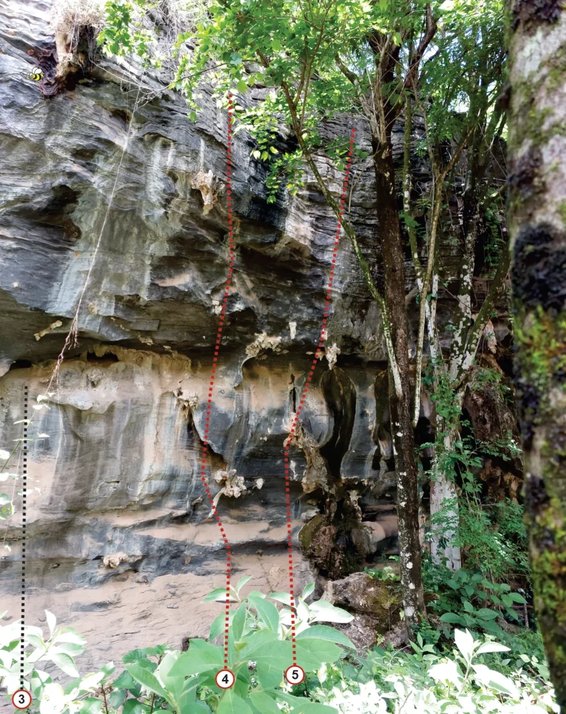
    - **largura_mapa**: 916
    - **altura_mapa**: 1155
    - **pontos_de_interesse**:
      - **[0]**:
        - **id**: 24jiD0bDirvE6I
        - **uid**: 24jiD0bDirvE6I
        - **rotulo**: 3
        - **circulo**:
          - **x**: 35
          - **y**: 1132
          - **raio**: 15
        - **label**: 3
      - **[1]**:
        - **id**: 9e4lSeZppolehK
        - **uid**: 9e4lSeZppolehK
        - **rotulo**: 4
        - **circulo**:
          - **x**: 364
          - **y**: 1099
          - **raio**: 15
        - **label**: 4
      - **[2]**:
        - **id**: zKULXxKXUhSpgz
        - **uid**: zKULXxKXUhSpgz
        - **rotulo**: 5
        - **circulo**:
          - **x**: 478
          - **y**: 1092
          - **raio**: 15
        - **label**: 5
    - **referencias**:
      - **[0]**:
        - **alvo_uid**: HMfUeRq4be4xa1
        - **pontos_uids**:
          - 24jiD0bDirvE6I
        - **escalada**: (via inacabada 2)
        - **ids**:
          - 24jiD0bDirvE6I
      - **[1]**:
        - **alvo_uid**: Ln4IOlN0c8xnVj
        - **pontos_uids**:
          - 9e4lSeZppolehK
        - **escalada**: Malandro é Malandro
        - **ids**:
          - 9e4lSeZppolehK
      - **[2]**:
        - **alvo_uid**: A3p6qXvV4FwilA
        - **pontos_uids**:
          - zKULXxKXUhSpgz
        - **escalada**: Mané é Mané
        - **ids**:
          - zKULXxKXUhSpgz
  - **[3]**:
    - **caminho_imagem_mapa**: 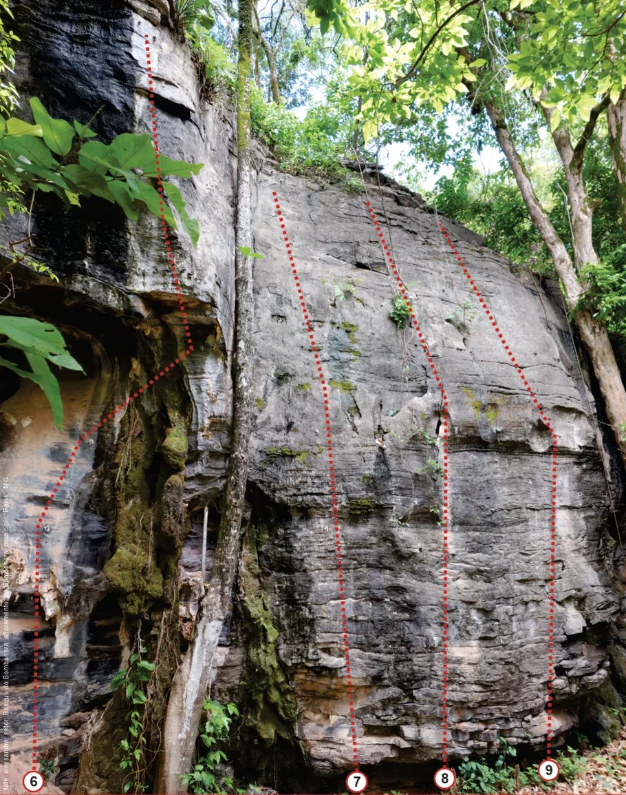
    - **largura_mapa**: 910
    - **altura_mapa**: 1154
    - **pontos_de_interesse**:
      - **[0]**:
        - **id**: g8XLQwyIZGl3QV
        - **uid**: g8XLQwyIZGl3QV
        - **rotulo**: 6
        - **circulo**:
          - **x**: 49
          - **y**: 1134
          - **raio**: 14
        - **label**: 6
      - **[1]**:
        - **id**: XgKG2bAiSlFI11
        - **uid**: XgKG2bAiSlFI11
        - **rotulo**: 7
        - **circulo**:
          - **x**: 519
          - **y**: 1135
          - **raio**: 14
        - **label**: 7
      - **[2]**:
        - **id**: Q8aMnHqTftIEpk
        - **uid**: Q8aMnHqTftIEpk
        - **rotulo**: 8
        - **circulo**:
          - **x**: 646
          - **y**: 1130
          - **raio**: 15
        - **label**: 8
      - **[3]**:
        - **id**: XZS6ItI6D1rzfJ
        - **uid**: XZS6ItI6D1rzfJ
        - **rotulo**: 9
        - **circulo**:
          - **x**: 798
          - **y**: 1118
          - **raio**: 15
        - **label**: 9
    - **referencias**:
      - **[0]**:
        - **alvo_uid**: nhsaBxopfWrZst
        - **pontos_uids**:
          - g8XLQwyIZGl3QV
        - **escalada**: Segunda Divisão
        - **ids**:
          - g8XLQwyIZGl3QV
      - **[1]**:
        - **alvo_uid**: XZGptTD7mgsbOc
        - **pontos_uids**:
          - XgKG2bAiSlFI11
        - **escalada**: Diedrinho
        - **ids**:
          - XgKG2bAiSlFI11
      - **[2]**:
        - **alvo_uid**: 0yXVSmz1EOOIeO
        - **pontos_uids**:
          - Q8aMnHqTftIEpk
        - **escalada**: Dona Leci
        - **ids**:
          - Q8aMnHqTftIEpk
      - **[3]**:
        - **alvo_uid**: OXVGxNW9Yhn7Q3
        - **pontos_uids**:
          - XZS6ItI6D1rzfJ
        - **escalada**: Caminito
        - **ids**:
          - XZS6ItI6D1rzfJ
- **escaladas**:
  - **[0]**:
    - **uid**: Gb4mHgP0BBrpJD
    - **via_esportiva**:
      - **nome**: La Cucaracha
      - **dificuldade**: PROJETO
      - **quantidade_protecoes_intermediarias**: 6
      - **quantidade_protecoes_parada**: 2
      - **data_abertura**: 2021
  - **[1]**:
    - **uid**: s3yFmIBmxwQTZH
    - **via_esportiva**:
      - **nome**: (via inacabada 1) Bem Vindo ao Bosque
      - **dificuldade**: INDEFINIDO
      - **data_abertura**: 2020
  - **[2]**:
    - **uid**: HMfUeRq4be4xa1
    - **via_esportiva**:
      - **nome**: (via inacabada 2)
      - **dificuldade**: INDEFINIDO
      - **data_abertura**: 2020
  - **[3]**:
    - **uid**: Ln4IOlN0c8xnVj
    - **via_esportiva**:
      - **nome**: Malandro é Malandro
      - **dificuldade**: BR_8A
      - **destaque**: True
      - **quantidade_protecoes_intermediarias**: 5
      - **quantidade_protecoes_parada**: 2
      - **data_abertura**: 2020
  - **[4]**:
    - **uid**: A3p6qXvV4FwilA
    - **via_esportiva**:
      - **nome**: Mané é Mané
      - **dificuldade**: BR_8B_BARRA_8C
      - **destaque**: True
      - **quantidade_protecoes_intermediarias**: 5
      - **quantidade_protecoes_parada**: 2
      - **data_abertura**: 2020
  - **[5]**:
    - **uid**: nhsaBxopfWrZst
    - **via_esportiva**:
      - **nome**: Segunda Divisão
      - **dificuldade**: BR_7A
      - **quantidade_protecoes_intermediarias**: 4
      - **quantidade_protecoes_parada**: 2
      - **data_abertura**: 2020
  - **[6]**:
    - **uid**: XZGptTD7mgsbOc
    - **via_esportiva**:
      - **nome**: Diedrinho
      - **dificuldade**: BR_5SUP
      - **quantidade_protecoes_intermediarias**: 4
      - **quantidade_protecoes_parada**: 2
      - **data_abertura**: 2020
  - **[7]**:
    - **uid**: 0yXVSmz1EOOIeO
    - **via_esportiva**:
      - **nome**: Dona Leci
      - **dificuldade**: BR_5
      - **destaque**: True
      - **quantidade_protecoes_intermediarias**: 4
      - **quantidade_protecoes_parada**: 2
      - **data_abertura**: 2020
  - **[8]**:
    - **uid**: OXVGxNW9Yhn7Q3
    - **via_esportiva**:
      - **nome**: Caminito
      - **dificuldade**: BR_5SUP
      - **quantidade_protecoes_intermediarias**: 3
      - **destaque**: True
      - **quantidade_protecoes_parada**: 2
      - **data_abertura**: 2020
- **precomputados**:
  - **total_escaladas**: 9
  - **total_esportivas**: 9

## Arquivos Externos

- **arquivos_externos**:
  - **[0]**:
    - **caminho**: 
    - **checksum_sha256**: 261f76ff3065187fce694e5becc134487ed35813ecab875cf9b584cdb90fd98a
  - **[1]**:
    - **caminho**: 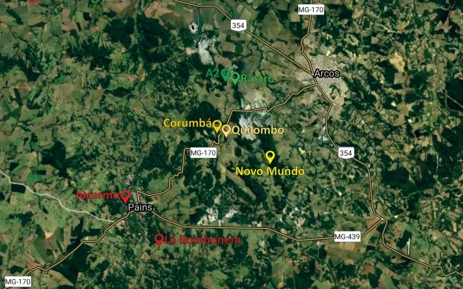
    - **checksum_sha256**: 1294ed7024af6d4e5d1b40ce0dcd5cf25c13404eeed8b058be0324d56c3c9d20
  - **[2]**:
    - **caminho**: 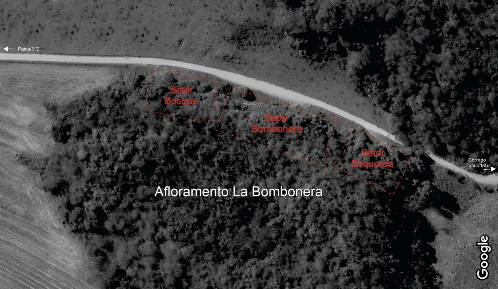
    - **checksum_sha256**: 86783d44014864c391c2be15e4029ca4b123571af0deb078eefd2399c98a2727
  - **[3]**:
    - **caminho**: 
    - **checksum_sha256**: b18a49e3305c9dd302a6cac056829c6029b7c733eb72ea615d27141437a16764
  - **[4]**:
    - **caminho**: 
    - **checksum_sha256**: a32351e87bead4c90db1e86def4cf7c38901e6cd1e33d9deace58941617dca9e
  - **[5]**:
    - **caminho**: 
    - **checksum_sha256**: 948f63bffa0840d8cbbb7cf3519f807365c431e3588885a8627cbe631b7dbc24
  - **[6]**:
    - **caminho**: 
    - **checksum_sha256**: b2a413d380fc3a214fb6142e123455e5e41e8578a50751467d9327dd2488126d
  - **[7]**:
    - **caminho**: 
    - **checksum_sha256**: 260670eefcd772ed1c23b5e2dc4d0da8e0f29fc6af2e8f645d0cf75168e4541a
  - **[8]**:
    - **caminho**: 
    - **checksum_sha256**: 8c9d68a388ee02600958e914adf29f04dce6eed641c3e8cd9faef0e571ea29e4
  - **[9]**:
    - **caminho**: 
    - **checksum_sha256**: 8cb0440e6cb7e9502a8640d070d43e4a3192c172f197942c5f21a47ff1744f1e
  - **[10]**:
    - **caminho**: 
    - **checksum_sha256**: 3a5002c1ac93cc2ba2f13649a5a70f0951ea11491aae67d348b2951c270f3e4c
  - **[11]**:
    - **caminho**: 
    - **checksum_sha256**: 9a8951bb840ee4c54cead7acf3c8b07f213d54fa94352f042fbdcc8f319cf89d
  - **[12]**:
    - **caminho**: 
    - **checksum_sha256**: 96d6b9ff5d2cfb07b4d539f7a92bfc8b557bf99981e3a9dcb837bd56abc3b37d
  - **[13]**:
    - **caminho**: 
    - **checksum_sha256**: 05c24e3cac4c06f65055600fa9b9b68edcaacd8bf98160880e6e0eabaa1aaa0c

