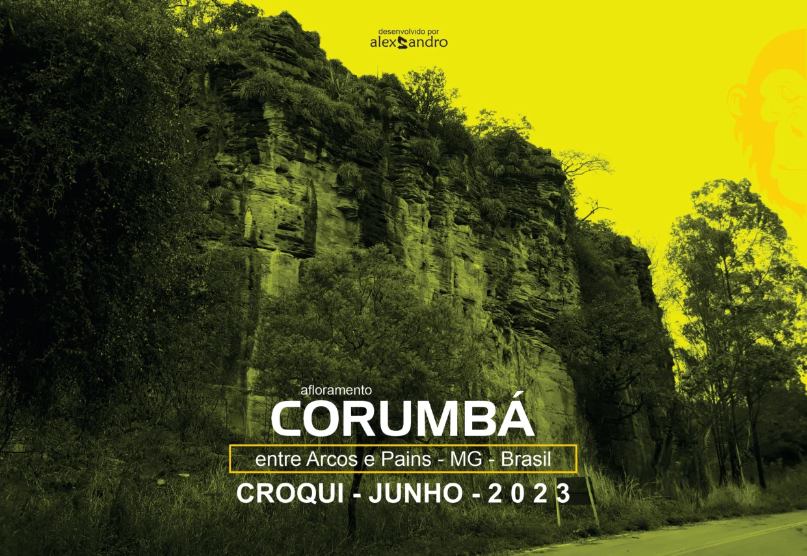
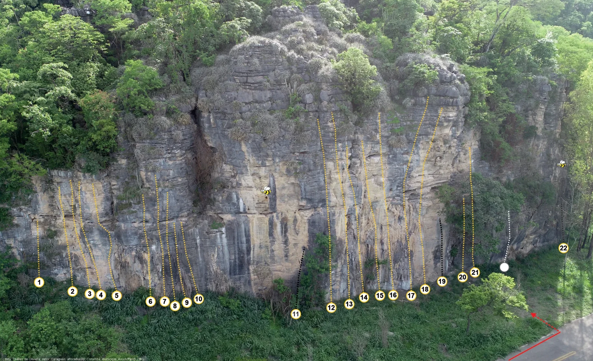
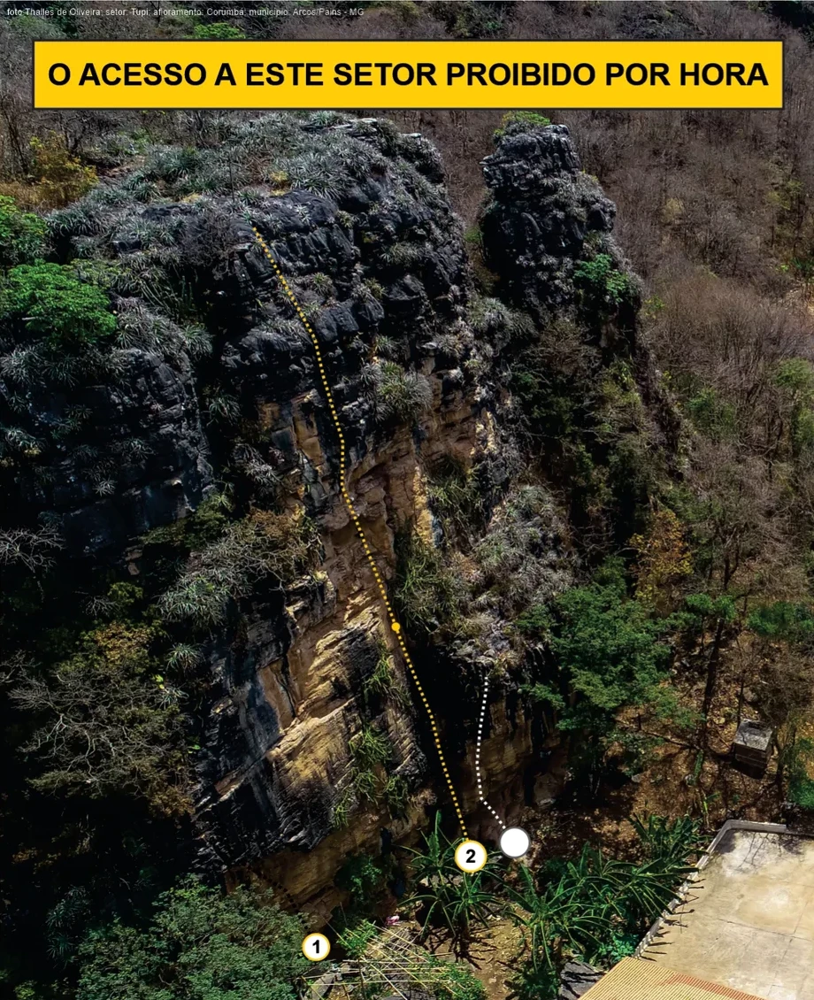
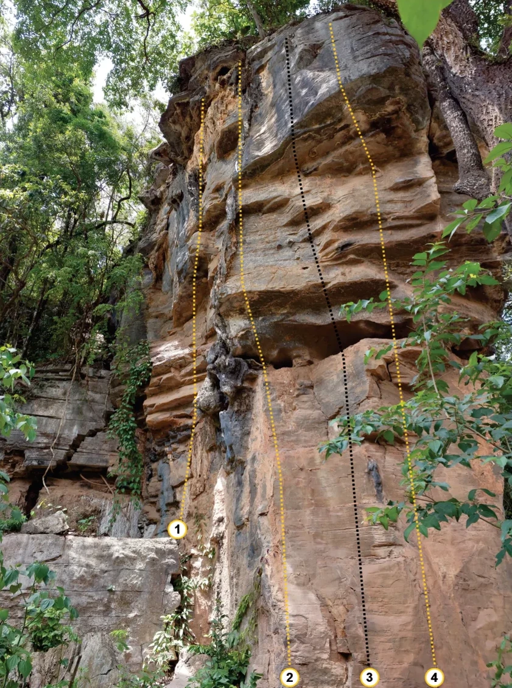
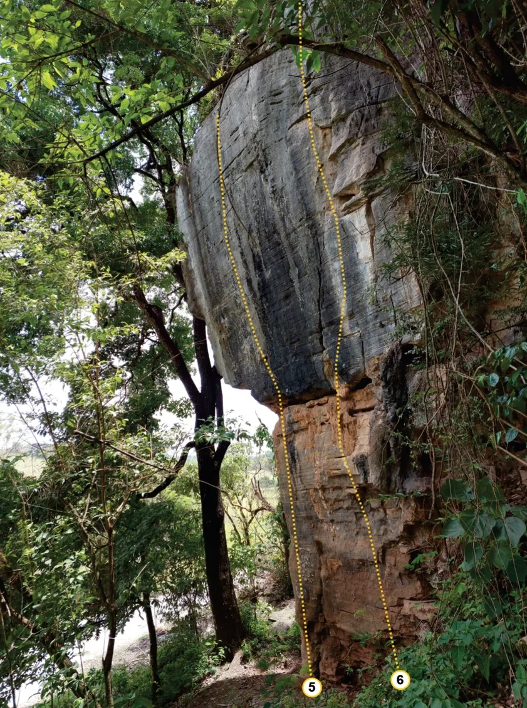
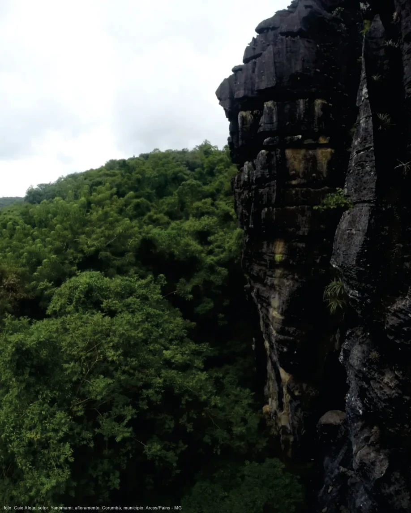
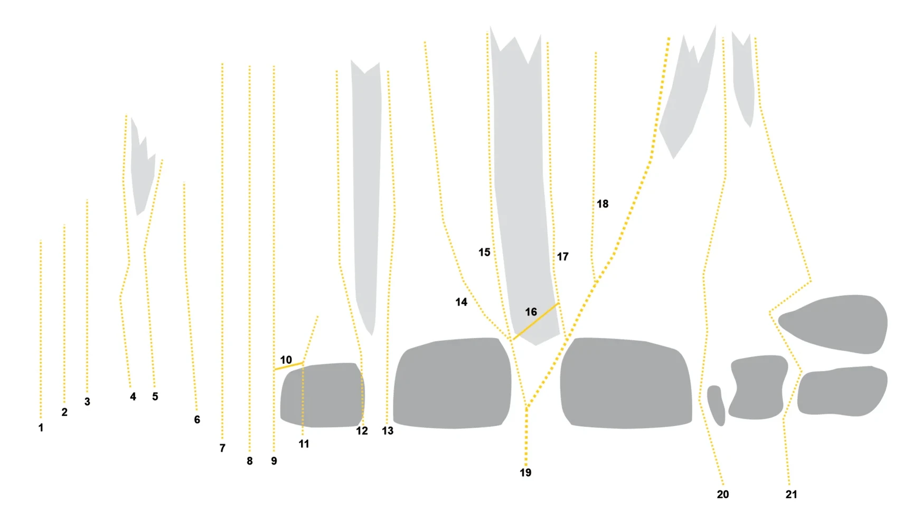
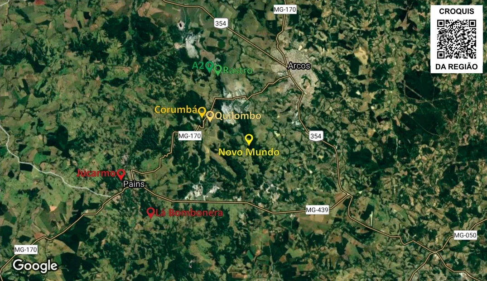

# Croqui: Arcos - Corumbá

## Informações Gerais

- **descricao**: Afloramento de calcário situado entre Arcos e Pains em Minas Gerais, com diversos setores de escalada esportiva.
- **id**: br_mg_arcos_corumba
- **nome**: Arcos - Corumbá
- **creditos**:
  - alexsandro martins
- **caminho_thumbnail**: 
- **revisado_manualmente**: True
- **status_desenho_extraivel**: NAO_TEM_DESENHO
- **botoes**:
  - **[0]**:
    - **texto**: Capa
    - **destino**:
      - **secao_textual**:
        - **conteudo**:
            # afloramento CORUMBÁ
            
            entre Arcos e Pains - MG - Brasil
            
            **CROQUI - JUNHO - 2023**
            
            |  |
            | :--: |
            | *Capa* |
            
            desenvolvido por alexsandro
  - **[1]**:
    - **texto**: Atenção e Regras
    - **destino**:
      - **secao_textual**:
        - **conteudo**:
            # Atenção e Observações
            
            Este croqui é apenas um auxílio de consulta a localização, não serve como instruções a prática da escalada. Não nos responsabilizamos pelas informações aqui contidas, são apenas ponto de vista.
            
            ## Atenção
            
            Os nomes das vias, seus respectivos conquistadores e a graduação sugerida para cada uma delas são resultados de uma pesquisa oral conduzida entre os escaladores que frequentam o pico, uma vez que não foi encontrado nenhum registro prévio sobre o tema (exceto os guias anteriores). O resultado desse trabalho pode eventualmente conter erros, os quais peço que não sejam entendidos como desrespeito. O objetivo é documentar e divulgar a prática da escalada no centro-oeste mineiro da maneira mais exata possível.
            
            ## Observação
            
            Como algumas vias são de conquistadores desconhecidos foi utilizado apelido + (*) para identificá-las. Caso encontre algum engano nos dados citados neste croqui, peço que me envie a correção. Tereis satisfação em atendê-lo, pois todos os envolvidos com a escalada tem a ganhar com o aprimoramento desse trabalho.
            
            Muito obrigado aos conquistadores e conquistadoras, **GRATIDÃO** a vocês sempre!!!
            
            **Arte/Organização/Produção:** alexsandro martins / 7ª versão / atualização 2023 / Revisão e graduação sugerida das vias: Grupo de Trabalho
            
            ---
            
            # Seja Consciente!
            
            - **UTILIZE APENAS AS TRILHAS PRINCIPAIS;**
            - **As grutas NÃO são banheiros!** Faça suas necessidades fisiológicas em casa, caso não consiga segurar, faça longe das pedras e cubra com folhas ou terra;
            - **Leve todo seu lixo de volta** e o lixo de outros visitantes descuidados (inclusive papel higiênico, garrafas plásticas, bitucas, pontas, papel de bala...);
            - Os animais locais e plantas nativas devem permanecer em seus lugares. Lembre-se que eles estão em seu habitat natural e precisam ser respeitados;
            - **Animais domésticos (ex. cães)** não devem ser trazidos a este local, desta forma, você os protege de doenças silvestres e vice versa;
            - **Fogueiras** além de provocar queimadas, danificam o local;
            - **Estacione de maneira adequada** e no local adequado a fim de não atrapalhar o fluxo de outros veículos;
            - Utilize equipamentos de segurança e verifique seu estado de conservação;
            - Cuidado com pedras soltas principalmente em setores e vias novas;
            - Antes de conquistar uma via de escalada entre em contato com o GT.
  - **[2]**:
    - **texto**: Parcerias e Contato
    - **destino**:
      - **secao_textual**:
        - **conteudo**:
            # Parcerias e Contato
            
            Parcerias na atualização do ano de 2023 dos croquis dos Afloramentos, Setores e Vias de Escaladas Esportiva em Arcos, Pains e Região - MG.
            
            ## Realização e Apoio
            
            |  |
            | :--: |
            | *Logos de Parcerias* |
            
            - **Abrigo Base**
            - **Macaco Galo**
            - **Kmon Escalada**
            - **Quero Escalar**
            - **Meka Coffee Bar**
            - **Borges Café**
            - **Brand's re Soul**
            - **100 Betas Ginásio de Escalada**
            
            ---
            
            ### Para contribuir com esse trabalho e a próxima atualização:
            
            - **Instagram:** [@abrigobase](https://www.instagram.com/abrigobase)
            - **E-mail:** abrigobase@gmail.com
            - **Contribuição/Parceria PIX:** 37 99918-3634
- **ultima_migracao**: 4
- **publicar_croqui**: True
- **revisado_bounding_circle**: True

## Parte: setor_pataxos

### Setor (Pico: Corumbá)

- **descricao**:
    # Setor Pataxós
    
    Sombra a partir de 11h (varia de acordo com a sessão).
    
    |  |
    | :--: |
    | *Escaladora* |
- **nome**: Setor Pataxós
- **mapas**:
  - **[0]**:
    - **caminho_imagem_mapa**: 
    - **largura_mapa**: 1841
    - **altura_mapa**: 1123
    - **pontos_de_interesse**:
      - **[0]**:
        - **id**: 1
        - **label**: 1
        - **circulo**:
          - **x**: 122
          - **y**: 878
          - **raio**: 15
      - **[1]**:
        - **id**: 2
        - **label**: 2
        - **circulo**:
          - **x**: 226
          - **y**: 907
          - **raio**: 15
      - **[2]**:
        - **id**: 3
        - **label**: 3
        - **circulo**:
          - **x**: 279
          - **y**: 914
          - **raio**: 15
      - **[3]**:
        - **id**: 4
        - **label**: 4
        - **circulo**:
          - **x**: 314
          - **y**: 918
          - **raio**: 15
      - **[4]**:
        - **id**: 5
        - **label**: 5
        - **circulo**:
          - **x**: 363
          - **y**: 921
          - **raio**: 15
      - **[5]**:
        - **id**: 6
        - **label**: 6
        - **circulo**:
          - **x**: 468
          - **y**: 938
          - **raio**: 15
      - **[6]**:
        - **id**: 7
        - **label**: 7
        - **circulo**:
          - **x**: 511
          - **y**: 938
          - **raio**: 15
      - **[7]**:
        - **id**: 8
        - **label**: 8
        - **circulo**:
          - **x**: 544
          - **y**: 952
          - **raio**: 15
      - **[8]**:
        - **id**: 9
        - **label**: 9
        - **circulo**:
          - **x**: 580
          - **y**: 942
          - **raio**: 15
      - **[9]**:
        - **id**: 10
        - **label**: 10
        - **circulo**:
          - **x**: 617
          - **y**: 930
          - **raio**: 15
      - **[10]**:
        - **id**: 11
        - **label**: 11
        - **circulo**:
          - **x**: 919
          - **y**: 977
          - **raio**: 15
      - **[11]**:
        - **id**: 12
        - **label**: 12
        - **circulo**:
          - **x**: 1029
          - **y**: 957
          - **raio**: 15
      - **[12]**:
        - **id**: 13
        - **label**: 13
        - **circulo**:
          - **x**: 1085
          - **y**: 946
          - **raio**: 15
      - **[13]**:
        - **id**: 14
        - **label**: 14
        - **circulo**:
          - **x**: 1130
          - **y**: 925
          - **raio**: 15
      - **[14]**:
        - **id**: 15
        - **label**: 15
        - **circulo**:
          - **x**: 1180
          - **y**: 920
          - **raio**: 15
      - **[15]**:
        - **id**: 16
        - **label**: 16
        - **circulo**:
          - **x**: 1221
          - **y**: 918
          - **raio**: 15
      - **[16]**:
        - **id**: 17
        - **label**: 17
        - **circulo**:
          - **x**: 1277
          - **y**: 920
          - **raio**: 15
      - **[17]**:
        - **id**: 18
        - **label**: 18
        - **circulo**:
          - **x**: 1320
          - **y**: 900
          - **raio**: 15
      - **[18]**:
        - **id**: 19
        - **label**: 19
        - **circulo**:
          - **x**: 1373
          - **y**: 876
          - **raio**: 15
      - **[19]**:
        - **id**: 20
        - **label**: 20
        - **circulo**:
          - **x**: 1436
          - **y**: 863
          - **raio**: 15
      - **[20]**:
        - **id**: 21
        - **label**: 21
        - **circulo**:
          - **x**: 1475
          - **y**: 848
          - **raio**: 15
      - **[21]**:
        - **id**: 22
        - **label**: 22
        - **circulo**:
          - **x**: 1750
          - **y**: 772
          - **raio**: 15
    - **referencias**:
      - **[0]**:
        - **escalada**: Ditadura do Barulho
        - **ids**:
          - 1
      - **[1]**:
        - **escalada**: Nó 88
        - **ids**:
          - 2
      - **[2]**:
        - **escalada**: Mulher Mais Bonita do Mundo
        - **ids**:
          - 3
      - **[3]**:
        - **escalada**: Jogo Rápido
        - **ids**:
          - 4
      - **[4]**:
        - **escalada**: Baile da Betinha
        - **ids**:
          - 5
      - **[5]**:
        - **escalada**: Chove + Não Molha
        - **ids**:
          - 6
      - **[6]**:
        - **escalada**: Paisnkentá
        - **ids**:
          - 7
      - **[7]**:
        - **escalada**: Alá Magnólia
        - **ids**:
          - 8
      - **[8]**:
        - **escalada**: F.A. Foi Dela
        - **ids**:
          - 9
      - **[9]**:
        - **escalada**: Ilusão do 'eu'
        - **ids**:
          - 10
      - **[10]**:
        - **escalada**: (via inacabada)
        - **ids**:
          - 11
      - **[11]**:
        - **escalada**: Alienação Social
        - **ids**:
          - 12
      - **[12]**:
        - **escalada**: Siurana
        - **ids**:
          - 13
      - **[13]**:
        - **escalada**: Bond, Vagabond
        - **ids**:
          - 14
      - **[14]**:
        - **escalada**: Bond, Maribond
        - **ids**:
          - 15
      - **[15]**:
        - **escalada**: Charuto no Beiço
        - **ids**:
          - 16
      - **[16]**:
        - **escalada**: Chama o Bombeiro
        - **ids**:
          - 17
      - **[17]**:
        - **escalada**: Inter Escalar
        - **ids**:
          - 18
      - **[18]**:
        - **escalada**: (via inacabada) Capitão Fantástico
        - **ids**:
          - 19
      - **[19]**:
        - **escalada**: Aracnofobia
        - **ids**:
          - 20
      - **[20]**:
        - **escalada**: Mão de Alface
        - **ids**:
          - 21
      - **[21]**:
        - **escalada**: (via inacabada)
        - **ids**:
          - 22
- **escaladas**:
  - **[0]**:
    - **via_esportiva**:
      - **nome**: Ditadura do Barulho
      - **dificuldade**: BR_3
      - **data_abertura**: 2021-03-20
      - **quantidade_protecoes_intermediarias**: 3
      - **quantidade_protecoes_parada**: 2
      - **destaque**: True
  - **[1]**:
    - **via_esportiva**:
      - **nome**: Nó 88
      - **dificuldade**: BR_6
      - **data_abertura**: 2020-12-26
      - **quantidade_protecoes_parada**: 2
      - **destaque**: True
  - **[2]**:
    - **via_esportiva**:
      - **nome**: Mulher Mais Bonita do Mundo
      - **dificuldade**: BR_5
      - **data_abertura**: 2020-10-12
      - **quantidade_protecoes_intermediarias**: 5
      - **quantidade_protecoes_parada**: 2
      - **destaque**: True
  - **[3]**:
    - **via_esportiva**:
      - **nome**: Jogo Rápido
      - **dificuldade**: BR_7A_BARRA_7B
      - **data_abertura**: 2020-11-01
      - **destaque**: True
  - **[4]**:
    - **via_esportiva**:
      - **nome**: Baile da Betinha
      - **dificuldade**: BR_5SUP
      - **data_abertura**: 2020-11-01
      - **destaque**: True
  - **[5]**:
    - **via_esportiva**:
      - **nome**: Chove + Não Molha
      - **dificuldade**: BR_6
      - **data_abertura**: 2021-01-01
      - **quantidade_protecoes_intermediarias**: 5
      - **quantidade_protecoes_parada**: 2
  - **[6]**:
    - **via_esportiva**:
      - **nome**: Paisnkentá
      - **dificuldade**: BR_6SUP
      - **data_abertura**: 2020-12-01
      - **destaque**: True
  - **[7]**:
    - **via_esportiva**:
      - **nome**: Alá Magnólia
      - **data_abertura**: 2020-12-01
      - **destaque**: True
  - **[8]**:
    - **via_esportiva**:
      - **nome**: F.A. Foi Dela
      - **dificuldade**: BR_4
      - **data_abertura**: 2021-01-03
      - **destaque**: True
  - **[9]**:
    - **via_esportiva**:
      - **nome**: Ilusão do 'eu'
      - **dificuldade**: BR_6SUP
      - **data_abertura**: 2021-01-03
      - **destaque**: True
  - **[10]**:
    - **via_esportiva**:
      - **nome**: (via inacabada)
      - **dificuldade**: PROJETO
      - **data_abertura**: 2008-01-01
      - **quantidade_protecoes_intermediarias**: 1
  - **[11]**:
    - **via_esportiva**:
      - **nome**: Alienação Social
      - **dificuldade**: PROJETO
      - **data_abertura**: 2020-11-01
      - **quantidade_protecoes_intermediarias**: 8
      - **quantidade_protecoes_parada**: 2
      - **destaque**: True
  - **[12]**:
    - **via_esportiva**:
      - **nome**: Siurana
      - **dificuldade**: BR_6SUP_BARRA_7A
      - **data_abertura**: 2020-11-01
      - **destaque**: True
  - **[13]**:
    - **via_esportiva**:
      - **nome**: Bond, Vagabond
      - **dificuldade**: BR_6SUP_BARRA_7A
      - **data_abertura**: 2020-10-01
      - **quantidade_protecoes_intermediarias**: 10
      - **destaque**: True
      - **quantidade_protecoes_parada**: 2
  - **[14]**:
    - **via_esportiva**:
      - **nome**: Bond, Maribond
      - **dificuldade**: BR_7A_BARRA_7B
      - **data_abertura**: 2020-10-01
      - **destaque**: True
      - **quantidade_protecoes_intermediarias**: 13
      - **quantidade_protecoes_parada**: 2
  - **[15]**:
    - **via_esportiva**:
      - **nome**: Charuto no Beiço
      - **dificuldade**: BR_6
      - **destaque**: True
      - **data_abertura**: 2020-10-01
      - **quantidade_protecoes_intermediarias**: 9
      - **quantidade_protecoes_parada**: 2
  - **[16]**:
    - **via_esportiva**:
      - **nome**: Chama o Bombeiro
      - **dificuldade**: BR_6SUP_BARRA_7A
      - **destaque**: True
      - **data_abertura**: 2020-10-01
      - **quantidade_protecoes_intermediarias**: 13
      - **quantidade_protecoes_parada**: 2
  - **[17]**:
    - **via_esportiva**:
      - **nome**: Inter Escalar
      - **dificuldade**: BR_7A
      - **data_abertura**: 2020-10-01
      - **destaque**: True
      - **quantidade_protecoes_intermediarias**: 13
      - **quantidade_protecoes_parada**: 2
  - **[18]**:
    - **via_esportiva**:
      - **nome**: (via inacabada) Capitão Fantástico
      - **dificuldade**: PROJETO
      - **data_abertura**: 2020-10-01
      - **quantidade_protecoes_intermediarias**: 5
  - **[19]**:
    - **via_esportiva**:
      - **nome**: Aracnofobia
      - **dificuldade**: BR_4
      - **data_abertura**: 2020-10-01
      - **destaque**: True
      - **quantidade_protecoes_intermediarias**: 5
      - **quantidade_protecoes_parada**: 2
  - **[20]**:
    - **via_esportiva**:
      - **nome**: Mão de Alface
      - **dificuldade**: BR_5SUP
      - **destaque**: True
      - **data_abertura**: 2020-10-01
      - **quantidade_protecoes_intermediarias**: 8
      - **quantidade_protecoes_parada**: 2
  - **[21]**:
    - **via_movel**:
      - **nome**: Marquês de Rabicó
      - **dificuldade**: BR_7A
      - **data_abertura**: 2021-01-01
  - **[22]**:
    - **via_esportiva**:
      - **nome**: (via inacabada)
      - **dificuldade**: PROJETO
      - **data_abertura**: 2020-10-01
      - **quantidade_protecoes_intermediarias**: 3
- **precomputados**:
  - **total_escaladas**: 23

## Parte: setor_cataguas

### Setor (Pico: Corumbá)

- **descricao**:
    # Setor Cataguás
    
    > [!WARNING]
    > **O ACESSO A ESTE SETOR ESTÁ PROIBIDO POR HORA.**
    
    Sombra a partir de 11h (varia de acordo com a estação).
- **nome**: Setor Cataguás
- **mapas**:
  - **[0]**:
    - **caminho_imagem_mapa**: 
    - **largura_mapa**: 920
    - **altura_mapa**: 1130
    - **pontos_de_interesse**:
      - **[0]**:
        - **id**: 1
        - **label**: 1
        - **circulo**:
          - **x**: 358
          - **y**: 1070
          - **raio**: 15
      - **[1]**:
        - **id**: 2
        - **label**: 2
        - **circulo**:
          - **x**: 532
          - **y**: 968
          - **raio**: 17
    - **referencias**:
      - **[0]**:
        - **escalada**: (via inacabada)
        - **ids**:
          - 1
      - **[1]**:
        - **escalada**: Dos Pombos
        - **ids**:
          - 2
- **escaladas**:
  - **[0]**:
    - **via_esportiva**:
      - **nome**: (via inacabada)
      - **dificuldade**: PROJETO
  - **[1]**:
    - **via_esportiva**:
      - **nome**: Dos Pombos
      - **destaque**: True
      - **data_abertura**: 2000-01-01
  - **[2]**:
    - **via_movel**:
      - **nome**: sem nome (via mixta)
      - **data_abertura**: 2008-01-01
- **precomputados**:
  - **total_escaladas**: 3

## Parte: setor_xavante

### Setor (Pico: Corumbá)

- **descricao**:
    # Setor Xavante
    
    Sombra o dia todo (varia de acordo com a estação).
    
    |  |
    | :--: |
    | *Escalador na sombra* |
- **nome**: Setor Xavante
- **mapas**:
  - **[0]**:
    - **caminho_imagem_mapa**: 
    - **largura_mapa**: 841
    - **altura_mapa**: 1129
    - **pontos_de_interesse**:
      - **[0]**:
        - **id**: 1
        - **label**: 1
        - **circulo**:
          - **x**: 292
          - **y**: 868
          - **raio**: 15
      - **[1]**:
        - **id**: 2
        - **label**: 2
        - **circulo**:
          - **x**: 476
          - **y**: 1112
          - **raio**: 15
      - **[2]**:
        - **id**: 3
        - **label**: 3
        - **circulo**:
          - **x**: 607
          - **y**: 1112
          - **raio**: 15
      - **[3]**:
        - **id**: 4
        - **label**: 4
        - **circulo**:
          - **x**: 714
          - **y**: 1112
          - **raio**: 15
    - **referencias**:
      - **[0]**:
        - **escalada**: Curumim
        - **ids**:
          - 1
      - **[1]**:
        - **escalada**: Terra à Vista
        - **ids**:
          - 2
      - **[2]**:
        - **escalada**: (projeto)
        - **ids**:
          - 3
      - **[3]**:
        - **escalada**: (sem nome)
        - **ids**:
          - 4
  - **[1]**:
    - **caminho_imagem_mapa**: 
    - **largura_mapa**: 841
    - **altura_mapa**: 1129
    - **pontos_de_interesse**:
      - **[0]**:
        - **id**: 5
        - **label**: 5
        - **circulo**:
          - **x**: 498
          - **y**: 1097
          - **raio**: 15
      - **[1]**:
        - **id**: 6
        - **label**: 6
        - **circulo**:
          - **x**: 639
          - **y**: 1084
          - **raio**: 15
    - **referencias**:
      - **[0]**:
        - **escalada**: Especiaria
        - **ids**:
          - 5
      - **[1]**:
        - **escalada**: Tupi Or Not Tupi
        - **ids**:
          - 6
- **escaladas**:
  - **[0]**:
    - **via_esportiva**:
      - **nome**: Curumim
      - **dificuldade**: BR_6SUP
      - **destaque**: True
      - **data_abertura**: 2022-07-25
      - **quantidade_protecoes_intermediarias**: 6
      - **quantidade_protecoes_parada**: 2
  - **[1]**:
    - **via_esportiva**:
      - **nome**: Terra à Vista
      - **destaque**: True
      - **dificuldade**: BR_7B
      - **data_abertura**: 2022-07-25
      - **quantidade_protecoes_intermediarias**: 7
      - **quantidade_protecoes_parada**: 2
  - **[2]**:
    - **via_esportiva**:
      - **nome**: (projeto)
      - **dificuldade**: PROJETO
  - **[3]**:
    - **via_esportiva**:
      - **nome**: (sem nome)
      - **dificuldade**: PROJETO
      - **data_abertura**: 2022-07-25
      - **quantidade_protecoes_intermediarias**: 7
      - **quantidade_protecoes_parada**: 2
  - **[4]**:
    - **via_esportiva**:
      - **nome**: Especiaria
      - **dificuldade**: PROJETO
      - **destaque**: True
      - **data_abertura**: 2022-07-25
      - **quantidade_protecoes_intermediarias**: 6
      - **quantidade_protecoes_parada**: 2
  - **[5]**:
    - **via_esportiva**:
      - **nome**: Tupi Or Not Tupi
      - **dificuldade**: BR_7A
      - **destaque**: True
      - **data_abertura**: 2022-07-25
      - **quantidade_protecoes_intermediarias**: 8
      - **quantidade_protecoes_parada**: 2
- **precomputados**:
  - **total_escaladas**: 6

## Parte: setor_yanomami

### Setor (Pico: Corumbá)

- **descricao**:
    # Setor Yanomami
    
    Sombra até as 14h30 (varia de acordo com a estação).
    
    |  |
    | :--: |
    | *Parede Yanomami* |
- **nome**: Setor Yanomami
- **mapas**:
  - **[0]**:
    - **caminho_imagem_mapa**: 
    - **largura_mapa**: 1710
    - **altura_mapa**: 990
    - **pontos_de_interesse**:
      - **[0]**:
        - **id**: 1
        - **label**: 1
        - **retangulo**:
          - **x**: 78
          - **y**: 811
          - **comprimento**: 25
          - **largura**: 28
      - **[1]**:
        - **id**: 2
        - **label**: 2
        - **retangulo**:
          - **x**: 122
          - **y**: 780
          - **comprimento**: 26
          - **largura**: 28
      - **[2]**:
        - **id**: 3
        - **label**: 3
        - **retangulo**:
          - **x**: 165
          - **y**: 760
          - **comprimento**: 26
          - **largura**: 28
      - **[3]**:
        - **id**: 4
        - **label**: 4
        - **retangulo**:
          - **x**: 252
          - **y**: 752
          - **comprimento**: 25
          - **largura**: 28
      - **[4]**:
        - **id**: 5
        - **label**: 5
        - **retangulo**:
          - **x**: 294
          - **y**: 752
          - **comprimento**: 29
          - **largura**: 25
      - **[5]**:
        - **id**: 6
        - **label**: 6
        - **retangulo**:
          - **x**: 374
          - **y**: 796
          - **comprimento**: 29
          - **largura**: 26
      - **[6]**:
        - **id**: 7
        - **label**: 7
        - **retangulo**:
          - **x**: 421
          - **y**: 849
          - **comprimento**: 28
          - **largura**: 28
      - **[7]**:
        - **id**: 8
        - **label**: 8
        - **retangulo**:
          - **x**: 474
          - **y**: 874
          - **comprimento**: 25
          - **largura**: 27
      - **[8]**:
        - **id**: 9
        - **label**: 9
        - **retangulo**:
          - **x**: 518
          - **y**: 873
          - **comprimento**: 26
          - **largura**: 30
      - **[9]**:
        - **id**: 10
        - **label**: 10
        - **retangulo**:
          - **x**: 542
          - **y**: 682
          - **comprimento**: 31
          - **largura**: 30
      - **[10]**:
        - **id**: 11
        - **label**: 11
        - **retangulo**:
          - **x**: 575
          - **y**: 840
          - **comprimento**: 30
          - **largura**: 27
      - **[11]**:
        - **id**: 12
        - **label**: 12
        - **retangulo**:
          - **x**: 686
          - **y**: 816
          - **comprimento**: 31
          - **largura**: 32
      - **[12]**:
        - **id**: 13
        - **label**: 13
        - **retangulo**:
          - **x**: 734
          - **y**: 816
          - **comprimento**: 32
          - **largura**: 30
      - **[13]**:
        - **id**: 14
        - **label**: 14
        - **retangulo**:
          - **x**: 874
          - **y**: 572
          - **comprimento**: 35
          - **largura**: 31
      - **[14]**:
        - **id**: 15
        - **label**: 15
        - **retangulo**:
          - **x**: 918
          - **y**: 477
          - **comprimento**: 30
          - **largura**: 30
      - **[15]**:
        - **id**: 16
        - **label**: 16
        - **retangulo**:
          - **x**: 1006
          - **y**: 592
          - **comprimento**: 32
          - **largura**: 27
      - **[16]**:
        - **id**: 17
        - **label**: 17
        - **retangulo**:
          - **x**: 1066
          - **y**: 484
          - **comprimento**: 34
          - **largura**: 29
      - **[17]**:
        - **id**: 18
        - **label**: 18
        - **retangulo**:
          - **x**: 1142
          - **y**: 386
          - **comprimento**: 30
          - **largura**: 30
      - **[18]**:
        - **id**: 19
        - **label**: 19
        - **retangulo**:
          - **x**: 995
          - **y**: 895
          - **comprimento**: 34
          - **largura**: 30
      - **[19]**:
        - **id**: 20
        - **label**: 20
        - **retangulo**:
          - **x**: 1368
          - **y**: 936
          - **comprimento**: 31
          - **largura**: 27
      - **[20]**:
        - **id**: 21
        - **label**: 21
        - **retangulo**:
          - **x**: 1498
          - **y**: 938
          - **comprimento**: 32
          - **largura**: 27
    - **referencias**:
      - **[0]**:
        - **escalada**: Saidera
        - **ids**:
          - 1
      - **[1]**:
        - **escalada**: Impaciência Tem Limite
        - **ids**:
          - 2
      - **[2]**:
        - **escalada**: Gongolô
        - **ids**:
          - 3
      - **[3]**:
        - **escalada**: Seg Sativa
        - **ids**:
          - 4
      - **[4]**:
        - **escalada**: Gaiapiá
        - **ids**:
          - 5
      - **[5]**:
        - **escalada**: Telefone Sem Fio
        - **ids**:
          - 6
      - **[6]**:
        - **escalada**: Trabalhador Solo
        - **ids**:
          - 7
      - **[7]**:
        - **escalada**: Quem avisa amigo é
        - **ids**:
          - 8
      - **[8]**:
        - **escalada**: Inimigo do Fim
        - **ids**:
          - 9
      - **[9]**:
        - **escalada**: Hipotenusa (variante)
        - **ids**:
          - 10
      - **[10]**:
        - **escalada**: Força Yanomami (principal)
        - **ids**:
          - 11
      - **[11]**:
        - **escalada**: Pluriverso Paralelo
        - **ids**:
          - 12
      - **[12]**:
        - **escalada**: Tiro ao Alvo
        - **ids**:
          - 13
      - **[13]**:
        - **escalada**: Visita Ilustre
        - **ids**:
          - 14
      - **[14]**:
        - **escalada**: Hand Pan (variante)
        - **ids**:
          - 15
      - **[15]**:
        - **escalada**: Labirinto (variante)
        - **ids**:
          - 16
      - **[16]**:
        - **escalada**: Charada (variante)
        - **ids**:
          - 17
      - **[17]**:
        - **escalada**: Vingador (variante)
        - **ids**:
          - 18
      - **[18]**:
        - **escalada**: Trilogia (principal)
        - **ids**:
          - 19
      - **[19]**:
        - **escalada**: Paga pra Ver
        - **ids**:
          - 20
      - **[20]**:
        - **escalada**: Divida Ativa
        - **ids**:
          - 21
- **escaladas**:
  - **[0]**:
    - **via_esportiva**:
      - **nome**: Saidera
      - **dificuldade**: BR_5
      - **data_abertura**: 2022-12-01
      - **quantidade_protecoes_intermediarias**: 4
      - **quantidade_protecoes_parada**: 2
  - **[1]**:
    - **via_esportiva**:
      - **nome**: Impaciência Tem Limite
      - **destaque**: True
      - **dificuldade**: BR_7A
      - **quantidade_protecoes_intermediarias**: 4
      - **quantidade_protecoes_parada**: 2
  - **[2]**:
    - **via_esportiva**:
      - **nome**: Gongolô
      - **destaque**: True
      - **dificuldade**: BR_6SUP
      - **quantidade_protecoes_intermediarias**: 4
      - **quantidade_protecoes_parada**: 2
  - **[3]**:
    - **via_esportiva**:
      - **nome**: Seg Sativa
      - **dificuldade**: BR_6
      - **destaque**: True
      - **quantidade_protecoes_intermediarias**: 8
      - **quantidade_protecoes_parada**: 2
  - **[4]**:
    - **via_esportiva**:
      - **nome**: Gaiapiá
      - **destaque**: True
      - **dificuldade**: BR_6
      - **quantidade_protecoes_intermediarias**: 6
      - **quantidade_protecoes_parada**: 2
  - **[5]**:
    - **via_esportiva**:
      - **nome**: Telefone Sem Fio
      - **destaque**: True
      - **dificuldade**: BR_5
      - **quantidade_protecoes_intermediarias**: 5
      - **quantidade_protecoes_parada**: 2
  - **[6]**:
    - **via_esportiva**:
      - **nome**: Trabalhador Solo
      - **destaque**: True
      - **dificuldade**: BR_5
      - **quantidade_protecoes_intermediarias**: 10
      - **quantidade_protecoes_parada**: 2
  - **[7]**:
    - **via_esportiva**:
      - **nome**: Quem avisa amigo é
      - **destaque**: True
      - **dificuldade**: BR_5
      - **quantidade_protecoes_intermediarias**: 11
      - **quantidade_protecoes_parada**: 2
  - **[8]**:
    - **via_esportiva**:
      - **nome**: Inimigo do Fim
      - **dificuldade**: BR_6SUP_BARRA_7A
      - **destaque**: True
      - **quantidade_protecoes_intermediarias**: 13
      - **quantidade_protecoes_parada**: 2
  - **[9]**:
    - **via_esportiva**:
      - **nome**: Hipotenusa (variante)
      - **dificuldade**: BR_6SUP_BARRA_7A
      - **destaque**: True
      - **quantidade_protecoes_intermediarias**: 5
      - **quantidade_protecoes_parada**: 2
  - **[10]**:
    - **via_esportiva**:
      - **nome**: Força Yanomami (principal)
      - **dificuldade**: BR_7B_BARRA_7C
      - **quantidade_protecoes_intermediarias**: 5
      - **quantidade_protecoes_parada**: 2
  - **[11]**:
    - **via_esportiva**:
      - **nome**: Pluriverso Paralelo
      - **dificuldade**: PROJETO
  - **[12]**:
    - **via_esportiva**:
      - **nome**: Tiro ao Alvo
      - **dificuldade**: PROJETO
  - **[13]**:
    - **via_esportiva**:
      - **nome**: Visita Ilustre
      - **destaque**: True
      - **dificuldade**: PROJETO
      - **quantidade_protecoes_intermediarias**: 18
      - **quantidade_protecoes_parada**: 2
  - **[14]**:
    - **via_esportiva**:
      - **nome**: Hand Pan (variante)
      - **destaque**: True
      - **dificuldade**: BR_7B
      - **quantidade_protecoes_intermediarias**: 17
      - **quantidade_protecoes_parada**: 2
  - **[15]**:
    - **via_esportiva**:
      - **nome**: Labirinto (variante)
      - **dificuldade**: BR_7C
      - **destaque**: True
      - **quantidade_protecoes_intermediarias**: 15
      - **quantidade_protecoes_parada**: 2
  - **[16]**:
    - **via_esportiva**:
      - **nome**: Charada (variante)
      - **dificuldade**: PROJETO
      - **quantidade_protecoes_intermediarias**: 14
      - **quantidade_protecoes_parada**: 2
  - **[17]**:
    - **via_esportiva**:
      - **nome**: Vingador (variante)
      - **dificuldade**: PROJETO
      - **quantidade_protecoes_intermediarias**: 14
      - **quantidade_protecoes_parada**: 2
  - **[18]**:
    - **via_esportiva**:
      - **nome**: Trilogia (principal)
      - **dificuldade**: PROJETO
      - **quantidade_protecoes_intermediarias**: 14
      - **quantidade_protecoes_parada**: 2
  - **[19]**:
    - **via_esportiva**:
      - **nome**: Paga pra Ver
      - **dificuldade**: BR_8C_BARRA_9A
      - **destaque**: True
      - **quantidade_protecoes_intermediarias**: 12
      - **quantidade_protecoes_parada**: 2
  - **[20]**:
    - **via_esportiva**:
      - **nome**: Divida Ativa
      - **dificuldade**: PROJETO
      - **quantidade_protecoes_intermediarias**: 11
      - **quantidade_protecoes_parada**: 2
- **precomputados**:
  - **total_escaladas**: 21

## Arquivos Externos

- **arquivos_externos**:
  - **[0]**:
    - **caminho**: 
    - **checksum_sha256**: 4e7f2a3fbad5f7ef7712fb496c9a751f42a65740b6f0cc4991bd93a88357a638
  - **[1]**:
    - **caminho**: 
    - **checksum_sha256**: e9d825a2147c6a8befc7ecd70c705190a0d1696b3b1c274db34d95ab78826ee4
  - **[2]**:
    - **caminho**: 
    - **checksum_sha256**: 7192cff9cdfb920a8f8bc255b5b5fd127333de968cb390044f158a84b9f31929
  - **[3]**:
    - **caminho**: 
    - **checksum_sha256**: 63d90792d83a83374ad9e008392dcc49cc16ed9bef41a3e52a86c0b96c83aee4
  - **[4]**:
    - **caminho**: 
    - **checksum_sha256**: d0db74f8ccf85667966750b51e3cb054110d6d84745aabc3453daf0d1780236b
  - **[5]**:
    - **caminho**: 
    - **checksum_sha256**: fe65499ff9e24848725c984582c888e087503ae028d4585b8f9bd1cf78b00a3e
  - **[6]**:
    - **caminho**: 
    - **checksum_sha256**: 1acd7f291c10ff6dc955e565eee7cfa08d2743063f3b922cf0412906ba96ab03
  - **[7]**:
    - **caminho**: 
    - **checksum_sha256**: 7bedaf6a98f2dd7c8dd977671ef4f1acda8169cb6b14c4aa9eab0a49622d0af9
  - **[8]**:
    - **caminho**: 
    - **checksum_sha256**: 19fb51364adf542c471a53448a66760674950eb7ca018a4318dfb0925c262345
  - **[9]**:
    - **caminho**: 
    - **checksum_sha256**: b1cd26b513cc6af3056f07197175e6ba9749cbcda7340c39dd4daa30f4f54259
  - **[10]**:
    - **caminho**: 
    - **checksum_sha256**: a56b6f6e8edb8d1103272d14d07b050428a8a04d36ddc603e29e812d68045bb6
  - **[11]**:
    - **caminho**: 
    - **checksum_sha256**: 184c19cb7bd4e388098aa054deb3b4078ac1cca3e194514e5ca80b8001b32d57

